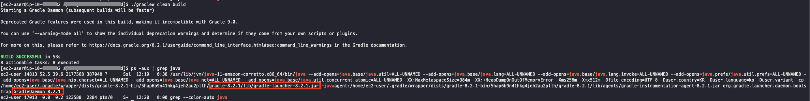
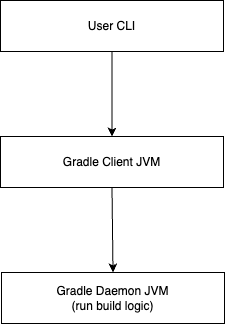
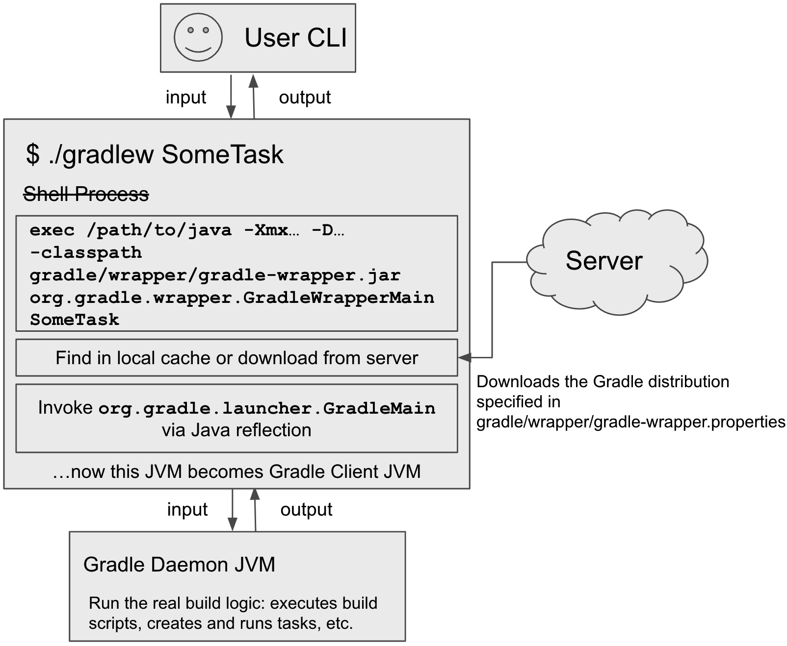

# 목차

<br>

- [목차](#목차)
- [Gradle 이해하기 3 - Gradle Daemon](#gradle-이해하기-3---gradle-daemon)
- [1 로컬 Gradle로 살펴보는 동작방식](#1-로컬-gradle로-살펴보는-동작방식)
  - [1-1 bin/gradle은 일반적인 스크립트를 실행한다](#1-1-bingradle은-일반적인-스크립트를-실행한다)
  - [1-2 Client와 Daemon](#1-2-client와-daemon)
- [2 Gradle Wrapper의 동작 방식](#2-gradle-wrapper의-동작-방식)
- [정리](#정리)
- [참고](#참고)

<br>

# Gradle 이해하기 3 - Gradle Daemon

Gradle을 실행하면 아래와 같이 Gradle Daemon이라는 프로세스가 JVM위에서 실행되고있는 것을 볼 수 있다.

<p align="center"> </p>

```text
데몬은 사용자가 직접적으로 제어하지 않고, 백그라운드에서 돌면서 여러 작업을 하는 프로그램을 말한다 

- 위키피디아 -
```

Gradle은 JVM 위에서 동작하며 Gradle을 처음 JVM에 올리는 초기화에는 꽤나 시간이 소요된다.

그래서 Gradle은 처음 Gradle 실행시 Gradle Daemon을 백그라운드에 일정 시간동안 실행시켜놓음으로써 두번째부터의 Gradle 빌드 시간을 줄여준다.

> 공식 문서에선 Gradle Daemon이 아래 이유들로 인해 build 시간을 줄여준다고 말한다.
>
> * caching project information across builds
> * running in the background so every Gradle build doesn’t have to wait for JVM startup
> * benefiting from continuous runtime optimization in the JVM
> * watching the file system to calculate exactly what needs to be rebuilt before you run a build

이번 글은 Gradle Daemon에 대해서 알아보고 Gradle이 어떻게 실행되고있는지 알아본다.

<br>

# 1 로컬 Gradle로 살펴보는 동작방식

Gradle을 실행하는 방법은 크게 두 가지가 있다.

* 로컬 Gradle설치 -> 설치 (컴퓨터에 전역적으로 사용할 Gradle을 설치하는 방법)
* Gradle Wrapper -> 무설치 (프로젝트 상위 디렉토리에 Gradle Wrapper를 사용하는 방법)

우선 로컬 Gradle로 Gradle을 실행할때의 동작 방식에 대해서 살펴본다.

<br>

## 1-1 bin/gradle은 일반적인 스크립트를 실행한다

로컬에 Gradle을 설치했다면 `./{Gradle 설치된 디렉토리}/bin/gradle`을 통해 실행한다.

그럼 **마술처럼 Gradle로 프로젝트를 빌드하게되는데, 사실 마법이 아닌 `gradle`파일에 정의된 스크립트를 실행하는 것이다.**

```shell
$ ./{Gradle 설치된 디렉토리}/bin/gradle <실행하고자하는 Task>
```

위 명령어를 입력하면 셸 프로세스가 시작되고 `gradle`의 아래 스크립트 코드를 실행한다.

<br>

<details>
  <summary>gradle.sh</summary>
  
  ---
  
  > 8.2.1 버전의 Gradle 스크립트
  ```shell
    #!/bin/sh

    #
    # Copyright © 2015-2021 the original authors.
    #
    # Licensed under the Apache License, Version 2.0 (the "License");
    # you may not use this file except in compliance with the License.
    # You may obtain a copy of the License at
    #
    #      https://www.apache.org/licenses/LICENSE-2.0
    #
    # Unless required by applicable law or agreed to in writing, software
    # distributed under the License is distributed on an "AS IS" BASIS,
    # WITHOUT WARRANTIES OR CONDITIONS OF ANY KIND, either express or implied.
    # See the License for the specific language governing permissions and
    # limitations under the License.
    #

    ##############################################################################
    #
    #   Gradle start up script for POSIX generated by Gradle.
    #
    #   Important for running:
    #
    #   (1) You need a POSIX-compliant shell to run this script. If your /bin/sh is
    #       noncompliant, but you have some other compliant shell such as ksh or
    #       bash, then to run this script, type that shell name before the whole
    #       command line, like:
    #
    #           ksh Gradle
    #
    #       Busybox and similar reduced shells will NOT work, because this script
    #       requires all of these POSIX shell features:
    #         * functions;
    #         * expansions «$var», «${var}», «${var:-default}», «${var+SET}»,
    #           «${var#prefix}», «${var%suffix}», and «$( cmd )»;
    #         * compound commands having a testable exit status, especially «case»;
    #         * various built-in commands including «command», «set», and «ulimit».
    #
    #   Important for patching:
    #
    #   (2) This script targets any POSIX shell, so it avoids extensions provided
    #       by Bash, Ksh, etc; in particular arrays are avoided.
    #
    #       The "traditional" practice of packing multiple parameters into a
    #       space-separated string is a well documented source of bugs and security
    #       problems, so this is (mostly) avoided, by progressively accumulating
    #       options in "$@", and eventually passing that to Java.
    #
    #       Where the inherited environment variables (DEFAULT_JVM_OPTS, JAVA_OPTS,
    #       and GRADLE_OPTS) rely on word-splitting, this is performed explicitly;
    #       see the in-line comments for details.
    #
    #       There are tweaks for specific operating systems such as AIX, CygWin,
    #       Darwin, MinGW, and NonStop.
    #
    #   (3) This script is generated from the Groovy template
    #       https://github.com/gradle/gradle/blob/HEAD/subprojects/plugins/src/main/resources/org/gradle/api/internal/plugins/unixStartScript.txt
    #       within the Gradle project.
    #
    #       You can find Gradle at https://github.com/gradle/gradle/.
    #
    ##############################################################################

    # Attempt to set APP_HOME

    # Resolve links: $0 may be a link
    app_path=$0

    # Need this for daisy-chained symlinks.
    while
        APP_HOME=${app_path%"${app_path##*/}"}  # leaves a trailing /; empty if no leading path
        [ -h "$app_path" ]
    do
        ls=$( ls -ld "$app_path" )
        link=${ls#*' -> '}
        case $link in             #(
        /*)   app_path=$link ;; #(
        *)    app_path=$APP_HOME$link ;;
        esac
    done

    # This is normally unused
    # shellcheck disable=SC2034
    APP_BASE_NAME=${0##*/}
    APP_HOME=$( cd "${APP_HOME:-./}.." && pwd -P ) || exit

    # Use the maximum available, or set MAX_FD != -1 to use that value.
    MAX_FD=maximum

    warn () {
        echo "$*"
    } >&2

    die () {
        echo
        echo "$*"
        echo
        exit 1
    } >&2

    # OS specific support (must be 'true' or 'false').
    cygwin=false
    msys=false
    darwin=false
    nonstop=false
    case "$( uname )" in                #(
    CYGWIN* )         cygwin=true  ;; #(
    Darwin* )         darwin=true  ;; #(
    MSYS* | MINGW* )  msys=true    ;; #(
    NONSTOP* )        nonstop=true ;;
    esac

    CLASSPATH=$APP_HOME/lib/gradle-launcher-8.2.1.jar


    # Determine the Java command to use to start the JVM.
    if [ -n "$JAVA_HOME" ] ; then
        if [ -x "$JAVA_HOME/jre/sh/java" ] ; then
            # IBM's JDK on AIX uses strange locations for the executables
            JAVACMD=$JAVA_HOME/jre/sh/java
        else
            JAVACMD=$JAVA_HOME/bin/java
        fi
        if [ ! -x "$JAVACMD" ] ; then
            die "ERROR: JAVA_HOME is set to an invalid directory: $JAVA_HOME

    Please set the JAVA_HOME variable in your environment to match the
    location of your Java installation."
        fi
    else
        JAVACMD=java
        if ! command -v java >/dev/null 2>&1
        then
            die "ERROR: JAVA_HOME is not set and no 'java' command could be found in your PATH.

    Please set the JAVA_HOME variable in your environment to match the
    location of your Java installation."
        fi
    fi

    # Increase the maximum file descriptors if we can.
    if ! "$cygwin" && ! "$darwin" && ! "$nonstop" ; then
        case $MAX_FD in #(
        max*)
            # In POSIX sh, ulimit -H is undefined. That's why the result is checked to see if it worked.
            # shellcheck disable=SC3045
            MAX_FD=$( ulimit -H -n ) ||
                warn "Could not query maximum file descriptor limit"
        esac
        case $MAX_FD in  #(
        '' | soft) :;; #(
        *)
            # In POSIX sh, ulimit -n is undefined. That's why the result is checked to see if it worked.
            # shellcheck disable=SC3045
            ulimit -n "$MAX_FD" ||
                warn "Could not set maximum file descriptor limit to $MAX_FD"
        esac
    fi

    # Collect all arguments for the java command, stacking in reverse order:
    #   * args from the command line
    #   * the main class name
    #   * -classpath
    #   * -D...appname settings
    #   * --module-path (only if needed)
    #   * DEFAULT_JVM_OPTS, JAVA_OPTS, and GRADLE_OPTS environment variables.

    # For Cygwin or MSYS, switch paths to Windows format before running java
    if "$cygwin" || "$msys" ; then
        APP_HOME=$( cygpath --path --mixed "$APP_HOME" )
        CLASSPATH=$( cygpath --path --mixed "$CLASSPATH" )

        JAVACMD=$( cygpath --unix "$JAVACMD" )

        # Now convert the arguments - kludge to limit ourselves to /bin/sh
        for arg do
            if
                case $arg in                                #(
                -*)   false ;;                            # don't mess with options #(
                /?*)  t=${arg#/} t=/${t%%/*}              # looks like a POSIX filepath
                        [ -e "$t" ] ;;                      #(
                *)    false ;;
                esac
            then
                arg=$( cygpath --path --ignore --mixed "$arg" )
            fi
            # Roll the args list around exactly as many times as the number of
            # args, so each arg winds up back in the position where it started, but
            # possibly modified.
            #
            # NB: a `for` loop captures its iteration list before it begins, so
            # changing the positional parameters here affects neither the number of
            # iterations, nor the values presented in `arg`.
            shift                   # remove old arg
            set -- "$@" "$arg"      # push replacement arg
        done
    fi


    # Add default JVM options here. You can also use JAVA_OPTS and GRADLE_OPTS to pass JVM options to this script.
    DEFAULT_JVM_OPTS='"-Xmx64m" "-Xms64m"'" \"-javaagent:$APP_HOME/lib/agents/gradle-instrumentation-agent-8.2.1.jar\""

    # Collect all arguments for the java command;
    #   * $DEFAULT_JVM_OPTS, $JAVA_OPTS, and $GRADLE_OPTS can contain fragments of
    #     shell script including quotes and variable substitutions, so put them in
    #     double quotes to make sure that they get re-expanded; and
    #   * put everything else in single quotes, so that it's not re-expanded.

    set -- \
            "-Dorg.gradle.appname=$APP_BASE_NAME" \
            -classpath "$CLASSPATH" \
            org.gradle.launcher.GradleMain \
            "$@"

    # Stop when "xargs" is not available.
    if ! command -v xargs >/dev/null 2>&1
    then
        die "xargs is not available"
    fi

    # Use "xargs" to parse quoted args.
    #
    # With -n1 it outputs one arg per line, with the quotes and backslashes removed.
    #
    # In Bash we could simply go:
    #
    #   readarray ARGS < <( xargs -n1 <<<"$var" ) &&
    #   set -- "${ARGS[@]}" "$@"
    #
    # but POSIX shell has neither arrays nor command substitution, so instead we
    # post-process each arg (as a line of input to sed) to backslash-escape any
    # character that might be a shell metacharacter, then use eval to reverse
    # that process (while maintaining the separation between arguments), and wrap
    # the whole thing up as a single "set" statement.
    #
    # This will of course break if any of these variables contains a newline or
    # an unmatched quote.
    #

    eval "set -- $(
            printf '%s\n' "$DEFAULT_JVM_OPTS $JAVA_OPTS $GRADLE_OPTS" |
            xargs -n1 |
            sed ' s~[^-[:alnum:]+,./:=@_]~\\&~g; ' |
            tr '\n' ' '
        )" '"$@"'

    exec "$JAVACMD" "$@"
  ```
  
  ---
</details>

<br>

스크립트의 중요한 부분만 정리하면 아래와 같다.

1. `java` 명령 실행을 위한 적절한 JRE를 찾고, 명령어에 넘길 파라미터를 결정한다.
2. 아래와 같이 `java`명령을 쉘로 실행한다
   ```shell
   exec /path/to/java -xmx... -D... -classpath /path/to/local/distribution/lib/gradle-launcher.jar org.gradle.launcher.GradleMain <실행하고자하는 Task>
   ```

<br>

이제 위 스크립트를 실행하는 프로세스는 JVM 프로세스로 변경되며, Gradle Client JVM의 첫 시작점은 [org.gradle.launcher.GradleMain](https://github.com/gradle/gradle/blob/acc6044325b11874e9626d98dec976a0e495cb62/subprojects/bootstrap/src/main/java/org/gradle/launcher/GradleMain.java) 클래스가 된다.

> 이번 글에서 `gradle.sh` 스크립트에서 실행된 JVM은 실제 빌드 로직을 실행하지않는 가벼운 JVM이라 `Gradle Client JVM`이라고 부르겠다.

Gradle Client JVM은 호환되는 Gradle 데몬을 검색하여 로컬 소켓을 통해 연결한다.

**이때 만약 Gradle Daemon이 실행되어있지않으면, Gradle Client JVM이 Daemon을 실행하고나서 연결한다.**

<br>

## 1-2 Client와 Daemon

JVM 관점에서 Gradle을 실행을 보면 아래와 같이 사용자의 요청을 처리한다.

<p align="center"> </p>

1. Gradle Client JVM에게 사용자 요청이 전달되고, Gradle Client JVM은 Gradle Daemon JVM에 요청을 포워딩한다.
2. Gradle Daemon JVM은 전달된 build script를 실행하고 결과를 다시 Gradle Client JVM에게 반환한다.
3. Build가 모두 실행되고나면 Gradle Client JVM은 종료되지만, Gradle Daemon JVM은 일정시간동안 Gradle를 계속 실행될 수 있게 데몬으로 계속 실행된다.

물론 예외적으로 `--no-daemon`을 Gradle에 전달하면 Client JVM이 Build 요구사항과 호환되는 경우 직접 Build를 실행한다.

이때, Client JVM가 Build 요구사항와 호환되지않는경우 새 일회용 JVM을 시작하고 Build를 진행하고나서 종료시킨다.

<br>

# 2 Gradle Wrapper의 동작 방식

Gradle Wrapper는 실제 Gradle에서도 추천하는 Gradle 실행 방식이다.

```shell
./gradlew <실행하고자하는 Task>
```

위와 같이 실행하면 [로컬 Gradle](#1-1-bingradle은-일반적인-스크립트를-실행한다)에서와 동일하게 gradle 쉘 스크립트를 실행한다.

<p align="center"><br>출처: https://blog.gradle.org/how-gradle-works-1 </p>

차이점이라면 빌드시 `gradle/wrapper/gradle-wrapper.jar`를 실행시켜 JVM에 Gradle Daemon 실행을 위한 프로세스를 올린다는 것이다.

JVM에 해당 프로세스가 실행되면 `gradle/wrapper/gradle-wrapper.properties`에 선언된 특정 버전의 Gradle 배포를 찾아 다운로드한다.

그리고 로컬 Gradle과 동일하게 JVM내에서 Gradle Daemon을 실행하고 Build를 진행한다.

> Gradle Wrapper JVM의 시작점은 [org.gradle.wrapper.GradleWrapperMain](https://github.com/gradle/gradle/blob/acc6044325b11874e9626d98dec976a0e495cb62/subprojects/wrapper/src/main/java/org/gradle/wrapper/GradleWrapperMain.java)이다.

<br>

# 정리

이번 글은 JVM에서 Gradle이 어떻게 실행되는지 간단히 살펴보았다.

다음 글은 Gradle이 실제 Build Script를 어떤 방식으로 실행하는지 살펴본다.

<br>

# 참고
* https://docs.gradle.org/current/userguide/gradle_daemon.html
* https://blog.gradle.org/how-gradle-works-1

