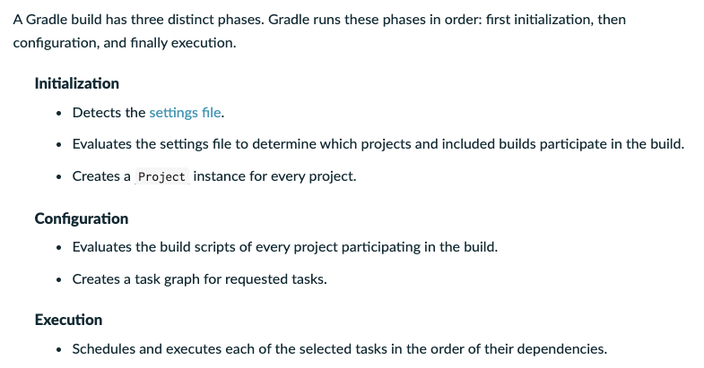
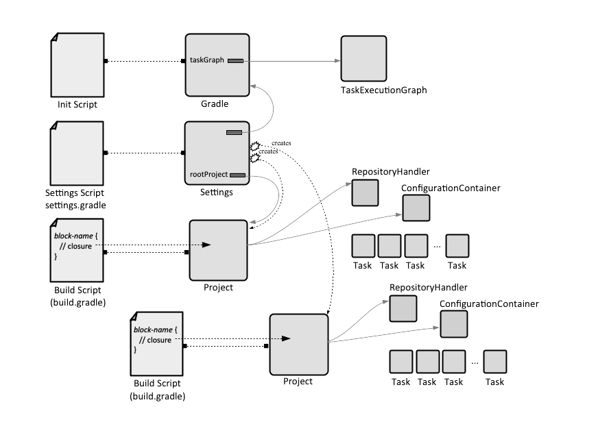
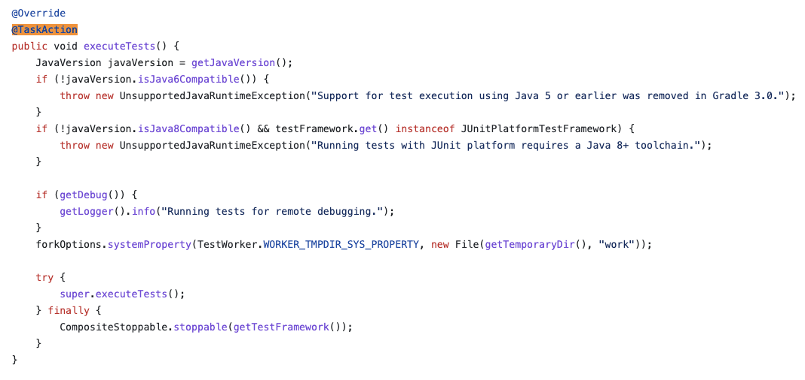
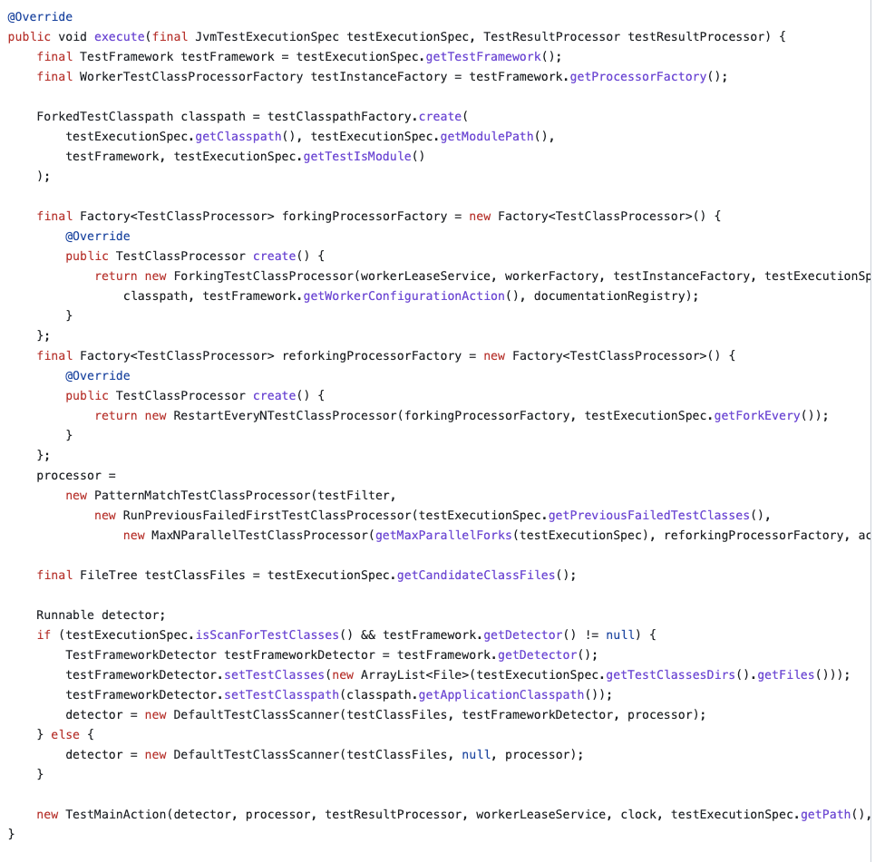
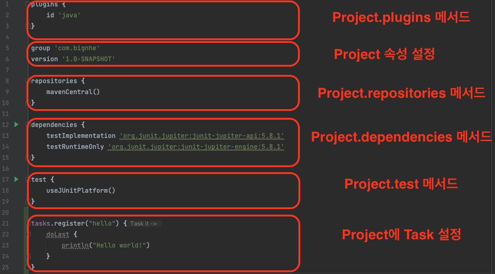

# 목차

<br>

- [목차](#목차)
- [Gradle 이해하기 4 - Build Phases (LifeCycle)](#gradle-이해하기-4---build-phases-lifecycle)
- [1 Initialization - 초기화](#1-initialization---초기화)
- [2 Configuration - 설정](#2-configuration---설정)
- [3 Execution - 실행](#3-execution---실행)
- [4 빌드 파일로 이해하는 빌드 단계](#4-빌드-파일로-이해하는-빌드-단계)
- [5 build.gradle과 Project](#5-buildgradle과-project)
- [참고](#참고)

<br>

# Gradle 이해하기 4 - Build Phases (LifeCycle)

[이전 글 - Gradle Daemon](./Gradle_이해하기_3_Gradle_Daemon.md)에선 Gradle을 실행하면 어떤 환경에서 어떻게 실행되는지 살펴보았다.

정리하면 `./gradlew <Task>`를 호출하면 Gradle Client JVM이 실행되면서 Gradle Daemon JVM에 소켓으로 연결후, 필요한 빌드 정보를 보내어 Daemon이 이를 실행한다는 것이다.

이제 이번 글은 Gradle Daemon JVM이 사용자의 빌드 요청을 받고 어떻게 처리하는지 살펴본다.

[공식 문서](https://docs.gradle.org/current/userguide/build_lifecycle.html)에 따르면 Gradle Daemon JVM은 사용자의 빌드 요청을 받고 아래 단계로 빌드를 실행한다.

<p align="center"> </p>

이번 글은 위 3단계에서 단계 별로 사용자의 빌드 요청을 어떻게 처리하는지 알아본다.

<br>

# 1 Initialization - 초기화

이 단계에서의 Gradle은 빌드 프로세스와 관련된 모든 프로젝트를 식별하고 빌드에 필요한 객체들을 생성한다.

다시 말해, Gradle Daemon은 사용자 요청으로부터 빌드하는데 필요한 정보를 모두 받아서 **빌드를 위한 기초가 되는 객체들을 생성한다.**

**이때 `settings.gradle` 파일을 확인하여 Single 프로젝트 빌드인지 Multi 프로젝트 빌드인지 파악하며, 그에 맞는 객체들을 초기화 및 생성한다.**

Initialization 단계에서 Gradle은 각 프로젝트에 해당하는 [Project](https://github.com/gradle/gradle/blob/6121fa83ce4ac07a27ee043d8e69b0f5f99d1c49/subprojects/core-api/src/main/java/org/gradle/api/Project.java) 인스턴스를 생성한다.

> 오해하면 안되는게 생성만 할 뿐, 빌드 스크립트 (`build.gradle`)를 읽어 Project의 속성이나 Task를 설정하진 않는다.
> 
> 그리고 Gradle Daemon은 JVM위에서 동작하기에 이 객체들은 모두 JAVA 객체다.

<br>

💁‍♂️ **빌드에 기초가 되는 대표적인 객체 - `Gradle`, `Setting`, `Project`**

* [Gradle](https://github.com/gradle/gradle/blob/ba32027bf0656be5c8a71e6281939ff410a9cf1a/subprojects/core-api/src/main/java/org/gradle/api/invocation/Gradle.java)
  * Gradle 빌드 자체를 표현하는 객체이다.
  * Gradle 버전등 정보, 전체 Project 정보, 전체 TaskGraph (순서 포함)등을 표현한다.
* [Setting](https://github.com/gradle/gradle/blob/fd341b1e7016ff0ba82995b4e3211fb6e6805dd4/subprojects/core-api/src/main/java/org/gradle/api/initialization/Settings.java)
  * `settings.gradle`를 읽어 어떤 Project가 빌드에 참여하고 어떤 계층 구조를 가지는지 선언하는 객체이다.
  * Project 객체를 생성하진 않고, 어떤 객체가 생성되어야하는지 설정하는 객체.
* [Project](https://github.com/gradle/gradle/blob/6121fa83ce4ac07a27ee043d8e69b0f5f99d1c49/subprojects/core-api/src/main/java/org/gradle/api/Project.java)
  * 빌드하려는 각 Project의 `build.gradle`를 읽어 생성되는 Project 객체이다.

<br>

# 2 Configuration - 설정

이 단계에서의 Gradle은 이전 단계 (Initialization)에서 식별하고 생성한 각 Project에 정의된 빌드 스크립트 (`build.gradle`)를 실행한다.

**정말 말 그대로 인터프리터로 빌드 스크립트 (`build.gradle`)의 내용을 위에서 아래로 한 줄씩 실행한다.**

> build.gradle
```gradle
repositories {
    mavenCentral()
}
```

예를 들어 빌드 스크립트에 위 내용이 존재한다면, `mavenCentral()`이라는 `Closure` 인스턴스 (JAVA의 함수형과 유사)를 생성하고 `Project` 인스턴스 `Project.repositories(Closure)`에 `mavenCentral()`를 전달한다.

이는 해당 Project의 Task를 실행할 때 필요한 내용들을 설정하는 과정이라고 보면 된다.

<br>

**헷갈리면 안되는 것이 Project의 빌드 스크립트 (`build.gradle`)의 명시된 설정들을 실행하여 빌드에 필요한 설정들을 하는 것일 뿐, Task를 실행하는 것은 아니다.**

**Task를 실행하는 것이 아닌 빌드 스크립트를 평가하면서 Task를 식별하고 DAG를 설정하는 단계이다.**

<p align="center"><br>출처: https://docs.gradle.org/current/userguide/what_is_gradle.html </p>

<br>

예를 들어 `hello` 라는 Task를 Project에 등록하고 싶다면 아래 내용을 빌드 스크립트에 추가하면 된다.

> build.gradle
```gradle
tasks.register("hello") {
    doLast {
        println("Hello World!")
    }
}
```

그러면 이 Configuration 단계에서 위 스크립트를 읽고 Project의 컨테이너 클래스 (`TaskContainer`)에 `hello`라는 작업을 등록하게된다.

다음 단계에서 Task가 실행되는데, 그때 `hello` Task를 실행시키면 `Hello World!`가 출력된다.

<br>

**이 단계를 정리하면 빌드 스크립트를 한 줄 한 줄 실행하면서 빌드에 필요한 데이터 구조 (DAG)와 설정 데이터를 구성하는 단계이다.**

<p align="center"><br>표준 빌드 구성 스크립트<br>출처: https://kb.novaordis.com/index.php/Gradle_Concepts </p>

**한가지 중요한 점은 빌드에 필요한 데이터 구조와 설정하는데 스크립트 코드를 작성한다는 것이다.**

일반적인 설정 파일이 아닌 코드를 작성하기때문에 다양한 방면에서 활용할 수 있다.

<br>

# 3 Execution - 실행

**Gradle은 마지막으로 이전 단계에서 생성된 Project 객체의 DAG를 기반으로 요청으로 들어온 Task를 식별하고 종속성 순서에 따라 실행하게된다.**

모든 빌드 작업과 활동은 실제로 이 단계에서 수행된다고 보면 된다. 

> **예시: 컴파일, 파일 복사, 빌드 디렉토리 정리, 아카이브 업로드, 파일 아카이브 등등**

<br>

**모든 Task는 실행할 작업들을 코드로 가지고있는다. Task를 실행하면 순서에 따라 해당 코드를 실행시키는 것 뿐.**

예를 들어, `test` Task가 어떻게 실행되는지 살펴보고 싶다면 [Test](https://github.com/gradle/gradle/blob/a45bfed1cd64efe32d8ca4f4414250247d5b3738/subprojects/testing-jvm/src/main/java/org/gradle/api/tasks/testing/Test.java) 객체의 `@TakeAction` 부분을 살펴보면 된다.

<p align="center"> </p>

**이와 같이 Gradle Daemon JVM은 위 코드를 실행하면서 Task를 실행하는 것이다. (일반적인 자바 코드다.)**

<details>
  <summary>test Task 실행하는 코드</summary>
  
  ---
  
  <p align="center"> </p>

  언뜻보면 test 클래스패스에 존재하는 파일들을 모두 스캔하고 테스트 프레임워크로 실행하는 것을 알 수 있다.
  
  ---
</details>

<br>

# 4 빌드 파일로 이해하는 빌드 단계

아래 예시는 빌드 파일을 통해 각 빌드 단계에서 어떤 것을 실행하는지 말해준다.

<br>

> settings.gradle
```gradle
rootProject.name = 'binghe-basic'
println 'Initialization 단계에서 실행된다.'
```

<br>

> build.gradle
```gradle
println 'Configuration 단계에서 실행된다.'

tasks.register('configured') {
    println '이 부분은 Task를 정의하는 부분이므로, Configuration 단계에서 실행된다.'
}

tasks.register('test') {
    doLast {
        println 'Execution 단계에서 실행된다.'
    }
}

tasks.register('testBoth') {
	  doFirst {
	    println 'Execution 단계에서 testBoth Task의 첫번째로 실행된다.'
	  }
	  doLast {
	    println 'Execution 단계에서 testBoth Task의 마지막에 실행된다.'
	  }
	  println 'testBoth는 빌드에서 사용되기 때문에 Configuration 단계에서 실행된다.'
}
```

<br>

# 5 build.gradle과 Project

> 중요한 내용이라 한번 더 정리한다.

**Gradle은 Initialization 단계**에서 Project를 식별하고 객체를 생성한다. 

<br>

그리고 **Configuration 단계**에서 빌드 스크립트 (`build.gradle`)를 한 줄 한 줄 실행하면서 Project의 Task를 수행하기 위한 모든 메서드와 속성들을 설정한다.

> **`build.gradle` 파일 자체는 `Project` 객체라고 보면 되며, `Project` 객체는 Project의 Task를 수행하기위한 모든 메서드와 속성들을 모아놓는 슈퍼 객체라고 보면 된다.**

<p align="center"> </p>

즉, 위와 같이 `build.gradle`에 작성한 수많은 스크립트 코드들은 모두 `Project`객체의 메서드와 속성이 된다.

> `{}`로 감싸진 부분은 메서드의 인자로 받아지는 Groovy의 클로저 (Closure)다. 자바의 람다와 같다고 보면 된다.

<br>

마지막으로 `./gradlew <Task>`와 같이 사용자 요청으로 들어온 `<Task>`를 실행한다.

<br>

# 참고
* https://docs.gradle.org/current/userguide/build_lifecycle.html
* https://proandroiddev.com/understanding-gradle-the-build-lifecycle-5118c1da613f
* https://blog.gradle.org/how-gradle-works-2
