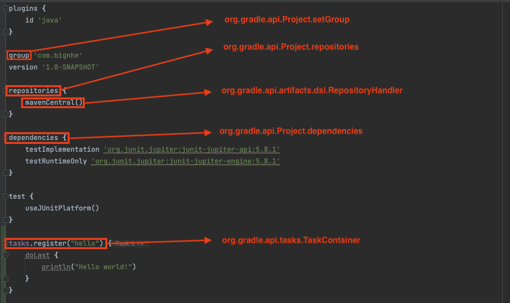
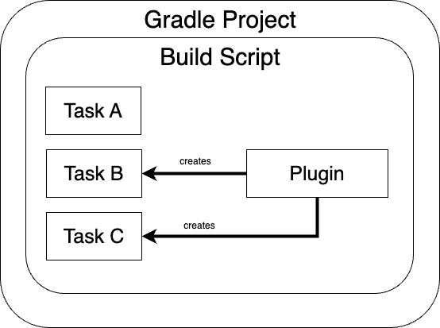
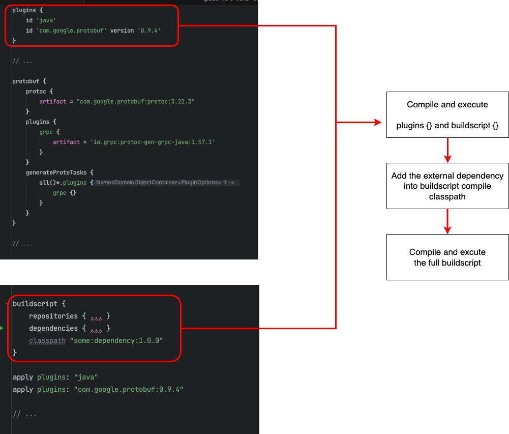
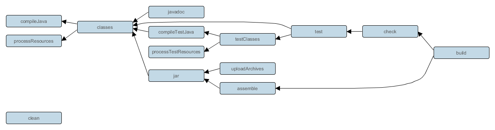

# 목차

<br>

- [목차](#목차)
- [Gradle 이해하기 5 - Build Script](#gradle-이해하기-5---build-script)
- [1 Groovy DSL 이해하기](#1-groovy-dsl-이해하기)
  - [1-1 Groovy DSLs과 코틀린 DSLs](#1-1-groovy-dsls과-코틀린-dsls)
  - [1-2 Domain-Specific Languages](#1-2-domain-specific-languages)
    - [Closure/Lambda](#closurelambda)
    - [Chained Method](#chained-method)
- [2 projects, build scripts, tasks, plugins](#2-projects-build-scripts-tasks-plugins)
  - [2-1 Task](#2-1-task)
    - [Task 생성](#task-생성)
    - [기존 존재하는 Task 설정](#기존-존재하는-task-설정)
    - [TASK 의존성 설정 (DAG)](#task-의존성-설정-dag)
    - [Task Action](#task-action)
    - [Task 건너 뛰기](#task-건너-뛰기)
  - [2-2 Plugin](#2-2-plugin)
    - [Plugin 개념](#plugin-개념)
- [참고](#참고)

<br>

# Gradle 이해하기 5 - Build Script

[이전 글](./Gradle_이해하기_4_Build_Phases.md)에서 알아보았듯이, Gradle은 Configuration 단계에서 빌드 스크립트 (`build.gradle`)를 실행하면서 빌드하는데 필요한 데이터 구조와 설정을 진행한다.

이번 글은 빌드 스크립트 (`build.gradle`)에 대해서 알아보고자한다.

<br>

# 1 Groovy DSL 이해하기

<br>

## 1-1 Groovy DSLs과 코틀린 DSLs

Gradle로 생성된 자바 프로젝트는 아래와 같은 빌드 스크립트를 가진다.

> build.gradle

```gradle
plugins {
    id 'java'
}

group 'com.bignhe'
version '1.0-SNAPSHOT'

repositories {
    mavenCentral()
}

dependencies {
    testImplementation 'org.junit.jupiter:junit-jupiter-api:5.8.1'
    testRuntimeOnly 'org.junit.jupiter:junit-jupiter-engine:5.8.1'
}

test {
    useJUnitPlatform()
}
```

위 코드는 어떤 언어일까?

바로 Groovy라는 프로그래밍 언어다! 

> `.gradle.kts`의 경우 코틀린, `.gradle`의 경우 Groovy.

그리고 빌드 스크립트의 경우 코틀린과 Groovy의 [DSLs](https://en.wikipedia.org/wiki/Domain-specific_language) (Domain Specific Language)로 작성된다.

그러므로 빌드 스크립트를 이해하는데 가장 첫번째는 이 두 언어의 DSLs의 특징을 이해하는 것이다.

> 이번 글에선 Groovy를 기준으로만 알아본다.

<br>

## 1-2 Domain-Specific Languages

빌드 스크립트는 Groovy나 코틀린 도메인에 특화된 코드를 작성해야한다.

그러므로 각 언어의 특화된 규칙을 이해하는 것이 중요하다.

> 이번 글에선 Groovy를 기준으로만 알아본다. [공식 문서 1](https://groovy-lang.org/semantics.html), [공식 문서 2](http://docs.groovy-lang.org/docs/latest/html/documentation/core-domain-specific-languages.html#_command_chains)

<br>

### Closure/Lambda

💁‍♂️ **`{ ... }`는 `function() {...}`와 동일한 의미다.**

`{ ... }`는 Groovy에서 조금 특별한 객체다. 흔히 다양한 언어에서 사용하는데, Groovy에선 이는 [Closure](https://groovy-lang.org/closures.html)라고 부른다.

자바의 lambda, JS의 function 객체와 유사하다.

<br>

예를 들면.

> build.gradle
```gradle
// 실제 사용되는 예시
plugins {
    ...
}

// 풀어 생각해보면 아래와 같다.
plugins (function() {
    ...
})
```

<br>

💁‍♂️ **함수의 마지막 매개변수가 Closure라면 괄호 밖에 놓을 수 있다.**

> build.gradle
```gradle
task.register("myTask") {
    ...
    doLast {
        ...
    }
}
```

는 아래와 동일하다고 볼 수 있다.

```gradle
tasks.register("myTask", function () {
    ...
    doLast(function() {
        ...
    })
})
```

<br>

### Chained Method

Groov DSLs는 최상위 문에 대한 메서드 호출시 인수 주위에 괄호를 생략할 수 있다.

예를 들어, `plugins`의 매개변수로 `id "some.plugin" version "0.0.1"`를 매개변수로 넘기는데 이는 `id("some.plugin").version("0.0.1")`과 같은 의미이다.

이에 대해서 공식문서에선 아래와 같은 예시를 보여준다.

```gradle
// equivalent to: turn(left).then(right)
turn left then right

// equivalent to: take(2.pills).of(chloroquinine).after(6.hours)
take 2.pills of chloroquinine after 6.hours

// equivalent to: paint(wall).with(red, green).and(yellow)
paint wall with red, green and yellow

// with named parameters too
// equivalent to: check(that: margarita).tastes(good)
check that: margarita tastes good

// with closures as parameters
// equivalent to: given({}).when({}).then({})
given { } when { } then { }
```

<br>

# 2 projects, build scripts, tasks, plugins

Build Script를 작성할 때 핵심이되는 4가지 개념에 대해서 간단히 정리하고 넘어간다.

<br>

💁‍♂️ **build script는 위에서부터 한 줄 한 줄 아래로 코드가 실행된다.**

[이전 글 - Build Phase](./Gradle_이해하기_4_Build_Phases.md)에서 살펴보았듯이, **Gradle은 Configuration 단계에서 빌드 스크립트 (`build.gradle`)를 한 줄 한 줄 실행하면서 Project의 Task를 수행하기 위한 모든 메서드와 속성들을 설정한다.**

<p align="center"> </p>

그래서 `build.gradle` 파일 자체는 `Project` 객체라고 보면 되며, `Project` 객체는 `Project`의 Task를 수행하기위한 모든 메서드와 속성들을 모아놓는 슈퍼 객체라고 보면 된다.

> 참고로 빌드 스크립트도 JVM에서 실행되기 때문에, 실행전에 바이트코드로 컴파일되어야한다.

<br>

💁‍♂️ **projects, build script, tasks, plugins 관계**

<p align="center"> </p>

각 Project는 하나의 build script를 실행시켜 task들을 실행하기위한 데이터 구조와 속성을 설정한다. (**Project 1 : N Task**)

자바코드 컴파일하는 Task나 클래스파일로부터 실행파일을 만드는 Task등 자바 애플리케이션 혹은 기타 다른 애플리케이션의 Task를 매번 작성하는 것은 비효율적이다.

이런경우 Plugin을 apply하면 자동으로 관련된 Task를 추가해준다. (**Plugin 1 : N Task**)

<br>

## 2-1 Task
> https://docs.gradle.org/current/dsl/org.gradle.api.Task.html

<br>

💁‍♂️ **Task 개념과 실행**

각 Project엔 여러 Task가 존재하며, Task는 Gradle 프로젝트의 작업 단위이다.

<br>

예를 들면, 자바 애플리케이션을 실행하는데 필수적으로 필요한 작업은 아래와 같다.

* 자바 코드(`.java`) 파일을 컴파일해서 클래스 파일 (`.class`)로 만드는 작업
* 클래스 파일 (`.class`)파일을 패키징해서 실행 파일 (`.jar`)로 만드는 작업

이런 하나하나의 작업을 Task라고한다. 그리고 이러한 작업은 아래와 같이 실행할 수 있다.

```gradle
$ ./gradlew <task-name>
```

<br>

### Task 생성

<br>

💁‍♂️ **일반적인 Task 생성**

```gradle
task hello {
    println ("[configuration 단계] Hello World")

    doLast {
        println("[Execution 단계] Hello World")
    }
}

tasks.register("hello") {
    println ("[configuration 단계] Hello World")

    doLast {
        println("[Execution 단계] Hello World")
    }
}
```

> 이외에도 다양한 방법이 존재한다. 필요에 따라서 찾아보면 될 듯 하다.

<br>

### 기존 존재하는 Task 설정
실제 프로젝트에선 실제로 Task를 직접 커스텀할 상황은 많지 않다. 그 이유는 Gradle엔 이미 수많은 Task가 정의되어있기때문이다.

<br>

💁‍♂️ **Gradle엔 이미 수많은 Task가 정의되어있다.**

Gradle엔 이미 애플리케이션을 빌드하는데 필요한 수많은 Task가 정의되어있으며, 기본적으로 빌드 파일(`build.gradle`)에 import된 상태이다.

> 정확히는 `Project`객체의 TaskContainer안에 이미 많은 Task가 정의되어있다.

[DSL API에서 Task types](https://docs.gradle.org/current/dsl/index.html)에 정의된 다양한 Task를 설정만 바꿔서 활용하는 경우 테스크를 다음처럼 등록할 수 있다.

```gradle
tasks.register('<테스크-이름>', TaskClass) {
    // 테스크 설정
}
```

<br>

💁‍♂️ **예시 1 - copy**

copy도 이미 Project 객체안에 정의되어있으며, 이를 아래와 같이 설정을 오버라이딩하여 `copy` Task가 실행되었을 때의 동작을 컨트롤할 수 있다.

```gradle
task copyFile(type: Copy) {
    from '{file 위치}'
    include '{포함할 파일 확장자'
    into '{file 위치}'
}

// 예시
task copySubmodule(type: Copy) {
    from './security'
    include '*.yml'
    into './src/main/resources'
}

tasks.register('<task-name>', Copy) {
    from '{file 위치}'
    includ '{포함할 파일 확장자}
    into "{file 위치}}"
}
```

<br>

> **repositories, dependencies, configure 모두 이 방식대로 기존에 Project에 정의된 Task 설정을 오버라이딩하는 것이다.!!! - 중요**

<br>

### TASK 의존성 설정 (DAG)

Gradle은 Task간의 의존성을 설정하여 DAG를 구성할 수 있다.

<br>

💁‍♂️ **task의 의존성은 `dependsOn`을 통해 설정할 수 있다.**

```gradle
task a {
    doFirst {
        println "A"
    }
}

// dependsOn #1
task b {
    dependsOn a
    doFirst {
        println "B"
    }
}

// dependsOn #2
task c (dependsOn: 'b') {
    doFirst {
        println "C"
    }
}

task d {
    doFirst {
        println "D"
    }
}

// dependsOn #3
task e (dependsOn: ['c', 'd']) {
    doFirst {
        println "E"
    }
}
```

`dependsOn ${Task}`에 정의된 Task가 먼저 실행되고나서, dependsOn을 설정한 Task가 실행된다.

* `Task d` 실행시 -> A, B, C 순으로 출력된다.

<br>

여러개의 dependsOn이 한 task에 존재한다면 그 순서는 보장되지 않는다. 순서에 보장된 task를 실행하기 위해서는 `mustAfterRun`` 을 통해서 정의해야한다.

<br>

### Task Action

💁‍♂️ **Task는 일련의 [Action](https://docs.gradle.org/current/javadoc/org/gradle/api/Action.html) 객체로 구성된다.**

Task가 실행되면 Task에 정의된 `Action.execute(T)`를 호출하여 각 Task를 차례로 실행하게된다. 

Task.doFirst(org.gradle.api.Action) 또는 Task.doLast(org.gradle.api.Action)를 호출하여 작업에 작업을 추가할 수 있다.

<br>

💁‍♂️ **혹은 아래와 같이 Task 객체를 직접 구현하여 Action을 설정해줄 수 있다.**

```gradle
abstract class GreetingTask extends DefaultTask {
    @TaskAction
    def greet() {
        println 'hello from GreetingTask'
    }
}

// Create a task using the task type
tasks.register('hello', GreetingTask)

# execute
> gradle -q hello
hello from GreetingTask
```

<br>

또 다른 예시

```gradle
abstract class GreetingTask extends DefaultTask {
    @Input
    abstract Property<String> getGreeting()

    GreetingTask() {
        greeting.convention('hello from GreetingTask')
    }

    @TaskAction
    def greet() {
        println greeting.get()
    }
}

// Use the default greeting
tasks.register('hello', GreetingTask)

// Customize the greeting
tasks.register('greeting',GreetingTask) {
    greeting = 'greetings from GreetingTask'
}

# execute
> gradle -q hello greeting
hello from GreetingTask
greetings from GreetingTask
```

> 관련해서는 [공식 문서](https://docs.gradle.org/current/userguide/custom_tasks.html#sec:writing_a_simple_task_class)를 참고.


<br>

### Task 건너 뛰기

<br>

💁‍♂️ **onlyif**

Task에 `onlyif`를 설정하면 True일 경우에만 실행한다. 하나라도 false인 경우 skip한다.

```gradle
// hello task에 대해
hello.onlyIf { !project.hasProperty('skipHello') }
 
// 실행시 skipHello 프라퍼티 지정
gradle hello -PskipHello 
```

> task 생성시 정의할 때 onlyif를 설정해도 된다.

<br>

## 2-2 Plugin

<br>

### Plugin 개념

<br>

💁‍♂️ **Plugin은 Task의 모음이다**

자바코드 컴파일하는 Task나 클래스파일로부터 실행파일을 만드는 Task등 자바 애플리케이션 혹은 기타 다른 애플리케이션의 Task를 매번 작성하는 것은 비효율적이다.

이런경우 Plugin을 apply하면 자동으로 관련된 Task를 추가해준다. (**Plugin 1 : N Task**)

즉, **Plugin은 Project에 자동으로 Task를 추가해준다.**
 
<br>

💁‍♂️ **Plugin = 빌드 스크립트의 외부 종속성**

**Plugin은 다른 의미로 빌드 스크립트의 외부 종속성을 추가하는 것과 같다고 볼 수 있다.**

즉, 빌드 스크립트에서 사용되는 여러 Task를 정의하기위해선 외부 종속성을 먼저 가져와야한다.

<p align="center"> </p>

**그래서 위와 같이 `plugins`와 `buildscript`는 빌드 스크립트에서 가장 먼저 컴파일 및 실행된다.**

<br>

💁‍♂️ **자바 플러그인으로 이해하는 플러그인**

Gradle로 자바를 빌드할 때 아래와 같이 plugin을 설정한다.

<br>

> build.gradle
```gradle
plugins {
    id 'java'
}
...
```

이렇게 플러그인을 추가해주면, `build`, `jar`, `test`, `clean`, `assemble`등등 수 많은 자바 애플리케이션 빌드에 필요한 Task가 추가된다.

<p align="center"><br>java plugin 추가시 생성되는 Task들의 의존 관계<br>출처: https://docs.gradle.org/current/userguide/java_plugin.html </p>

> 더 자세한 내용은 [공식 문서](https://docs.gradle.org/current/userguide/java_plugin.html) 참고.

<br>

# 참고
* https://medium.com/@andrewMacmurray/a-beginners-guide-to-gradle-26212ddcafa8
* https://blog.gradle.org/how-gradle-works-3
* https://docs.gradle.org/current/userguide/more_about_tasks.html
* https://docs.gradle.org/current/dsl/org.gradle.api.Task.html
* https://docs.gradle.org/current/dsl/org.gradle.api.DefaultTask.html
* https://docs.gradle.org/current/userguide/java_plugin.html


