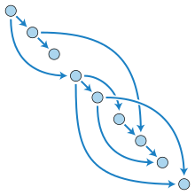
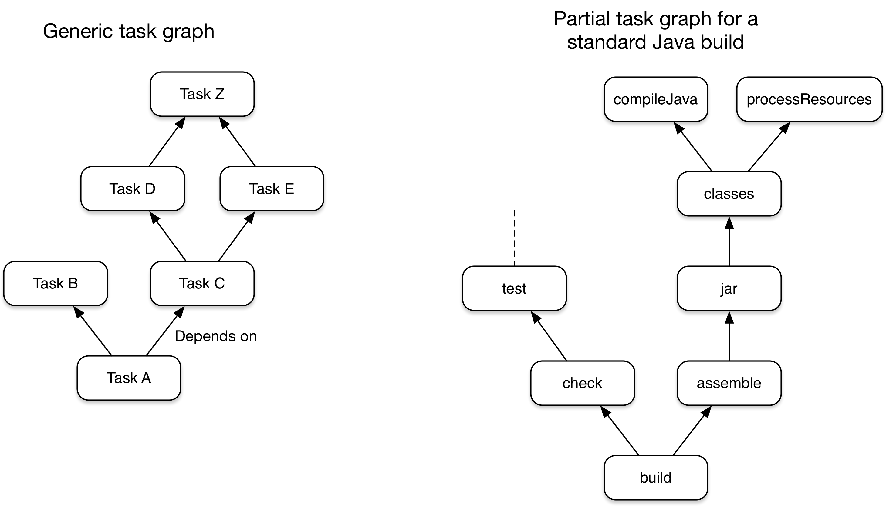

# 목차

 

- [목차](#목차)
- [개요](#개요)
- [Gradle란?](#gradle란)
  - [Gradle 소개](#gradle-소개)
  - [Gradle 특징](#gradle-특징)
- [Gradle에 대해 꼭 알아야 할 5가지 사항](#gradle에-대해-꼭-알아야-할-5가지-사항)
  - [1 - Gradle은 범용 빌드 도구이다.](#1---gradle은-범용-빌드-도구이다)
  - [2 - 핵심 모델은 작업을 기반으로 한다.](#2---핵심-모델은-작업을-기반으로-한다)
  - [3 - Gradle은 고정 빌드 단계가 있다.](#3---gradle은-고정-빌드-단계가-있다)
  - [4 - Gradle은 여러 가지 방법으로 확장할 수 있다.](#4---gradle은-여러-가지-방법으로-확장할-수-있다)
  - [5 - Build scripts operate against an API](#5---build-scripts-operate-against-an-api)
- [참고](#참고)

 

# 개요
필자의 주변 개발자들은 자바 혹은 스프링을 사용하면 빌드 툴로 Gradle을 많이 사용한다.

필자 또한 프로젝트를 진행하며 Gradle을 디폴트로 사용한다.

사용한 기간은 꽤 되지만.. 그저 플러그인 추가, 의존성 추가 그리고 몇 가지 설정 (ex. Jacoco, Sonarqube)등만을 예시를 찾아가며 사용했다..

그러다보니 다른 팀원이 작성하거나 수정한 Gradle을 이해하기 힘들었다..

이번 글은 Gradle이란 무엇이며, 무엇을 추구하는지 정리해보고자 한다.

> 이 글은 [Gradle docs - What is Gradle?](https://docs.gradle.org/current/userguide/what_is_gradle.html)을 번역하고 살을 조금 붙인 글입니다.

 

# Gradle란?
우선 Gradle이란 무엇인지 간단히 알아보자.

 

## Gradle 소개
* Gradle은 거의 모든 유형의 소프트웨어를 빌드할 수 있을 만큼 유연하도록 설계된 **오픈 소스 빌드 자동화 도구**이다.
* Gradle은 Ant와 Maven의 단점을 버리고 장점을 취한 빌드 도구이다. 즉, Ant와 Maven의 기능을 모두 포함한다.
  * Ant의 장점과 단점
    * 장점: 개발자가 자유롭게 빌드 단위를 지정할 수 있다. (빌드 단위 간의 의존 관계를 자유롭게 설정할 수 있다는 의미.)
    * 단점: 자유도가 높아서 잘 활용하면 좋지만, 그렇지 않은 경우 애물단지이다.
  * Maven의 장점
    * 장점: Convention Over Configuration(COC) 전략에 따라 프로젝트 빌드 과정에 대한 많은 부분이 이미 관례로 정해져있다.
      * `project home/pom.xml`, `project home/target 디렉토리`(빌드 파일), `project home/src 디렉토리`(개발 코드와 테스트 코드)등등
    * 단점: COC 전략은 특수한 상황에서 충분히 유연하지 못하다.
  * Gradle은 Ant의 자유도와 Maven의 관례 장점을 모두 합쳤다.
    * 또한, Ant와 Maven이 가진 XML에 대한 이슈도 Groovy라는 언어로 해결했다.

 

## Gradle 특징
* 고성능
  * Gradle은 입력 또는 출력이 변경되기 때문에 실행해야 하는 작업만 실행함으로써 불필요한 작업을 피한다.
  * 빌드 캐시를 사용하여 이전 실행 또는 다른 시스템의 작업 출력을 재사용할 수도 있다.
* JVM
  * **Gradle은 JVM위에서 동작한다.** 그러므로 JDK가 꼭 설치되어 있어야 한다. JVM의 장점을 그대로 흡수한다.
  * 커스텀 task type이나 plugin과 같은 빌드 로직에서 표준 Java API를 사용할 수 있다. (자바와 친숙하다.)
* 컨벤션
  * Gradle은 Maven의 장점인 관례를 가져와서 일반적인 유형의 프로젝트를 규약을 구현하여 쉽게 구축할 수 있다. (일정한 컨벤션을 제공한다.)
  * 이를 통해, 적절한 플러그인을 적용하면 많은 프로젝트에 슬림한 빌드 스크립트를 쉽게 사용할 수 있다.
  * 물론, 이는 꼭 해당 관례를 따라야한다고 강제하진 않는다.

 

# Gradle에 대해 꼭 알아야 할 5가지 사항
Gradle은 유연하고 강력한 빌드 도구이다. 하지만, 처음 접하는 사람들은 쉽게 이해하지 못하는 경우가 많다. (나도 그랬다...)

Gradle 공식 문서에서는 5가지 사항에 대해 이해하면 Gradle이 쉽게 느껴진다고 말한다.

 

## 1 - Gradle은 범용 빌드 도구이다.
> Gradle is a general-purpose build tool

* Gradle은 모든 소프트웨어를 빌드할 수 있다.
  * Gradle을 사용하면 빌드하려는 대상이나 수행 방법에 대한 자세한 내용을 담지 않기 때문이다. (대상을 가정하지 않는다.)
* Gradle을 사용하면 일반적인 유형의 프로젝트를 쉽게 빌드할 수 있다.
  * 예를 들어, 자바 라이브러리는 `plugins`이라는 기능 레이어에 추가하면 쉽게 구성할 수 있다.
  * 또한, 커스텀 `plugin`을 만들어 게시하여 고유한 규칙을 캡슐화하고 기능을 빌드할 수도 있다.

 

## 2 - 핵심 모델은 작업을 기반으로 한다.
> The core model is based on tasks

 DAG 출처: https://ko.wikipedia.org/wiki/유형_비순환_그래프 

* **Gradle은 빌드를 작업(tasks)의 DAG로 모델링한다.**
  * 즉, Gradle 빌드는 작업(tasks)를 구성하고, 이들을 연결해서 한다는 것. 이때 작업들간의 의존성을 기반으로 작업 그래프(DAG)를 생성한다.
  * 작업 그래프 (task graph)가 생성되면, 어떤 작업을 어떤 순서로 실행해야 하는지 결정한 다음 실행을 진행한다.
* 이와 관련된 내용은 [여기]()를 보면 더 쉽게 이해할 수 있다.

> DAG의 특성으로 인해 우리는 우리가 원하는 작업만을 실행할 수 있다. 예를 들어, 소스 코드에서 테스트만을 동작시키고 싶다면 `test` 작업만을 실행해주면 된다. `test`가 의존하는 작업들은 자연스레 같이 실행된다.

 

 작업 그래프 예시 출처: https://docs.gradle.org/current/userguide/what_is_gradle.html

> 위 그림은 두 가지 작업 그래프 예시를 보여준다. 하나는 추상적인 것, 하나는 구체적인 것. 화살표를 통해 작업간의 의존성을 나타낸다.

* **Gradle은 이러한 방식을 작업 그래프를 모델링할 수 있다. 그러므로 유연하다고 하는 것.**
  * **작업 그래프는 plugins과 개발자가 작성한 빌드 스크립트로 정의할 수 있다.**
* **작업 (Tasks) 구성**
  * Actions: 무엇가 작업을 수행하는 부분. (ex. 파일 복사 또는 소스코드 컴파일)
  * Inputs: 값, 파일, 디렉토리. (Actions에서 사용)
  * Outputs: 파일, 디렉토리 (Actions가 수정했거나 생성한 출력)
* **Gradle은 사용자 편의를 위해 Maven과 같이 표준 작업 라이프사이클을 지원한다.**
  * [standard lifecycle tasks](https://docs.gradle.org/current/userguide/base_plugin.html#sec:base_tasks)

 

## 3 - Gradle은 고정 빌드 단계가 있다.
> Gradle has several fixed build phases

* **Gradle은 빌드 스크립트를 세 단계로 평가하고 실행한다. - 굉장히 중요한 내용**
  * Initialization (초기화)
    * 빌드를 위한 환경을 설정하고 참여할 프로젝트를 결정한다.
  * Configuration (배치, 구성)
    * 빌드에 대한 작업 그래프를 구성 및 구성한 다음 사용자가 실행하려는 작업을 기반으로 실행해야 하는 작업과 순서를 결정한다.
  * Execution (실행)
    * 구성 단계가 끝나고, 선택된 작업을 실행한다.

> 위 내용은 Gradle의 빌드 라이프사이클을 의미하기도한다. 관련된 더 자세한 내용은 [여기](https://docs.gradle.org/current/userguide/build_lifecycle.html#build_lifecycle)를 참고하자.

 

## 4 - Gradle은 여러 가지 방법으로 확장할 수 있다.
> Gradle is extensible in more ways than one

프로젝트를 진행하다보면 Gradle를 확장해야하는 상황이 빈번히 일어날 수 있다.

Gradle은 어떻게 확장하는 방법을 제공할까?

* Custom task types
  * 기존 Task만으로 할 수 없는 작업을 수행하려면 직접 task type을 만들어주면 된다.
    * 일반적으론 task type 소스 코드를 `buildSrc` 디렉토리나 패키지된 플러그인으로 넣어주는 것이 좋다고 한다.
* Custom task actions
  * 작업 전후에 실행되는 커스텀 빌드 로직을 추가할 수 있다. (`Task.doFirst()`, `Task.doLast()` 메서드를 사용하면 된다.)
* [Extra properties](https://docs.gradle.org/current/userguide/writing_build_scripts.html#sec:extra_properties) on projects and tasks
  * 프로젝트나 작업에 사용되는 추가 속성을 지정할 수 있다. (`ext`를 사용)
  * 이를 통해 프로젝트 또는 작업에 고유한 속성을 추가한 다음 작업 또는 빌드 로직에서 사용할 수 있다.
  * 추가 속성은 Gradle의 핵심 플러그인에서 생성한 것과 같이 명시적으로 생성하지 않은 작업에도 적용할 수 있다.
* Custom Convention
  * 컨벤션은 사용자가 더 쉽게 이해할 수 있도록 빌드를 단순화하는 강력한 방법이다. 대표적으로 [Java builds](https://docs.gradle.org/current/userguide/building_java_projects.html#building_java_projects)와 같은 컨벤션을 볼 수 있다.
  * Gradle은 사용자가 직접 이러한 컨벤션을 만들 수 있도록 제공한다.
* A Custom model
  * Gradle은 tasks, files 및 dependency 구성을 넘어 새로운 개념을 빌드에 도입할 수 있도록 제공한다.
  * 이는 빌드에 [source sets](https://docs.gradle.org/current/userguide/building_java_projects.html#sec:java_source_sets)의 개념을 추가하는 대부분의 언어 플러그인에서 확인할 수 있다.

 

## 5 - Build scripts operate against an API
**Gradle의 빌드 스크립트를 동작하는 코드(executable code)로 보기 쉽다.**

**잘 설계된 빌드 스크립트는 소프트웨어를 빌드하는데 어떻게 (`How`) 해당 단계들이 동작하는지를 묘사하지 않고, 어떠한 (`What`)단계가 필요한지 설명한다.**

> 가장 크게 오해하는 부분이 바로 이부분이다. Gradle의 기능과 유연성이 빌드 스크립트가 코드이기 때문에 온다고 믿는 것이다.
> 
> 하지만 이것은 사실이 아니다.
> 
> Gradle은 스크립트 코드가아닌 기본 모델과 API에서 그 힘이 발휘된다. [Best Practice](https://docs.gradle.org/current/userguide/authoring_maintainable_build_scripts.html#sec:avoid_imperative_logic_in_scripts)를 참고하자.
> 
> 모범사례에서 권장하는 것은 빌드 스크립트에 명령형 논리(`How`)를 가능한 적게 넣는 것이다. 대신 선언형 논리(`What`)을 사용하자.

하지만 빌드 스크립트를 동작하는 코드로 보는 것이 유용한 영역도 있다. 

바로 빌드 스크립트의 문법이 어떻게 Gradle API와 매핑되는지를 이해하는 것이다.

> Gradle은 JVM에서 실행되므로 빌드 스크립트도 표준 [Java API](https://docs.oracle.com/javase/8/docs/api/)를 사용할 수 있다.

 

# 참고
* https://docs.gradle.org/current/userguide/what_is_gradle.html
* https://www.slipp.net/wiki/pages/viewpage.action?pageId=11632748

