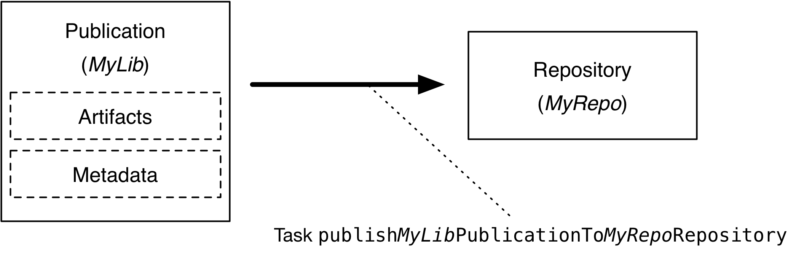
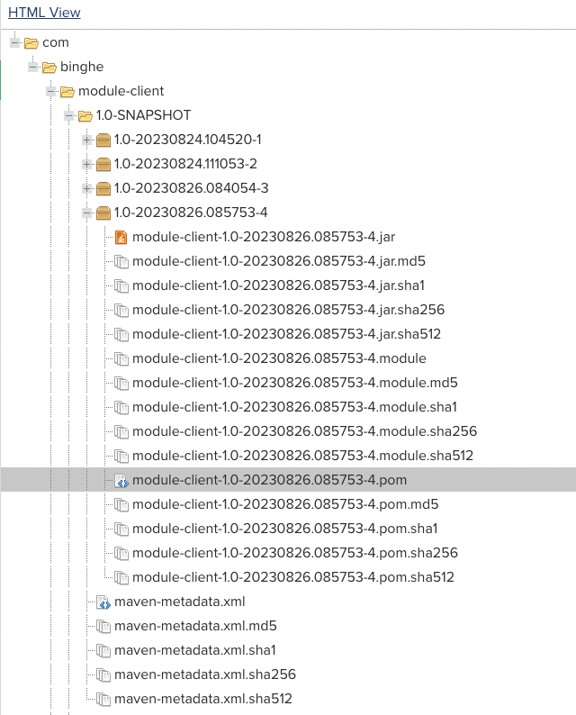
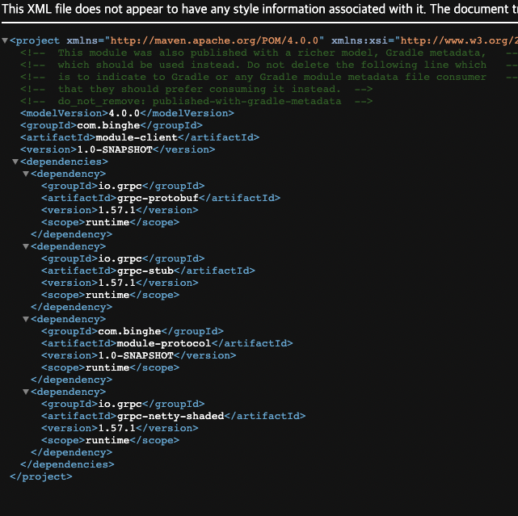

# 목차

<br>

- [목차](#목차)
- [Gradle - Publish Plugin](#gradle---publish-plugin)
- [1 무엇을 Publish 할 것인가](#1-무엇을-publish-할-것인가)
- [2 어디에 Publish 할 것인지](#2-어디에-publish-할-것인지)
- [3 Publish 실행](#3-publish-실행)
- [4 간단한 실습](#4-간단한-실습)
- [주의 - 한 개 이상 모듈 Publish할 시 각 모듈별로 Publish 설정을 해주어야한다.](#주의---한-개-이상-모듈-publish할-시-각-모듈별로-publish-설정을-해주어야한다)
- [참고](#참고)

<br>

# Gradle - Publish Plugin

현대의 대부분 애플리케이션은 외부 라이브러리나 프레임워크없이는 개발할 수 없으며, 대부분의 소프트웨어 프로젝트도 어떤 방식이로든 소비되는 것을 목표로 구축된다.

자바에선 웹 프로그래밍을 하려면 스프링으로 만드는 경우가 많은데, 이때 당연히 boot 관련된 의존성을 주입받아 개발한다.

이번 글은 Gradle을 활용하여 내가 만든 모듈을 외부 repository에 업로드하는 방법에 대해서 알아본다.

> 간단히 코드만 보고 빠르게 이해하고싶으면 [실습](#4-간단한-실습)부분만 참고하면 된다.

<br>

💁‍♂️ **Gradle은 Publish Plugin을 제공한다.**

Gradle은 이미 내가 구현한 모듈을 외부 저장소에 쉽게 올릴 수 있도록 [Publish Plugin](https://docs.gradle.org/current/userguide/publishing_maven.html)를 제공한다.

<br>

💁‍♂️ **모듈을 Publish하는 저장소는 크게 두 가지다.**

* Maven 호환 저장소 -> [Maven Publish Plugin](https://docs.gradle.org/current/userguide/publishing_maven.html#publishing_maven)
* Ivy 호환 저장소 -> [Ivy Publish Plugin](https://docs.gradle.org/current/userguide/publishing_ivy.html#publishing_ivy)

Gradle에선 각 저장소별로 모듈을 Publish할 때 필요한 Plugin을 제공한다.

<br>

💁‍♂️ **Publish Plugin을 이용하여 모듈을 Publish하기 위해선 아래 3가지만 기억하면 된다.**

* [무엇](#1-무엇을-publish-할-것인가)을 Publish 할 것인지
* [어디](#2-어디에-publish-할-것인지)에 Publish 할 것인지
* Publish [실행](#3-publish-실행)

<p align="center"><br>Publish 프로세스<br> 출처: https://docs.gradle.org/current/userguide/publishing_setup.html</p>

<br>

# 1 무엇을 Publish 할 것인가

Gradle을 사용하여 내가 구현한 모듈을 외부 저장소에 Publish하는 것은 artifacts와 metadata의 조합이다.

즉, 모듈을 외부 저장소에 Publish할 때 가장 먼저 해야할 일은 Publish할 파일, 모듈 그리고 정보들을 결정하는 것이다.

<br>

<p align="center"><br>Maven 저장소에 모듈 Publish할 때 저장되는 파일들. </p>

각 저장소별로 조금씩 다르지만, 가장 많이 사용되는 Maven 저장소를 바탕으로 Publish할 때 필요한 정보는 아래와 같다.

* 하나 이상의 artifacts
  * artifacts란?
    * JAR, 실행파일 같이 빌드를 통해 생성된 파일이나 디렉토리를 의미한다.
    * ex. `implementation 'org.springframework.boot:spring-boot-starter-web:3.1.3'`
      * group: `org.springframework.boot`
      * artifact: `spring-boot-starter-web`
* 모듈 메타데이터
  * Publish할 모듈의 구성 요소를 설명하는 Gradle 모듈 메타데이터 파일. (`.module`파일)
* Maven POM 파일
  * Maven POM 파일은 내가 구현한 모듈 Artifacts와 해당 모듈에서 의존하는 의존성에 대해서 기록되어있다.
  * ex. Publish하는 모듈이 gRPC 의존성을 주입한 것이라면 아래와 같이 서술되어있다.
    * <p align="center"> </p>


이외에도 Gradle은 위 모든 파일들에 대한 체크섬과 서명을 같이 게시한다. Gradle 6.0부터는 SHA256 및 SHA 512 체크섬을 포함한다.

> 위 파일들은 대부분 자동으로 생성되어 올라간다. 이와 관련된 더 자세한 부분은 아래 Publish Hello World 실습에서 살펴본다.

<br>

# 2 어디에 Publish 할 것인지

Gradle로 외부 모듈 의존성을 가져올 때 Gradle 빌드 스크립트내 아래와 같이 저장소를 설정해주어야한다.

> build.gradle

```gradle
repositories {
    mavenCentral()
}
```

반대로 생각하면, 외부 저장소에 모듈을 Publish할 땐 해당 Artifacts를 어떤 저장소에 저장할 지 지정해주어야한다.

Publish할 때도 아래와 같이 `respositories` 설정 Task를 통해 저장소를 지정해준다.

> build.gradle

```gradle
publishing {
    publications {
        myLibrary(MavenPublication) {
            from components.java
        }
    }

    repositories {
        maven {
            url ('{외부 저장소 주소}')
            credentials {
                username = '외부 저장소 id'
                password = '외부 저장소 pw'
            }

            // 로컬 테스트하기위해서 https는 무시할 때 사용됨.
            allowInsecureProtocol true
        }
    }
}
```

<br>

# 3 Publish 실행

Maven 저장소 기준. Gradle의 Publish Publish Plugin에서 제공하는 publish Task를 호출만하면 자동으로 Publish해준다.

```shell
$ ./gradlew publish
```

<br>

# 4 간단한 실습

간단히 Publish를 실습해본다.

<br>

💁‍♂️ **가장 먼저 Publish할 모듈내 빌드 스크립트에 아래와 같이 설정해준다.**

> build.gradle
```gradle
plugins {
    id 'maven-publish'
}

publishing {
  publications {
    maven(MavenPublication) {
      // 메타 정보 설정 ... (artifacts, )

      // Publish할 구성요소를 설정. 
      // 아래와 같이 설정하면 java에 대한 components들을 모두 스캔한다.
      // https://docs.gradle.org/current/javadoc/org/gradle/api/component/SoftwareComponent.html
      from components.java
    }
  }
  repositories {
    maven {
      url('{저장소 위치}')
      credentials {
		    username = '{저장소 username}'
        password = '{저장소 password}'
      }
    }

    // 로컬 테스트하기위해서 https는 무시한다.
    allowInsecureProtocol true
  }
}
```

Publish Plugin을 설정해주고, Publish의 목적 저장소와 저장할 jar에 대한 메타 정보만 기입해주면 된다.

<br>

💁‍♂️ **Publish하기**

그리고 아래와 같이 publish 명령어를 입력하면 지정한 저장소에 jar가 올라간다.

```shell
$ ./gradlew publish
```

<br>

# 주의 - 한 개 이상 모듈 Publish할 시 각 모듈별로 Publish 설정을 해주어야한다.

만약 A 모듈 -> B 모듈을 의존할 때, A 모듈만 Publish하면 해당 모듈의 의존성을 가져와 사용하는 클라이언트는 A 모듈 사용시 B 모듈에 대한 의존성이 없어 에러가 뱉게된다.

그러므로 사용되는 모듈을 모두 외부 저장소에 올려두는 것이 좋다.

필자의 경우 Gradle Root 빌드 스크립트를 아래와 같이 설정하여 Publish할 모듈을 설정해둔다.

> build.gradle
```gradle
// server 이름을 가진 모듈은 Publish 제외
def publishProject = subprojects.findAll { !it.name.contains('-server') }

configure(publishProject) {

	apply plugin: "java-library"
	apply plugin: "maven-publish"

	publishing {
		publications {
			mavenJava(MavenPublication) {
				from components.java
			}
		}
	}
	publishing {
		repositories {
			maven {
				credentials {
					username = '{저장소 username}'
          password = '{저장소 password}'
				}

				def releasesRepoUrl = '{release 저장소 위치}'
				def snapshotsRepoUrl = '{snapshot 저장소 위치}'
				url = version.endsWith('SNAPSHOT') ? snapshotsRepoUrl : releasesRepoUrl
			}
		}
	}
}

```

<br>

# 참고
* https://docs.gradle.org/current/userguide/publishing_setup.html


