# 목차

<br>

- [목차](#목차)
- [들어가며](#들어가며)
- [모듈이란?](#모듈이란)
- [멀티 모듈 프로젝트란?](#멀티-모듈-프로젝트란)
- [멀티 모듈 구성하기](#멀티-모듈-구성하기)
  - [프로젝트 생성](#프로젝트-생성)
  - [모듈 등록](#모듈-등록)
  - [모듈별 필요한 의존성 추가](#모듈별-필요한-의존성-추가)
    - [root 프로젝트 - 중요](#root-프로젝트---중요)
    - [모듈 프로젝트 의존성 - 중요](#모듈-프로젝트-의존성---중요)
  - [모듈별 기능 구현](#모듈별-기능-구현)
  - [모듈별 서버 실행](#모듈별-서버-실행)
- [여러가지 학습 테스트](#여러가지-학습-테스트)
  - [configure 설정](#configure-설정)
  - [의존성 우선순위](#의존성-우선순위)
- [마치며](#마치며)
- [참고](#참고)

<br>

# 들어가며
대부분의 규모가있는 프로젝트의 코드를보면 단일 모듈이 아닌 멀티 모듈로 구성되는 것 같다.

하지만 필자는 지금까지 단일 프로젝트만을 진행했었다..ㅎ 조금이나마 멀티 모듈 프로젝트를 이해하고자 이렇게 글을 작성하려고한다.

이 글은 단일 프로젝트에서만 Spring을 사용한 개발자들을 대상으로한다!

> 멀티 모듈을 어떻게 나눌지보다는 멀티 모듈 프로젝트 구성하기 Hello World로 보면 좋을듯 하다.

<br>

# 모듈이란?
멀티 모듈을 이해하는데 앞서 먼저 `모듈이란 무엇인지` 간단히 정리해본다.

<br>

🤔 모듈화 디자인

* 한 시스템을 여러 개의 기능성 구성요소(모듈)들을 조합함으로써 완성하도록 한 설계.
* ex. 컴퓨터 시스템
  * 각종 버스 기능을 탑재한 메인보드에 CPU, RAM, HDD/SSD, 그래픽 카드, 파워 등을 조합함으로써 완성한다.
  * 이때 각각의 구성요소를 모듈이라 부르며, 각 모듈은 시스템의 특정한 기능을 담당한다.
  * 각 구성요소는 표준을 따라 만들어진다. (표준화)

<br>

🤔 모듈이란?

모듈은 여러 가지로 정의될 수 있지만, **일반적으로 큰 체계의 구성요소이고, 다른 구성요소와 독립적으로 운영된**다.

* 모듈은 독립적인 의미를 갖는다.
* 모듈은 추상화 정도에 대한 계층을 가지고 있다. (모듈마다 계층을 지니고있다)
* 계층 간 의존 관계에 관한 규칙이 존재한다. (중요)

<br>

# 멀티 모듈 프로젝트란?
> 모듈이란 무엇인지 대략 알았다면 이제 멀티 모듈 프로젝트에 대해서 알아본다!

위에서도 언급했듯이 어느정도 규모가 있는 (대용량 트래픽이 들어오는)서비스는 단일 프로젝트로 만들어지는 경우는 없는 것 같다.

실제로 일정 수준 이상의 트래픽이 발생하는 서비스는 하나 이상의 모듈로 구성된다.

간단히 예를 들어보면 아래와 같이 사용자와의 접점을 담당하는서버(`front-api`)와 DB와의 접점을 당하는 서버(`api`)로 나눌 수 있다.

<p align="center">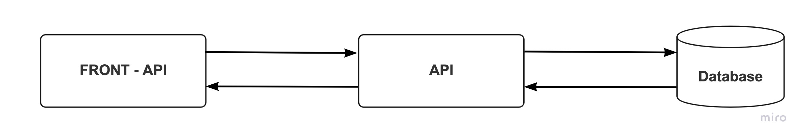 </p>

<br>

또 다른 간단한 예시로는 명령을 담당하는 서버 (Command API)와 조회를 담당하는 서버 (Query API)로 나눌 수도 있다.

<p align="center">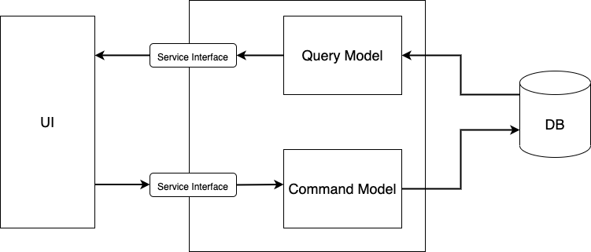</p>

<br>

**문제는 같은 도메인을 처리하는 두 서버(프로젝트) 모두 사용되는 클래스를 어떻게 다룰 것인가이다.**

<p align="center">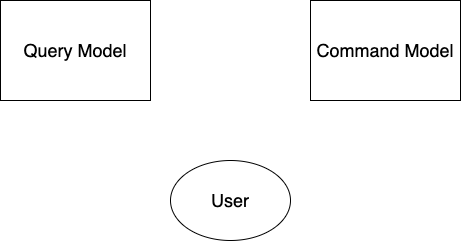 </p>

즉, 두 모듈에서 겹치는 부분 (클래스)를 어떻게 다룰 것인지가 문제다.

<br>

가장 간단한 방법은 두 모듈을 **독립적인 프로젝트**로 만들고 **Domain 클래스를 복사 & 붙여넣기**하는 것이다.

당연히 이 방법은 Domain의 변경이 발생하면 많은 양의 코드를 수정해야하는 문제가 있다.

이는 실수할 가능성이 있기 때문에 유지보수면에서 좋지않다.

<br>

위 문제를 해결하려면 Gradle의 멀티 모듈 방식을 이용해야한다.

<p align="center">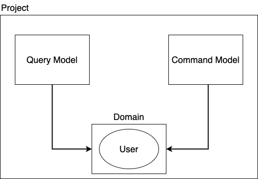 </p>

그림에서처럼 **공통적으로 사용되는 도메인을 `Domain`이라는 모듈을 만들어 다른 모듈들이 사용하도록하는 것이다.**

<br>

# 멀티 모듈 구성하기
이제 본격적으로 멀티 모듈을 구성해본다.

예시로는 유저를 저장하고 조회하는 간단한 도메인을 사용하려고한다.

유저 도메인의 요구사항은 간단하다.

* 유저를 등록할 수 있다.
* 유저를 조회할 수 있다.

이를 명령 모델과 조회 모델을 분리하는 멀티 모듈로 구성하면 아래와 같이 나눌 수 있다.

* `module-common`
* `module-api-command`
* `module-api-read`

<p align="center">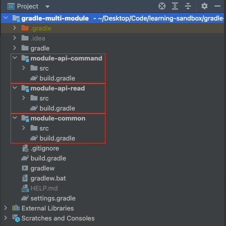 </p>

이제 위와 같이 Gradle을 이용한 멀티 모듈을 구성해본다.

<br>

## 프로젝트 생성
Gradle을 이용한 멀티모듈 프로젝트를 생성하는 방법은 두 가지이다.

1. Gradle로 직접 생성 `gradle init`
2. IDE (ex. IntelliJ)를 통한 생성

이번 글에선 IDE를 통한 생성만을 다룬다.

<br>

먼저 기존의 스프링 프로젝트 만드는 것과 동일하게 프로젝트를 생성해준다.

<p align="center">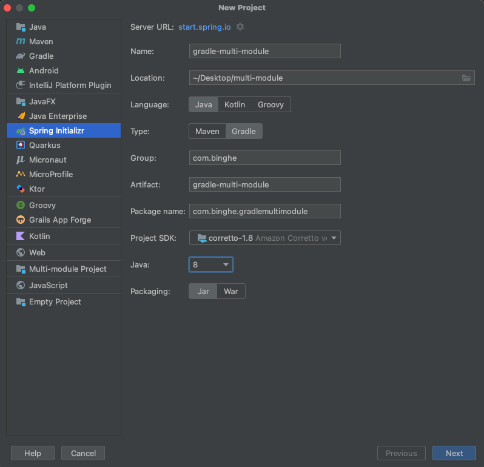 </p>

이때 필요한 의존성도 추가해준다. (이후에 따로 한다면 굳이 안해줘도 상관은 없다. 그래도 `Spring Web`정도는 추가해준다.)

<br>

이제 초기에 설계한대로 모듈을 생성해준다.

<p align="center">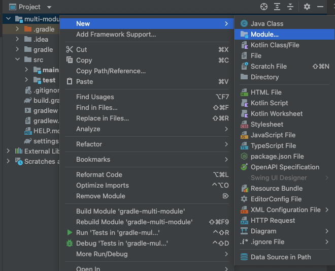 </p>

<p align="center">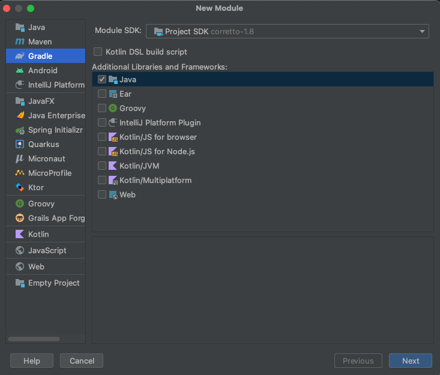 </p>

<p align="center">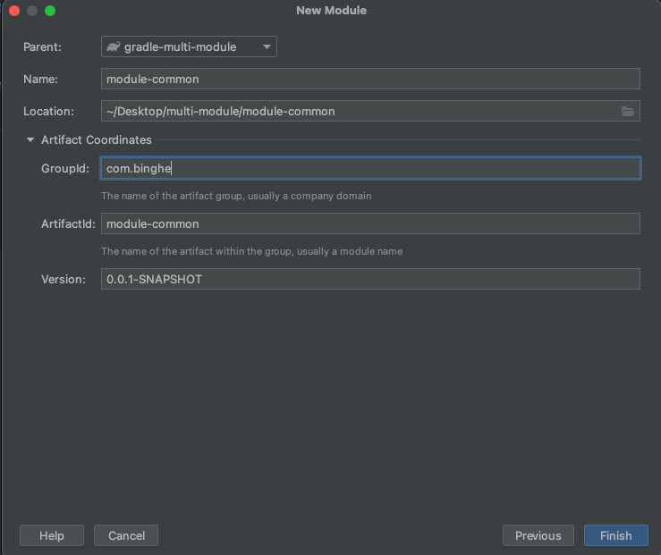 </p>

위와 같이 세 개의 모듈을 생성하고, 기존에 존재하던 `src` 디렉토리는 삭제하거나 원하는 모듈로 이동시켜준다.

이제 위에서 본 것과 같이 Gradle을 이용한 멀티 모듈 패키지 구조가 완성된다.

<p align="center"> </p>

<br>

## 모듈 등록
위와 같이 모듈은 여러 가지로 나눴지만 Gradle 멀티모듈은 root 프로젝트를 기준으로 빌드를 진행한다.

**root 프로젝트에 어떤 하위 모듈을 포함 및 관리할 것인지를 설정해주어야한다.**

설정은 root 프로젝트의 `settings.gradle`에 해주면 된다.

<br>

> settings.gradle

```groovy
rootProject.name = 'gradle-multi-module'
include 'module-api-read'
include 'module-common'
include 'module-api-command'
```

모듈을 추가할 때마다 위 설정파일에서 추가해주면 된다.

> 보통 인텔리제이는 모듈을 생성하면 자동으로 추가해준다.

<br>

## 모듈별 필요한 의존성 추가
이제 각 모듈별 필요한 의존성을 추가해준다.

의존성은 각 모듈별 `build.gradle`에 추가해주면 된다.

> root 프로젝트의 `build.gradle`에 모든 모듈의 라이브러리 설정 내용을 작성해도되고, 각각의 모듈 별 `build.gradle`에 내용을 작성해도된다.
> 
> 이 글에선 모듈에서 공통적으로 사용되는 의존성은 root 프로젝트의 `build.gradle`에 설정하고, 각 모듈별 의존성은 각각의 `build.gradle`에 설정한다.

<br>

### root 프로젝트 - 중요

우선 root 프로젝트의 의존성을 설정해준다. **의존성 설정에서 가장 중요한 부분이다.**

```groovy
buildscript {
    ext {
        springBootVersion = '2.6.3'
    }
    repositories {
        mavenCentral()
    }
    dependencies {
        classpath("org.springframework.boot:spring-boot-gradle-plugin:${springBootVersion}")
        classpath "io.spring.gradle:dependency-management-plugin:1.0.11.RELEASE"
    }
}

subprojects {
    group 'com.binghe'
    version '1.0'

    apply plugin: 'java'
    apply plugin: 'org.springframework.boot'
    apply plugin: 'io.spring.dependency-management'

    sourceCompatibility = 1.8

    repositories {
        mavenCentral()
    }

    configurations {
        compileOnly {
            extendsFrom annotationProcessor
        }
    }

    // 모든 모듈에서 공통적으로 사용하는 의존성
    dependencies {
        implementation 'org.springframework.boot:spring-boot-starter-data-jpa'
        implementation 'org.springframework.boot:spring-boot-starter-web'

        compileOnly 'org.projectlombok:lombok:1.18.20'

        annotationProcessor 'org.projectlombok:lombok:1.18.20'

        runtimeOnly 'com.h2database:h2'

        testImplementation 'org.springframework.boot:spring-boot-starter-test'
    }

    test {
        useJUnitPlatform()
    }
}

// root 프로젝트에서 모든 모듈을 설정하고 싶다면 아래와 같이 설정해주면 된다.
//project(':module-api-command') {
//    dependencies {
//        implementation project(':module-common') // compile로 하면 에러 발생
//    }
//}
//
//project(':module-api-read') {
//    dependencies {
//        implementation project(':module-common') // compile로 하면 에러 발생
//    }
//}
```

<br>

**`buildscript`**

빌드할 때 필요한 글로벌 레벨의 dependencies(의존성)와 repositories(라이브러리 저장소) 설정한다고 보면 된다.

즉, **소스 컴파일과는 무관하게 Gradle로 Task를 수행할 때 사용되는 설정을 의미한다.**

> 소스코드 컴파일과 같은 빌드 작업시 빌드 시스템 준비 단계에서 가장 먼저 실행되는 블록.

* `ext`: gradle에서 변수 선언시 사용되는 방법. 보통 버전을 변수로 저장할 때 사용된다. (`ext.springbootVersion`과 같이 사용도 가능하다.)
* `repositories`: gradle 의존성 저장소 설정. (라이브러리를 가져올 때 어떤 저장소에서 가져올 지 설정)
* `dependencies`: gradle로 task를 실행할 때 사용할 라이브러리 설정.

> 보통 Gradle에서 사용할 별도의 외부 라이브러리를 가져와야할 때 `buildscript`에 설정한다.
> 
> 즉, 단일 프로젝트의경우는 별도로 작성할 필요가 없다. (따로 Gradle 처리에 필요한 외부 라이브러리가 필요하지 않기 때문.)

<br>

**`subprojects`**

`settings.gradle`에 include한 프로젝트 전부를 관리하는 블록이다.

즉, **root의 하위에 위치한 모든 모듈에 적용될 설정을 작성하는 블록이다.**

* `apply plugin`: plugin이란 미리 구성해놓은 task의 그룹이다. [참고](https://www.tutorialspoint.com/gradle/gradle_plugins.htm)
  * 하위 모듈 모두 Java와 Spring에 의존성을 두고 있기 때문에 관련된 plugin을 등록해두었다.
* `dependencies`: 소스 컴파일시 사용할 의존성 설정. (모든 하위 모듈에서 사용하는 의존성)

> 만약 root 프로젝트까지 적용하고싶다면 `subprojects`대신 `allprojects`로 등록하면된다.

<br>

> `:`은 디렉토리 path를 의미.

<br>

### 모듈 프로젝트 의존성 - 중요
이제 각 모듈별로 필요한 의존성과 빌드 설정을 해주면된다.

<br>

**`module-common`**

도메인 혹은 공용 로직이 담긴 공통 모듈.

이 글에선 도메인과 Repository 객체만을 담고있는다. (아래 [모듈별 기능 구현]()을 참고)

<br>

> module-common/build.gradle

```groovy
bootJar {
    enabled = false
}
jar {
    enabled = true
}
```
common 모듈은 실행 가능한 bootJar로 패키징할 필요가 없기 때문에, 위와 같이 bootJar는 `false`, jar는 `true`로 설정해준다.

> Gradle 빌드시 각 프로젝트를 실행가능한 jar형태로 만든다. common은 main 메서드가 없기때문에 bootJar를 `false`로 하는 것.

<br>

**`module-api-command`**

명령 모델과 관련된 로직을 처리하는 모듈.

<br>

> module-api-command/build.gradle

```groovy
// 이 모듈에섬나 필요한 의존성을 여기에 등록해주면 된다.
dependencies {
    implementation project(':module-common') // compile로 하면 에러 발생 (꼭 gradle로 빌드해야한다.)

    testImplementation 'io.rest-assured:rest-assured:3.3.0'
}
```
이 모듈은 도메인 클래스를 포함하고있는 `module-common`모듈을 의존하고있다.

그러므로 `implementation`을 통해 의존성을 추가해주면 된다.

> 필자의 경우는 인수 테스트를 진행하고자 `rest-assured`를 추가해주었다. 필요없다면 제거해두어도 된다.

<br>

**`module-api-read`**

조회 모델과 관련된 로직을 처리하는 모듈.

> module-api-read/build.gradle

```groovy
dependencies {
    implementation project(':module-common')
}
```

<br>

## 모듈별 기능 구현
이제 간단히 요구사항에 맞는 도메인 로직을 작성해본다. (기능 구현)

요구사항은 간단히 유저를 생성하고 조회하는 것이며, 패키지 구조는 아래와 같다.

<p align="center">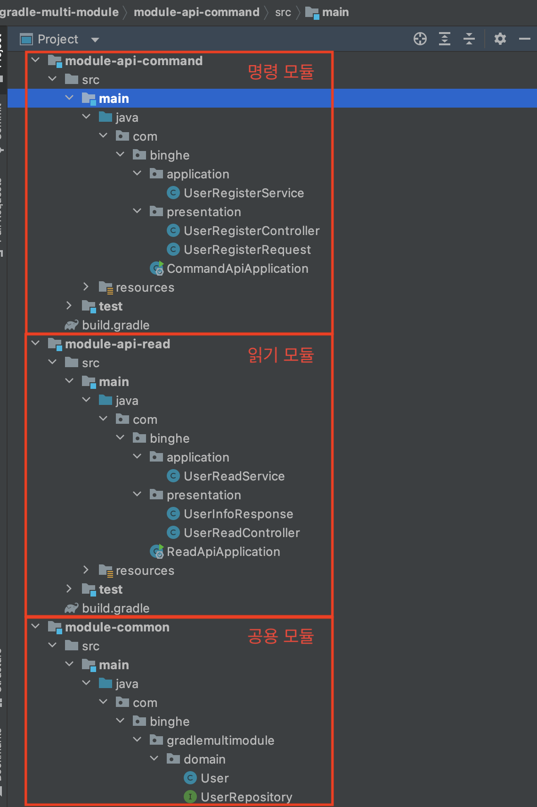 </p>

> 기능 구현 관련된 코드는 [여기](https://github.com/binghe819/learning-sandbox/tree/master/gradle-multi-module)서 한 눈에 파악할 수 있다.

<br>

우선 모든 모듈에서 사용할 도메인을 작성한다.

**`module-common`**

> User.java
```java
@Builder
@Getter
@Entity
public class User {

    @Id
    @GeneratedValue(strategy = GenerationType.IDENTITY)
    private Long id;

    private String name;

    private int age;

    protected User() {
    }

    public User(Long id, String name, int age) {
        this.id = id;
        this.name = name;
        this.age = age;
    }
}
```

> UserRepository.java
```java
public interface UserRepository extends CrudRepository<User, Long> {
}
```

<br>

**`module-api-command`**

이제 명령 모델에 유저를 등록하는 로직을 작성해준다.

> UserRegisterService.java
```java
@Service
public class UserRegisterService {

    private final UserRepository userRepository;

    public UserRegisterService(UserRepository userRepository) {
        this.userRepository = userRepository;
    }

    @Transactional
    public Long save(String name, int age) {
        User user = User.builder()
                .name(name)
                .age(age)
                .build();
        User savedUser = userRepository.save(user);
        return savedUser.getId();
    }
}
```

> UserRegisterController.java
```java
@RestController
public class UserRegisterController {

    private final UserRegisterService userRegisterService;

    public UserRegisterController(UserRegisterService userRegisterService) {
        this.userRegisterService = userRegisterService;
    }

    @PostMapping(value = "/api/users")
    public ResponseEntity<Void> save(@RequestBody UserRegisterRequest body) {
        Long savedId = userRegisterService.save(body.getName(), body.getAge());
        return ResponseEntity.created(URI.create("/users/" + savedId)).build();
    }
}
```

<br>

마지막으로 읽기 모듈에서 사용할 읽기 로직을 작성해준다.

> UserReadController.java
```java
@RestController
public class UserReadController {

    private final UserReadService userReadService;

    public UserReadController(UserReadService userReadService) {
        this.userReadService = userReadService;
    }

    @GetMapping(value = "/api/users/{id}")
    public ResponseEntity<UserInfoResponse> findById(@PathVariable Long id) {
        User user = userReadService.findById(id);
        UserInfoResponse response = new UserInfoResponse(user.getId(), user.getName(), user.getAge());
        return ResponseEntity
                .ok()
                .body(response);
    }
}
```

> UserReadService.java
```java
@Transactional(readOnly = true)
@Service
public class UserReadService {

    private UserRepository userRepository;

    public UserReadService(UserRepository userRepository) {
        this.userRepository = userRepository;
    }

    public User findById(Long id) {
        return userRepository
                .findById(id)
                .orElseThrow(() -> new IllegalArgumentException("에러! 찾을 수 없는 유저입니다."));
    }
}
```

<br>

## 모듈별 서버 실행
이제 모듈별 서버를 실행해서 테스트해보면 끝!

모듈별 서버를 실행하는 방법은 다음과 같다.

```shell
# 각 모듈별 Gradle 명령어
$ gradlew :{module 이름}:{명령어}

# 모듈 실행
$ gradlew :module-api-command:bootRun
$ gradlew :module-api-read:bootRun
```

아마 위와같이 모듈을 실행하면 포트가 충돌한다 :)

포트를 수정하고 싶다면 아래와 같이 실행해주면 된다.

```shell
$ gradlew :{module 이름}:bootRun --args='--server.port={원하는 포트 번호}'
```

<br>

<p align="center">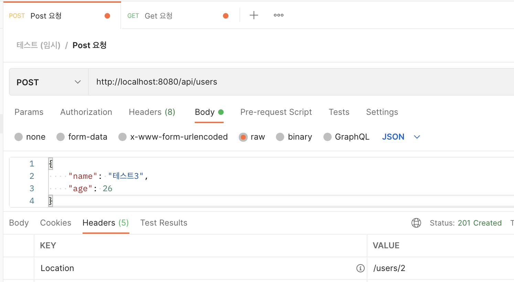<br>명령 서버 요청 성공</p>

<p align="center">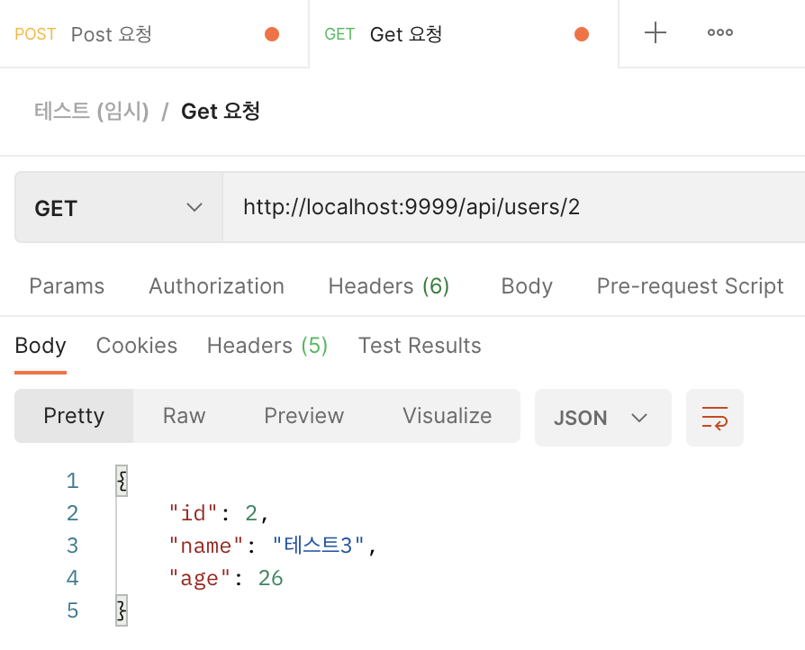<br>읽기 서버 요청 성공</p>

<br>

두 서버 모두 잘 돌아가는 것을 볼 수 있다. 이렇게 하나의 공통 모듈 (도메인)을 의존하는 두 모듈을 작성해볼 수 있다.

<br>

# 여러가지 학습 테스트
필자가 멀티 모듈을 구성하면서 궁금했던 부분에 대해서 학습 테스트한 부분을 정리한 챕터.

<br>

## configure 설정

<br>

## 의존성 우선순위

<br>

# 마치며
이번 글에선 간단히 Gradle을 이용한 멀티 모듈에 대해서 다뤄보았다.

Hello World 수준으로 다뤘으므로 어려운 내용은 없는 듯하다.. 다음 글에선 모듈을 어떻게 설계하는 것이 좋을지 고민해보는 글을 작성할 예정이다!

그럼 안녕~

<br>

# 참고
* https://ko.wikipedia.org/wiki/모듈성_(프로그래밍)
* https://namu.wiki/w/모듈
* https://jojoldu.tistory.com/123?category=721560
* https://stackoverflow.com/questions/17773817/purpose-of-buildscript-block-in-gradle
* https://www.popit.kr/gradle을-이용한-spring-boot-설치-빌드-스크립트/

