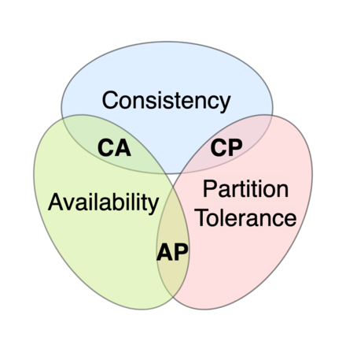
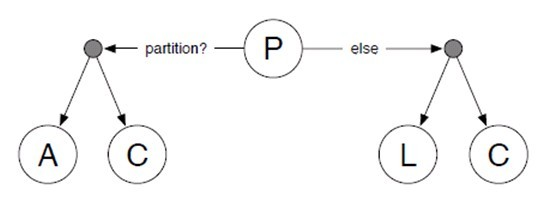

# 목차

<br>

- [목차](#목차)
- [CAP 이론과 DB 선택의 기준](#cap-이론과-db-선택의-기준)
- [CAP 이론](#cap-이론)
  - [CAP 이론 정의](#cap-이론-정의)
  - [CAP 이론은 CP와 AP에 대한 이야기이며, 꼭 하나를 선택하라는 의미가아니다](#cap-이론은-cp와-ap에-대한-이야기이며-꼭-하나를-선택하라는-의미가아니다)
  - [CAP 이론의 부족한 점을 보완하기 위한 PACELC 이론](#cap-이론의-부족한-점을-보완하기-위한-pacelc-이론)
- [DB 선택시 비즈니스도 고려해야한다.](#db-선택시-비즈니스도-고려해야한다)
- [참고](#참고)

<br>

# CAP 이론과 DB 선택의 기준
분산 데이터베이스 시스템 (일반적인 시스템 포함)은 다음과 같은 세 가지 조건을 모두 만족하는 분산 시스템이 존재할 수 없다.

* 일관성: 모든 노드가 같은 순간에 같은 데이터를 볼 수 있다.
* 가용성: 모든 요청이 성공 또는 실패 결과를 반환할 수 있다.
* 분할내성: 메시지 전달이 실패하거나 시스템 일부가 망가져도 시스템이 계속 동작할 수 있다.

그리고 이러한 이론을 가리켜 세 가지 조건의 첫 글자를 따서 CAP 이론이라고 부른다.

이번 글은 데이터베이스를 선택할 때 도움을주는 CAP 이론과 PACELC 이론에 대해 알아본다.

<br>

# CAP 이론

<br>

## CAP 이론 정의

CAP 이론에서 말하는 세 가지 속성의 정의는 아래와 같다.

<p align="center"><br>출처: https://en.wikipedia.org/wiki/CAP_theorem </p>

* 일관성(一貫性, Consistency)
  * 사용자가 분산 시스템상의 어떤 노드와 통신하던 상관없이 모두 같은 데이터를 조회할 수 있음을 의미한다.
  * 따라서 일관성이 지켜진 분산 시스템은 하나의 노드에 쓰기 작업이 이루어졌다면, 이는 모든 복제본에 반영되어야한다는 의미이다. 복제본에 반영이안된다면 해당 쓰기 작업은 실패되어야한다.
  * 일관성은 금융이나 개인정보와 같이 모든 사용자가 일관성있는 데이터를 조회해야할 때 중요하다.
    * ex. 금융 잔고 조회
* 가용성(可用性, Availability)
  * 사용자의 모든 요청이 응답을 받을 수 있어야한다는 것을 의미한다.
  * 사용자가 읽기, 쓰기 혹은 작업이 실패했더라도 사용자는 응답을 받을 수 있어야한다. 즉, 시스템이 중단되는 일 없이 항상 사용가능한 상태여야한다.
  * 일관성과 다르게 데이터가 일관되지 않더라도 언제든지 접근할 수 있는 것을 의미한다.
  * 가용성은 SNS의 좋아요 댓글과 같이 데이터의 정합성이 조금 어긋나도 문제없이 서비스될 수 있을때 중요하다.
* 분할내성(分割耐性, Partition tolerance)
  * 분할은 노드 간의 네트워크 통신이 끊기는 것을 의미한다. 네트워크 장애나 서버노드의 장애 혹은 다양한 이유로 발생할 수 있다.
  * 분할내성은 시스템 내 분할이 생겼을 때 시스템이 여전히 작동하는 것을 의미한다.  즉, 한 노드가 다른 노드와 통신할 수 없을 때, 다른 복제 노드가 사용자 요청에 응답할 수 있어야한다.

<br>

<br>

## CAP 이론은 CP와 AP에 대한 이야기이며, 꼭 하나를 선택하라는 의미가아니다

CAP이론에 따르면 분산 시스템은 네트워크 분할이 발생하였을 때 세 가지 속성 중 두 가지만 만족할 수 있다.

* CA (Consistency-Availability)
* CP (Consistency-Partition tolerance)
* AP (Availability-Partition tolerance)

<br>

💁‍♂️ **CA (Consistency-Availability)는 존재할 수 없다.**

분산 시스템은 반드시 네트워크 장애나 여러 이유들로 인해 장애가 발생할 수 밖에없다.

그리고 CAP 자체가 네트워크 분할 상황을 가정하므로, CA는 존재할 수 없다.

> 존재하려면 하나의 노드에서 동작하는 모놀리식 DB 시스템이여야한다.

노드간의 네트워크 분할이 생겼을 때 데이터의 일관성을 보장하기는 불가능하다.

그러므로 분할이 생겼을 때 정상적으로 요청을 처리해 일관성을 희생하고 가용성을 높이던지,

잠시 요청 처리를 중단하고 중단된 노드가 정상 복구될 때까지 기다려 가용성을 희생하고 일관성을 지켜야한다.

<br>

💁‍♂️ **CAP 이론은 일관성과 가용성간의 트레이프오프를 생각해야한다는 이론이다..**

CAP 이론이 완벽한 CP시스템(일관성)과 완벽한 AP(가용성)중 하나를 꼭 선택해야하는것인가?

그것도 아니다. 완벽한 CP와 완벽한 AP는 각각 사실상 쓸모가 없다.

* 완벽한 CP 시스템
  * 완벽한 일관성을위해 하나의 트랜잭션은 다른 모든 노드에 복제된 후에 완료되어야한다. 만약 하나라도 실패한다면 해당 트랜잭션은 모든 노드에서 실패되어야한다.
  * 이는 가용성뿐만 아니라 노드 개수와 네트워크 상황에따라 성능 저하가 굉장히 심해진다.
* 완벽한 AP 시스템
  * 완벽한 가용성을위해 모든 노드가 어떠한 상황에서든 응답을 할 수 있어야한다.
  * 하나의 노드가 네트워크 분할이 발생하여 고립되었어도, 고립된 노드가 갖고있는 비교적 이전 데이터가 쓸모가 없더라고 응답을 해야한다.

CAP 이런도 사실 완전한 일관성과 완전한 가용성중 하나를 선택해야한다는 의미가아니다.

일관성과 가용성의 트레이드오프가 존재하니 상황에따라 일관성과 가용성의 수준을 선택하라는 의미이다.

<br>

💁‍♂️ **정리하면 CAP 이론의 한계는 아래와 같다.**

* 완벽한 CP, AP 시스템은 사용할 수 없다.
* 대부분 분산 시스템은 CP와 AP의 중간 어디쯤이다.
* 모든 분산 시스템이 파티션을 사용하진 않는다.


<br>

## CAP 이론의 부족한 점을 보완하기 위한 PACELC 이론

CAP의 부족한 부분을 보완하기위해 네트워크 장애 상황과 정상 상황으로 나누어서 설명하는 PACELC란 이론도 존재한다.

* P - Network Partition
* A - Availability
* C - Consistency
* E - Else
* L - Latency
* C - Consistency

해석하면 아래와 같다.

<p align="center"><br>출처: https://itwiki.kr/w/PACELC_이론 </p>

```text
P (네트워크 파티션) 상황에서 A (가용성)과 C (일관성)의 트레이드 오프와 E (Else, 정상)상황에서 L (지연시간)과 C(일관성)의 상충 관계를 설명한다.
```

다시 말해, 장애 상황과 정상 상황에서 어떻게 동작하는지에 따라 트레이드오프가 존재한다는 의미이다.

<br>

# DB 선택시 비즈니스도 고려해야한다.

CAP와 PACELC 이론은 대략적인 DB 선택의 기준을 제시하지만, 같은 분류에 속한다고 완전히 똑같지 않다.

DB에 높은 수준의 조회 성능이 필요한 상황에서 두 이론만 생각한다면 성능을 단지 일관성과 가용성과 연관지어 생각하게된다.

하지만 DB의 조회 성능을 두 이론의 속성뿐만 아니라 데이터의 생김새, 저장 방식에 따라 더 세분화된다.

예를 들어, 저장할 데이터가 Key-Value로 가능하고 데이터의 양이 많지않다면 redis를 선택할 수 있다.

<br>

**정리하면 CAP와 PACELC 이론은 DB 선택시 일관성과 가용성이라는 중요한 선택의 기준을 제시할 뿐, 이것외에도 다른 기준도 포함하여 DB 선택을 고려해야한다는 것이다.**

<br>

# 참고
* https://en.wikipedia.org/wiki/CAP_theorem
* https://en.wikipedia.org/wiki/PACELC_theorem
* https://itwiki.kr/w/PACELC_이론
* http://happinessoncode.com/2017/07/29/cap-theorem-and-pacelc-theorem/
* https://www.youtube.com/watch?v=hUd_9FENShA
