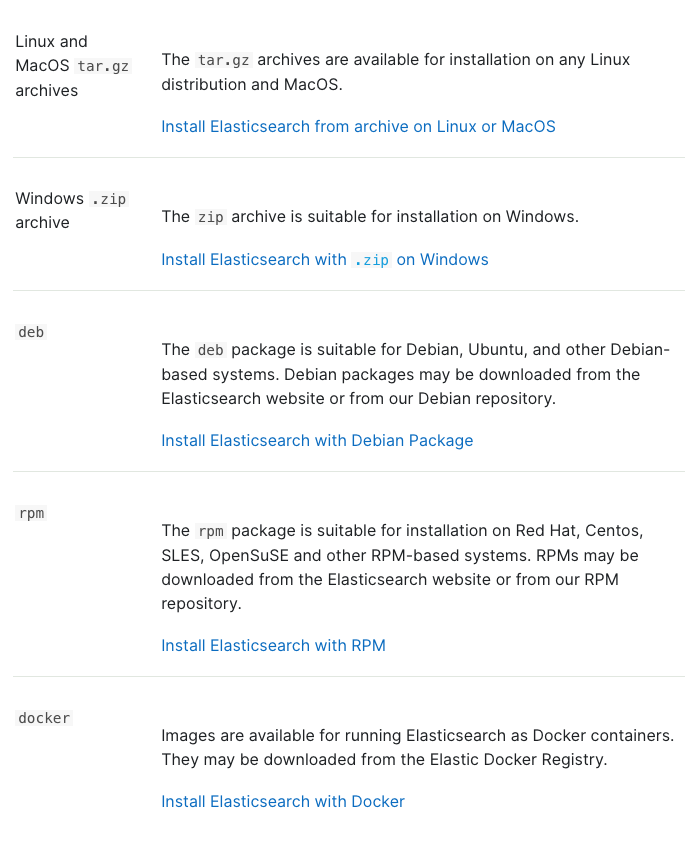

# 목차

<br>

- [목차](#목차)
- [ElasticSearch 설치 및 실행](#elasticsearch-설치-및-실행)
- [ElasticSearch에서 제공하는 설치 방법](#elasticsearch에서-제공하는-설치-방법)
- [TAR 아카이브 설치 방식](#tar-아카이브-설치-방식)
  - [다운 및 실행](#다운-및-실행)
  - [백그라운드 실행](#백그라운드-실행)
  - [프로세스 ID 파일로 저장](#프로세스-id-파일로-저장)
  - [디렉토리 구조](#디렉토리-구조)
- [Docker 이용한 설치](#docker-이용한-설치)
  - [싱글노드](#싱글노드)
  - [멀티노드](#멀티노드)

<br>

# ElasticSearch 설치 및 실행
ElasticSearch는 자바로 개발되어있으며, 자바가 실행 가능한 환경이라면 어디서든 구동이 가능하다.

공식문서에서도 유닉스부터 다양한 운영체제에서의 설치 및 운영 방법을 설명한다.

이번 글은 리눅스 또는 맥OS 같은 유닉스 계열 운영체제를 대상으로 설치하는 방법에 대해서 다룰 예정이다.

> 클러스터 구축과 관련된 내용은 다른 글에서 정리할 예정이며, 이번 글은 ES를 간단히 설치하는 방법에 대해서만 정리한다.

<br>

# ElasticSearch에서 제공하는 설치 방법

ElasticSearch를 설치하는 방법은 다양하다.

<p align="center"><br>출처: https://www.elastic.co/guide/en/elasticsearch/reference/current/install-elasticsearch.html </p>

이번 글에선 리눅스 또는 맥OS 같은 유닉스 계열 운영체제를 대상의 설치방법과 Docker를 이용한 설치 방법에 대해서 다룬다.

각 ElasticSearch 버전별 지원하는 JVM 버전은 [여기](https://www.elastic.co/kr/support/matrix#matrix_jvm)를 참고하면된다.

이번 글에선 Linux 환경에서 ES 7.17.10 버전을 바탕으로 실습을 진행한다.

> oos 버전은 [여기](https://www.elastic.co/kr/downloads/past-releases#elasticsearch-oss)에서 다운하면된다.

<br>

# TAR 아카이브 설치 방식

먼저 Linux에서 TAR 아카이브 설치 방식이다.

<br>

## 다운 및 실행

```shell
# shasum 설치
$ yum install -y perl-Digest-SHA

# ElasticSearch 다운 및 SHA와 게시된 체크섬 비교
$ wget https://artifacts.elastic.co/downloads/elasticsearch/elasticsearch-7.17.10-linux-x86_64.tar.gz
$ wget https://artifacts.elastic.co/downloads/elasticsearch/elasticsearch-7.17.10-linux-x86_64.tar.gz.sha512
$ shasum -a 512 -c elasticsearch-7.17.10-linux-x86_64.tar.gz.sha512 

# 압축 해제
$ tar -xzf elasticsearch-7.17.10-linux-x86_64.tar.gz
$ cd elasticsearch-7.17.10/

# 실행
$ ./bin/elasticsearch
```

<br>

정상적으로 실행되었다면 curl로 요청시 아래와 샅이 응답이 온다.

> curl 요청
```shell
$ curl localhost:9200
```

> curl 결과

```json
{
  "name" : "ip-xxx-xx-xx-xxx.ap-northeast-2.compute.internal",
  "cluster_name" : "elasticsearch",
  "cluster_uuid" : "DwghKu2hShqcwcMG67_bMw",
  "version" : {
    "number" : "7.17.10",
    "build_flavor" : "default",
    "build_type" : "tar",
    "build_hash" : "fecd68e3150eda0c307ab9a9d7557f5d5fd71349",
    "build_date" : "2023-04-23T05:33:18.138275597Z",
    "build_snapshot" : false,
    "lucene_version" : "8.11.1",
    "minimum_wire_compatibility_version" : "6.8.0",
    "minimum_index_compatibility_version" : "6.0.0-beta1"
  },
  "tagline" : "You Know, for Search"
}
```

<br>

## 백그라운드 실행

ElasticSearch를 백그라운드 데몬으로 실행하고싶은경우 `-d` 옵션을 추가해서 ElasticSearch를 실행하면 된다.

```shell
$ ./bin/elasticsearch -d
```

실행된 ElasticSearch의 실행 로그는 `logs` 디렉토리 아래에 `<클러스터명>.log` 파일에 기록된다.

아무런 설정하지않았다면 기본적으로 `elasticsearch.log` 에 저장된다.

<br>

## 프로세스 ID 파일로 저장

`-p <파일명>` 옵션을 추가해 실행하면 ElasticSearch 프로세스 ID를 특정 파일에 저장할 수 있다.

```shell
$ ./bin/elasticsearch -d -p es.pid

$ cat es.pid

```

`es.pid` 라는 파일에 실행된 ElasticSearch 프로세스 ID가 저장된다. 

그리고 ElasticSearch가 종료되면 `es.pid`  파일도 자동으로 삭제된다.

위 특성을 이용하여 ElasticSearch 실행, 종료 스크립트를 작성할 수 있다.

<br>

## 디렉토리 구조
TAR를 이용한 설치는 완전 독립적이다. 즉, 모든 파일과 디렉토리는 기본적으로 압축푼 디렉토리에 포함되어있다.

그저 압축푼 디렉토리만을 이용하여 ElasticSearch를 쉽게 실행하고 종료하면서 이용할 수 있다는 것이다.

압축푼 디렉토리의 구조는 아래와 같다.

- bin
    - ElasticSearch 실행을 위한 바이너리 파일들이 모여 있는 디렉토리.
    - ElasticSearch 실행, 플러그인 설치등의 스크립트 포함됨
    - ex. `elasticsearch`, `elasticsearch-plugin`
- conf
    - ElasticSearch 환경설정을 위한 파일들이 모여있는 디렉토리.
    - `elasticsearch.yml` 등 설정 파일이 담긴 디렉토리. ([참고](https://www.elastic.co/guide/en/elasticsearch/reference/7.17/settings.html#config-files-location))
    - `elasticsearch.yml` → ElasticSearch 실행 환경에 대한 설정.
        - 클러스터명, 노드명, 로그 경로, 네트워크 설정등등
            - [참고](https://esbook.kimjmin.net/02-install/2.3-elasticsearch/2.3.2-elasticsearch.yml)
    - `jvm.options` → JVM 설정.
    - `[log4j2.properties](http://log4j2.properties)` → 로깅 설정.
    - 커멘트 라인 설정은 `-E` 이용 → [참고](https://esbook.kimjmin.net/02-install/2.3-elasticsearch/2.3.4-cofig-on-start-command)
- lib
    - ElasticSearch 실행을 위한 외부 라이브러리들이 모여있는 디렉토리.
    - 루씬도 여기에 포함되어있다.
- data
    - 노드에 할당된 각 인덱스/샤드의 데이터 파일 위치. (디폴트 값: `path.data`)
- logs
    - 디폴트 로그 파일 디렉토리
    - `elatissearch.yml` 파일에 별도의 위치를 기재했다면 해당 디렉토리에 로그가 기록된다.
- modules
    - ElasticSearch를 구성하고있는 모듈들이 모여있는 디렉토리. 노드 간의 통신을 구현한 transport 모듈등 ElasticSearch 기능들이 구현된 것을 모듈이라고한다.
- plugins
    - 설치한 플러그인 디렉토리
- repo
    - 공유 파일 시스템 저장소 위치. 여러 위치를 보유할 수 있다.
    - 파일 시스템 저장소는 여기에 지정된 디렉토리의 하위 디렉토리에 배치할 수 있다.

<br>

# Docker 이용한 설치
Docker Container에 쉽게 ElasticSearch를 올릴 수 있다.

<br>

## 싱글노드

```bash
# 이미지 pull
$ docker pull docker.elastic.co/elasticsearch/elasticsearch:7.17.10

# 컨테이너 실행
$ docker run -p 127.0.0.1:9200:9200 -p 127.0.0.1:9300:9300 -e "discovery.type=single-node" docker.elastic.co/elasticsearch/elasticsearch:7.17.10
```

<br>

## 멀티노드

docker-compose를 이용하여 멀티노드 환경을 구축할 수 있다.

> docker-compose.yml
> 

```yaml
version: '2.2'
services:
  es01:
    image: docker.elastic.co/elasticsearch/elasticsearch:7.17.10
    container_name: es01
    environment:
      - node.name=es01
      - cluster.name=es-docker-cluster
      - discovery.seed_hosts=es02,es03
      - cluster.initial_master_nodes=es01,es02,es03
      - bootstrap.memory_lock=true
      - "ES_JAVA_OPTS=-Xms512m -Xmx512m"
    ulimits:
      memlock:
        soft: -1
        hard: -1
    volumes:
      - data01:/usr/share/elasticsearch/data
    ports:
      - 9200:9200
    networks:
      - elastic
  es02:
    image: docker.elastic.co/elasticsearch/elasticsearch:7.17.10
    container_name: es02
    environment:
      - node.name=es02
      - cluster.name=es-docker-cluster
      - discovery.seed_hosts=es01,es03
      - cluster.initial_master_nodes=es01,es02,es03
      - bootstrap.memory_lock=true
      - "ES_JAVA_OPTS=-Xms512m -Xmx512m"
    ulimits:
      memlock:
        soft: -1
        hard: -1
    volumes:
      - data02:/usr/share/elasticsearch/data
    networks:
      - elastic
  es03:
    image: docker.elastic.co/elasticsearch/elasticsearch:7.17.10
    container_name: es03
    environment:
      - node.name=es03
      - cluster.name=es-docker-cluster
      - discovery.seed_hosts=es01,es02
      - cluster.initial_master_nodes=es01,es02,es03
      - bootstrap.memory_lock=true
      - "ES_JAVA_OPTS=-Xms512m -Xmx512m"
    ulimits:
      memlock:
        soft: -1
        hard: -1
    volumes:
      - data03:/usr/share/elasticsearch/data
    networks:
      - elastic

volumes:
  data01:
    driver: local
  data02:
    driver: local
  data03:
    driver: local

networks:
  elastic:
    driver: bridge
```

docker-compose를 올려서 실행하면 끝이다.

```bash
$ docker-compose up
```

> 더 자세한 설정과 내용은 [여기](https://www.elastic.co/guide/en/elasticsearch/reference/7.17/docker.html)를 참고하자.


