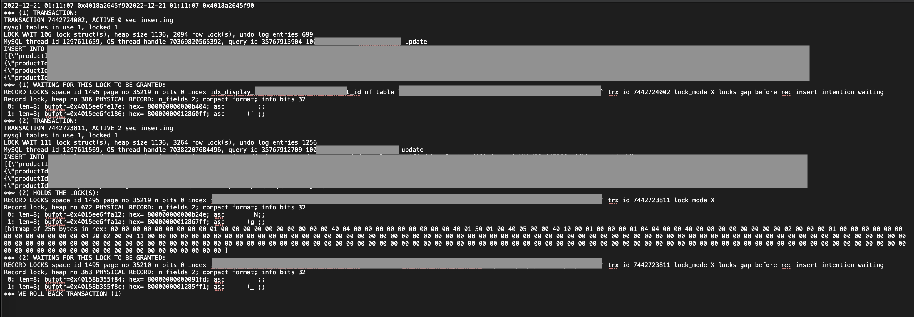

# 목차

 

- [목차](#목차)
- [MySQL InnoDB DeadLock 확인](#mysql-innodb-deadlock-확인)
- [1 MySQL InnoDB DeadLock 확인](#1-mysql-innodb-deadlock-확인)
  - [1-1 SHOW ENGINE INNODB STATUS](#1-1-show-engine-innodb-status)
  - [1-2 DeadLock 확인을 위한 설정](#1-2-deadlock-확인을-위한-설정)
- [참고](#참고)

 

# MySQL InnoDB DeadLock 확인
RDBMS를 사용하다보면 자주 DeadLock을 접하게된다.

적어도.. 필자는 MySQL InnoDB를 실서비스에 사용하면서 자주 DeadLock을 접하고있다.

이번 글은 MySQL에서 DeadLock을 확인하는 방법과 비교적 흔하게 발생하는 DeadLock 사례에대한 해결 방안을 정리한다.

 

# 1 MySQL InnoDB DeadLock 확인
MySQL의 InnoDB는 Row Level Lock을 사용하며, 기본적으로 트랜잭션을 지원하기때문에 비교적 DeadLock이 발생할 가능성이 높다.

> 심지어 REPEATEABLE-READ를 기본 격리수준으로 사용하기에 더더욱 DeadLock이 발생할 수 있다.

그러므로 DeadLock의 원인을 확인하고 해결하는 것이 무엇보다도 중요하다고 볼 수 있다.

> DeadLock은 사실 DB의 문제도보다는 애플리케이션의 문제일 확룰이 더 높다.
> 그러므로 DeadLock이 발생시 원인을 찾아 애플리케이션을 먼저 수정하는 것이 좋다.
> 만약 애플리케이션상에서 해결하기어렵다면 DB상에서 해결하자.
> 예를 들어, 해당 세션만 `READ-COMMITED`로 격리수준으로 내린다던가..

 

## 1-1 SHOW ENGINE INNODB STATUS

💁‍♂️ **결론적으로 말하면 `SHOW ENGINE INNODB STATUS`를 통해 최근 발생한 DeadLock 정보를 조회할 수 있다.**

InnoDB는 **`SHOW ENGINE INNODB STATUS` 명령어를 통해 InnoDB의 현재 상태를 조회**할 수 있도록 지원한다.

이 정보는 **가장 최신의 정보만 담기기때문에 지나간 정보에 대한 로그는 확인할 수 없다.** 그러므로 따로 DeadLock에 대한 정보를 로그로 남겨두는 것이 좋다.

그리고 **이 방법이 InnoDB에서 데드락에 대한 정보를 얻을 수 있는 유일한 정보라고한다.**

 

💁‍♂️ **`SHOW ENGINE INNODB STATUS \G` 해석**

실제로 이 명령을 요청하면 아래와 같이 현재 InnoDB의 상태를 조회할 수 있다.

 

각 정보를 해석하면 아래와 같다.

* Status
  * 어느 순간의 InnoDB 정보인지 나타낸다. (ex. 자료 수집 시간)
* BACKGROUND THREAD
  * 기본 백그라운드 스레드에서 수행한 작업을 나타낸다.
* SEMAPHORES
  * 운영체제의 semaphore 정보를 나타냄. (ex. wait 발생 여부와 spin wait 및 spin round의 발생 여부등등)
* LASTEST FOREIGN KEY ERROR
  * 
* **LASTEST DETECTED DEADLOCK**
  * **최근에 발생한 데드락에 대한 정보를 보여준다.** 만약 최근에 데드락이 발생하지않았다면 이 섹션은 보이지않는다.
  * **DeadLock이 발생한 트랜잭션의 정보를 자세히 보여주며, DeadLock 해결을위해 어떤 트랜잭션이 ROLLBACK되었는지 나타낸다.**
* TRANSACTIONS
  * 현재 실행중인 트랜잭션에 대한 정보를 나타낸다. (trx id는  트랜잭션 id를 의미.)
  * 모든 정보를 다 출력해주는 건 아니다. 그래도 이 정보를 이용해 현재 트랜잭션들이 어떠한 상태에서 동작 중인지 확인할 수 있다.
  * **만약 특정 세션의 트랜잭션에서 Lock을 얻기위해 wait중이라면 여기에 나온다.** 이를 통해 트랜잭션이 DeadLock 걸리는 이유를 찾을 수도 있다.
* FILE I/O
  * InnoDB가 I/O에 사용하는 여러 종류의 스레드 상태에 대한 정보를 나타낸다.
* INSERT BUFFER AND ADAPTIVE HASH INDEX
  * 이 정보는 InnoDB insert buffer와 adaptive hash의 상태를 보여준다.
* LOG
  * InnoDB의 여러 log 정보를 나타낸다. 
* BUFFER POOL AND MEMORY
  * InnoDB buffer pool의 사용 상태와 memory 사용 상태를 나타낸다.
  * Read하고 Write한 페이지의 통계를 볼 수 있으며, 이 값을 통해 현재 수행중인 데이터 파일 I/O 작업의 수를 계산할 수 있다.
* ROW OPERATIONS

> 더 정확한 내용은 [공식 문서](https://dev.mysql.com/doc/refman/8.0/en/innodb-standard-monitor.html)를 확인하자.

 

💁‍♂️ **DeadLock 정보를 확인하려면 위 명령에서 `LASTEST DETECTED DEADLOCK`부분만 확인하면 된다.**

 DeadLock 조회 부분 

* TRANSACTION: 트랜잭션에 대한 정보
* WAITING FOR THIS LOCK TO BE GRANTED: 트랜잭션이 실행되기위해 Lock을 걸어야하는 데이터의 정보.
  * 해당 트랜잭션이 Lock 걸기 위해 대기중인 데이터 정보
  * row에 대한 정보.
* HOLDS THE LOCK(S): 현재 확보 중인 Lock에 대한 정보
* WE ROLL BACK TRANSACTION {1 or 2}: DeadLock 해결을 위해 롤백한 트랜잭션.

 

화면순으로 설명하면 아래와 같다.

* 발생 시간
* (1)번 트랜잭션 정보
* (1)번 트랜잭션이 사용하기 위해 Lock을 걸려고 기다리고 있는 row에 대한 정보.
* (2)번 트랜잭션 정보
* (2)번 트랜잭션이 현재 잡고 있는 row에 대한 정보
* (2)번 트랜잭션이 사용하기 위해 기다리고 있는 row에 대한 정보.

> 참고: https://mysqldba.tistory.com/54

 

## 1-2 DeadLock 확인을 위한 설정
`SHOW ENGINE INNODB STATUS` 명령을 통해 DeadLock 내역을 확인하려면 두 가지 설정이 되어있어야한다.

* `innodb_lock_wait_timeout`
  * innodb에서 deadlock 발생시 몇 초후에 자동으로 하나의 트랜잭션을 rollback할 것인지 설정하는 변수. (default는 50초이다.)
  * innodb은 이 설정이 on이면, deadlock 발생시 자동으로 더 작은 규모의 트랜잭션을 rollback한다.
  * 참고: https://dev.mysql.com/doc/refman/8.0/en/innodb-parameters.html#sysvar_innodb_lock_wait_timeout
* `innodb_deadlock_detect`
  * 자동 deadlock 감지 여부 설정. (default는 ON)
  * 비교적 성능이 중요한 DB의경우 이 설정을 일부러 OFF하기도한다. 이 설정이 OFF면 DeadLock을 확인할 수 없다.
  * 참고: https://dev.mysql.com/doc/refman/8.0/en/innodb-parameters.html#sysvar_innodb_deadlock_detect

 

# 참고
* MySQL Docs

