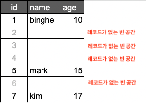
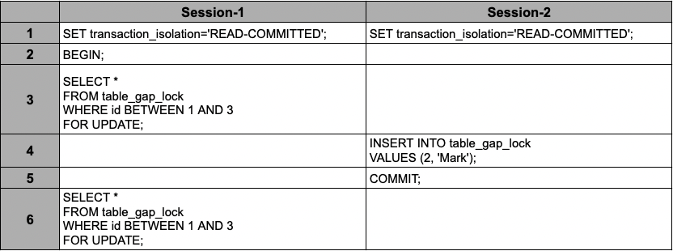
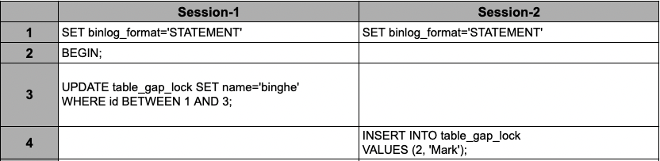

# 목차

<br>

<br>

# MySQL InnoDB Lock 이해하기
MySQL은 크게 `MySQL 엔진 레벨 잠금`과 `스토리지 레벨 잠금`로 나뉜다.

그리고 이번 글은 MySQL을 사용하면 가장 많이 사용되는 스토리지인 InnoDB의 대한 잠금 (Lock)에 대해서 알아본다.

InnoDB Lock에 대해서 잘 정리된 [공식 문서](https://dev.mysql.com/doc/refman/8.0/en/innodb-locking.html#innodb-insert-intention-locks)를 바탕으로 내가 이해한 개념을 최대한 쉽게 정리한다.

> MySQL 8.0 기준으로 정리하며, MySQL 5.7과 다른 점이 있으면 따로 언급할 예정이다. 그러므로 Mysql 5.7과 8.0에 모두 해당하는 내용을 정리한다.

> 참고로 이 내용은 MySQL InnoDB 잠금에 대한 내용이다. 이 내용이 모든 DBMS에 적용되는 건 전혀 아니다.

<br>

# 1 Row - Level Lock (Shared And Exclusive Locks)

<br>

💁‍♂️ **InnoDB는 Row(행) 레벨 기반의 잠금을 구현한다. 잠금은 크게 `shared (s) lock`와 `exclusive (x) lock` 두 종류가 존재한다.**

* `shared lock`은 `공유 락`이라고 불리우며, 이 잠금을 보유한 트랜잭션이 행을 읽을 수 있도록 허용한다. (READ)
* `exclusive lock`은 `베타적 락`이라고 불리우며, 이 잠금을 보유한 트랜잭션이 행을 수정하거나 삭제 할 수 있도록 허용한다. (UPDATE, DELETE)

> shared는 공유, exclusive는 배타적 (독점적인, 전용의, 공유하지 않는)라는 의미.

<br>

💁‍♂️ **예시**

만약 `트랜잭션 T1`이 행 `r`에 대해 `shared lock`을 보유하고있다면, 행 `r`에 대한 또 다른 `트랜잭션 T2`의 잠금 획득 요청은 다음과 같이 처리된다.

* `S 잠금 (shared lock)`에 대한 `T2`의 요청은 즉시 허용된다. 즉, `T1`과 `T2` 모두 행 `r`에 대한 `S` 잠금을 유지한다.
* `X 잠금 (exclusive lock)`에 대한 `T2`의 요청은 즉시 허용되지 않는다. `T1`이 보유한 행 `r`에 대한 `S` 잠금을 해제할 때까지 기다려야한다.
  * 보통 트랜잭션이 완료 (Commit or Rollback)되어야 잠금을 해제한다. 즉, `T1`의 트랜잭션이 완료되어야 `T2`가 `X 잠금`을 획득하게된다.

<br>

만약 `트랜잭션 T1`이 행 `r`에 대해 `exclusive lock`을 보유하고있다면, 행 `r`에 대한 또 다른 `트랜잭션 T2`의 잠금 획득 요청은 두 가지 타입 모두 즉시 승인되지 않는다.

즉, `트랜잭션 T2`는 `트랜잭션 T1`이 `X 잠금`을 해제하기전까지 `S 잠금`와 `X 잠금` 모두 획득하지 못하고 기다려야한다.

<br>

💁‍♂️ 결론적으로 S 잠금과 X 잠금간의 잠금 획득 요청은 아래와 같은 관계를 갖는다.

|  |Shared Lock|Exclusive Lock|
|---|---|---|
| **Shared Lock** | O | X |
| **Exclusive Lock** | X | X |

* 여러 트랜잭션이 동시에 하나의 Row의 대한 Shared Lock을 획득을 할 수 있다. 이는 **여러 트랜잭션이 동시에 한 Row에 대해서 Read 할 수 있음을 의미한다.**
  * **한 Row에 대한 Shared Lock을 사용하는 트랜잭션의 쿼리는 서로 공유가능하다. 반면에, Exclusive Lock이 걸린 Row는 다른 어떤 트랜잭션의 쿼리도 접근이 불가하다.**
* 한 트랜잭션이 하나의 Row의 대한 Shared Lock을 점유하고있는 상황에서 다른 트랜젹신이 Exclusive Lock을 획득 할 수 없다. 즉, **다른 트랜잭션이 Read하고있는 Row를 수정하거나 삭제할 수 없다.**
* 한 트랜잭션이 하나의 Row의 대한 Exclusive Lock을 점유하고있는 상황에서 다른 트랜잭션이 Shared Lock과 Exclusive Lock 모두 획득 할 수 없다. 즉, **다른 트랜잭션이 수정하거나 삭제하고있는 Row는 다른 트랜잭션이 Read, Update, Delete 모두 불가능하다.**

> 물론 MySQL는 MVCC를 이용하여 수정중인 Raw의 Undo 로그를 활용하여 읽기를 지원한다. (REPEATABLE-READ의 경우.)

<br>

# 2 Intention Locks

<br>

💁‍♂️ **InnoDB는 Raw 잠금과 Table 잠금을 같이 허용하는 multiple granularity locking (MGL, 다중 단위 잠금)을 지원한다.**

예를 들어, `Lock Tables ... WRITE`와 같은 구문은 지정된 테이블에 대해서 `exclusive lock`을 획득한다.

**MGL을 지원하기위해 InnoDB는 `Intention Lock`을 사용하며, `Intention Lock`은 테이블 레벨의 잠금이다.**

**`Intention Lock` (의도 자금)은 나중에 특정 테이블 Row에 대해 획득할 잠금 (S 혹은 X 잠금)유형을 나타내는 테이블 레벨의 잠금이다.**

그리고 `Intention Lock`은 두 가지 종류가있다.

* `Intention Shared Lock (IS)`는 트랜잭션이 테이블 Row에 `shared lock`을 잡을 의향이 있음을 나타낸다.
  * `SELECT ... FOR SHARE`은 `IS` 잠금을 획득한다.
* `Intention Exclusive Lock (IX)`는 트랜잭션이 테이블 Row에 `exclusive lock`을 잡을 의향이 있음을 나타낸다.
  * `SELECT ... FOR UPDATE`는 `IX` 잠금을 획득한다.

> **정리하면 Intention Lock은 `Row에 대해서 나중에 어떤 row-level lock 걸거야`라는 의도를 알려주기 위해 미리 table-level에 걸어두는 lock이다.**

<br>

🤔 **Table-Level과 Row-Level에 한번씩 lock을 적용하는 이유는 무엇일까?**

**참고로 InnoDB는 묵지적 Tabel-Level Lock의 경우 DML에서는 락이 걸리지않고, DDL에서만 걸리게된다.**

이렇게 두 단계의 잠금을 하는 이유를 예시를 통해 살펴보면 아래와 같다.

만약 A 트랜잭션에서 Row-Level의 `X` 잠금을 가지고 Write을 하고있을때 테이블 스키마가 변경되서는 안 된다. 

Write을 위해 `X` 잠금을 보유하고있는 것은 `IX` 잠금도 보유하고있는 상태기때문에 해당 테이블의 스키마가 변경되는 것을 막을 수 있다.

<br>

💁‍♂️ **Intention Locking의 프로토콜은 다음과 같다.**

* 트랜잭션이 테이블 Raw에 대한 share lock을 획득하려면, 먼저 테이블에 대한 `IS Lock 혹은 더 강한 잠금`을 가지고 있어야한다.
* 트랜잭션이 테이블 Raw에 대한 exclusive lock을 획득하려면, 먼저 테이블에 대한 `IX 잠금`을 가지고 있어야한다.

<br>

💁‍♂️ **Tabel-Level 잠금들 사이의 호환성은 아래와 같다.**

|  |`X`|`IX`|`S`|`IS`|
|---|---|---|---|---|
|`X`|Conflict|Conflict|Conflict|Conflict|
|`IX`|Conflict|Compatible|Conflict|Compatible|
|`S`|Conflict|Conflict|Compatible|Compatible|
|`IS`|Conflict|Compatible|Compatible|Compatible|

* 충돌 (Conflict): 대기상태에 빠짐. (잠금을 가진 트랜잭션이 끝날 때까지 기다린다.)
* 호환 (Compatible): 대기상태에 빠지지않음.

<br>

💁‍♂️ **Intention Lock의 주된 목적은 한 트랜잭션이 Raw의 잠금을 보유하고있거나, 획득할 것이다는 것을 나타내기 위함이다.**

Intention Lock은 전체 테이블에 대한 잠금(`LOCK TABLES ... WRITE`)을 제외한 어떠한 것도 블록하지 않는다. 

<br>

# 3 Record Lock

<br>

💁‍♂️ **Record Lock은 Row가 아닌 인덱스 레코드를 잠그는 Lock이다.**

예를 들어, `SELECT c1 FROM t WHERE c1 = 10 FOR UPDATE;` 구문은 다른 트랜잭션이 `t.c1=10`인 행들에 값을 삽입, 수정, 삭제하는 것을 방지한다.

또한, **Record Lock도 row-level lock과 마찬가지로 Shared Lock과 Exclusive Lock이 존재한다.**

<br>

💁‍♂️ **테이블에 인덱스가 정의되어있지 않아도 Record Lock은 항상 잠긴다.**


인덱스가 하나도 없는 테이블이더라도 내부적으로 자동 생성된 클러스터 인덱스를 이용해 잠금을 설정한다.

<br>

🤔 **인덱스를 잠근다고 Row-Level Lock과 달라지는게있을까?**

있다.

바로 변경해야 할 레코드를 찾기 위해 검색한 인덱스의 레코드를 모두 락을 걸어야한다.

**Record Lock은 인덱스에 잠금을 거는 방식이라 변경해야 할 레코드를 찾기 위해 검색한 인덱스의 레코드를 모두 락을 걸어야한다.**

```shell
# firstname은 인덱스가 걸려있다. (KEY ix_firstname(first_name))
# employees 테이블엔 firstname='binghe`인 사원이 253명이 있으며,
# firstname='binghe`이면서 `last_name`='`kim`인 사원이 1명만 존재한다고 가정해본다.
mysql> SELECT COUNT(*) FROM employees WHERE first_name='binghe';
+------+
|  253 |
+------+

mysql> SELECT COUNT(*) FROM employees WHERE first_name='binghe' AND last_name='kim';
+------+
|    1 |
+------+

# employees 테이블에서 first_name='binghe'이면서 last_name='kim'인 사원의 입사 일자를 변경해본다.
mysql> UPDATE employees SET hire_date=NOW() WHERE first_name='binghe' AND last_name='kim';
```
* **UPDATE문은 몇 개의 레코드에 락을 걸게될까?**
  * 정답은 253건에 모두 잠금을 걸게된다.
  * 그 이유는 인덱스를 사용할 수 있는 WHERE 조건이 `first_name='binghe'`이며, `last_name`에 대한 인덱스는 없기때문에 레코드 253건을 모두 잠그게된다.
* **만약 인덱스가 하나도 없다면?**
  * **당연히 테이블 풀 스캔하면서 UPDATE하는데, 이 과정에서 테이블에 있는 모든 레코드를 잠그게된다.**

> **다시 한번 강조하지만 InnoDB는 레코드 락을 인덱스를 기준으로 잠근다.** 그러므로, InnoDB에선 인덱스 설정이 굉장히 중요하다.

<br>

# 4 Gap Locks

<br>

💁‍♂️ **Gap Lock의 개념**

**Gap Lock은 레코드 자체가 아닌 레코드와 바로 인접한 레코드 사이의 간격을 잠그는 잠금이다.**

**그리고 여기서 말하는 gap은 인덱스 중 DB에 실제 record가 없는 Row들 (혹은 Row들의 영역)을 의미한다.**

예를 들어, 아래와 같이 테이블을 만들고 primary key가 `1, 5, 7`인 데이터를 삽입한다고 가정해본다.

```shell
mysql> CREATE TABLE table_gaplock (
    id INT NOT NULL,
    name VARCHAR(50) DEFAULT NULL,
    age INT NOT NULL,
    PRIMARY KEY(id)
);
create index idx_table_gap_lock_age
    on table_gaplock (age);

msyql> INSERT INTO table_gaplock
    VALUES (1, 'binghe', 10), (5, 'mark', 15), (7, 'kim', 17);
```
<p align="center"> </p>

위와 같이 삽입하고 새로운 트랜잭션에서 존재하지 않는 Row인 `id = 2`의 대한 수정 쿼리를 날려본다. 

```shell
# 트랜잭션 시작
mysql> BEGIN;
# 존재하지 않는 Row인 id = 2의 UPDATE 쿼리 실행.
mysql> UPDATE table_gaplock SET name='binghe2' WHERE id = 2; 
```
위 상황에서 다른 MySQL 클라이언트로 접속하여 어떻게 잠금을 걸고있는지 조회해보면 아래와 같이 출력된다.

```shell
mysql> SELECT * FROM data_locks \G;
*************************** 1. row ***************************
               ENGINE: INNODB
       ENGINE_LOCK_ID: 140489185845248:1067:140489118509888
ENGINE_TRANSACTION_ID: 3868
            THREAD_ID: 48
             EVENT_ID: 36
        OBJECT_SCHEMA: realmysql
          OBJECT_NAME: table_gaplock
       PARTITION_NAME: NULL
    SUBPARTITION_NAME: NULL
           INDEX_NAME: NULL
OBJECT_INSTANCE_BEGIN: 140489118509888
            LOCK_TYPE: TABLE
            LOCK_MODE: IX
          LOCK_STATUS: GRANTED
            LOCK_DATA: NULL
*************************** 2. row ***************************
               ENGINE: INNODB
       ENGINE_LOCK_ID: 140489185845248:5:4:3:140489118506928
ENGINE_TRANSACTION_ID: 3868
            THREAD_ID: 48
             EVENT_ID: 36
        OBJECT_SCHEMA: realmysql
          OBJECT_NAME: table_gaplock
       PARTITION_NAME: NULL
    SUBPARTITION_NAME: NULL
           INDEX_NAME: PRIMARY
OBJECT_INSTANCE_BEGIN: 140489118506928
            LOCK_TYPE: RECORD
            LOCK_MODE: X,GAP
          LOCK_STATUS: GRANTED
            LOCK_DATA: 5
```
* 첫번째는 테이블 잠금 (`LOCK_TYPE: TABLE`)이며, `IX`인 것을 볼 수 있다.
  * 테이블안의 하나의 Row에 대한 UPDATE문 쿼리이기때문에, 테이블엔 대한 `IX`가 걸린 것.
* 두번째는 레코드 잠금 (`LOCK_TYPE: RECORD`)이며, `X, GAP`인 것을 볼 수 있다.
  * 이를 통해, 존재하지않는 인덱스에 대해서 UPDATE시 Gap Lock 얻는 다는 것을 알 수 있다.

<br>

또한, **`UPDATE`뿐만 아니라 `SELECT ... FOR UPDATE`, `DELETE`와 같이 `X` 잠금을 얻는 쿼리의경우에도 Gap Lock을 획득한다.**

즉, **아래 쿼리도 Gap Lock을 얻는다는 의미이다.**

* `DELETE FROM table_gaplock WHERE id = 2;`
* `SELECT * FROM table_gaplock WHERE id = 2 FOR UPDATE;`

<br>

🤔 **그렇다면 존재하는 인덱스의 사이 값이 아닌 `id = 100`를 수정하는 쿼리를 날려도 Gap Lock을 얻을까?**

정답은 아니다. Gap Lock을 얻지 못하고, `id = 100`에 대한 `X` 잠금을 얻을 뿐이다.

그 이유는 **Gap Lock 자체가 존재하는 레코드와 바로 인접한 레코드 사이의 간격을 잠그는 잠금이기때문이다.**

<br>

💁‍♂️ **갭 락이 필요한 이유? - 중요**

* **Repeatable Read 격리 수준 보장**
  * 갭 락이 없다면 아래와 같이 PHANTOM READ가 발생할 수 있다.
  <p align="center"> </p>
  
  * 실제로 위와 같이 실행시 3, 6번의 SELECT 결과가 다르다. 그 이유는 `READ-COMMITTED`의 경우 3번 실행할 때 베타적 잠금을 걸지 않는다. 즉, 갭 락을 걸지않는다.
  * 하지만 **`Repeatable Read`는 트랜잭션 범위 내에서 조회한 내용이 항상 동일함을 보장해야한다. 그러므로 3번 실행할 때 베타적 잠금을 걸고 `id` 인덱스에 갭 락을 걸게된다.** 즉, 인덱스의 `id=2` Row에 Gap Lock을 걸게된다.
  * 그러므로 4번의 INSERT문은 Session-1의 트랜잭션이 종료될때까지 대기하다 실행된다.
* **Replication 일관성 보장** (Binary Log Format = Statement 또는 Mixed 일 때)
  * MySQL의 Replication은 데이터를 복제하는 것이 아닌, 바이너리 로그를 기록하여 가져가는 형태이다.
  <p align="center"> </p>

  * 실제로 위와 같이 실행시 갭 락이 제대로 동작하여 4번의 INSERT문은 바로 실행되지않고 3번 UPDATE의 트랜잭션이 완료되고나서 실행된다.
    * 이는 3번의 UPDATE문이 베타적인 락을 걸면서 인덱스 `id=2`에 갭 락도 같이 걸기때문이다.
  * 만약 3번 UPDATE문 실행시 갭 락이 걸지않고, 세션 1번보다 2번이 먼저 완료된다면. Source DB와 Replica DB에서의 트랜잭션 실행 순서가 거꾸로 되어 데이터가 서로 달라지는 결과를 만들게된다.
  * 그러므로 바이너리 로그 포맷이 STATEMENT일 때, 갭 락이 필요한 이유는 Source DB와 Replica DB의 데이터 부정합을 방지하기 위함이다.
* **Foreign Key 일관성 보장**

> 참고: https://medium.com/daangn/mysql-gap-lock-%EB%8B%A4%EC%8B%9C%EB%B3%B4%EA%B8%B0-7f47ea3f68bc

<br>

💁‍♂️ **Gap Lock는 내부적으로 Shared Lock 형태만 존재한다.**

**Gap Lock의 주된 목적은 순수하게 다른 트랜잭션이 대상 간격 (Gap)에 새로운 레코드가 INSERT 되는 것을 막는 것이다.**

그러므로 `X 잠금`에 속하는 `UPDATE`, `DELETE`, `SELECT ... FOR UPDATE`에 의한 Gap Lock은 여러 트랜잭션끼리 서로 호환된다.

> `data_locks`로 보여지는 정보가 `X, GAP`이라도 Shared Lock 형태이다.

즉, 2개의 트랜잭션에서 동시에 Gap Lock을 요청해도 잠금 경합이 발생하지 않고 바로 Gap Lock을 획득하게된다.

> [공식 문서](https://dev.mysql.com/doc/refman/8.0/en/innodb-locking.html#innodb-insert-intention-locks)에도 Shared Gap Lock (gap S-lock)과 Exclusive Gap Lock (gap X-lock)이 서로 호환된다고 말하고있다.

<br>

💁‍♂️ **Gap Lock의 주 목적은 순순하게 다른 트랜잭션이 대상 간격 (Gap)에 새로운 레코드가 INSERT 되는 것을 막는 것이다.**

그리고 **이는 PHANTOM READ의 문제를 방지하기위해서 사용되는 것이다.**

<br>

💁‍♂️ Gap Lock은 성능과 동시성 사이에서 트레이드 오프가 발생하게된다. 그리고 일부 트랜잭션 격리 레벨에서 사용되고, 일부 트랜잭션 격리 레벨에선 사용되지않는다.

<br>

💁‍♂️ GapLock은 테이블의 레코드 건수가 적을 수록 Gap Lock의 간격이 더 넓어지는 역효과가 발생한다.

<br>

# 5 Next Key Lock

<br>

💁‍♂️ **Next Key Lock 개념**

**Gap Lock은 순수하게 레코드 사이의 간격만 잠그는 것이 아니라, 필요에따라 레코드와 간격을 동시에 잠긴다.**

<p align="center"> </p>

예를 들어, 위와 같은 상황에서 `UPDATE table_gaplock SET ... WHERE id BETWEEN 1 AND 5` 쿼리를 요청하면 InnoDB는 `id >= 1 & id <= 5`사이에 존재하는 모든 레코드를 잠근다.

* 1과 5는 Record Lock (X Lock)
* 2, 3, 4는 Gap Lock

그리고 **이렇게 Record Lock과 Gap Lock을 같이 거는 것을 `Next Key Lock`이라고 부른다.**

<br>

# 6 Insert Intention Locks


# 참고
* https://dev.mysql.com/doc/refman/8.0/en/innodb-locking.html#innodb-insert-intention-locks
* https://www.slideshare.net/billkarwin/innodb-locking-explained-with-stick-figures
* https://medium.com/daangn/mysql-gap-lock-%EB%8B%A4%EC%8B%9C%EB%B3%B4%EA%B8%B0-7f47ea3f68bc


