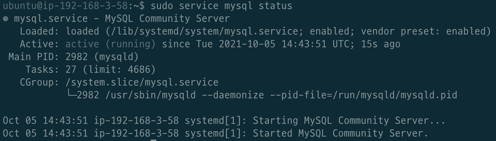

# 목차

<br>

- [목차](#목차)
- [개요](#개요)
- [MySQL 5.7 설치](#mysql-57-설치)
  - [apt (패키지) 방식 설치](#apt-패키지-방식-설치)
- [MySQL 5.7 설정](#mysql-57-설정)
  - [계정 설정](#계정-설정)
    - [계정 조회](#계정-조회)
    - [계정 비밀번호 설정 및 수정](#계정-비밀번호-설정-및-수정)
    - [계정 추가](#계정-추가)
    - [계정 삭제](#계정-삭제)
    - [스키마 및 테이블 계정 권한 부여](#스키마-및-테이블-계정-권한-부여)
    - [스키마 및 테이블 계정 권한 제거](#스키마-및-테이블-계정-권한-제거)
    - [계정 권한 조회](#계정-권한-조회)
- [MySQL 5.7 환경 설정](#mysql-57-환경-설정)

<br>

# 개요
이번 글은 별다른 내용없이 MySQL를 설치하여 환경을 구축하고, 설정하는 것을 정리한 글입니다.

그저 필자가 추후에 검색을 하지않고, 편하게 보기 위한 글입니다.

환경은 다음과 같습니다.
* Ubuntu 18.04 LTS
* MySQL 5.7

<br>

# MySQL 5.7 설치
> MySQL 버전 별 역사는 [여기](https://www.codetd.com/ko/article/6808446)를 참고.

MySQL은 다른 애플리케이션처럼 아래와 같은 설치 방법을 지원한다.
* binary 방식 설치
* Source 컴파일 방식 설치
* apt (패키지) 방식 설치

본 글에선 우선 apt (패키지) 방식의 설치만 다룰 예정이다.

> 추후에 binary나 Source 컴파일 방식의 설치가 필요해질 때 여기에 추가할 예정.

<br>

## apt (패키지) 방식 설치

```bash
$ sudo apt update
$ sudo apt-cache search mysql-server
$ sudo apt-get install mysql-server-5.7
```

설치가 완료되고 자동으로 Service로 실행이 된다.

<p align="center"> <p>

<br>

처음에 root 계정으로 접속하고 싶으면 `sudo`를 붙여줘야한다.

```bash
sudo mysql -u root
```

MySQL 설치완료.

<br>

# MySQL 5.7 설정

<br>

## 계정 설정

<br>

### 계정 조회
현재 어떤 계정이 있는지 확인한다.

`mysql` 스키마의 `user`테이블안에 계정 정보가 저장된다.

```bash
mysql> USE mysql;
mysql> SELECT Host, User, plugin, authentication_string FROM user;

+-----------+------------------+-----------------------+-------------------------------------------+
| Host      | User             | plugin                | authentication_string                     |
+-----------+------------------+-----------------------+-------------------------------------------+
| localhost | root             | auth_socket           |                                           |
| localhost | mysql.session    | mysql_native_password | *THISISNOTAVALIDPASSWORDTHATCANBEUSEDHERE |
| localhost | mysql.sys        | mysql_native_password | *THISISNOTAVALIDPASSWORDTHATCANBEUSEDHERE |
| localhost | debian-sys-maint | mysql_native_password | *8EDC38E9A2CD62EED8AB74A4F4631DD269FDDEB7 |
+-----------+------------------+-----------------------+-------------------------------------------+
4 rows in set (0.00 sec)
```

<br>

**`sudo`없이 `root`에 접속하는 방법**

`root` 유저의 대한 계정 plugin 종료를 변경해주면 된다.

```bash
mysql> UPDATE user SET plugin='mysql_native_password' WHERE User='root';

mysql> FLUSH PRIVILEGES;
```
이제 MySQL을 종료(`exit`)하고 다시 들어올 땐 sudo 없이도 접속할 수 있다.

<br>

### 계정 비밀번호 설정 및 수정
```bash
mysql> USE mysql;

mysql> UPDATE user SET authentication_string=password('1234') where user='root';

mysql> FLUSH PRIVILEGES;
```
이제 `root`로 접속하기 위해선 비밀번호 `1234`가 필요하다.

> 다른 버전의 MySQL 비밀번호 수정은 [여기](https://dazemonkey.tistory.com/101)를 참고.

<br>

### 계정 추가
```bash
mysql> CREATE user test@'%' identified by 'test';
```
위 쿼리의 의미는 `test`라는 이름과 비밀번호를 가진 계정을 생성한다는 의미다.

이때 `'%'`를 붙여줌으로써, 모든 IP에서 해당 계정에 접속할 수 있도록 하였다.

만약 특정 IP에서만 접속하길 원한다면 `@`뒤에 붙여주면된다. 

(ex. `test@localhost`)

<br>

### 계정 삭제
```bash
delete from user where user='username';
```

<br>

### 스키마 및 테이블 계정 권한 부여
> 참고로 MySQL에선 Database와 Schema를 동일시합니다.
특정 계정이 특정 스키마에만 접근할 수 있게 권한을 설정하는 것.

스키마 권한 제어는 DCL (Data Control Language)에 속한다.

DCL의 종류에는 `GRANT`와 `REVOKE`가 있다.

```bash
mysql> GRANT ALL PRIVILEGES ON '스키마명'.'테이블명' TO '계정명'@'호스트' IDENTIFIED BY '계정 비밀번호' WITH GRANT OPTION;
mysql> FLUSH PRIVILEGES;
```

<br>

만약 계정에 select 권한만 부여하고 싶다면 아래와 같이하면 된다.

```bash
mysql> GRANT SELECT PRIVILEGES ON '스키마명'.'테이블명' TO '계정명'@'호스트' IDENTIFIED BY '계정 비밀번호' WITH GRANT OPTION;
mysql> FLUSH PRIVILEGES;
```

<br>

**예시**

```bash
mysql> GRANT ALL PRIVILEGES ON speed_test.* TO test@'%' IDENTIFIED BY 'test' WITH GRANT OPTION;
mysql> FLUSH PRIVILEGES;
```

<br>

### 스키마 및 테이블 계정 권한 제거
```bash
mysql> REVOKE ALL ON '스키마명'.'테이블명' FROM '계정명'@'호스트';
mysql> FLUSH PRIVILEGES;
```

<br>

### 계정 권한 조회
특정 계정이 테이블들에 어떠한 권한이 설정되었는지 볼 수 있다.

```bash
mysql> SHOW GRANTS FOR '계정명'@'호스트';
```

<br>

# MySQL 5.7 환경 설정
MySQL 5.7 패키지 설치하면 아래 위치에 설정파일 (configuration)이 존재한다.

`/etc/mysql/mysql.conf.d/mysqld.cnf`

<br>

설정 파일을 열면 아래와 같이 나온다.

```bash
# The MySQL database server configuration file.
#
# You can copy this to one of:
# - "/etc/mysql/my.cnf" to set global options,
# - "~/.my.cnf" to set user-specific options.
#
# One can use all long options that the program supports.
# Run program with --help to get a list of available options and with
# --print-defaults to see which it would actually understand and use.
#
# For explanations see
# http://dev.mysql.com/doc/mysql/en/server-system-variables.html

# This will be passed to all mysql clients
# It has been reported that passwords should be enclosed with ticks/quotes
# escpecially if they contain "#" chars...
# Remember to edit /etc/mysql/debian.cnf when changing the socket location.

# Here is entries for some specific programs
# The following values assume you have at least 32M ram

[mysqld_safe]
socket          = /var/run/mysqld/mysqld.sock
nice            = 0

[mysqld]
#
# * Basic Settings
#
user            = mysql
pid-file        = /var/run/mysqld/mysqld.pid
socket          = /var/run/mysqld/mysqld.sock
#
user            = mysql
pid-file        = /var/run/mysqld/mysqld.pid
socket          = /var/run/mysqld/mysqld.sock
port            = 3306
basedir         = /usr
datadir         = /var/lib/mysql
tmpdir          = /tmp
lc-messages-dir = /usr/share/mysql
skip-external-locking
#
# Instead of skip-networking the default is now to listen only on
# localhost which is more compatible and is not less secure.
bind-address            = 127.0.0.1
#
# * Fine Tuning
#
key_buffer_size         = 16M
max_allowed_packet      = 16M
thread_stack            = 192K
thread_cache_size       = 8
# This replaces the startup script and checks MyISAM tables if needed
# the first time they are touched
myisam-recover-options  = BACKUP
#max_connections        = 100
#table_open_cache       = 64
#thread_concurrency     = 10
#
# * Query Cache Configuration
#
query_cache_limit       = 1M
query_cache_size        = 16M
#
# * Logging and Replication
#
# Both location gets rotated by the cronjob.
# Be aware that this log type is a performance killer.
# As of 5.1 you can enable the log at runtime!
#general_log_file        = /var/log/mysql/mysql.log
#general_log             = 1
#
# Error log - should be very few entries.
#
log_error = /var/log/mysql/error.log
#
# Here you can see queries with especially long duration
#slow_query_log         = 1
#slow_query_log_file    = /var/log/mysql/mysql-slow.log
#long_query_time = 2
#log-queries-not-using-indexes
#
# The following can be used as easy to replay backup logs or for replication.
# note: if you are setting up a replication slave, see README.Debian about
#       other settings you may need to change.
#server-id              = 1
#log_bin                        = /var/log/mysql/mysql-bin.log
expire_logs_days        = 10
max_binlog_size   = 100M
#binlog_do_db           = include_database_name
#binlog_ignore_db       = include_database_name
#
# * InnoDB
#
# InnoDB is enabled by default with a 10MB datafile in /var/lib/mysql/.
# Read the manual for more InnoDB related options. There are many!
#
# * Security Features
#
# Read the manual, too, if you want chroot!
# chroot = /var/lib/mysql/
#
# For generating SSL certificates I recommend the OpenSSL GUI "tinyca".
#
# ssl-ca=/etc/mysql/cacert.pem
# ssl-cert=/etc/mysql/server-cert.pem
# ssl-key=/etc/mysql/server-key.pem
```
* IP, 포트 설정
  * 원하는 IP와 포트는 `bind-address`와 `port`를 통해 수정하면 된다.

<br>

모든 설정은 수정한 후, MySQL을 재시작해주면 된다.

```bash
$ sudo service mysql restart
```

