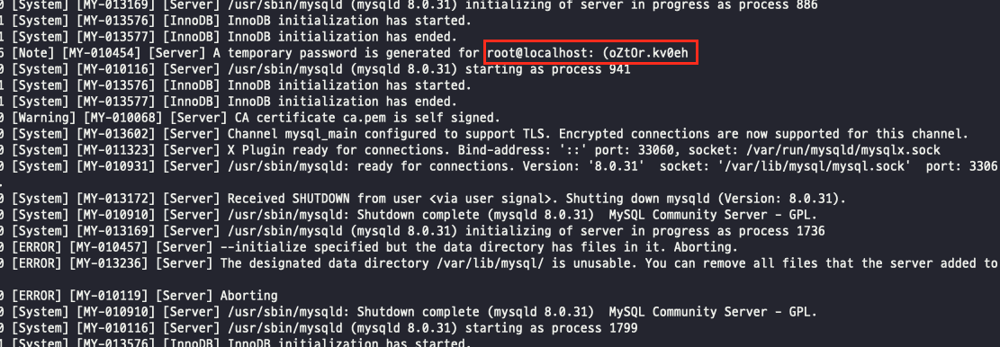
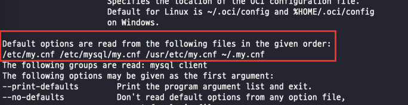
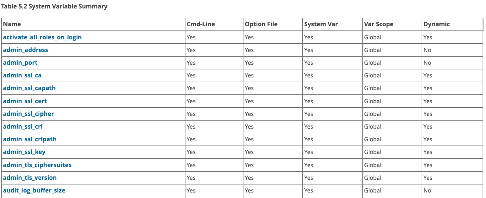

[Real MySQL 8.0](http://www.yes24.com/Product/Goods/103415627)을 바탕으로 작성한 자료입니다.

<br>

# 목차

<br>

- [목차](#목차)
- [MySQL 설치와 설정](#mysql-설치와-설정)
- [1 MySQL 설치](#1-mysql-설치)
  - [1-1 MySQL 설치](#1-1-mysql-설치)
  - [1-2 MySQL 실행와 종료](#1-2-mysql-실행와-종료)
  - [1-3 MySQL 접속](#1-3-mysql-접속)
- [2 MySQL 서버 설정](#2-mysql-서버-설정)
  - [2-1 설정 파일 위치](#2-1-설정-파일-위치)
  - [2-2 설정 파일의 구성](#2-2-설정-파일의-구성)
  - [2-3 시스템 변수](#2-3-시스템-변수)
  - [2-4 글로벌 변수와 세션 변수](#2-4-글로벌-변수와-세션-변수)
  - [2-5 정적 변수와 동적 변수](#2-5-정적-변수와-동적-변수)

<br>

# MySQL 설치와 설정
MySQL을 제대로 다루기 위해선 MySQL을 설치하고 설정하는 방법에 대해서 이해해야한다.

이번 글은 MySQL을 운영하는데 필요한 설치와 설정에 대해서 다룬다.

<br>

# 1 MySQL 설치
> MySQL 버전 별 역사는 [여기]()참고.

MySQL은 다른 애플리케이션처럼 아래와 같은 설치 방법을 지원한다.

* binary 방식 설치
* Source 컴파일 방식 설치
* 패키지 방식 처리

본 글에선 Yum (rpm 기반의 패키지 매니저)를 이용한 설치 방식을 다룬다.

<br>

## 1-1 MySQL 설치
```shell
# Yum 리포지토리 다운
$ wget https://dev.mysql.com/get/mysql80-community-release-el7-3.noarch.rpm

# Yum 리포지토리 설치
$ sudo rpm -Uvh mysql80-community-release-el7-3.noarch.rpm

# Yum 리포지토리 확인
$ yum repolist enabled | grep "mysql."

# 설치가능한 MySQL 버전별 조회
$ sudo yum search mysql-community
$ sudo yum --showduplicates list mysql-community-server

# MySQL 설치
$ yum install mysql-community-server-8.0.21

# MySQL 설치된 버전 확인 
$ mysqld -V
```
마지막 명령을통해 설치된 버전이 확인되었다면, 이상없이 MySQL가 설치되었을 것이다.

> 본 글은 Amazon Linux 2를 이용하여 실습을 진행했습니다.

<br>

## 1-2 MySQL 실행와 종료
이제 MySQL 서버의 설치를 완료했으니, MySQL을 실행하고 종료하는 법에대해서 정리해본다.

<br>

💁‍♂️ **기본 설정 파일**

MySQL 서버가 설치되면 `/etc/my.cnf` 설정 파일이 준비되며, 이 파일엔 MySQL 서버를 실행하는데 꼭 필요한 3~4개의 기본적인 설정이 되어있다.

<details>
  <summary>my.cnf 파일 내용</summary>
  
  ---
  
  ```shell
  # For advice on how to change settings please see
# http://dev.mysql.com/doc/refman/8.0/en/server-configuration-defaults.html

[mysqld]
#
# Remove leading # and set to the amount of RAM for the most important data
# cache in MySQL. Start at 70% of total RAM for dedicated server, else 10%.
# innodb_buffer_pool_size = 128M
#
# Remove the leading "# " to disable binary logging
# Binary logging captures changes between backups and is enabled by
# default. It's default setting is log_bin=binlog
# disable_log_bin
#
# Remove leading # to set options mainly useful for reporting servers.
# The server defaults are faster for transactions and fast SELECTs.
# Adjust sizes as needed, experiment to find the optimal values.
# join_buffer_size = 128M
# sort_buffer_size = 2M
# read_rnd_buffer_size = 2M
#
# Remove leading # to revert to previous value for default_authentication_plugin,
# this will increase compatibility with older clients. For background, see:
# https://dev.mysql.com/doc/refman/8.0/en/server-system-variables.html#sysvar_default_authentication_plugin
# default-authentication-plugin=mysql_native_password

datadir=/var/lib/mysql
socket=/var/lib/mysql/mysql.sock

log-error=/var/log/mysqld.log
pid-file=/var/run/mysqld/mysqld.pid
  ```
  
  ---
</details>

> 이는 실제 DB를 운용하는데는 설정이 굉장히 부족하므로, 실제 운용시 수정해서 사용하기를 권고한다. 아래에서 설정과 관련해서 더 자세히 다룬다.
> 
> 여기선 일단 설정을 무시하고 MySQL을 실행해본다.

<br>

💁‍♂️ **데이터 파일 준비** (root 계정 초기 설정)

MySQL 서버를 실행하는데 필요한 초기 데이터 파일(시스템 테이블이 저장되는 데이터 파일)과 트랜잭션 로그 (리두 로그)파일을 생성한다.

```shell
$ mysqld --defaults-file=/etc/my.cnf --initialize-insecure
```
* 초기 root 계정 비밀번호 설정
  * `--initialize-insecure`: 초기 데이터 파일과 로그 파일을 생성하고, 비밀번호가 없는 관리자 계정인 root 유저를 생성하는 설정.
  * `--initialize`: 관리자 계정을 생성하고 비밀번호도 생성하는 설정. 생성된 관리자 계정의 비밀번호는 에러 로그 파일로 기록한다.
    * 에러 로그 경로는 `/var/log/mysqld.log`에 저장된다.

<br>

💁‍♂️ **MySQL 서버 실행과 종료**

유닉스 계열 OS에서 RPM 패키지로 MySQL을 설치했다면 자동으로 `/usr/lib/systemd/system/mysqld.service`에 서비스 파일이 생성된다.

이를 이용해 쉽게 MySQL 서버를 실행하고 종료할 수 있다.

```shell
# MySQL 실행 (서비스 시작)
$ systemctl enable mysqld # 재부팅 시 자동 시작하도록 설정
$ systemctl start mysqld # 서비스 시작
$ systemctl status mysqld # 서비스 구동 여부 확인

# 실행된 프로세스 확인
$ ps -ef | grep mysqld

# MySQL 종료
$ systemctl stop mysqld

# MySQL 원격 종료
mysql> SHUTDOWN;
```

<br>

💁‍♂️ **MySQL 클린 종료**

MySQL 서버에선 실제 트랜잭션이 정상적으로 커밋돼도 데이터 파일에 변경된 내용이 기록되지않고 로그 파일 (리두 로그)에만 기록돼 있을 수 있다. 

> 정확히는 innodb의 버퍼 풀에 백업하고 복구하는 것.

만약 MySQL 서버가 종료될 때 모든 커밋된 내용을 데이터 파일에 기록하고 종료하고싶다면 아래 옵션을 주면된다.

```shell
# 리눅스에서 종료
mysql> SET GLOBAL innodb_fast_shutdown=0;
$ systemctl stop mysqld.service

# 원격에서 종료
mysql> SET GLOBAL innodb_fast_shutdown=0;
mysql> SHUTDOWN;
```

<br>

## 1-3 MySQL 접속
이제 MySQL에 접속하면 된다.

<br>

💁‍♂️ **다양한 접속 방법**

* `mysql -u root -p --host=localhost --socket=/tmp/mysql.sock`
  * 소켓 파일을 이용해 접속하는 예시.
* `mysql -u root -p --host=127.0.0.1 --port=3306`
  * TCP/IP를 통해 로컬 호스트에 접속하는 예시.
* `mysql -u root -p`
  * 기본값으로 호스트는 `localhost`가되며 소켓 파일을 사용하여 접속한다.

> 이때 `localhost`와 `127.0.0.1`은 서로 다르게 인식한다.
> * `localhost`는 유닉스의 프로세스 간 통신 (IPC)를 통해 통신한다.
> * `127.0.0.1`은 TCP/IP 통식 방식으로 루프백 IP를 통해 통신한다. (외부에서도 연결할 때와 동일한 방식)

<br>

💁‍♂️ **접속**

```shell
# MySQL 로그 확인
cat /var/log/mysqld.log
```

<p align="center"><br>생성된 root 초기 비밀번호 </p>

위 임시 비밀번호를 사용하여 접속하면 된다.

```shell
# MySQL 접속
$ mysql -u root -p --host=127.0.0.1 --port=3306
```

> root 계정 비밀번호 설정하지않았다면 비밀번호없이 바로 접속이 될 것이다.

<br>

💁‍♂️ **root 계정 비밀번호 변경**

MySQL 5.7의 경우는 아래와 같다.

```shell
mysql> USE mysql;

# 비밀번호 수정
mysql> UPDATE user SET authentication_string=password('1234') where user='root';

# 변경사항 저장
mysql> FLUSH PRIVILEGES;
```

<br>

MySQL 8.0의 경우는 아래와 같다.

```shell
# 비밀번호 수정
mysql> ALTER user 'root'@'localhost' IDENTIFIED WITH mysql_native_password BY '변경 비밀번호';

# 변경사항 저장
mysql> FLUSH PRIVILEGES;
```

<br>

# 2 MySQL 서버 설정

<br>

## 2-1 설정 파일 위치
MySQL 서버는 단 하나의 설정 파일을 사용하여 실행된다.

리눅스의경우 `my.cnf`라는 이름을 사용하고, 윈도우 계열에서는 `my.ini`라는 이름을 사용한다.

<br>

🤔 **MySQL 서버는 어떤 설정파일을 사용해서 실행될까?**

```shell
$ mysql --help | more
```
위 명령어를 실행하여 조금만 내리면 MySQL이 어떤 순서로 설정파일을 찾아 실행하는지 나온다.

<p align="center"> </p>

실행 결과로 알 수 있듯이 아래 순서로 설정 파일을 찾는다.

1. `/etc/my.cnf`
2. `/etc/mysql/my.cnf`
3. `/usr/etc/my.cnf`
4. `~/.my.cnf`

<br>

## 2-2 설정 파일의 구성
앞서 알아보았듯이, MySQL은 하나의 `my.cnf` 설정파일을 통해 설정한다.

<br>

💁‍♂️ **하나의 설정파일에 여러 개의 설정 그룹을 담을 수 있다.**

> my.cnf
```shell
[mysqld_safe]
malloc-lib = /opt/lib/libtcmalloc_minimal.so

[mysqld]
socket = /usr/local/mysql/tmp/mysql.sock
port = 3306

[mysql]
default-character-set = utf8mb4
socket = /usr/local/mysql/tmp/mysql.sock
port = 3304

[mysqldump]
default-character-set = utf8mb4
socket = /usr/local/mysql/tmp/mysql.sock
port = 3305
```
`mysql_dump`프로그램은 `[mysql_dump]` 설정 그룹을, `mysqld` 프로그램은 `[mysqld]` 설정 그룹을 사용하는 방식이다.

<br>

💁‍♂️ **my.cnf 파일**

MySQL 8.0 서버의 시스템 변수는 대략 570개 수준이며 사용하는 플러그인이나 컴포넌트에 따라 개수는 늘어난다고한다.

기본적인 설정은 아래와 같으나, 상황에따라 필요한 설정을 해주어야한다.

<details>
  <summary>기본 설정</summary>
  
  ---
  
  ```shell
# The MySQL database server configuration file.
#
# You can copy this to one of:
# - "/etc/mysql/my.cnf" to set global options,
# - "~/.my.cnf" to set user-specific options.
#
# One can use all long options that the program supports.
# Run program with --help to get a list of available options and with
# --print-defaults to see which it would actually understand and use.
#
# For explanations see
# http://dev.mysql.com/doc/mysql/en/server-system-variables.html

# This will be passed to all mysql clients
# It has been reported that passwords should be enclosed with ticks/quotes
# escpecially if they contain "#" chars...
# Remember to edit /etc/mysql/debian.cnf when changing the socket location.

# Here is entries for some specific programs
# The following values assume you have at least 32M ram

[mysqld_safe]
socket          = /var/run/mysqld/mysqld.sock
nice            = 0

[mysqld]
#
# * Basic Settings
#
user            = mysql
pid-file        = /var/run/mysqld/mysqld.pid
socket          = /var/run/mysqld/mysqld.sock
#
user            = mysql
pid-file        = /var/run/mysqld/mysqld.pid
socket          = /var/run/mysqld/mysqld.sock
port            = 3306
basedir         = /usr
datadir         = /var/lib/mysql
tmpdir          = /tmp
lc-messages-dir = /usr/share/mysql
skip-external-locking
#
# Instead of skip-networking the default is now to listen only on
# localhost which is more compatible and is not less secure.
bind-address            = 127.0.0.1
#
# * Fine Tuning
#
key_buffer_size         = 16M
max_allowed_packet      = 16M
thread_stack            = 192K
thread_cache_size       = 8
# This replaces the startup script and checks MyISAM tables if needed
# the first time they are touched
myisam-recover-options  = BACKUP
#max_connections        = 100
#table_open_cache       = 64
#thread_concurrency     = 10
#
# * Query Cache Configuration
#
query_cache_limit       = 1M
query_cache_size        = 16M
#
# * Logging and Replication
#
# Both location gets rotated by the cronjob.
# Be aware that this log type is a performance killer.
# As of 5.1 you can enable the log at runtime!
#general_log_file        = /var/log/mysql/mysql.log
#general_log             = 1
#
# Error log - should be very few entries.
#
log_error = /var/log/mysql/error.log
#
# Here you can see queries with especially long duration
#slow_query_log         = 1
#slow_query_log_file    = /var/log/mysql/mysql-slow.log
#long_query_time = 2
#log-queries-not-using-indexes
#
# The following can be used as easy to replay backup logs or for replication.
# note: if you are setting up a replication slave, see README.Debian about
#       other settings you may need to change.
#server-id              = 1
#log_bin                        = /var/log/mysql/mysql-bin.log
expire_logs_days        = 10
max_binlog_size   = 100M
#binlog_do_db           = include_database_name
#binlog_ignore_db       = include_database_name
#
# * InnoDB
#
# InnoDB is enabled by default with a 10MB datafile in /var/lib/mysql/.
# Read the manual for more InnoDB related options. There are many!
#
# * Security Features
#
# Read the manual, too, if you want chroot!
# chroot = /var/lib/mysql/
#
# For generating SSL certificates I recommend the OpenSSL GUI "tinyca".
#
# ssl-ca=/etc/mysql/cacert.pem
# ssl-cert=/etc/mysql/server-cert.pem
# ssl-key=/etc/mysql/server-key.pem
```
  
  ---
</details>

필요한 설정은 필요할 때 아래 시스템 변수 목록에서 찾아서 설정해주면된다.

* https://dev.mysql.com/doc/refman/8.0/en/server-system-variable-reference.html

<br>

## 2-3 시스템 변수
MySQL 서버는 실행할 때 설정 파일의 내용을 읽어 여러가지 설정값들을 메모리에 변수로 저장해놓으며, 이를 `시스템 변수`라고 부른다.

시스템 변수는 MySQL 서버에 접속하여 `SHOW VARIABLES`또는 `Show GLOBAL VARIABLES` 명령으로 확인할 수 있다.

시스템 변수 값이 실제로 서버와 클라이언트에 어떤 영향을 미치는지 알기 위해서는 각 변수가 글로벌 변수인지 세션 변수인지 구분할 수 있어야한다.

그리고 실제로 [시스템 변수 목록](https://dev.mysql.com/doc/refman/8.0/en/server-system-variable-reference.html)을 보면 아래와 같이 5가지 속성을 나타낸다.

<p align="center"><br>출처: https://dev.mysql.com/doc/refman/8.0/en/server-system-variable-reference.html </p>

* Cmd-line: MySQL 서버의 명령행 인자로 설정될 수 있는지 여부.
* Option file: MySQL의 설정 파일인 `my.cnf`로 제어할 수 있는지 여부.
* System Var: 시스템 변수인지 아닌지 나타냄. 
* Var Scope: 시스템 변수의 적용 범위를 나타냄.
  * 글로벌, 세션, 모두.
* Dynamic: 시스템 변수가 동적인지 정적인지 구분하는 변수.

<br>

## 2-4 글로벌 변수와 세션 변수
* 글로벌 변수
  * 하나의 MySQL 서버 인스턴스에서 전체적으로 영향을 미치는 시스템 변수.
  * 단 하나만 존재하는 InnoDB 버퍼 풀 크기 또는 MyISAM의 키 캐시 크기같이 MySQL 서버 자체에 관련된 설정할 때 주로 사용된다.
* 세션 변수
  * MySQL 클라이언트가 서버에 접속할 때 기본적으로 부여하는 옵션의 기본 값을 제어하는데 사용된다.
  * 즉, 클라이언트의 필요에 따라 개별 커넥션 단위로 다른 값으로 변경할 수 있는 변수이다. (대표적으로 `autocommit` 설정)
  * 클라이언트별 기본값은 글로벌 변수이다.
* Both
  * 세션 범위의 시스템 변수 가운데 MySQL 서버의 설정 파일(`my.cnf`)에 명시해 초기화할 수 있는 변수는 대부분 Both로 명시돼있다.
  * 순수하게 세션 범위인 변수는 설정 파일에 초기값을 명시할 수 없다.
  
<br>

## 2-5 정적 변수와 동적 변수
MySQL 서버의 시스템 변수는 서버가 기동중인 상태에서 변경 가능한지 여부에 따라 동적 변수와 정적 변수로 구분된다.

변경하고자하는 변수가 동적 변수라면 MySQL서버를 재시동하지않고도 SET 명령을 통해 수정할 수 있다.

```shell
# 글로별 시스템 변수 조회
mysql> SHOW GLOBAL VARIABLES LIKE '%max_connections%'

# 글로벌 시스템 변수 수정
mysql> SET GLOBAL max_connections=500;
```

<br>

❗️ **SET을 통한 수정은 `my.cnf` 파일까지 업데이트되지않기에, 추후에 변경된 값을 유지하고싶다면 설정 파일도 같이 변경해주어야한다.**

SET을 통한 수정은 MySQL 서버 프로세스의 메모리의 변수를 수정할 뿐이다. 만약 MySQL 서버를 재실행했을 때도 수정된 값을 유지하고싶다면 `my.cnf`에도 값을 변경해주어야한다.

> `SET PERSIST` 명령을통해 설정 파일에도 수정사항을 추가할 수 있다. 하지만 기존 설정파일이 아닌 새로운 파일에 추가된다. (MySQL이 재실행될 때 해당 파일도 같이 읽는다고한다. 하지만.. 설정파일이 복수면 추후 유지보수면에 좋지않을 듯 하다.)

<br>


