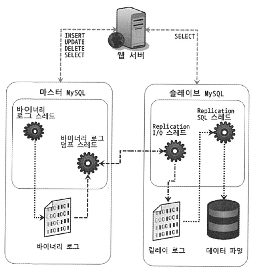
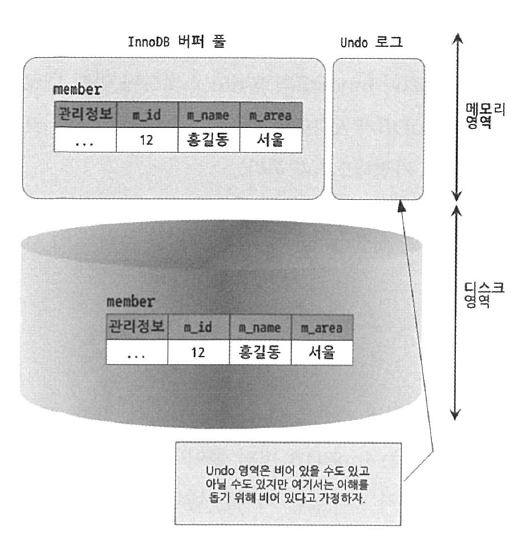

# 목차

<br>

- [목차](#목차)
- [들어가며](#들어가며)
- [MySQL 아키텍처](#mysql-아키텍처)
  - [MySQL의 전체 구조](#mysql의-전체-구조)
  - [MySQL 스레딩 구조](#mysql-스레딩-구조)
  - [메모리 할당 및 사용 구조](#메모리-할당-및-사용-구조)
  - [플러그인 스토리지 엔진 모델](#플러그인-스토리지-엔진-모델)
  - [쿼리 실행 구조](#쿼리-실행-구조)
  - [복제 (Replication)](#복제-replication)
  - [쿼리 캐시](#쿼리-캐시)
- [InnoDB 스토리지 엔진 아키텍처](#innodb-스토리지-엔진-아키텍처)
  - [InnoDB 스토리지 엔진의 특성](#innodb-스토리지-엔진의-특성)
  - [InnoDB 버퍼 풀](#innodb-버퍼-풀)
  - [Undo 로그](#undo-로그)
  - [Insert Buffer](#insert-buffer)
  - [Redo 로그 및 로그 버퍼](#redo-로그-및-로그-버퍼)
  - [MVCC](#mvcc)
  - [잠금 없는 일관된 읽기](#잠금-없는-일관된-읽기)
- [MySQL 로그 파일](#mysql-로그-파일)
  - [에러 로그 파일](#에러-로그-파일)
  - [제너럴 쿼리 로그 파일](#제너럴-쿼리-로그-파일)
  - [슬로우 쿼리 로그](#슬로우-쿼리-로그)
  - [바이너리 로그와 릴레이 로그](#바이너리-로그와-릴레이-로그)

<br>

# 들어가며
MySQL을 사용하면서 다양한 시스템과 플러그인을 사용하게 된다.

이때 잘 활용하여 사용할 수 있도록 아키텍처를 정리하고자 한다.

필자가 필요하다고 생각드는 부분부터 정리할 예정이다.

정리가 안 된 부분은 추후에 차근차근 채울 예정.

> 모든 내용은 RealMySQL에서 가져왔습니다.

<br>

# MySQL 아키텍처
이번 챕터의 목표는 MySQL의 내부 구조를 뜯어보자는 것이 아니다.

목적은 MySQL의 쿼리를 작성하고 튜닝할 때 필요한 기본적인 MySQL의 구조를 훑어 보는데 있다.

<br>

## MySQL의 전체 구조
<p align="center"><br>출처: http://docs.oracle.com </p>

`MySQL 서버 = MySQL 엔진 + 스토리지 엔진`

<br>

* MySQL엔진
  * 역할
    * **클라이언트의 접속 및 요청을 처리하며, 요청된 SQL 문장을 분석하거나 최적화하여 실행.** (DBMS의 두뇌에 해당하는 처리 담당)
  * 구성
    * 커넥션 핸들러: 클라이언트로부터의 접속 및 쿼리 요청을 처리.
    * SQL 파서: 요청으로부터 온 SQL을 파싱.
    * 전처리기
    * 옵티마이저: 쿼리의 최적화된 실행을 위한 장치.
    * 캐시와 버퍼 풀: 성능 향상을 위해 MyISAM의 키 캐시나 InnoDB의 버퍼 풀과 같은 보조 저장소.
* 스토리지 엔진
  * 역할
    * 실제 데이터를 디스크 스토리지에 저장하거나 디스크 스토리지로부터 데이터를 읽어오는 역할 담당.
  * 구성
    * InnoDB
    * MyISAM
    * ...
  * 특징
    * MySQL서버에서 MySQL 엔진은 하나지만, 스토리지 엔진은 여러 개를 동시에 사용할 수 있다.
    * 아래 예시처럼 **스토리지 엔진을 지정하면 이후 해당 테이블의 모든 읽기와 쓰기 작업은 정의된 스토리지 엔진을 사용한다.**
    * ex. `mysql> CREATE TABLE test_table (...) ENGINE=INNODB;`
* 핸들러 API
  * MySQL 엔진에서 데이터를 쓰거나 읽어야 할 때 각 스토리지 엔진에게 요청을 하는데, 이러한 요청을 **핸들러 요청**이라한다.
  * 그리고 여기서 사용되는 API를 핸들러 API라 한다. (스토리지 엔진의 API라고 보면 될 듯 하다.)
  * `SHOW GLOBAL STATUS LIKE 'Handler%'`를 통해 얼마나 많은 데이터 작업이 있었는지 확인가능하다.

<br>

## MySQL 스레딩 구조
<p align="center"><br>출처: RealMySQL </p>

MySQL 서버는 프로세스 기반이 아닌 스레드 기반으로 동작한다. 그리고 두 종류의 스레드가 존재한다.

<br>

**포그라운드 스레드**

> 클라이언트 스레드 (사용자 스레드와 똑같은 의미로 사용된다)

* 적어도 MySQL 서버에 **접속된 클라이언트의 수만큼 존재**한다.
* 역할
  * 주로 각 클라이언트가 요청하는 **쿼리 문장을 처리하는 것을 담당**한다.
  * 데이터를 **MySQL의 데이터 버퍼나 캐시로부터 가져오며**, 버퍼나 캐시에 없는 경우에는 직접 디스크의 데이터나 인덱스 파일로부터 데이터를 읽어와서 작업을 처리한다. (캐시)
    * InnoDB의 경우, **데이터 버퍼나 캐시까지만 포그라운드 스레드가 처리하고, 나머지 버퍼로부터 디스크까지 기록하는 작업은 백그라운드 스레드**가 처리한다.

<br>

**백그라운드 스레드**

* MyISAM의 경우에는 해당 사항이 없지만, InnoDB는 여러 가지가 백그라운드로 처리된다.
* InnoDB에서의 백그라운드 스레드는 아래 스레드들을 담당한다. (역할)
  * 인서트 버퍼 (Insert Buffer)를 병합하는 스레드.
  * **로그를 디스크로 기록하는 스레드.**
  * **InnoDB 버퍼 풀의 데이터를 디스크에 기록하는 스레드.** (write thread)
    * `innodb_write_io_threads`로 스레드 개수를 설정할 수 있다.
  * **데이터를 버퍼로 읽어들이는 스레드.**
    * `innodb_read_io_threads`로 스레드 개수를 설정할 수 있다.
  * 기타 여러 가지 잠금이나 데드락을 모니터링하는 스레드.

> 데이터의 쓰기 작업은 지연(버퍼링)하여 처리할 수 있지만, 읽기는 절대 지연될 수 없다.
> 
> 그래서 대부분의 DBMS(ex InnoDB)에는 대부분 쓰기 작업을 버퍼링해서 일괄 처리하는 기능이 탑재되어있다.

<br>

## 메모리 할당 및 사용 구조
<p align="center"><br>출처: RealMySQL </p>

MySQL은 크게 두 가지 메모리 공간이 존재한다.

두 스레드는 **MySQL 서버 내에 존재하는 많은 스레드가 공유해서 사용하는 공간인지 아닌지에 따라 구분**된다.

<br>

**글로벌 메모리 영역**

* 모든 메모리 공간은 MySQL 서버가 시작되면서 운영체제로부터 할당된다.
* 클라이언트 스레드의 수와 무관하게 하나의 메모리 공간만 할당된다.
  * 이 공간의 메모리는 모든 스레드가 공유할 수 있다.
* 종류
  * `innodb_log_buffer_size`
  * `key_buffer_size`
  * `innodb_additional_mem_pool_size`

<br>

**로컬 메모리 영역**

* **클라이언트 커넥션으로부터의 요청을 처리하기 위해 스레드 하나당 하나씩 할당된다.**
  * **각 클라이언트 스레드별로 독립적으로 할당되며, 절대 서로 공유되서 사용되지 않는다.**
  * **경우에 따라선 필요없다고 판단되면 할당되지 않는다.**
  * 클라이언트 스레드가 사용하는 메모리 공간이라고 해서 클라이언트 메모리 영역이라고도 불린다.
* 세션 메모리 영역이라고도 불리며, 클라이언트스레드가 쿼리를 처리하는 데 사용하는 메모리 영역이다.
  * 대표적으로 **커넥션 버퍼와 정렬(소트) 버퍼**등이 있다.
* 종류
  * `sort_buffer_size`
  * `read_buffer_size`
  * `read_rnd_buffer_size`
  * `join_buffer_size`
  * `thread_stack`
  * `binlong_cache_size`

<br>

## 플러그인 스토리지 엔진 모델
MySQL의 독특한 구조 중 대표적인 것이 바로 플러그인 모델이다.

스토리지 엔진과 파서등을 플러그인 형식으로 갈아끼울 수 있다.

<br>

<p align="center"><br>출처: RealMySQL</p>

MySQL에서 쿼리가 실행되는 과정은 대부분이 MySQL 엔진에서 처리되고, "데이터 읽기/쓰기" 작업만 스토리지 엔진에 의해 처리된다.

> `GROUP BY`나 `ORDER BY`등 복잡한 처리도 스토리지 엔진이 아닌 MySQL 엔진 (쿼리 처리기)이 처리한다.
> 
> 스토리지 엔진은 정말 "데이터 읽기/쓰기"작업만 담당한다.

<br>

**이때 "데이터 읽기/쓰기" 작업은 거의 대부분 1건의 레코드 단위로 처리된다.**

또한, **"데이터 읽기/쓰기" 작업은 스토리지 핸들러를 통해서만 가능하다.**

**MySQL 엔진이 스토리지 엔진을 컨트롤하며, 이때 핸들러를 이용한다.**

> 핸들러는 MySQL 소스코드에서 파생된 단어이며, MySQL (운전자)가 스토리지 엔진(자동차)를 핸들 (조정)하는 용어로 사용된다. 
> 
> **스토리지 엔진의 API 개념이라 생각하면 된다.** (MySQL 엔진 -> 핸들러 -> 스토리지 엔진)

<br>

## 쿼리 실행 구조

<p align="center"><br>출처: RealMySQL </p>

**파서**
* 쿼리 문장을 토큰(MySQL이 인식할 수 있는 최소 단위의 어휘나 기호)으로 분리해 **트리 형태의 구조로 만들어 내는 작업**을 의미한다.
* **쿼리 문장의 기본 문법 오류**는 **이 과정에서 발견되며 사용자에게 오류 메시지**를 전달하게 된다.

<br>

**전처리기**
* 파서 과정에서 만들어진 **파서 트리를 기반으로 쿼리 문장에 구조적인 문제점이 있는지 확인**한다.
  * 각 토큰을 테이블 (칼럼, 내장 함수 포함)을 매핑해 해당 객체의 존재 여부 체크.
  * 객체의 접근권한 체크.
* **실제 존재하지 않거나 권한상 사용할 수 없는 개체의 토큰은 이 단계에서 걸러진다.**

<br>

**옵티마이저**
* 사용자 요청으로 들어온 **쿼리 문장을 저렴한 비용으로 가장 빠르게 처리할 지 결정하는 역할을 담당**한다.
  * DBMS의 두뇌에 해당한다고 보면 된다.
* 가장 중요.

<br>

**실행 엔진**
* **옵타마이저가 두뇌라면 실행 엔진과 핸들러는 손과 발에 비유**할 수 있다.
  * ex. 옵티마이저가 `GROUP BY`를 처리하기 위해 임시 테이블을 사용한다고 가정한다면
    1. 실행 엔진은 핸들러에게 임시 테이블을 만들라고 요청.
    2. 다시 실행 엔진은 WHERE 절에 일치하는 레코드를 읽어오라고 핸들러에게 요청.
    3. 읽어온 레코드들을 1번에서 준비한 임시 테이블로 저장하라고 다시 핸들러에게 요청.
    4. 데이터가 준비된 임시 테이블에서 필요한 방식으로 데이터를 읽어 오라고 핸들러에게 다시 요청.
    5. 최종적으로 실행 엔진은 결과를 사용자나 다른 모듈로 넘긴다.
* 위와 같이 **실행 엔진은 만들어진 계획대로 각 핸들러에게 요청해서 받은 결과를 또 다른 핸들러 요청의 입력으로 연결하는 역할**을 수행한다.

> 개인적으로 Layered Architecture의 Application 계층과 유사한 듯 하다.

<br>

**핸들러 - 스토리지 엔진**
* MySQL 서버의 가장 밑단.
* **MySQL 실행 엔진의 요청에 따라 데이터를 디스크로 저장하고 디스크로부터 읽어 오는 역할을 담당한다.**
  * **핸들러는 결국 스토리지 엔진을 의미한다.**

<br>

## 복제 (Replication)

<p align="center"><br>출처: RealMySQL </p>

**Replication이란?**
* 2대 이상의 MySQL 서버가 동일한 데이터를 담도록 실시간으로 동기화하는 기술이다.
* 마스터 (데이터를 변경할 수 있는 서버)와 슬레이브 (조회만 할 수 있는 서버)로 나뉜다.
* 물론 두 서버의 MySQL은 동일한 프로그램이다. 설정을 통해 어떤 역할을 담당할지 설정해주는 것 뿐이다.

<br>

**Replication 동작 원리**
* 마스터가 데이터의 구조나 내용을 변경하는 **모든 쿼리 문장을 바이너리 로그에 저장**한다.
* 슬레이브 서버에서 I/O 스레드를 통해 변경 내역을 요청하면 마스터가 **바이너리 로그**를 읽어 슬레이브에게 넘긴다.
* 슬레이브는 받아온 **바이너리 로그를 릴레이 로그에 기록한다.**
* 슬레이브는 **릴레이 로그에 기록된 변경 내역을 재실행(Reply)함으로써 동기화**한다.

> 쉽게 얘기하면, 마스터에서 쿼리 로그를 슬레이브에 보내고, 슬레이브가 해당 쿼리를 실행해서 동기화하는 것.

<br>

**마스터**
* **MySQL의 바이너리 로그가 활성화되면 어떤 MySQL 서버든 마스터가 될 수 있다.**
* 마스터는 `Binlog dump`라는 스레드를 이용해서 쿼리 문장을 바이너리로 저장하고, 슬레이브에게 전달한다.
  * 슬레이브당 하나의 스레드가 할당된다. 만약 10개의 슬레이브가 있다면 10개의 `Binlog dump`스레드가 생성된다.

<BR>

**슬레이브**
* **데이터(바이너리 로그)를 받아 올 마스터 장비의 정보 (IP주소, 포트 정보 및 접속 계정)을 가지고 있는 경우가 슬레이브이다.**
* 마스터가 바이너리 로그를 가지고 있따면, 슬레이브는 릴레이 로그를 가지고 있다.
  * 슬레이브의 I/O 스레드는 마스터 서버에 접속해 변경 내역을 요청하고, 받아 온 변경 내역을 릴레이 로그에 기록한다.

<br>

**Replication 사용시 주의할 점**
1. 하나의 슬레이브는 하나의 마스터만 설정 가능하다.
2. 마스터와 슬레이브는 데이터 동기화를 위해 슬레이브는 읽기 전용으로 설정한다.
   * 슬레이브 `read_only` 설정 필수
3. **슬레이브 서버용 장비는 마스터와 동일한 사양이 적합하다.**
   * 마스터와 동일한 쿼리를 계속해서 실행하기 때문.
   * 혹시 모를 경우를 대비해 백업 DB로 사용하기 위함.
4. **복제가 불필요한 경우에는 바이너리 로그 중지**
   * 바이너리 로그는 트랜잭션 커밋되는 시점에 기록된다. 그리고 이 행동은 생각보다 큰 비용이다.
   * 불필요할 경우 바이너리 로그를 중지하는 것이 좋다.
5. 바이너리 로그와 트랜잭션 격리 수준
   * 바이너리 로그는 **STATEMENT 포맷 방식과 ROW 포맷 방식**이 있다.
     * **STATMENT: 마스터에서 실행되는 쿼리 문장 기록. (문장 기반 복제)**
     * **ROW: 마스터에서 실행된 쿼리에 의해 변경된 레코드 값 기록. (레코드 기반 복제)**
   * **트랜잭션과 사용할 때 두 방식에 대한 이해와 설정을 조심해서 해야한다.**

<br>

## 쿼리 캐시
<p align="center"><br>출처: RealMySQL </p>

<br>

**쿼리 캐시란**
* 쿼리 실행 결과를 쿼리 캐시에 담아 두고, 동일한 쿼리 요청이 왔을 때 캐시에서 결과를 보낸다. (일반적인 캐시와 동일)

<br>

**저장 방식**
* 쿼리 캐시의 단어 의미와는 달리, SQL 문장을 캐시하는 것이 아니라, 쿼리의 결과를 메모리에 캐시해둔다.
  * `Key:Value = 쿼리 문장 : 실행 결과`
* **쿼리 캐시는 데이터를 테이블 단위로 처리한다.**

<br>

**캐싱할 때 주의할 사항**
1. 요청된 쿼리 문장이 쿼리 캐시에 존재하는가?
2. 해당 사용자가 그 결과를 볼 수 있는 권한이 있는가?
3. 트랜잭션 내에서 실행된 쿼리인 경우, 그 결과가 가시 범위 내의 트랜잭션에서 만들어진 결과인가? (InnoDB인 경우)
   * **InnoDB는 트랜잭션에 ID를 부여하며, ID를 통해 어느 쪽이 먼저 시작된 트랜잭션인지 구분한다.**
   * 각 트랜잭션은 자신의 ID보다 ID 값이 큰 트랜잭션에서 변경한 작업 내역이나 쿼리 결과는 참조할 수 없으며, 이를 트랜잭션의 **가시 범위**라고부른다.
4. 쿼리에 사용된 기능 (내장 함수나 저장 함수 등)이 캐시되도 동일한 결과를 보장할 수 있는가?
   * `CURRENT_DATE`, `SYSDATE`, `RAND`와 같은 호출 시점에 따라 결과가 달라지는 요소가 있는가?
   * PrepareStatement의 경우 변수가 결과에 영향을 미치지 않는가?
5. 캐시가 만들어지고 난 이후 해당 데이터가 다른 사용자에 의해 변경되지 않았는가?
   * **쿼리 캐시는 데이터를 테이블 단위로 처리한다.** 
   * 쿼리 캐시를 1GB처럼 크게 설정하면, 하나의 레코드를 변경하는 것만으로도 캐시 쿼리에 저장된 내용을 전부 지워야한다.
   * 그러므로, **적절한 (32MB ~ 64MB)로 크기를 설정하는 것이 좋다.**
   * ex. **게시판 조회시 조회 수를 증가시켜주는 로직이 있다면, 쿼리 캐시가 비효율적일 수도 있다. 매번 UPDATE하기 때문.**
     * 이럴 땐 조회수 칼럼을 다른 테이블로 분리하거나, 조회수를 일정한 횟수만큼 누적한 후 배치 처리하는 것이 좋다.
6. 쿼리에 의해 만들어진 결과가 캐시하기에 너무 크지 않은가?
   * 쿼리 캐시의 용량이 64MB인데, 하나의 레코드가 60MB를 차지하면 의미가 없다.
   * 그러므로 `query_cache_limit`을 통해 하나의 레코드 용량을 설정해줄 수 있다.
7. 그 밖에 쿼리 캐시를 사용하지 못하게 만드는 요소가 사용되었는가?

<br>

위와 같은 제약사항에도 쿼리 캐시는 충분히 효율적이라고 한다. 

```sql
-- 쿼리 캐시가 얼마나 사용됐고, SELECT 쿼리가 얼마나 실행됐는지 등에 대한 정보를 확인할 수 있다.
mysql> SHOW GLOBAL STATUS LIKE 'Qcache%';

-- Com_select은 쿼리 캐시에서 결과를 찾지 못해서 쿼리가 실제 실행된 횟수를 의미한다.
mysql> SHOW GLOBAL STATUS LIKE 'Com_select';
```
위 두 가지 지표를 이용하여 쿼리 캐시 히트율을 계산할 수 있다.

`쿼리 캐시 히트율 = Qcache_hits / (Qcache_hits + Com_select) * 100`

<br>

쿼리 캐시를 사용하지 않기로 했다면 설정 파일에서 아래와 같이 설정해주면 된다.

```bash
query_cache_size = 0
query_cache_type = 0
```

<br>

# InnoDB 스토리지 엔진 아키텍처
InnoDB는 MySQL에서 가장 많이 사용되는 스토리지 엔진이다.

<br>

<p align="center"><br>출처: RealMySQL </p>

<br>

<p align="center"><br>출처: https://dev.mysql.com/doc/refman/5.7/en/innodb-architecture </p>

<br>

## InnoDB 스토리지 엔진의 특성

<br>

**PK에 의한 클러스터링**
* InnoDB의 **모든 테이블은 기본적으로 PK를 기준으로 클러스터링**되어 저장된다.
  * 즉, **PK값의 순서대로 디스크에 저장된다는 의미이다. 이로 인해 range scan이 굉장히 빠르다.**
* 결과적으로 쿼리의 실행 계획에서 PK가 다른 보조 인덱스에 비해 비중이 높게 설정되어 있다.

<br>

**잠금이 필요 없는 일관된 읽기**

> Non-locking consistent read

* InnoDB 스토리지 엔진은 **MVCC (Multi Version Concurrency Control)라는 기술을 이용해 락을 걸지 않고 읽기 작업을 수행**한다.
  * 락을 걸지 않기 때문에 읽기 작업은 다른 트랜잭션이 가지고 있는 락을 기다리지 않는다.

<br>

**외래 키 지원**
* **InnoDB는 기본적으로 스토리지 엔진 레벨에서 외래 키를 지원한다.**
  * 단, 외래 키는 부모 테이블과 자식 테이블 모두 해당 칼럼에 인덱스 생성이 필요하고, 변경 시에는 반드시 부모 테이블이나 자식 테이블에 데이터가 있는지 체크하는 작업이 필요하므로 잠금이 여러 테이블로 전파되어, 데드락이 발생할 때가 많다.

<br>

**자동 데드락 감지**
* InnoDB는 그래프 기반의 데드락 체크 방식으로 **데드락이 발생함과 동시에 바로 감지**되고, **감지된 데드락은 관련 트랜잭션 중에서 ROLLBACK이 가장 용이한 트랜잭션을 자동적으로 강제 종료**해버린다.
* 따라서 **데드락 때문에 쿼리가 제한 시간(Timeout)에 도달하거나, Slow Query로 기록되는 경우는 많지 않다.**

<br>

**자동화된 장애 복구**
* InnoDB에는 손실이나 장애로부터 데이터를 보호하기 위한 매커니즘이 탑재돼 있다.

<br>

**오라클의 아키텍처 적용**
* InnoDB 스토리지 엔진의 기능은 오라클과 유사한 부분이 많다.
  * MVCC, 언두 데이터가 시스템 테이블 스페이스에 관리되는 것등등

<br>

## InnoDB 버퍼 풀
**버퍼 풀의 역할**
* **디스크의 데이터 파일이나 인덱스 정보**를 **메모리에 캐시**해 두는 공간을 의미한다.
* **쓰기 작업을 지연**시켜 **배치 작업으로 처리할 수 있게 해주는 버퍼 역할**도 한다.
* 이외에도 백그라운드 작업의 기반이 되는 메모리 공간이다.

> 버퍼 풀이 **데이터와 인덱스 그리고 쓰기 버퍼링까지 캐싱**한다.

<br>

**버퍼 풀의 장점**
* **배치 처리를 통한 디스크 작업 최소화 - 캐싱**
  * CUD 쿼리와 같이 데이터를 변경하는 쿼리는 데이터 파일의 이곳저곳에 위치한 레코드를 변경하기 때문에 랜덤한 디스크 작업을 발생시킨다.
  * 버퍼 풀이 이러한 변경된 데이터를 모아서 처리하게 되면 랜덤한 디스크 작업의 횟수를 줄여준다.

<br>

**버퍼 풀 설정**
* 보통 전체 물리적인 메모리의 50 ~ 80% 설정하는 것을 추천한다.
* `innodb_buffer_pool_size`를 통해 설정해준다.

<br>

**더티 페이지**
* 버퍼 풀은 **아직 디스크에 기록되지 않은 변경된 데이터**를 가지고 있다. 그리고 **이 데이터를 저장한 페이지를 더티 페이지**라 부른다.
* 더티 페이지는 **InnoDB에서 주기적 또는 어떤 조건이 되면 체크 포인트 이벤트가 발생**하며, 이때 **디스크 쓰기 작업**이 발생한다.
* **물론 한번에 다 하지 않고, 필요한 만큼씩만 진행한다.**

<br>

## Undo 로그

**Undo 영역의 역할**
* **데이터 변경 (UPDATE, DELETE등)이 발생하면, 변경되기 전의 데이터를 보관하는 곳.**
  * 트랜잭션에서 롤백하게 되면 Undo 영역에서 기존의 데이터를 가져온다.
* 백업 역할.

<br>

**Undo 용도**
1. 트랜잭션의 롤백 대비용
2. 트랜잭션 격리 수준을 유지하면서 높은 동시성을 제공하는데 사용.

<br>

## Insert Buffer

**Insert Buffer 역할**
* InnoDB는 Insert, Update시 변경해야 할 인덱스 페이지가 버퍼 풀에 있으면 바로 업데이트를 수행하지만, 디스크로부터 읽어와야 한다면 이를 즉시 실행하지 않고 **임시 공간에 저장**해두고 바로 사용자에게 결과를 반환하는 형태로 성능을 향상시킨다.
  * 이때 **임시 공간을 Insert Buffer라고 한다.**
* 쉽게 말해, Insert, Update와 같이 데이터 파일을 변경하는 작업을 임시로 Insert Buffer에 저장하고, 백그라운드 스레드에 의해 배치처리된다.
  * 이를 통해, 매번 데이터 변경시 디스크 I/O가 발생하는 성능 이슈를 해결할 수 있다.

<br>

**Insert Buffer가 필요한 이유**
* 잦은 디스크 I/O을 통한 인덱싱 업데이트 문제 해결 (캐싱)
  * 레코드에서 데이터 파일을 변경하는 작업(Insert, Update)은 데이터를 변경하는 작업 외에도, 인덱스를 업데이트하는 작업도 필요하다.
    * 인덱스를 업데이트하는 일을 랜덤하게 디스크를 읽는 작업이 필요하므로, 상당히 많은 자원을 소요하게 된다.
* **Insert Buffer는 디스크에서의 부하를 줄이기 위해, Insert Update와 같은 작업을 임시로 저장하고, 백그라운드 스레드에 의해 병합된다.** (배치 처리)

<br>

**Insert Buffer Merge Thread**
* **Insert Buffer에 임시로 저장돼 있는 인덱스 레코드 조각은 이후 백그라운드 스레드에 의해 병합되며, 이 작업을 Insert Buffer Merge Thread가 담당한다.**

<br>

**주의 사항**
* 사용자에게 결과를 전달하기 전에 처리가 필요한 Unique 인덱스 같은 경우 Insert Buffer를 사용할 수 없다.

<br>

## Redo 로그 및 로그 버퍼

<br>

**Redo 로그가 필요한 이유**

DBMS는 커밋이 발생하면 바로 디스크에 바로 넣지 않고, 메모리 영역 (Buffer Pool, Log Buffer)에 들어가게 된다. 

그리고 백그라운드 스레드에 의해 배치 처리된다. 이를 통해 Disk I/O를 절약할 수 있다.

하지만 **이 장치만으로는 ACID를 보장할 수 없다. 그러므로 변경된 내용을 순차적으로 디스크에 기록하는 로그 파일**을 가지고 있다.

이를 **Redo 로그**라고 한다.

<br>

**Redo 로그란**
* Redo 로그는 트랜잭션 혹은 DB 장애 발생시 복구에 사용되는 로그를 의미한다.
* Redo 로그는 crash recovery 중 불완전한 트랜잭션에 의해 변경된 데이터를 수정하기 위해 사용되는 디스크 기반 데이터 구조이다.
* **Redo 로그는 변경된 내용을 순차적으로 디스크에 기록하는 로그 파일이다.**

<br>

**로그 버퍼**
* Redo 로그 버퍼링에 사용되는 공간.

<br>

## MVCC
> Multi Version Concurrency Control

<br>

**MVCC란**
* 레코드 레벨의 트랜잭션을 지원하는 DBMS가 제공하는 기능.
* **하나의 레코드 (ID가 12인 로우)에 대해 2개의 버전이 유지되고, 필요에 따라 어느 데이터가 보여지는지 여러 가지 상황에 따라 달리지는 구조를 의미한다.**
* **가장 큰 목적은 잠금을 사용하지 않는 일관된 읽기를 제공하는데 있다.**
  * InnoDB는 Undo 로그를 이용해 이 기능을 구현한다.

<br>

**MVCC 예시**
```sql
mysql> INSERT INTO member (m_id, m_name, m_area) VALUES (12, 'binghe', '서울');
```
위와 같이 쿼리를 날리면 MySQL은 다음과 같이 저장하게 된다.

<p align="center"><br>출처: RealMySQL </p>

<br>

```sql
mysql> UPDATE member SET m_area='경기' WHERE m_id=12;
```
그리고 UPDATE문을 날리면 아래와 같이 변경된다. 

<p align="center"><br>출처: RealMySQL </p>

* 버퍼 풀은 새로운 값인 '경기'로 업데이트 된다. 그리고 Undo 로그에 이전 데이터인 '서울'이 저장된다.
* 이때 조회를 하면, 트랜잭션 격리 수준에 따라 다르게 조회된다.
  * `READ_UNCOMMITTED`: 버퍼 풀이나 데이터 파일로부터 변경된 상태의 데이터를 반환한다. ('경기')
  * `READ_COMMITTED` 혹은 그 이상: Undo 영역의 데이터를 반환한다. ('서울')
* 상태 변환
  * `COMMIT` -> 지금의 상태를 영구적인 데이터로 만든다. (버퍼 풀에 있는 내용을 디스크 I/O를 통해 영속화)
    * COMMIT때는 Undo 영역이 바로 삭제되거나 혹은 트랜잭션이 더이상 사용되지 않을 때 삭제된다.
  * `ROLLBACK` -> Undo에 있는 백업 데이터를 버퍼 풀로 다시 복구한다.
    * ROLLBACK때는 Undo 영역의 내용을 삭제한다.

<br>

## 잠금 없는 일관된 읽기
> Non-locking consistent read

* **InnoDB는 `SERIALIZABLE`이 아닌 이상, 읽기 작업은 다른 트랜잭션의 변경 작업과 관계 없이 항상 잠금을 대시하지 않고 바로 실행된다.**
  * Read시 변경되기 전의 데이터는 Undo 로그, 변경된 데이터는 버퍼 풀에서 읽어 결과를 반환한다.

<br>

# MySQL 로그 파일
MySQL의 상태 체크나 장애 대응에 가장 좋은 방법은 로그를 확인하는 것이다.

이번 챕터에선 MySQL에 어떠한 로그가 있는지 알아본다.

<br>

## 에러 로그 파일
  
<br>

**에러 로그**
* MySQL이 실행되는 도중에 발생하는 에러나 경고 메시지가 출력되는 로그 파일.
* 에러 로그의 위치의 디폴트 위치는 `/var/log/mysql/error.log`이며, MySQL 설정 파일을 통해 수정할 수 있다.

<br>

**저장되는 내용**
* MySQL이 시작하는 과정과 관련된 정보성 및 에러 메시지
  * 설정 파일 에러나, 잘못 설정된 파라미터등을 로그를 통해 출력해준다. (에러가 발생해도 디폴트 값으로 실행될 수도 있으니 확인을 꼭 해줘야 한다.)
* 종료할 때 비정상적으로 종료된 경우 나타나는 InnoDB의 트랜잭션 복구 메시지
* 쿼리 처리 도중에 발생하는 문제에 대한 에러 메시지
* 비정상적으로 종료된 커넥션 메시지
  * 클라이언트 애플리케이션에서 정상적으로 접속 종료를 하지 못하고 프로그램이 종료된 경우, 이 로그가 쌓인다. (흔히 보게 된다)
  * `host_name is blocked` -> `max_connect_errors`시스템 변수가 낮게 설정되어, 클라이언트 프로그램이 MySQ에 접속하지 못하는 문제.
* InnoDB의 모니터링 명령이나 상태 조회 명령
* MySQL의 종료 메시지
  * 간혹 갑자기 MySQL이 종료되는데, 그때 이 로그를 확인하여 그 원인을 파악할 수 있다.

<br>

## 제너럴 쿼리 로그 파일
> General Log

<br>

**제너럴 쿼리 로그**
* 실행된 쿼리가 저장되는 로그.
* 제너럴 쿼리 로그는 슬로우 쿼리와 다르게 쿼리 실행 중에 에러가 발생해도 로그가 기록된다.
* 제너럴 쿼리 로그는 설정파일에서 `general_log_file`을 통해 저장 위치를 지정해줄 수 있다.
  * 파일이 아닌 테이블에 저장하도록 해줄 수 도 있다.

<br>

## 슬로우 쿼리 로그

<br>

**MySQL 쿼리 튜닝의 종류**
* 서비스가 적용되기 전에 전체적으로 튜닝하는 경우
* 서비스 운영중에 전체적인 성능 저하를 검사하거나 또는 정기적인 점검을 위해 튜닝하는 경우

<br>

**슬로우 쿼리 로그**
* **슬로우 쿼리 로그는 설정에 설정된 시간 (`long_query_time`)이상의 시간이 소요된 쿼리를 기록한다.**
  * 이를 통해, 서비스 운영중에 성능 저하가 발생하는 쿼리를 쉽게 발견하게 해준다.
* 주의할 점은 쿼리에 오류가 발생하면 슬로우 쿼리는 기록되지 않는다. 이때는 에러 로그와 제너럴 쿼리 로그를 확인해줘야 한다.

<br>

**슬로우 쿼리 설정 방법**

```bash
long_query_time = 1 (초 단위)
log_slow_queries = /var/log/mysql-slow.log (로그 저장 위치)
```

<br>

**슬로우 쿼리 결과 해석**

```bash
# Time: 110202 12:13:14
# User@Host: root[root] @ localhost []
# Query_time: 15.407663 Lock_time: 0.000197 Rows_sent: 0 Rows_examined: 5
update tab set fd=100 where fd=10;
```
* `Time`: 쿼리가 종료된 시점.
* `User@Host`: 쿼리를 실행한 사용자의 계정.
* `Query_time`: 쿼리가 실행되는 데 걸린 전체 시간을 의미.
  * `Lock_time`은 스토리지 엔진이 아닌 MySQL 엔진레벨에서의 테이블 잠금에 대한 대시 시간을 의미한다.
  * `Lock_time`이 0초 이상이라면 점검해볼 필요가 있다.
* `Rows_examined`: 이 쿼리가 처리되기 위해 몇 건의 레코드에 접근했는지를 의미.
* `Rows_sent`: 실제 몇 건의 처리 결과를 클라이언트로 보냈는지를 의미한다. 
  * `Rows_examined`수치는 높은데, 이 수치가 너무 적으면 튜닝해볼 가치가 있다.

<br>

## 바이너리 로그와 릴레이 로그

<br>

**바이너리 로그와 릴레이 로그**
* 마스터 MySQL 서버에 생성되고, 릴레이 로그는 슬레이브 MySQL 서버에 생성된다.
* 둘의 포맷은 동일하다. 즉, 같은 성질을 가진다.

<br>

**특징**
* 순수한 SELECT문장과 같이 데이터의 구조나 내용을 변경하지 않는 쿼리는 기록되지 않는다.
* 바이너리 로그는 이름대로, 이진 파일로 되어있어 사람이 읽기 힘들다. `mysqlbinlog`를 이용하여 변환하여 출력해야한다.

