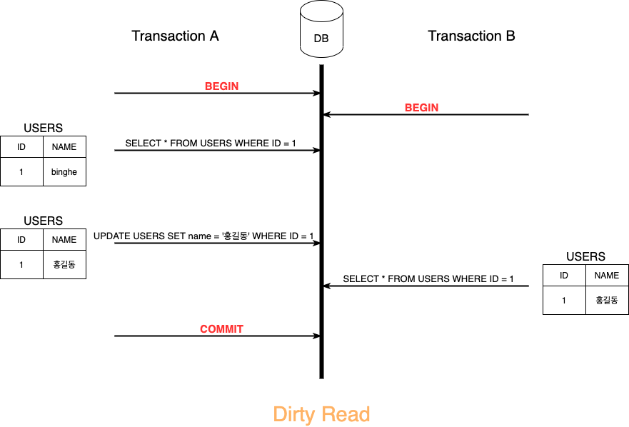
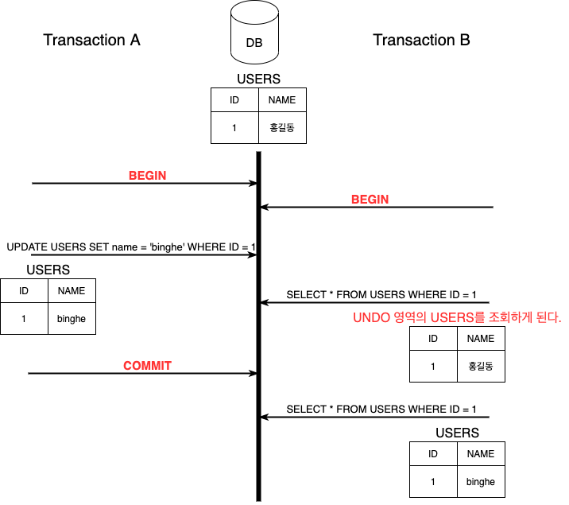
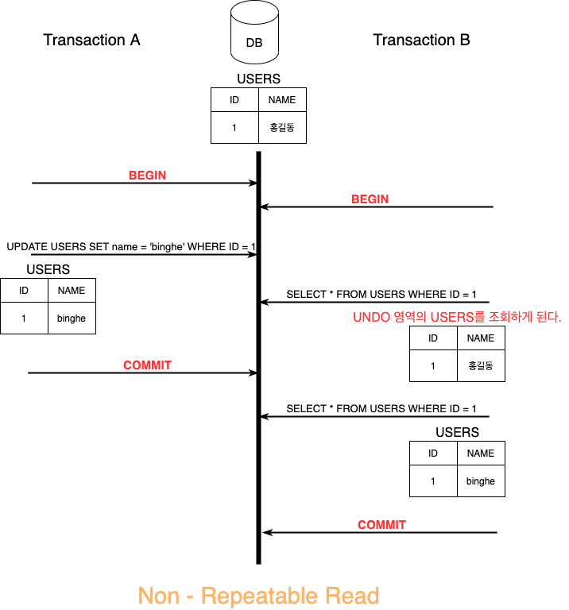
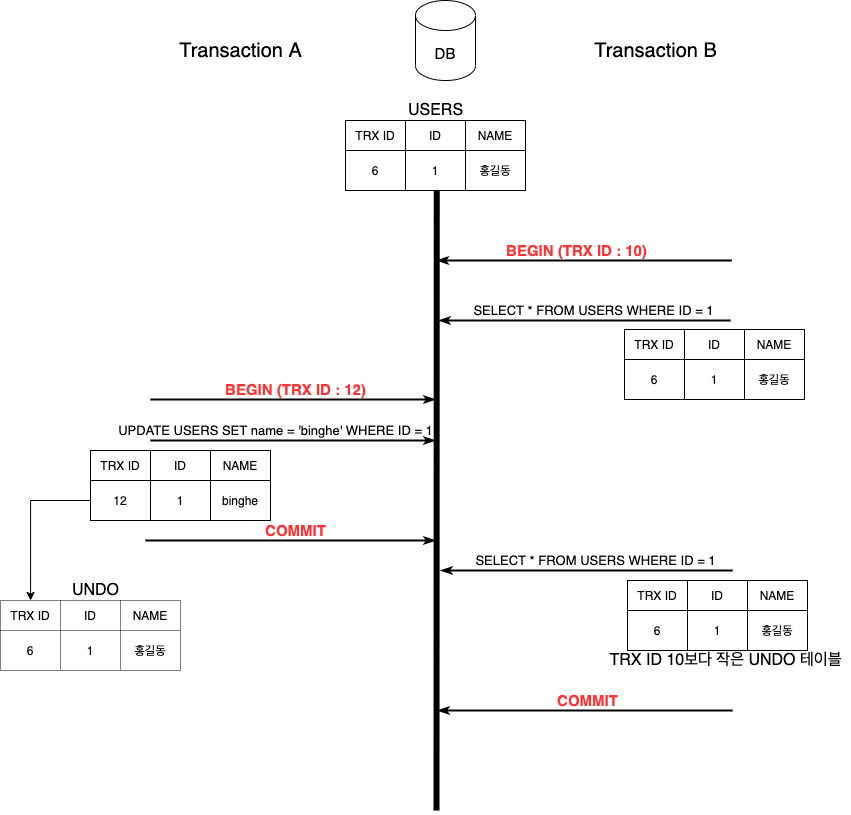
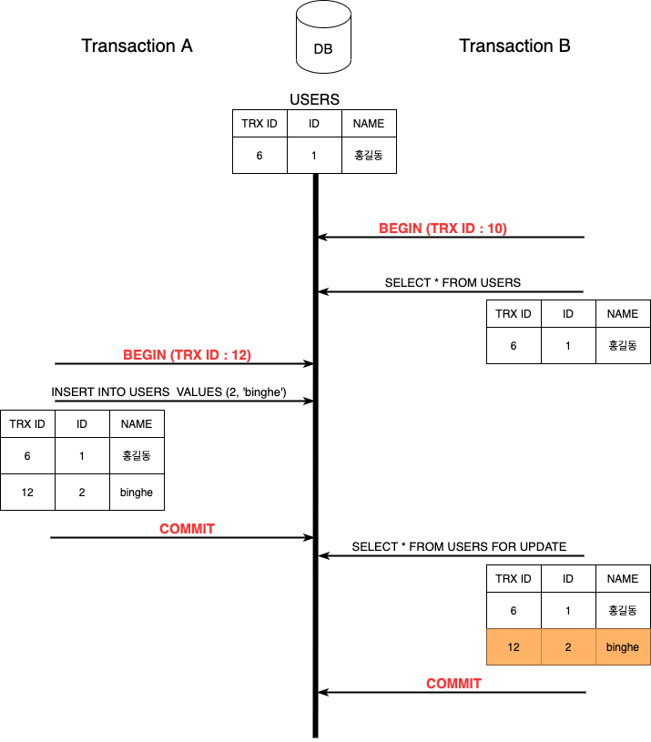
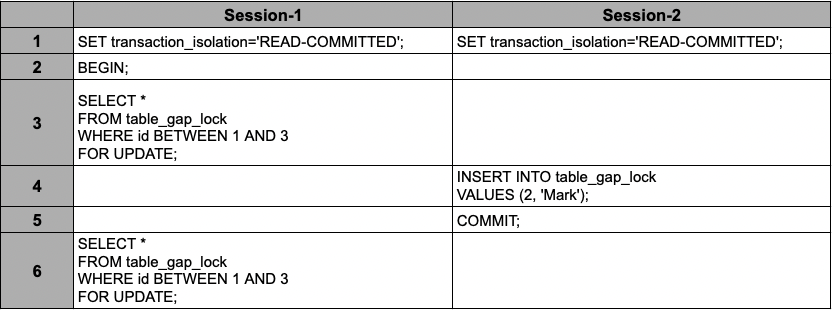
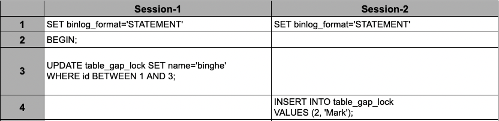

[Real MySQL 8.0](http://www.yes24.com/Product/Goods/103415627)을 바탕으로 작성한 자료입니다.

<br>

# 목차

<br>

- [목차](#목차)
- [트랜잭션과 잠금](#트랜잭션과-잠금)
- [1 트랜잭션 (Transaction)](#1-트랜잭션-transaction)
  - [1-1 트랜잭션의 중요성과 주의사항](#1-1-트랜잭션의-중요성과-주의사항)
  - [1-2 격리 수준](#1-2-격리-수준)
    - [1-2-1 READ UNCOMMITTED](#1-2-1-read-uncommitted)
    - [1-2-2 READ COMMITED](#1-2-2-read-commited)
    - [1-2-3 REPEATABLE READ](#1-2-3-repeatable-read)
    - [1-2-4 SERIALIZABLE](#1-2-4-serializable)
- [2 잠금 (Lock)](#2-잠금-lock)
  - [2-1 MySQL 엔진 레벨 잠금](#2-1-mysql-엔진-레벨-잠금)
    - [2-1-1 글로벌 락](#2-1-1-글로벌-락)
    - [2-1-2 테이블 락](#2-1-2-테이블-락)
    - [2-1-3 네임드 락](#2-1-3-네임드-락)
    - [2-1-4 메타데이터 락](#2-1-4-메타데이터-락)
  - [2-2 InnoDB 스토리지 엔진 잠금](#2-2-innodb-스토리지-엔진-잠금)
    - [2-2-1 레코드 락](#2-2-1-레코드-락)
    - [2-2-2 갭 락](#2-2-2-갭-락)
    - [2-2-3 넥스트 키 락](#2-2-3-넥스트-키-락)
    - [2-2-4 자동 증가 락](#2-2-4-자동-증가-락)
- [3 인덱스와 잠금](#3-인덱스와-잠금)
- [4 레코드 수준의 잠금 확인 및 해제 (InnoDB)](#4-레코드-수준의-잠금-확인-및-해제-innodb)
  - [4-1 레코드 수준의 잠금 확인](#4-1-레코드-수준의-잠금-확인)
  - [4-2 레코드 수준의 잠금 해제](#4-2-레코드-수준의-잠금-해제)

<br>

# 트랜잭션과 잠금
이번 장에선 MySQL의 동시성에 영향을 미치는 잠금(Lock)과 트랜잭션, 트랜잭션의 격리 수준에 대해서 정리한다.

* 트랜잭션: 작업의 완정성을 보장해주는 기능. (Commit or Rollback)
  * 작업의 일부만 적용되는 현상 (partial update)가 발생하지않도록해주는 기능.
  * 데이터의 정합성을 보장해주는 기능.
* 잠금: 동시성을 제어하기 위한 기능.
  * 여러 커넥션에서 동시에 동일한 자원(레코드나 테이블)을 요청할 경우 순서대로 한 시점에는 하나의 커넥션만 변경할 수 있도록해주는 기능.
* 격리 수준: 하나의 트랜잭션 내에서 또는 여러 트랜잭션 간의 작업 내용을 어떻게 공유하고 차단할 것인지를 결정하는 레벨.

<br>

# 1 트랜잭션 (Transaction)
트랜잭션은 DB를 구현하는데있어서 굉장히 골치아픈 기능이기도하다.

MySQL의 InnoDB는 자체적으로 트랜잭션 기능을 제공한다.

> Memory 스토리지 엔진인 MyISAM은 트랜잭션을 지원하지않는다.

<br>

## 1-1 트랜잭션의 중요성과 주의사항
MySQL에서 InnoDB는 기본적으로 트랜잭션 기능을 지원한다.

<br>

💁‍♂️ **트랜잭션의 중요성**

InnoDB와 MyISAM 스토리지를 사용하여 같은 처리를 통해 트랜잭션의 중요성을 살펴본다.

```shell
# 테이블 생성 (InnoDB)
mysql> CREATE TABLE tab_myisam (fdpk INT NOT NULL, PRIMARY KEY (fdpk)) ENGINE=MyISAM;
mysql> CREATE TABLE tab_innodb (fdpk INT NOT NULL, PRIMARY KEY (fdpk)) ENGINE=INNODB;

# 테스트 데이터 저장
mysql> INSERT INTO tab_myisam (fdpk) VALUES (3);
mysql> INSERT INTO tab_innodb (fdpk) VALUES (3);

# AUTO-COMMIT 활성화
mysql> SET autocommit=ON;

# 데이터 저장 (예외 일부러 발생)
mysql> INSERT INTO tab_myisam (fdpk) VALUES (1), (2), (3);
ERROR 1062 (23000): Duplicate entry '3' for key 'tab_myisam.PRIMARY'

mysql> INSERT INTO tab_innodb (fdpk) VALUES (1), (2), (3);
ERROR 1062 (23000): Duplicate entry '3' for key 'tab_innodb.PRIMARY'
```
위와 같이 InnoDB와 MyISAM 모두 PK 조건으로인해 에러가 발생한다.

하지만 입력된 결과를 조회해보면 아래와 같이 서로 다르다.

```shell
mysql> SELECT * FROM tab_myisam;
+------+
| fdpk |
+------+
|    1 |
|    2 |
|    3 |
+------+

mysql> SELECT * FROM tab_innodb;
+------+
| fdpk |
+------+
|    3 |
+------+
```
* MyISAM은 3을 넣기전까지의 쿼리가 실행되었고, InnoDB는 3을 포함하여 그전의 1, 2를 넣는 명령까지 모두 롤백된 것을 알 수 있다.

**이와 같이 InnoDB는 쿼리중 일부라도 오류가 발생하면 전체를 원 상태로 만든다.** (INSERT 문장 실행전 상태로 복구.)

> 만약 이렇게 트랜잭션을 지원해주지않는다면, 쿼리에 IF문을 사용하여 매번 굉장히 복잡한 쿼리를통해 원자성을 보장받아야한다..

<br>

💁‍♂️ **트랜잭션 주의사항**

트랜잭션의 범위는 가능한 짧게 유지하는 것이 좋다.

즉, **트랜잭션의 범위는 가능한 최소화하라는 의미이다.**

그 이유는 다음과 같다.

* **DB 커넥션 개수 부족.**
  * DB 커넥션 풀의 커넥션 개수는 제한적이므로, 각 단위 프로그램이 커넥션을 오래 소유하면 할수록 여유 커넥션의 개수가 줄어들게된다. 커넥션 풀의 커넥션이 고갈되면 심각한 지연이 발생하게된다.
* **트랜잭션 처리가 필요없는 비즈니스까지 트랜잭션에 포함하면 DB에 부하가 생긴다.**
  * 보통 메일 전송, FTP 파일 전송 또는 네트워크등 트랜잭션과 관련없는 비즈니스를 DB 트랜잭션과 같이 묶는 경우를 많이본다.
  * 이럴경우, 메일 서버, FTP 서버등과의 통신에서 지연이나 오류가 발생시 전혀 상관없는 DB까지 위험이 전파될 수 있다.

<br>

## 1-2 격리 수준

<br>

🤔 **격리수준이란?**

* **하나의 트랜잭션 내에서 또는 여러 트랜잭션 간의 작업 내용을 어떻게 공유하고 차단할 것인지를 결정하는 레벨.**
* 동시에 여러 트랜잭션이 처리될 때, 특정 트랜잭션이 다른 트랜잭션에서 변경하거나 조회하는 데이터를 볼 수 있도록 허용할지 말지를 결정.

<br>

🤔 **격리수준은 왜 존재하는가?**

* 트랜잭션의 성질을 모두 지키면 좋지만 **성능의 한계로 인해 격리수준을 설정함으로써 성질을 완화하기도 한다.**

* 예) 동시성 문제
  * 독립성을 지킨다면 하나의 데이터에 1000개의 커넥션이 트랜잭션을 한다면 많은 커넥션이 대기를 해야한다.
  * 즉, **격리성이 높아질 수록 성능이 악화된다.**

<br>

💁‍♂️ **트랜잭션 격리 수준은 크게 4가지로 볼 수 있다.**

<p align="center"> </p>

* 격리 수준이 높아질수록 성능이 많이 악화된다고 생각하지만, **Serializable이 아니면 크게 성능의 개선이나 저하가 없다.**
  * **일반적인 서비스에는 READ COMMITED와 REPEATABLE READ중 하나를 사용한다.**

|                 | DIRTY READ    | NON-REPEATABLE READ | PHANTOM READ                       |
| --------------- | ------------- | ------------------- | ---------------------------------- |
| READ UNCOMMITED | 발생          | 발생                | 발생                               |
| READ COMMITED   | 발생하지 않음 | 발생                | 발생                               |
| REPEATABLE READ | 발생하지 않음 | 발생하지 않음       | 발생 <br> (InnoDB는 발생하지 않음) |
| SERIALIZABLE    | 발생하지 않음 | 발생하지 않음       | 발생하지 않음                      |

<br>

### 1-2-1 READ UNCOMMITTED

커밋 전의 트랜잭션의 데이터 변경 내용을 다른 트랜잭션이 읽는 것을 허용한다.

<p align="center"> </p>

* 트랜잭션 A가 변경한 내용을 커밋하기도 전에 트랜잭션 B가 변경 사항을 조회한다.
  * **만약 트랜잭션 A에서 문제가 생겨 롤백해버린다 하더라도 여전히 트랜잭션 B는 변경된 "홍길동"으로 유저를 인식하게 된다.**
* Dirty Read가 발생한다.
* **RDBMS 표준에서도 트랜잭션의 격리수준으로 인정해주지 않을 정도로 사용하면 안된다.**

<br>

🤔 **Dirty Read?**

* 어떤 트랜잭션에서 처리한 작업이 완료되지 않았는데도 다른 트랜잭션에서 볼 수 있는 현상.
* **데이터가 나타났다가 사라졌다하는 현상을 초래한다.**
  * `READ UNCOMMITED`에서만 발생한다.

<br>

### 1-2-2 READ COMMITED

커밋이 완료된 트랜잭션의 변경사항만 다른 트랜잭션에서 조회 가능하다.

<p align="center"> </p>

* 한 트랜잭션이 다른 트랜잭션이 커밋한 값만 읽을 수 있다
  * 어떤 트랜잭션에서 데이터를 변경했더라도 COMMIT이 완료된 데이터만 다른 트랜잭션에서 읽을 수 있다.
* **오라클에서 기본적으로 사용하는 격리 수준이며, 서비스에서 가장 많이 사용된다.**
  * Dirty Read가 발생하지 않는다.
* 하지만, **NON-REPEATABLE READ 현상**이 발생한다.

<br>

🤔 **NON-REPEATABLE READ?**

<p align="center"> </p>

* **같은 트랜잭션 안에서 똑같은 SELECT 쿼리를 실행했을 때 서로 다른 값을 가져온다.**
  * 의미적으론 REPEATABLE READ가 불가능하다는 의미.
* **정합성 문제**
  * READ COMMIT에서 SELECT문은 트랜잭션 외부에서 실행되는 SELECT와 차이가 없다.
  * 하지만, REPEATABLE READ에서는 SELECT 쿼리도 트랜잭션 범위 내에서만 작동하는 것이다.
    * 즉, 트랜잭션을 시작한 상태에서는 계속해서 동일한 결과를 얻어야 한다.
* 언제 문제인가?
  * 하나의 트랜잭션에서 동일 데이터를 여러 번 읽고 변경하는 작업이라면 문제가 될 수 있다. (부정합 현상이 발생함.)
  * 만약 은행과 관련된 작업이라고한다면... 큰 문제가 될 수 있다.

<br>

### 1-2-3 REPEATABLE READ

**트랜잭션 범위 내에서 조회한 내용이 항상 동일함을 보장한다.**

<p align="center"> </p>

* REPEATABLE READ는 MySQL의 InnoDB에서 기본적으로 사용되는 격리 수준이다.
  * InnoDB는 트랜잭션이 ROLLBACK될 가능성에 대비해 변경되기 전 레코드를 **UNDO 공간에 백업해두고 실제 레코드 값을 변경한다**. (MVCC, Multi Version Concurrency Control)
  * **InnoDB는 각각의 트랜잭션에 고유한 번호(순차적으로 증가하는 값)을 부여한다.**
    * **만약 10번의 트랜잭션에서 실행되는 모든 SELECT 쿼리는 트랜잭션 번호 10보다 작은 트랜잭션 번호에서 변경한 것만 보게 된다.**
* NON-REPEATABLE 현상이 발생하지않지만, PHANTOM READ 문제가 발생할 수 있다.

<br>

💁‍♂️ **PHANTOM READ**

REPEATABLE READ에서도 부정합 문제가 발생한다.

<p align="center"> </p>

* 같은 트랜잭션 (TRX ID : 10)안에서 SELECT...FOR UPDATE 쿼리의 결과가 서로 다르다. (부정합)
* 이렇게 **다른 트랜잭션에서 수행한 변경 작업에 의해 레코드가 보였다가 안 보였다가 하는 현상을 PHANTOM READ라고 한다.**

<br>

### 1-2-4 SERIALIZABLE

* SERIALIZABLE이란
  * 동기화 : 한 트랜잭션에서 사용하는 데이터를 다른 트랜잭션에서 접근이 불가하다.
  * 동시 처리 성능이 제일 떨어지므로 사용되지 않는다.

<br>

# 2 잠금 (Lock)
MySQL에서의 잠금은 크게 두 가지로 나뉜다.

* MySQL 엔진 레벨 잠금
  * 모든 스토리지에 영향을 준다.
* 스토리지 레벨 잠금
  * 해당 스토리지에만 영향을 준다. 다른 스토리지엔 영향을 줄 수 없다.

<br>

## 2-1 MySQL 엔진 레벨 잠금

<br>

### 2-1-1 글로벌 락

<br>

💁‍♂️ **개념**

* **글로벌 락 (GLOBAL LOCK)은 MySQL 서버에 존재하는 모든 테이블을 닫고 잠근다.**
  * **한 세션에서 글로벌 락을 획득하면 다른 세션에서 SELECT를 제외한 대부분의 DDL 문장이나 DML 문장은 글로벌 락이 해제될 때까지 대기한다.**
* MySQL에서 제공하는 락의 범위중에 가장 크다.

<br>

💁‍♂️ **잠금 획득 및 해제**

* 잠금 획득
  * `FLUSH TABLES WITH READ LOCK`
* 잠금 해제
  * `UNLOCK TABLES;`

<br>

💁‍♂️ **글로벌 락은 모든 테이블의 트랜잭션이 완료되고나서 실행된다.**

* 글로벌 락 명령이 실행되기 전에 테이블이나 레코드에 잠금을 거는 SQL이 실행됐다면, 해당 SQL과 그 트랜잭션이 모두 완료될 때까지 글로벌 락 잠금 명령은 대기한다.
* 최악의 경우 장시간 실행되는 쿼리와 글로벌 락 명령이 합쳐져 테이블에 대한 쓰기 쿼리(INSERT, UPDATE, DELETE)가 오랜 시간동안 실행되지 못하고 대기할 수 있다.

<br>

💁‍♂️ **`mysqldump`을 이용해 백업할 때, 옵션에 따라 글로벌 락이 걸릴 수도 있다.**

* 여러가지 프로그램을 통해 백업시, MySQL서버에 어떤 잠금을 걸게되는지 잘 살펴보고 진행해야한다.

<br>

💁‍♂️ **MySQL 8.0부터는 InnoDB의 경우 조금 더 가벼운 글로벌 락을 지원한다.**

* `Xtrabackup`, `Enterprise Backup`등의 백업 툴들의 안정적인 실행을 위해 백업 락이 도입되었다.
  * 명령어: `LOCK INSTANCE FOR BACKUP`
* 보통 백업은 레플리카 서버를 대상으로 진행하는데, 기존 8.0이전의 글로벌 락은 백업하는도중이라면 복제조차도 대기시키게한다.
  * 반면에, 8.0 백업락은 복제가 진행중인 상태에서도 일관된 백업을 지원한다. (물론 DDL이 발생하면 백업은 멈추게된다. 주의해야함.)

<br>

### 2-1-2 테이블 락

<br>

💁‍♂️ **개념**

* 테이블 락 (TABLE LOCK)은 개별 테이블 단위로 설정되는 잠금이다.
* 테이블 락은 명시적 락과 묵기적 락으로 나뉜다.

<br>

💁‍♂️ **잠금 획득 및 해제**
* 명시적 락: `LOCK TABLES <table_name> [READ | WRITE]`명령으로 특정 테이블의 락을 획득할 수 있다.
  * 락을 반납하고싶다면 `UNLOCK TABLES`
* 묵시적 락: InnoDB의 경우 DML에서는 테이블 락이 걸리지않고, DDL에서만 걸리게된다.

<br>

### 2-1-3 네임드 락

<br>

💁‍♂️ **개념**

* 네임드 락 (Named Lock)은 `GET_LOCK()` 함수를 이용해 임의의 문자열에 대해 잠금을 설정할 수 있다.
  * 단순히 사용자가 지정한 문자열 (String)에 대해 획득하고 반납하는 잠금이다.
  * 자주 사용되지 않은다.
* 사용 예제
  * DB 1대에 5대의 웹 서버가 접속해서 서비스하는 상황에서 5대의 웹 서버가 어떤 정보를 동기화해야하는 경우 사용될 수 있다.

<br>

💁‍♂️ **네임드 락은 레코드를 변경하는 트랜잭션에 유용할 수 있다.**

배치처럼 한꺼번에 많은 레코드를 변경하는 쿼리는 자주 데드락의 원인이 된다.

이때 동일 데이터를 변경하거나 참조하는 프로그램끼리 분류해서 네임드 락을 걸고 쿼리를 실행하면 아주 간단히 해결된다.

> 구글링을해보니 낙관적인 락 구현할때도 사용되는 것 같기도하다? 관련해서는 실제 사용할 때 한번 더 찾아볼 예정.

<br>

💁‍♂️ **잠금 획득 및 해제**

```shell
# "mylock"이라는 문자열에 대한 잠금 획득
# 이미 잠금을 사용중이라면 2초동안만 대기한다. (2초 이후 자동 잠금 해제됨)
mysql> SELECT GET_LOCK('mylock', 2)

# "mylock"이라는 문자열에 대해 잠금이 설정돼 있는지 확인.
mysql> SELECT IS_FREE_LOCK('mylock');

# "mylock"이라는 문자열에 대해 획득했던 잠금을 반납한다.
mysql> SELECT RELEASE_LOCK('mylock');
```
3개 함수가 정상적으로 처리되었다면 모두 1을 반환한다. 비정상이라면 NULL이나 0을 반환한다.

<br>

💁‍♂️ MySQL 8.0 부터는 네임드 락을 중첩해서 사용할 수 있게해준다.

```shell
mysql> SELECT GET_LOCK('mylock_1', 10);
mysql> SELECT GET_LOCK('mylock_2', 10);

# 두 락 한번에 채제
mysql> SELECT RELEASE_ALL_LOCKS();
```

<br>

### 2-1-4 메타데이터 락

<br>

💁‍♂️ 개념

* 메타데이터 락 (Metadata Lock)은 DB 객체 (테이블이나 뷰)의 이름이나 구조를 변경하는 경우에 획득하는 잠그이다.
* 메타데이터 락은 명시적으로 획득하거나 해제할 수 있는 것이 아니고, `RENAME TABLE A TO B`같이 테이블의 이름을 변경할때 자동으로 획득하는 잠금이다.

<br>

## 2-2 InnoDB 스토리지 엔진 잠금

<br>

💁‍♂️ **InnoDB는 기본적으로 레코드기반의 잠금을 제공한다.**

InnoDB 스토리지 엔진은 MySQL에서 제공하는 잠금과는 별개로 스토리지 엔진 내부에서 레코드 기반의 잠금 방식을 제공한다.

<br>

### 2-2-1 레코드 락

<br>

💁‍♂️ **개념**

* 레코드 자체만을 잠그는 것을 레코드 락 (Record Lock)이라고 하며, 다른 상용 DBMS의 레코드 락과 동일한 역할을 수행한다.

<br>

💁‍♂️ **InnoDB의 레코드 락은 레코드 자체가 아닌 인덱스의 레코드를 잠근다.**

**인덱스가 하나도 없는 테이블이더라도 내부적으로 자동 생성된 클러스터 인덱스를 이용해 잠금을 설정한다.**

<br>

🤔 **인덱스를 잠근다고 달라지는게있을까?**

있다.

바로 변경해야 할 레코드를 찾기 위해 검색한 인덱스의 레코드를 모두 락을 걸어야한다.

[아래 더 자세히 다룬 예시](#3-인덱스와-잠금)를 통해 살펴보길 추천한다.

<br>

### 2-2-2 갭 락

<br>

💁‍♂️ **개념**

* **갭 락 (Gap Lock)은 레코드 자체가 아니라 레코드와 바로 인접한 레코드 사이의 간격만을 잠그는 것을 의미한다.**
* **갭 락의 역할은 레코드와 레코드 사이의 간격에 새로운 레코드가 생성(INSERT)되는 것을 제어하는 것.**
* **갭 락은 Primary Key뿐만 아니라 Secondary Index에도 동일하게 사용된다.**

<br>

💁‍♂️ **갭 락이 필요한 이유? - 중요**

* Repeatable Read 격리 수준 보장
  * 갭 락이 없다면 아래와 같이 NON-REPEATABLE READ가 발생할 수 있다.
  <p align="center"> </p>
  
  * 실제로 위와 같이 실행시 3, 6번의 SELECT 결과가 다르다. 그 이유는 `READ-COMMITTED`의 경우 3번 실행할 때 베타적 잠금을 걸지 않는다. 즉, 갭 락을 걸지않는다.
  * 하지만 **`Repeatable Read`는 트랜잭션 범위 내에서 조회한 내용이 항상 동일함을 보장해야한다. 그러므로 3번 실행할 때 베타적 잠금을 걸고 `id` 인덱스에 갭 락을 걸게된다.** 그러므로 4번의 INSERT문은 Session-1의 트랜잭션이 종료될때까지 대기하다 실행된다.
* Replication 일관성 보장 (Binary Log Format = Statement 또는 Mixed)
  * MySQL의 Replication은 데이터를 복제하는 것이 아닌, 바이너리 로그를 기록하여 가져가는 형태이다.
  <p align="center"> </p>

  * 실제로 위와 같이 실행시 갭 락이 제대로 동작하여 4번의 INSERT문은 바로 실행되지않고 3번 UPDATE의 트랜잭션이 완료되고나서 실행된다.
    * 이는 3번의 UPDATE문이 베타적인 락을 걸면서 갭 락도 같이 걸기때문이다.
  * 만약 3번 UPDATE문 실행시 갭 락이 걸지않고, 세션 1번보다 2번이 먼저 완료된다면. Source DB와 Replica DB에서의 트랜잭션 실행 순서가 거꾸로 되어 데이터가 서로 달라지는 결과를 만들게된다.
  * 그러므로 바이너리 로그 포맷이 STATEMENT일 때, 갭 락이 필요한 이유는 Source DB와 Replica DB의 데이터 부정합을 방지하기 위함이다.
* Foreign Key 일관성 보장

> 참고: https://medium.com/daangn/mysql-gap-lock-%EB%8B%A4%EC%8B%9C%EB%B3%B4%EA%B8%B0-7f47ea3f68bc

<br>

### 2-2-3 넥스트 키 락

💁‍♂️ **개념**

* **레코드 락과 갭 락을 합쳐 놓은 형태의 잠금을 넥스트 키 락이라고 한다.**
  * Next Key Lock = Record Lock + Gap Lock
* **InnoDB의 갭 락이나 넥스트 키 락은 바이너리 로그에 기록되는 쿼리가 레플리카 서버에서 실행될 때 Source 서버에서 만들어 낸 결과와 동일한 결과를 만들어내도록 보장하는 것이 목적이다.**

<br>

💁‍♂️ **문제는 넥스트 키 락과 갭 락으로인해 데드락이 자주 발생하거나 다른 트랜잭션을 기다리게하는 경우가 많다.**

* 바이너리 로그를 STATEMENT가 아닌 ROW 포맷으로 변경하면 문제는 해결되긴한다.
  * 하지만.. ROW 포맷의 안정성은 고민을 조금 해봐야한다. MySQL 8.0부터는 ROW 포맷의 안정성이 높아져 기본 설정으로 변경되었다고한다.
* 트랜잭션 격리 수준을 `READ-COMMITTED`로 변경하는 것도 하나의 방법이다.

<br>

### 2-2-4 자동 증가 락

💁‍♂️ **개념**

* `AUTO_INCREMENT` 컬럼 속성을통해 저장되는 각 레코드가 중복되지 않고 순서대로 증가하는 일련번호 값을 갖도록할 때 사용되는 잠금.
* **InnoDB는 내부적으로 AUTO_INCREMENT 락이라는 테이블 수준의 잠금을 사용한다.**

<br>

💁‍♂️ **AUTO_INCREMENT 락 특징**

* AUTO_INCREMENT는 INSERT와 REPLACE같이 새로운 레코드를 저장하는 쿼리에서만 잠금이 걸린다. UPDATE나 DELETE 등의 쿼리에서는 전혀 걸리지 않는다.
* AUTO_INCREMENT는 트랜잭션과 관계없이 값을 가져오는 순간만 락이 걸렸다가 즉시 해제된다.
  * 반면에, 레코드 락이나 넥스트 락 같은경우는 트랜잭션내내 잠금을 갖고있는다.
* AUTO_INCREMENT 락은 테이블에 단 하나만 존재하며, 두 개의 INSERT시 순차적으로 실행된다.
* AUTO_INCREMENT 락의 동작 방식은 변경가능하다.
  * MySQL 5.1 이상부터 `innodb_autoinc_lock_mode`라는 시스템 변수를 통해 작동 방식을 변경할 수 있다.

<br>

💁‍♂️ **AUTO_INCREMENT 락은 대부분의 경우 문제가 되지 않는다.**

* AUTO_INCREMENT 락은 굉장히 짧은 시간동안 걸렸다가 해제되는 잠금이라 대부분의 경우 문제가 되지 않는다고한다.

<br>

# 3 인덱스와 잠금

InnoDB의 잠금은 레코드를 잠그는 것이 아니라 인덱스를 잠그는 방식으로 동작한다.

<br>

💁‍♂️ **인덱스에 잠금을 거는 방식이라 변경해야 할 레코드를 찾기 위해 검색한 인덱스의 레코드를 모두 락을 걸어야한다.**

```shell
# firstname은 인덱스가 걸려있다. (KEY ix_firstname(first_name))
# employees 테이블엔 firstname='binghe`인 사원이 253명이 있으며,
# firstname='binghe`이면서 `last_name`='`kim`인 사원이 1명만 존재한다고 가정해본다.
mysql> SELECT COUNT(*) FROM employees WHERE first_name='binghe';
+------+
|  253 |
+------+

mysql> SELECT COUNT(*) FROM employees WHERE first_name='binghe' AND last_name='kim';
+------+
|    1 |
+------+

# employees 테이블에서 first_name='binghe'이면서 last_name='kim'인 사원의 입사 일자를 변경해본다.
mysql> UPDATE employees SET hire_date=NOW() WHERE first_name='binghe' AND last_name='kim';
```
* **UPDATE문은 몇 개의 레코드에 락을 걸게될까?**
  * 정답은 253건에 모두 잠금을 걸게된다.
  * 그 이유는 인덱스를 사용할 수 있는 WHERE 조건이 `first_name='binghe'`이며, `last_name`에 대한 인덱스는 없기때문에 레코드 253건을 모두 잠그게된다.
* **만약 인덱스가 하나도 없다면?**
  * **당연히 테이블 풀 스캔하면서 UPDATE하는데, 이 과정에서 테이블에 있는 모든 레코드를 잠그게된다.**

> **다시 한번 강조하지만 InnoDB는 레코드 락을 인덱스를 기준으로 잠근다.** 그러므로, InnoDB에선 인덱스 설정이 굉장히 중요하다.

<br>

# 4 레코드 수준의 잠금 확인 및 해제 (InnoDB)
잠금으로인해 쿼리의 성능 저하와 데드락이 자주 발생하게된다. 

그러므로 잠금의 원인을 찾아 해제하는 방법은 꼭 알아두는 것이 좋다.

<br>

## 4-1 레코드 수준의 잠금 확인
각 트랜잭션이 어떤 잠금을 기다리고 있는지, 기다리고있는 잠금을 어떤 트랜잭션이 가지고있는지 조회**

<br>

💁‍♂️ **MySQL 8.0 이전 - `information_schema`**
* `innodb_trx`: Provides information about every transaction currently executing inside InnoDB, including the transaction state (for example, whether it is running or waiting for a lock), when the transaction started, and the particular SQL statement the transaction is executing.
  * 오랫 시간 동안 Commit되지 않은 트랜잭션에 대해 어떤 스레드에 의해 기동되었는지 확인. (현재 실행중인 트랜잭션 조회)
* `innodb_locks`: The INNODB_LOCKS table provides information about each lock that an InnoDB transaction has requested but not yet acquired, and each lock that a transaction holds that is blocking another transaction.
  * 락을 얻지 못했으며, 다른 트랜잭션으로 블록이 발생한 경우에 사용되며, 어느 잠금이 어느 테이블, 어느 인덱스, 어느 데이터에 걸려있는지 확인.
* `innodb_lock_waits`: This table indicates which transactions are waiting for a given lock, or for which lock a given transaction is waiting.
  * 아직 락을 얻지못하고 기다리고있는 트랜잭션 확인.

> [참고](https://dev.mysql.com/doc/refman/5.7/en/innodb-information-schema-transactions.html)

<br>

💁‍♂️ **MySQL 8.0 이후 - `performance_schema`**
* `information_schema.innodb_trx`
  * MySQL 8.0에도 현재 실행중인 트랜잭션 조회할 때 이 테이블을 조회한다.
* `data_locks`
  * 기존의 `information_schema.innodb_locks`와 같은 역할의 테이블.
* `data_lock_waits`
  * 기존의 `information_schema.innodb_lock_waits`와 같은 역할의 테이블.

> 자주 사용되는 명령: `SELECT * FROM performance_schema.data_locks\G` 

<br>

💁‍♂️ **번외) 스레드 조회 - processlist**

```shell
# 서버 내에서 실행중인 스레드 집합에서 현재 수행중인 작업 조회.
mysql> SHOW PROCESSLIST;

# INFO 전체 조회.
mysql> SHOW FULL PROCESSLIST;
```
각 스레드별 수행 중인 작업을 조회할 수 있다.

* Command (상태)별 설명
  * `Sleep`: 스레드가 클라이언트의 새 쿼리를 기다리는 중.
  * `Query`: 스레드가 쿼리를 실행 중이거나 결과를 클라이언트로 다시 보낸다.
  * `Locked`: 스레드는 서버 수준에서 테이블 잠금이 부여되기를 기다리는 상태
    * InnoDB의 레코드 잠금과 같이 스토리지 잠금은 `Locked` 상태가 아니다.
  * `Analyzing and statistic`: 스레드가 스토리지 엔진 통계를 확인하고 쿼리를 최적화하는중인 상태.
  * `Copying to tmp table [on disk]`: 스레드가 쿼리를 처리하고 결과를 임시 테이블에 복사하는 중인 상태
  * `Sorting result`: 스레드가 결과 셋을 정렬중.

<br>

## 4-2 레코드 수준의 잠금 해제
스레드를 종료하는 방법은 간단하다.

```shell
mysql> KILL {스레드 id}
```


