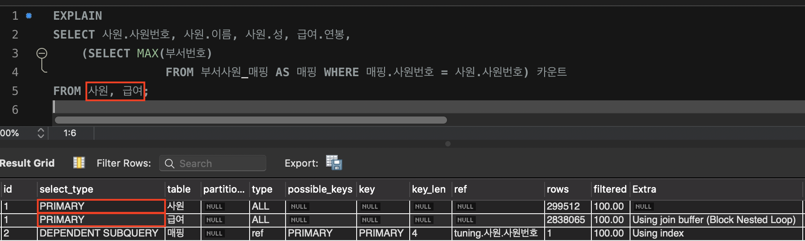
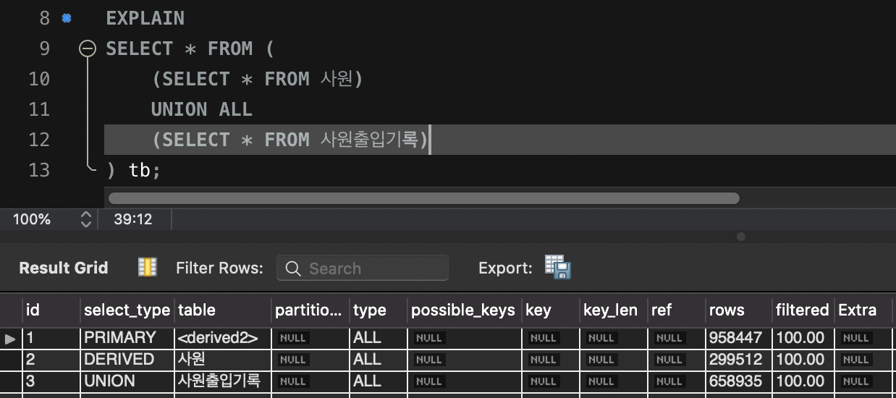
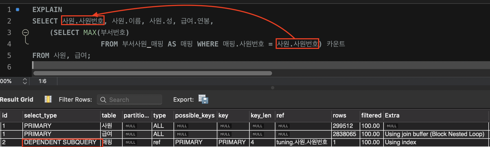
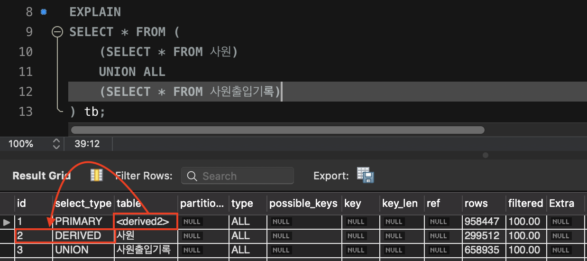

# 목차

<br>

# 들어가며
> 본 내용은 이성욱님의 [Real MySQL](http://www.yes24.com/Product/Goods/6960931?OzSrank=1)의 내용을 정리한 자료입니다.
> 
> 세부적인 내용은 책을 직접 구매하셔서 읽어보시기 바랍니다.

<br>

같은 장소를 가더라도 다양한 방법과 경로가 존재한다.

보통 다양한 경로의 교통 상황, 날씨등을 고려해서 경로를 설정할 것이다.

DB도 동일하다.

쿼리 실행 또한 같은 결과를 만들어내도 한 가지 방법만이 있는 것이 아니다.

DB도 쿼리를 최적으로 실행하기 위해 각 테이블의 데이터 정보를 바탕으로, 최적의 실행 계획을 수립한다.

DB에선 이러한 역할을 담당하는 친구가 바로 옵티마이저이다.

이번 장에선 `EXPLAIN` 명령을 통해 쿼리의 실행 계획을 확인하고, 각각 무엇을 의미하고, 좋고 나쁜지를 다룬다.

<br>

# 개요
옵티마이저가 만들어내는 실행 계획을 이해해야 실행 계획의 불합리한 부분을 찾아내고, 더욱 최적화된 방법으로 실행 계획을 수립할 수 있다.

이번 챕터에선 실행 계획을 알기위한 사전 지식에 대해서 다룬다.

<br>

**쿼리 실행 절차 - 종류**

MySQL의 쿼리 실행 과정은 크게 3가지로 나눌 수 있다.
* 사용자로부터 요청된 SQL 문장을 잘게 쪼개서 MySQL 서버가 이해할 수 있는 수준으로 분리.
  * 문법적 오류는 여기서 걸러짐.
  * MySQL에선 SQL 문장 자체가 아니라 SQL 파스 트리를 이용해 쿼리를 실행함.
* SQL의 파싱 정보(파스 트리)를 확인하면서 어떤 테이블로부터 어떤 인덱스를 이용해 테이블을 읽을지 선택. (**최적 실행 계획 수립, 옵티마이저**)
  * 불필요한 조건의 제거 및 복잡한 연산의 단순화
  * 여러 테이블의 조인이 있는 경우 어떤 순서로 테이블을 읽을지 결정
  * 각 테이블에 사용된 조건과 인덱스 통계 정보를 이용해 사용할 인덱스 결정
  * 가져온 레코드들을 임시 테이블에 넣고 다시 한번 가공해야 하는지 결정
  * ...
* 두 번째 단계에서 결정된 테이블의 읽기 순서나 선택된 인덱스를 이용해 스토리지 엔진으로부터 데이터를 가져옴.

<br>

**옵티마이저의 종류**

옵티마이저는 DB 서버에서 두뇌와 같은 역할을 한다.

옵티마이저의 종류는 크게 두 가지이다.

* 비용 기반 최적화
  * 쿼리를 처리하기 위한 여러 가지 가능한 방법을 만들고, 각 단위 작업의 비용 정보와 대상 테이블의 예측된 통계 정보를 이용해 각 실행 계획별 비용을 산출하고, 최소 비용의 처리 방식을 선택해 실행한다.
* 규칙 기반 최적화
  * 옵티마이저에 내장된 우선순위에 따라 실행 계획을 세우는 방식. 이때 대상 테이블의 레코드 건수나 선택도 등을 고려하지 않는다.

<br>

**통계 정보**

* 비용 기반 최적화에서 가장 중요한 것은 테이블 별 통계 정보이다.
  * 예를 들어 1억건이 든 테이블을 10만건으로 인식하면, 풀 스캔을 하기 때문에, 1초 걸릴걸 1시간 걸릴 수도 있기 때문이다.
* **MySQL에서 지원하는 통계 정보는 `레코드 건수`와 `인덱스의 유니크한 값 개수` 정도이다.**
* **MySQL은 통계 정보 갱신을 동적으로 한다. 그러므로 통계 정보를 강제로 갱신하려면 `ANALZE`를 사용한다.**

<br>

**통계 정보 관련 명령어**
* 확인
  * `SHOW TABLE STATUS LIKE {테이블 명}`
  * `SHOW INDEX FROM {테이블 명}`
* 갱신
  * `ANALYZE TABLE {테이블 명}`
  * `ANALYZE TABLE {테이블 명} ANALYZE PARTITION {파티션}`
    * 파티션을 사용하는 테이블에서 특정 파티션의 통계 정보 수집.
* 주의할 점
  * `ANALYZE`를 실행하는 동안 InnoDB는 읽기 쓰기 모두 불가능하므로, 서비스 도중에는 사용하지 않는 것이 좋다.
  * InnoDB는 인덱스 페이지 중 8개 정도만 랜덤하게 선택해서 분석하고 그 결과를 통계 정보로 갱신한다.
    * `innodb_stats_sample_pages`를 통해 분석하는 개수를 늘릴 수 있지만, MySQL은 동적으로 계속 갱신하므로 크게 2~3배 이상 벗어나지 않는 것이 좋다.

<br>

# 실행 계획 분석
쿼리의 실행 계획은 `EXPLAIN`을 통해 쉽게 조회할 수 있다.

```sql
EXPLAIN
{쿼리문}
```

* **`EXPLAIN` 쿼리의 결과는 표 형태로 1줄 이상 나오게 된다. 표의 각 라인은 쿼리 문장에서 사용된 테이블의 개수(서브 쿼리 포함)만큼 출력된다.**
* **실행 순서는 위에서 아래로 순서대로 표시된다.**
  * **위쪽 결과가 쿼리의 Outer 부분이거나 먼저 접근한 테이블이며, 아래쪽으로 갈수록 쿼리의 Inner 부분 또는 나중에 접근한 테이블이다.**

<br>

> MySQL은 UPDATE, INSERT, DELETE에 대한 실행 계획은 확인할 방법이 없다.
> 
> 이땐 WHERE 조건절만 같은 SELECT 문장을 만들어서 대략적으로 확인할 수 있다.

<br>

## id
> **SQL 문이 수행되는 순서를 의미**한다.

* 단위 SELECT 쿼리별로 부여되는 식별자 값.
  * **서브 쿼리**의 경우는 **서로 다른 id 값**로 나온다.
  * **join**같은 경우는 **같은 id 값으로** 나온다.

<br>

## select_type
* 각 단위 SELECT 쿼리가 어떤 타입의 쿼리인지 표시되는 칼럼.

<br>

**SIMPLE**
```sql
EXPLAIN
SELECT * FROM 사원;
```
* 단순한 SELECT 문 (서브 쿼리나 UNION을 사용하지 않는 단순한 쿼리)

<br>

**PRIMARY**
<p align="center"> </p>

* 서브 쿼리를 감싸는 외부(OUTER) 쿼리, UNION이 포함될 경우 첫번째 SELECT문

<br>

**UNION**
<p align="center"> </p>

* UNION으로 결합하는 단위 SELECT 쿼리 가운데 첫 번째를 제외한 두 번째 이후 단위 SELECT.
* 위 예시에서 보이듯, 첫 번째 쿼리는 `DERIVED`, 두번째부터는 `UNION`으로 잡힌다.
  * 그 이유는 두 개의 서브 쿼리로 조회된 결과를 UNION ALL로 결합해 임시 테이블을 만들어서 사용하기 때문.

<br>

**DEPENDENT UNION**

```sql
EXPLAIN
SELECT
    e.first_name,
    ( SELECT CONCAT('Salary change count: ', COUNT(*)) AS message
            FROM salaries s WHERE s.emp_no=e.emp_no
      UNION
      SELECT CONCAT('Department change count: ', COUNT(*)) AS message
            FROM dept_emp de WHERE de.emp_no=e.emp_no
    ) AS message
FROM employees e
WHERE e.emp_no=10001;
```
* 외부에서 정의된 칼럼을 UNION으로 결합된 쿼리에서 사용하는 경우
* 즉, **UNION에서 사용되는 내부 쿼리(서브 쿼리)가 외부의 값을 참조해서 처리될 때 DEPENDENT란 용어를 사용한다.**
* 위 쿼리문에서 UNION에 사용에서 사용되는 `e.emp_no`가 외부의 값 (`employees`)을 참조해서 사용한다.

<br>

**SUBQUERY**

* **독립적으로 수행되는 서브쿼리 (FROM 절이외에서 사용되는 서브 쿼리 => SELECT, WHERE절)**
* 서브 쿼리는 캐싱된다.
  * SUBQUERY의 경우 처음 한 번만 실행해서 그 결과를 캐시하고 필요할 때 캐시된 결과를 사용한다.
  * DEPENDENT SUBQUERY는 의존하는 바깥쪽 쿼리의 칼럼의 값 단위로 캐시해두고 사용한다.
* **여러 가지 서브 쿼리**
  * 중첩된 쿼리 (Nested Query): SELECT 되는 칼럼에 사용된 서브 쿼리.
  * 서브 쿼리 (Sub Query): WHERE 절에 사용된 경우.
  * 파생 테이블 (Derived): FROM 절에 사용된 서브 쿼리. 인라인 뷰 또는 서브 셀렉트라고 부르기도한다.

<br>

**DEPENDENT SUBQUERY**

<p align="center"> </p>

* **서브 쿼리가 바깥쪽 SELECT 쿼리에 정의된 칼럼을 사용하는 경우.**
* **의존적이라는 의미에서 DEPENDENT를 사용한다.**
  * 안쪽(inner) 서크 쿼리가 바깥쪽(outer) SELECT  쿼리의 칼럼에 의존적.

> **DEPENDENT UNION과 DEPENDENT SUBQUERY 모두 외부 쿼리가 먼저 수행된 후 내부 쿼리가 실행돼야 한다.**
> 
> 그러므로, **일반 서브 쿼리보다 처리 속도가 느릴 때가 많다.**

<br>

**DERIVED**

> 파생된 (테이블)
* 서브쿼리가 FROM 절에 사용된 경우.
* **DERIVED는 단위 SELECT 쿼리의 실행 결과를 메모리나 디스크에 임시 테이블로 생성한다는 의미**
* **파생 테이블은 인덱스가 전혀 없으므로, 조인보다 성능상 불리하다.**

<br>

## table
* **MySQL의 실행 계획의 단위는 SELECT 쿼리 기준이 아니라 테이블 단위이다.**
* table엔 해당 테이블의 이름 혹은 별칭이 나온다.
* `SELECT NOW()`와 같이 테이블을 사용하지 않았으면 `NULL`이 나온다.
* `<xxx>`처럼 둘러싸인 이름은 임시 테이블을 의미한다.

<p align="center"> </p>
* 첫 번째 라인 테이블은 `<derived2>`를 통해 이 라인보다 쿼리의 id가 2번인 라인이 먼저 실행되고 그 결과로 파생 테이블로 준비돼야 한다는 것을 의미한다.
* 두 번째 라인은 table 컬럼에 표시된 `사원` 테이블을 읽어서 파생 테이블을 생성한다는 의미.
* 세 번째 라인은 `사원`에 UNION되는 것을 의미.

<br>

## type

각 테이블에 접근 방식을 의미한다.

**방식이란 인덱스를 사용해서 레코드를 읽었는지, 풀 테이블 스캔으로 레코드를 읽었는지 등을 의미한다.**

> 실행 계획에서 `type` 이후의 칼럼은 각 테이블의 레코드를 어떤 방식으로 읽었는지를 의미한다.

* system: 테이블에 데이터가 없거나 한 개만 있을 경우.
* const: PK나 Unique 키 칼럼을 이용하는 WHERE 조건절을 가지고 있으며, 반드시 1건만 반환되는 쿼리.
  * 조회되는 데이터가 단 1건일 때
* eq_ref: 여러 테이블 조인 시, 조인에서 처음 읽은 테이블의 칼럼 값을 그 다음 읽을 테이블의 PK나 Unique 키 칼럼의 검색 조건에 사용하는 경우.
  * 조인이 수행될 때 드리븐 테이블의 데이터에 PK 혹은 고유 인덱스로 단 1건의 데이터를 조회할 때
* ref: eq_ref와 동일한데, 데이터가 2건 이상일 경우. 즉, 동등 조건(Equal)으로 검색하는 경우이다
  * 위 세 가지 방법은 성능이 좋으므로 모두 쿼리 튜닝 시 크게 신경쓰지 않아도 된다.
* fulltext: MySQL의 전문 검색 인덱스를 사용해 레코드를 읽는 방법
* index: 인덱스 풀 스캔
  * 인덱스를 처음부터 끝까지 읽는 스캔 방법이며, 인덱스를 효율적으로 사용하는 방식은 아니다.
* range: 인덱스 레인지 스캔
* all: 테이플 풀 스캔
  * 가장 비효율적인 방식.
  * InnoDB는 대량의 Disk I/O를 방지하기 위해 `리드 어헤드`라는 기능으로 한꺼번에 많은 페이지를 읽어 들인다. 잘못 튜닝된 쿼리보다 이 방법이 더 나을 수도 있다.

<br>

## possible_keys
* 이용 가능성있는 인덱스의 후보 목록을 의미한다.
  * 사용될 법 했던 인덱스의 목록
* 말 그대로 후보였을 뿐, 사용한 인덱스는 아니다. 주의하자. 아님 그냥 무시하라.

<br>

## key
* `possible_keys`중 실제로 옵티마이저가 최종 선택된 실행 계획에서 사용한 인덱스를 의미한다.
* 인덱스를 전혀 사용하지 못하면 NULL로 표기된다.

<br>

## key_len
* 쿼리를 처리하기 위해 다중 컬럼 인덱스에서 몇 개의 컬럼까지 사용했는지 바이트 단위로 알려주는 값.
* 즉, **선택된 인덱스의 길이를 의미한다.**
  * 인덱스가 너무 긴 것은 비효율적이다.

<br>

## rows
* **현재 채택한 접근 방식을 사용해 몇 행을 가져왔는지를 표시한다.**
  * 여러 처리 방식의 비용을 비교하여 최종 실행 계획을 수립할 때, 이 지표를 이용한다.
* rows의 값은 실행 계획의 효율성 판단을 위해 **예측했던 레코드 건수를 보여주며, 실제 행 수와 반드시 일치하진 않는다**.
  * 또한, 이는 얼마나 많은 레코드를 **디스크로부터 읽어와야하는지 체크**한다.

<br>

## Extra
Extra는 옵티아미저가 동작하는데 개발자에게 주는 힌트이다.

이 필드는 `EXPLAIN`을 사용해 옵티마이저의 행동을 파악할 때 아주 중요하다.

* Distinct: 두 테이블 조인시 중복된 값을 제거했음을 알림.
* Using where: Where 절로 필터링시 알림.
  * MySQL엔진이 스토리지 엔진에서 받은 데이터에 별도의 가공을 한 경우 표시.


