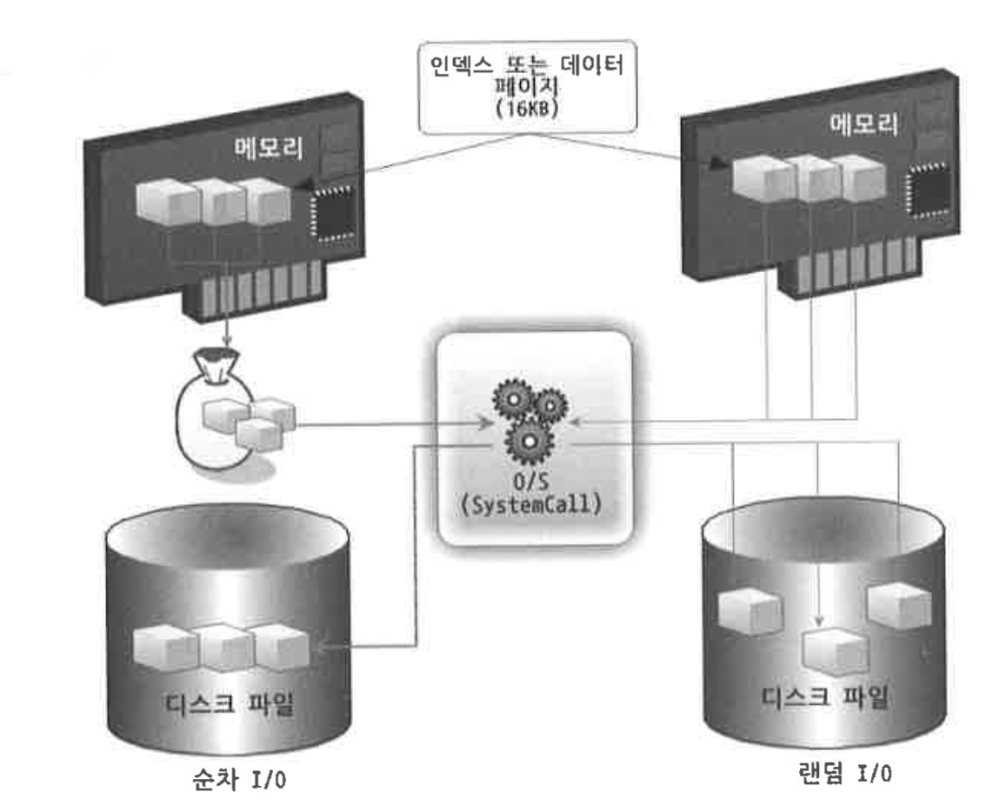
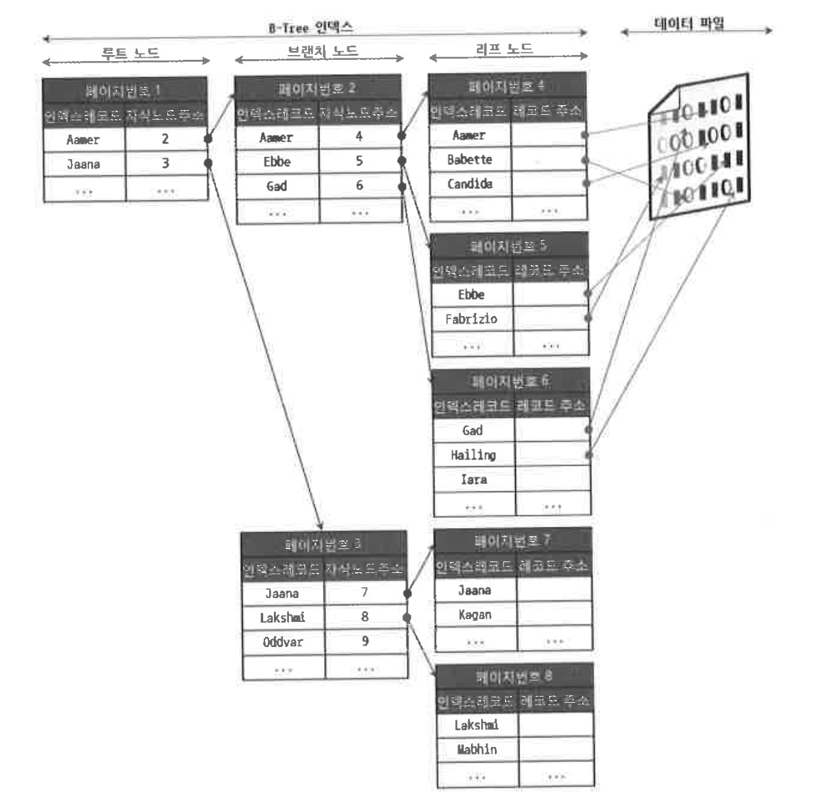
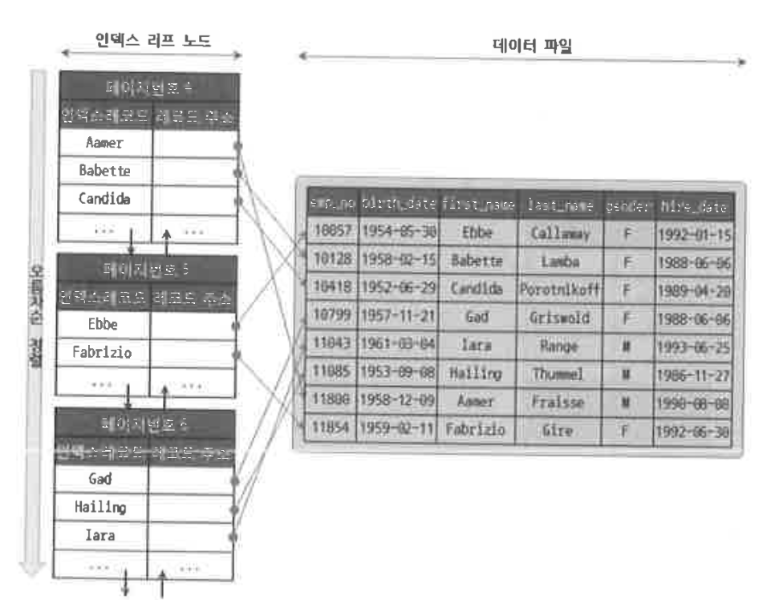
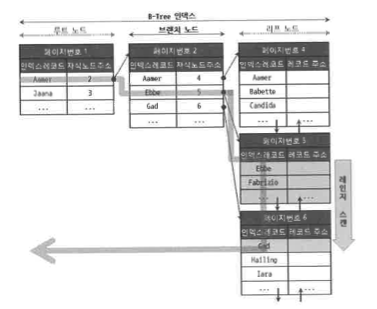
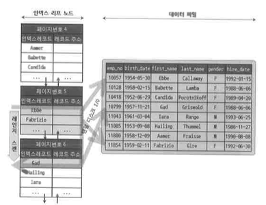
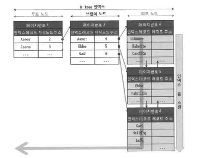
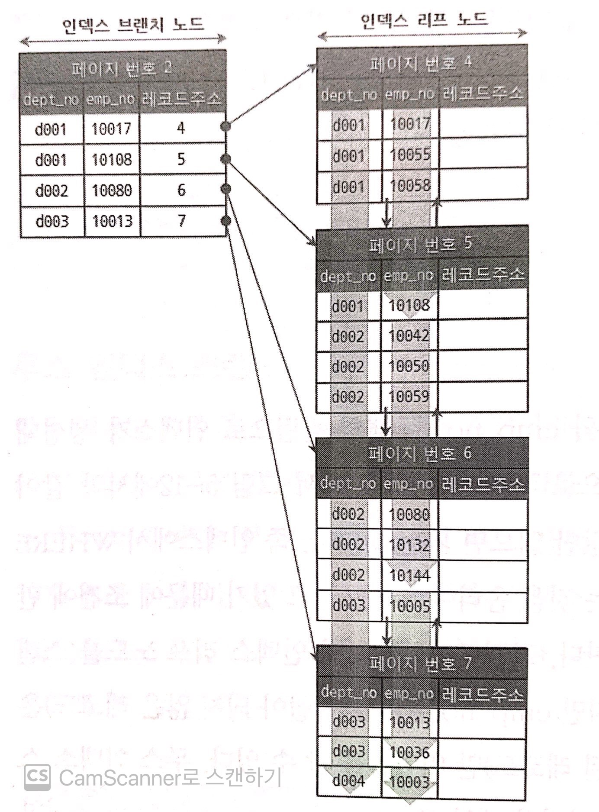
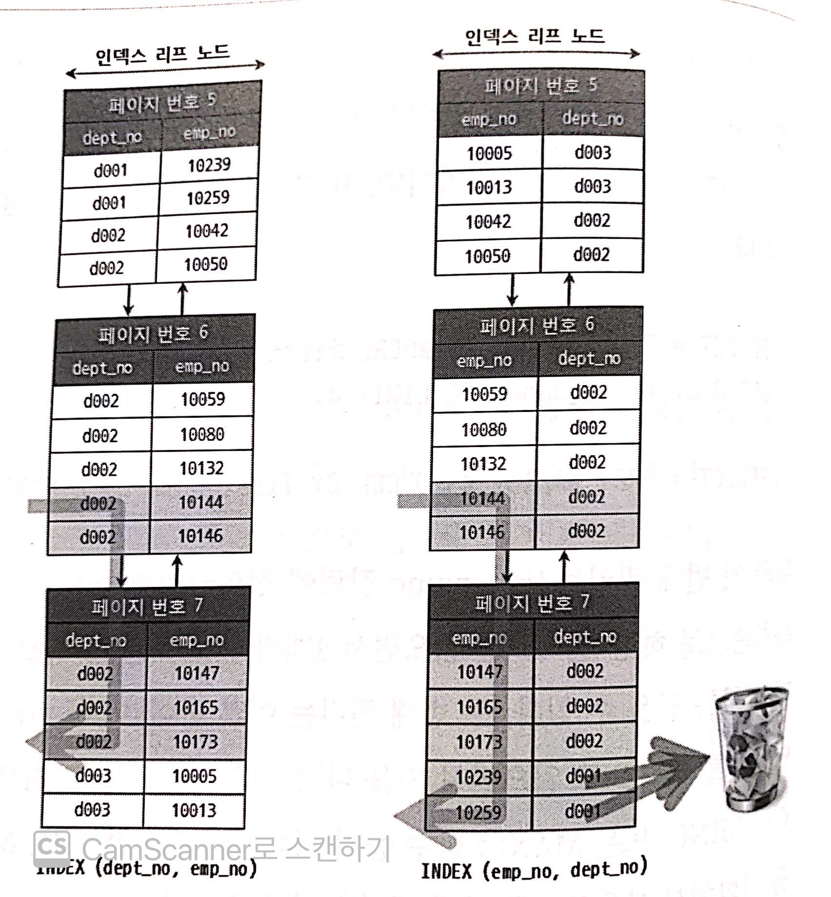
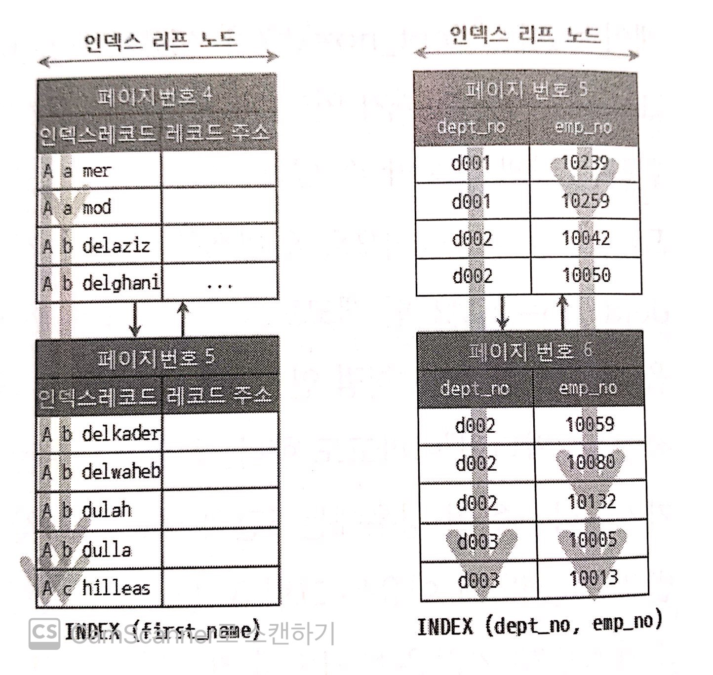

# 목차

<br>

- [목차](#목차)
- [들어가며](#들어가며)
- [디스크 읽기 방식](#디스크-읽기-방식)
  - [저장 매체](#저장-매체)
  - [랜덤 I/O와 순차 I/O](#랜덤-io와-순차-io)
- [Table Full Scan vs Index Range Scan](#table-full-scan-vs-index-range-scan)
  - [Table Full Scan](#table-full-scan)
  - [Index Range Scan](#index-range-scan)
- [인덱스란](#인덱스란)
- [B-Tree 인덱스](#b-tree-인덱스)
  - [구조 및 특성](#구조-및-특성)
  - [인덱스 키 추가 및 삭제](#인덱스-키-추가-및-삭제)
  - [B-Tree 인덱스 사용에 영향을 미치는 요소 - 중요](#b-tree-인덱스-사용에-영향을-미치는-요소---중요)
    - [인덱스 키값의 크기 - 중요](#인덱스-키값의-크기---중요)
    - [B-Tree 깊이](#b-tree-깊이)
    - [선택도와 기수성](#선택도와-기수성)
    - [선택도와 기수성 예시 - 중요](#선택도와-기수성-예시---중요)
    - [읽어야 하는 레코드의 개수](#읽어야-하는-레코드의-개수)
  - [B-Tree 인덱스를 통한 데이터 읽기](#b-tree-인덱스를-통한-데이터-읽기)
    - [인덱스 레인지 스캔](#인덱스-레인지-스캔)
    - [인덱스 풀 스캔](#인덱스-풀-스캔)
    - [루스 인덱스 스캔](#루스-인덱스-스캔)
  - [다중 컬럼 인덱스](#다중-컬럼-인덱스)
  - [B-Tree 인덱스의 정렬 및 스캔 방향](#b-tree-인덱스의-정렬-및-스캔-방향)
    - [인덱스의 정렬](#인덱스의-정렬)
    - [인덱스 스캔 방향](#인덱스-스캔-방향)
  - [B-Tree 인덱스의 가용성과 효율성](#b-tree-인덱스의-가용성과-효율성)
    - [비교 조건의 종류와 효율성](#비교-조건의-종류와-효율성)
    - [인덱스의 가용성](#인덱스의-가용성)
    - [가용성과 효율성 판단](#가용성과-효율성-판단)

<br>

# 들어가며
> 본 내용은 이성욱님의 [Real MySQL](http://www.yes24.com/Product/Goods/6960931?OzSrank=1)의 내용을 정리한 자료입니다.
> 
> 세부적인 내용은 책을 직접 구매하셔서 읽어보시기 바랍니다.

이번 장에선 MySQL에서 사용 가능한 인덱스의 종류 및 특성을 간단히 살펴본다.

추후에 쿼리 튜닝을 위한 사전 지식을 쌓는 과정이라 생각하면 된다.

또한, 인덱스를 이해하기 위한 I/O와 같은 디스크 읽기 방식에 대해서도 설명한다.

<br>

# 디스크 읽기 방식
**DB의 성능 튜닝은 결국 어떻게 디스크 I/O를 줄이느냐가 관건이다.**

<br>

## 저장 매체

<br>

**저장 매체 종류**
* 내장 디스크
* DAS (Direct Attached Storage)
  * 반드시 하나의 컴퓨터 본체에만 연결해서 사용가능하다. 다른 컴퓨터와 데이터를 공유할 수 없다.
  * SATA나 SAS, SCSI 케이블로 연결된다. (NAS에 비해 속도가 빠르다)
* NAS (Network Attached Storage)
  * 동시에 여러 컴퓨터에서 공유해서 연결 가능하다.
  * TCP/IP를 통해 연결된다. (속도가 비교적 느리다)
* SAN (Storage Area Network)
  * 여러 컴퓨터에서 동시에 사용할 수 있을 뿐더러 컴퓨터 본체와 광케이블로 연결되기 때문에 상당히 빠르다. (DAS의 진화버전)

> 내장 디스크 -> DAS -> SAN 순으로 서비스 크기에 따라 변경될 수 있다.

<br>

## 랜덤 I/O와 순차 I/O
두 I/O 방식모두 HDD의 경우, 데이터가 저장된 위치로 플래터를 돌려서 작업한다.

<p align="center"><br>출처: RealMySQL </p>

* 랜덤 I/O
  * 정해진 순서없이 이동하는만큼 디스크의 물리적인 움직임이 필요하고, 다중 페이지 읽기가 불가능하다.
  * 3개의 페이지(16x3 kb)를 디스크에 기록하기 위해 **3번의 시스템 콜을 요청**.
* 순차 I/O
  * 물리적으로 인접한 페이지를 차례대로 읽는 방식.
  * 인접한 페이지를 여러 개 읽을 수 있다.
  * 3개의 페이지를 디스크에 기록하기 위해 **1번의 시스템 콜을 요청**.

<br>

**디스크의 성능은 데이터를 쓰고 읽는 데 걸린 시간을 의미하며, 이는 디스크 헤더를 움직여서 읽고 쓸 위치로 옮기는 단계에서 결정된다.**

즉, **이론적으론 운영체제 관점에서 순차 I/O가 랜덤 I/O보다 3배 빠르다.**

하지만 **DB의 경우 쿼리를 튜닝해서 랜덤 I/O를 순차 I/O로 바꾸는 방법은 많지 않다. 그러므로 랜덤 I/O 자체를 줄여주는 것이 목적**이다.

예외는 존재한다.

예를 들어 **풀 테이블 스캔처럼 큰 테이블의 레코드 대부분을 읽는 작업에서는 인덱스를 사용하지 않고 순차 I/O를 하는 것이 유리**하다.

Disk I/O가 한번만 걸려서 운영체제 관점에서 성능이 훨씬 좋기 때문이다.

물론, DB는 이러한 부하를 근본적으로 줄이기 위해 바이너리 로그 버퍼 또는 로그 버퍼 등의 기능을 내장한다.

<br>

# Table Full Scan vs Index Range Scan
DB 테이블에서 데이터를 찾는 방법은 두 가지가 있다. 
* 테이블 전체 스캔.
* 인덱스 이용.

<br>

## Table Full Scan
* Table Full Scan은 순차 I/O와 Multi Block I/O로 효율적으로 디스크를 읽는다.

<br>

## Index Range Scan
* Index Range Scan은 랜덤 I/O와 Single Block I/O로, 레코드 하나를 읽기 위해 매번 I/O가 발생한다.
* 읽을 데이터가 일정량을 넘으면 인덱스보다 Table Full Scan이 유리하다.
* 즉, 인덱스는 큰 테이블에서 소량 데이터를 검색할 때 유리하다.

<br>

**인덱스를 사용할 경우**
* Random I/O 횟수를 줄이는 것이 가장 중요하다.
  * 즉, 스캔 범위를 줄여야 한다. -> 인덱스의 탐색 범위와 탐색된 범위를 줄여야 한다.

<br>

# 인덱스란

<br>

**인덱스란**
* **인덱스는 테이블에 대한 동작의 속도를 높여주는 자료 구조이다.**
  * 비유: DB `인덱스 : 데이터`  = 책 `색인 : 페이지 번호(책 내용)`
  * **특정 책 내용을 찾기 위해 모든 페이지를 펼쳐보는 것보다, 색인을 통해 바로 찾는 것이 검색 속도가 훨씬 빠르다.**
* 인덱스는 **테이블 내의 1개 컬럼, 혹은 여러 개의 컬럼을 이용하여 생성되며, 고속의 검색 동작뿐만 아니라 레코드 접근과 관련 효율적인 순서 매김 동작에 대한 기초를 제공**한다.
* 인덱스는 데이터보다 필요한 디스크 공간이 작다. (인덱스는 `키:값`만 갖고 있을 뿐, 테이블의 다른 세부 항목들을 갖고 있지 않기 때문)
* 인덱스는 **데이터의 저장 성능을 희생하고 데이터의 읽기 속도를 높이는 기능**이다.

<br>

**인덱스의 특성**
* **인덱스는 데이터를 저장할 때 항상 정렬해야 하므로 저장하는 과정이 복잡하고 느리다. 반면에, 정렬되어 있는 값을 조회하는 것은 굉장히 빠르다.**
  * CUD는 처리가 느리지만, R는 처리가 굉장히 빠르다.
  * **무작위로 WHERE 조건절에 사용되는 컬럼을 전부 인덱스를 걸어버리면 저장 성능이 매우 떨어진다**. 적절한 설정이 필요하다.
  * 순차 탐색과 이진 탐색을 떠올리면 쉽게 이해가 된다.
  * ex. `SortedList`와 `ArrayList`

<br>

**인덱스 종류 - 키**
* 프라이머리 키: 해당 레코드를 대표하는 칼럼의 값으로 만들어진 인덱스. (식별자)
  * NULL값을 허용하지 않으며, 중복을 허용하지 않는다.
* 보조 키: 프라이머리 키를 제외한 나머지 모든 인덱스.
  * Unique 인덱스는 프라이머리키와 비슷해서 대체할 수 있다고 대체키라고 불린다.

<br>

**인덱스 종류 - 저장방식**

> 일반적인 인덱스 종류를 의미한다. 다른 종류의 인덱스도 존재한다.

* B-Tree
  * 가장 일반적으로 사용되는 알고리즘. 칼럼의 값을 변형하지 않고, 원래의 값을 이용해 인덱싱하는 알고리즘이다.
* Hash
  * 칼럼의 값으로 해시 값을 계산해서 인덱싱하는 알고리즘. 매우 빠른 검색을 지원한다.
  * 값을 변형하는 인덱싱 (해시)이므로, 값의 일부만 검색하고자 할 때 사용할 수 없다.
* Fractal-Tree
  * B-Tree의 단점을 보완하기 위해 고안된 알고리즘. 

<br>

# B-Tree 인덱스
B-Tree 인덱싱 알고리즘은 가장 범용적인 목적으로 사용되며, 현재도 많이 사용되는 인덱싱 알고리즘이다.

현재는 변형된 형태의 알고리즘인 `B+-Tree`또는 `B*-Tree`가 많이 사용된다고한다.

> B-Tree의 일반적인 개념은 [여기](../../../기타/B-Tree/B-Tree.md)를 참고.

<br>

## 구조 및 특성

<p align="center"><br><br>출처: RealMySQL</p> 

* B-Tree 구조
  * 루트 노드: 최상위 노드.
  * 브랜치 노드: 루트 노드도 아니고 리프 노드도 아닌 중간의 노드.
  * 리프 노드: 트리 구조의 가장 하위에 있는 노드.
* 데이터와 인덱스
  * 실제 데이터와 인덱스는 따로 저장 및 관리되며, 인덱스의 리프 노드는 항상 실제 데이터를 찾아가기 위한 주소 값이 된다.
    * 리프 노드에 저장되어 있는 데이터를 찾아가기 위한 주소 형식은 스토리지 엔진마다 다르다. (InnoDB의 경우 PK)
  * 데이터는 정렬되 있지 않지만, 인덱스는 정렬되어 있다.

> InnoDB의 경우, 데이터 레코드는 클러스터되어 디스크에 저장되므로 기본적으로 PK 순서대로 정렬되어 저장된다. 이와 관련된 내용은 다음에 더 자세히 다룬다.

<br>

## 인덱스 키 추가 및 삭제
테이블의 레코드를 저장하거나 변경하는 경우, 인덱스 키 추가나 삭제 작업이 발생한다.

인덱스 관리를 어떻게 하는지를 알면 쿼리의 성능을 쉽게 예측할 수 있게 된다.

<br>

**인덱스 키 추가**
> 인덱스 키 추가는 고려해야하는 부분이 많다.

* B-Tree는 상대적으로 쓰기 작업에 비용이 많이 든다.
  * 저장될 키값을 이용해 B-Tree상의 적절한 위치를 검색.
  * 레코드의 키값과 대상 레코드의 주소 정보를 리프 노드에 저장.
  * 만약 리프 노드가 꽉 차면 리프 노드를 분리하고, 상위 브랜치 노드까지 처리의 범위를 넓힌다.
* **인덱스 추가로 인해 INSERT, UPDATE 문장은 어떤 영향을 받는가?**
  * **테이블에 레코드를 추가하는 작업이 1이라면, 해당 테이블의 인덱스에 키를 추가하는 작업 비용은 1 ~ 1.5 정도로 예측된다.**
    * 테이블에 인덱스가 하나도 없다면 1
    * 테이블에 인덱스가 3개가 있다면, 5.5 (1.5 * 3 + 1)
  * 중요한 것은 **이 비용의 대부분이 메모리와 CPU에서의 처리 시간이 아닌, 디스크로부터 인덱스 페이지를 읽고 쓰기 위한 시간이 오래 걸린다**는 것이다.
* 새로운 키값이 B-Tree에 저장될 때 스토리지 엔진에 따라 즉시 인덱스에 저장하거나 버퍼 처리한다.
  * MyISAM인 경우
    * INSERT문장이 실행되면 즉시 키값을 B-Tree 인덱스에 반영한다.
    * 즉, B-Tree에 키값이 추가되는 작업이 끝나야 쿼리의 결과를 받는다.
  * InnoDB인 경우
    1. 사용자의 쿼리 실행
    2. InnoDB 버퍼 풀에 새로운 키값을 추가해야 할 인덱스 페이지(B-Tree의 리프 노드)가 존재한다면 즉시 키 추가 작업 처리.
    3. 버퍼 풀에 B-Tree의 리프 노드가 없다면, 인서트 버퍼에 추가할 키값과 레코드의 주소를 임시로 기록하고 작업 완료.
    4. 백그라운드 작업으로 인덱스 페이지를 읽을 때마다 인서트 버퍼에 머지해야 할 인덱스 키값이 있는지 확인한 후, 있다면 병합. (B-Tree에 인덱스 키와 주소를 저장)
    5. 자원의 여유가 생기면 MySQL 서버의 인서트 버퍼 머지 스레드가 조금씩 머지 (B-Tree에 인덱스 키와 주소를 저장)시킨다.

> InnoDB의 경우, MySQL 5.5이상부터는 Insert (키 추가)뿐만 아니라 DELETE (키 삭제)도 위와 같이 동작한다.
> 
> 그리고 `Insert Buffer => Change Buffer`로 수정되었다.
> 
> 관련 설정 파라미터로 `innodb_change_buffering`이 추가되었다. (어떤 것을 지연처리할 지 설정할 수 있다)

<br>

**인덱스 키 삭제**
* B-Tree의 키값 삭제는 굉장히 간단하다.
  * **해당 키값이 저장된 B-Tree의 리프 노드를 찾아서 그냥 삭제 마크만 하면 작업이 완료된다.**
  * 삭제 마킹된 인덱스 키 공간은 방치하거나 재활용된다.
* **인덱스 키 삭제로 인한 마킹 작업 또한 디스크 쓰기(Disk I/O)가 필요하다.**
  * 그러므로, 5.5부터는 키 추가처럼 지연 처리를 지원하는 것.

<br>

**인덱스 키 변경**
* **B-Tree의 키값 변경 작업은 `키값 삭제 후 -> 다시 새로운 키 값을 추가`하는 형태로 처리된다.**
  * 인덱스 키값의 삭제와 추가 작업은 위와 동일하게 동작한다.

<br>

**인덱스 키 검색 - 중요**
> 추가, 수정, 삭제 작업할 때 추가 비용을 들여 작업하는 이유는 빠른 검색을 위해서다.

* 인덱스 검색 작업은 기존의 트리 탐색과 동일하게 동작한다.
* **B-Tree를 이용한 검색은 100%일치 또는 앞 부분만 일치하는 경우에 사용할 수 있다. - 중요**
  * **부등호비교(`>`, `<`)나 값의 뒷 부분이 일치하는 경우에는 B-Tree 인덱스를 이용한 검색이 불가능하다.**
* **함수나 연산을 수행한 결과로 정렬한다거나 검색하는 작업은 B-Tree의 장점을 이용할 수 없다.**
  * 인덱스의 키값에 변형이 가해진 후 비교되는 경우, 이미 변형된 값은 B-Tree 인덱스에 존재하는 값이 아니기 때문이다.
* InnoDB의 경우, 레코드 잠금이나 넥스트 키 락 (갭 락)이 검색을 수행한 인덱스를 잠근 후 테이블의 레코드를 잠그는 방식으로 구현되있다.
  * 즉, UPDATE나 DELETE 문장이 실행될 때 테이블에 적절히 사용할 수 있는 인덱스가 없으면 불필요하게 많은 레코드를 잠근다.

<br>

## B-Tree 인덱스 사용에 영향을 미치는 요소 - 중요
B-Tree 인덱스 사용에 영향을 미치는 요소는 다음과 같다.

* 칼럼의 크기
* 레코드의 건수
* 유니크한 인덱스 키값의 개수

<br>

**사전 지식 - 페이지와 블록**
* InnoDB는 **디스크에 데이터를 저장하는 가장 기본 단위를 페이지 또는 블록**이라 한다.
* **디스크의 모든 읽기 및 쓰기 작업의 최소 작업 단위가 된다.**
* **인덱스도 페이지 단위로 관리된다.**
  * B-Tree의 **루트와 브랜치, 리프 노드를 구분하는 기준도 바로 페이지 단위**이다.

<br>

### 인덱스 키값의 크기 - 중요
* DBMS의 B-Tree는 자식 노드의 개수가 가변적 구조이다.
* 그렇다면 MySQL의 B-Tree는 자식 노드를 몇 개까지 가질 수 있을까?
  * 바로 `인덱스의 페이지 크기`와 `키 값의 크기`에 따라 결정된다.
* InnoDB의 모든 페이지 크기는 16KB (16,384바이트)로 고정돼 있다. (컴파일을 통해 수정 가능)
  * 만약 인덱스의 키를 16바이트, 값(자식 노드 주소)을 12바이트라고 가정한다면.
    * **하나의 인덱스 페이지(16KM)에는 `16*1024/(16+12) = 585`개 저장할 수 있다.**
    * 즉, 자식 노드를 **585개를 가질 수 있는 B-Tree**가 된다.
  * 만약 인덱스의 키를 32바이트로 늘린다면.
    * **하나의 인덱스 페이지에는 `16*1024/(32+12) = 372`개 저장할 수 있다.**
* **SELECT 쿼리가 500개라면, 전자는 1번의 인덱스 페이지로 해결하고, 후자는 최소 2번 이상 디스크로부터 읽어와야한다.**
  * 즉, 인덱스 키 값이 길이가 길어지면, 디스크 I/O가 더 많이 걸리므로, **성능이 더 좋지 않다.**
  * 또한, **인덱스 키 값이 길어지면, 인덱스의 크기도 길어진다. 이는 캐시 영역의 크기에도 많이 저장하지 못하게 된다.**

<br>

### B-Tree 깊이
* B-Tree의 **깊이가 깊을 수록, 조회를 해야하므로 랜덤하게 디스크를 읽는 횟수가 증가**한다. (즉, 성능이 더 안 좋아진다.)
* 만약 **인덱스의 키값의 크기가 커지면 커질수록 하나의 인덱스 페이지가 담을 수 있는 인덱스 키값의 개수가 작아지므로, B-Tree의 깊이가 깊어진다**.
  * 이는 디스크 읽기가 더 많이 필요해짐을 의미한다. -> 성능이 좋지 않다.

<br>

**결론적으론 인덱스 키값의 크기는 가능한 작은게 좋다는 것**
* 실제로도 아무리 대용량의 DB라도 B-Tree의 깊이는 4~5 이상까지 깊어지는 경우는 거의 없다고 한다.

<br>

### 선택도와 기수성
* 기수성 (Cardinality)
  * 특정 데이터 집합의 유니크한 값의 개수를 의미한다.
  * 예를 들어, 성별 칼럼의 경우 남자, 여자이므로, 기수성은 2이다.
* 선택도 (SElectivity)
  * 데이터 집합에서 특정 값을 얼마나 잘 골라낼 수 있는지에 대한 지표.
  * 기수성로부터 계산할 수 있는 값. 
  * `선택도 = 기수성 / 전체 레코드 개수`
    * 선택도가 1이라는 것은 모든 값이 유니크하다는 의미.

<br>

### 선택도와 기수성 예시 - 중요
* tb_test라는 테이블에 country라는 칼럼과 city라는 칼럼이 있다고 가정해본다.
* 만약 `SELECT * FROM tb_test WHERE country='KOREA' AND city='SEOUL'` 쿼리는 날린다고 가정한다면
  * 케이스 A: country 칼럼의 유니크한 값의 개수 10개 (기수성)
    * `country='KOREA'` 조건을 만족하는 인덱스를 검색하면 1,000건(10,000/10)이 일치한다.
    * **여기서 `city='SEOUL'`을 검색하기 위해 999건을 더 읽어들어야한다.**
  * 케이스 B: country 칼럼의 유니크한 값의 개수 1,000개 (기수성)
    * `country='KOREA'` 조건을 만족하는 인덱스를 검색하면 10건(10,000/1,000)이 일치한다.
    * **여기서 `city='SEOUL'`을 검색하기 위해 9건을 더 읽어들어야한다.**
* 즉, **인덱스의 유니크한 값의 개수가 쿼리의 효율성에 큰 영향을 미치게 된다.**

<br>

### 읽어야 하는 레코드의 개수
* **인덱스를 통해 테이블 레코드 읽는 것보다 인덱스를 거치지 않고 바로 테이블의 레코드를 읽는 것이 더 효율적이다.**
  * 일반적으로 테이블에서 직접 레코드를 1건을 읽는 것보다 레코드를 통하는 것이 4~5배정도 비용이 더 든다고한다.
* 이는 **전체 테이블 레코드의 20 ~ 25%를 넘어서는 쿼리를 한다면, 전체 테이블을 읽어서 필요한 레코드만 필터링하는 것이 더 효율적**이다.
  * 반대로 말하면, **20 ~ 25%이하에선 인덱스를 통하는 방법이 더 효율적**이다.
* 물론 이는 **옵티마이저가 자동으로 처리한다고한다.**

<br>

## B-Tree 인덱스를 통한 데이터 읽기
어떤 경우에 인덱스를 사용하도록 유도할지, 또는 사용하지 못하도록 판단할지 알고 있어야한다.

이번 챕터에선 MySQL이 인덱스를 이용하는 대표적인 방법 3가지를 살펴본다.

<br>

### 인덱스 레인지 스캔
  
인덱스 레인지 스캔은 뒤에 두 방법중 가장 빠르며, 검색해야 할 인덱스의 범위가 결정됐을 때 사용하는 방식이다.

<p align="center"><br>출처: RealMySQL</p>

루트 노드를 시작으로, 브랜치 노드를 거쳐 리프 노드의 시작점을 찾고, 스캔을 하여 멈춰야 할 위치에 다다르면 레코드들을 반환하고 쿼리를 끝낸다.

**위 그림을 인덱스만을 읽는 경우를 보여준다. 하지만 리프 노드를 스캔하면서 실제 데이터 파일의 레코드를 읽어와야한다.**

<p align="center"><br>출처: RealMySQL</p>

**리프 노드에 저장된 레코드 주소로 데이터 파일의 레코드를 읽어오는데, 레코드 한 건 한 건 단위로 랜덤 I/O가 한 번씩 실행된다. - 중요**

그러므로 **인덱스를 통해 데이터 레코드를 읽는 작업이 비용이 많이 드는 작업**이라고 한다.

만약 인덱스를 통해 가져와야 할 데이터가 20 ~ 25%가 넘는다면, 전체를 가져와 필터링하는 것이 더 효율적이다.

<br>

### 인덱스 풀 스캔

**인덱스의 처음부터 끝까지 모두 읽는 방식**을 인덱스 풀 스캔이라고 한다.

**대표적으로 쿼리의 조건절에 사용된 칼럼이 인덱스의 첫 번째 칼럼이 아닌 경우 인덱스 풀 스캔 방식이 사용된다.**

<p align="center"><br>출처: RealMySQL</p>

이 방식은 인덱스 레인지 스캔보다는 빠르지 않지만 테이블 풀 스캔보다는 효율적이다.

인덱스에 포함된 컬럼만으로 쿼리를 처리할 수 있는 경우, 테이블의 레코드를 읽을 필요가 없기 때문이다.

위와 같이 레코드를 읽지 않고, 인덱스에 포함된 칼럼만으로 쿼리를 처리할 수 있는 경우 사용된다.

<br>

### 루스 인덱스 스캔

루스 인덱스 스캔이란 말 그대로 느슨하게 또는 듬성듬성하게 인덱스를 읽는 것을 의미한다.

**인덱스 레인지 스캔과 비슷하게 작동하지만, 중간마다 필요치 않는 인덱스 키값은 무시(SKIP)하고 넘어가는 형태**이다.

**`GROUP BY`또는 집합 함수 가운데 `MAX()`, `MIN()` 함수에 대해 최적화를 하는 경우에 사용된다고 한다.**

<br>

## 다중 컬럼 인덱스
실제 서비스 DB에선 2개 이상의 칼럼을 포함하는 인덱스가 더 많이 사용된다.

<p align="center"><br>출처: RealMySQL</p>

* 중요한 것은 **인덱스의 두 번째 칼럼은 첫 번째 칼럼에 의존해서 정렬돼 있다.**
* 즉, **다중 칼럼 인덱스에서는 인덱스 내에서 각 칼럼의 위치(순서)가 매우 중요하다.**
  * 신중히 결정해야하기도 하다.

<br>

## B-Tree 인덱스의 정렬 및 스캔 방향
인덱스는 오름차순으로 정렬되지만, 내림차순으로도 사용가능하다.

인덱스를 어느 방향으로 읽을지는 쿼리에 따라 옵티마이저가 실시간으로 만들어 내는 실행 계획에 따라 결정된다.

<br>

### 인덱스의 정렬
**MySQL의 인덱스는 다른 DBMS와는 다르게 오름차순으로만 정렬된다.**

<br>

그렇다면 team_name은 오름차순 (ASC), user_score은 내림차순 (DESC)로 정렬해서 사용자를 조회하려면 어떻게 해야할까?

```sql
SELECT team_name, user_name
FROM ranking
ORDER BY team_name, user_score;
```
만약 user_score에 DESC를 설정을 넣으면, 실행의 최종 단계에서 코드를 정렬하는 과정이 필요하므로 비효율적이다.

그래서 현재의 가장 좋은 방법은 user_score를 음수로 저장하는 것이다..

> 해결 방법이 너무.. 이상하네..

<br>

### 인덱스 스캔 방향
인덱스를 역순으로 정렬되게 저장할 순 없지만, 인덱스를 읽는 방향에 따라 오름차순 또는 내림차순으로 정렬 효과를 얻을 수 있다.

<br>

```sql
SELECT * FROM employees WHERE first_name>='binghe'
ORDER BY first_name ASC LIMIT 4;
```
위 쿼리를 실행하면 오름차순으로 읽기 시작하여, 첫 4번째까지의 인덱스를 가져온다.

즉, 아무런 비용을 들이지 않고도 원하는 정렬 효과를 얻을 수 있다.

<br>

```sql
SELECT * FROM employees
ORDER BY first_name DESC LIMIT 5;
```
위 퀴리를 실행하면 내림차순으로 읽기 시작하여, 첫 5번째까지의 인덱스를 가져온다.

**MySQL의 옵티마이저가 인덱스의 읽기 방향을 알아서 잘 설정하여 실행 계획을 만들어낸다.**

<br>

## B-Tree 인덱스의 가용성과 효율성
쿼리의 WHERE, GROUP BY, ORDER BY 절이 어떤 경우에 인덱스를 사용할 수 있고, 어떤 방식으로 사용할 수 있는지에 대해서 다룬다.

<br>

### 비교 조건의 종류와 효율성
**다중 칼럼 인덱스에서 각 칼럼의 순서와 그 칼럼에 사용된 조건이 `=`인지 혹은 `>`, `<`와 같은 범위 조건인지에 따라 각 인덱스의 칼럼의 활용 형태가 달라지며, 효율성도 달라진다.**

<br>

```sql
SELECT * FROM dept_emp
WHERE dept_no='d0002' AND emp_no >= 10114;
```

위 쿼리에서 `dept_emp`와 `emp_no`에 인덱스를 어떻게 설정하느냐에 따라 결과가 많이 달라진다.

<p align="center"><br>출처: RealMySQL</p>

* dept_no + emp_no
  * 읽는 레코드가 모두 사용자가 원하는 결과이다.
  * 5건의 레코드를 찾을 때 꼭 필요한 5번의 비교 작업만 수행하므로 **효율적**이다.
  * **dept_no가 작업 범위 결정 조건의 역할을 한다. - 중요**
* emo_no + dept_no
  * 읽은 레코드를 필터링을 통해 필요한 데이터외에는 버린다.
  * 5건의 레코드를 찾을 때 더 많은 비교 작업이 수행되므로 **비효율적**이다.
  * **dept_no가 필터링 조건 또는 체크 조건의 역할을 한다. - 중요**

> * 작업 범위 결정 조건 = 효율적
> * 필터링 조건 혹은 체크 조건 = 비효율적

<br>

**중요한 점은 비교 작업의 범위가 작은 인덱스부터 설정해주는 것이 다중 인덱스 설정에 좋다는 것이다. - 중요**

<br>

### 인덱스의 가용성
<p align="center"><br>출처: RealMySQL</p>

<br>

```sql
SELECT * FROM emplyees WHERE first_name LIKE '%mer';
```
> 케이스 A: INDEX(first_name)

**first_name 칼럼을 통해 조회하는데, 가장 왼쪽 값이 `'%'`이므로 인덱스의 효과를 얻을 수 없다.**

<br>

```sql
SELECT * FROM dept_emp WHERE emp_no>=10144;
```
> 케이스 B: INDEX(dept_no, emp_no)

**인덱스의 선행 칼럼인 dept_no 값이 없이 emp_no 값으로만 검색하면 인덱스를 효율적으로 사용할 수 없다.**

<br>

결론적으로, **하나의 칼럼 혹은 다중 인덱스 칼럼으로 검색해도 값의 왼쪽 부분이 없으면 인덱스 레인지 스캔 방식의 검색이 불가능하다.**

이는 **WHERE 조건절외에도 GROUP BY와 ORDER BY 절에도 똑같이 적용된다.**

<br>

### 가용성과 효율성 판단
효율적인 인덱스 활용을 위해서 인덱스의 작업범위 결정조건으로 사용할 수 없는 조건들이 있다.

아래 조건들은 작업범위 결정조건으로 사용되지 못할뿐 경우에 따라서 체크조건으로는 사용될 수도 있다.

* NOT-EQUAL로 비교되는 경우
  * `<>`
  * `NOT IN`
  * `NOT BETWEEN`
  * `IS NOT NULL`
* `LIKE '%??` (뒷부분 일치) 형태로 문자열 패턴이 비교된 경우
* 스토어드 함수나 다른연산자로 인덱스 컬럼이 변형된 후 비교된 경우
  * `WHERE SUBSTRING(column, 1, 1) = 'X'`
  * `WHERE DAYOFMONTH(column)=1`
* 데이터 타입이 서로 다른 비교 (인덱스 칼럼의 타입을 변환해야 비교가 가능한 이유)
  * `WHERE char_column = 10`

<br>

다중 컬럼 인덱스의 경우

```sql
INDEX ix_test (column_1, column_2, column_3, ... column_n)
```
* **작업 범위 결정 조건으로 인덱스를 사용하지 못하는 경우 - 비효율적**
  * column_1 칼럼에 대한 조건이 없는 경우
  * column_1 칼럼의 비교 조건이 위의 인덱스 사용 불가 조건 중 하나인 경우
* **작업 범위 결정 조건으로 인덱스를 사용하는 경우 - 효율적** (i는 2보다 크고 n보다 작은 임의의 값을 의미)
  * column_1 ~ column_(i-1) 칼럼까지 Equal 형태로 비교
  * column_i 칼럼에 대해 다음 연산자 중 하나로 비교
    * Equals (`=` or `IN`)
    * 크다 작다
    * LIKE로 좌측 일치 패턴 (`LIKE 'binghe%'`)

<br>


