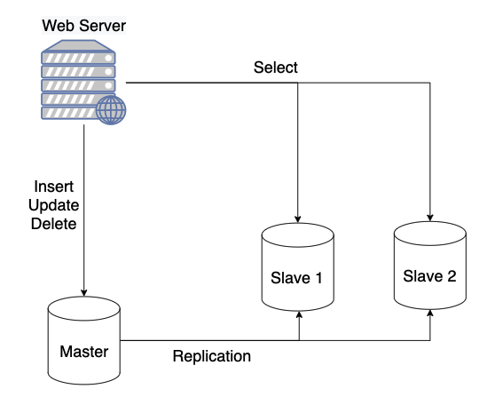
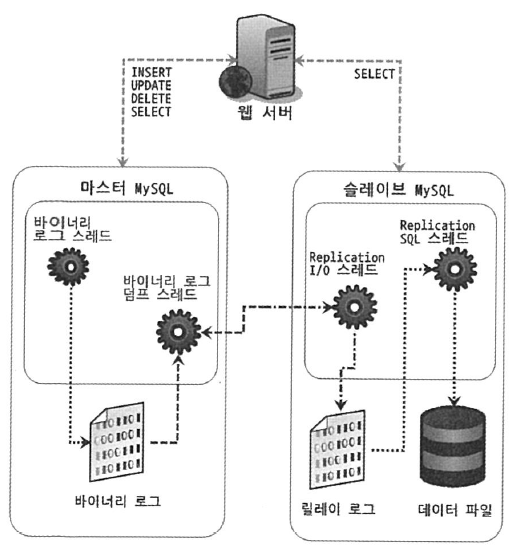
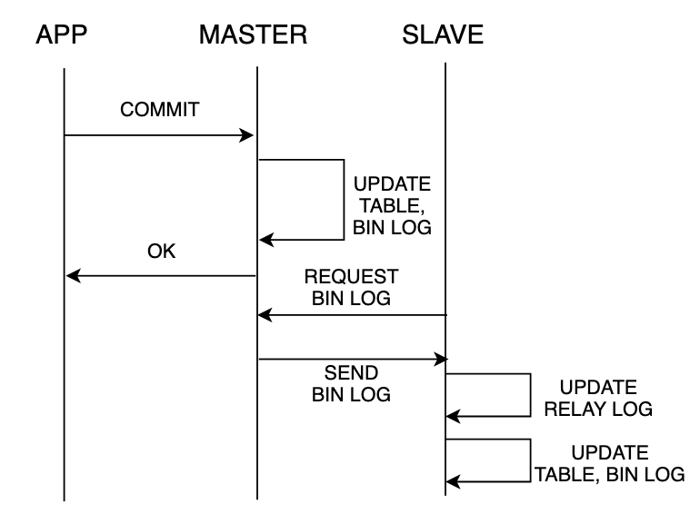
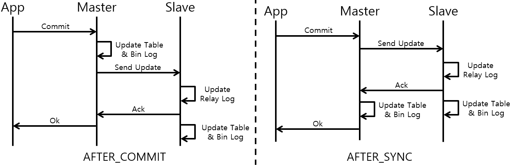
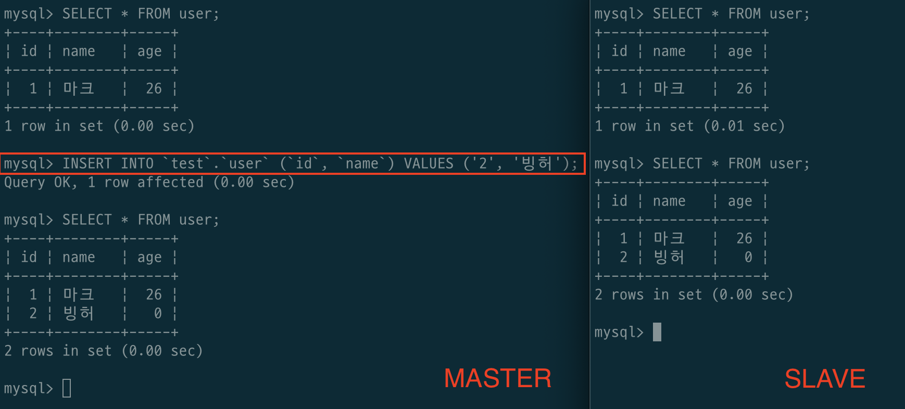
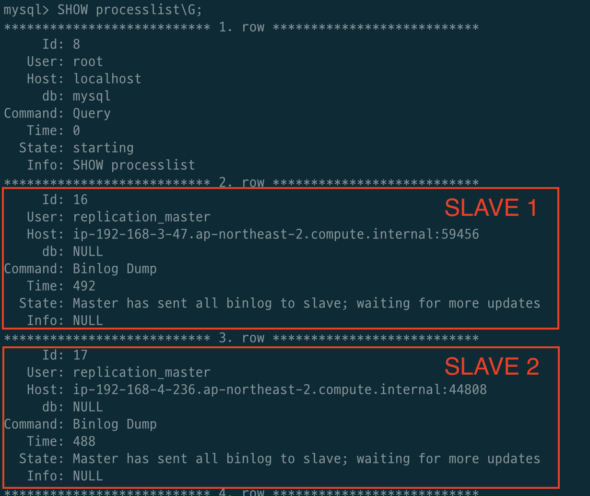

# 목차

<br>

- [목차](#목차)
- [들어가며](#들어가며)
- [DB Replication 개념](#db-replication-개념)
- [MySQL DB Replication 동작 원리](#mysql-db-replication-동작-원리)
  - [동작원리](#동작원리)
  - [이벤트](#이벤트)
  - [Replication 방식](#replication-방식)
    - [Async Replication](#async-replication)
    - [Semi-sync Replication](#semi-sync-replication)
- [DB Replication 구현 (MySQL)](#db-replication-구현-mysql)
  - [1 - DB 설치 및 기본 설정](#1---db-설치-및-기본-설정)
  - [2 - Master와 Slave 서버 Replication 연결 설정](#2---master와-slave-서버-replication-연결-설정)
    - [Master DB 서버 설정](#master-db-서버-설정)
    - [Slave DB 서버 설정](#slave-db-서버-설정)
  - [보너스 - 연결 확인 및 초기 동기화](#보너스---연결-확인-및-초기-동기화)
    - [Master DB와 Slave DB 연결 확인](#master-db와-slave-db-연결-확인)
    - [초기 동기화](#초기-동기화)
- [참고](#참고)

<br>

# 들어가며
DB 요청의 대부분은 읽기 작업이 차지하기 때문에 조회시 DB를 분산처리하면 성능을 높일 수 있다.

> 물론 쓰기 요청이 빈번할 경우 오히려 성능이 안 좋아질 수도 있다.

DB 조회에 대한 부하를 분산처리로 할 수 있게 해주는 기능이 바로 `Replication`이다.

[위키](https://en.wikipedia.org/wiki/Replication_(computing))에선 DB Replication을 다음과 같이 정의한다.

> Database replication can be used on many database management systems (DBMS), usually with a primary/replica relationship between the original and the copies. The master logs the updates, which then ripple through to the replicas. Each replica outputs a message stating that it has received the update successfully, thus allowing the sending of subsequent updates.

한마디로 정리하면, **여러 개의 DB를 수직적인 구조(Master - Slave)로 구축하여, Master DB에선 쓰기 작업만을 수행하고, Slave DB들에선 읽기 작업만을 수행**하는 것이다.

그리고 **Master DB에서의 쓰기 작업은 모두 다른 하나 또는 그 이상의 Slave DB로 복제하여 저장한다.**

<br>

이번 글의 목적은 DB Replication의 개념을 간단히 정리하고, MySQL에서의 Replication 동작 원리를 정리하고 구현해보는 것이다.

> 그리고 [다음 글](https://github.com/binghe819/TIL/blob/master/Spring/DB/Replication/Replication%20With%20JPA.md)에서 Spring Boot + JPA 기반의 조회시 라운드 로빈 방식으로 Slave DB와 커넥션 맺는 것에 대해서 다룬다.

<br>

# DB Replication 개념
먼저 DB Replication의 개념과 장단점에 대해서 정리하였다.

<br>

🤔 **DB Replication?**

<p align="center"> </p>

* 여러 개의 DB를 수직적인 구조(Master - Slave)로 구축하여, Master DB에선 쓰기 작업만을 수행하고, Slave DB들에선 읽기 작업만을 수행하는 방식
  * 마스터 (데이터를 변경할 수 있는 서버)와 슬레이브 (조회만 할 수 있는 서버)로 나뉜다.

<br>

🤔 **DB Replication 사용 이유**

* 데이터 백업
* DBMS 조회 부하분산
* 데이터 분석
* 데이터의 지리적 분산

<br>

🤔 **DB Replication 장단점**

* 장점
  * DB 요청의 대부분이 읽기 작업이기 때문에 Replication으로 충분히 성능을 높일 수 있다.
  * 비동기 방식 (MySQL의 경우)으로 운영되므로 지연 시간이 거의 없다.
* 단점
  * 여러 노드들 간의 데이터 동기화가 완벽히 보장될 순 없기에 일관성있는 데이터를 얻지 못할 수도 있다.
  * Master 노드에 의존성이 강하기 때문에 다운되면 복구 및 대처가 힘들다.

<br>

# MySQL DB Replication 동작 원리
이번엔 우선 대표적인 RDBMS중 하나인 MySQL는 어떻게 Replication을 다루는지에 대해서 다룬다.

그리고 이벤트와 Replication 방식에 대해서 다룬다.

<br>

## 동작원리

<p align="center"><br>출처: RealMySQL </p>

1. 마스터가 데이터의 구조나 내용을 변경하는 **모든 쿼리 문장을 바이너리 로그에 저장**한다.
2. 슬레이브 서버에서 I/O 스레드를 통해 변경 내역을 요청하면 마스터가 **바이너리 로그**를 읽어 슬레이브에게 넘긴다.
3. 슬레이브는 받아온 **바이너리 로그를 릴레이 로그에 기록한다.**
4. 슬레이브는 **릴레이 로그에 기록된 변경 내역을 재실행(Reply)함으로써 동기화**한다.

<br>

💁‍♂️ **마스터**

* Replication이 작동하려면 먼저 마스터는 바이너리 로그에 복제 이벤트를 기록해야 한다.
  * 이 작업은 쓰기가 버퍼링되며, 순차적이기 때문에 성능상 큰 저하는 없다.
* 바이너리 로그에는 나중에 슬레이브가 읽을 데이터(이벤트)를 저장한다.
* 마스터는 슬레이브 하나당 하나의 커넥션을 맺고 있다. (`Binlog dump Thread`)
  * 새로운 슬레이브 커넥션이 들어오면 새로운 스레드를 생성하여 커넥션을 맺는다.
  * 바이너리 덤프 스레드는 슬레이브당 하나.
* 바이너리 덤프 스레드의 역할
  * 바이너리 로그에 **새로 작성된 이벤트를 슬레이브에 알린다**.
  * 바이너리 로그의 **이벤트를 슬레이브에 전달한다**.
* 최신 바이너리 로그는 마스터의 OS 캐시에 저장되므로, 슬레이브는 오래되지 않은 바이너리 로그(실시간)의 경우, 모두 마스터의 캐시에서 이벤트를 읽어간다.
  * 디스크 I/O가 발생하지 않는다.
  * 물론 오래된 바이너리 로그를 읽는다면 디스크로부터 가져온다.

<br>

💁‍♂️ **슬레이브**

* Replication 기능을 적용시키면 슬레이브는 두 개의 스레드를 실행한다.
* 첫 번째 스레드. IO 스레드
  * **마스터와 커넥션을 맺고 있는다.**
  * **마스터로부터 들어오는 바이너리 로그 이벤트를 읽고 릴레이 로그(로컬 로그 파일)에 복사한다.**
  * 상태 체크는 `SHOW slave STATUS\G`를 통해 확인할 수 있다.
    * `Master_Log_File` - 마스터로부터 복사한 마지막 파일 (보통 마스터 로그 파일로 계속 동일)
    * `Read_Master_Log_Pos` - 받아온 바이너리 로그는 이 위치까지 슬레이브의 릴레이 로그에 복사된다.
* 두 번째 스레드. SQL 스레드
  * **슬레이브 로컬에 저장된 릴레이 로그에서 이벤트를 읽은 다음 최대한 빨리 적용시킨다.**
  * 단일 스레드라는 단점이 존재한다
  * 상태 체크는 `SHOW slave STATUS\G`를 통해 확인할 수 있다.
    * `Relay_Master_Log_File` - SQL Thread가 작업중인 바이너리 로그 파일.
    * `Exec_Master_Log_Pos` - SQL Thread에 의해 실행된 바이너리 로그 위치.

<br>

## 이벤트

<br>

🤔 **이벤트**

* 바이너리 로그에 기록되는 데이터의 변경 내역 혹은 DB 구조, 계정, 권한 변경 정보들을 이벤트라고 부른다.
* **바이너리 로그에 기록되는 데이터의 단위.**

<br>

🤔 **이벤트의 종류**

* Statement Based
  * 실행된 쿼리 구문 그대로 바이너리 로그에 기록하는 방식.
* Row Based
  * 생성/변경된 데이터의 Before/After row image가 바이너리 로그에 기록하는 방식.

<br>

## Replication 방식
MySQL의 Replication 기능의 복제 방식은 크게 두 가지 존재한다.
* Async Replication (비동기 복제)
* Semi-sync Replication (준동기 복제)

<br>

### Async Replication

<p align="center"> </p>

* 비동기 복제 방식이며, 트랜잭션이 Commit 되고 슬레이브 자체의 영향을 받지 않는다. 
* **마스터 DB는 Transacntion 수행 중 슬레이브로 인한 추가적인 동작을 수행하지 않는다.**
  * **복제 과정이 Transaction과 별개로 진행된다.**
  * 이는 **마스터가 슬레이브로 인한 성능 저하가 전혀 없다는 의미.**
  * 다만, **비동기이기 때문에 마스터에서 Transaction이 완료된 DB 변경 내용이더라도 슬레이브에 바로 반영되진 않는다. 이로 인해 마스터의 갑작스런 장애로 슬레이브 데이터의 손실이 발생할 수도 있다.**
  * **슬레이브의 장애는 마스터의 Transaction엔 아무런 영향을 주지 못한다.**
  * 장애가 발생한 슬레이브는 복구 된 후 중단되었던 릴레이 로그 위치부터 이어서 진행한다.
* 동작 과정
  1. 마스터는 슬레이브에 관계없이 DB의 변경 내용을 바이너리 로그에 기록한다.
  2. 마스터의 Dump Thread와 슬레이브의 I/O Thread는 커넥션을 맺고 있다.
  3. 슬레이브 I/O Thread는 마스터의 Dump Thread를 통해 바이너리 로그를 요청하고, 전달받아 자신의 릴레이 로그에 복사한다.
  4. 슬레이브 SQL Thread는 릴레이 로그 내용을 바탕으로 자신의 DB를 변경한다.

> Binary Log vs. Redo Log
> * Binary Log: MySQL의 전반적인 동작을 기록하는 로그.
> * Redo Log: MySQL InnoDB에서 내부적으로 Query 재실행, Query Rollback시 활용하기 위해 Query를 기록하는 로그.

<br>

### Semi-sync Replication

<p align="center"><br>출처: https://ssup2.github.io/theory_analysis/MySQL_Replication/ </p>

* 준동기 복제 방식이며, 마스터가 슬레이브로부터 릴레이 기록이 완료되었다는 ACK를 받고 Transaction을 진행하는 방식이다.
* 마스터 DB는 Transaction 수행 중 슬레이브로 인한 추가적인 동작을 수행한다.
  * 이는 비동기 복제보다 성능 저하가 발생하는 원인.
  * 만약 마스터가 슬레이브로부터 릴레이 로그를 받지 못하면 Transaction은 중단된다. 단, 마스터는 여러 슬레이브중 하나의 슬레이브로부터 ACK를 받으면 Transaction을 진행한다.
  * 이로 인해, 여러 대의 슬레이브를 둔다면 슬레이브로 인한 Transaction 장애를 최소화할 수 있다.
  * 성능은 저하되지만, 마스터 슬레이브간의 동기화를 조금 더 보장해준다.
* 준동기 복제 방식은 마스터가 슬레이브에게 DB 변경 내용을 언제 전달하느냐에 따라 두 가지 방식으로 나뉜다.
  1. AFTER_COMMIT: MySQL 5.5 이전
  2. AFTER_SYNC: MySQL 5.7 이후

<br>

# DB Replication 구현 (MySQL)
이제 실습으로 MySQL을 이용하여 Replication을 구현해보고자 한다.

전체적인 구현 순서는 다음과 같다.

1. 개별 서버에 MySQL DB 설치 및 기본 설정 (IP, Port, 계정, 권한 등등)
2. Master 서버와 Slave 서버 Replication 연결 설정
3. WAS (Spring Boot + JPA) DB 연결 및 Slave DB 선택 알고리즘 구현

이번 글에선 1, 2번만 다루고, 3번은 [다음 글](https://github.com/binghe819/TIL/blob/master/Spring/DB/Replication/Replication%20With%20JPA.md)에서 다룬다.

구성하고자하는 DB를 각각의 EC2 혹은 가상 환경에 설치하고, Master 서버와 Slave 서버에 Replication 설정을 해두면 Master의 변경사항이 자동적으로 Slave 서버들에 적용된다.

그리고 Spring Boot + JPA에선 쓰기 작업일 땐 Master, 읽기 작업일 땐 Slave로 커넥션 맺도록 설정만 해주면된다.

<br>

## 1 - DB 설치 및 기본 설정
가장 먼저 할 작업은 당연히 Master DB와 Slave DB들을 설치하는 것이다.

필자는 Master DB 한대, Slave DB 한대를 각각 다른 EC2에 설치했다.

환경은 다음과 같다.

* Ubuntu 18.04 LTS
* MySQL 5.7.36

<br>

> 아래 부터 나오는 설치 및 설정은 Master와 Slave 모두 해줘야 한다.

<br>

**apt(패키지) 방식 설치**

```bash
$ sudo apt update
$ sudo apt-cache search mysql-server
$ sudo apt-get install mysql-server-5.7
```

설치가 완료된 자동으로 Service로 실행이 되고 있다.

<br>

**MySQL 5.7 환경 설정**

MySQL 5.7을 패키지 설치하면 아래 위치에 설정파일이 존재한다.

`/etc/mysql/mysql.conf.d/mysqld.cnf`

그리고 우선은 위 파일 설정에서 두 가지만 수정해준다.

* `bind-address`: 외부에서 접속을 허용할 IP
  * 모든 IP에 대해서 허용하려면 `0.0.0.0`으로 설정해주면 된다.
  * 디폴트는 `127.0.0.1`이다.
* `port`: MySQL을 올릴 Port (외부 접속 Port)
  * 8888번 포트를 사용하고 싶다면 8888로 설정하면 된다.

두 가지를 설정했다면, 저장하고 나와서 아래와 같이 MySQL을 재실행해주면된다.

```bash
$ sudo service mysql restart
```

<br>

> 이외의 여러 설정은 [여기](https://github.com/binghe819/TIL/blob/master/DB/MySQL/MySQL%20%EC%84%A4%EC%B9%98%20%EB%B0%8F%20%EC%84%A4%EC%A0%95/MySQL%205.7%20%EC%84%A4%EC%B9%98%20%EB%B0%8F%20%EC%84%A4%EC%A0%95.md)를 참고.

<br>

## 2 - Master와 Slave 서버 Replication 연결 설정
이제 DB가 설치되었으니 본격적으로 Replication 설정을 해준다.

<br>

### Master DB 서버 설정
Master와 Slave중 Master DB를 먼저 설정해주어야 한다.

<br>

**계정 생성 및 설정**

Replication에 사용될 계정을 생성후 권한을 부여해주어야 한다.

우선 계정을 생성한다.

```bash
$ mysql -u root -p

mysql> USE mysql;

mysql> CREATE user '{계정 이름}'@'{% 혹은 Slave IP}' identified by '{비밀번호}';

# 예시
mysql> CREATE user 'replication_master'@'%' IDENTIFIED BY 'password';
```

계정이 잘 생성되었다는 메시지 (`Query OK, 0 rows affected (0.00 sec)`)가 나왔다면 권한 설정을 해준다.

`'%'`는 모든 IP에 대해서 허용한다는 의미이다.

> 권한 설정이란 특정 계정이 특정 스키마에 대한 접근 권한을 설정해주는 것이다.

```bash
mysql> GRANT REPLICATION SLAVE ON {* 혹은 스키마 이름}.{* 혹은 테이블 이름} TO '{유저 이름}'@'{ % 혹은 Slave IP }';

# 예시
mysql> GRANT REPLICATION SLAVE ON *.* TO 'replication_master'@'%';
```

`*`은 모든 테이블 혹은 스키마에 대해서 허용한다는 의미이다.

권한 설정이 잘 되었다는 메시지가 뜬다면 아래와 같이 설정을 반영해주면 된다.

```bash
mysql> FLUSH PRIVILEGES;
```

> Replication에 사용될 계정이 특정 DB의 DDL 권한을 얻을려면 다음과 같이 설정해주면 된다.
> 
> `GRANT ALL PRIVILEGES ON '{DB(스키마)명}'.* TO '{계정 이름}'@'%';`

<br>

**Master DB 환경 설정**

이제 Master DB에 대한 환경 설정을 해준다.

```bash
$ sudo vim /etc/mysql/mysql.conf.d/mysqld.cnf

# The following can be used as easy to replay backup logs or for replication.
# note: if you are setting up a replication slave, see README.Debian about
#       other settings you may need to change.
server-id              = 1
log_bin                = /var/log/mysql/mysql-bin.log
expire_logs_days       = 10
max_binlog_size        = 100M
#binlog_do_db           = include_database_name
#binlog_ignore_db       = include_database_name
```
* `server-id`: MySQL 서버들을 식별하기 위한 id
  * 바이너리 로그에 이벤트별로 이벤트가 최초로 발생한 DB를 식별하기 위해 사용된다.
  * Master와 Slave DB를 구별하기 위해 사용되므로, 각각의 DB는 모두 다르게 설정해줘야 한다.
* `log_bin`: 바이너리 로그 파일 저장 위치 및 형식
* `binlog_do_db`: Replication 설정할 DB(스키마) 명
  * 생략시 전체 DB를 Replication한다.
  * 여러 개의 DB를 설정해주고 싶으면, 중복해서 여러개 작성해주면 된다.
* `binlog_ignore_db`: Replication 하고 싶지 않은 DB(스키마) 명 설정
  * 여러 개의 DB를 설정해주고 싶으면, 중복해서 여러개 작성해주면 된다.

<br>

두 설정에 달린 주석을 풀어주고 적절히 설정한 후 MySQL을 다시 실행해주면 된다.

<br>

MySQL를 다시 접속하여 바이너리 로그 파일을 제대로 관리하는 지 확인해준다.

```bash
mysql> SHOW master STATUS\G;
+------------------+----------+--------------+------------------+-------------------+
| File             | Position | Binlog_Do_DB | Binlog_Ignore_DB | Executed_Gtid_Set |
+------------------+----------+--------------+------------------+-------------------+
| mysql-bin.000001 |      154 |              |                  |                   |
+------------------+----------+--------------+------------------+-------------------+
```

* File: MySQL 로그 파일
* Position: 로그 파일 내 읽을 위치
* Binlog_Do_DB: Replication 설정한 DB 명 (없으면 전체)
* Binlog_Ignore_DB: Replication 제외 정보

> 위 명령어의 권한은 `SUPER` 혹은 `REPLICATION CLIENT`이다.
> 
> 필자는 위에서 계정 설정시 `REPLICATION SLAVE`으로 했기 때문에, `root` 계정으로 들어가 확인했다.

<br>

❗️ **Master DB 백업**

> 운영중인 DB에 Replication을 적용하려면 Master DB의 데이터를 Slave DB와 동기화하는 작업이 필요하다.

자세한 내용은 [여기](#초기-동기화)를 확인.

<br>

### Slave DB 서버 설정
Master를 모두 설정해주었다면, 이제 Slave DB 역할을 하는 서버들을 설정해준다.

Master DB 설정과 크게 다르지 않다.

<br>

**계정 생성 및 설정**

외부에서 편하게 Slave DB에 접근하고 싶다면, 계정을 생성하고 설정해준다.

필자는 Slave에 복제가 잘 되는지 확인하기 위한 DB 접근용 계정을 만들어두었다.

<br>

**Slave DB 환경 설정**

Slave DB 환경 설정을 해준다.

```bash
$ sudo vim /etc/mysql/mysql.conf.d/mysqld.cnf

server-id              = 2
```
* 여러 대의 Slave DB를 설정한다면 `server-id`를 모두 다르게 설정해주어야 한다.
* 복제하고 싶지 않은 DB(스키마)명이 있다면 다음과 같이 설정해주면 된다.
  * `replicate-do-db`: Replication 받을 DB(스키마)명령. (생략시 전체 DB를 복제한다)

역시 설정을 완료하면 MySQL을 재시작해준다.

<br>

**Master DB 정보 입력**

이제 Slave DB에서 Master DB의 정보를 입력해준다.

```bash
$ mysql -u root -p

mysql> USE mysql;
mysql> CHANGE MASTER TO MASTER_HOST='{Master DB IP}', MASTER_PORT={MasterDB Port}, MASTER_USER='{Master에 Replication을 위해 만든 계정}', MASTER_PASSWORD='{계정 비밀번호}', MASTER_LOG_FILE='{로그 파일 명}', MASTER_LOG_POS={POS 값};
```

이전에 Master DB에서 `SHOW master STATUS`를 통해 얻은 정보와 생성한 Master 계정 정보를 통해 설정해주면 된다.

변경이 완료되었다는 메세지가 출력되면 `START SLAVE` 명령을 해준다.

> * `STOP SLAVE`: SLAVE Replication 정지 (Master의 데이터를 더 이상 받지 않는다.)
> * `RESET SLAVE ALL`: slave설정을 초기화

그리고 아래와 같이 SLAVE의 상태를 확인한다.

<br>

```bash
mysql> SHOW slave STATUS\G;
*************************** 1. row ***************************
               Slave_IO_State: Waiting for master to send event
                  Master_Host: 192.168.3.32
                  Master_User: replication_master
                  Master_Port: 8888
                Connect_Retry: 60
              Master_Log_File: mysql-bin.000001
          Read_Master_Log_Pos: 154
               Relay_Log_File: ip-192-168-3-47-relay-bin.000002
                Relay_Log_Pos: 320
        Relay_Master_Log_File: mysql-bin.000001
             Slave_IO_Running: Yes
            Slave_SQL_Running: Yes
              Replicate_Do_DB:
          Replicate_Ignore_DB:
           Replicate_Do_Table:
       Replicate_Ignore_Table:
      Replicate_Wild_Do_Table:
  Replicate_Wild_Ignore_Table:
```

<br>

## 보너스 - 연결 확인 및 초기 동기화
여기까지 온거라면 Master DB와 Slave DB 설정을 모두 해주었을 것이다.

이번 장에선 둘이 제대로 설정되었나 확인하고, Master의 데이터를 덤핑해서 Slave에 복제하는 것을 알아본다.

<br>

### Master DB와 Slave DB 연결 확인
제대로 복제가 되었다면, 아래와 같이 Master에 쓰기 작업을 진행하면 자동으로 Slave에도 복제된다.

<p align="center"> </p>

또한, Master DB에서 `SHOW processlist\G`를 통해 어떠한 Slave와 연결되어 있는지 확인할 수 있다.

<p align="center"><br>SLAVE 두 개를 연결했을 때의 연결 상황 </p>

<br>

### 초기 동기화
보통 Replication은 빈 DB에서보다는 돌아가는 상황에서 많이 적용될 것으로 예상된다.

DB가 실제 돌아가는 환경에서 Replication 서버를 추가해야할 때 동기화하는 방법은 크게 두가지 있다.

> 리플리케이션 동기화시에는 최대한 데이터베이스의 내용이 일치하는게 좋으므로, 
> 
> Master에서 더이상 DB의 입출력이 일어나지 않는 상태에서 작업하는것이 좋다.
> 
> `mysql stop`을 통해 아예 종료시키거나, `FLUSH TABLES WITH READ LOCK`을 통해 락을 걸고 진행하면 된다.

<br>

1. **Dump를 이용하여 처리하는 방법**

```bash
# Master DB 서버

$ mysqldump -u root -p '{비밀번호}' -p {덤프 할 DB(스키마)명} > {덤프명}.sql

# SCP를 통해 Slave 서버로 dump_file.sql을 옮겨준다.

# Slave DB 서버
$ mysql -u root -p {DB(스키마)명} < {덤프 파일명}.sql

```
* Master DB를 덤프뜬 후, Slave에 옮겨 복사하는 방식이다.
* 시간이 은근 오래 걸려 추천하지 않는다.

<br>

2. **MySQL 데이터 디렉토리를 통째로 옮기는 방법**

```bash
# Master DB 서버
mysql> FLUSH TABLES WITH READ LOCK; 

$ tar -cvf {데이터 파일}.tar .

# SCP 혹은 다른 방식으로 SLAVE 서버로 전송

# SLAVE DB 서버
$ tar -xvf {데이터 파일}.tar 

# Master DB 서버의 락을 풀어준다.
$ mysql> UNLOCK TABLES;
```
* 권장하는 방식이며, DB 데이터가 위치한 곳 (`/var/lib/mysql` 혹은 `/var/db/...`)을 통째로 압축해서 복사하거나, 아니면 그냥 복사하는 방법.

<br>

# 참고
* Real MySQL
* https://ssup2.github.io/theory_analysis/MySQL_Replication/
* https://hoing.io/archives/3111
* http://minsql.com/mysql/semi-synchronous-replication-on-mysql/
