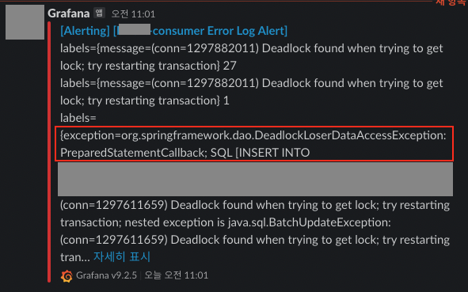
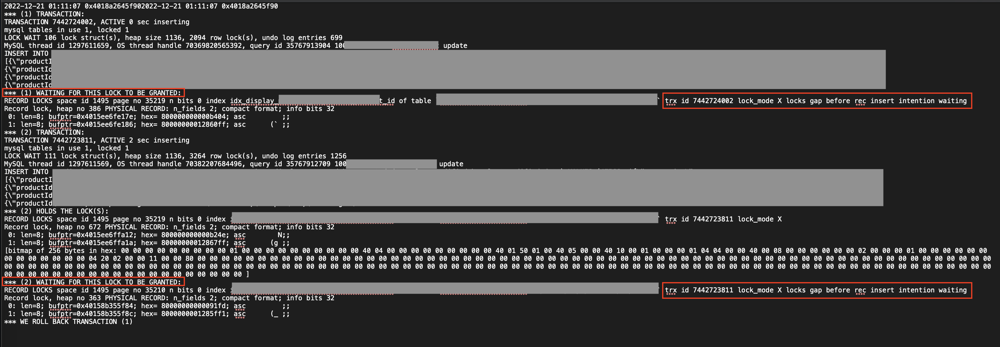
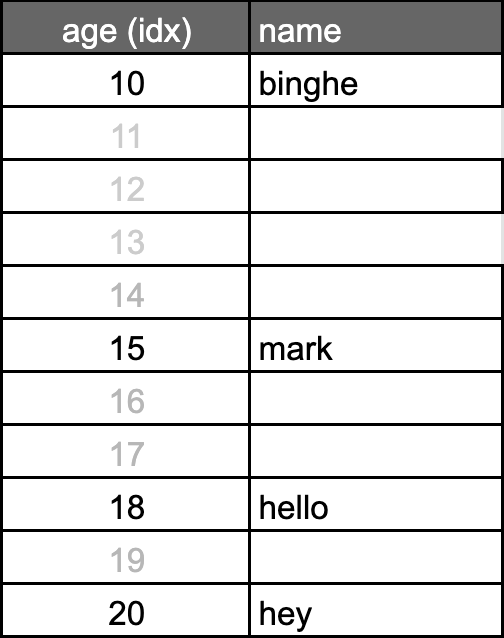
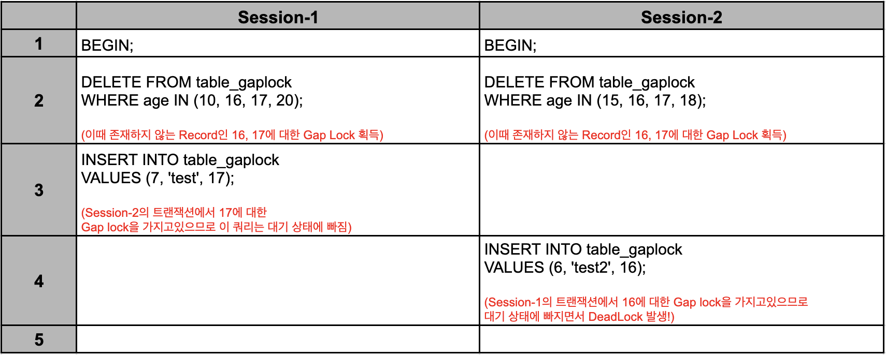
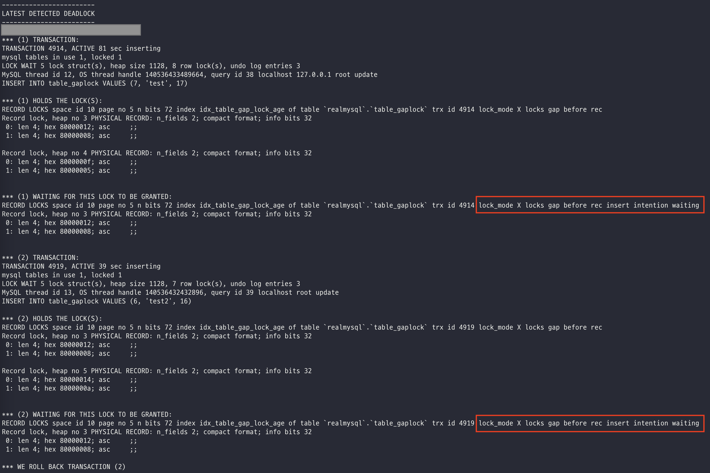
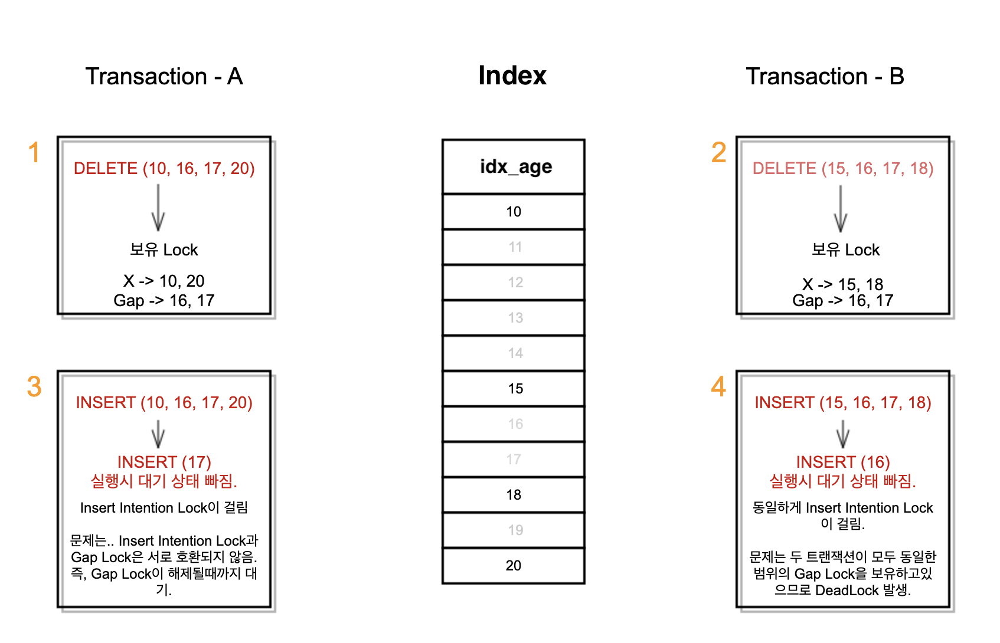

# 목차

<br>

- [목차](#목차)
- [Insert Intention Waiting DeadLock 원인 및 해결 (feat. Insert시 DeadLock 발생)](#insert-intention-waiting-deadlock-원인-및-해결-feat-insert시-deadlock-발생)
- [1 원인 파악](#1-원인-파악)
  - [1-1 DeadLock 원인 확인](#1-1-deadlock-원인-확인)
  - [1-2 DeadLock이 발생한 정확한 원인 - InnoDB의 Insert Intention Lock과 Gap Lock은 서로 호환되지 않는다](#1-2-deadlock이-발생한-정확한-원인---innodb의-insert-intention-lock과-gap-lock은-서로-호환되지-않는다)
- [2 DeadLock 해결](#2-deadlock-해결)
- [결론](#결론)

<br>

# Insert Intention Waiting DeadLock 원인 및 해결 (feat. Insert시 DeadLock 발생)

어느날부터 운영중인 서비스에서 아래와 같은 에러 로그가 올라오기 시작했다..

<p align="center"><br>Consumer 애플리케이션 에러 로그 알림 </p>

빈번하게 발생하진 않았지만, Consumer 서버에서 생성된 리드모델을 Insert하는 과정에서 간헐적으로 DeadLock이 발생했다.

구글링해보니 StackOverFlow에 Insert시 Deadlock 발생과 관련된 글을 심심치않게 발견할 수 있었다.

하지만.. 발생한 원인에 대해서 너무 간단히만 서술되어있어.. InnoDB의 잠금에 대해서 제대로 이해하지 못했던 필자의 경우는 전혀 원인을 파악하기 어려웠다.

이번기회에 InnoDB의 잠금에 대해서도 알아보고, 왜 Insert시 DeadLock이 발생했는지 원인과 해결방법에 대해서 알아보고자한다.

> **InnoDB 잠금에 대한 개념을 잘 모른다면 [InnoDB 잠금 정리](../InnoDB%20Lock/InnoDB%20Lock.md)를 먼저 읽고 이 글 읽기를 추천한다.**

<br>

# 1 원인 파악
우선 DeadLock이 발생한 정확한 원인을 파악해본다.

<br>

## 1-1 DeadLock 원인 확인
에러 로그를 통해 Consumer 애플리케이션에서 DeadLock이 발생했다는 것을 알 수 있으므로, MySQL에 접속하여 왜 DeadLock이 발생했는지 살펴본다.

> DeadLock 확인하는 방법은 [여기](../DeadLock%20%ED%99%95%EC%9D%B8/MySQL%20InnoDB%20DeadLock%20%ED%99%95%EC%9D%B8.md)를 참고.

<br>

> MySQL 접속후
```shell
mysql> SHOW ENGINE INNODB STATUS \G;
```

아래와 같이 애플리케이션에서 발생한 에러와 동일한 쿼리를 실행한 DeadLock을 확인할 수 있다.

> 참고로 MySQL은 최근에 발생한 DeadLock만 기록하기때문에, DeadLock 발생한 로그를 주기적으로 백업해두거나, DeadLock 발생시 빠른 시간안에 확인해야한다.

<p align="center"><br>DeadLock 확인 결과 </p>

위 캡쳐에서 알 수 있듯이, **두 트랜잭션에 서로 Insert Intention Locks을 획득하려고 시도하다 DeadLock이 발생했다는 것을 알 수 있다.**

즉, **두 트랜잭션이 Lock을 획득한 Row에 대해서 서로 Insert Intention Lock을 획득하려고 시도하다 교착 상태 (DeadLock)에 빠진 것이다.**

<br>

## 1-2 DeadLock이 발생한 정확한 원인 - InnoDB의 Insert Intention Lock과 Gap Lock은 서로 호환되지 않는다

두 트랜잭션이 왜 Insert Intention Lock을 얻으려다 DeadLock이 빠졌는지 이해하기위해선 Gap Lock과 Insert Intention Lock의 상관 관계를 이해해야한다.

<br>

💁‍♂️ **InnoDB는 다른 트랜잭션이 대상 간격 (Gap)에 새로운 레코드가 Insert 되는 것을 막는다. 그리고 이러한 잠금을 Gap Lock이라고 부른다.** 

InnoDB는 Repeatable-Read에서 Phantom Read 문제를 방지하고 Replication의 일관성 보장을 위해 Gap Lock이라는 특수한 잠금을 사용한다.

이는 **실제 Record가 존재하지 않는 Row들 (간격)에 Lock을 걸어, 다른 트랜잭션에서 Insert를 못하게 막음으로써 Phantom-Read가 발생하지 않는 Repeatable-Read의 트랜잭션 수준을 지원하는 것이다.**

> 더 자세한 내용은 [여기](../InnoDB%20Lock/InnoDB%20Lock.md#4-gap-locks)를 참고.

<br>

💁‍♂️ **Insert Intention Lock은 삽입 의도를 가지고 Row에 Insert시 묵시적으로 얻는 Lock을 의미한다.**

실제로 Insert 구문 실행시 획득하는 특수한 형태의 gap lock이며, Insert될 row에 대해서 exclusive lock을 걸기 전에 먼저 Insert Intention Lock을 건다.

<br>

💁‍♂️ **문제는 Insert Intention Lock과 Gap Lock은 서로 호환되지 않는다.**

**Gap Lock는 내부적으로 Shared Lock 형태만 존재한다. 그러므로 Gap Lock끼리는 서로 호환된다.**

즉, Gap Lock이 걸려있다고해도, 또 다른 트랜잭션에서 Gap Lock을 대기없이 획득할 수 있다.

다만, **Gap Lock과 Insert Intention Lock은 서로 호환되지않는다.**

이는 **Gap Lock이 걸려있는 Row에 Insert 구문 실행시 해당 Row에 대한 Gap Lock이 풀릴 때까지 대기하게된다.**

그리고 **Insert 구문 실행시 묵시적으로 Insert Intention Lock이 걸리기때문에, Gap Lock이 걸려있는 Row에 Insert 구문을 실행시 Insert Intention Lock을 얻기위해 대기상태에 빠지게된다.**

> 서로 호환되지 않는 이유는 [여기](../InnoDB%20Lock/InnoDB%20Lock.md#4-gap-locks)의 GapLock 부분부터 읽으면 이해된다.

<br>

💁‍♂️ **그리고 필자가 겪은 Insert시 DeadLock 문제가 발생하는 로직 확인결과 각각 Gap Lock을 보유하는 Delete 쿼리를 사용했다.**

필자는 위 개념을 이해하고 바로 해당 트랜잭션이 일어나는 로직을 확인해보았다.

**그 결과 해당 로직이 `Delete And Save` 형태라는 것을 확인했다.**

즉, **기존에 존재하는 Row를 Delete하고 Save (Insert)하는 로직인 것이다.**

문제는 **Delete시 해당 Row가 존재하면 `X Lock`을 걸고, 존재하지 않으면 `Gap Lock`을 걸게 된다는 것이다.**

<br>

💁‍♂️ **정리 - A 트랜잭션과 B 트랜잭션이 서로가 원하는 Insert의 Gap Lock을 가지고있어서 발생하는 DeadLock.**

실제로 간단한 테이블을 만들어 아래와 같이 동일한 쿼리를 재현해보았다.

<p align="center"><br>예시 테이블 </p>

<p align="center"><br>재현한 쿼리</p>

* 위 예시에서 2번까지는 대기없이 즉시 실행된다.
  * Session-1은 10, 20에 대해서 X Lock을 보유하게 되고, Session-2는 15, 18에 대해서 X Lock을 보유하게된다.
  * 그리고 두 Session 모두 16, 17에 대해서 Gap Lock을 획득한다.
    * Gap Lock은 항상 Shread 모드이므로 서로 충돌하지 않고 대기 없이 잠금을 획득하는 것.
* 그런데 3번과 4번의 INSERT문은 `Insert Intention Lock`을 필요로한다.
  * 문제는 Insert Intention Lock과 Gap Lock이 서로 호환되지 않는다.
  * **이로인해 Session-1은 Session-2의 Gap Lock인 17을, Session-2는 Session-1의 Gap Lock인 16을 대기하면서 DeadLock이 발생하게된다.**

<br>

**실제로 아래와 같이 예상한 DeadLock이 발생한 것을 확인할 수 있다.**

<p align="center"><br>동일한 DeadLock 발생! </p>

<br>

**그림으로 더 자세히 정리하면 아래와 같이 두 트랜잭션이 쿼리를 실행할 때 DeadLock이 발생했던 것이다.**

<p align="center"> </p>

<br>

# 2 DeadLock 해결
이제 정확한 원인을 찾았으니 해결책을 생각해본다.

<br>

💁‍♂️ **해결 방안은 크게 두 가지로 나뉜다.**

* 애플리케이션 로직 수정
* DB 설정 수정

<br>

💁‍♂️ **DeadLock의 원인은 애플리케이션의 문제일 확률이 높다.**

DeadLock은 사실 DB의 문제라기보다는 애플리케이션 로직의 문제일 확률이 높다.

그러므로 **DeadLock이 발생시 정확한 원인을 찾아 애플리케이션에서의 문제를 해결하는 것이 좋다.**

**만약 애플리케이션상에서 정말 해결하기 어렵다면 최후의 수단으로 해당 Session에 관해서만 설정을 수정하여 사용하자.**

<br>

💁‍♂️ **이번 DeadLock 문제 해결방법을 정리하면 아래와 같다.**

* 애플리케이션 로직 수정
  * 트랜잭션을 최대한 짧게 유지.
    * 트랜잭션 범위를 최대한 짧게 유지. (Batch Size를 줄인다던지..)
  * `DELETE AND SAVE` 대신 `UPDATE` (혹은 `UPSERT`)로 수정.
  * **Gap Lock 발생하는 부분을 최대한 줄이기.**
    * 현재 문제는 존재하지 않는 Row에 대한 DELETE로 인한 Gap Lock이 발생하는 것이다. 그러므로 실제로 존재하는 Row만 DELETE하도록하면 된다.
    * DELETE전에 존재하는 Row인지 SELECT하여 확인후 DELETE. (존재하지 않는 Row에 대해서 Gap Lock이 걸리지 않도록.)
  * 트랜잭션 안에 수정되는 Row를 순차적으로 정렬하여 Lock의 순서를 항상 순차적으로 만드는 방안.
    * 존재하지않는 Row에 대한 DELETE문으로 인해 Gap Lock이 발생하는 것이므로, 이 방안은 크게 효용이 없음.
* DB 설정 수정
  * Gap Lock이 발생하는 인덱스에 UNIQUE 조건 걸어도 된다면 조건 걸기.
    * 
  * DeadLock이 발생하는 요청 Session에 관해서만 `READ-COMMITED`격리 레벨 사용.
    * `READ-COMMITED`는 Gap Lock을 사용하지 않으므로, 위 DeadLock 문제가 발생하지 않는다.
    * 하지만, 다른 트랜잭션 격리 레벨 수정에 따른 부수효과가 발생할 수 있다.
* 기타
  * 트랜잭션을 완전히 Serialize하게 실행.
    * 세마포어용 테이블을 만들어, 해당 테이블에 대한 수정 사항을 실행하는 트랜잭션을 모두 순차적으로 실행되도록.

<br>

# 결론
원인을 한마디로 정리하면 아래와 같다.

`A 트랜잭션과 B 트랜잭션이 서로가 원하는 Insert하려고하는 Row에 대해서 Insert Intention Lock을 획득요청하는 A와 B 트랜잭션 서로 해당 Row에 대한 Gap Lock을 가지고있어서 발생하는 DeadLock`이다.

해결 방안으로 여러가지가 존재하며, 필자의 경우는 애플리케이션 로직 수정으로 해결하였다.
