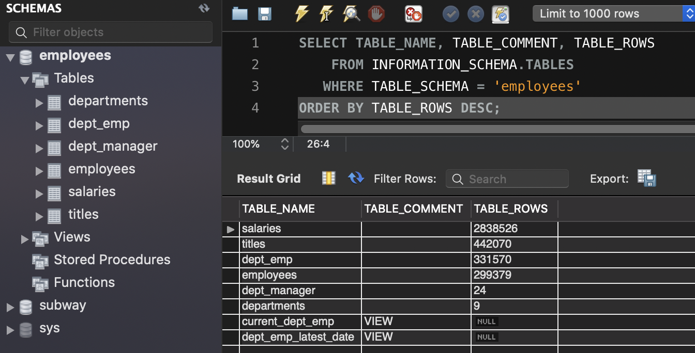
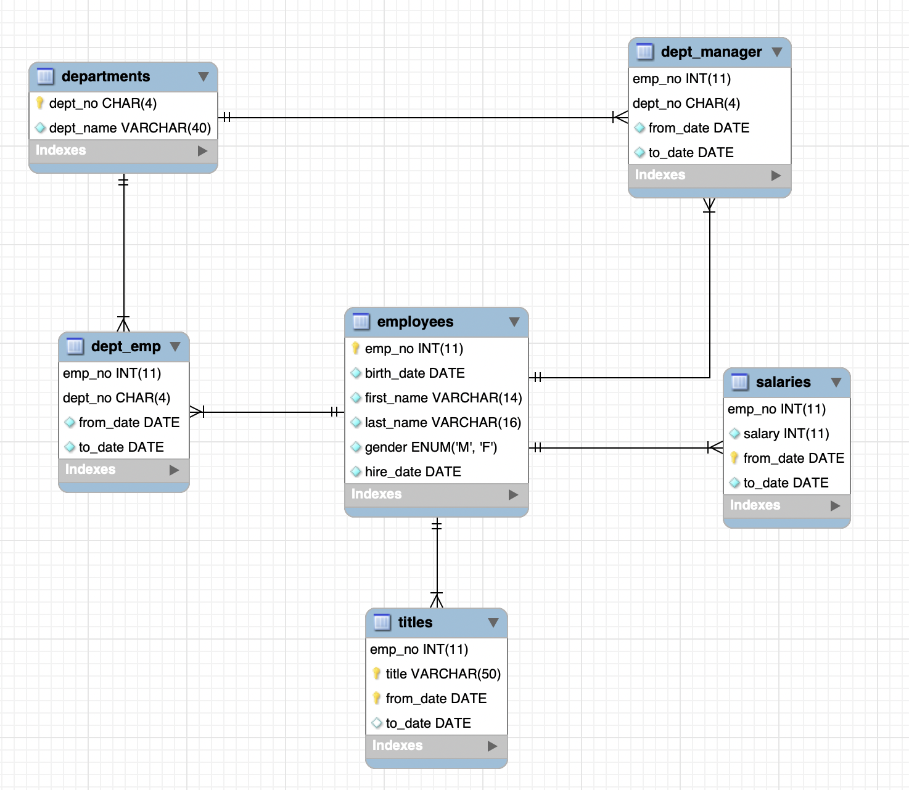

# 목차

<br>

- [목차](#목차)
- [들어가며](#들어가며)
- [샘플 데이터 다운로드](#샘플-데이터-다운로드)
- [Docker MySQL에 import](#docker-mysql에-import)
- [로컬 MySQL에 import](#로컬-mysql에-import)
- [샘플 데이터 정보 및 ERD](#샘플-데이터-정보-및-erd)
- [마치며](#마치며)

<br>

# 들어가며
필자는 근래 MySQL을 통해 인덱싱을 공부중이다.

DB 공부도 일반적인 코딩과 똑같이 '백견불여일타'인 듯하다..

이번 글에선 테스트할 샘플 데이터를 DB에 import하는 방법에 대해서 다룬다.

<br>

# 샘플 데이터 다운로드
인터넷에 찾아보니 샘플 데이터는 정말 많다.

그중에서도 대부분 대학교 강의와 책에선 employees 데이터 셋을 많이 사용하는 듯하다.

<br>

https://github.com/datacharmer/test_db

위 Github Repo에서 `Download Zip`을 통해 다운받아준다.

알집을 풀어주면 샘플 데이터 다운은 완료.

<br>

# Docker MySQL에 import
우선 Docker MySQL을 하다 띄워준다.

1. 해당 Docker Container에 다운 받은 샘플 데이터 디렉토리(`test_db-master`)를 복사해준다.

```bash
docker cp /path/to/{다운 받은 데이터 샘플 디렉토리} 컨테이너ID:/tmp
```

<br>

2. MySQL 컨테이너에 접속해서 SQL 스크립트를 import 해준다.

```bash
# 컨테이너 접속
docker exec -it 컨테이너ID /bin/bash

# import
mysql -u root -p < /tmp/{다운 받은 데이터 샘플 디렉토리}/employees.sql
```

> import할 때 `.dump`파일들을 사용하므로, 다운받은 샘플 디렉토리를 그대로 컨테이너에 옮겨야 한다.

<br>

# 로컬 MySQL에 import
EC2 혹은 로컬 PC에 MySQL이 설치되어 있다면 아래와 같이 import해주면 된다.

```bash
$ mysql -u root -p < /path/to/{다운 받은 데이터 샘플 디렉토리}/employees.sql
```

<br>

# 샘플 데이터 정보 및 ERD
샘플 데이터의 정보 (테이블과 행 개수)는 다음과 같다.

<p align="center"> </p>

<br>

ERD는 다음과 같다.

<p align="center"> </p>

<br>

# 마치며
이제 DB 공부하러 가볼까요??~

