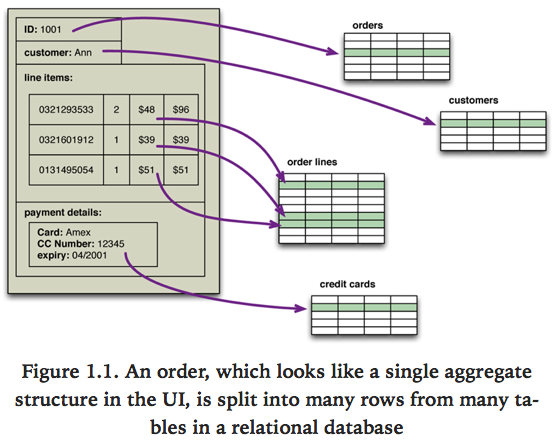

# 목차

 

- [목차](#목차)
- [1장. 왜 NoSQL인가?](#1장-왜-nosql인가)
- [1 관계형 데이터베이스의 가치](#1-관계형-데이터베이스의-가치)
  - [관계형 데이터베이스 특징과 장점](#관계형-데이터베이스-특징과-장점)
  - [관계형 데이터베이스의 단점 객체-관계 불일치](#관계형-데이터베이스의-단점-객체-관계-불일치)
- [2 통합 데이터베이스에서 애플리케이션 데이터베이스로](#2-통합-데이터베이스에서-애플리케이션-데이터베이스로)
  - [통합 데이터베이스](#통합-데이터베이스)
  - [애플리케이션 데이터베이스](#애플리케이션-데이터베이스)
- [3 클러스터의 공격](#3-클러스터의-공격)
- [4 NoSQL의 출현](#4-nosql의-출현)
- [정리](#정리)

 

# 1장. 왜 NoSQL인가?
소프트웨어 업계에서 데이터를 저장하는데는 관계형 데이터베이스 사용하는 것이 기본이었다.

오랜 지배 기간이 지난 다음에야, NoSQL 데이터베이스가 갑자기 주목 받기 시작하게되었다.

이번 장에서 관계형 데이터베이스가 어떻게 지배적 위치를 차지하게 되었는지 살펴본다.

또, NoSQL 데이터베이스의 대두가 반짝 성공이 아닌 이유도 살펴본다.

 

# 1 관계형 데이터베이스의 가치
우선 관계형 데이터베이스가 지배적 위치를 차지하게 된 이유를 살펴본다.

 

## 관계형 데이터베이스 특징과 장점
1. 데이터 저장
   * 데이터베이스의 존재 이유는 '많은 양의 데이터를 보관'하는 것이다.
   * 컴퓨터에선 두 종류의 저장 장치가 존재한다.
     * 메모리 (RAM) - 빠르지만 크기 제한이있으며, 컴퓨터에 오류가 발생하거나 종료되면 데이터는 모두 없어진다.
     * 보조 저장소 (HDD/SSD) - 비교적 느리지만 크기 제한이 없고, 영구적으로 데이터를 저장한다.
   * 데이터베이스는 영구적으로 데이터를 저장해야할 때, 파일시스템보다 효율적이고 많은 양의 데이터를 보조 저장소에 저장하며, 애플리케이션에서 필요한 정보를 빠르고 쉽게 얻을 수 있다.
     * 물론 인메모리 데이터베이스의 경우엔 메모리에 데이터를 저장한다.
2. 동시성
   * 애플리케이션은 많은 사람의 요청을 동시에 받아 데이터를 보고 수정할 수 있다.
   * 관계형 데이터베이스는 트랜잭션을 통해 모든 데이터에 대한 접근을 통제해 동시성 문제를 해결한다.
   * 트랜잭션은 여러 데이터에 대한 수정을 하나의 묶음으로 처리할 수 있으며, 이를 통해 뭔가 수정중 오류가 발생하면 롤백해 데이터를 이전으로 돌릴 수 있다.
3. 통합
   * 여러 애플리케이션 서버가 한 개의 데이터베이스에 데이터를 저장하도록하는 '통합 데이터베이스 공유' 방식을 사용할 수 있다.
     * 다수의 서비스는 여러 애플리케이션 서버가 한 개의 데이터베이스에 연결되어 서비스된다.
   * 모든 애플리케이션 서버가 동일한 데이터를 보장받으며, 여러 사용자의 요청을 처리할 수 있다.
4. 표준 모델
   * 위 3가지 장점을 표준적인 방벙을 통해 제공된다.
   * 즉, 벤더게 달라도 핵심 SQL 구문은 거의 비슷하고, 트랜잭션 동작도 비슷하다.

 

## 관계형 데이터베이스의 단점 객체-관계 불일치
관계형 데이터 베이스는 장점이 많지만 완벽하지 않으며, 초창기부터 불만이 많았다.

그중 가장 큰 불만은 '객체-관계 불일치'이다. 

즉, `관계형 모델과 메모리 내 데이터 구조 간의 차이`가 가장 큰 단점이다.

 출처: Pramod J. Sadalage, Martin Fowler, NoSQL Distilled, A Brief Guide to the Emerging World of Polyglot Persistence, Pearson Education, Inc, 2012. 

* 관계형 데이터 모델은 스프리트시트와 같은 행과 열로 구성된 구조인 테이블에 데이터를 저장한다. 그리고 테이블간의 관계를 정의한다.
* 관계형 데이터 모델에선 행과 열안에 단순, 중첩된 레코드나 리스트등 다른 구조를 포함할 수 없다.
  * 물론 할 순 있지만, 좋은 구조가 아니다.
* 하지만, 메모리내에서 동작하는 애플리케이션 서버내에서는 데이터 구조에 대한 제약이 없어 훨씬 복잡한 구조를 다루며, 그 결과 복잡한 메모리 내 객체 구조를 데이터에 저장하려면 먼저 관계형 표현으로 변환해야한다.
* 이 문제를 해결하고자 SQL 매퍼, ORM (Object Relational Mapping, 객체-관계 매핑)가 널리 사용되면서 어느정도 지겨운 작업은 많이 줄었다.
  * 하지만, 이로인한 데이터베이스나 쿼리 성능을 무시하면 다른 문제가 생길 수 있다.
  * 예를 들어, N + 1 문제..

 

# 2 통합 데이터베이스에서 애플리케이션 데이터베이스로

 

## 통합 데이터베이스

기존엔 여러 팀에서 다양한 애플리케이션 서버를 개발하고, 공통 데이터베이스에 데이터를 저장했다.

즉, 하나의 데이터베이스만 두고 여러 애플리케이션 서버가 SQL문을 통해 통합되는 것이다.

이러한 방법엔 장단점이 존재한다.

* 장점
  * 모든 애플리케이션이 일관된 데이터 집합을 가지기때문에 커뮤니케이션이 향상된다.
* 단점
  * 여러 애플리케이션이 통합하려고 설계한 구조는 단일 애플리케이션에서 필요한 구조보다 더 복잡해진다.
  * 특정 애플리케이션의 요구사항으로 설계한 인덱스가 구조가, 다른 애플리케이션의 Write 성능을 저하시킬 수도 있다.
  * 각 애플리케이션은 다른 팀에서 만들기 때문에 모든 애플리케이션의 데이터 적합성을 보장하는 방식으로 데이터를 갱신하는지 확신할 수 없다.
    * 이로인해, 데이터 적합성 보장의 책임은 데이터베이스 자체가 책임져야하는 상황이 발생한다.

 

## 애플리케이션 데이터베이스

통합 데이터베이스의 단점을 극복하려면 각 팀의 애플리케이션마다 데이터베이스를 구축하는 것이 좋다.

이를 애플리케이션 데이터베이스 방식이라고 말한다.

애플리케이션 데이터베이스의 장점은 아래와 같다.

* 외부 팀에선 애플리케이션 서버만 바라보기때문에, 각 팀마다 데이터베이스를 마음대로 선택해서 구축할 수 있다.
  * NoSQL 데이터베이스 선택 가능.
* 사용하는 팀만 데이터베이스 구조를 알면 되므로, 스키마 유지보수가 쉽다.
* 데이터 적합성 보장에 대한 책임을 애플리케이션 코드내에서 처리할 수 있다.

그리고 이때 외부 애플리케이션과는 HTTP를 통해 통신하는경우가 많은데, 이로인해 XML, JSON과 같은 통신 규격이 많이 사용된다.

 

# 3 클러스터의 공격
컴퓨터와 핸드폰등의 발전으로 인해, 데이터와 트래픽이 기하급수적으로 증가하였으며, 이는 더 많은 컴퓨팅 자원을 필요로했다.

이런 증가를 처리하는 방법은 크게 두 가지로 볼 수 있다.

1. Scale-Up (수직 확장)
   * 더 좋은 장비에 더 많은 프로세서와 디스크, 메모리를 장착해서 성능을 올리는 방식.
   * 장비 크기와 성능을 키우는게 한계가 존재하며, 가격도 엄청 비싸다.
2. Scale-Out (수평 확장)
   * 작은 장비를 모아 클러스터를 구성하는 방식.
   * 저가 하드웨어로 구축할 수 있으며, 비용이 적게 든다.
   * 장비 한 대가 죽더라도 클러스터 전체는 중단없이 서비스하도록 구축함으로써 높은 가용성을 제공한다.

 

문제는 관계형 데이터베이스는 클러스터 (Scale-Out)에서 동작하도록 설계되지 않았다는 것이다.

* 오라클 RAC, 마이크로소프트 SQL 서버 같은 클러스터 데이터베이스는 공유 디스크 개념을 사용한다.
  * 문제는 이 방식이 파일 시스템을 사용해 고가용성 디스크 서브 시스템에 데이터를 기록하는데, 이는 디스크 서브시스템이 죽으면 고가용성을 보장하기 어렵다. 즉, 디스크 서브시스템이 SPOF인 것.
* 물론 **관계형 데이터베이스에서 샤딩하여, 부하를 분산할 수 있지만 애플리케이션 서버에서 모든 샤딩을 제어해야한다.**
  * 즉, 데이터가 어느 데이터베이스 서버에서 처리해야하는지 애플리케이션에서 파악하고 제어해줘야한다.
* 또한, **여러 샤드에 걸치는 쿼리나 참조 정합성, 트랜잭션, 일관성 제어등 굉장히 복잡해진다.**

 

그래서 관계형 데이터베이스와 클러스터 환경에서의 부조화를 해결하기위해 구글은 BigTable, 아마존은 DynamoDB를 개발했다.

그리고 **이쯤부터 클러스터 환경에 맞는 데이터베이스를 만들기위해 탐구하기 시작했다.**

 

# 4 NoSQL의 출현

* NoSQL 데이터베이스는 대부분 클러스터 환경에서 실행할 목적으로 만들어졌다.
  * 다만 NoSQL의 한 종류인 그래프 데이터베이스는 클러스터에서 실행되도록 맞춰지진 않았다.
* NoSQL의 탄생 목적
  * 오픈 소스, 분산, 비관계형 데이터베이스
* NoSQL의 의미
  * NoSQL은 그저 SQL을 사용하지 않는다는 의미이다.
* 관계형 데이터베이스는 데이터 일관성을 위해 ACID 트랜잭션을 이용한다.
  * 이는 클러스터 환경과 본질적으로 맞지 않다.
  * 그러므로 NoSQL은 일관성과 분산에 관해 여러 종류의 선택 사양을 제공한다.
* NoSQL은 스키마 없이 동작하며, 구조에 대한 정의를 변경할 필요없이 데이터베이스 레코드에 자유롭게 필드를 추가할 수 있다.
* NoSQL은 기술이라기보다는 동향으로 보는 것이 옳다. NoSQL이 탄생했다고 관계형 데이터베이스가 사라지진 않는다.
  * 관계형 데이터베이스는 앞으로도 계속 존재할 것으로 본다.
* NoSQL의 탄생으로 데이터 저장소에 대한 한 가지 선택사항이 더 생기게되었다. 이런 관점에서 '다중 저장소 지속성'란 용어가 생겼다.
  * 즉, 상황에 따라 다른 저장소를 선택해야한다.
  * 애플리케이션이 저장해야하는 데이터의 본질이 무엇인지, 이 데이터를 어떻게 조작하고 싶은지 이해하여 저장소를 선택해야한다.

 

정리하면 NoSQL을 고려하는 데는 두 가지 주요한 이유가 존재한다.

1. 클러스터가 필요한 규모의 데이터 크기와 성능 요건 하에서의 데이터 접근 처리.
2. 좀 더 편리한 데이터 조작 방식을 통한 애플리케이션 개발 생산성.

 

# 정리
* 관계형 데이터베이스는 20년 이상 지배적인 구조를 가진 기술이며, 지속성, 동시성 제어, 통합 매커니증을 제공한다.
* 문제는 애플리케이션 개발자가 관계형-객체형 불일치로인한 불만이 많았다.
* 그리고 이때 데이터베이스를 통합점으로 사용하는 방식에서 데이터베이스를 애플리케이션 안에 캡슐화하고 서비스를 통해 통합하는 방식으로 이동하려는 움직임이 있었다.
* NoSQL 탄생에 가장 큰 요인은 클러스터에서 실행되는 엄청난 양의 데이터를 지원해야한다는 점이었으며, 관계형 데이터베이스는 클러스터에서 효율적으로 동작하도록 설계되어있지않다.
* NoSQL의 공통적인 특징은 아래와 같다.
  * 관계형 모델을 사용하지 않는다. (SQL을 사용하지않는다.)
  * 클러스터에서 잘 동작한다.
  * 오픈 소스
  * 스키마가 없다.
* NoSQL 등장의 가장 큰 결과는 다중 저장소 지속성이다. 즉, 관계형 데이터베이스가 기존엔 전부였다면 이젠 저장 방식의 한가지로 되었다.
