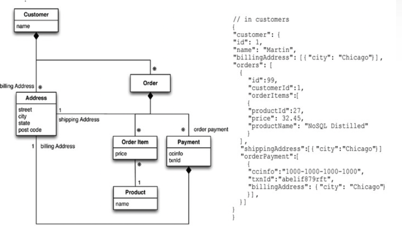

# 목차

 

- [목차](#목차)
- [2장. 집합적 데이터 모델](#2장-집합적-데이터-모델)
- [1 집합적 데이터 모델?](#1-집합적-데이터-모델)
- [2 집합](#2-집합)
- [3 키-값 모델과 도큐먼트 데이터 모델](#3-키-값-모델과-도큐먼트-데이터-모델)
- [4 칼럼 패밀리 저장소](#4-칼럼-패밀리-저장소)
- [5 집합 지향 데이터베이스 요약 - 중요](#5-집합-지향-데이터베이스-요약---중요)
- [정리](#정리)

 

# 2장. 집합적 데이터 모델
NoSQL을 사용할 때 가장 명확한 변화는 관계형 모델을 더이상 사용하지 않는다는 것이다.

대신 다른 모델을 사용하며, NoSQL 생태계에는 네 가지로 분류된다.

* 키-값
* 문서
* 칼럼 패밀리
* 그래프

이중 그래프를 제외하고는 모두 '집합-지향 (aggregate orientation)`이라는 특징을 공유한다.

2장에서 집합 지향이 무엇이고, 데이터 모델에서 집합 지향이 지닌 뜻이 무엇인이 알아본다.

 

# 1 집합적 데이터 모델?

* 데이터 모델
  * 데이터를 인식하고 조작하는데 사용되는 모델을 말한다.
  * 데이터베이스가 데이터를 구조화하는 모델. (메타 모델)
* 데이터 모델의 가장 대표적인 예시가 관계형 데이터 모델.
  * 스프레드시트 페이지처럼 보이는 테이블 집합. 행을 가지며, 각 행에 개체(entity)를 표현한다.
  * 칼럼은 같은 테이블이나 다른 테이블에 있는 행을 참조할 수 있으며, 각 개체 간 관계가 관계가 설정된다.
* **NoSQL의 가장 큰 변화는 '관계형 모델'에서 멀어진 집합 지향 모델을 지향한다는 것이다.**

 

# 2 집합

 

💁‍♂️ **관계와 집합 비교**
* 관계형 모델의 특징
  * 관계형 모델에서는 저장하고자 하는 정보를 행(튜플)으로 나눈다.
  * 행(튜플)은 굉장히 제한적인 데이터구조이다.
    * 행은 여러 개의 단순한 값을 모아 놓은 것으로, 한 행을 다른 행에 넣어 중첩 레코드를 만들 수도 없고, 값의 목록을 넣을 수도 없다.
* 집합 지향 모델의 특징
  * 집합 지향에서는 행의 집합보다 더 복잡한 구조를 데이터의 단위로 다루고 싶어한다.
    * 리스트나, 중첩된 레코드를 허용하는 복잡한 레코드로 생각하면 된다.
  * 키-값, 문서, 칼럼 패밀리 모두 복잡한 레코드를 사용하며, 이런 복잡한 레코드를 책에선 '집합(aggregate)'라는 용어로 사용한다.
* 집합이란?
  * 집합은 도메인 주도 개발 (DDD)에서 나온 용어이며, DDD에서 집합은 단위로 다루고 싶은 관련된 객체의 무리를 의미한다.
  * **집합은 데이터 조작과 일관성 관리의 단위가 된다.**
    * **보통 원자적 연산으로 집합을 업데이트하고 데이터 저장소와도 집합 단위로 통신한다.**
    * 애플리케이션에서도 데이터를 집합 구조로 조작하는 경우가 많으므로, 개발자가 작업하기에도 집합 구조가 더 쉽다.
  * **집합은 리플리케이션이나 샤딩에서도 자연스러운 단위가 되므로, 데이터베이스가 클러스터에서 데이터를 처리하는 것도 쉬워진다.**
    * 관계형에서는 한 도메인의 정보를 얻기위해 테이블간의 연결을해야하기때문에, 샤딩이나 클러스터에 적합하지 않았다.

 

💁‍♂️ **관계와 집합의 예시**

전자상거래 웹 사이트를 구축한다고 가정해보면, 사용자, 제품 목록, 주문, 배송지 주소, 청구서 발송지, 지불 데이터에 대한 정보를 저장해야한다.

관계형 모델은 아래와 같이 적절히 정규화해서 저장한다.

 출처: Pramod J. Sadalage, Martin Fowler, NoSQL Distilled, A Brief Guide to the Emerging World of Polyglot Persistence, Pearson Education, Inc, 2012. 

**여기서 중요한 것은 정규화를 통해 어떠한 데이터도 여러 테이블에 중복되지 않는다.** 참조 정합성도 지키고있다.

이를 집합 모델로 생각하면 아래와 같다.

 출처: Pramod J. Sadalage, Martin Fowler, NoSQL Distilled, A Brief Guide to the Emerging World of Polyglot Persistence, Pearson Education, Inc, 2012. 

**이 모델에는 고객과 주문이라는 두 가지의 주요 집합만 존재한다.**

고객은 청구서 발송지 목록을 포함하고, 주문은 상품 주문 목록, 배송지 주소, 지불 정보를 포함하고있다.

**여기서 중요한 것은 논리적으로는 하나인 주소가 세 번이나 나오지만, ID를 사용하는 대신 값으로 취급해 매번 복사한다는 것이다.** (역정규화)

**집합 모델에서는 이렇게 전체 주소 구조를 필요에 따라 집합에 복사할 수 있다. 이는 관계형과 상반되는 특징이다.**

고객과 주문 사이의 연결은 어느 집합에도 포함되어 있지 않다. 

그리고 상품 이름을 주문의 일부로 보이게 했는데, 이는 데이터를 주고 받을 때 집합의 종류가 적은 편이 더 좋기 때문이다.

> 배송지 주소나 청구지 주소가 바뀌지 않는 도메인에서는 이 모델이 잘 맞는다.

 

💁‍♂️ **집합 모델에서 중요한 것은 애플리케이션에서 그 데이터에 어떻게 접근할 지에 대해 생각해야한다는 것이다.**

**NoSQL의 집합 경계나 설계는 정규식과 다르게 정답이 없다. 그러므로 애플리케이션에서 데이터에 접근하는 요구사항을 잘 분석해서 설계하는 것이 중요하다.**

> 실제로 RDB는 정규화로인해 100명이 하나의 설계를 내놓을 수 있지만, NoSQL은 역정규화기때문에 100명이 모두 다른 설계를 낸다.

예를 들어, 고객 데이터에 접근할 때 그 고객의 모든 주문 정보도 한꺼번에 접근하는 경우가 많다면 단일 집합이 좋을 것이다.

그러나 한 번에 한 주문에 집중하는 경우가 대부분이라면 각각의 별도의 집합으로 분리하는 것이 좋다.

 

💁‍♂️ **집합 모델은 설계에 정답이 없기때문에, 많은 사람들이 집합 무지 (관계형 데이터베이스)를 선호한다.**

**집합의 경계를 제대로 그리는 것은 어려운 일이며, 똑같은 데이터가 여러 가지 다른 맥락에서 사용되는 경우 특히 어렵다!**

그래서 집합을 사용하지 않는 집합 무지 (관계형)를 선호한다. (그래프 데이터베이스도 집합 무지다)

> 집합과 집합 무지 모두 각각의 장단점을 가진 트레이드오프 관계라고 볼 수 있다.

 

💁‍♂️ **그럼에도 집합 지향이 중요한 이유**

* 클러스터에서 동작하기 좋기 때문.
  * 이 점이 집합 설계가 어려운데도 NoSQL을 사용하는 가장 핵심 요인이다.
* 트랜잭션에도 중요한 영향을 끼친다.
  * 관계형은 여러 테이블에 있는 많은 행이 하나의 연산으로 업데이트된다. (ACID)
  * 보통 NoSQL 데이터베이스는 이러한 ACID 트랜잭션을 지원하지않는다. 대신, **한 번에 한 집합에 대한 원자적 조작을 지원한다.**
    * 즉, 집합 여러 개를 원자적 방법으로 조작해야 한다면, 이를 애플리케이션 코드에서 직접 관리해야 한다는 의미이다.
    * **대신 원자성이 필요한 범위를 한 집합 내로 한정하는 것이 집합을 어떻게 나눌지 결정하는 요소가된다.**

 

# 3 키-값 모델과 도큐먼트 데이터 모델
두 가지 모두 집합 지향적이며 많은 집합으로 구성되어 있다. 각 집합은 데이터를 얻는데 사용하는 key나 id를 가진다.

 

💁‍♂️ 키-값 데이터베이스

* 집합 구조가 불투명하며, 대부분 의미 없는 바이너리 데이터처럼 취급된다.
  * 이로인해, 집합 안에 무엇이든 저장할 수 있다는 장점이 존재한다.
* key를 통해서만 집합(값)에 접근할 수 있다.

 

💁‍♂️ 도큐먼트 데이터베이스

* 집합 구조가 투명하며, 집합의 구조를 볼 수 있다.
  * 이로인해, 집합에 허용되는 구조와 타입을 정의해 그 안에 들어갈 수 있는 것을 제한한다.
* 집합(값)의 필드를 이용하거나 집합의 전체 또는 일부를 조회할 수 있으며, 집합의 내용을 이용해 인덱스를 만들 수 있다. (접근할 때 융통성이 더 많다.)

 

💁‍♂️ 두 데이터베이스의 구분이 모호해지긴 했지만, 그래도 일반적으로 구분한다.

* 두 데이터베이스는 현재 구분이 모호하다.
  * 키-값 형태로 검색하려고 도큐먼트 데이터베이스에 ID 필드를 넣기도하며,
  * 키-값 데이터베이스에 불투명한 집합 이상의 데이터 구조를 정의한다.
    * 실제로 Redis는 집합 (값)을 리스트나, set으로 분해하는 것을 허용한다.
* 모호할 순 있지만, 그럼에도 일반적인 구분은 존재한다.
  * 키-값 데이터베이스는 key를 통해 집합을 찾는다.
  * 도큐먼트 데이터베이스는 문서 내부 구조를 기초하여 어떤 형태의 쿼리를 실행한다.
    * 키를 사용할 수 있지만, 대부분 다른 것을 사용한다.

 

# 4 칼럼 패밀리 저장소

* 칼럼 패밀리 구조를보면 테이블처럼 보이는데, 테이블 구조 보단 두 단계로 된 Map이라고 생각하는 것이 좋다.
  * 많은 사람들이 테이블 구조로 생각하는데 이는 하나도 도움이 되지 않는다.
* 대다수 데이터베이스는 행을 저장단위로 다루기때문에 '쓰기' 성능에 도움을 준다.
  * 그러나 쓰기는 거의 없지만 많은 행에 대해 몇 개의 칼럼만 한꺼번에 읽어야하는 경우에는 '모든 행에 대한 칼럼 그룹 (칼럼 패밀리)를 저장 단위로 사용하는 편'이 더 좋다.
  * 이런 이유로 이러한 데이터베이스를 컬럼 저장소라고 부른다.
* 칼람 패밀리 저장소의 데이터 모델 - 두 단계로 된 Map
  1. 첫번째 키는 보통 행의 ID로, 관심 집합을 찾는데 사용된다.
  2. 두번째 단계의 값을 칼럼이라고 부르며, 행 전체에 접근하는 것 뿐만 아니라, 특정 칼럼만 고를 수 있다.
* 다른 집합 저장소와 칼럼 패밀리 구조의 다른 점은 행 집합 자체가 좀 더 구체적인 값의 Map으로 구성된다는 점이다.

 

# 5 집합 지향 데이터베이스 요약 - 중요
* 세 가지 데이터 베이스 모두 '집합'이라는 개념을 공유한다.
* 공통점
  * 집합은 검색할 수 있도록 key로 색인되어있다.
  * **집합은 클러스터에서 실행되는 데 가장 중요한 개념으로, 한 집합으로 구성된 데이터는 모두 한 노드에 저장됨을 데이터베이스가 보장한다.**
  * **집합은 업데이트에 대한 원자적 단위로 동작해, 제한적이지만 유용한 정도의 트랜잭션 제어를 제공한다.**
* 차이점 - 집합의 개념에 약간의 차이가 존재한다.
  * 키-값
    * 집합을 불투명한 덩어리로 취급
    * key로만 집합을 찾을 수 있다
    * 집합의 일부를 질의하거나 꺼내 올 수 없다.
  * 도큐먼트
    * 집합이 투명하다.
    * 집합의 일부로 쿼리하고 일부만 꺼내올 수 있다.
    * 하지만 스키마가 없어서 데이터베이스가 집합의 일부를 저장하거나 꺼내올 때 도큐먼트 구조를 최적화할 수 있는게 별로 없다.
  * 칼럼 패밀리
    * 집합을 칼럼 패밀리로 나누어, 데이터베이스가 칼럼 패밀리를 행 집합 내 단위로 다룬다.
    * 집합에 구조를 강제하지만, 데이터베이스가 이 구조 정보를 이용해 접근성을 향상시킬 수 있다.

 

# 정리
* 집합은 상호작용할 때 단위로 사용하는 데이터 모음이다.
  * 집합으로 ACID 연산에 대한 경계를 형성한다.
* 키-값, 도큐먼트, 칼럼 패밀리 데이터베이스 모두 집합-지향 데이터베이스이다.
* 집합을 사용하면 클러스터에서 데이터 저장소를 관리하기가 쉬워진다.
* 집합-지향 데이터베이스는 모든 데이터 상호작용이 같은 집합으로 이루어질 때 가장 좋다.
  * 상호작용에 여러 가지 다른 형태로 조직된 데이터가 사용된다면 집합 무지 데이터베이스가 낫다.

