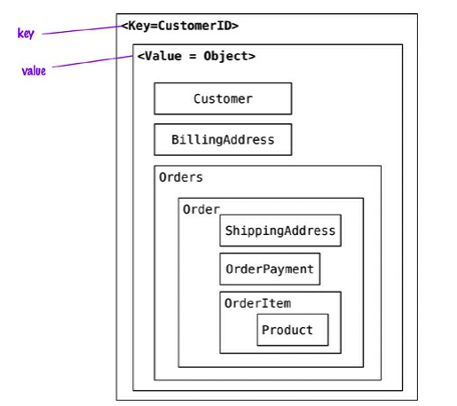
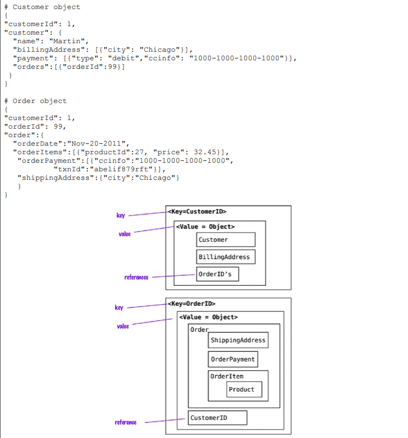
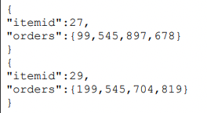
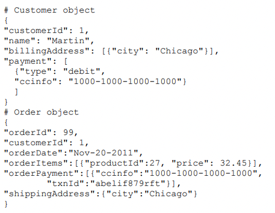

# 목차

 

- [목차](#목차)
- [3장. 데이터 모델 상세](#3장-데이터-모델-상세)
- [1 관계](#1-관계)
- [2 스키마 없는 데이터베이스](#2-스키마-없는-데이터베이스)
- [3 구체화 뷰](#3-구체화-뷰)
- [4 데이터 접근을 위한 모델링 - 중요](#4-데이터-접근을-위한-모델링---중요)
- [정리](#정리)

 

# 3장. 데이터 모델 상세
집합은 NoSQL에서 가장 중요한 부분이다.

이번 장은 집합에 대한 데이터 모델링 개념에 대해서 살펴본다.

 

# 1 관계

💁‍♂️ **집합간의 관계는 어떻게 설계할 것인가? 가장 쉬운 것은 FK와 같은 ID 링크를 사용하는것이긴하다.**

* 집합은 일반적으로 함께 접근하는 데이터를 한 덩어리로 모아놓기 때문에 유용하다.
* 하지만, 관련 데이텅에 다르게 접근하는 경우가 많은데, 이땐 상황에 따라 한 덩어리로 만들기 어렵다.
  * 예를 들어, 고객과 주문의 관계
    * 요구사항 1 - 고객 정보에 접근할 때마다 그 고객의 주문 내역까지 함께 접근하길 원함.
    * 요구사항 2 - 주문을 개별로 처리하길 원해 주문을 독립된 집합으로 모델링하고 싶음.
  * 요구사항 1은 고객와 주문 내역을 하나의 집합으로, 요구사항 2는 주문과 고객을 별도 집합으로 분리하고, 이 사이에 관계를 이을만한 링크를 제공한다.
* 이렇게 두 집합간의 관계를 나타낼 때 보통 고객ID와 같은 FK 형식의 링크 정보를 사용한다.
  * 문서 저장소는 집합의 내용을 가지고 인덱스를 만들고 조회할 수도 있다.
  * 키-값 저장소인 리악에서는 부분 검색과 링크 순회를 지원함으로써 링크 정보를 설정한다.

 

💁‍♂️ **하지만 집합 간 관계에서 중요한 것은 업데이트 방식이며, 집합 지향 데이터베이스는 여러 집합에 걸쳐 데이터를 조작해야하는 경우 처리가 불편한다.**

* 집합 지향 데이터베이스는 집합을 데이터 접근 단위로 취급한다. 그 결과 원자성은 단일 집합의 내용 안에서만 지원된다.
* 집합을 한 번에 여러 개 업데이트하면, 도중에 실패할 경우 직접 감지하고 처리해줘야한다. (RDB는 트랜잭션을 통해 자동으로 해줌.)
* 즉, 집합 지향 데이터베이스는 여러 집합에 걸친 데이터를 조작해야하는 경우 처리가 불편하다.

 

💁‍♂️ **데이터 사이에 많은 관계가 있다면 RDB가 더 좋은 선택일 수도 있다. 단, RDB도 join등의 비용이 생각보다 많이 든다.**

* 집합 지향 데이터베이스는 관계를 처리하기 힘들기에 데이터 사이에 관계가 많은 경우 RDB를 선택하는 것이 나을지도 모른다.
* 그러나 RDB도 복잡한 관계를 처리할 때 동일하게 성능이나 쿼리에 신경을 많이 써줘야한다.

 

# 2 스키마 없는 데이터베이스

 

💁‍♂️ 모든 형태의 NoSQL 데이터베이스는 스키마가 없다는 공통점이 있다. 반면에 RDB는 스키마를 무조건 정의해주어야한다.

* 키-값 저장소는 키에 대응되는 값에 어떤 데이터든 저장할 수 있다.
* 도큐먼트 저장소는 저장하는 도큐먼트 구조에 어떤 제약이 없으므로 사실상 동일한 처리 작업을 할 수 있다.
* 칼럼-패밀리 데이터베이스 역시 칼럼 안에 어떤 데이터든 저장할 수 있다.
* 그래프 데이터베이스도 자유롭게 간선을 추가할 수 있고, 노드와 간선에 원하는 대로 속성을 추가할 수 있다.

 

💁‍♂️ 무스키마의 장점 - 자유와 융통성

* 스키마에 구속되지 않으며 필요한 것을 쉽게 저장할 수 있다.
* 새로운 것을 추가하거나 필요없는 것을 제거하는 변경이 굉장히 쉽다.
  * RDB는 DDL로 스키마를 변경해주어야한다..
* **균일하지 않은 데이터를 처리하는 것이 쉽다. - 중요**
  * RDB는 스키마에 따라 모든 행을 구속하므로.. 필요없는 값을 null로 넣는 경우가 많다.

 

💁‍♂️ **무스키마의 단점 - 데이터에 접근하는 프로그램이 항상 암묵적 스키마에 의존해야한다.**

* 치명적이다..
* `Key : Value = fieldName : value` 형식일 때 Key가 `field_Name`으로만 변경되도 정상적으로 조회할 수 없게 된다..
* 즉, **데이터에 접근하는 프로그램이 항상 어떤 형태든 암묵적 스키마에 의존해야한다.**

 

💁‍♂️ **암묵적 스키마의 문제 - 스키마가 데이터베이스에서 애플리케이션 코드로 이동한다. 낙관적..**

1. 어떤 데이터가 있고, 그 데이터가 무엇인지 이해하려면 확인하려면 애플리케이션 코드를 확인해야한다.
2. NoSQL 데이터베이스는 스키마에 대해 아무것도 몰라, 스키마 정보를 활용해 효율적인 데이터를 저장하거나 꺼낼 수 없다.
   * 데이터 유효성 검사등을 모두 애플리케이션에서 해야한다.
3. 여러 팀이 개발하는 애플리케이션이 한 NoSQL 데이터베이스에 접근하는 경우 문제가 발생할 수 있다.

> 이러한 문제때문에 RDB가 고정된 스키마를 가졌으며, RDB를 더 많이 사용한 이유이기도하다.

 

💁‍♂️ **암묵적 스키마 해결 방법**

1. 모든 데이터베이스 상호작용을 단일 팀의 단일 애플리케이션에 캡슐화하고 다른 애플리케이션과는 웹을 통해서만 통신한다.
   * 현재 가장 많이 사용되는 방법.
2. 각 애플리케이션에서 접근하는 집합 구조 영역에 대해 명확하게 기술한다.
   * 문서 데이터베이스라면, 다른 섹션이 될 것이고, 칼럼 패밀리라면 다른 칼럼이 될 수 있다.

 

💁‍♂️ **데이터가 균일하지 않다면 무스키마 데이터베이스를 고려할 좋은 이유다**

 

💁‍♂️ **무스키마의 융통성은 한 집합 구조 내에서만 유효하다!**

* **집합 구조의 경계를 변경해야 한다면, RDB와 마찬가지로 전환은 매우 복잡한 작업이 된다.**
* 한 집합 구조 안에서의 변경만 자유롭다..

 

# 3 구체화 뷰

💁‍♂️ **집합 지향 데이터 모델의 장점과 단점**

* 장점
  * 주문에 접근하고 싶으면 주문과 관련된 모든 데이터를 한 집합에 포함시켜 한 번에 저장하거나 읽어오기 편하다.
* 단점
  * 여러 데이터를 기반으로 분석하는데 취약하다.
    * 제품 관리자가 특정 상품이 지난 2주간 얼마나 팔렸는지 알고싶다면.. 데이터베이스의 주문 데이터를 전부 읽어야한다.
    * 물론 인덱스를 걸어 성능을 높일 순 있지만, 그럼에도 RDB에 비하면 불편한다.

 

💁‍♂️ NoSQL엔 RDB의 뷰는 없지만, 쿼리 결과를 미리 계산해 캐시해 높을 수 있다.

* RDB는 뷰라는 개념이 존재한다.
  * RDB는 집합 구조가 없으므로 여러 테이블의 데이터를 모아 원하는 형태로 쿼리할 수 있는 '뷰' 기능을 제공한다.
  * 뷰는 계산하는 데 비용이 많이 들 수도 있어서, 계산 결과를 미리 만들어 디스크에 캐시해 놓는 '구체화 뷰'가 고안되었다고한다. 
* NoSQL에도 쿼리 결과를 미리 계산해 캐시해 놓을 수 있다.
  * 그리고 이를 표현할 때 여전히 '구체화 뷰'란 용어를 사용한다. (CQRS에서 Read 역할)

 

💁‍♂️ 구체화 뷰 (리드모델)을 만드는 두 가지 방법

1. 기본 데이터(명령모델)가 변경될 때 구체화 뷰(리드모델)도 함께 바뀌도록하는 방법.
   * 주문을 추가하면 각 제품에 대한 구매 내역 집합도 함께 업데이트된다.
   * 이 방법은 쓰기보다 읽기가 훨씬 많고, 구체화 뷰가 최신 데이터를 갖도록 하고 싶은 경우에 좋다.
   * 매번 업데이트하는 것은 오버헤드가 있으므로, 이럴땐 규칙적인 간격으로 배치 작업을 실행해 구체화 뷰를 업데이트할 수 있다.
2. 데이터를 읽어 뷰를 계산하고 결과를 데이터베이스에 저장하는 방식.
   * 데이터베이스 밖에서 구체화 뷰를 만들 수도 있고, 데이터베이스에서 제공하는 맵-리듀스등의 기능을 활용하여 뷰를 업데이트할 수 있다.

 

# 4 데이터 접근을 위한 모델링 - 중요

**데이터 집합을 만들 때는 이 집합과 관계된 데이터에 대한 부수효과가 무엇인지뿐 아니라 데이터를 어떻게 읽을 것인지도 고려해야한다.**

 

💁‍♂️ 예시 - Key:Value

 출처: Pramod J. Sadalage, Martin Fowler, NoSQL Distilled, A Brief Guide to the Emerging World of Polyglot Persistence, Pearson Education, Inc, 2012. 

* 고객에 대한 모든 데이터를 모아서 저장한 형태.
* 장점
  * 고객에 대한 고객 정보과 주문 정보를 읽어야할 때 굉장히 빠르다.
* 단점
  * 주문 또는 각 주문에서 판매된 상품을 읽어야 한다면 고객 객체 전체를 읽은 다음, 애플리케이션에서 분석해 결과를 반환해야한다.
  * 주문 정보가 고객 정보안에 존재하므로, 주문 정보만을 조회하려면.. 전체 고객 정보를 풀스캔해야한다.

그래서 아래와 같이 고객과 주문 객체를 각각 서로에 대한 참조를 유지하도록 할 수 있다.

 출처: Pramod J. Sadalage, Martin Fowler, NoSQL Distilled, A Brief Guide to the Emerging World of Polyglot Persistence, Pearson Education, Inc, 2012. 

* 장점
  * 고객 데이터와 독립적으로 주문 데이터를 찾을 수 있다.
  * 고객에 있는 주문ID를 참조해서 고객의 모든 주문을 찾을 수 있다.
* 단점
  * 읽기에는 최적화되지만, 새로운 주문이 생길 때마다 고객에 주문ID 참조를 넣어줘야한다.

그렇다면, 이렇게 집합 단위로 구성할 경우, 어떻게 데이터에 대한 분석을 진행할 수 있을까?

바로 필요한 분석에 맞게 집합이 업데이트될 때마다 같이 분석에 필요한 집합도 수정해줄 수 있다.

 출처: Pramod J. Sadalage, Martin Fowler, NoSQL Distilled, A Brief Guide to the Emerging World of Polyglot Persistence, Pearson Education, Inc, 2012. 

**이렇게 역정규화해두면 관심 데이터에 빠르게 접근할 수 있다.** 

물론 매번 업데이트하는 것이 아닌, 배치를 통해 주기적으로 해줄 수도 있다.

> NoSQL은 정규화와 다르게 중복적인 데이터 저장을 허용한다. 이 점을 꼭 기억하자.

 

💁‍♂️ 예시 - 도큐먼트

 출처: Pramod J. Sadalage, Martin Fowler, NoSQL Distilled, A Brief Guide to the Emerging World of Polyglot Persistence, Pearson Education, Inc, 2012. 

* 장점
  * 도큐먼트 DB는 내부를 조회할 수 있으므로, 고객 객체에서 주문 객체로의 참조를 제거할 수 있다.
  * 이렇게하면 고객이 새로운 주문을 할 때마다 고객 객체를 업데이트 하지 않아도 된다.

> 단점도 분명 있을텐데..

 

💁‍♂️ **이외에도 NoSQL에서 데이터 모델을 만드는 방법은 수천수만가지이다. 각 조회 상황에 맞춰 잘 설계하는 것이 좋다.**

 

# 정리

* 집합 지향 데이터베이스에서는 **집합 내 관계보다 집합 간 관계를 처리하는 것이 더 어렵다.**
* **무스키마 데이터베이스는 레코드에 필드를 자유롭게 추가할 수 있지만, 보통 베이터 사용자가 기대하는 암묵적 스키마가 있다.**
* 집합 지향 데이터베이스는 주요 집합과 구조가 다른 데이터 제공을 위해 구체화 뷰를 사용한다.
  * 구체화 뷰를 만드는 작업은 보통 맵-리듀스 계산을 통해 최적화할 수 있다.

