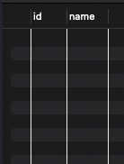

# 목차

<br>

- [목차](#목차)
- [들어가며](#들어가며)
- [데이터 세팅](#데이터-세팅)
- [IN](#in)
- [EXISTS](#exists)
- [NOT IN](#not-in)
- [NOT EXISTS](#not-exists)
- [마치며](#마치며)

<br>

# 들어가며
SQL 쿼리문을 작성하다보면 자연스레 `IN`이나 `NOT IN`을 많이 사용한다.

필자의 경우도 아무 생각없이 `NOT IN`을 사용했으며.. 원하지 않는 결과와 성능 저하를 경험했다..

이번 기회에 `IN`과 `NOT IN`은 어떻게 동작하며, 이와 비슷하게 많이 언급되는 `EXISTS`와 `NOT EXISTS`와도 비교해보고자한다.

> 본 글은 MySQL 8.0을 기준으로 작성되었습니다. 
> 
> 각 DBMS별로 쿼리를 실행하는 방식이 모두 다르므로, 참고하시기 바랍니다.

<br>

# 데이터 세팅
이론적으로 위 4가지를 비교하기보다는 실제 데이터를 세팅하여 학습 테스트를 병행하며 글을 작성하고자한다.

아무 데이터를 가지고 학습 테스트하면 재미없으니.. 필자가 `NOT IN`을 사용하게 된 예시와 비슷한 상황을 만들어보았다.

테이블은 아래와 같이 두 개를 만들어준다.

* 브랜드 (`brands`)
* 노출시 제외할 브랜드 (`excluded_brands`)

아래 쿼리를 실행하여 테이블을 만들어주면 된다.

> 필자는 도커로 MySQL을 띄우고 미리 아무 스키마를 만들어 아래와 같이 테이블을 구성하였다.

```sql
create table brands
(
    id   bigint       null,
    name varchar(255) null
);
create table excluded_brands
(
    id              bigint       null,
    forbidden_name varchar(255) null
);
```

그리고 아래와 같이 데이터를 넣어준다.

<p align="center"><br>브랜드 초기 데이터 세팅</p>

<p align="center"><br>제외할 브랜드 초기 데이터 세팅 </p>

이제 위 데이터를 사용하여 학습 테스트를 진행해본다.

<br>

# IN
가장 먼저 알아볼 명령어는 `IN`이다.

```sql
select *
    from brands
    where brands.name in (select forbidden_name from excluded_brands)
```
쿼리의 결과는 아래와 같다.

<p align="center"> </p>

간단히 설명하자면 제외할 브랜드 테이블에 존재하는 브랜드만을 SELECT하는 쿼리이다.

위 쿼리의 동작 원리를 알기위해 `EXPLAIN` 명령어로 실행해보면 아래와 같이 결과가 나온다.

<p align="center"> </p>

1. 가장 먼저 `excluded_brands`를 테이블 풀 스캔한다.
   * 서브쿼리를 먼저 실행하는 것을 알 수 있다.
   * 이때 hash join을 사용함으로써, `excluded_brands.forbidden_name`을 해시 테이블에 저장해두는듯 하다.
2. `brands` 테이플도 풀 스캔하며, `brands` 하나의 row를 가져오며 해당 row의 name이 앞서 가져온 IN 이하의 요소들에 포함되어 있는지 체크한다.
   * **먼저 가져온 서브쿼리(`excluded_brands`)를 `brands` 하나의 row씩 IN 이하의 요소들과 일치하는지 비교한다.**
   * 또한 임시 테이블을 사용한다.
   * 연산 비용
     * **hash join을 사용한다면, `brands의 row 개수`만큼의 연산이 발생한다. - 여기선 이 방식을 사용하는 듯 하다.**
     * 2중 for문을 사용한다면 `excluded_brands의 row 개수 * brands의 row 개수`만큼의 연산이 발생한다.

그리고 위 `IN` 연산을 간단히 풀어서 해석해보자면 아래와 같다.

```sql
select *
    from brands
    where brands.name = '나이키'
        or brands.name = '우아한형제들'
        or brands.name = '애플'
        or brands.name = '토스'
        or brands.name = '카카오'
        or brands.name = null
        or brands.name = '당근마켓'
```

<br>

<details>
  <summary>🤔 hash join이란?</summary>
  
  ---
  
  <p align="center"><br>출처: https://coding-factory.tistory.com/758 </p>

  **조인될 두 테이블 중 하나를 해시 테이블로 선정하여 조인될 테이블의 조인 키 값을 해시 알고리즘으로 비교하여 매치되는 결과값**을 얻는 join 방식중 하나이다.
  
  ---
</details>

<br>

<details>
  <summary>🤔 IN과 NULL</summary>
  
  ---

  `IN`절 안에 `NULL`이 존재하면 어떤 결과를 얻을까? 연산 과정을 보면 `OR`과 비슷하기에 추론할 수 있듯이, `NULL`이 존재해도 무시된다.

  즉, `IN`에서 비교하는 대상과 비교되는 대상 모두 `NULL`이 존재해도 해당 ROW는 무시된다.
  
  ---
</details>

<br>

# EXISTS
이번엔 `IN`과 비슷한 `EXISTS`에 대해서 알아본다.

우선 아래 쿼리를 실행해본다.

```sql
select *
    from brands
    where exists(select forbidden_name from excluded_brands);
```
결과는 다음과 같다.

<p align="center"> </p>

보시다싶이 `brands`에 존재하는 모든 데이터가 모두 SELECT되는 것을 알 수 있다.

이렇게 결과 나온 이유는 **`EXISTS`는 입력으로 주어진 서브쿼리에서 결과가 존재하는지만 확인한다.**

즉, **어떠한 `brands`이여도 서브쿼리(`select forbidden_title from excluded_brands`)의 결과는 항상 하나 이상 존재하기에 모두 `true`가되어 필터링되지 않는 것이다.**

`EXPLAIN`을 통해 실행계획을 살펴보면 아래와 같다.

<p align="center"> </p>

`IN`과 유사하게 hash join을 사용하며, 서브쿼리에서의 결과가 '존재하는지'확인한다.

`IN`절과 다른 점으론 임시 테이블을 만들지 않으며, Query Cost가 몇배는 줄어든 것을 알 수 있다.

<br>

<details>
  <summary>🤔 그렇다면 IN절과 동일한 효과를 얻을려면 어떻게 해야할까?</summary>
  
  ---
  
    ```sql
    select *
        from brands as b
        where exists(select forbidden_name from excluded_brands as ft where ft.forbidden_name = b.name);
    ```
    바로 위와 같이 서브쿼리에 `WHERE`을 주면 된다.

    <p align="center"> </p>

    결과를 보면 `IN`과 동일한 것을 알 수 있다.
  
  ---
</details>

<br>

# NOT IN
이번엔 `IN`의 반대인 `NOT IN`에 대해서 알아본다.

제외 브랜드 테이블에 속한 브랜드 이름을 제외한 브랜드만을 SELECT 하는 예시를 통해 살펴본다.

```sql
select *
	from brands
    where brands.name not in (select forbidden_name from excluded_brands);
```
결과는 예상과 다르게 빈 결과값을 반환하게 된다.

<p align="center"> </p>

이유가 무엇일까? 바로 `NOT IN`은 아래와 유사하게 동작하기 때문이다.

```sql
select *
from brands
where brands.name != '나이키'
        and brands.name != '우아한형제들'
        and brands.name != '애플'
        and brands.name != '토스'
        and brands.name != '카카오'
        and brands.name != null
        and brands.name != '당근마켓';
```
`NOT IN`은 `brands`에서 가져온 row 값이 서브쿼리 (`excluded_brands`)의 모든 요소와 일치하는지 안하는지를 체크한다.

그런데 **비교하는 과정에서 `brands.name`과 `NULL`의 비교연산이 진행되면서 항상 `UNKNOWN` 값을 반환하기에 `WHERE`절이 매번 `FALSE`가 되서 모든 row가 모두 `FALSE`가되어 나타나지 않는 것이다.**

<br>

🤔 **위 문제를 해결하는 방법은 서브쿼리의 결과에 `NULL`을 포함시키지 않는 것이다.**

```sql
select *
    from brands
    where brands.name not in (select forbidden_name from excluded_brands where forbidden_name is not null);
```

<p align="center"> </p>

제외 브랜드를 제외한 브랜드가 잘 SELECT 된 것을 볼 수 있다.

<br>

# NOT EXISTS

마지막으로 `NOT EXISTS`는 `EXISTS`를 이해했다면 쉽게 이해할 수 있다.

위에서 보았듯이 `NOT IN`이 비교하는 과정에서 `brands.name`과 `NULL`의 비교연산이 진행되면서 항상 `UNKNOWN` 값을 반환하기에 `WHERE`절이 매번 `FALSE`가 되서 모든 row가 모두 `FALSE`가 되어 나타나지 않았다.

<br>

🤔 **`NOT IN`과 동일한 효과를 얻고싶지만, `NULL`도 무시하고싶은 경우는 어떻게 해야할까?**

> 필자의 경우는 이 상황으로 인해 이 글을 작성하게 되었다 :)

결론적으론 `NOT EXISTS`를 사용하면 동일한 효과를 얻을 수 있다.

```sql
select *
    from brands
    where not exists(select forbidden_name from excluded_brands where excluded_brands.forbidden_name = brands.name)
```

<p align="center"> </p>

**결과를 보면 알겠지만, 제외될 브랜드를 제외하고 `NULL`도 무시하여 `SELECT`하는 것을 볼 수 있다.**

<br>

# 마치며
많은 분들이 `IN`, `NOT IN`, `EXISTS`, `NOT EXISTS`에 대한 차이점을 제대로 이해하지 못하고 사용한다.

적어도 필자는 그랬다.. 허허

중요한 것은 `NULL`처리와 연산을 하는 방법이다.

끝으로 이 글을 통해 4개 명령어의 차이점을 이해하는데 도움이 되었기를~~~
