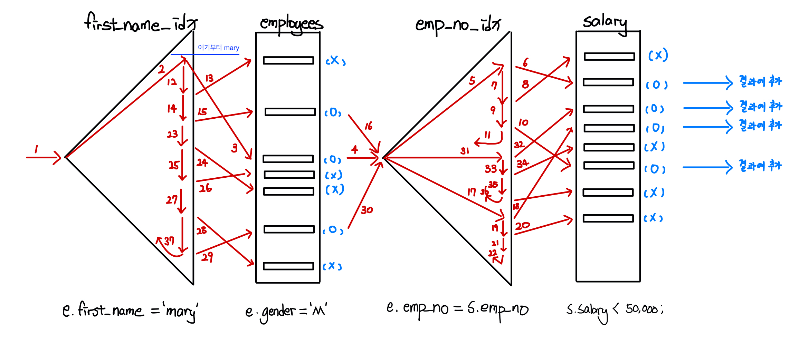

# 목차

<br>

- [목차](#목차)
- [들어가며](#들어가며)
- [JOIN 개념](#join-개념)
- [JOIN 종류](#join-종류)
  - [예시 데이터](#예시-데이터)
  - [OUTER JOIN](#outer-join)
    - [LEFT OUTER JOIN](#left-outer-join)
    - [RIGHT OUTER JOIN](#right-outer-join)
  - [INNER JOIN](#inner-join)
  - [FULL OUTER JOIN](#full-outer-join)
- [JOIN 연산 방법](#join-연산-방법)
  - [중첩 반복 조인](#중첩-반복-조인)
    - [동작 원리](#동작-원리)
    - [특징](#특징)
    - [성능 개선 포인트 - 중요](#성능-개선-포인트---중요)
  - [정렬 병합 조인](#정렬-병합-조인)
  - [해시 조인](#해시-조인)
- [마치며](#마치며)
- [참고](#참고)

<br>

# 들어가며
관계형 데이터베이스는 데이터의 중복을 제거하고 데이터 저장을 논리적으로 하기위해서 정규화를 통해 데이터를 저장한다.

쉽게 말해, 데이터를 쪼개 여러 테이블로 나눠서 저장한다.

이렇게 여러 테이블에 쪼개진 데이터을 통해 결과를 도출하려면, 여러 테이블을 조합할 필요가 있다.

컬럼 기준으로 여러 테이블의 행을 합쳐주는 연산이 바로 JOIN이다.

이번 글은 JOIN에 대해서 알아볼 예정이다.

우선 개념과 종류, 그리고 JOIN 연산 방법을 다루고, 마지막으로 JOIN 활용시 주의할 점에 대해서 다룬다.

> 본 글은 MySQL 5.7를 이용하여 작성된 글입니다.

<br>

# JOIN 개념

<br>

🤔 JOIN
* 한 데이터베이스 내의 여러 테이블의 레코드를 조합하여 하나의 열로 표현한 것이다.
  * 두 릴레이션으로부터 관련된 투플들을 결합하여 하나의 투플로 만드는 가장 데표적인 데이터 연결 방법
* JOIN은 2개의 테이블에서 각각의 공통값을 이용함으로써 필드를 조합하는 수단이 된다.
* SQL 명령문에 의해서 여러 테이블에 저장된 데이터를 한번에 조회할 수 있게 하는 DBMS의 기능
* 두 집합(테이블) 간의 곱으로 데이터를 연결하는 가장 대표적인 데이터 연결 방법

<br>

# JOIN 종류
> JOIN 사용하는 것과 동일한 결과를 내는 쿼리도 같이 작성하기
ANSI 표준 SQL는 4 가지 유형의 JOIN을 규정한다.
* INNER JOIN
* OUTER JOIN
* LEFT JOIN
* RIGHT JOIN

그리고 큰 그림을 그려보자면 아래와 같다.

<p align="center"><br>출처: https://imgur.com/gallery/8u7fc </p>

<details>
  <summary>본 글은 MySQL 5.7을 기준으로 작성된 글입니다. MySQL의 JOIN 큰 그림을 보려면 여길 눌러주세요.</summary>
  
  <p align="center"> </p>
</details>

이제 간단한 예시 데이터를 통해 JOIN을 알아본다.

> 아래 예시는 모두 JOIN을 이해하기 위한 간단한 예시이다.

<br>

## 예시 데이터
예시 데이터는 간단히 두 개의 테이블 (user, post)를 만들었다.

<br>

> user


> post


<br>

<br>

## OUTER JOIN
OUTER JOIN은 가장 많이 사용되는 JOIN중 하나이다.

<br>

### LEFT OUTER JOIN
> `SELECT * FROM post LEFT JOIN user ON post.user_id = user.id;`

<p align="center"> </p>

* 두 테이블 중 먼저 표기된 A 테이블의 데이터를 기준으로 JOIN 하는 B 테이블의 데이터를 결합하는 방식.
* 이때, B 테이블에 A 테이블과 같은 값이 없으면 NULL로 채워진다.

<details>
  <summary>실행 계획</summary>
  
  <p align="center"> </p>

  * post 테이블을 먼저 읽고, block nested loop를 통해 user 테이블을 결합한다.

  > 지금은 JOIN에 대한 개념을 익히기 위함이므로, 효율성을 따지는 인덱스등은 고려하지 않는다.
</details>

<br>

### RIGHT OUTER JOIN
> `SELECT * FROM post RIGHT JOIN user ON post.user_id = user.id;`

<p align="center"> </p> 

* 두 테이블 중 나중에 표기된 B 테이블의 데이터를 기준으로 B의 전체 데이터와 함께, A 테이블의 값을 가져온다.
* 이때, A 테이블에 B 테이블과 같은 값이 없으면 NULL로 채워진다.

<details>
  <summary>실행 계획</summary>
  
  <p align="center"> </p>

  * user 테이블을 먼저 읽고, block nested loop를 통해 post 테이블을 결합한다.

  > 지금은 JOIN에 대한 개념을 익히기 위함이므로, 효율성을 따지는 인덱스등은 고려하지 않는다.
</details>

<br>

## INNER JOIN
> `SELECT * FROM post INNER JOIN user ON post.user_id = user.id;`

<p align="center"> </p>

* 교집합. 두 테이블 사이에 중복되는 값만 선택되어 출력된다.
  * 두 테이블에 동일하게 존재하는 것만 출력된다.
* ON 대신 WHERE을 사용할 수 있다.

<br>

## FULL OUTER JOIN
> ```sql
> (SELECT * FROM post LEFT JOIN user ON post.user_id = user.id)
> UNION
> (SELECT * FROM post RIGHT JOIN user ON post.user_id = user.id)```

<p align="center"> </p>

* `FULL OUTER JOIN` 은 왼쪽과 오른쪽에 있는 행 모두를 합성해서 하나의 표를 만든다. (합집합)
  * `FULL OUTER JOIN` = `(LEFT JOIN) UNION (RIGHT JOIN)`

<br>

# JOIN 연산 방법
🤔 관계형 데이터베이스는 JOIN을 어떻게 연산하는 것일까?

개인적으로 너무 궁금해서 정리하게 되었다. 

<br>

💁‍♂️ JOIN은 아래와 같은 연산 방법이 존재한다.

|방법|설명|
|----|----|
|중첩 반복 조인<br>Nested Loop JOIN|선행 테이블 (드라이빙 테이블)의 처리 범위를 하나씩 액세스하면서 그 추출된 값으로 연결할 후행 테이블 (드리븐 테이블)을 조인하는 방식|
|색인된 중첩 반복 조인| - 후행 테이블 (드리븐 테이블)의 JOIN 속성에 인덱스가 존재할 경우 사용.<br>- 선행 테이블(드라이빙 테이블)의 각 레코드들에 대하여 후행 테이블 (드리븐 테이블)의 인덱스 접근 구조를 사용하여 직접 검색 후 조인하는 방식 |
|정렬 병합 조인<br>Sort Merge JOIN|양쪽 테이블의 처리 범위를 각자 액세스하여 정렬한 결과를 차례로 scan하면서 연결고리의 조건으로 merge해 가는 방식|
|해시 조인<br>Hash JOIN|해시(hash)함수를 사용하여 두 테이블의 자료를 결합하는 조인 방식|

<br>

❗️ 대부분의 JOIN은 중첩 반복 조인을 사용한다.

<br>

## 중첩 반복 조인
중첩 반복 조인은 조인 방법중 가장 보편적으로 많이 사용되는 조인 방법이다.

2개 이상의 테이블에서 하나의 집합을 기준으로 순차적으로 상대방 Row를 결합하여 원하는 결과를 추출한다.

<br>

### 동작 원리

두 개의 테이블을 중첩 반복 조인하는 로직을 일반적인 프로그래밍 언어로 바꾸면 아래와 같다.

```java

for (int i = 0; i < 100; i++) { // outer loop (driving table)
    // outer loop의 where 로직
    for (int j = 0; j < 100; j++) { // inner loop (driven table)
        // on 로직
    }
}
```
위 코드를 보면 알겠지만, 위와 같이 Driving 테이블과 Driven 테이블을 대상으로한 for문과 작동 원리가 비슷하다.

각 loop가 인덱스가 될 지, 실제 데이터를 풀 스캔할 지는 인덱스 설정에 따라 다르다.

인덱스 유무에 따른 중첩 조인을 예시를 통해 정리했다.

<br>

**Simple Nested-Loop Join**

<p align="center"> </p>

**Driving 테이블(외부 테이블)의 행 데이터를 반복하면서 Driven 테이블 (내부 테이블)의 모든 행 데이터와 하나씩 비교하여 결과를 얻는 방식이다.**

인덱스가 전혀 걸려있지 않는다면 위와 같이 동작하며, 굉장히 비효율적이다.

<br>

<br>

**Indexed Nested-Loop Join**

> [샘플 데이터](https://github.com/binghe819/TIL/blob/master/DB/MySQL/%EC%83%98%ED%94%8C%20%EB%8D%B0%EC%9D%B4%ED%84%B0/%EC%83%98%ED%94%8C%20%EB%8D%B0%EC%9D%B4%ED%84%B0.md)에서 `Employees 1 : N Salary` 관계에서의 쿼리 예시이다.

```sql
SELECT *
	FROM employees AS e
    LEFT JOIN salaries AS s ON e.emp_no = s.emp_no
    WHERE e.first_name = 'Mary' AND e.gender = 'M' AND s.salary < 50000;
```

<p align="center"> </p>

1. `employees.first_name` 인덱스를 이용하여 `first_name = mary`인 인덱스를 찾는다.
2. `employees.gender = M`값을 알기 위해, 각 인덱스마다 랜덤 I/O를 통해 Row에 액세스한다.
3. 만약 Row의 Gender가 M이면, `salary.emp_no`인덱스에서 `employees.emp_no = salary.emp_no`에 매칭되는 `salary` Row에 액세스한다.
4. 액세스한 Row의 `salary`가 50000보다 작으면, JOIN 결과에 해당 ROW를 추가한다.

**Driving 테이블(선행 테이블)의 처리 범위를 하나씩 액세스하면서 추출된 값으로 연결할 테이블을 조인한다고 보면 된다.**

**인덱싱이 걸려있는 테이블에서의 조인 방식이며, 가장 많이 사용되는 방식이다.**

> * 각 단계를 완료하고 나서 다음단계로 넘어가는게 아니라 한 **레코드씩 순차적으로 진행**한다.
> * 단, order by는 전체집합을 대상으로 정렬해야 하므로 **작업을 모두 완료한 후 다음 오퍼레이션을 진행**한다.

<br>

<br>

**Block Nested-Loop Join**

> Cache Block Nested Loop Join

<p align="center"> </p>

1. user 테이블로부터 읽어오면서 조인 버퍼가 가득 찰 때까지 채운다.
2. 조인 버퍼가 가득 채워지면, level 테이블을 스캔하면서 조인 버퍼에 있는 데이터와 매칭되는지 하나하나 체크하고, 매칭되면 조인 결과고 내보낸다.
3. 조인 퍼버 안의 모든 데이터를 비교하는 과정이 끝나면, 조인 버퍼를 비우고 다시 앞선 과정을 수행한다.
4. 이러한 과정을 user 테이블에서 조인 버퍼에 더이상 데이터를 채울 수 없는 시점까지 반복 수행한다.
   * 즉, user 테이블의 조건에 해당하는 데이터를 모두 처리할 때까지 반복 수행한다.

**필자의 경험상 인덱스가 걸려 있지 않은 컬럼에 대한 JOIN을 수행할 때, 옵티마이저가 Block Nested-Loop Join을 많이 사용한다.**

> 여기서 level 테이블을 스캔하는 횟수는 조인 버퍼에 데이터가 적재되는 횟수와 동일하다. (Simple 중첩 반복보다 효율적이다.)
> 
> 그리고 level 테이블에 접근할 땐 테이블 풀 스캔, 인덱스 풀 스캔, 인덱스 범위 스캔등을 사용한다.

<br>

### 특징
> 대부분의 특징은 가장 많이 사용되는 `Indexed Nested-Loop Join`방식을 가리킨다.

* **작은 범위의 데이터 조회**시 유리하다.
  * 인덱스에 의한 랜덤 I/O를 기반으로 하기 때문에 대량의 데이터 처리 시 적합하지 않다.
* **순차적으로 처리하며, 랜덤 I/O 위주로 동작한다.**
  * 선행 테이블의 결과를 통해 후행 테이블을 액세스 할 때 랜덤 I/O가 발생한다.
  * 물론 필요한 데이터가 인덱스에 있다면 데이터를 찾기위한 랜덤 I/O는 발생하지 않을 수도 있다.
* 후행 (Driven) 테이블에는 조인을 위한 인덱스가 생성되어 있어야 한다.

<br>

### 성능 개선 포인트 - 중요
동작원리에서도 볼 수 있듯이, Nested-Loop Join방식은 먼저 액세스하는 Driving 테이블(선행)의 조건을 만족하는 Row가 많을수록, 그만큼 반복해서 Driven 테이블(후행)에 접근해야 하므로 성능이 나빠진다.

**Nested-Loop Join은 Driving 테이블의 선택이 굉장히 중요하다.**

그러기에, **Driving 테이블을 WHERE 절등으로 데이터를 거를 수 있는 테이블이나 데이터의 양이 적은 테이블로 선정하는 것이 좋다.**

> **실행 속도 = 선행 테이블 사이즈 * 후행 테이블 접근 횟수**

**최종 목표는 Loop와 I/O의 개수를 줄이는 것이다.**

<br>

아래와 같이 정리해볼 수 있다.
* **Driving 테이블로는 데이터가 적거나 where절 조건으로 row의 숫자를 줄일 수 있는 테이블이어야 한다.**
* Driven 테이블에는 조인을 위한 적절한 인덱스가 생성되어 있어야 한다.
  * 적절한 인덱스가 없다면, 테이블 풀 스캔이 발생하므로 비효율적이다.
* Loop 개수를 줄이기 위해 조인에 참여하는 테이블 중 Row수가 적은 쪽을 Driving으로 설정하고, Driven 테이블에 인덱스를 걸어 최적화하면 된다.

<br>

## 정렬 병합 조인
> MySQL은 NL (Nested Loop Join)만을 지원한다.

<br>

🤔 언제 정렬 병합 조인이 사용되는가?
* 중첩 조인(NL)은 효과적으로 수행하려면, 조인 컬럼에 인덱스가 필요하다.
* 만약 적절한 인덱스가 없다면, Inner 테이블을 탐색할 때마다 반복적으로 Table Full Scan을 수행해야하므로 매우 비효율적이다.
* 이때 옵티마이저는 BNL, 정렬 병합 조인, 해시 조인을 고려한다.

<br>

🤔 정렬 병합 조인의 동작 원리

<p align="center"><br>출처: https://needjarvis.tistory.com/162</p>

* 두 테이블을 각각 액세스하여 정렬한 다음에 두 집합을 차례대로 스캔하여 머지하면서 조인을 수행한다.
  * 정렬 단계: 양쪽 집합을 조인 컬럼 기준으로 정렬한다.
  * 머지 단계: 정렬된 양쪽 집합을 서로 머지한다.
* Driving 테이블과 Driven 테이블을 Sort Area에 미리 정렬해 둔 자료구조를 이용한다는 점만 다를 뿐, 조인 작업은 NL 조인과 동일하다.

<br>

## 해시 조인
> MySQL은 NL (Nested Loop Join)만을 지원한다.

<br>

🤔 언제 해시 조인이 사용되는가?
* 소트머지조인과 NL 조인이 효과적이지 못한 상황의 대안으로 사용된다.
* 소트머지조인은 소트의 부하가 많이 발생하기 떄문에, 이를 보완하기 위한 방법으로 소트대신 해시를 이용하기 위해 사용된다.

<br>

🤔 해시 조인의 동작 원리

<p align="center"><br>출처: https://needjarvis.tistory.com/162</p>

* 해시 값을 이용하여 테이블을 조인하는 방식
  * 해시 함수는 직접적인 연결을 담당하지 않고, 연결될 대상을 특정 지역에 모아두는 역할을 담당한다.

<br>

# 마치며
JOIN을 그저 두 테이블을 연결하는 역할로만 알고 있었다.

DB 성능 튜닝과 관련된 내용을 더하니 이것저것 고민해볼 부분이 많은 것 같다!

특히 MySQL을 많이 사용하는 필자로선 NL을 조심해서 사용해야할 듯 하다.

<br>

* **Driving 테이블로는 데이터가 적거나 where절 조건으로 row의 숫자를 줄일 수 있는 테이블이어야 한다.**
* Driven 테이블에는 조인을 위한 적절한 인덱스가 생성되어 있어야 한다.
  * 적절한 인덱스가 없다면, 테이블 풀 스캔이 발생하므로 비효율적이다.
* **Loop 개수를 줄이기 위해 조인에 참여하는 테이블 중 Row수가 적은 쪽을 Driving으로 설정하고, Driven 테이블에 인덱스를 걸어 최적화하면 된다.**

<br>

# 참고
* https://ko.wikipedia.org/wiki/Join_(SQL)
* http://jidum.com/jidums/view.do?jidumId=167
* https://www.fatalerrors.org/a/join-optimization-for-mysql-optimization.html
* https://coding-factory.tistory.com/756
* http://wiki.gurubee.net/pages/viewpage.action?pageId=26743004

