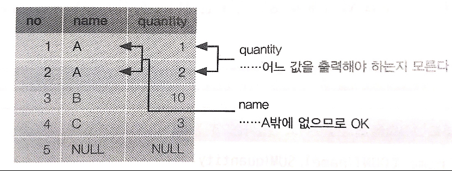

# 목차

- [목차](#목차)
- [SQL 정리](#sql-정리)
  - [데이터 베이스](#데이터-베이스)
    - [관계 대수](#관계-대수)
    - [클라이언트/서버 모델](#클라이언트서버-모델)
    - [자료형](#자료형)
  - [조회](#조회)
    - [SELECT](#select)
      - [데이터 가공하기](#데이터-가공하기)
      - [COUNT](#count)
      - [DISTINCT](#distinct)
    - [WHERE](#where)
      - [LIKE](#like)
      - [IN](#in)
      - [Between](#between)
      - [내부 처리 순서](#내부-처리-순서)
    - [ORDER BY](#order-by)
    - [LIMIT](#limit)
    - [OFFSET](#offset)
    - [GROUP BY](#group-by)
      - [그룹 함수](#그룹-함수)
      - [HAVING](#having)
    - [JOIN](#join)
      - [LEFT OUTER JOIN](#left-outer-join)
      - [INNER JOIN](#inner-join)
      - [FULL OUTER JOIN](#full-outer-join)
    - [CASE](#case)
  - [중첩 쿼리](#중첩-쿼리)
    - [스칼라 서브쿼리](#스칼라-서브쿼리)
    - [인라인뷰 서브쿼리](#인라인뷰-서브쿼리)
    - [서브 쿼리](#서브-쿼리)
  - [상관서브쿼리](#상관서브쿼리)
    - [EXISTS](#exists)
    - [IN](#in-1)
  - [삽입](#삽입)
  - [갱신](#갱신)
  - [삭제](#삭제)
    - [DELETE](#delete)
    - [물리삭제와 논리삭제](#물리삭제와-논리삭제)
  - [서브쿼리](#서브쿼리)
  - [테이블](#테이블)
    - [CREATE TABLE](#create-table)
    - [ALTER TABLE](#alter-table)
    - [DROP TABLE](#drop-table)
  - [기타](#기타)
    - [DESC](#desc)
    - [SQL문 실행순서 (중요)](#sql문-실행순서-중요)
- [참조](#참조)

<br>

# SQL 정리

🤔  SQL

* SQL (Structrued Query Language, 구조화 질의어)는 RDBMS의 데이터를 관리하기 위해 설계된 특수 목적의 프로그래밍 언어이다.

<br>

## 데이터 베이스

<br>

### 관계 대수

* **관계 대수라는 것에 착안하여 고안된 데이터베이스가 바로 관계형 데이터 베이스(이하 RDB)이다.**
* 관계 대수란?
  * RDB에서 원하는 정보와 그 정보를 검색하기 위해서 어떻게 유도하는 가를 기술하는 **절차적인 언어**.
  * **연산자와 연산규칙을 제공하는 언어로 피연산자가 릴레이션이고 결과도 릴레이션이다.**
  * **질의에 대한 해를 구하기 위해 수행해야 할 연산의 순서를 명시한다.**
  * 대표적으로 순수 관계 연산자와 일반 집합 연산자가 있다.
* 순수 관계 연산자
  * RDB에 적용할 수 있도록 특별히 개발한 관계 연산자
    * Select, Join, Devision...
* 일반 집합 연산자
  * 일반집합 연산자는 수학적 집합 이론에서 사용하는 연산자로서 릴레이션 연산에도 그대로 적용할 수 있다.
    * 합집합, 교집합, 차집합, 교차곱...

<br>

### 클라이언트/서버 모델

<p align="center"><br>출처 : https://www.ktexperts.com/clientserver-architecture-of-mysql/</p>

* 많은 RDBMS가 클라이언트/서버 모델을 사용중이다.

<br>

### 자료형
> [좋은 참고자료](https://prestodb.io/docs/current/language/types.html)

<br>

## 조회

> 조회 명령어

<br>

### SELECT

```sql
// User테이블에서 UserID, Name 열 데이터 조회
SELECT UserID, Name FROM USERS;
```

* 조회
  * **SELECT 구는 열을 선택할 때 사용한다.**

<br>

#### 데이터 가공하기
**사칙 연산**
```sql
# 우선순위가 다른 경우의 연산
# + 보다 * 의 우선순위가 높다. 우선순위가 같다면 왼쪽에서 오른쪽으로 계산한다.
SELECT 1 - 2 + 2 * 3;

# 나머지 값 반환하기
SELECT MOD(10, 3)

# 반올림하기
SELECT ROUND(30.60, 1)
```

<br>

**문자열 연산**
```sql
# 문자열 합치기
SELECT CONCAT('우아한', '형제들')  

# 문자열 자르기
SELECT SUBSTRING('20190422', 1, 4)
```

<br>

#### COUNT
SELECT문을 통한 결과의 행 개수를 구할때 사용된다.
```sql
# 행 개수 구하기
SELECT COUNT(*) FROM [테이블명]
```

> [COUNT에 NULL이 포함될까?](https://benant.wordpress.com/2010/07/25/sql%EC%97%90%EC%84%9C-count-%EA%B2%B0%EA%B3%BC%EC%97%90-null%EC%9D%B4-%ED%8F%AC%ED%95%A8%EB%90%A0%EA%B9%8C/)

<br>

#### DISTINCT

SELECT문을 통한 결과 (집합)을 다룰 때, 경우에 따라서는 **집합 안에 중복된 값을 없애고 싶을 때**가 있다.

```sql
// 이름의 중복을 제거하고 모든 이름 조회
SELECT DISTINCT NAME FROM USERS;

// 이름과 이메일에서 동시에 중복을 제거할 수 있는 행을 제거하고 조회
SELECT DISTINCT NAME, EMAIL FROM USERS;
```

* 중복 제거

  

  <center> 출처 : 모두의 SQL</center>

  * **SELECT 해온 전체 레코드 단위(모든 열)에 대해 중복값을 제거하고 출력**

* 사전 의미 : 뚜렷한, 분명한, 별개의

<br>

### WHERE

```sql
// 이름이 홍길동인 유저 조회
SELECT * FROM USERS WHERE Name = '홍길동'

// 나이가 20살인 유저의 이름과 이메일 조회
SELECT Name, Email FROM USERS WHERE Age = 20

// 나이가 20살이 아닌 유저의 이름과 이메일 조회
SELECT Name, Email FROM USERS WHERE Age <> 20

// USERID가 2이며 유저의 이름이 홍길서 이거나 나이가 23인 유저 조회
SELECT * FROM USERS WHERE UserID = 2 AND (NAME = '홍길서' OR Age = 23)

// USERID가 2이거나 유저의 이름이 홍길동이면서 나이가 20인 유저 조회
SELECT * FROM USER WHERE USERID = 2 OR ( NAME = '홍길동' AND AGE = 20)
```

* 조건문
  * **행을 선택할 때 사용한다.**
  * `filter`와 비슷한 역할
* NULL 값을 검색할 경우에는 `IS NULL`을 사용한다.
* AND는 OR에 비해 우선 순위가 높다.
  * 가능한 AND OR을 사용할때는 괄호를 사용하자.

| 명령어  | 설명                                             |
| ------- | ------------------------------------------------ |
| `=`     | Equal                                            |
| `>`     | Greater than                                     |
| `<`     | Less than                                        |
| `>=`    | Greater than or equal                            |
| `<=`    | Less than or Equal                               |
| `<>`    | Not Equal (`!=`)                                 |
| BETWEEN | Between a certain range                          |
| LIKE    | Search for a pattern                             |
| IN      | To specify multiple possible values for a column |

<br>

#### LIKE

```sql
// '홍'으로 시작하는 유저 조회
SELECT *  FROM USER WHERE NAME LIKE '홍%'

// '홍'이 들어가는 유저 조회
SELECT *  FROM USER WHERE NAME LIKE '%홍%'

// '동'으로 끝나는 유저 조회
SELECT *  FROM USER WHERE NAME LIKE '%동'
```

* 시작, 포함, 끝나는 단어 조회
  * 문자열 이스케이프 - 원하는 문자열 앞에 `\` 혹은 `'`'를 붙여주면 된다.
    * `%/%%`
    * `'It''s'`

<br>

#### IN

```sql
// 나이가 20, 23인 유저 조회
SELECT * FROM USER WHERE AGE IN(20,23)
```

* ~이거나

<br>

#### Between

```sql
// 나이가 20 ~ 23인 유저 조회
SELECT * FROM USER WHERE AGE BETWEEN 20 AND 23
```

* ~부터 ~까지

<br>

#### 내부 처리 순서


* WHERE 구 -> SELECT 구 -> ORDER BY 구
  * 대부분의 DB가 위 순서로 동작한다고 한다.
  * 그러므로, **SELECT에서 설정한 별명(AS)는 WHERE에서는 사용할 수 없다.**

<br>

### ORDER BY

```sql
// 나이를 기준으로 오름차순
SELECT * FROM USER ORDER BY AGE

// 나이를 기준으로 내림차순
SELECT * FROM USER ORDER BY AGE DESC;

// 이름을 기준으로 A~Z순으로 정렬
SELECT * FROM USER ORDER BY NAME

// 이름을 기준으로 Z~A순으로 정렬
SELECT * FROM USER ORDER BY NAME DESC

// 이름을 기준으로 A~Z순으로 정렬하고, 이름이 같은 경우 나이를 기준으로 내림차순
SELECT * FROM USER ORDER BY NAME ASC, AGE DESC
```

* ORDER BY 구로 정렬하고 싶은 열을 지정하면, 지정된 열의 값에 따라 행의 순서가 변경된다.
* ORDER BY는 복수의 열을 지정할 수 있다.
  * 지정한 열명의 순서에 따라, 값이 같아 순서를 결정할 수 없는 경우에 다음 지정된 열로 정렬을 한다.
* NULL 값의 정렬순서
  * NULL 값은 대소비교를 할 수 없다. 그러므로 가장 작은 값이나, 가장 큰 값으로 취급된다. (DB마다 다르다.)
  * MySQL에서는 오름차순에서는 가장 작은 값으로 취급하고, 내림차순에서는 가장 큰 값으로 취급한다.

<br>

### LIMIT

```sql
// 최대 3개 행을 결과로 받아온다.
SELECT * FROM USER LIMIT 3;
```

* LIMIT으로 결과의 최대 행수를 지정할 수 있다.

<br>

### OFFSET


* LIMIT과 OFFSET을 이용하여 페이징 처리를 할 수 있다.

<br>

### GROUP BY
> java stream api의 `groupingBy`와 유사하다.

```sql
SELECT 컬럼 FROM 테이블 GROUP BY 그룹화할 컬럼

// 이름을 기준으로 그룹화하여 조회
SELECT NAME FROM USERS GROUP BY NAME

// ORDER BY와 함께 할 경우
SELECT 컬럼 FROM 테이블 [WHERE 조건] GROUP BY 그룹화할 컬럼 [HAVING 조건] ORDER BY 컬럼1 [, 컬럼2, ..]
```

* **지정된 특정 컬럼의 같은 값을 가진 행을 그룹화 한다. (지정된 열의 값이 같은 행이 하나의 그룹으로 묶인다.)**
  
  * **컬럼을 그룹짓고(중복을 제거하고) 이에 대해 건수나 값의 합을 계산할 때 사용됨.**
  * `GROUP BY`로 지정한 열을 '집약 키'나 '그룹화 키'라고 부른다.
  * **DISTINCT와 같은 효과를 볼 수 있다.**
    * 단, `GROUP BY`는 집계함수와 사용될 때 사용된다.
  
* `SELECT` 절에 그룹 함수와 컬럼명이 같이 기술된 경우 해당 컬럼은 반드시 `GROUP BY` 절에 그룹화 돼야 한다.

* `GROUP BY`의 원리
<p align="center"><br>출처 : 모두의 sql </p>

  * 내부적으로 임시 테이블을 만든다.
  * **임시 테이블의 컬럼은 `GROUP BY`에 사용된 컬럼과 `SELECT`에서 사용된 집합함수가 된다.**

* **GROUP BY로 지정한 열 이외의 열을 집계함수를 사용하지 않은 채 SELECT 구에 기술하면 안된다.**
  * 그 이유는 GROUP BY로 그룹화하면 클라이언트로 반환되는 결과는 그룹당 하나의 행이 된다. 하지만 GROUP BY로 지정되지 않은 열은 하나 이상의 값을 가지므로 어떤 값을 출력해야할지 모른다.
  * GROUP BY 열1, 열2를 통해 그룹화해야지만 SELECT 열1, 열2를 할 수 있다.

```sql
// no, quantity가 GROUP BY에 지정하지 않았으므로 에러가 발생한다.
SELECT no, name, quantity FROM USERS GROUP BY name;
```

<p align="center"><br>출처 : 모두의 sql</p>

<br>

#### 그룹 함수

> `GROUP BY`는 보통 그룹함수(집계함수)와 많이 사용된다.

| 함수명   | 기능                     | 예시           |
| -------- | ------------------------ | -------------- |
| COUNT    | 행의 수를 계산           | COUNT(컬럼)    |
| MAX      | 값들 중에 최대 값을 반환 | MAX(컬럼)      |
| MIN      | 값들 중에 최소 값을 반환 | MIN(컬럼)      |
| AVG      | 평균 값을 계산           | AVG(컬럼)      |
| SUM      | 총 합계를 계산           | SUM(컬럼)      |
| VARIANCE | 분산을 계산              | VARIANCE(컬럼) |
| STDDEV   | 표준편차를 계산          | STDDEV(컬럼)   |

* 반드시 하나의 값만을 반환한다.
* `GROUP BY` 설정 없이 일반 컬럼과 기술될 수 없다.

```sql
// 각 이름의 개수 조회
SELECT COUNT(NAME), NAME FROM USERS GROUP BY NAME
```

그룹함수는 보통 집계함수라고도 많이 불린다. 

집계함수의 특징은 복수의 값(집합)에서 하나의 값을 계산해내는 것이다.

<p align="center"><br>출처 : 모두의 sql</p>

이렇게 집합으로부터 하나의 값을 계산하는 것을 "집계"라고 한다.

```sql
// COUNT만 *을 인수로 받고 나머지는 모두 열명을 입력으로 받는다.
SELECT COUNT(*) FROM USERS WHERE name = 'A'

```

* **집계함수의 NULL처리**

  * 집계함수는 입력으로 받은 열(집합)에 NULL이 있다면 이를 제외하고 처리한다.

* DISTINCT와 집계 함수

  * ```sql
    // 집계함수와 DISTINCT를 사용하려면 아래와 같이 사용해야한다.
    SELECT COUNT(DISTINCT name) FROM USERS;
    ```

<br>

#### HAVING

```text
SQL의 내부처리 순서는 다음과 같다.
WHERE구 -> GROUP BY구 -> HAVING구 -> SELECT구 -> ORDER BY구
```

**WHERE구가 그룹화를 통해 집합을 만들기 전에 실행되므로 GROUP BY는 WHERE구와 같이 사용될 수 없다.**

그렇다면 집계한 결과에서 조건에 맞는 값을 따로 걸러내는 방법은 무엇일까?? -> HAVING이다.

```sql
// 이름을 기준으로 그룹화하고 나이가 25인 유저 조회
SELECT NAME, AGE FROM USER GROUP BY NAME HAVING AGE = 25
```

* 특정 컬럼을 그룹화한 결과에 조건을 부여할 수 있다.
* 즉, HAVING을 사용하면 집계함수를 사용해서 조건식을 지정할 수 있다.


> `WHERE`과 `HAVING`의 차이
>
> * **`WHERE`은 그룹화(집합) 하기 전, `HAVING`은 그룹화(집합) 후에 조건.**
>
>   * 조건 처리 후에 컬럼 그룹화
>
>   * ```sql
>     SELECT 컬럼 FROM 테이블 WHERE 조건식 GROUP BY 그룹화할 컬럼
>     ```
>
>   * 컬럼 그룹화 후에 조건 처리
>
>   * ```sql
>     SELECT 컬럼 FROM 테이블 GROUP BY 그룹화할 컬럼 HAVING 조건식.
>     ```

<br>

### JOIN

```sql
// 내부 결합
SELECT 선택하고 싶은 열 리스트 FROM 첫 번째 테이블명 INNER JOIN 두 번째 테이블명 ON 결합 조건

// 외부 결합
SELECT 선택하고 싶은 열 리스트 FROM 첫 번째 테이블 명 LEFT OUTER JOIN 두 번째 테이블명 ON 결합 조건
```

* **결합을 사용하는 이유**
  * 매 테이블은 한 가지의 테마만을 가짐으로써 테이블을 분리시킨다.
  * 분리시킨 테이블은 기본키와 외래키를 사용하여 결합함으로써 분리시킨 테이블을 결합시켜 조회할 수 있다.

* **내부 결합**

  * `ON`이 지정한 결합 조건에 일치하는 행만을 2개의 테이블로부터 가져올 수 있다.

* **외부 결합**

  * 한 쪽 테이블을 기준으로 전체 행을 표시하고 다른 테이블은 값이 있으면 표시하고 없을 경우 NULL로 표시

<br>

:point_right: 예시

<p align="center"> </p>

<br>

#### LEFT OUTER JOIN

<p align="center"><br>출처 : https://sql-joins.leopard.in.ua/</p>

```sql
SELECT * FROM article LEFT JOIN USER ON article.user = USER.uid
```

<p align="center"> </p>

* `USER`에 만약 `article` 에서 `user` 와 동일한 키가 없다면 그냥 `NULL` 을 출력한다.
  * 왼쪽 테이블 (`article`)에는 값이 있는데 오른쪽 테이블 (`USER`)에는 대응되는 값이 없다.

<p align="center"> </p>

<br>

#### INNER JOIN

<p align="center"><br> 출처 : https://sql-joins.leopard.in.ua/</p>

<p align="center"> </p>

* `INNER JOIN` 은 두 테이블에 동일하게 존재하는 것만 출력된다. (교집합)

<br>

#### FULL OUTER JOIN

<p align="center"><br>출처 : https://sql-joins.leopard.in.ua/ </p>

<p align="center"> </p>

* `FULL JOIN` 은 왼쪽과 오른쪽에 있는 행 모두를 합성해서 하나의 표를 만든다. (합집합)
  * `FULL JOIN` =  `LEFT JOIN` UNION `RIGHT JOIN`

> 전혀 사용되지는 않지만.. JOIN의 원리를 이해하는데 도움이 되는 것 같다.

<br>

### CASE

```sql
CASE WHEN 조건식1 THEN 식1
	[WHEN 조건식2 THEN 식2 ...]
	[ELSE 식3]
END

-- 예시
SELECT a AS '코드',
CASE
	WHEN a = 1 THEN '여자'
	WHEN a = 2 THEN '남자'
	ELSE '미지정'
END AS "성별" FROM USER;
```

* 임의의 조건에 따라 독자적으로 변환 처리를 지정해 데이터를 변환하고 싶을때 CASE 문을 이용할 수 있다.
* CASE 문의 ELSE를 생략하면 자동적으로 ELSE NULL로 된다. 문제가 생길 여지가 많기 때문에 ELSE도 항상 같이 사용하는 편이 좋다.

<br>

## 중첩 쿼리
* 쿼리를 실행한 결과 데이터는 릴레이션으로 표현된다.
* 따라서 쿼리를 조합해 조금 더 복잡한 술어를 표현할 수 있다.

```sql
# sample 데이터 중 a 열의 최솟값은 아래와 같이 검색할 수 있다.
SELECT MIN(a) FROM sample;

# 최솟값을 가지는 행은 아래와 같이 삭제할 수 있다.
DELETE FROM sample WHERE a = (SELECT MIN(a) FROM sample);
```

<br>

### 스칼라 서브쿼리
* 스칼라 서브쿼리: `SELECT` 절에 추가로 쿼리를 사용하는 것.
  * **스칼라 값이란: `SELECT` 명령의 결과가 하나의 값을 의미**

```sql
SELECT (SELECT COUNT(*) FROM [Customers] WHERE Country = 'Germany') AS GermanyCount,
       (SELECT COUNT(*) FROM [Customers] WHERE Country = 'Mexico') AS MexicoCount
```

<br>

### 인라인뷰 서브쿼리
* 인라인뷰 서브쿼리: `FROM` 절에서 테이블들이 있는 위치 괄호 안에 작성하는 것

```sql
SELECT * FROM (SELECT FirstName, LastName FROM [Employees] WHERE EmployeeID < 10) 
```

<br>

### 서브 쿼리
* 서브 쿼리: `WHERE` 절에 추가로 쿼리를 사용하는 것

```sql
SELECT * FROM [OrderDetails] WHERE Quantity = (SELECT MAX(Quantity) FROM [OrderDetails])
```

<br>

## 상관서브쿼리
* 서브쿼리와 부모쿼리가 서로 연관된 경우, 두 테이블에 걸쳐 조작할 수 있다.

<br>

### EXISTS
```sql
DELETE FROM [Customers] WHERE EXISTS (SELECT * FROM [Orders] WHERE OrderDate >= "1996-07-08")
```

<br>

### IN
```sql
SELECT * FROM [Customers] WHERE Country IN ('Germany', 'UK')
```
* **스칼라 값끼리 비교할 때는 `=` 연산자를 사용하지만, 집합을 비교할 때는 사용할 수 없다.**
* **`IN`을 활용하면 집합 안에 값이 존재하는 지 확인할 수 있다.**

<br>

## 삽입

```sql
INSERT INTO 테이블명(열1[, 열2, 열3, ...]) VALUES (값1[, 값2, 값3 ...])

// 데이터 삽입
INSERT INTO USERS( USERID , EMAIL , NAME , AGE ) VALUES (3, 'test1@naver.com', '홍길서', 25);
INSERT INTO USERS VALUES (4, 'test2@naver.com', '홍길동', 24)
```

<br>

## 갱신

```sql
UPDATE 테이블명 SET 열명 = 값 WHERE 조건

// UserID가 2인 유저의 이름을 김길동으로 갱신 (열 갱신)
UPDATE USERS SET Name = '김길동' WHERE UserID = 2

// UserID가 2인 유저의 이름을 김길동으로 나이를 24로 갱신 (복수 열 갱신)
UPDATE USERS SET Name = '김길동', AGE = 24 WHERE UserID = 2

// 테이블의 모든 셀 갱신 (NO를 하나씩 올리기)
UPDATE USERS SET NO = NO+1;
```

* SELECT, DELETE와 다르게 행이 아닌 셀 단위로 갱신할 수 있다.
* MySQL에서의 SET 실행 순서
  * 만약 복수열일 갱신한다면 SET을 하는 실행 순서는 어떻게 될까?
  * MySQL의 경우에는, 순서대로 실행된다고 한다.
  * `... SET a = 1, b = 2...`라면 a가 먼저 실행되고 그 다음에 b가 실행된다.

<br>

## 삭제

<br>

### DELETE

```sql
// 테이블의 모든 행 지우기
DELETE FROM 테이블 명

DELETE FROM 테이블명 WHERE 조건

// UserID가 2인 유저 삭제
DELETE FROM USERS WHERE UserID = 2
```

* 행 단위로 삭제한다.
* SELECT 문과 같이 WHERE 문을 사용해서 원하는 행을 지울 수 있다.

<br>

### 물리삭제와 논리삭제

<p align="center"><br>출처 : SQL 첫걸음</p>

데이터를 삭제하는 데에는 두 가지의 사고 방식이 있다.

* 물리 삭제 : DELETE문을 사용해 직접 데이터를 삭제하는 방식
  * 장점 : DB 사용량이 증가하며, 조회할 때도 데이터 양이 적어지므로 좋다.
  * 단점 : 데이터를 석유다.. 날리지 말자.
  * 예시 : 사용자 개인정보
* 논리 삭제 : UPDATE문을 사용해 삭제 플래그를 변경하는 방식
  * 장점 : 데이터를 삭제하지 않기 때문에 삭제되기 전의 상태로 간단히 돌릴 수 있다. 또한 데이터 분석에도 좋다.
  * 단점 : DB 사용량이 계속해서 증가한다.
  * 예시 : 주문정보

<br>

## 서브쿼리

<br>

## 테이블

<br>

### CREATE TABLE
> [좋은 참고자료](https://www.techonthenet.com/sql/tables/create_table.php)
```sql
CREATE TABLE 테이블명(
  컬럼명 타입(크기) NOT NULL auto_increment, // NULL값이 들어갈 수 없음
  컬럼명 타입 NULL DEFAULT(값), // NULL값 허용, 초기값 설정
	PRIMARY KEY (컬럼명) // PK 설정
  FOREIGN KEY (컬럼명) REFERENCES 테이블(컬럼명) // 외래키 설정
)

// 예시
CREATE TABLE User (
UserID INTEGER,
Email VARCHAR(255),
Name VARCHAR(255),
PRIMARY KEY (UserID)
);
```

* `PRIMARY KEY` : 기본키 정의
* `UNIQUE KEY` : 고유키 정의
* `NOT NULL` : `NULL` 값의 입력을 금지
* `CHECK` : 입력할 수 있는 값의 범위를 제한. `boolean`로 평가할 수 있는 논리식을 설정
* `FOREIGN KEY` : 외래키

<br>

> 주니어 개발자가 테이블을 생성할 일이 있을까?
> * 집계를 위해 여러 테이블의 데이터를 다룰 경우, 쿼리가 복잡해지고 속도가 떨어질 수 있다.
> * 큰 테이블에서 필요한 일부 데이터만 가져와서 임시테이블을 작성한다.
> * 그리고 이 데이터들로 집계할 경우 성능을 개선할 수 있다.
> * 물론 View 등을 사용하여 쿼리의 복잡성을 줄일 수 있지만, View를 중첩할 경우 성능 저하를 유발한다.

> 조회 결과로 테이블 생성하기
> ```sql
> CREATE TABLE [생성할 테이블명]
>  AS (SELECT * FROM [기존 테이블명]);
> ```

<br>

### ALTER TABLE
> [좋은 참고자료](https://www.techonthenet.com/sql/tables/alter_table.php)
```sql
// 칼럼 추가
ALTER TABLE 테이블명 ADD 컬럼명 컬럼 속성

// 컬럼 수정
ALTER TABLE 테이블명 ALTER 컬럼명 컬럼 속성

// 컬럼 삭제
ALTER TABLE 테이블명 DROP COLUMN 칼럼명
```

<br>

### DROP TABLE
> [좋은 참고자료](https://www.techonthenet.com/sql/tables/drop_table.php)
```sql
DROP TABLE 테이블명
```

<br>

##  기타

<br>

### DESC

```sql
DESC 테이블명;
```

* 테이블에 어떤 열이 정의되어 있는지 알 수 있다.
  * SQL 명령어는 아니다.

<br>

### SQL문 실행순서 (중요)
```sql
5) SELECT city AS 도시, COUNT(city) AS 집계
1) FROM user
2)   WHERE user.age >= 18
3)    GROUP BY city
4)      HAVING city >= 'b'
6)        ORDER BY city
 
1. FROM에서 데이터 집합을 만든다.
2. WHERE는 FROM에서 만든 데이터 집합을 조건에 맞게 걸러낸다.
3. GROUP BY는 WHERE에서 필터링한 (조건에 맞는 데이터를 걸러낸) 데이터를 그룹화한다.
4. HAVING은 GROUP BY에서 집계한 데이터 집합을 다시 조건에 맞게 필터링한다.
5. SELECT는 그룹화하고 필터링한 데이터 집합을 집계한다.
6. ORDER BY는 집계한 데이터 집합을 정렬한다.
```

# 참조
* https://coding-factory.tistory.com/80?category=772898
* https://keep-cool.tistory.com/37
* [모두의 sql](https://thebook.io/006977/)
* [생활코딩 - SQL JOIN](https://opentutorials.org/course/3884)
* 우테코 레벨1 SQL 자료


