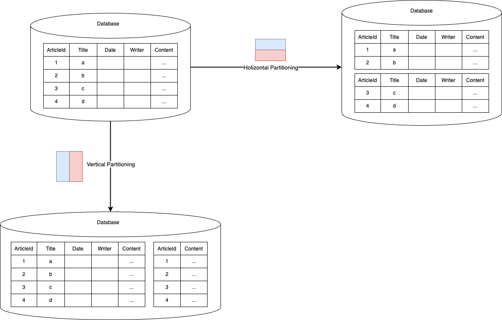
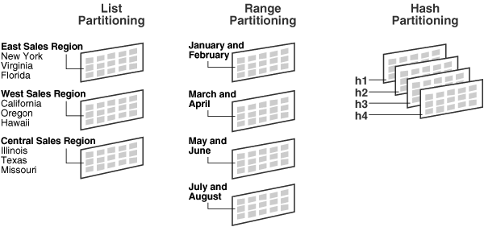
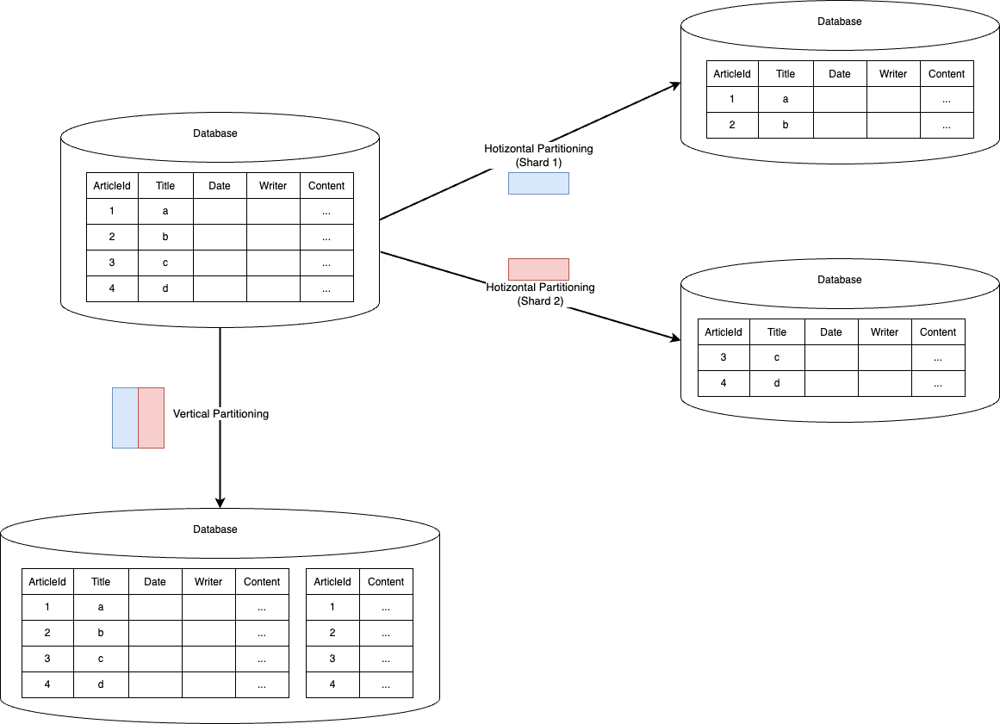

# 목차

<br>

- [목차](#목차)
- [파티셔닝과 샤딩](#파티셔닝과-샤딩)
- [1 파티셔닝](#1-파티셔닝)
- [2 샤딩](#2-샤딩)
- [3 분할시 고려할 점](#3-분할시-고려할-점)
- [참고](#참고)

<br>

# 파티셔닝과 샤딩

서비스가 점차 커짐에 따라 사용되는 모든 데이터를 한 테이블 혹은 한 대의 데이터베이스 서버에 관리하기는 점차 어려워진다.

데이터의 사이즈가 커짐에 따라 데이터베이스의 쓰기와 읽기 성능이 감소함으로써 해당 데이터베이스 서버가 병목 지점이 되기 때문이다.

따라서 서비스 크기에 따라 데이터베이스와 테이블을 분리할 필요가있는데, 이렇게 분리하는 방법을 크게 파티셔닝 (Partitioning)과 샤딩 (Sharding)이라고 한다.

이 두 분리하는 방법은 모두 거대한 데이터셋을 서브셋으로 분리하여 관리한다.

이번 글은 이 두 방법에 대해서 정리해보고자한다. 그리고 각 방법 별로의 장점과 주의할 점에 대해서도 간략히 알아본다.

<br>

# 1 파티셔닝

<br>

💁‍♂️ **파티셔닝 개념**

```text
데이터베이스 분할(Partitioning) 또는 파티셔닝은 데이터베이스를 여러 부분으로 분할하는 것이다. 

데이터베이스 분할은 중요한 튜닝기법으로 데이터가 너무 커져서, 조회하는 시간이 길어질 때 또는 관리 용이성, 성능, 가용성 등의 향상을 이유로 행해지는 것이 일반적이다. 

분할된 각 부분을 ‘파티션’이라고 부른다.

- 위키백과 -
```

위키백과에도 잘 정의되어있듯이, **파티셔닝은 큰 테이블을 여러 개의 테이블로 분할하는 작업을 의미한다.**

이때 **중요한 점은 논리적으론 하나의 테이블이지만, 물리적으론 여러 대의 테이블로 분리하는 작업이라는 것이다.**

그리고 **이렇게 분할하는 가장 큰 이유는 쓰기와 읽기의 성능을 개선하기 위함이다.**

<br>

💁‍♂️ **Vertical vs Horizontal**

파티셔닝은 크게 Vertical (수직)과 Horicontal (수평)으로 나뉜다.

<p align="center"> </p>

<br>

* Vertical Partitioning
  * Column을 기준으로 Table을 분할하는 방식.
* Horizontal Partitioning
  * Row를 기준으로 Table을 분할하는 방식.

<br>

💁‍♂️ **각각의 파티셔닝은 언제 사용되는가?**

* Vertical Partitioning
  * 정규화.
    * 정규화는 기본적으로 DB에 중복된 데이터가 저장되는 것을 방지하기 위함이다. 정규화를 하다보면 자연스레 Vertical Partitioning이 된다. 즉, 정규화도 일종의 Partitioning.
  * SELECT 해야하는 컬럼외 다른 컬럼의 크기가 큰 경우.
    * 만약 게시물 테이블에서 Title, Writer, Date만 SELECT 해야하는 경우, DB는 Content라는 큰 데이터를 가진 컬럼까지 모두 가져오고나서 SELECT문의 컬럼만 필터링한다. 매번 불필요한 Content를 위해 디스크 I/O와 메모리의 낭비가 발생하므로, 이경우 Content 컬럼만 분할할 수 있다.
* Horizontal Partitioning
  * 인덱스가 커지면 커질수록 SELECT은 말할 것도 없고, INSERT나 UPDATE, DELETE 작업도 함께 느려지는 단점이 있다. 
  * 이렇게 하나의 테이블이 너무 커서 인덱스의 크기가 커질 때의 성능 저하를 막기위함.

> Vertical보단 Horizontal (수평) 파티셔닝이 더 대중적으로 많이 사용된다. 
> 
> 그러므로 아래 내용부터는 Horizontal (수평) 파티셔닝에 대해서 더 자세히 다뤄본다.

<br>

💁‍♂️ **일반 DBMS에서 제공하는 Horizontal 파티셔닝 종류**

Oracle와 MySQL 공식문서에서 지원하는 4가지 방식은 아래와 같다.

<p align="center"><br>출처: https://docs.oracle.com/cd/B12037_01/server.101/b10743/partconc.htm</p>

* Range Partitioning (범위 분할)
  * 분할 키 값이 범위 내에 있는지 여부로 분할한다. ex. 날짜를 기반으로 분할
  * 아래와 같은 성격을 지닌 테이블에 사용하기 좋다.
    * 날짜를 기반으로 데이터가 누적되고 월, 또는 일 단위로 분석하고 삭제해야할 때.
    * 범위 기반으로 데이터를 여러 파티션에 균등하게 나눌 수 있을 때.
    * 파티션 키 위주로 검색이 자주 실행될 때.
* List Partitioning (목록 분할)
  * 값 목록에 파티션을 할당 분할 키 값을 그 목록에 비추어 파티션을 선택 및 분할.
  * ex. Country 라는 컬럼의 값이 Iceland , Norway , Sweden , Finland , Denmark 중 하나에 있는 행을 빼낼 때 북유럽 국가 파티션을 구축 할 수 있다.
* Hash Partitioing (해시 분할)
  * 해시 함수의 값에 따라 파티션에 포함할지 여부를 결정.
  * ex. 4개의 파티션으로 분할하는 경우 해시 함수는 0-3의 정수를 돌려준다.
* Composite Partitioning (합성 분할)
  * 상기 기술을 결합해서 분할하는 방식.
  * ex. 예를 들면 먼저 범위 분할하고, 다음에 해시 분할 같은 것을 생각할 수 있다.

<br>

# 2 샤딩

<br>

💁‍♂️ **샤딩은 Horizontal (수평) 파티셔닝의 일종이다.**

<p align="center"> </p>

<br>

하나의 DB에서 수평 파티셔닝으로 Row를 기준으로 테이블을 나눈 경우, 인덱스의 크기가 줄어 성능적인 향상을 가져온다.

하지만, 여전히 하나의 DB 서버에 트래픽이 몰렸을 때 해당 서버는 SPOF (Single Point Of Failure, 단일 장애점)이 되며, 쓰기 작업도 병렬적으로 하기 어렵다.

그리하여 **수평 파티셔닝처럼 동작하지만, 각 파티션이 독립된 DB 서버에 저장되는 방식으로 샤딩이란 개념이 등장했다.**

> 샤딩과 수평 파티셔닝의 차이점
> * 수평 파티셔닝은 보통 모든 데이터를 한 대의 서버에 저장하는 것을 의미한다.
> * 샤딩은 수평 파티셔닝의 일종으로 다른점이라면 분배한 데이터를 서로 다른 컴퓨터에 분산한다.

<br>

💁‍♂️ **샤딩 개념**

```text
데이터베이스 샤드(database shard)는 데이터베이스나 웹 검색 엔진의 데이터의 수평 분할이다. 

개개의 파티션은 샤드(shard) 또는 데이터베이스 샤드(database shard)로 부른다. 

각 샤드는 개개의 데이터베이스 서버 인스턴스에서 부하 분산을 위해 보유하고 있다.

- 위키 백과 - 
```

위키 백과에도 잘 정의되었듯이, **샤딩은 동일한 스키마를 가지고 여러 대의 데이터베이스 서버들에 데이터를 작은 단위로 나누어 분산 저장하는 방법이다.**

이때 **각각의 작은 단위를 샤드 (Shard)라 부른다.**

**샤딩은 물리적으로 서로 다른 서버에 데이터를 저장함으로써, 쿼리 성능 향상과 더불어 쓰기와 읽기의 부하가 모두 분산되는 효과가 있다.**

특히 **쓰기의 부하를 분산할 수 있는 점으로인해 샤딩을 하는 경우가 많다.**

<br>

💁‍♂️ **샤딩 구현 방식**

샤딩은 물리적으로 분산된 환경에서 사용되는 기법이므로 다양한 차원에서의 구현 방식이 존재한다.

* 애플리케이션
  * 애플리케이션 서버에서 직접 키를 기준으로 쓰기/읽기 대상의 Shard를 찾아 처리하는 형태.
  * ex. Hibernate Shards, 직접 구현등등
* 미들 티어
  * 애플리케이션과 데이터베이스 사이에 미들 티어를 두고 처리하는 형태.
  * ex. CUBRID SHARD, Spock Proxy, Gizzard등등
* 데이터베이스
  * 데이터베이스 자체에서 샤딩을 제공하는 형태.
  * ex. MongoDB, nStore등등.

<br>

💁‍♂️ **샤딩 종류**

샤딩의 종류는 다양하다. 이번 글에선 자주 사용되는 두 개만을 알아본다.

* Range Sharding
  * PK 값을 범위로 지정하여 Shard를 지정하는 방식.
* Hash Sharding (Modular Sharding)
  * PK값의 모듈러 연산 결과 (% 연산)를 통해 Shard를 지정하는 방식.

<br>

# 3 분할시 고려할 점

<br>

💁‍♂️ **데이터 재분배** (Rebalancing)

각 Shard의 물리적인 용량 한계나 성능 한계에 따라 Shard의 수를 Scale-Out하거나 Scale-Up 작업이 필요할 수 있다.

처음부터 서비스 정지 없이 작업할 수 있도록 설계 방향을 잡는 것이 중요하다.

> 샤드마다 트랜잭션의 빈도, 노드의 수, 밸리데이터의 비율 등에서 차이가 나기 때문에 한 번 샤드가 정해진 다음에도, 샤드의 구성원을 재배치하여 샤드간 균형을 맞추는 알고리즘이 필요하다.

<br>

💁‍♂️ **데이터 조인** (Joining Data From Multiple Shards)

Shard간에 Join이 불가능하다. 그러므로 처음부터 역정규화를 어느정도 감수해야한다.

Shard 목적 자체가 대용량 데이터 처리이므로, 대용량 처리시 성능을 위한 데이터 중복은 트레이드오프이므로, 데이터 스키마 설계시 주의해야한다.

<br>

💁‍♂️ **샤드에 데이터 파티션하는 방식**

샤드에 데이터 파티션하는 방식 (알고리즘)을 잘 선택해야한다.

자칫 잘못하다 특정 Shard에만 요청이몰려 성능적 향상이 전혀 없을 수 있다.

알고리즘도 중요하지만, 샤드키를 어떻게 설정하느냐도 중요하다. (Shard Key Selection)

<br>

💁‍♂️ **데이터 일관성** (트랜잭션)

샤딩된 데이터베이스는 확장성을 위해 강력한 일관성을 포기하는 경우가 많다. 

Eventual Consistency을 구현하거나 분산 트랜잭션과 같은 기술을 사용해야 할 수도 있다.

<br>

💁‍♂️ **데이터 밸런싱**

Shard 전반에 걸쳐 데이터 분포도를 모니터링하고 관리하여 일부 Shard의 로드가 과도하지 않도록 해야한다.

다른 Shard의 활용도가 낮은 데이터 핫스팟을 방지할 수 있게 설계해야한다.

<br>

# 참고
* https://ko.wikipedia.org/wiki/데이터베이스_분할
* https://ko.wikipedia.org/wiki/샤드_(데이터베이스_아키텍처)
* http://www.ibm.com/developerworks/kr/library/j-javadev2-11/
* https://blog.bytebytego.com/p/vertical-partitioning-vs-horizontal
