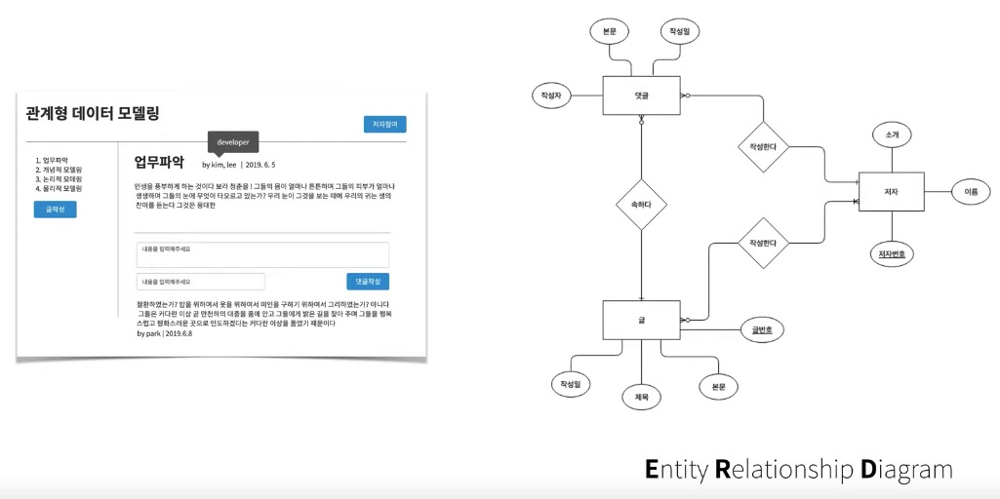

[생활 코딩 - 관계형 데이터 모델링](https://opentutorials.org/course/3883)과 [여러 사이트](#참고)의 자료를 정리한 자료입니다.

# 목차

- [DB 데이터 모델링](#db-데이터-모델링)
  * [데이터 모델링 순서](#데이터-모델링-순서)
  * [1 요구사항 분석](#1-요구사항-분석)
  * [2 개념적 설계](#2-개념적-설계)
    + [2-1 용어 정리](#2-1-용어-정리)
    + [2-2 관계 표기법](#2-2-관계-표기법)
      - [2-2-1 Cardinality](#2-2-1-cardinality)
    + [2-2-2 Optionality](#2-2-2-optionality)
    + [2-3 ERD 정의](#2-3-erd-정의)
  * [3 논리적 설계](#3-논리적-설계)
    + [3-1 논리적 설계](#3-1-논리적-설계)
    + [3-2 정규화](#3-2-정규화)
      - [3-2-1 1차 정규화](#3-2-1-1차-정규화)
      - [3-2-2 2차 정규화](#3-2-2-2차-정규화)
      - [3-2-3 3차 정규화](#3-2-3-3차-정규화)
  * [4 물리적 설계](#4-물리적-설계)
    + [4-1 find slow query](#4-1-find-slow-query)
    + [4-2 역정규화 (denormalization)](#4-2-역정규화-denormalization)
    + [4-3 역정규화 예제](#4-3-역정규화-예제)
      - [4-3-1 칼럼 중복 : JOIN 줄이기](#4-3-1-칼럼-중복--join-줄이기)
      - [4-3-2 파생 컬럼의 형성 : 계산작업을 줄이기](#4-3-2-파생-컬럼의-형성--계산작업을-줄이기)
      - [4-3-3 칼럼을 기준으로 테이블을 분리 (샤딩)](#4-3-3-칼럼을-기준으로-테이블을-분리-샤딩)
      - [4-3-4 행을 기준으로 테이블 분리](#4-3-4-행을-기준으로-테이블-분리)
      - [4-3-5 관계의 역정규화](#4-3-5-관계의-역정규화)
- [참고](#참고)

# DB 데이터 모델링

🙌 DB의 설계를 하는데 기초인 데이터 모델링에 대해서 다루는 자료.

## 데이터 모델링 순서

🤔 데이터 모델링 순서

출처 : http://www.dbguide.net/db.db?cmd=view&boardUid=148404&boardConfigUid=9&categoryUid=216&boardIdx=132&boardStep=1

* 현실세계에서 DB까지 만들어지는 과정을 통해 알 수 있듯이, **데이터 모델링의 순서는 추상화 수준에 따라 개념적 데이터 모델, 논리적 데이터 모델, 물리적 데이터 모델로 정리할 수 있다.**

  

🙌  데이터 모델링은 전체적인 흐름에 따라서 설계한다.

* 요구사항 분석
* 개념적 설계
* 논리적 설계
* 물리적 설계

## 1 요구사항 분석

🤔 요구사항 명세서 작성

* DB를 사용하려는 **사용자들의 목표를 파악하는 단계**
* 조직에서 수행하는 업무를 분석하고 요구사항을 파악하기 위해서 사용자들과 커뮤니케이션을 통해 **DB의 용도, 목적을 결정하는 단계**

## 2 개념적 설계

🤔 개념적 설계

* **요구사항 명세서를 바탕으로 E-R (Entity - Relationship Diagram) 모델 생성**

### 2-1 용어 정리

🤔 **Entity (엔티티)**

* **개체 : 인간의 개념 또는 정보의 세계에서 의미있는 하나의 정보 단위**
* **속성들을 그룹화 한 그룹.** 
* `엔티티 == 테이블 == 개념 == 도메인`

🤔 **Attribute (속성)**

* 속성 : 사물의 **본질적인 성질**
* **테이블의 필드값**
* `속성 == Column == 상태`

🤔 **Relationship (관계)**

* **엔티티 사이의 관계를 표시**
* `관계 == PK,FK == Join`

🤔 E-R (Entitiy - Relationship)

### 2-2 관계 표기법

#### 2-2-1 Cardinality

🤔 Cardinality란?

* 전체 행에 대한 특정 컬럼의 중복 수치를 나타내는 지표
  * 주민등록번호 같은 경우 중복되는 값이 없으므로 Cardinality가 높다고 할 수 있다.
  * 이름 같은 경우 중복되는 값이 많으므로 Cardinality가 낮다고 할 수 있다.

🙌 엔티티간 관계

* 1대 1 관계

* 1대 다 관계

* 다 대 다 관계

### 2-2-2 Optionality

### 2-3 ERD 정의

1. 엔티티 정의

* 내가 만들고자 하는 기능들의 쓰기 화면을 만들어서 보면 **`엔티티`로 해야되는 것들이 들어나는 경우가 많다.**
* 주요한 `엔티티`를 찾아낸다.

2. 속성 정의

* `엔티티`에 속해 있는 **주요한 속성들을 추가해준다.**

3. 식별자 정의

4. 관계 (엔티티간의 관계) 정의

🙌 **PK와 FK를 연결하므로써 관계를 만드는 것.**

* 관계 표기법를 사용하여 관계를 나타낸다.

5. ERD 완성

## 3 논리적 설계

🤔 논리적 설계

* 개념적 설계를 컴퓨터가 이해할 수 있도록 DBMS의 논리적 자료 구조로 변환하는 과정.
* 테이블을 설계하고, 정규화 과정을 거친다.

### 3-1 논리적 설계

1. 모든 테이블에 필드들을 만든다.

2. 관계 만들어주기 (PK, FK를 사용)

   

   * 1 : 1 관계

     

     * 누가 PK를 가져야하는가가 관건.

   * 1 : N 관계

     

   * M : N 관계

     * 한 게시물을 여러명의 사용자가 같이 작성될 수 있게 한다고 가정한다면

     

     * 두 가지의 방법이 존재하며 노란 부분이 다대다 관계를 나타낸다. **이런 경우 하나의 새로운 테이블을 만들어 매핑해주는 것이 좋다.**

       

   * 

     * **완성본( 저자와 게시물 사이에 `write` 테이블을 넣음으로써 M : N을 효과적으로 모델링 )**

### 3-2 정규화

🤔 정규화 (Normalization)

* 일반적으로 정규화란, **제대로 조직되지 않은 테이블들과 관계들을 작고 잘 조직된 테이블과 관계들로 나누는 것을 말한다.**
* **정규화는 정제되지 않은 표를 관계형 데이터베이스에 어울리는 표로 만들어주는 것을 말한다.**
* DB 설계에서 중복을 최소화하게 데이터를 구조화하는 프로세스
* 정규화의 목적은 다음 두 가지이다.
  * **불필요한 데이터를 제거한다. (데이터 중복)**
  * **데이터 저장을 논리적으로 한다.**
    * 하나의 테이블에서의 삽입, 삭제, 변경이 정의된 관계들로 인하여 DB의 나머지 부분들로 전파되게 하는 것.

* `NF` 는 정규형을 뜻한다.
* 비공식적으로 제 3 정규형 (`3NF`)가 실제 사용하는데는 문제가 없다고 한다.

#### 3-2-1 1차 정규화

🤔 1차 정규형

* 원자값 (Atomic Value)
  * **1차 정규형은 각 로우마다 컬럼의 값이 1개씩만 있어야 한다. 이를 원자값이라고 한다.**

:point_right: 예시

* **`topic` 과 `tag` 는 서로 `다대다 관계` 이므로 새로운 테이블을 만들어서 서로 맵핑을 해준 것.**

#### 3-2-2 2차 정규화

🤔 2차 정규형

* 2차 정규형은 모든 테이블의 모든 컬럼이 **완전 함수적 종속**을 만족하는 것이다.
  * **기본키중에 특정 컬럼에만 종속된 컬럼(부분적 종속)이 없어야 한다는 것.**
* 즉, **테이블의 기본키중에 중복키가 있다면 이것을 해결해야 한다는 의미이다.**

:point_right: 예시

* 중복된 필드들을 없애 준다고 생각하면 된다. 테이블을 쪼개주면 해결이 가능하다.

#### 3-2-3 3차 정규화

🤔 3차 정규형

* **기본키를 제외한 속성들 간의 이행적 함수 종속이 없어야 한다.**
* 즉, 기본키 이외의 다른 컬럼이 그외 다른 컬럼을 결정할 수 없는 것이다.
  * 우편번호를 적으면 주소가 자동적으로 결정되면 안되는 것이다.

:point_right: 예시

* `author_id`는 `title`에 종속되어 있지만, `author_name`과 `author_profile`이 `author_id`에 종속되어 있으므로, 이는 중복을 발생시킨다.
* 테이블을 쪼개주므로써 이를 해결할 수 있다.

## 4 물리적 설계

🤔 물리적 설계

* **물리적 설계는 선택한 DB 제품에 맞는 현실적인 고려를 하는 방법론. 가장 중요한 것은 성능. 특히 역정규화가 중요하다.**
* DB 파일의 저장 구조 및 액세스 경로, 인덱스의 구조와 저장 레코드의 크기, 순서, 접근 경로 등을 결정하며, 반응 시간, 공간활용도, 트랜잭션 처리량을 고려하여 설계를 해야 한다.

### 4-1 find slow query

* 제일 중요한 것
  * 운영을 해보면서, 데이터가 쌓이고 처리량이 많아져야 어디가 빠르고 느린지 분별이 된다.
  * **적당한 시점에서 각 쿼리의 성능을 평가해보고 병목이 발생하는 지점을 집중적으로 해결책을 찾는게 바람직하다.**

* `index`
  * 쿼리 성능은 비약적으로 높이지만, 쓰기 속도는 낮아진다.
  * 그 이유는 **쓰기가 이뤄질 때마다 그 행의 인덱스에 걸려있다면, 복잡한 연산과정이 발생한다.**
  * 이 과정에서 시간이 오래 걸린다. **인덱스를 효과적으로 사용하는게 좋다.**

### 4-2 역정규화 (denormalization)

🤔 역정규화

* **정규화**를 통해서 만든 이상적인 표를 **성능이나 개발의 편의성을 위해서 구조를 바꾸는 것**을 의미한다.

🙌 Write vs Read

* 읽기의 성능을 위해서 쓰기의 성능을 희생한다.
* 쿼리 성능을 위해서 인덱스를 사용하는데 이때 사용되는 것이 `join` 이다.
  * 이는 굉장한 성능이 요하는 명령이다.

### 4-3 역정규화 예제

🙌 정규화된 테이블의 구조를 성능과 개발의 편의성을 위해 역정규화 해보는 예제

#### 4-3-1 칼럼 중복 : JOIN 줄이기

* `JOIN` 의 횟수를 줄이자.
  * 원래의 테이블은 `JOIN` 을 통해서만 `tag_name` 을 알 수 있었으나, 그렇게하면 `JOIN` 을 계속해야한다.
  * 그러므로 중복을 허용하더라도 훨씬 빠르게 데이터를 가져오기 위해서 `tag_name` 을 `topic_tag_relation` 에 붙여준다.

> 역정규화를 하면 시스템은 복잡해진다. 하지만 성능은 좋아진다.
>
> 그러므로 정규화와 역정규화를 잘 배분해서 사용해야 한다.

#### 4-3-2 파생 컬럼의 형성 : 계산작업을 줄이기

* 정규화된 테이블에서는 `author`가 쓴 `topic` 의 총 개수를 구하려면 `COUNT` 를 사용해서 쿼리를 발생시킬때마다 `COUNT` 를 해줘야한다.
* 계산 작업 줄이기
  * 글을 추가할 때마다 `author` 에 새로운 필드인 `topic_count` 를 추가하고 감소해주는 방식으로 사용하면, 시스템은 복잡해지지만 쿼리의 속도는 빨라진다.

#### 4-3-3 칼럼을 기준으로 테이블을 분리 (샤딩)

* `topic` 테이블을 두 개로 나누는 것.
* 샤딩
  * `topic` 의 쿼리수가 많아져 `topic` 의 칼럼을 기준으로 테이블을 나누고, **나눈 테이블을 각자 다른 서버에 저장하여 트래픽을 조금 더 안정적으로 처리하는 방법**
  * 스케일 아웃의 한 방식.
* 하지만 시스템이 매우 복잡해지므로 최후의 수단같은 존재..

#### 4-3-4 행을 기준으로 테이블 분리

* 행을 기준으로 테이블을 분리한다.
  * 예를 들어 1 ~ 1000 인덱스의 행은 A 서버에, 1001 ~ 2000 인덱스의 행은 B 서버에 저장하는 방식
* 관리 측면에서 매우 복잡해진다.

#### 4-3-5 관계의 역정규화

* 두 번 `JOIN` 하는 쿼리를 한 번으로 줄일 수 있다.

# 참고

* [생활코딩 - 데이터 모델링](https://opentutorials.org/course/3883)
* [DBGuide.net](http://www.dbguide.net/db.db?cmd=view&boardUid=148404&boardConfigUid=9&categoryUid=216&boardIdx=132&boardStep=1)

* [위키백과 - 데이터베이스 정규화](https://ko.wikipedia.org/wiki/%EB%8D%B0%EC%9D%B4%ED%84%B0%EB%B2%A0%EC%9D%B4%EC%8A%A4_%EC%A0%95%EA%B7%9C%ED%99%94)