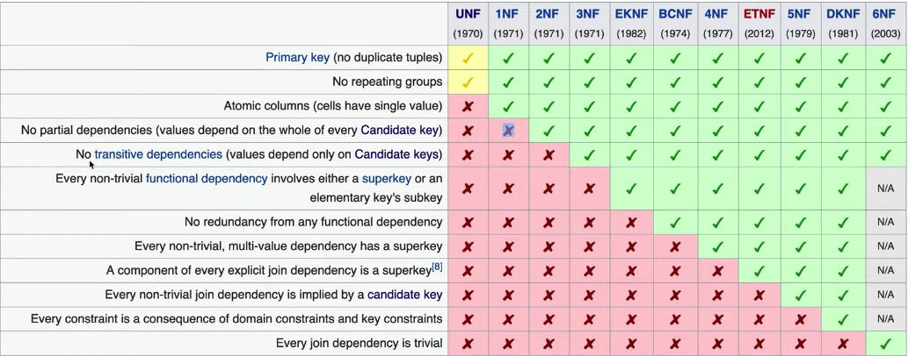

[데이터베이스 첫걸음](http://www.yes24.com/Product/Goods/32613394?OzSrank=1)과 [생활코딩 - 데이터모델링](https://opentutorials.org/course/3883)와 추가 자료를 통해 정리한 자료입니다.


# 목차

- [정규형](#정규형)
  * [제 1정규형](#제-1정규형)
  * [제 2정규형](#제-2정규형)
  * [제 3정규형](#제-3정규형)


# 정규형

🤔 정규화 (Normalization)

* 일반적으로 정규화란, **제대로 조직되지 않은 테이블들과 관계들을 작고 잘 조직된 테이블과 관계들로 나누는 것을 말한다.**
* **정규화는 정제되지 않은 표를 관계형 데이터베이스에 어울리는 표로 만들어주는 것을 말한다.**
* 정규화의 목적은 다음 두 가지이다.
  * **불필요한 데이터를 제거한다. (데이터 중복)**
  * **데이터 저장을 논리적으로 한다.**
    * 하나의 테이블에서의 삽입, 삭제, 변경이 정의된 관계들로 인하여 DB의 나머지 부분들로 전파되게 하는 것.




>  비공식적으로 제 3 정규형 (`3NF`)가 실제 사용하는데는 문제가 없다고 한다.


## 제 1정규형

🤔  제 1정규형

* 테이블 셀에 복합적인 값을 포함하지 않는다.
* 원자값 (Atomic Value)
  * 1차 정규형은 각 로우마다 컬럼의 값이 1개씩만 있어야 한다.


:point_right: 예시 1


## 제 2정규형

🤔  제 2정규형

* 모든 테이블의 모든 컬럼이 **완전 함수적 종속**을 만족하는 것
  * **부분함수 종속성**이 존재하지 않아야 한다.
  * 즉, 테이블의 기본키중에 중복키가 있따면 이것을 해결해야 한다는 의미


🤔  부분함수 종속성

* 기본키를 구성하는 열의 일부에만 함수 종속성이 존재하는 것


* 1NF는 충족하고 있지만, 2NF는 충족하지 못하고 있다.
  * 기본키는 `고객기업 ID`와 `주문번호` 의 조합이며, 이 조합으로 행을 유일하게 특정하는 것이 가능하다.
    * `고객기업명` 과 `고객기업 규모` 는 `고객기업ID` 를 통해 특정할 수 있다.
    * 하지만, `주문번호` 는 `고객기업명` 과 `고객기업 규모` 에는 쓸데 없는 정보이다.
  * **이처럼 기본키를 구성하는 열(`고객기업 ID`, `주문번호`)의 일부(`고객기업 ID`) 만 함수 종속성이 존재할 경우를 부분함수 종속성이라 한다.**


:point_right: 예시


* 전체 열이 기본키만으로도 함수 종속을 가지고 있으며 기본키의 일부에만 종속하지 않은 열이 없다.
* `테이블은 집합이다`라는 관점에서 고객기업 주문 테이블과 고객기업 테이블은 각각 확실하게 `주문`, `고객` 이라는 집합에 대응하고 있다.


## 제 3정규형

🤔  제 3정규형

* 추이함수 종속이 존재하면 안된다.
  * 기본키를 제외한 속성들 간의 이행적 함수 종속이 없어야 한다.
  * 우편번호를 적으면 주소가 자동적으로 결정되면 안된다.


🤔  추이함수 종속


* 추이함수 종속이란 기본키에서 볼 때 2단계의 함수 종속이 존재한다는 의미이다.

  * ```
    {고객기업 ID} -> {업계코드} -> {업계명}
    ```

* **추이함수 종속이 존재할 경우 테이블 갱신 이상이 존재한다.**

  * 테이블에 업계를 등록할 방법이 없다.
  * 테이블에는 `기업` 이라는 단위의 집합을 반영할수 있어도 `유통` 업계를 속한 기업과 거래하지 않은 이상 해당 업계 코드를 만들수 없다.


:point_right: 예시


> **`부분함수 종속`과 `추이함수 종속`을 생각하며 테이블을 설계하면 90%는 능숙하게 진행할 수 있다.**


