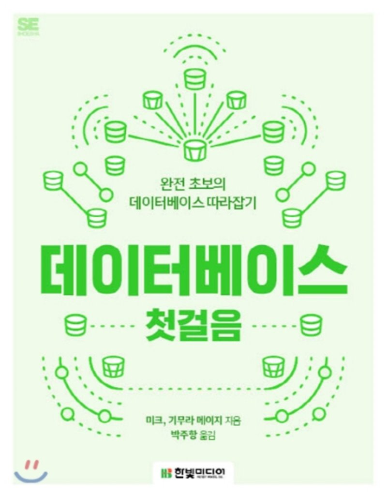
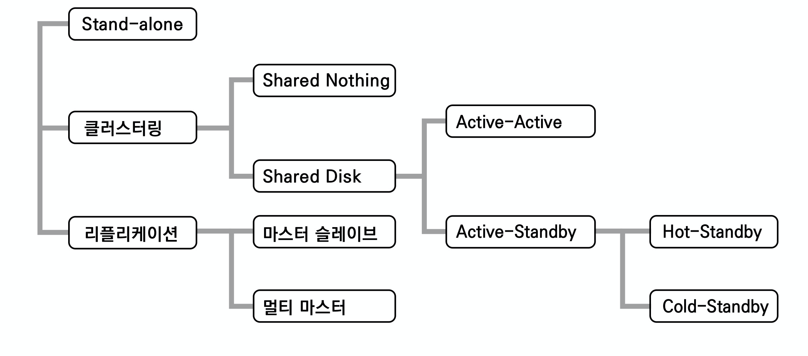
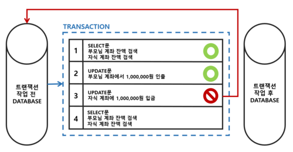
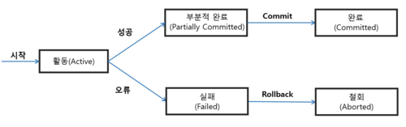
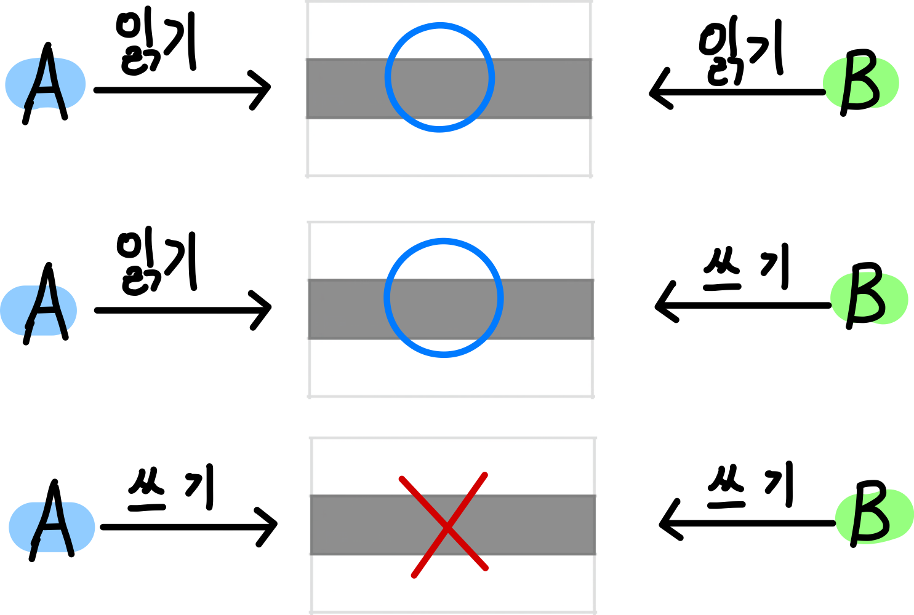
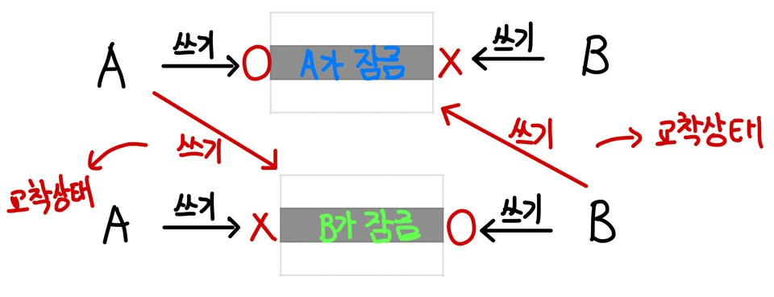
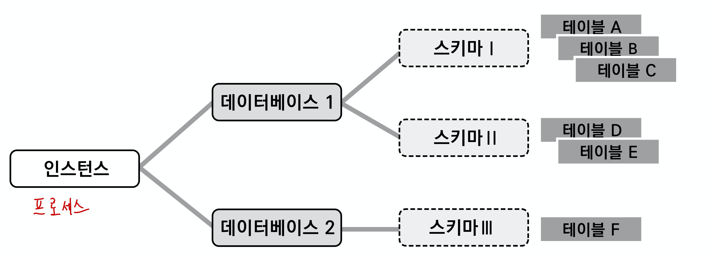
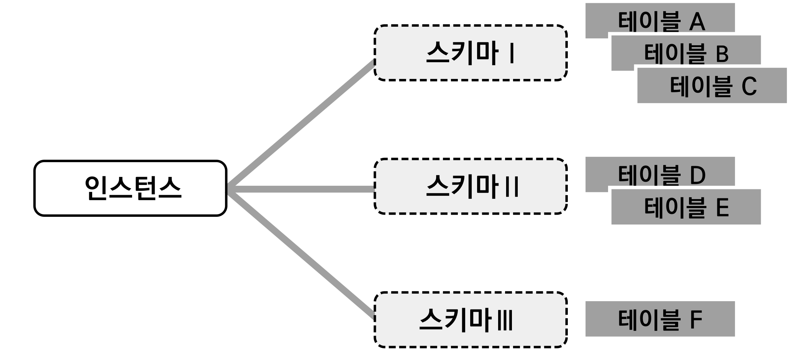

[데이터베이스 첫걸음](http://www.yes24.com/Product/Goods/32613394?OzSrank=1)을 기초하여 여러 사이트를 참고하여 데이터베이스의 기초를 정리한 자료입니다.

# 목차

# 데이터 베이스 첫걸음

## 1 데이터 베이스란

### 1-1 데이터 베이스의 기본 기능

1. 데이터의 검색과 갱신
   * 갱신 : 등록, 수정, 제거
   * 검색 : 조회
2. 동시성 제어
   * DB는 동시에 복수의 사용자로부터 요청을 받는다. 이때 문제가 되는 것은 '갱신의 무결성을 어느 정도로 보장하는가?'이다.
   * 스레드의 동기화문제와 같은 문제.
3. 장애 대응
4. 보안

### 1-2 데이터베이스의 종류

* 계층형 데이터베이스
  * 조직도
* 관계형 데이터베이스
  * 2차원 표
* 객체지향 데이터베이스와 XML 데이터베이스
* NoSQL 데이터베이스
  * Not only SQL

### 1-3 DBMS

* DBMS와 데이터베이스의 차이
  * DBMS는 구체화된 데이터 관리 시스템
    * MySQL, Oracle
  * 데이터 베이스는 기능이나 구조를 나타내는 추상적인 개념

* DBMS는 미들웨어에 위치한다.
  * 미들웨어는 운영체제와 애플리케이션 중간에 위치한다.
  * 기능적으로 양쪽의 성질을 겸비해서 갖추고 있다는 의미.

## 2 데이터베이스와 아키텍처 구성

고속의 견고한 데이터베이스 시스템을 설계하기 위해서는 아키텍처가 명확한 의도로 설계되어야 한다.

### 2-1 다중화

* 다중화란?
  * DB 서버가 2대 있따면 1대가 고장나도 나머지 1대가 동작하여 서비스의 정지를 막는 것.

### 2-2 아키텍처

* 아키텍처란
  * 시스템을 만들기 위한 물리 레벨의 조합 (뼈대)
    * 건축의 구조와 양식
  * 하드웨어와 미들웨어의 구성
    * 어떤 기능을 가진 서버를 준비하고 어떠한 저장소나 네트워크 기기와 조합해서 시스템 전체를 만들 것인가
* DB와 서버의 핵심은 "계속성"과 "안정성"
  * 24시간 동작해야 하기 때문.
  * **DB는 영속(Persistence)계층**

### 2-3 DB 서버의 다중화 - 클러스터링

* 클러스터란
  * 동일한 기능의 컴포넌트를 병렬화하는 것을 클러스터링이라한다. (스케일 아웃)
  * 스케일 업보다는 스케일 아웃이 주류
  * **DB 서버의 다중화**
* 가장 기본적인 다중화
  * `Active-Active` : 클러스터를 구성하는 컴포넌트를 동시에 가동한다. 
    * 여러 DB 서버가 동시에 한 대의 DB저장소에 접근. DB 서버가 고장나도, 금방 복구 (클러스터링)
    * DB 저장소가 병목이 일어날 확률이 높다.
    * `Shared-Disk`라고도 불린다.
  * `Active-Standby` : 클러스터를 구성하는 컴포넌트 중 실제 가동하는 것은 `Active`, 남은 것은 대기(`Standby`)하고 있는다.
    * 한 대의 DB서버만이 저장소와 통신하다 고장나면 다른 DB 서버로 교체. 고장난 것을 확인하기 위해 `Heartbeat`이라는 개념의 주기적으로 살아있는지 보낸다고 한다.

### 2-4 DB 서버의 다중화 - 리플리케이션

* 리플리케이션 ( 복제 )
  * **DB 저장소의 다중화.**
  * DB 서버와 저장소 세트를 복수로 준비하는 것.
  * 서울의 DB가 고장나도 부산에 미리 복제해놓은 DB를 구동하면 된다.
* 리플리케이션의 주의할 점
  * `Active` (주로 사용되는 DB세트)는 항상 사용자로부터 데이터를 갱신하지만, `Standby` (복제되어 대기중인 DB세트)가 갱신하여 최신화하지 않으면 데이터의 정합성을 유지할 수 없다. (아무 의미 없다.)
  * `Active`와 `Standby` DB의 동기화를 주기적으로 해야 한다.
* 리플리케이션에서 사용하는 용어
  * 동기화하는 측 (`Active`) = 부모 (마스터)
  * 동기화되는 측 (`Standby`) = 자식 (슬레이브)

### 2-5 성능을 추구하기 위한 다중화 - Shared Nothing

* Shared-Disk
  * Shared-Disk = 한 대의 DB 저장소를 여러 DB 서버가 사용하는 방식
  * `Active - Active`방식은 DB 서버가 아무리 늘어나도 저장소가 하나이므로 병목으로 인해 성능의 한계점이 분명하다.
  * 즉, DB 서버를 늘려도 무한으로 처리율이 향상되지 않는다.
* Shared Nothing
  * Shared-Disk의 단점을 극복하기 위해 고안된 아키텍처
  * 아무것도 공유하지 않는다. = 네트워크 이외의 자원을 모두 분리하는 방식
  * DB 서버와 DB 저장소를 1대 1로 매칭시켜 늘리는 방식 (DB 서버 + 저장소 = 한 단위)
    * DB 서버가 늘어나면 DB 저장소도 늘어난다.
  * **구글에서는 이러한 방식을 '샤딩(sharding)'이라 부른다고 한다.**
  * **하지만, 복잡한 동기화 구조를 구축해야한다.**

## 3 SQL

## 4 트랜잭션과 동시성 제어

### 4-1 트랜잭션이란

출처 : http://wiki.hash.kr/index.php/트랜잭션

* 트랜잭션이란 복수 쿼리를 한 단위로 묶는 것을 말한다.
  * DB에서 갱신 (`INSERT`, `DELETE`, `UPDATE`)는 단일 쿼리만으로 구성된 것이 아니고 복수 쿼리를 연속적으로 수행하는 경우가 대부분이다.
  * 갱신 전의 데이터로 `SELECT` 를  사용할 때 이를 포함해 복수 쿼리를 일관된 형태의 한덩어리도 다뤄야 한다.

### 4-2 트랜잭션의 상태

출처 : http://wiki.hash.kr/index.php/트랜잭션

* 활동(Active) : 트랜잭션이 실행 중인 상태
* 실패(Failed) : 트랜잭션 실행에 오류가 발생하여 중단된 상태
* 철회(Aborted) : 트랜잭션이 비정상적으로 종료되어 롤백 연산을 수행한 상태
* 부분 완료(Partially Committed) : 트랜잭션의 마지막 연산까지 실행했지만, 커밋 연산이 실행되기 직전의 상태
* 완료(Commited) : 트랜잭션이 성공적으로 종료되어 커밋 연산을 실행한 후의 상태.

### 4-3 트랜잭션의 연산

* `COMMIT`

  .png)

  
출처 : http://wiki.hash.kr/index.php/트랜잭션

  * 커밋은 모든 작업들을 정상적으로 처리하겠다고 확정하는 명령어이며, 처리과정을 데이터베이스에 영구적으로 저장하는 것이다.

* `ROLLBACK`

  .png)

  
출처 : http://wiki.hash.kr/index.php/트랜잭션

  * 롤백은 작업 중 문제가 발생하여 트랜잭션의 처리과정에서 발생한 변경사항을 취소하는 명령어이다.

### 4-4 ACID

트랜잭션은 다음과 같이 4가지 특성을 정의하며 앞글자를 따서 "ACID"라고 한다.

#### Atomicity 원자성

🤔 원자성이란?

* 원자성이란 데이터의 변경을 수반하는 **일련의 데이터 조작이 전부 성공할지 전부 실패할지를 보증**하는 구조이다.
* **시스템에서 한 트랜잭션의 연산들이 모두 완료되거나, 반대로 전혀 실행되지 않는 성질.**

:point_right: 예시

* 서울에서 부산을 간다고 한다면

  1. 서울 -> 부산행 좌석 예메

  2. 부산에서의 숙박 예약

  3. 부산 -> 서울행 좌석 예매
  4. 1~3의 대금을 지급한다.

* `COMMIT`

  * 만약 1~4를 정상적으로 처리가 되면 `COMMIT`을 실행해 처리를 확정한다. 이 경우 각 데이터의 조작은 영구적으로 저장되어 결과가 손실되지 않는다.

* `ROLLBACK`

  * 만약 3에서 좌석을 예매할 수 없다든지, 4에서 돈이 부족할 수 도 있다. 이 경우 `ROLLBACK`을 통해 1의 직전 상태로 되돌아간다. (처음부터 다시)
  * 처리 과정중 중간에 네트워크 통신이 끊겨 서버가 다운되는 경우에도 `COMMIT`된 것 외에는 `ROLLBACK`을 한다.

#### Consistency 일관성

🤔 일관성이란?

* **데이터 조작 전후에 그 상태를 유지하는 것을 보증하는 것을 의미.**
* 트랜잭션 수행 전/후에 데이터 모델의 모든 제약 조건(기본 키, 외래 키, 도메인, 도메인 제약조건 등)을 만족하는 것을 통해 보장한다.

:point_right: 일관성 보장

* Movie와 Video 테이블이 있을 때 Video 테이블의 기본 키인 move_id가 외래키로 존재한다고 가정한다.
  * 만약 movie_id의 제약 조건이 Movie 테이블에서 변경되면, Video 테이블에서도 movie_id가 변경되어야 한다.
* **한 쪽의 테이블에서만 데이터 변경사항이 이루어져서는 안된다.** 
* **트리거 (Trigger)**
  * 트랜잭션의 일관성을 보장하기 위한 방법으로 어떤 이벤트와 조건이 발생했을 때 트리거를 통해 보장한다.
  * 트리거란 방아쇠란 뜻이며, DB 시스템이 자동적으로 수행할 동작을 명시할 때 사용된다. (행위의 시작을 알림)

#### Isolation 고립성

🤔 고립성이란?

* **데이터 조작을 복수의 사용자가 동시에 실행해도 '각각의 처리가 모순없이 실행되는 것을 보증한다.'**
* **하나의 트랜잭션 수행시 다른 트랜잭션의 작업이 끼어들지 못하도록 보장하는 것.**
  * 트랜잭션 끼리는 서로를 간섭할 수 없다.
* 트랜잭션이 실행하는 도중에 변경한 데이터는 이 트랜잭션이 완료될 때까지 다른 트랜잭션이 참조하지 못하도록 하는 특성.
  * 동기화

:point_right: 고립성 보장

1. 현재 빈 싱글룸의 수를 확인한다. SELECT -> 10개
2. 빈 싱글룸 수에서 1을 빼고 결과를 빈 싱글룸 수로 돌려 쓴다. UPDATE -> 9
3. 이 요청을 A, B가 동시에 할 경우 2명이 예약했지만 방은 1개 밖에 줄지 않는다.

* DB에서는 트랜잭션의 고립성을 보장하기 위해 `잠금(Lock)`을 걸어서 후속 처리를 `블록(Block)`하는 방법이 있다.
  * **잠금 단위에는 테이블 전체, 블록, 행**이 있다.
  * **MySQL은 보통 행 단위의 잠금 기능을 사용한다.**

* 위 예제에서 `(1) 현재 빈 싱글룸의 수를 확인한다`를 처리할 때는 `select for update`를 실행하면 `select`한 행에 잠금이 걸리게 된다. 이렇게 하면 후속 처리는 해당 잠금이 해체될 때 (`commit or rollback`)까지 대기하게 되며 올바른 처리를 계속할 수 있게 된다.

💁‍♂️ 격리 레벨

| 격리 수준        | 설명                                                         |
| ---------------- | ------------------------------------------------------------ |
| Read Uncommitted | 다른 트랜잭션이 아직 커밋하지 않은 값을 한 트랜잭션이 읽을 수 있다. 따라서 오염된 읽기, 재현 불가능한 읽기, 허상 읽기 문제가 발생할 가능성이 있다. |
| Read Committed   | 한 트랜잭션이 다른 트랜잭션이 커밋한 값만 읽을 수 있다. 이로써 오염된 값 읽기 문제는 해결되지만 재현 불가능한 읽기, 허상 읽기 문제는 여전히 남는다. |
| Repeatable Read  | 트랜잭션이 어떤 필드를 여러번 읽어도 동일한 값을 읽도록 보장한다. 트랜잭션이 지속되는 동안 다른 트랜잭션이 해당 필드를 변경할 수 없다. 오염된 값 읽기, 재현 불가능 읽기 문제는 해결되지만 허상 읽기는 여전히 남는다. |
| Serializable     | 트랜잭션이 테이블을 여러 번 읽어도 정확히 동일한 로우를 읽도록 보장한다. 트랜잭션이 지속되는 동안에는 다른 트랜잭션이 해당 테이블에 삽입, 수정, 삭제를 할 수 없다. 동시성 문제는 모두 해결되지만 성능이 현저히 떨어진다. |

* 격리 레벨은 각자 트레이드오프가 존재하기 때문에, 상황에 맞게 사용하면 될 듯 하다.
* Serializable이 격리 수준이 제일 높고, 역순으로 낮아진다.

💁‍♂️ 격리 수준의 완화에 따라 일어나는 현상

| 현상                                   | 개요                                                         |
| -------------------------------------- | ------------------------------------------------------------ |
| 더티 읽기 (Dirty Read)                 | 어떤 트랜잭션이 커밋되기 전에 다른 트랜잭션에서 데이터를 읽는 현상. 예를들어 사용자 A가 값을 변경하고 아직 커밋하지 않아도 사용자 B가 변경한 후의 값을 읽는 것을 가리킨다. |
| 애매한 읽기 (Fuzzy/NonRepeatable Read) | 어떤 트랜잭션이 이전에 읽어 들인 데이터를 다시 읽어 들일 때 2회 이후의 결과가 1회 때와 다른 현상. 예를 들어 최초에 사용자 A가 빈 싱글룸 수 10을 읽고 그 후 사용자 B가 값을 9로 변경해 커밋했다고 하자. 계속해서 사용자 A가 SELECT하면 결과를 9이다. 사용자 A가 최초에 읽은 값 10이 2회 이후에 SELECT에서 보증되지 못하고 애매하게 된다. |
| 팬덤 읽기 (Phantom Read)               | 어떤 트랜잭션을 읽을 때 선택할 수 있는 데이터가 나타나거나 사라지는 현상. 최초에 사용자 A가 범위 검색을 수행 후 3행을 읽었다고 가정해보자. 계속해서 사용자 B가 그 범위에 들어가는 데이터 1행을 INSERT하고 커밋도 실행했다. 계속해서 사용자 A는 다시 같은 SELECT 문을 실행하면 최초에 SELECT 문을 실행하면 최초에 SELECT해서 얻었던 3행이 아닌 4행이 선택된다. 이처럼 나타거나 사라지는 (DELETE나 UPDATE로 사라진다) 데이터가 유령과 닮아서 붙여진 이름이다. |

#### Durability 지속성

🤔 지속성이란?

* 트랜잭션을 완료(COMMIT)하고 완료 통지를 사용자가 받는 시점에 그 트랜잭션이 영구적이 되어 그 결과를 잃지 않는 것.
  * 컴퓨터가 종료되거나 시스템 장애가 발생해도 계속 저장되는 성질 (RAM이 아닌 SSD에 저장된 상태)

:point_right: 지속성 실현

* MySQL을 포함해 대부분 DBMS는 트랜잭션 조작을 하드 디스크에 "로그"로 기록하고 시스템에 이상이 발생하면 그 로그를 사용해 이상 발생 전의 상태까지 복원하는 것으로 지속성을 실현하고 있다.

### 4-5 복수 커넥션에서 읽고 쓰기

> 복수의 커넥션(트랜잭션)이 어떻게 동시성을 제공하는지 알아보자

💁‍♂️ MySQL은 DBMS의 주류가 된 MVCC (Multi Versioning Concurrency Control)라는 기술을 사용한다.

#### MVCC에 따른 MySQL의 특성

1. **읽기를 수행할 경우 갱신중이라도 블록되지 않는다.**
   * 읽기와 읽기도 서로 블록되지 않는다.
2. 읽기 내용은 격리 수준에 따라 내용이 바뀌는 경우가 있다.
3. 갱신 시 배타적 잠금을 얻는다.
   * 잠금은 기본적으로 행 단위로 얻으며 트랜잭션이 종료될 때까지 유지한다.
   * 격리수준이나 InnoDB의 설정에 따라 실제로 잠금 하는 행의 범위가 다른 경우가 있다.
4. **갱신과 갱신은 나중에 온 트랜잭션이 잠금을 획득하려고 할 때 블록된다.**
   * 일정 시간을 기다리며 그사이에 잠금을 획득할 수 없는 경우에는 "잠금 타임아웃"이 된다.
5. 갱신하는 경우 갱신 전의 데이터를 `UNDO` 로그로 '롤백 세그먼트'라는 영역에 유지한다.
   * 이 `UNDO` 로그는 용도가 2가지이다.
     1. 갱신하는 트랜잭션의 롤백 시 갱신 전으로 되돌리는 것.
     2. **복수의 트랜잭션으로부터 격리 수준에 따라 대응하는 갱신 데이터를 참조하는데 이용한다.**

#### 트랜잭션 격리 수준별 외관

💁‍♂️ MVCC의 특성 2번(`읽기 내용은 격리 수준에 따라 내용이 바뀌는 경우가 있다.`)에서 언급한 격리 수준에 대해서 알아보자.

* 반복 읽기
* 커밋된 읽기

> 아래 잘 정리되어 있다.
>
> * [고립성](#isolation-고립성)
> * https://nesoy.github.io/articles/2019-05/Database-Transaction-isolation

### 4-6 잠금 타임아웃과 교착 상태

🤔 잠금 타임아웃이란?

* 갱신과 갱신이 부딪치는 경우에는 나중에 온 갱신이 잠금 대기 상태가 된다. 잠금을 건 쪽이 언제 잠금을 풀지 알 수 없어서 잠금 대기 상태가 된다.
* 이때 얼마나 기다릴지를 설정하는데 이 시간을 지나면 **잠금 타임아웃이 발생한다.**

* 타임아웃이 발생했을 때 롤백하는 방법은 두 가지이다.
  * 트랜잭션 전체를 롤백하는 경우
  * 쿼리만 롤백하는 경우

🤔 교착상태란?

* 트랜잭션 A가 테이블 a의 잠금을 얻고, 트랜잭션 B가 테이블 b의 잠금을 얻었다고 해보자.
* 이 잠금을 유지한 채 서로 잠금을 건 자원에 잠금이 필요한 처리를 실행하면 아무리 기다려도 상황이 바뀌지 않는다.
* 이를 교착 상태라 한다.

💁‍♂️ 교착상태의 빈도를 낮추는 대책

잠금 타임아웃은 일정 시간 기다리면 상황이 개선될 가능성이 있지만, **교착 상태는 상황이 개선될 가능성이 없습니다.** 이 때문에 일반적인 **DBMS에서는 교착 상태를 독자적으로 검출해 교착 상태를 보고**합니다.

**MySQL도 교착 생태가 일어나면 이를 즉시 인식해 시스템에 영향이 작은 쪽의 트랜잭션을 트랜잭션 개시 시점까지 롤백합니다.**

**교착 상태**는 일반적인 데이터베이스에서 **발생할 가능성이 있으므로 모든 것을 업얠 수는 없습니다.** 따라서 **애플리케이션 쪽에서는 항상 트랜잭션이 교착 상태를 일으켜 롤백되는 경우 트랜잭션을 재실행 할 수 있는 구조로 만들어야 합니다.**

💁‍♂️ DBMS 전반적인 대책

1. **트랜잭션을 자주 커밋한다.** 이에 따라 **트랜잭션은 더 작은 단위가 되어 교착 상태의 가능성을 낮춘다.**
2. 정해진 순서로 테이블 순서에 엑세스하게 한다.
3. 필요 없는 경우에는 읽기 잠금 획득 (SELECT ~ FOR UPDATE 등)의 사용을 피한다.
4. 쿼리에 의한 잠금 범위를 더 좁히거나 잠금 정도를 더 작은 것으로 한다.(Isolation Level을 낮춘다.)
5. 한 테이블의 복수 행을 복수의 연결에서 순서 변경 없이 갱신하면 교착 상태가 발생한다. 동시에 많은 연결에서 갱신 때문에 교착 상태가 자주 발생한다면 테이블 단위의 잠금을 회득해 갱신을 직렬화하면 동시선은 떨어지지만 교착 상태는 피할 수 있어서 전체 처리로 보면 좋은 예도 있다.

💁‍♂️ MySQL의 대책

테이블에 적절한 인덱스를 추가해 쿼리가 이를 이용하게 한다. 인덱스가 사용하지 않은 경우 필요한 행의 잠금이 아닌 스캔한 행 전체에 대해 잠금이 걸리게 된다.

### 4-7 해서는 안되는 트랜잭션 처리

#### 오토 커밋

**MySQL에서는 새로운 연결은 모두 기본값으로 오토커밋이 실행된다.** 애플리케이션의 잠금을 실행하는 데는 커밋의 부하가 너무 높다. 일정 수 이상의 갱신을 수행하는 처리나 트랜잭션의 기능등은 적절한 단위와 트랜잭션 처리 수준에서 트랜잭션을 이용하지 않도록 한다.

#### 긴 트랜잭션

**긴 트랜잭션은 데이터베이스 트랜잭션의 동시성이나 자원의 유효성을 저하한다.** 갱신을 포함한 트랜잭션은 같은 테이블과 행을 갱신하려는 다른 트랜잭션을 블록하고 이것이 장시간 이어지면 블록된 트랜잭션을 타임아웃시킨다.

## 5 테이블 설계의 기초

### 5-1 테이블

🤔 **테이블 == 어떤 공통의 속성을 가진 것의 집합**

* 데이터를 관리하는 그릇.
* **공통적인 요소의 집합**
  * 테이블은 관련성 없는 것이 이것저것 모여서는 안된다.
* 테이블은 공통 속성을 가진 것의 집합이다.
* **고유한 기본키를 가진 공통점에 의해 정리된 것들의 집합**

> **테이블명은 반드시 복수형이나 집합명사로 표현해야 한다.**

### 5-2 설계 규칙

#### 열이란 개체의 속성이다

💁‍♂️  열 == 인스턴스의 상태

* 테이블과 객체지향언어
  * 테이블 == 클래스
  * 행 == 인스턴스
  * 열 == 상태, 속성

#### 현실 세계에 같은 사람은 2명 있지 않다.

💁‍♂️  기본키

* **테이블에는 기본키가 반드시 있어야한다.**
  * 이것은 "한 개 테이블의 내용에는 중복 행을 허용하지 않는다"라는 의미가 된다.
* 자바에서의 `hashCode()`과 유사하다.
* 기본키의 특성
  * 기본키는 중복되면 안된다. (**유일성**)
  * 기본키 할당은 관리의 기본.
  * 기본키 열로 `NULL` 은 안된다.
    * `NULL` : 값이 불명확하거나 정하는 것이 가능하지 않는 경우

### 5-3 정규형

[정규형](https://github.com/binghe819/TIL/blob/master/DB/RDB/%EB%8D%B0%EC%9D%B4%ED%84%B0%20%EB%AA%A8%EB%8D%B8%EB%A7%81/%EC%A0%95%EA%B7%9C%ED%98%95.md)

## 6 성능

# 용어 정리

## Dirty Write

* 어떤 사람도 문제 없이 파일을 여는 것이 가능하고 나중에 수행된 쪽의 갱신이 반영된다는 경우.
* 남보다 늦게 손을 내밀어 이기는 가위바위보와 같다.

## Paas

* 미들웨어 (운영체제와 애플리케이션의 사이)까지 포함한 클라우드 서비스의 임대 모델.
  * 미들웨어의 대표적인 예시 : 데이터 베이스
  * AWS에서는 클라우드에 준비된 MySQL이나 ORACLE을 이용할 수 있는 서비스가 제공된다. 이러한 서비스를 PaaS라고 한다.

## 스키마

일반 적인 RDB의 계층 구조

MySQL 계층 구조

> MySQL에서는 데이터베이스와 스키마를 하나로 보고, PostgreSQL에서는 둘을 따로 본다.

* 스키마
  * "틀"
  * DB에서 폴더에 해당하는 개념.
    * 폴더처럼 자유롭게 만들수도 있고, 보여주고 싶은 사용자에게만 보여줄 수 있다.
  * 테이블은 실제로 몇 개의 스키마 속에 저장되는 형식을 취하고 있다.
* 스키마의 상위계층은 데이터 베이스이다.
* 위키 백과 - 스키마
  * 데이터베이스에서 자료의 구조, 자료의 표현 방법, 자료 간의 관계를 형식 언어로 정의한 구조.
    * 외부 스키마 : 프로그래머나 사용자의 입장에서 데이터베이스의 모습으로 조직의 일부분을 정의한 것
    * 개념 스키마 : 모든 응용 시스템과 사용자들이 필요로하는 데이터를 통합한 조직 전체의 데이터 베이스 구조를 논리적으로 정의한 것
    * 내부 스키마 : 전체 데이터베이스의 물리적 저장 형태를 기술하는 것

## DDL, DML, DCL

* DDL (Data Definition Language) : 데이터 정의 언어
  * DDL은 데이터를 저장하는 그릇인 스키마(DB)또는 테이블 등을 작성하거나 제거합니다.
  * `CREATE`, `ALTER` 등
* DML (Data Manipulation Language) : 데이터 조작 언어
  * DML은 테이블의 행을 검색하거나 변경하는 데 사용된다. (`SQL`)
  * `INSERT`, `UPDATE`, `DELETE` 등
* DCL (Data Control Language) : 데이터 제어 언어
  * DCL은 DB에서 실행한 변경을 확정하거나 취소하는 데 사용한다.
  * `COMMIT`, `ROLLBACK`

# 참고

* [데이터베이스 첫걸음](http://www.yes24.com/Product/Goods/32613394?OzSrank=1)
* http://wiki.hash.kr/index.php

