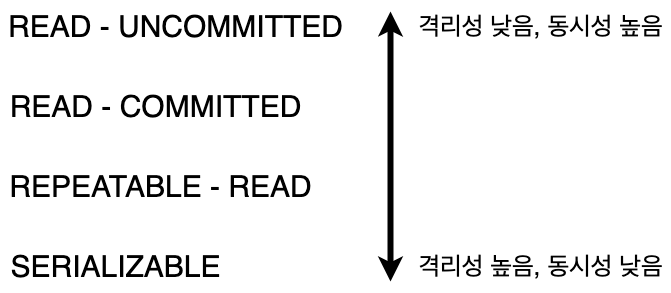
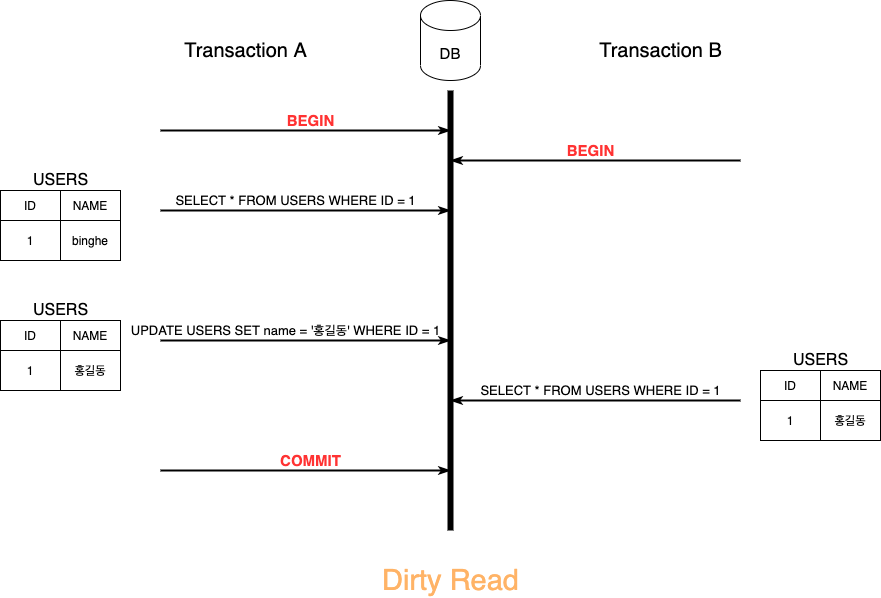
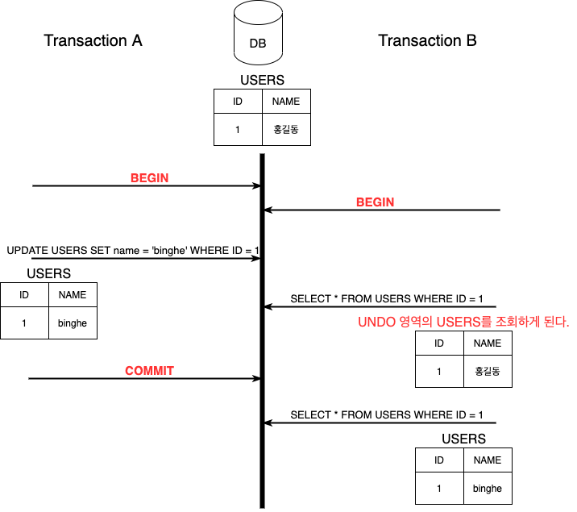
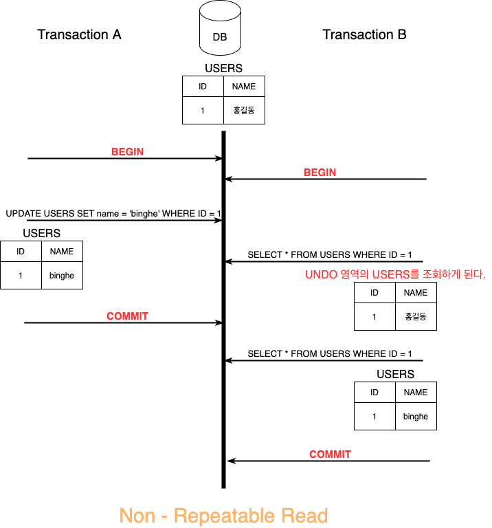
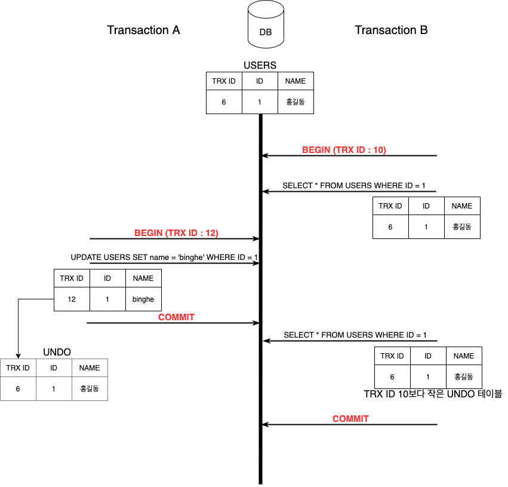
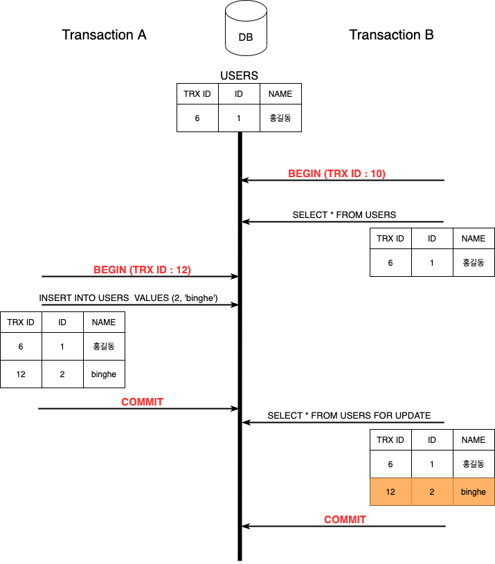

# 목차

- [트랜잭션](#트랜잭션)
  * [1 트랜잭션이란](#1-트랜잭션이란)
    + [1-1 트랜잭션이란](#1-1-트랜잭션이란)
    + [1-2 트랜잭션의 상태](#1-2-트랜잭션의-상태)
    + [1-3 트랜잭션의 연산](#1-3-트랜잭션의-연산)
      - [COMMIT](#commit)
      - [ROLLBACK](#rollback)
  * [2 트랜잭션 성질 ACID](#2-트랜잭션-성질-acid)
    + [2-1 Atomicity 원자성](#2-1-atomicity-원자성)
    + [2-2 Consistency 일관성](#2-2-consistency-일관성)
    + [2-3 Isolation 독립성](#2-3-isolation-독립성)
    + [2-4 Durability 지속성](#2-4-durability-지속성)
  * [3 트랜잭션 격리수준](#3-트랜잭션-격리수준)
    + [3-1 격리수준이란](#3-1-격리수준이란)
    + [3-2 격리수준 종류](#3-2-격리수준-종류)
    + [3-3 READ UNCOMMITTED](#3-3-read-uncommitted)
    + [3-4 READ COMMITED](#3-4-read-commited)
      - [NON-REPEATABLE READ 현상](#non-repeatable-read-현상)
    + [3-5 REPEATABLE READ](#3-5-repeatable-read)
      - [PHANTOM READ](#phantom-read)
    + [3-6 SERIALIZABLE](#3-6-serializable)
- [참고](#참고)

# 트랜잭션

## 1 트랜잭션이란

### 1-1 트랜잭션이란

출처 : http://wiki.hash.kr/index.php/트랜잭션

* 트랜잭션의 사전적 의미 : 거래
  * 하나의 거래는 **두 요소가 서로 주고 받았을때 성사**된다.
  * **하나의 거래 완성 (단위) = 구매 계좌에서 n만원 출금(작은 단위) + 판매자 계좌에서 n만원 출금(작은 단위)**
* **트랜잭션이란 복수 쿼리를 한 단위로 묶는 것을 말한다.**
  * DB에서 갱신(`INSERT`, `DELETE`, `UPDATE`)는 단일 쿼리만으로 구성된 것이 아니고 복수 쿼리를 연속적으로 수행하는 경우가 대부분이다.
  * 갱신 전의 데이터로 `SELECT`를 사용할 때 이를 포함해 복수 쿼리를 일관된 형태로 한덩어리로 다뤄야 한다.
* **더 이상 나눌 수 없는 단위 작업**
  * 작업을 쪼개서 작은 단위로 만들 수 없다는 것은 트랜잭션의 핵심 속성인 원자성을 의미한다.

### 1-2 트랜잭션의 상태

출처 : http://wiki.hash.kr/index.php/트랜잭션

* 활동(Active) : 트랜잭션이 실행 중인 상태
* 실패(Failed) : 트랜잭션 실행에 오류가 발생하여 중단된 상태
* 철회(Aborted) : 트랜잭션이 비정상적으로 종료되어 롤백 연산을 수행한 상태
* 부분 완료(Partially Committed) : 트랜잭션의 마지막 연산까지 실행했지만, 커밋 연산이 실행되기 직전의 상태
* 완료(Commited) : 트랜잭션이 성공적으로 종료되어 커밋 연산을 실행한 후의 상태.

### 1-3 트랜잭션의 연산

#### COMMIT

출처 : http://wiki.hash.kr/index.php/트랜잭션

* 커밋은 모든 작업들을 **정상적으로 처리하겠다고 확정하는 명령어**이며, **처리과정을 DB에 영구적으로 저장**하는 것.

#### ROLLBACK

출처 : http://wiki.hash.kr/index.php/트랜잭션

* 롤백은 작업 중 **문제가 발생**하여 트랜잭션의 처리과정에서 발생한 **변경사항을 취소하는 명령어**이다.

## 2 트랜잭션 성질 ACID

트랜잭션 성질이란 **트랜잭션이 안전하게 수행된다는 것을 보장하기 위한 성질**을 의미한다.

### 2-1 Atomicity 원자성

🤔 원자성이란?

* **원자 = 더 이상 쪼개질 수 없는 물질**
* 원자성이란 데이터의 변경을 수반하는 **일련의 데이터 조작이 전부 성공할지 전부 실패할지를 보증**하는 구조이다.
* 시스템에서 한 트랜잭션의 연산들이 **모두 완료되거나, 반대로 전혀 실행되지 않는 성질**.
  * **트랜잭션은 DB에 모두 반영되거나, 전혀 반영되지 않아야 한다.**
  * **완료되지 않은 트랜잭션의 중간 상태를 DB에 반영하면 안된다.**

:point_right: 예시

* 서울에서 부산을 간다고 한다면

  1. 서울 -> 부산행 좌석 예메

  2. 부산에서의 숙박 예약

  3. 부산 -> 서울행 좌석 예매
  4. 1~3의 대금을 지급한다.

* `COMMIT`

  * 만약 1~4를 정상적으로 처리가 되면 `COMMIT`을 실행해 처리를 확정한다. 이 경우 각 데이터의 조작은 영구적으로 저장되어 결과가 손실되지 않는다.

* `ROLLBACK`

  * 만약 3에서 좌석을 예매할 수 없다든지, 4에서 돈이 부족할 수 도 있다. 이 경우 `ROLLBACK`을 통해 1의 직전 상태로 되돌아간다. (처음부터 다시)
  * 처리 과정중 중간에 네트워크 통신이 끊겨 서버가 다운되는 경우에도 `COMMIT`된 것 외에는 `ROLLBACK`을 한다.

### 2-2 Consistency 일관성

🤔 일관성이란?

* 트랜잭션이 **안전하게 수행된다는 것을 보장하기 위한 성질**
* **데이터 조작 전후에 그 상태를 유지하는 것을 보증하는 것을 의미.**
* 트랜잭션 수행 전/후에 데이터 모델의 모든 **제약 조건(기본 키, 외래 키, 도메인, 도메인 제약조건 등)을 만족하는 것**을 통해 보장한다.

:point_right: 일관성 보장

* Movie와 Video 테이블이 있을 때 Video 테이블의 기본 키인 move_id가 외래키로 존재한다고 가정한다.
  * 만약 movie_id의 제약 조건이 Movie 테이블에서 변경되면, Video 테이블에서도 movie_id가 변경되어야 한다.
* **한 쪽의 테이블에서만 데이터 변경사항이 이루어져서는 안된다.** 
* **트리거 (Trigger)**
  * 트랜잭션의 일관성을 보장하기 위한 방법으로 어떤 이벤트와 조건이 발생했을 때 트리거를 통해 보장한다.
  * 트리거란 방아쇠란 뜻이며, DB 시스템이 자동적으로 수행할 동작을 명시할 때 사용된다. (행위의 시작을 알림)

:point_right: 예시

* 통장의 잔고는 마이너스가 안된다는 제약 조건이 존재한다.
* 만약 트랜잭션 과정에서 통장의 잔고가 마이너스가 된다면 롤백되어 트랜잭션이 종료된다.

### 2-3 Isolation 독립성

🤔 고립성이란?

* **데이터 조작을 복수의 사용자가 동시에 실행해도 '각각의 처리가 모순없이 실행되는 것을 보증한다.'**
* **하나의 트랜잭션 수행시 다른 트랜잭션의 작업이 끼어들지 못하도록 보장하는 것.**
  * 트랜잭션 끼리는 서로를 간섭할 수 없다.
* 트랜잭션이 실행하는 도중에 변경한 데이터는 이 트랜잭션이 완료될 때까지 다른 트랜잭션이 참조하지 못하도록 하는 특성.
  * 동기화

:point_right: 고립성 보장

1. 현재 빈 싱글룸의 수를 확인한다. SELECT -> 10개
2. 빈 싱글룸 수에서 1을 빼고 결과를 빈 싱글룸 수로 돌려 쓴다. UPDATE -> 9
3. 이 요청을 A, B가 동시에 할 경우 2명이 예약했지만 방은 1개 밖에 줄지 않는다.

* DB에서는 트랜잭션의 고립성을 보장하기 위해 `잠금(Lock)`을 걸어서 후속 처리를 `블록(Block)`하는 방법이 있다.
  * **잠금 단위에는 테이블 전체, 블록, 행**이 있다.
  * **MySQL은 보통 행 단위의 잠금 기능을 사용한다.**

* 위 예제에서 `(1) 현재 빈 싱글룸의 수를 확인한다`를 처리할 때는 `select for update`를 실행하면 `select`한 행에 잠금이 걸리게 된다. 이렇게 하면 후속 처리는 해당 잠금이 해체될 때 (`commit or rollback`)까지 대기하게 되며 올바른 처리를 계속할 수 있게 된다.

### 2-4 Durability 지속성

🤔 지속성이란?

* **트랜잭션을 완료(COMMIT)하고 완료 통지를 사용자가 받는 시점에 그 트랜잭션이 영구적이 되어 그 결과를 잃지 않는 것.**
  * 컴퓨터가 종료되거나 시스템 장애가 발생해도 계속 저장되는 성질 (RAM이 아닌 SSD에 저장된 상태)

:point_right: 지속성 실현

* MySQL을 포함해 대부분 DBMS는 트랜잭션 조작을 하드 디스크에 "로그"로 기록하고 시스템에 이상이 발생하면 그 로그를 사용해 이상 발생 전의 상태까지 복원하는 것으로 지속성을 실현하고 있다.

## 3 트랜잭션 격리수준

### 3-1 격리수준이란

🤔 격리수준이란?

* **하나의 트랜잭션 내에서 또는 여러 트랜잭션 간의 작업 내용을 어떻게 공유하고 차단할 것인지를 결정하는 레벨.**
* 동시에 여러 트랜잭션이 처리될 때, 특정 트랜잭션이 다른 트랜잭션에서 변경하거나 조회하는 데이터를 볼 수 있도록 허용할지 말지를 결정.

🤔 격리수준은 왜 존재하는가?

* 트랜잭션의 성질을 모두 지키면 좋지만 **성능의 한계로 인해 격리수준을 설정함으로써 성질을 완화하기도 한다.**

* 예) 동시성 문제
  * 독립성을 지킨다면 하나의 데이터에 1000개의 커넥션이 트랜잭션을 한다면 많은 커넥션이 대기를 해야한다.
  * 즉, **격리성이 높아질 수록 성능이 악화된다.**

### 3-2 격리수준 종류

트랜잭션 격리 수준은 크게 4가지로 볼 수 있다.

* 격리 수준이 높아질수록 성능이 많이 악화된다고 생각하지만, **Serializable이 아니면 크게 성능의 개선이나 저하가 없다.**
  * **일반적인 서비스에는 READ COMMITED와 REPEATABLE READ중 하나를 사용한다.**

|                 | DIRTY READ    | NON-REPEATABLE READ | PHANTOM READ                       |
| --------------- | ------------- | ------------------- | ---------------------------------- |
| READ UNCOMMITED | 발생          | 발생                | 발생                               |
| READ COMMITED   | 발생하지 않음 | 발생                | 발생                               |
| REPEATABLE READ | 발생하지 않음 | 발생하지 않음       | 발생   (InnoDB는 발생하지 않음) |
| SERIALIZABLE    | 발생하지 않음 | 발생하지 않음       | 발생하지 않음                      |

### 3-3 READ UNCOMMITTED

커밋 전의 트랜잭션의 데이터 변경 내용을 다른 트랜잭션이 읽는 것을 허용한다.

* 트랜잭션 A가 변경한 내용을 커밋하기도 전에 트랜잭션 B가 변경 사항을 조회한다.
  * **만약 트랜잭션 A에서 문제가 생겨 롤백해버린다 하더라도 여전히 트랜잭션 B는 변경된 "홍길동"으로 유저를 인식하게 된다.**

* Dirty Read가 발생한다.
* **RDBMS 표준에서도 트랜잭션의 격리수준으로 인정해주지 않을 정도로 사용하면 안된다.**

### 3-4 READ COMMITED

커밋이 완료된 트랜잭션의 변경사항만 다른 트랜잭션에서 조회 가능하다.

* 한 트랜잭션이 다른 트랜잭션이 커밋한 값만 읽을 수 있다

* **오라클에서 기본적으로 사용하는 격리 수준이며, 서비스에서 가장 많이 사용된다.**
  * Dirty Read가 발생하지 않는다.
* 하지만, **NON-REPEATABLE READ 현상**이 발생한다.

#### NON-REPEATABLE READ 현상

* **같은 트랜잭션 안에서 똑같은 SELECT 쿼리를 실행했을 때 서로 다른 값을 가져온다.**
* 정합성 문제
  * READ COMMIT에서 SELECT문은 트랜잭션 외부에서 실행되는 SELECT와 차이가 없다.
  * 하지만, REPEATABLE READ에서는 SELECT 쿼리도 트랜잭션 범위 내에서만 작동하는 것이다.
    * 즉, 트랜잭션을 시작한 상태에서는 계속해서 동일한 결과를 얻어야 한다.

### 3-5 REPEATABLE READ

트랜잭션 범위 내에서 조회한 내용이 항상 동일함을 보장한다.

* REPEATABLE READ는 MySQL의 InnoDB에서 기본적으로 사용되는 격리 수준이다.
  * InnoDB는 트랜잭션이 ROLLBACK될 가능성에 대비해 변경되기 전 레코드를 **UNDO 공간에 백업해두고 실제 레코드 값을 변경한다**. (MVCC, Multi Version Concurrency Control)
  * **InnoDB는 각각의 트랜잭션에 고유한 번호(순차적으로 증가하는 값)을 부여한다.**
    * **만약 10번의 트랜잭션에서 실행되는 모든 SELECT 쿼리는 트랜잭션 번호 10보다 작은 트랜잭션 번호에서 변경한 것만 보게 된다.**

#### PHANTOM READ

REPEATABLE READ에서도 부정합 문제가 발생한다.

* 같은 트랜잭션 (TRX ID : 10)안에서 SELECT...FOR UPDATE 쿼리의 결과가 서로 다르다. (부정합)
* 이렇게 **다른 트랜잭션에서 수행한 변경 작업에 의해 레코드가 보였다가 안 보였다가 하는 현상을 PHANTOM READ라고 한다.**

### 3-6 SERIALIZABLE

* SERIALIZABLE이란
  * 동기화 : 한 트랜잭션에서 사용하는 데이터를 다른 트랜잭션에서 접근이 불가하다.
  * 동시 처리 성능이 제일 떨어지므로 사용되지 않는다.

# 참고

* [Real MySQL]()
* [데이터베이스 첫걸음]()
* [http://wiki.hash.kr/index.php/트랜잭션](http://wiki.hash.kr/index.php/트랜잭션)

