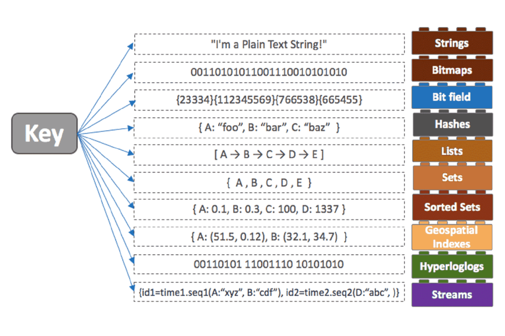

# 목차

<br>

- [목차](#목차)
- [Redis 자료구조와 명령어 \& 활용사례](#redis-자료구조와-명령어--활용사례)
- [Redis는 Key-Value 스토리지이다](#redis는-key-value-스토리지이다)
- [Key 설계](#key-설계)
- [Redis Collection](#redis-collection)
  - [Strings](#strings)
  - [Lists](#lists)
  - [Hashes](#hashes)
  - [Set](#set)
  - [Sorted sets](#sorted-sets)
  - [HyperLogLogs](#hyperloglogs)
  - [Streams](#streams)
- [활용 사례](#활용-사례)
  - [좋아요 기능](#좋아요-기능)
  - [랭킹보드](#랭킹보드)
  - [최근 검색 목록 표시](#최근-검색-목록-표시)
- [참고](#참고)

<br>

# Redis 자료구조와 명령어 & 활용사례
Redis는 BSD 라이센스 기반의 오픈소스이며, 캐시와 메시지 브로커등에 많이 사용되는 대표적인 인-메모리 데이터베이스이다.

Redis의 가장 큰 장점은 Key-Value 스토리지이면서, Value가 단순한 Object가 아닌 다양한 자료구조를 지원한다는 것이다.

> Redis에서는 이러한 자료구조를 자바와 동일하게 Collection이라고 부른다.

strings, hashes, lists, sets, sorted sets with range queries, bitmaps, hyperloglogs, geospatial indexes, stream등등 굉장히 많은 자료구조를 지원한다.

이번 글은 Redis의 각 자료구조를 알아보고 해당 자료구조를 이용할 때 사용되는 명령어를 정리해보려고한다.

그리고 각 자료구조별 활용사례도 간단히 정리해본다.

<br>

# Redis는 Key-Value 스토리지이다
Redis는 기본적으로 Key-Value 스토리지이다. 그리고 Redis의 Key는 문자열이면서 binary safe하다.

즉, Key에 "foo"와 같은 문자열부터 JPEG 이미지 파일에 이르기까지 모든 바이너리 시퀀스를 Key로 사용할 수 있다.

<br>

당연히 Key-Value이기에 Hash Collision (해시 충돌)이 발생하게 되는데, 이를 해결하기위해 Redis는 Chained Linked List를 사용한다.

> Key에 대한 해시 값은 murmurhash2 알고리즘을 사용하여 얻어낸다.

문제는 Chained Linked List의경우, 해시충돌이 많이 발생할수록 한 Bucket에 데이터가 많아지면서 탐색 속도가 O(n)만큼 느려진다는 것이다.

Redis는 이를 해결하기 위해서 hash table의 사이즈를 2배로 늘리는 정책을 채택하여 사용한다.

처음엔 4개 Bucket만 사용하다 일정 수준의 데이터가 쌓이면 2개 크기의 Bucket을 만들고 rehash하는 구조이다.

> 더 자세한 내용은 [Redis의 SCAN은 어떻게 동작하는가?](https://tech.kakao.com/2016/03/11/redis-scan/)와 [Redis 코드](https://github.com/redis/redis/blob/unstable/src/dict.c)를 참고. 추후에 이와 관련된 내용을 정리할 예정이다.

정리하면 Redis Hash Table은 보통 Dynamic Bucket에 충돌은 list로 처리하는 방식이다.

> 기존 [djb2에서 murmurhash2로 전환했다.](https://github.com/redis/redis/commit/da920e75d4836897b9a7109b6d4743e201cd8a4f)

<br>

# Key 설계

Key를 설계할 때 아래 사항들을 준수하여 설계하는 것이 좋다고한다.

* 길이가 긴 Key 설계는 Bad-Practice이다.
  * 예를 들어, 1024 바이트의 Key는 메모리 측면뿐만 아니라 Key 조회시 사용되는 비교 연산 비용도 증가하게된다.
  * 만약 긴 Key를 사용해야할 경우 SHA1와 같이 해싱을 하여 저장하는 것이 메모리와 대역폭의 관점에서도 좋다.
* 길이가 너무 짧은 Key 설계도 Bad-Practice이다.
  * 메모리와 비교 연산 비용, 대역폭을 줄일려고 `u1000flw`와 같이 짧게 Key를 설계하는 것보단 `user:1000:followers`처럼 하는 것이 읽기 쉽습니다.
  * 물론 짧으면 메모리를 적게 차지하므로, 이는 개발자가 잘 고려하여 설계하면 된다.
* `object-type:id`와 같은 컨벤션이 좋다.
  * 정해진 것은 없지만, 공식문서에서도 위 Key 컨벤션을 추천한다.
* Key의 최대 크기는 512MB이다.

<br>

# Redis Collection
Redis는 아래와 같이 다양한 자료구조를 지원한다.

<p align="center"><br>출처: https://redis.com/redis-enterprise/data-structures </p>

<br>

## Strings

<br>

💁‍♂️ **개념**

Strings는 Redis의 가장 기본적인 자료구조이다.

Value는 모든 종류의 문자열 (바이너리 데이터 포함)을 저장할 수 있으며, 보통 HTML이나 페이지 캐싱과 같이 다양한 방면에서 활용된다.

Value는 최대 512MB까지 저장할 수 있다.

기본적으론 SET와 GET을 통해 데이터를 저장 및 조회할 수 있다.

```shell
> set mykey somevalue
OK
> get mykey
"somevalue"
```

주의할 점은 SET의 경우 만약 기존에 동일한 KEY로 데이터가 저장되어있다면, Value가 새로운 값으로 오버라이딩된다.

<br>

💁‍♂️ **Multi 명령어**

한번에 여러 Key에 대한 값을 삽입 및 조회할 수 있다.

```shell
> mset mykey1 newval_1 mykey2 newval_2 mykey3 newval_3 mykey4 newval_4
OK

> mget mykey1 mykey2 mykey3 mykey4
1) "newval_1"
2) "newval_2"
3) "newval_3"
4) "newval_4"
```

* `mset <key1> <value1> <key2> <value2> ... <keyN> <valueN>`
  * 시간복잡도: O(N)
* `mget <key1> <key2> ... <keyN>`
  * 없는 key를 지정하면 `(nil)`을 리턴한다.
  * 시간복잡도: O(N)

<br>

💁‍♂️ **옵션**

SET 명령에 추가 옵션을 지원한다.

```shell
> set mykey newval

# mykey가 이미 존재하므로 아래 요청은 실패한다.
> set mykey newval_2 nx

# mykey가 이미 존재하므로 새로운 값이 입력된다.
> set mykey newval_2 xx

# mykey_2가 존재하지 않으므로 아래 요청은 실패한다.
> set mykey_2 newval_2 xx
```

* 키가 이미 존재하는 경우 SET을 수행하지 않도록 요청 -> `nx`
* 키가 이미 존재하는 경우에만 SET을 수행하도록 요청 -> `xx`

<br>

💁‍♂️ **Atomic한 증분 기능.**

```shell
> set counter 100
OK
> incr counter
(integer) 101
> incr counter
(integer) 102
> incrby counter 50
(integer) 152
```

Redis의 String은 INCR, DECR등을 통해 문자열 값을 정수로 바라보고 증분 기능을 제공한다.

이는 Atomic (원자적)이므로, 동일한 키에 대해 INCR을 발행하는 여러 클라이언트가 경합 상태에 빠지지 않는다.

예를 들어, A클라이언트가 "10"을 읽고 B클라이언트가 동시에 "10"을 읽고 둘 다 11로 증가한다고해도 새 값을 11가 아닌 12로 설정하게된다.

이는 웹 사이트 방문자수 기록등에 사용될 수도 있다.

<br>

💁‍♂️ **TTL 설정** (time to live)

Redis는 문자열 뿐만 아니라 Value 자료구조에 상관없이 Key에 대한 TTL을 설정할 수 있다.

설정한 TTL 시간이 경과하면 키가 자동으로 제거된다.

```shell
> set mykey some-value
OK

# TTL 설정
> expire mykey 5
(integer) 1

# 바로 조회하면 아래와 같이 값을 조회할 수 있다.
> get mykey
"some-value"

# 시간이 지나 값을 조회하면 아래와 같이 값이 비어있다.
> get mykey
(nil)
```

아래와 같이 SET할 때 TTL을 같이 요청할 수도 있다.
```shell
# TTL와 같이 SET 요청.
> set mykey 100 ex 10
OK

# TTL 조회
> ttl mykey
(integer) 9
```

<br>

💁‍♂️ **명령어**

가장 대표적인 명령어는 아래와 같다.

* SET
  * SET: 데이터를 저장하며 key가 이미있으면 덮어쓴다.
  * MSET: 여러 개의 데이터를 한번에 저장한다.
  * APPEND: 기존에 있는 키에 값을 추가하거나, 키가 없는 경우 SET 명령과 동일하게 저장한다.
* GET
  * GET: 데이터를 조회한다.
  * MGET: 여러 개의 데이터를 한번에 조회한다.
  * STRLEN: 데이터의 바이트수를 조회한다.
  * GETRANGE: 데이터의 일부 문자열을 조회한다.
* INCR
  * INCR: 1씩 증가, 만약 존재하지않던 Key면 1로 설정.
  * DECR: 1씩 감소, 만약 존재하지않던 Key면 -1로 설정.
* Enterprise
  * SETS: Value부분에 서브 쿼리를 사용해서 값 저장. (ex. `SETS mykey (GET key1)`)
  * DELS: Key부분에 서브쿼리를 사용해서 키를 삭제. (ex. `DELS (get mykey)`)

> 이외 전체 명령어는 [공식 문서](https://redis.io/commands/?group=string)를 확인.

<br>

## Lists

💁‍♂️ **개념**

Redis는 Value에 Lists를 저장할 수 있으며, 이는 Linked List 형식으로 저장된다.

즉, Linked List의 특징을 그대로 적용된다.

* 추가 / 삭제
  * 추가 - LinkedList는 노드를 연결하는 형태이므로, 새로운 데이터를 생성하여 포인터 값만 조정해주면 된다.
  * 삭제 - 삭제할 노드를 찾았다면 삭제는 노드 간의 포인터만 조절하면 되므로 굉장히 빠르다. 하지만, 삭제할 노드를 찾기 위해 탐색을 해야한다.
* 인덱스 조회
  * LinkedList는 노드를 연결하는 형태이므로, 메모리 상의 노드의 위치가 일정하지 않다. 즉, 요소를 하나하나 비교하여 찾아봐야 한다. O(n)

따라서 head-tail의 추가/삭제인 push / pop 연산에 자주 활용된다. (보통 잡 큐로 많이 사용된다.)

<br>

```shell
> rpush mylist A
(integer) 1

> rpush mylist B
(integer) 2

> lpush mylist first
(integer) 3

> lrange mylist 0 -1
1) "first"
2) "A"
3) "B"
```

<br>

💁‍♂️ **리스트 헤드와 테일쪽에 추가 및 삭제하는 작업에 유용하다**

Redis의 Lists는 리스트 헤드와 테일쪽에 추가 및 삭제하는 작업에 적합하다고 볼 수 있다. (LinkedList의 특징)

rpush와 rpop등을 통해 리스트를 십분 활용할 수 있다.

```shell
> rpush mylist 1 2 3 4 5 "foo bar"
(integer) 9

> lrange mylist 0 -1
1) "1"
2) "2"
3) "3"
4) "4"
5) "5"
6) "foo bar"

# pop
> rpush mylist a b c
(integer) 3
> rpop mylist
"c"
> rpop mylist
"b"
> rpop mylist
"a"
```

<br>

💁‍♂️ **제한된 개수의 리스트**

Lists의 대표적인 활용사례는 SNS등에서의 최신 업데이트되는 아이템을 최신순으로 저장하는 것이다.

그리고 Redis는 `LTRIM` 명령을 통해 가장 최근 N개의 항목만 기억하고 가장 오래된 항목은 모두 폐기하는 기능을 제공한다.

즉, **`LTRIM`은 `LRANGE`와 유사하지만 지정된 요소 범위 밖의 모든 요소를 제거한다.**

>  LTRIM: 인덱스로 지정한 범위 밖의 값들을 삭제

```shell
> rpush mylist 1 2 3 4 5
(integer) 5

> ltrim mylist 0 2
OK

> lrange mylist 0 -1
1) "1"
2) "2"
3) "3"
```

SNS등의 최신 업데이트된 아이템 N개만 저장하고싶다면 `List pust` + `List trim` 작업을 함께 수행하면 된다.

```shell
# 새 요소를 추가하고 1000개의 최신 요소만 목록으로 저장.
LPUSH mylist <some element>
LTRIM mylist 0 999
```

> 참고로 LRANGE는 O(N)이다.

<br>

💁‍♂️ **모든 Redis 자료구조는 추가할 때 대상 Key가 없으면 빈 컬렉션을 생성하고, 요소를 제거할 때 Value가 비어있으면 키가 자동으로 제거된다.**

* Redis의 자료구조에서 요소를 추가할 때 대상 Key가 없으면 요소를 추가하기 전에 빈 컬렉션을 생성한다.
* Redis의 자료구조에서 요소를 제거할 때 Value가 비어있으면 Key가 자동으로 제거된다.
  * Stream 유형은 제외.

```shell
# 예시 1 - 대상 key가 없으면 요소를 추가하기 전에 빈 컬렉션을 생성한다.
> del mylist
(integer) 1

> lpush mylist 1 2 3
(integer) 3

# 예시 2 - 대상 key가 존재하며 잘못된 유형에 대해 작업을 요청하면 에러가 발생한다.
> set foo bar
OK

> lpush foo 1 2 3
(error) WRONGTYPE Operation against a key holding the wrong kind of value

> type foo
string

# 예시 3 - 요소를 제거할 때 Value가 비어있으면 Key가 자동으로 제거된다.
> lpush mylist 1 2 3
(integer) 3

> exists mylist
(integer) 1

> lpop mylist
"3"

> lpop mylist
"2"

> lpop mylist
"1"

> exists mylist
(integer) 0
```

<br>

💁‍♂️ **명령어**

가장 대표적인 명령어는 아래와 같다.

* SET
  * LPUSH: Head에 데이터 저장.
  * RPUSH: Tail에 데이터 저장.
  * LSET: 인덱스로 특정 위치의 데이터 수정
  * LINSERT: 지정한 값 앞/뒤에 새 값 저장.
* GET
  * LRANGE: 인덱스로 범위를 지정하여 리스트 조회.
  * LINDEX: 인덱스로 특정 위치의 데이터 조회.
  * LLEN: 리스트에서 데이터의 총 개수를 조회.
* POP
  * LPOP: Head에서 데이터 조회후, 리스트에서 삭제.
  * RPOP: Tail에서 데이터 조회후, 리스트에서 삭제.
  * BLPOP: 리스트에 값이 없을 경우, 지정한 시간만큼 기다려서 값이 들어오면 LPOP 실행. (BLOCK POP)
  * BRPOP: 리스트에 값이 없을 경우, 지정한 시간만큼 기다려서 값이 들어오면 RPOP 실행. (BLOCK POP)
* REM
  * LREM: 값을 지정해서 삭제.
  * LTRIM: 인덱스로 지정한 범위 밖의 값들을 삭제.
* Enterprice
  * LPUSHS: 서브쿼리로 데이터 저장.
  * RPUSHS: 서브쿼리로 데이터 저장.

> 이외 전체 명령어는 [공식 문서](https://redis.io/commands/?group=list)를 확인.

<br>

## Hashes

💁‍♂️ **개념**

Redis에서 Hashes는 기존의 `Key : Value`의 Value안에 다시 `Key : Value`를 저장하는 자료구조이다.

> 파이썬의 딕셔너리나 JS 객체정도로 이해하면 된다. 
> 
> Redis에서는 Hashes안의 구성요소를 `field-value`로 보통 부르고있다.

Key 하위에 subkey를 이용해 추가적인 Hash Table을 제공하는 것이다.

```shell
> hset user:1000 username antirez birthyear 1977 verified 1
(integer) 3

> hget user:1000 username
"antirez"

> hget user:1000 birthyear
"1977"

> hgetall user:1000
1) "username"
2) "antirez"
3) "birthyear"
4) "1977"
5) "verified"
6) "1"
```

<br>

💁‍♂️ **명령어**

* SET
  * HSET: field-value를 저장.
  * HMSET: 여러 개의 field-value를 저장.
  * HSETNX: field가 기존에 없으면 저장.
* GET
  * HGET: field로 value 조회
  * HMGET: 여러 개의 value 조회
* REM
  * HDEL: field로 value 삭제
* INCR
  * HINCRBY: value를 increment만큼 증가 또는 감소.

> 이외 전체 명령어는 [공식 문서](https://redis.io/commands/?group=hash)를 확인.

<br>

## Set

💁‍♂️ **개념**

Redis의 Set 자료구조는 정렬되지 않는 문자열 모임과 같다. 

`SADD` 명령을 통해 Set에 주어진 요소가 이미 존재하는지 테스트하고 요소를 추가하게된다. 

이외에도 여러 Set간의 교집합, 합집합등의 다양한 기능을 제공한다.

```shell
> sadd myset 1 2 3
(integer) 3

> smembers myset
1. 3
2. 1
3. 2
```

위 `smembers`의 결과를 보면 알 수 있듯이, Set은 정렬하지 않는다.

즉, Redis의 Set은 조회시마다 임의의 순서로 요소를 반환한다.

<br>

💁‍♂️ **특정 멤버십에 존재하는 id인지 확인할 때 유용하다**

만약 특정 회원 id가 특정 멤버십에 가입되어있는지 확인한다고 가정한다면 아래와 같이 쉽게 구현할 수 있다.

```shell
# 존재할 경우
> sismember myset 3
(interger) 1

# 존재하지 않을 경우
> sismember myset 30
(integer) 0
```

<br>

💁‍♂️ **집합은 객체간의 관계를 나타낼 때도 유용하다. - 중요**

예를 들어, 뉴스와 태그 객체간의 관계를 나타낸다고 가정해본다.

Redis에선 이를 `key : value = 객체 id: Set<다른 객체 id>`로 구현할 수 있다.

우선 뉴스 -> 태그간의 관계를 구현하면 아래와 같다.

```shell
# 1000번 뉴스가 1, 2, 5, 77번 태그에 매핑되어있다고 가정한다면.
> sadd news:1000:tags 1 2 5 77

# 만약 1000번 뉴스의 모든 태그를 조회하고 싶다면 아래와 같이 조회하면 된다.
> smembers news:1000:tags
```

관계의 반대 방향인 태그 -> 뉴스는 아래와 같이 저장해주면 된다.

```shell
> sadd tag:1:news 1000
(integer) 1

> sadd tag:2:news 1000
(integer) 1

> sadd tag:5:news 1000
(integer) 1

> sadd tag:77:news 1000
(integer) 1
```

이때 만약 1, 2, 5 태그에 모두 속한 뉴스를 조회하고 싶다면 교집합인 `SINTER` 명령어를 활용하면 된다.

```shell
> sinter tag:1:news tag:2:news tag:5:news
1) "1000"
```

이렇게 교집합외에도 합집합 (union), 차집합 (difference), 임의 요소 추출등의 명령을 활용할 수 있다.

> Set의 많은 기능을 통해 다양한 문제를 해결할 수 있지만, 데이터 전부 다 갖고오는 명령들이 있기에 주의해서 사용해야한다.

<br>

💁‍♂️ **명령어**

* SET
  * SADD: set에 member 추가.
  * SMOVE: 소스 set의 member를 목적 set으로 이동.
* GET
  * SMEMBERS: set의 모든 member 조회.
  * SCARD: set에 속한 member의 객수를 조회.
  * SRANDMEMBER: set에서 무작위로 member를 조회.
  * SISMEMBER: set에 member가 존재하는지 확인. (여러 개 조회 가능)
  * SSCAN: member를 일정 단위 객수 만큼씩ㅈ ㅗ회.
* POP
  * SPOP: set에서 무작위로 member 가져오기.
* REM
  * SREM: set에서 member를 삭제.
* 집합연산
  * SUNION: 합집합
  * SINTER: 교집합
  * SDIFF: 차집합

> 이외 전체 명령어는 [공식 문서](https://redis.io/commands/?group=set)를 확인.

<br>

## Sorted sets

💁‍♂️ **개념**

Sorted sets은 Set과 Hash를 혼합한 것과 유사하다. 

Sorted sets은 고유하고 반복되지 않는 문자열 요소로 구성되기에 Set과 동일한 특징을 가지지만, Set과 다르게 집합의 모든 요소는 점수라고하는 부동 소수점 값을 가지고있다.

이렇게 요소마다 부동 소수점을 가지는건 Hash와 유사한 특징이라고 볼 수 있다.

그리고 이 값을 통해 Sorted sets은 항상 정렬된 상태로 저장되게된다.

```shell
> zadd hackers 1940 "Alan Kay"
(integer) 1

> zadd hackers 1957 "Sophie Wilson"
(integer) 1

> zadd hackers 1953 "Richard Stallman"
(integer) 1

> zadd hackers 1949 "Anita Borg"
(integer) 1

> zadd hackers 1965 "Yukihiro Matsumoto"
(integer) 1

> zadd hackers 1914 "Hedy Lamarr"
(integer) 1
```
위 예시는 태어난 년도를 점수로 사용해서 저장한 예시이다.

`ZADD`를보면 `SADD`과 굉장히 유사한 것을 알 수 있으며, 값이전에 score (점수)를 부여해서 저장하는 것을 알 수 있다.

보통 랭킹 관련 작업에 많이 사용된다.

> 만약 score값이 같으면 String의 사전 순으로 정렬되어 저장된다.

<br>

💁‍♂️ **데이터가 저장될때부터 score 순으로 정렬되며 저장된다**

Sorted set은 데이터가 저장될 때마다 score 순으로 정렬되어 저장되며, 요소를 추가하는 시간 복잡도는 `O(log(N))`이다.

조회할 때 이미 정렬된 순서로 저장하고있기에 굉장히 빠르게 정렬된 데이터를 가져올 수 있다.

```shell
> zrange hackers 0 -1

1) "Hedy Lamarr"
2) "Alan Kay"
3) "Anita Borg"
4) "Richard Stallman"
5) "Sophie Wilson"
6) "Yukihiro Matsumoto"
```

> 만약 내림차순을 하고싶다면 `zrevrange`을 사용하면 된다.

<br>

💁‍♂️ **대표적인 활용예시 - 유저 랭킹보드**

Sorted sets의 `ZADD` 명령어를 통해 score는 언제든지 업데이트할 수 있으므로, 이를 활용하여 유저 랭킹보드를 구현할 수 있다.

예를 들어, 상위 N위나 사용자의 순위를 Sorted sets을 활용하여 쉽게 구현할 수 있다.

<br>

💁‍♂️ **명령어**

* SET
  * ZADD: set에 score와 member 추가.
* GET
  * ZRANGE: index로 범위를 지정하여 조회.
    * ZREVRAGE (내림차순)
  * ZRANGEBYSCORE: score로 범위를 지정해서 조회.
    * ZREVRANGEBYSCORE (내림차순)
  * ZRANGEBYLEX: member로 범위를 지정해서 조회.
    * ZREVRANGEBYLEX (내림차순)
  * ZRANK: member를 지정해서 rank (index)를 조회.
    * ZREVRANK (내림차순)
  * ZSCORE: member를 지정해서 score 조회.
  * ZCARD: set에 속한 member의 개수 조회.
  * ZCOUNT: score로 범위를 지정해서 개수 조회.
  * ZLEXCOUNT: member로 범위를 지정해서 개수 조회.
  * ZSCAN: score, member를 일정 단위 개수만큼씩 조회.
* POP
  * ZPOPMIN: 작은 값부터 조회 및 제거.
  * ZPOPMAX: 큰 값부터 조회 및 제거.
* REM
  * ZREM: set에서 member 삭제.
  * ZREMRANGEBYRANK: index 범위로 member 삭제.
* INCR
  * ZINCRBY: 지정한 만큼 score 증가 및 감소.
* 집합연산
  * ZUNIONSTORE: 합집합 구해서 새로운 set에 저장.
  * ZINTERSTORE: 교집합을 구해서 새로운 set에 저장.

> 이외 전체 명령어는 [공식 문서](https://redis.io/commands/?group=sorted-set)를 확인.

<br>

## HyperLogLogs

💁‍♂️ **개념**

HyperLogLogs는 굉장히 많은 양의 데이터를 dump할 때 사용된다.

주로 중복되지 않는 대용량 데이터를 카운트할 때 많이 사용된다.

set과 유사하지만, 저장되는 용량이 매우 작다. (저장 되는 모든 값이 12kb로 고정)

보통은 대용량이며 유니크한 값을 카운팅할 때 사용된다.

예를 들어, 웹 사이트 방문 ip 개수 카운팅, 크롤링한 url 개수 카운팅, 검색 엔진에서 검색 한 단어 카운팅.

<br>

💁‍♂️ **명령어**

* PFADD: 요소 추가
* PFCOUNT: 요소 개수 조회
* PFMERGE: 집합 머지

<br>

## Streams

💁‍♂️ **개념**

Redis의 Streams는 append-only만 가능하며 중간에 데이터가 바뀌지 않는 구조여서 로그를 저장하는데 최적화된 자료구조이다.

`tail -f` 사용하는 것과 유사하다고 보면 된다.

Redis는 각 Stream 항목에 대해 고유한 ID를 생성하며, 이러한 ID를 사용하여 연결된 스트림을 검색허나 후속 처리를 진행할 수 있다.

<br>

💁‍♂️ **Streams는 사용하는 대표적인 예시는 아래와 같다.**

* 이벤트 소싱 (사용자 액션, 클릭등을 추적하기 위함)
* 센서 모니터링
* 알림 (각 사용자의 알림 기록을 별도의 스트림에 저장하기 위함.)

<br>

💁‍♂️ **명령어**

* XADD: 데이터 추가
* XREAD: 데이터 읽기
* XDEL: 데이터 삭제
* XTRIM: 데이터 여러 개 삭제

<br>

# 활용 사례

<br>

## 좋아요 기능

<br>

## 랭킹보드

<br>

## 최근 검색 목록 표시

<br>

# 참고
* https://redis.io/docs/data-types/
* https://redis.io/docs/data-types/tutorial/


