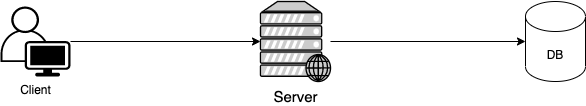
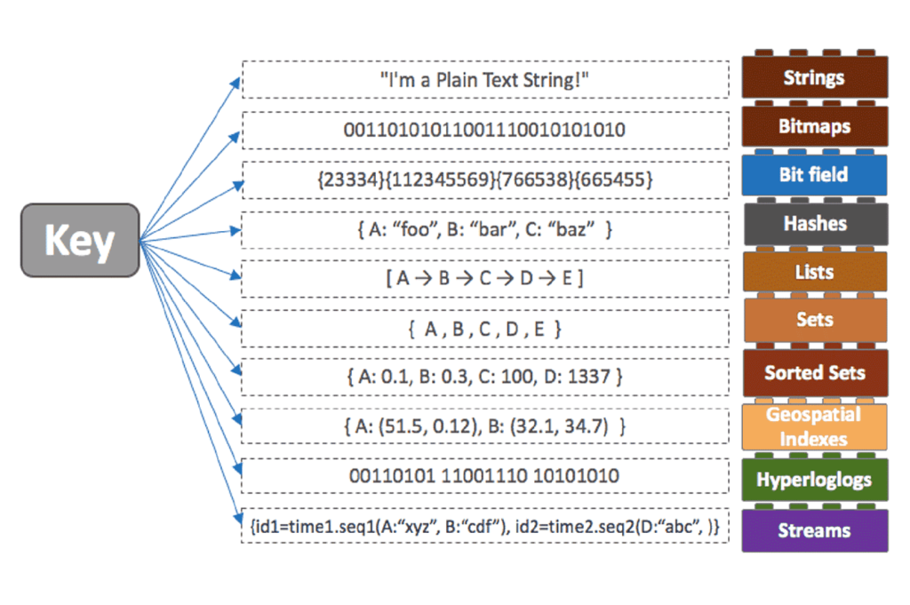
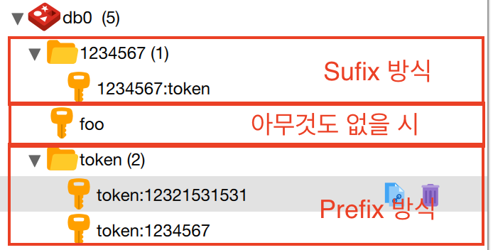
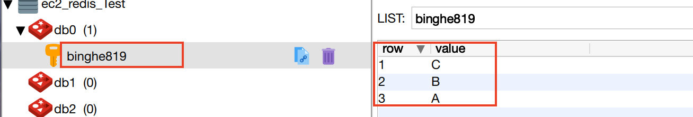
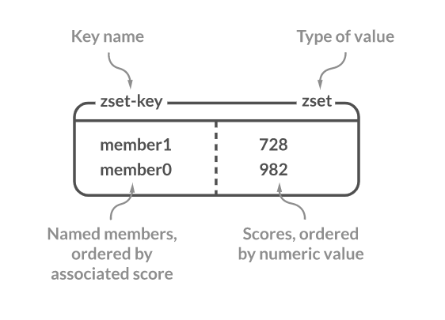
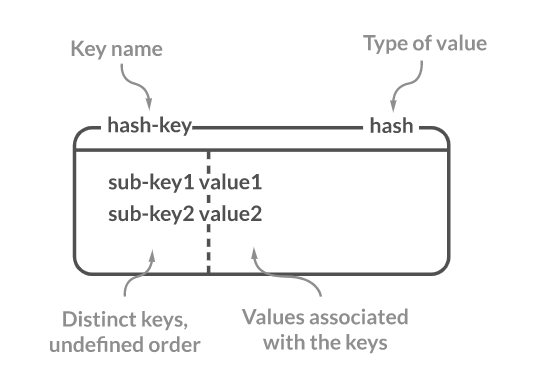
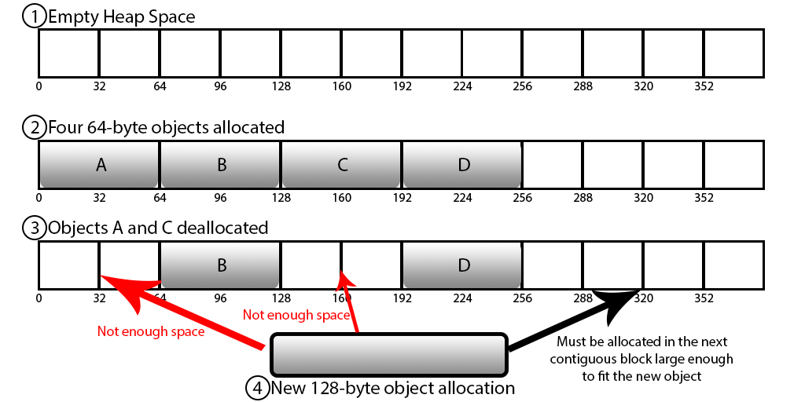

# 목차

 

- [목차](#목차)
- [개요](#개요)
- [Redis 개념](#redis-개념)
  - [Redis 개념 소개](#redis-개념-소개)
  - [Cache](#cache)
  - [Redis는 언제 사용되는가?](#redis는-언제-사용되는가)
- [왜 Collection이 중요한가?](#왜-collection이-중요한가)
  - [개발의 편의성](#개발의-편의성)
  - [개발의 난이도](#개발의-난이도)
- [Redis Collections](#redis-collections)
  - [Strings](#strings)
  - [List](#list)
  - [Set](#set)
  - [Sorted Set](#sorted-set)
  - [Hash](#hash)
  - [Collection 주의 사항 - 중요](#collection-주의-사항---중요)
- [Redis 운영](#redis-운영)
  - [메모리 관리를 잘하자](#메모리-관리를-잘하자)
  - [O(N) 관련 명령어를 주의하라](#on-관련-명령어를-주의하라)
  - [Replication](#replication)
  - [권장 설정 Tip](#권장-설정-tip)
- [Redis 모니터링](#redis-모니터링)
- [마치며](#마치며)

 

# 개요
필자는 프로젝트를 진행하며 Refresh Token을 외부 저장소에 저장해야했다.

그리고 여러 DB를 알아보다 Token 저장소와 캐싱 용도로 많이 사용된다는 Redis를 사용했다.

그 이유는 Token 저장소에 경우 빈번히 조회를 하기 때문에, 일반적인 디스크 I/O를 통한 DB보다는 메모리를 사용하는 Redis가 유리하다고 판단해서이다.

하지만, 그 과정에서 Redis이 추구하는 철학이나 사용법에 대해서 전혀 몰라서.. 굉장히 난감했고, 현재도 잘 사용하는 것인지 사실 모른다.

그저 CRUD만 하기엔 자료구조나 설정하는 부분이 많다. 설치부터 설정, 그리고 자료구조 선택등등

그래서 이번 기회에 강대명님이 발표하신 [우아한 레디스](https://www.youtube.com/watch?v=mPB2CZiAkKM&t=12s)와 [공식 문서 내용](https://redis.io/documentation)을 정리해보고자한다.

 

# Redis 개념

 

## Redis 개념 소개

🤔 **Redis 개념 소개**
* **Redis => `REmote DIctionary Server`**
  * 중요한 점은 `key:value`형식의 `dictionary` 저장소라는 것.
* In-Memory Data Structure Store
  * 프로세스로 존재하며, 보통 remote에 존재한다.
  * DB, Cache, Message Broker로 사용된다.
* Open Source (BDS 3 License)
* Support data structures (key:value)
  * Strings, set, sorted-set, hashes, list
  * Hyperloglog, bitmap, geospatial index
  * Stream
* 다양한 기능을 제공
  * Build-In Replication
  * 트랜잭션
  * different levels of on-disk persistence
  * 클러스터링 등등
* Only 1 Committer
  * Redis 소스 코드를 고칠 수 있는 권한이 있는 사람은 딱 한 명!

 

## Cache
> Redis는 캐싱을 위해 많이 사용되므로 캐싱에 대해 알면 도움이 된다.

🤔 Cache란?
* Cache는 나중에 요청을 결과를 미리 저장해두었다가 빠르게 서비스를 해주는 것을 의미
  * ex. Factorial -> 10! = 10 * 9! (9!를 캐싱해두면 연산이 훨씬 빨라짐)
  * ex. DP
  * 운영체제도 CPU가 디스크에 접근하는 속도가 느리므로, 중간에 캐시를 많이 둬서 이를 빠르게 사용하도록 한다.
* 파레토 법칙
  * 20:80 법칙으로, 우리 사회에서 일어나는 현상의 80%는 20%의 원인으로 인하여 발생한다. (캐싱을 잘 설명해주는 유비쿼터스)
  * 즉, 전체 요청의 80%는 20%의 사용자이다. (캐싱을 사용해야 하는 이유)

 

💁‍♂️ 웹 서버에서 사용되는 Cache 구조

 

**아주 추상적인 웹 서비스 구조**

 

* 캐싱을 적용하지 않은 구조
  * DB안에 모든 데이터가 존재하는 구조.
  * 디스크에 데이터를 저장하는 일반적인 구조.

 

**Look aside Cache**

 

* Web Server는 데이터가 존재하는지 Cache를 먼저 확인한다.
  * Cache에 데이터가 있으면 Cache에서 값을 가져온다.
  * Cache에 데이터가 없다면 DB에서 데이터를 가져와서 Cache에 저장하고 값을 가져온다.
* Write하는 방식
  * 방법1. 애플리케이션이 새로운 데이터 쓰기 혹은 업데이트할 때 캐시와 DB 모두에 같은 작업을 실행하는 방법.
  * 방법2. 애플리케이션의 모든 쓰기 작업은 DB에만 적용되고, 기존의 캐시 데이터를 무효화시키는 방법.

 

**Write Back**

 

* Web Server는 모든 데이터를 Cache에만 저장한다.
  * Cache에 특정 시간동안의 데이터가 저장된다.
  * 그리고 배치처리를 통해 Cache에 있는 데이터를 DB에 저장한다.
  * DB에 저장되었다면 Cache에는 해당 데이터를 삭제한다.
* 이 방식의 단점
  * 장애가 생기면 데이터가 날아갈 수도 있다. 안정성 부분에서 불안한다.
  * 그래서 로그를 Redis에 넣어두고 배치적으로 저장할 때 많이 사용된다.

> 질문 Q: insert 쿼리를 한번씩 500번 날리는 것과 insert 쿼리 한번에 500개를 붙여서 날리는 것중 어느 것이 더 빠를까?
> * 후자가 훨씬 빠르다. write back은 이 원리를 이용한 방식이다.

 

## Redis는 언제 사용되는가?
* Remote Data Store
  * A 서버, B 서버, C 서버에서 데이터를 공유하고 싶을 때
* 한대에서만 필요한다면, 전역 변수를 쓰면 되지 않는가?
  * Redis 자체가 Atomic을 보장해주기 때문. (싱글 스레드라.. Thread Safe하다)
  * 물론 특정 상황에서 완벽하진 않다고 한다.
* 주로 많이 사용되는 곳
  * 인증 토큰 등을 저장 (Strings 또는 hash)
  * Ranking 보드로 사용 (Sorted Set)
  * 유저 API Limit
  * 잡 큐 (list)

 

# 왜 Collection이 중요한가?
> 이 부분은 Redis의 장점과 Memcached보다 Redis가 왜 좋은지에 대해 이해하는데 도움이 된다.

결론은 외부의 Collection을 잘 이용하는 것으로, 여러가지 개발 시간을 단축시키고, 문제를 줄여줄 수 있기 때문에 Collection이 중요하다.

Redis가 제공하는 자료구조를 이용한다면 비즈니스 로직에 더욱 집중할 수 있다.

 

## 개발의 편의성
> 간단한 예시를 통해 Collection의 개발 편의성에 대해서 살펴보자.

 

🤔 **랭킹 서버를 직접 구현한다면?**

* 가장 간단한 방법
  * DB에 유저의 Score를 저장하고 Score로 Order by하고 정렬 후 읽어오기
  * 하지만 이 방식은 데이터가 많아지면 속도에 문제가 발생하게 된다. 결국은 디스크를 사용하기 때문이다. (그래서 In-Memory 방식이 필요하다.)
* In-Memory로 구현한다면?
  * Redis의 Sorted Set을 이용하면, 랭킹을 구현 할 수 있다.
  * 다만 가져다 쓰면 거기의 한계에 종속적이게 된다. 즉 커스텀이 조금 필요하다.
    * 랭킹에 저장해야할 id가 1개당 100byte라고 한다면 -> 10,000,000,000 (100억)이면 1TB까지 된다.
    * 물론 100억명에 1TB면 괜찮다고 볼 수도 있다. (웬만하면 커스텀할 일은 없을 듯..)

 

## 개발의 난이도
> 간단한 예시를 통해 Collection의 개발 난이도에 대해서 살펴보자.

🤔 **친구 리스트를 `KEY:VALUE` 형태로 저장해야 한다면?**

* KEY(friends) 123에 B와 C 친구를 추가한다면 가정한다면
  * Transaction 1 (B 추가), Transaction 2 (C 추가)가 서로 동일한 시간에 실행되면 ACID를 만족시키지 못할 수도 있다.
  * 즉, B나 C중 하나는 추가가 안 될 수도 있다. (Race Condition)
* 그렇다면 Redis는?
  * 자료구조가 Atomic하기 때문에, 해당 Race Condition을 피할 수 있다. (Single Thread이기 때문이다)
  * 즉, 어떻게해서든 insert하면 Race Condition이 발생하지 않는다.
    * 그래도 잘못짜면 발생할 수도 있다고 한다 -> 두 번 연속 클릭하여 중복된 데이터가 쌓일 수도 있다는 의미. Atomic은 지켜진다.

 

# Redis Collections
이번 챕터에선 Redis에서 지원하는 각각의 자료구조에 대한 설명과 선택하는 기준에 대해서 다룬다.

 출처: https://redis.com/redis-enterprise/data-structures

 

## Strings

🤔 **개념과 기본적인 사용법**
* 개념
  * 기본적인 `KEY:VALUE`형태
* 사용법
  * 삽입
    * Single: `Set <key> <value>` (ex. `Set token:1234567 abcdefdkfdakd`)
    * Multi: `mset <key1> <value1> <key2> <value2> ... <keyN> <valueN>` (ex. `mset token:1234567 abcdfda email:123456 binghe@naver.com`)
  * 조회
    * Single: `Get <key>` (ex. `Get token:1234567`)
    * Multi: `mget <key1> <key2> ... <keyN>` (ex. `mget token:1234567 email:123456`)
* 주의할 사항
  * KEY를 어떻게 설정하느냐가 중요하다 -> 어떻게 설정하느냐에 따라 아래와 같이 다르게 저장된다.

 

 

🤔 간단한 SQL을 대체한다면?
* SQL: `insert into Users(name, email) values ('binghe819', 'binghe819@naver.com')`
* Redis
  * Set을 사용한다면
    * `Set name:binghe819 binghe819`
    * `Set email:binghe819 binghe819@naver.com`
  * mset을 사용한다면
    * `mset name:binghe819 binghe819 email:binghe819 binghe819@naver.com`

 

## List
🤔 **개념과 기본적인 사용법**
* 개념
  * 일반적인 List와 동일하다.
  * **앞과 뒤에서 넣는 것은 빠르다. 하지만 중간에 삽입하는 것이 느리다.**
  * 보통 잡 큐로 많이 사용된다.
* 사용법
  * insert
    * `Lpush <key> <A>` -> `Key:(A)`
    * `Rpush <key> <B>` -> `Key:(A, B)`
    * `Lpush <key> <C>` -> `Key:(C, A, B)`
    * `Rpush <key> <D, A>` -> `Key:(C, A, B, D, A)`
  * pop
    * `Key:(C, A, B, D, A)`
    * `LPOP <key>` -> `Pop C, Key:(A, B, D, A)`
    * `RPOP <key>` -> `Pop A, Key:(A, B, D)`
  * lpop, blpop, rpop, brpop
    * `Key: ()`
    * `LPOP <key>` -> `No data`
    * `BLPOP <key>` -> 누가 데이터를 Push하기 전까지 대기

실제 Redis에는 다음과 같이 저장된다.

 

> strings과 동일하게 key를 통해 카테고리를 만들 수 있다.

 

## Set
🤔 **개념과 기본적인 사용법**
* 개념
  * 중복된 값을 넣지 않는 자료구조.
  * 데이터가 있는지 없는지만 체크하는 용도로 사용된다.
* 사용법
  * `SADD <key> <value>` -> Value가 이미 Key에 있으면 추가되지 않는다.
  * `SMEMBERS <key>` -> 모든 Value를 반환.
  * `SISMEMBER <key> <value>` -> value가 존재하면 1, 없으면 0
* 예시
  * 특정 유저를 팔로우하는 목록을 저장할 때 많이 사용된다. (unique한 특징이 있을 때!)

 

## Sorted Set

 출처: https://redis.com/redis-enterprise/data-structures

 

🤔 **개념과 기본적인 사용법**
* 개념
  * Set은 순서가 없는데, Sorted Set은 순서를 보장한다.
* 사용법
  * `ZADD <key> <score> <value>` -> Value가 이미 key에 있으면 해당 Score로 변경된다.
  * `ZRANGE <key> <startIdx> <endIdx>` -> 해당 Index 범위 값을 모두 돌려준다. (모든 범위는 `Zrange testkey 0 -1`)
* 특징
  * **Set의 숫자는 double 타입이기 때문에, 값이 정확하지 않을 수 있다. - 중요**
    * 컴퓨터에서는 실수가 표현할 수 없는 정수값들이 존재한다.
    * 그래서 문자열을 사용하는 경우도 있다.

 

🤔 간단한 SQL을 대체한다면?
* SQL: `select * from rank order by score limit 50, 20;`
  * Redis: `zrange rank 50 70`
* SQL: `select * from rank order by score desc limit 50, 20;`
  * Redis: `Zrevrange rank 50 70`

 

## Hash

 출처: https://redis.com/redis-enterprise/data-structures

 

🤔 **개념과 기본적인 사용법**
* 개념
  * `Key:Value`안에 다시 `Key:Value`를 가질 수 있게 한다.
* 사용법
  * `Hmset <key> <subkey1> <value1> <subkey2> <value2>`
  * `Hgetall <key`> -> 해당 key의 모든 subkey와 value를 가져온다.
  * `Hget <key> <subkey>`
  * `Hmget <key> <subkey1> <subkey2> ... <subkeyN>`

 

🤔 간단한 SQL을 대체한다면?
* SQL: `insert into Users(name, email) values ('binghe819', 'binghe819@gmail.com')`
  * Redis: `hmset binghe819 name binghe819 email binghe819@naver.com`

 

## Collection 주의 사항 - 중요
* 하나의 컬렉션에 너무 많은 아이템을 담으면 좋지 않다.
  * 10000개 이하 몇 천개 수준으로 유지하는게 좋다.
* Expire는 컬렉션의 item 개별로 걸리지 않고 전체 Collection에 대해서만 걸리게 된다.
  * 즉, 해당 10000개의 아이템을 가진 Collection에 expire가 걸려있다면 그 시간 후에 10000개의 아이템이 모두 삭제될 수도 있다.

 

# Redis 운영
Redis 운영 부분은 크게 4가지로 볼 수 있다.
1. 메모리 관리를 잘하자.
2. O(N) 관련 명령어는 주의하자.
3. Replication
4. 권장 설정 Tip

 

## 메모리 관리를 잘하자
정말 쉽게 보면 메모리를 여유롭게 사용하면 큰 문제 없다. 

물론 이외에도 여러가지 생각할 부분들이 있긴 하다.

 

💁‍♂️ **메모리 관리의 중요성**
* Redis는 In-Memory Data Store이므로 메모리 관리를 정말 잘해야한다.
* **Physical Memory 이상을 사용하면 문제가 발생한다.**
  * **Swap이 있다면 Swap을 사용한다. 다만, Swap 사용으로 해당 메모리 Page 접근시 마다 늦어진다. (결국 디스크를 읽어야하기 때문에)**
    * 레이턴시가 증가하게되고, Redis가 싱글 스레드이기 때문에 성능적 큰 문제가 발생할 수 있다.
  * Swap이 없다면 Redis가 죽을 수 있다.
* Maxmemory를 설정하더라도 이보다 더 사용할 가능성이 크다.
  * Maxmemory란 설정 값보다 Redis가 큰 용량을 차지하면, 랜덤 키를 삭제하거나, expire 목록을 지우고, 쓰기 작업을 하는 설정
  * 다만, Redis는 메모리에 할당할 때 `jemalloc`을 사용하는데, 이로 인해 Redis는 자기가 얼마나 메모리를 사용하는 중인지 정확히 알 수는 없다고 한다.
  * 즉, **메모리 파편화**로 인해 실제론 12M를 사용중인데, Redis는 1MB만 사용중이라고 파악할 수도 있다. 그래서 Maxmemory 설정을 해도 무용지물일 수도 있다.
* RSS 값을 모니터링 해야한다.

 메모리 파편화

> 실제 많은 업체가 현재 메모리를 사용해서 Swap을 쓰고 있다는 것을 모를 때가 많다.. 모니터링을 통해 이를 방지해야한다.

 

💁‍♂️ **메모리를 큰 단위보단 작은 단위로 사용하는 것이 좋다.**
* 큰 메모리를 사용하는 instance 하나보다는 적은 메모리를 사용하는 instance 여러 개가 더 안전하다고 한다.
  * CPU 4 Core, 32GB Memory 인스턴스에서 24GB짜리 Redis 하나 보단 8GB + 8GB + 8GB가 더 좋다고 한다.
* 그 이유는 Redis는 필연적으로 Master에서 Slave로 fork할 때 READ는 문제 없지만, Write할 때 메모리를 최대 2배 사용할 수도 있다.
  * Write할 부분을 복사해야하기 때문에 메모리를 더 사용해야하는데, 만약 분리된 8기가에서 fork가 일어난다면 2배 해봤자 16기가인데, 24기가에서 fork가 일어나면 48기가로 굉장히 높아진다.

 

🤔 **메모리가 부족하다면?**
* Cache is Cash
  * 데이터를 일정 수준에서만 사용하도록 특정 데이터를 줄이자.
  * 다만 이미 Swap을 사용중이라면, 프로세스를 재시작해야한다.
* 혹은 60 ~ 70%를 사용중일 때 이전시키면 된다.

 

🤔 **메모리를 줄이기 위한 설정**
* 기본적으로 Collection 들은 다음과 같은 자료구조를 사용한다.
  * Hash -> HashTable을 하나 더 사용
  * Sorted Set -> Skiplist와 HashTable을 사용.
  * Set -> HashTable 사용.
  * 해당 자료구조들을 그냥 사용하면 생각보다 메모리를 많이 사용한다.
* Ziplist를 이용하자.
  * Redis 자료구조를 사용할 때 내부적으로 사용되는 자료구조를 변경할 수 있다. 이때 Ziplist로 변경해주면 된다.
  * Ziplist는 그냥 선현 자료구조이며, In-Memory 특성상 적은 개수라면 선형 탐색도 빠르기 때문에 이를 사용하는 것이다.
    * HashTable이 빠르긴하지만, 적은 개수라면 리스트의 요소들을 비교하면서 선형 탐색하는 것도 느리지 않다.
  * 이는 속도는 조금 느려지는데, 용량을 비교적 적게 사용한다.
  * 다양한 설정을 할 수 있다.
    * `hash-max-ziplist-entries`, ...

 

## O(N) 관련 명령어를 주의하라

 

💁‍♂️ **Redis는 Single Thread다.**
* Redis는 Single Thread이므로 동시에 여러 개의 명령을 처리할 수 없다. 즉, **동시에 한 개의 명령어 밖에 사용할 수 없다.**
  * 즉, 기존의 CPU 처리 방식처럼, 여러 명령을 줄을 세우고 특정 개수만큼씩 처리하게 된다.
* 참고로 단순한 get/set의 경우, 초당 10만 TPS 이상 가능하다. (물론 CPU 속도에 영향을 받는다고 한다.)
  * 하지만 만약 하나의 명령이 1초가 걸리게 되면, 최악의 경우 `10-1`의 명령은 1초 동안 대기해야 한다.
  * Timeout을 0으로 설정했다면 당연히 서비스가 터질 수도 있다.

 

💁‍♂️ **대표적인 O(N) 명령들**
* KEYS
  * 모든 key를 순회하는 명령.
  * 대안
    * `scan` 명령을 사용하는 것으로 하나의 긴 명령을 짧은 여러번의 명령으로 바꿀 수 있다. (짧게 여러번)
* FLUSHALL, FLUSHDB
  * 데이터 다 날리는 명령.
* Delete Collections
  * item이 백만개 있는 Collection을 삭제하면 1-2초 걸리게 된다. 그럼 1-2초 동안 아무것도 못함..
* Get All Collections
  * 하나의 Collection안에 10만개정도를 넣고, 모두를 가져온다면 굉장히 느려질 수 있다.
  * 대안
    * Collection의 전체가 아닌 일부만 가져오거나
    * 큰 Collection을 작은 여러 개의 Collection으로 나눠서 저장
      * Userranks -> Userrank1, Userrank2, Userrank3
      * 하나당 몇천개 안쪽으로 저장하는 게 좋다.
      * ex. 1~1000번 key까지는 server1, 1001 ~ 2000번 key까지는 server2 ...

 

💁‍♂️ **대표적인 실수 사례**
* Key가 백만개 이상인데 확인을 위해 `KEYS` 명령을 사용하는 경우
  * 모니터링 스크립트가 일초에 한번씩 keys를 호출할 경우.. 끔찍하다.
* 아이템이 몇만개 든 hash, sorted set, set에서 모든 데이터를 가져오는 경우
* 예전 버전의 Spring Security OAuth RedisTokenStore

 

## Replication

 

💁‍♂️ Redis Replication
* Redis의 Replication은 Async Replicationd이다.
  * Replication Lag이 발생할 수 있다.
  * 즉, Master의 데이터가 변경되어, Slave도 바꾸라고하는데, 이 과정에서 레이턴시로 인해 데이터가 다르거나, 아직 slave에 데이터가 없는 경우도 있다.
* Redis 5.0.0 부터는 명칭을 Master-Slave가 아닌 Original-Replication 혹은 Primary-Secondary로 변경되었다.
* Redis Replication은 DBMS로 보면 statement replication와 유사하다.
  * DBMS의 raw replication이 아닌 statement replication이다. 즉, 쿼리를 보내는 것.
  * 이때, `now()`와 같은 쿼리 명령을 잘 사용해야한다. Original와 Replication의 값이 다를 수도 있기 때문!

 

💁‍♂️ Replication 설정 과정
* Secondary에 replicaof or slaveof 명령을 전달
* Secondary는 Primary에 sync 명령을 전달
* Primary는 현재 메모리 상태를 저장하기 위해 Fork를 진행 (프로세스를 복사)
* Fork한 프로세스는 현재 메모리 정보를 disk에 dump (Fork로 인해 메모리와 디스크 용량을 많이 사용한다)
* 해당 정보를 Secondary에 전달한다.
* Fork 이후의 데이터를 Secondary에 계속 전달한다. 

 

💁‍♂️ Redis Replication 주의 사항
* Replication 과정에서 Fork가 발생하므로 메모리 부족이 발생할 수 있다.
  * `Redis-cli --rdb`도 동일하게 메모리 스냅샷을 가져오므로 같은 문제가 발생한다.
* AWS나 클라우드의 Redis는 조금 다르다고 한다.
* 많은 대수의 Redis 서버가 Replica를 두고 있다면
  * 네트워크 이슈나, 사람의 작업으로 동시에 replication이 재시도 되도록하면 문제가 발생할 수도 있다.
  * ex. 같은 네트워크안에서 30GB를 쓰는 Redis Master 100대 정도가 리플레케이션을 동시에 재시작하면 네트워크 이슈가 발생할 수 있다.

 

## 권장 설정 Tip
* Maxclient 설정 50000
  * 높게 설정하는 것이 좋다. 해당 설정 값만큼만 동시 접속자를 받기 때문.
* RDB/AOF 설정 off
  * 성능/안정성 부분에서 끄는 것이 좋다.
* 특정 commands disable
  * Keys
  * AWS의 ElsticCache는 이미 하고 있음.
* 전체 장애의 90% 이상이 Keys와 Save 설정을 사용해서 발생.
  * Save 설정은 특정 시간안에 데이터가 특정 개수만큼 바뀌면 디스크에 dump를 하는 것인데 디스크 I/O로 인해 성능상 좋지 않다.
* 적절한 ziplist 설정

# Redis 모니터링

 

🤔 **Redis가 어떤 상태인지 모니터링하려면 어떤 지표를 봐야할 까?**
* Redis Info를 통한 정보
  * RSS (Pysical Memory를 얼마나 사용하느냐)
  * Used Memory
  * Connection 수
  * 초당 처리 요청 수 (CPU에 영향을 받는다)
* System
  * CPU
  * Disk
  * Network rx/tx

 

🤔 CPU가 100%를 칠 경우
* 처리량이 매우 많다면?
  * Redis는 싱글 스레드이므로, 좀 더 좋은 CPU를 가진 서버로 이전하면 된다. (특히 클럭수)
  * 그 이유는 실제 CPU 성능에 영향을 받는다고 한다.
    * 그러나 단순 get/set은 초당 10만 이상 처리 가능하다고 한다.
* O(N) 계열의 특정 명령이 많은 경우
  * Monitor 명령을 통해 특정 패턴을 파악하는 것이 중요하다.
  * 다만, Monitor 잘못쓰면 부하로 해당 서버에 큰 문제가 있을 수 있기 때문에 짧게 쓰는게 좋다.

 

# 마치며
이번 글에서 언급한 기능들이나 개념들 말고도 Redis는 많은 기능을 제공한다.

예를 들어 클러스터링이나 Disk에 저장하는 기능등등.

하지만 이제 막 Redis를 사용하기 시작한 필자에겐 이정도면 충분하다고 생각든다.

추후에 더 많은 기능을 사용하거나, 삽질을 통한 주의할 점이 있다면 글을 작성할 예정.

마지막으로 Redis를 전혀 몰랐는데, 이해에 많은 도움이 준 강대명님께 감사하다! :)

