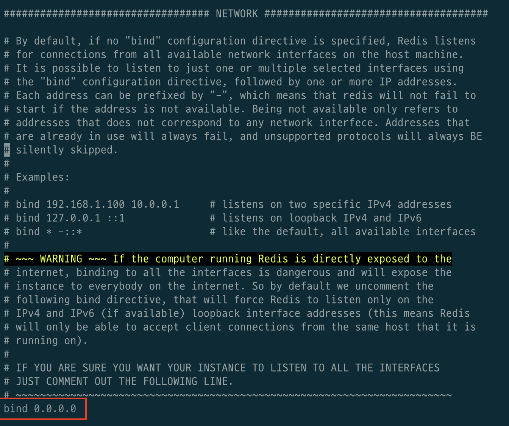
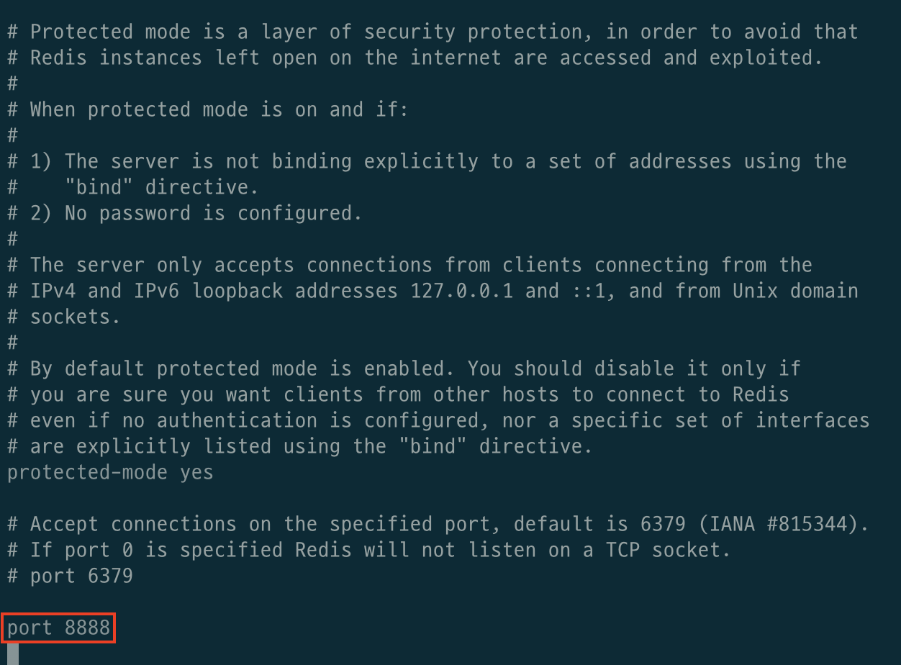

# 목차

 

- [목차](#목차)
- [개요](#개요)
- [기본 설정](#기본-설정)
  - [IP 보안 설정](#ip-보안-설정)
  - [이외 다양한 설정](#이외-다양한-설정)
- [마치며](#마치며)

 

# 개요
Redis 설정은 `redis.conf`파일을 통해 설정할 수 있다.

그리고 redis-server를 실행할 때 아래와 같이 설정 파일을 지정하여 실행하면 해당 설정 파일을 따라 실행된다.

`./redis-server /path/to/redis.conf`

 

# 기본 설정

 

## IP 보안 설정
Redis는 자체적 클라이언트 접근 제어 기능(ex. 로그인)이 없으므로, 보수적인 OS 방화벽 정책이 필요하다.

 

**Port 설정**

 

`redis.conf`에서 find를 호출하여 찾거나, 조금 아래로 내려가면 위와 같이 ip를 설정하는 부분이 있다.

redis는 default로 localhost (`127.0.0.1`)에서만 접근가능하도록 되어 있다.

만약 외부 접속을 허용하고 싶다면 `bind` 부분에 접근을 허락하는 ip를 적어주면 된다.

> `0.0.0.0` 혹은 아무런 IP 설정이 없으면 모든 IP에 대한 접근을 허용한다.

 

**IP 설정**

 

Port 설정과 동일하게 `redis.conf`에서 위와 같이 Port를 설정하는 부분을 쉽게 찾을 수 있다.

redis는 default로 6379를 가리키고 있다. 원하는 Port가 있다면 위와 같이 설정해주면 된다.

 

https://ozofweird.tistory.com/entry/Redis-Redis-%EC%84%A4%EC%A0%95-%ED%8C%8C%EC%9D%BC

expire: http://pigbrain.github.io/opensource/2015/02/18/RedisMemoyPolicyAboutExpireData_on_Redis, https://sjh836.tistory.com/178

 

## 이외 다양한 설정
> 다양한 설정을 따로 정리하는 것보단 기존의 잘 정리된 자료를 보는 것이 더 좋아보인다.
* http://redisgate.kr/redis/server/redis_conf_han.php
* https://redis.io/topics/config
* https://ozofweird.tistory.com/entry/Redis-Redis-%EC%84%A4%EC%A0%95-%ED%8C%8C%EC%9D%BC
* https://bstar36.tistory.com/349
* https://coding-start.tistory.com/126

 

# 마치며
추후에 Redis를 더 커스텀하여 사용하게 되면 관련 설정들을 추가할 예정이다.
