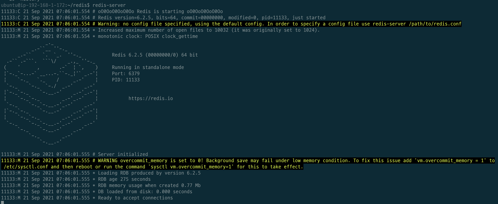
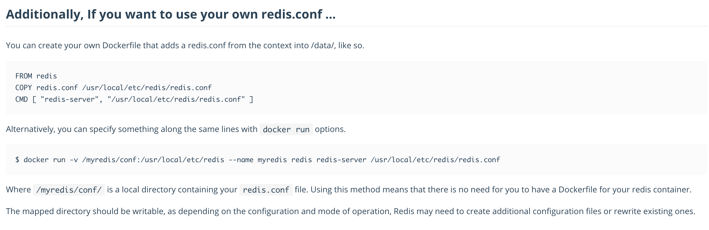

# 목차

<br>

- [목차](#목차)
- [개요](#개요)
- [Linux 컴파일 설치](#linux-컴파일-설치)
- [Linux 패키지 관리 툴을 이용한 설치](#linux-패키지-관리-툴을-이용한-설치)
- [Docker를 이용한 설치](#docker를-이용한-설치)

<br>

# 개요
이번 글에선 Redis 설치하는 다양한 방법에 대해서 다룬다.

또한, Redis를 설치하고 꼭 설정해줘야하는 부분에 대해서 간단히 다루고 끝낸다.

<br>

Redis를 설치하는 방법은 다양하다.
* Linux 컴파일 설치
* Linux 패키지 관리 툴을 이용한 설치
* Docker를 이용한 설치

<br>

# Linux 컴파일 설치
첫번째 다룰 설치 방법은 컴파일 설치이다.

첫번째로 다루는 이유는 [공식 문서 설치 부분](https://redis.io/download)에 들어가면 가장 먼저 소개해주기 때문이다 :)

<br>

**make 설치**
> 우선 컴파일 설치하기 위한 프로그램부터 설치해준다. (ubuntu 18.14기준으로 설치하였다.)

```bash
sudo apt update
sudo apt install gcc g++
sudo apt install make
```

<br>

**Redis 다운 및 설치**
> Redis를 다운받고 컴파일 설치하면 된다. (이부분은 컴파일 설치이므로 CentOS, Ubuntu 상관없이 설치가능하다.)
```bash
wget http://download.redis.io/redis-stable.tar.gz
tar xvzf redis-stable.tar.gz
sudo make

sudo make install
```

이제 설치가 완료되었다. `redis-server` 명령어를 치면 아래와 같이 잘 설치된 것을 볼 수 있다.

<p align="center"> </p>

<br>

**설치된 디렉토리**

컴파일 설치를 완료하면 컴파일 설치한 `redis`폴더의 `src/redis-server`위치에 `redis-server`가 설치되는 것을 볼 수 있다.

위에서 `redis-server`를 실행시킨것도 이 디렉토리에 위치한 `redis-server`를 실행시킨 것이다.

만약 `redis-cli`를 사용하고 싶다면 `src/redis-cli`를 실행시키면 된다.

설치한 후 설정파일을 지정하고 싶다면 `./redis-server /path/to/redis.conf`와 같이 실행하면 된다.

<br>

# Linux 패키지 관리 툴을 이용한 설치
두번째로 다룰 설치 방법은 가장 간단한 Linux 패키지 관리 툴을 이용한 설치이다.

```bash
sudo add-apt-repository ppa:redislabs/redis
sudo apt-get update
sudo apt-get install redis
```

끝이다..

설정파일을 설정하고 싶다면 동일하게 `redis-server /path/to/redis.conf`를 통해 실행해주면 된다.

<br>

# Docker를 이용한 설치
세번째는 Docker 컨테이너에 띄우는 방식이다.

자세한 내용은 [Docker hub - Docker](https://hub.docker.com/_/redis/)를 통해 쉽게 찾을 수 있다.

설정 파일은 아래와 같이 Dockerfile을 통해 쉽게 설정해줄 수 있다.

<p align="center"><br>출처: https://hub.docker.com/_/redis/ </p>


