# 목차

 

- [목차](#목차)
- [들어가며](#들어가며)
- [왜 B-Tree인가](#왜-b-tree인가)
  - [Full Scan](#full-scan)
  - [해시 테이블](#해시-테이블)
  - [BST](#bst)
  - [Unbalanced vs Balanced](#unbalanced-vs-balanced)
  - [RedBlack Tree와 B-Tree](#redblack-tree와-b-tree)
  - [B-Tree의 장점](#b-tree의-장점)
- [B-Tree](#b-tree)
  - [구조](#구조)
  - [B-Tree 성립 조건](#b-tree-성립-조건)
  - [탐색](#탐색)
  - [삽입](#삽입)
  - [삭제](#삭제)
- [마치며](#마치며)
- [참고](#참고)

 

# 들어가며
필자는 최근에 DB 인덱싱 공부를 위해, [RealMySQL](http://www.yes24.com/Product/Goods/6960931?OzSrank=6)을 읽고 있다.

B-Tree에 대한 개념이 전혀 잡혀 있지 않으니, 인덱스의 B-Tree부분에서 이해가 잘 되지 않았다.

이번 기회에 B-Tree를 정리해보고자 한다.

 

# 왜 B-Tree인가
B-Tree는 데이터베이스 인덱스를 공부한 개발자는 반드시 접하게 되는 알고리즘이다.

그렇다면 왜 B-Tree가 이렇게 많은 관심을 받고 사용되어 오는 것일까?

물론 정답은 아니지만, 여러 자료들을 봤을 때 필자가 생각하는 그 이유에 대해서 간단히 다뤄보고자 한다.

흐름은 다음과 같다. 

`Full Scan -> 해시 테이블 -> BST -> Unbalanced Tree -> Balanced Tree -> RedBlack-Tree -> B-Tree`

 

## Full Scan

우선 탐색할 때 가장 쉬운 방법은 Full Scan이다. 순차 탐색이라고 생각하면 이해가 쉽다.

**Full Scan이란 정말 말 그대로 1부터 n까지 모든 데이터를 비교하면서 원하는 데이터를 찾는 것을 의미한다.**

이 방법은 구현 및 이해하기가 쉽고, 인덱스를 걸지 않아도 되므로 삽입이 빠르다.

하지만, 탐색 성능이 `O(n)`으로 좋지 않다.

**기본적으로 인덱스는 데이터의 저장, 수정 성능을 조금 희생하고 데이터의 읽기 속도를 높이는 목적이므로 적합하지 않다.**

 

## 해시 테이블

  

모든 자료구조와 알고리즘중에서 탐색 시간이 가장 빠른 것은 해시 테이블이다.

해시 함수를 통해 나온 해시 값을 이용하면 저장된 메모리에 바로 접근할 수 있기 때문에 `O(1)`의 시간복잡도를 가진다.

하지만, 해시 테이블은 특정 요소에 대한 탐색이 빠르다.

**DB에선 등호(=)뿐만 아니라 부등호 (`<`,`>`)도 사용하기 때문에 해시 테이블은 적합하지 않다.**

물론 찾을 순 있지만, 그렇게 된다면 `O(1)`의 시간복잡도라는 장점을 버리게 된다.

 

## BST
순차 탐색과 해시 테이블 외의 효율적인 자료구조로 트리가 있다.

그리고 탐색 이야기를 할 때 대표적으로 나오는 트리 구조가 바로 이진 탐색 트리 (BST)이다.

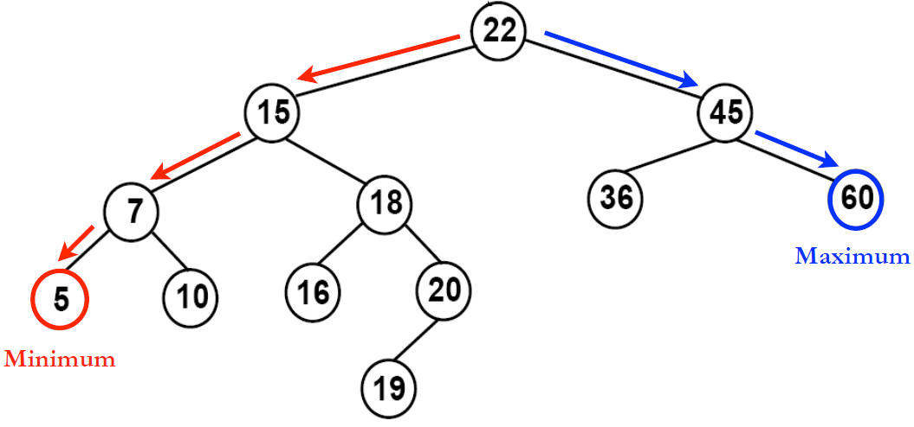 출처: https://ratsgo.github.io/data%20structure&algorithm/2017/10/22/bst/

BST는 각 노드에 값이 하나 있으며, 왼쪽 서브 트리에는 해당 노드의 값보다 작은 값을 지닌 노드, 오른쪽 서브 트리에는 해당 노드의 값보다 큰 값을 지닌 노드로 구성된다.

좌우 서브 트리도 각각이 다시 이진 탐색 트리구조가 된다.

 

**BST가 기존의 순차 탐색보다 탐색이 빠른 이유는 이진 탐색을 이용하기 때문이다.**

예를 들어, 43억개의 데이터 중 특정 데이터를 찾는다면 순차 탐색은 최악의 경우 43억번의 연산이 필요하다면, BST는 32번이면 찾을 수 있다.

다만, 이는 해당 BST가 밸런스(Balanced)할 때의 이야기이다.

 

## Unbalanced vs Balanced

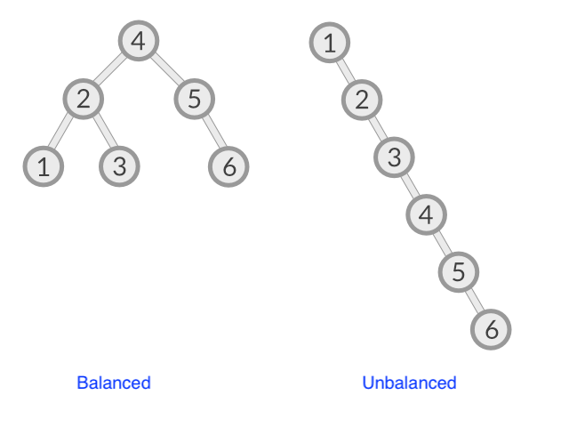 출처: https://stackoverflow.com/questions/59206128/balanced-vs-unbalanced-binary-tree-clarification-needed 

위 그림을 보면 알 수 있듯이, Unbalanced한 BST는 탐색하는데 최악의 경우 `O(N)`이 소요 된다. 

반면에, Balanced한 BST는 탐색하는데 최악의 경우 `O(logN)`이 소요 된다.

균형이 맞춰진 트리는 이진 탐색이 가능하기 때문이다.

 

다시 말해, **BST를 사용하려면 트리의 노드가 한 방향으로 쏠리지 않도록, 노드 삽입 및 삭제 시 특정 규칙에 맞게 재정렬되어 왼쪽과 오른쪽 자식 양쪽 수의 밸런스를 유지하는 트리를 사용해야 한다.**

그리고 이러한 **밸런스 트리의 대표적인 알고리즘이 바로 RedBlack-Tree와 B-Tree이다.**

> B-Tree의 B가 Balanced인지는 확실치 않다. 하지만, 필자는 Balanced로 이해해도 무방하지 않나 싶다.

 

## RedBlack Tree와 B-Tree
RedBlack Tree도 밸런스 트리이므로 DB에서 사용해도 전혀 손색이 없어보인다.

B-Tree와 다르게 **RedBlackTree는 하나의 노드가 가지는 데이터 개수가 딱 하나이다.**

반면에, **B-Tree는 각 노드마다 배열을 가지고 있으며, 같은 노드 공간의 데이터들끼리는 굳이 자식 노드에 접근할 때처럼 참조 포인터 값으로 접근할 필요가 없다.**

**대량의 데이터를 처리할 때, 검색 구조의 경우 하나의 노드에 많은 데이터를 가질 수 있다는 점이 큰 장점이 된다.**

그 이유는 **대량의 데이터는 블럭 단위로 디스크에 저장하기 때문인데, 한 블럭이 1024 바이트면, 2바이트를 읽으나 1024 바이트를 읽으나 똑같은 입출력이 발생하기 때문이다.**

따라서, 1024 바이트를 최대한 꽉 채우는 것이, 디스크 I/O 입장에서 훨씬 효율적이다.

그런 면에서 B-Tree는 RedBlack-Tree보다 효율적이라고 볼 수 있다.

 

RedBlack과 B-Tree의 차이점을 더 알기 위해 예시를 들어보자.

아래 그림에서 B-Tree방식으로 120을 찾는다고 가정해본다.

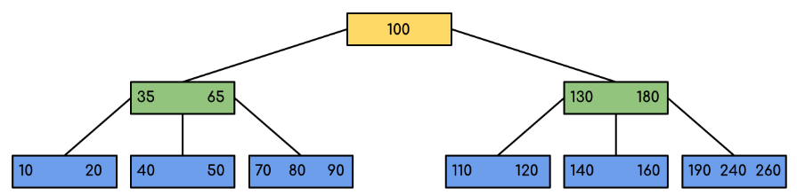 출처: https://www.geeksforgeeks.org/introduction-of-b-tree-2/ 

1. 100이 저장되어 있는 Root노드에서 데이터를 탐색한다.
2. Root에 없고, 100보다 크므로 오른쪽 자식노드로 가서 배열을 탐색을 한다.
3. 오른쪽 자식 노드에도 없고, 100은 130보다 작으므로 왼쪽 자식 노드에서 탐색한다.
4. 왼쪽 자식 노드에서 배열을 탐색한다. 120을 찾아낸다.

 

위 예시에선 참조 포인터를 사용한 접근이 2회 발생했다.

만약 RedBlack-Tree 방식 저장되어 있어 탐색한다면 참조 포인터를 사용한 접근이 2회 이상 발생하게된다.

즉, 어떻게 보면 Disk I/O가 더 많이 발생할 수 있다는 의미이기도하다.

 

쉽게 얘기해서 B-Tree는 RedBlack-Tree와 시간 복잡도는 `O(logN)`로 동일하다.

다만 시간복잡도는 이론적인 시간 계산 방식일뿐, 운영체제와 물리적 개념을 생각하면 배열이 빠를 수 밖에 없다.

주소를 알아내고 탐색하는 비용을 줄일 수 있기 때문이다. (Disk I/O 횟수를 줄일 수 있다)

 

## B-Tree의 장점
이제 어느정도 B-Tree를 왜 사용하는지 알게 되었다.

B-Tree의 장점을 결론내보면 아래와 같다.

1. 정렬되어 저장되기 때문에 등호(=)뿐만 아니라 부등호 (`<`,`>`) 연산도 문제 없다.
2. 참조 포인터를 적게 사용하고 배열을 사용하므로 방대한 데이터 양에도 빠른 메모리 접근이 가능하다.
3. 데이터 탐색뿐 아니라, 저장, 수정, 삭제에도 항상 `O(logN)`의 시간 복잡도를 가진다.
   * B-Tree의 삽입과 삭제는 트리의 높이에 따른 O(h)의 시간 복잡도를 가진다. 이는 logN보다도 작은 값이다.

 

# B-Tree
이제 B-Tree에 대해서 더 자세히 알아보자.

 

## 구조

 

🤔 **B-Tree란**

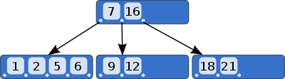 출처: https://ko.wikipedia.org/wiki/B_트리 

* 이진 트리를 활용해 하나의 노드가 가질 수 있는 자식 노드의 최대 개수가 2보다 큰 자료구조.
* **B-Tree는 트리의 균형을 자동으로 맞추는 균형 트리이다.**
* **B-Tree는 자료를 정렬된 상태로 보관하고, 삽입 및 삭제를 대수 시간으로 할 수 있는 자료구조. 조회는 `O(logN)`**
* 노드 내 최대 데이터 수가 2개면 2차 B-Tree라고 부른다. (M차 B-Tree)
* **모든 노드들은 부모 노드 자료의 크기에 의존적으로 정렬된다.**
* 대부분의 이진트리와 다르게 하향식이 아닌 상향식으로 구성된다.

 

## B-Tree 성립 조건

 

**1. 노드의 데이터 수가 n개라면 자식 노드의 개수는 n + 1개여야한다.**

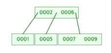 max degree = 4 

* 위 그림을 보면 당연하다. 노드에 저장된 각가의 데이터 별로 작은 값과 큰 값을 자식 노드로 가지고 있기 때문이다.

 

**2. 루트 노드를 제외하고는 적어도 `M(노드 중 최대 데이터 개수) / 2`개의 데이터를 갖고 있어야한다.**

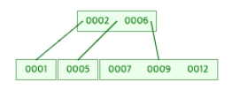 max degree = 4 

* 3차 B-Tree까지는 1개의 데이터를 갖고 있으므로, 고려하지 않아도 된다.
* 4차 B-Tree부터는 Root 노드를 제외하고 노드가 최소 2개의 데이터를 갖고 있어야한다.

 

**3. 노드의 자식 노드 데이터들은 데이터를 기준으로 정렬되어 있다.**
* 노드 데이터를 기준으로 데이터보다 작은 값은 왼쪽 서브 트리, 큰 값을 오른쪽 서비 트리에 이루어진다.

 

**4. 균형 트리이므로, Leaf 노드로 가는 경로의 길이는 모두 동일해야 한다.**
* 즉, Leat 노드는 모두 같은 레벨에서 존재해야 한다.

 

**5. 입력 자료는 중복될 수 없다.**

 

**6. 모든 노드들은 부모 노드 자료의 크기에 의존적으로 정렬된다.**

 분리 전 (6삽입) 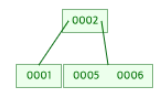 분리 후 (6삽입)  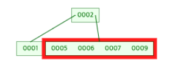 분리 전 (9삽입) 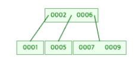 분리 후 (9삽입)

* 위 그림은 4차 B-Tree에서 삽입시 노드를 자식으로 분리시키는 과정이다.
  * 부모 노드 자료 크기가 4개가 되니, 자식으로 분리하였으며, 정렬되는 과정이 부모 노드의 값에 따라 분리된다.

 

## 탐색
B-Tree의 탐색은 기존의 BST처럼 `root`노드에서 시작해 하향식으로 탐색해 나가기 시작한다.

아래 예시는 12를 찾는 과정이다.

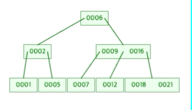 출처: https://www.cs.usfca.edu/~galles/visualization/BTree.html

 

## 삽입
B-Tree에 삽입 될 자료는 항상 Leaf 노드에 추가된다.

또한, B-Tree의 삽입은 크게 두가지로 나뉜다.

바로 분할이 일어나는 경우와 일어나지 않는 경우이다.

그래서 B-Tree의 삽입 과정은 아래와 같이 이루어진다.

1. 요소 삽입에 적절한 Leaf 노드를 검색 및 선택. (하향식)
2. 선택한 Leaf 노드에 여유가 있다면 삽입. 없다면 분할 및 병합. (상향식)

Leaf 노드를 검색하는 것은 하향식이지만, 노드 분할의 과정을 상향식으로 이루어진다.

 

**Leaf 노드가 여유있는 경우 - 분할이 일어나지 않는 경우**

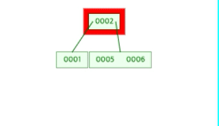 M = 4 삽입 과정 

 

**Leaf 노드가 여유 없는 경우 - 분할이 일어나는 경우**

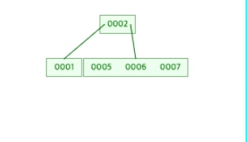 M = 4 삽입 과정 (분할)  출처: https://www.cs.usfca.edu/~galles/visualization/BTree.html

 

## 삭제
B-Tree의 삭제는 크게 두 가지로 나뉜다.

Leaf 노드인 경우와 아닌 경우이다.

 

**삭제할 노드가 Leaf 노드인 경우 - 삭제해도 B-Tree가 유지**

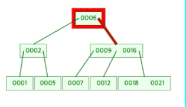 

 

**삭제할 노드가 Leaf 노드인 경우 - 삭제하면 B-Tree가 유지되지 않는 경우**

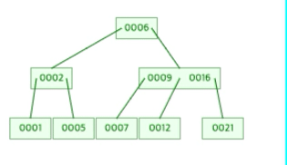 

* Leaf 노드를 삭제하면, B-Tree구조가 깨지는 경우이다.
* 이땐, 삭제한 노드의 부모 노드로 올라가며 데이터를 가져온다. 그리고 머지한다.
* 이 과정을 root까지 올라가며 B-Tree 조건에 맞을 때까지 반복한다.

 

**삭제할 노드가 Leaf가 아닌 경우**

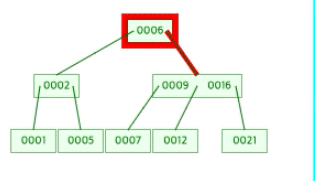 

* 삭제하고자 하는 노드에서 데이터를 삭제하고, 왼쪽 서브트리에서 최대값을 노드에 위치시킨다.
* 같은 방식으로 부모 노트에서 자식노드로 값을 가져오고, 형제 노드와 머지하며, B-Tree의 조건이 맞을때까지 반복한다.

 

# 마치며
B-Tree에 대한 개념이 전혀 잡혀있지 않았지만, 정리하며 그래도 조금은 이해가 되는 것 같다.

다만, 자료마다 서로 다른 이야기를 하는 듯한 내용이 많아 정리하는데 애를 많이 먹었다.

사실 이 정리 자료가 B-Tree를 100% 잘 표현했는지 잘 모르겠다. 빠른 시일내에 직접 코드로 구현하며 공부해야 할 듯 하다.

그럼 이만 안녕~

 

# 참고
* https://helloinyong.tistory.com/296
* https://www.youtube.com/watch?v=C_q5ccN84C8
* https://www.cs.usfca.edu/~galles/visualization/BTree.html

