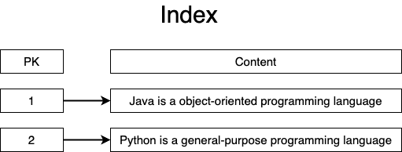
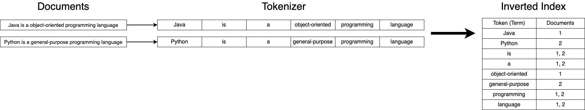
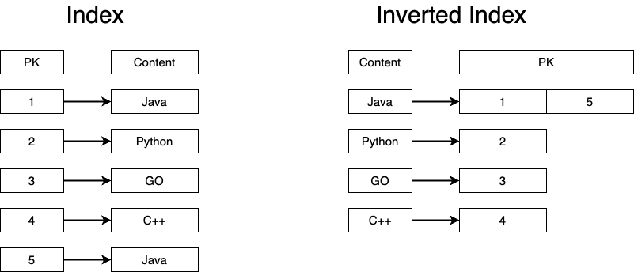

# 목차

 

- [목차](#목차)
- [Inverted Index (역색인) 이해하기](#inverted-index-역색인-이해하기)
  - [색인 (Index)](#색인-index)
  - [역색인 (Inverted Index)](#역색인-inverted-index)
  - [색인과 역색인의 차이는 방향이다.](#색인과-역색인의-차이는-방향이다)

 

# Inverted Index (역색인) 이해하기
검색엔진은 사용자가 입력한 검색어가 검색 조건에 부합하여 검색 결과에 포함되고, 반대로 검색 결과에 포함이 안되는 경우 왜 안되는지 판단해야한다.

검색엔진은 이러한 판단을 위해 저장된 데이터를 분석하여 저장한다. 그리고 이런 분석의 기본이 되는 개념이 바로 역색인 (Inverted Index)다.

 

## 색인 (Index)

**DB에서 흔히 사용되는 색인(Index)은 테이블 내의 1개의 컬럼, 혹은 여러 개의 컬럼을 이용하여 문서에 빠르게 접근할 수 있도록 제공되는 자료 구조**를 일컫는다.

즉, **색인의 목적은 `문서의 위치`에 대한 주소를 key : value 형태인 Index를 만들어 문서의 접근성을 용이하기위함이다.**

 

위와 같이 PK (Primary Key)에 인덱스를 설정하여 PK를 통해 빠르게 해당 문서에 접근할 수 있다.

**책의 맨 앞에 정리되어있는 목차와 동일한 역할이다.**

> 물론 보통은 PK말고 다른 컬럼에 인덱스를 설정한다.

 

색인은 특정 데이터를 활용하여 빠르게 문서에 접근할 수 있는 방법을 제공하지만, 단반향이며 문서의 내용을 기반으로 색인을 하지않는다.

즉, 특정 키워드를 포함하고있는 문서를 찾기 위해선 모든 문서의 내용을 순회하며 읽어서 키워드 포함 여부를 확인해야한다.

**당연히 매 사용자 요청때마다 이러한 과정은 상당한 연산을 필요로하기때문에 내용 기반의 검색에 적합하지않다.**

 

## 역색인 (Inverted Index)

역색인은 특정 키워드로 포함하고있는 문서들에 대한 PK를 매핑하는 인덱스 형태로 이를 활용하여 빠른 내용기반의 검색을 가능하게한다.

즉, **색인과 반대로 역색인은 `문서 내의 내용물`와 PK에 대한 매핑 정보를 색인해놓는다.**

 

위와 같이 내용물 기준으로 PK에 대하여 색인을하기때문에 내용물 기반으로 문서에 빠르게 접근할 수 있다.

책 가장 뒤에있는 단어 별 색인 페이지와 유사하다.

**당연히 문서의 내용을 기반으로 색인해두기때문에 검색 기능에 적합한 색인 방식이다.**

 

## 색인과 역색인의 차이는 방향이다.

문서의 내용을 간소화하여보면 색인과 역색인의 차이점은 방향뿐이다.

 

위 그림에서 알 수 있듯이 일반적인 색인 (Forward Index)는 PK와 문서의 내용를 매핑한다. 

PK를 통해 1,5 번 문서는 Java에 대한 문서, 2번 문서는 Python에 대한 문서라는 것을 알 수 있다.

반면 **역색인 (Inverted Index)는 어떤 내용이 몇 번 문서에 담겨있는지 알 수 있다.**

이와 같이 역색인은 일반적인 색인의 반대 방향으로 문서에 빠르게 접근하기위해 만드는 일종의 색인이라고 볼 수 있다.

> ES도 역색인을 통해 검색 기능을 제공한다. (물론 실제론 더 복잡하다.)

