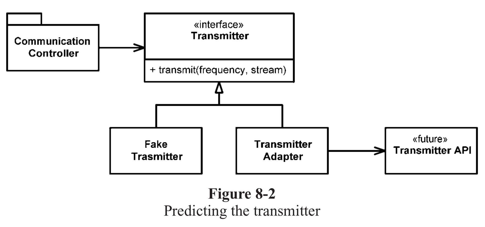

> [클린 코드](http://www.yes24.com/Product/Goods/11681152?OzSrank=1)를 정리한 자료입니다.

# 8장 경계
시스템을 만들면 모든 소프트웨어를 직접 개발하는 경우는 드물다.

어떤 식으로든 외부 코드를 우리 코드에 깔끔하게 통합해야만한다.

이번 장에서는 소프트웨어 경계를 깔끔하게 처리하는 기법과 기교를 살펴본다.

- [8장 경계](#8장-경계)
  - [외부 코드 사용시 문제](#외부-코드-사용시-문제)
    - [예시 - Map](#예시---map)
  - [래퍼 클래스](#래퍼-클래스)
    - [감싸지 않는다면](#감싸지-않는다면)
    - [새로운 클래스로 감싼다면 (중요)](#새로운-클래스로-감싼다면-중요)
    - [무조건 감싸라는 의미는 아니다](#무조건-감싸라는-의미는-아니다)
  - [학습 테스트](#학습-테스트)
    - [학습 테스트란?](#학습-테스트란)
    - [학습 테스트의 장점](#학습-테스트의-장점)
  - [아직 존재하지 않는 클래스 사용하기 (Adapter)](#아직-존재하지-않는-클래스-사용하기-adapter)
    - [예시 - Adapter Pattern](#예시---adapter-pattern)
  - [결론](#결론)

<br>

## 외부 코드 사용시 문제
인터페이스 제공자와 사용자 사이에는 특유의 긴장이 존재한다.

제공자는 가능한 많은 사용자가 사용 가능한 넓은 적용성을 원하고, 사용자는 자신의 요구에 집중하는 인터페이스를 바란다.

이런 긴장으로 인해 시스템 경계에서 문제가 발생한다.

<br>

### 예시 - Map
Map은 굉장히 다양한 인터페이스로 수많은 기능을 제공한다.
* `clear() void - Map`
* `containsKey(Object key) boolean - Map`
* ...

Map이 제공하는 기능성과 유연성은 확실히 유용하지만 그만큼 위험도 크다.

**예를 들어, 프로그램에서 Map을 여기저기 이동시킨다면, 누구도 Map의 내용을 삭제 (`clear`)할 수 있게 된다. 즉, Map 사용자라면 누구나 Map 내용을 지울 권한이 있다는 의미가 된다.**

이는 큰 위험이 따르는 로직이다.

<br>

## 래퍼 클래스

인터페이스의 경계를 해결하는 방법중 하나가 바로 새로운 클래스를 만들어 감싸는 것이다.

<br>

### 감싸지 않는다면
```java
Map<String, Sensor> sensors = new HashMap<Sensor>();
...
Sensor s = sensor.get(sensorId);
...
sensors.clear(); // 필요하지 않는 기능 (막아야하는 기능)
```
**위와 같이 외부 API (Map)을 감싸지 않는다면 필요하지 않는 기능까지 제공하게 된다.**

또한, 인터페이스가 변할 경우, 수정할 코드가 상당히 많아진다. (**변경에 취약**)

<br>

### 새로운 클래스로 감싼다면 (중요)
```java
// 경계 인터페이스인 Map을 Sensors 안으로 숨긴다.
public class Sensors {
    private Map<String, Sensor> sensors = new HashMap<>();

    public Sensor getById(String id) {
        return (Sensor) sensors.get(id);
    }
    ...
}
```
이제 Map 인터페이스가 변하더라도 나머지 프로그램에는 영향을 미치지않고, `Sensors`코드만 변경해주면 된다. (**변경에 용이**)

게다가, `clear()`와 같은 불필요한 기능등을 방지할 수 있다. (**인증 절차**)

이렇게 Sensors 클래스는 (나머지 프로그램이) 설계 규칙과 비즈니스 규칙을 따르도록 강제할 수 있다.

<br>

### 무조건 감싸라는 의미는 아니다
Map 클래스를 사용할 때마다 위와 같이 캡슐화하라는 소리가 아니다.

**Map을 여기저기 넘기는 경우에만 위와 같이 새로운 클래스를 만들어 감싸라는 의미이다.**

또한, 만약 감싸는 클래스를 만든다면, 절대 클래스 외부에 노출되지 않도록 해야한다. (`private`)

마지막으로 Map 인스턴스를 공개 API의 인스로 넘기거나 반환값으로 사용하면 안된다.

<br>

## 학습 테스트
만약 외부에서 가져온 패키지를 사용하고 싶다면 어디서 어떻게 시작해야할까?

**바로 학습 테스트를 먼저 작성해야한다.**

<br>

### 학습 테스트란?
외부 코드를 익히기는 어렵다. 외부 코드를 나의 코드로 통합하기도 어렵다.

**곧바로 내 코드를 작성해 외부 코드를 호출하는 대신 먼저 간단한 테스트 케이스를 작성해 외부 코드를 익히는 것을 학습 테스트라고 부른다.**

즉, 외부 API에서 내가 사용하는 기능들을 테스트하라는 의미이다.

<br>

### 학습 테스트의 장점 
* 외부 API에 대한 이해도를 높여준다.
  * 외부 API에 대한 필요한 지식만 확보하는 아주 좋은 방법이다.
* 패키지의 새로운 버전이 나온다면 학습 테스트를 돌려 내 코드에 영향이 있는지 확인할 수 있다.
  * 학습 테스트는 패키지가 예상대로 도는지 검증할 수 있다.
  * 즉, 패키지의 새 버전으로 이전하기 쉬워진다.

<br>

## 아직 존재하지 않는 클래스 사용하기 (Adapter)
**경계와 관련해 또 다른 유형은 아는 코드와 모르는 코드를 분리하는 경계다.**

하나의 프로그램을 만드는데 여러 개의 팀이 동시적으로 기능을 개발하는데, 나의 팀에선 다른 팀의 코드를 모를뿐더러, 어떻게 사용하는지 모르는 경우가 많다.

이럴경우엔 인터페이스를 이용한 다양한 디자인패턴으로 해결이 가능하다.

<br>

### 예시 - Adapter Pattern
책에서는 무선통신 시스템에 들어갈 소프트웨어 개발을 예로 들고 있다.

시스템을 만드는데 '송신기'라는 하위 시스템이 필요한다. 우리 팀이 '송신기'에 대한 지식이 거의 없고, 인터페이스도 정하지 못한 경우라면 어떻게 해야할까?

이제 우리 세상과 저쪽 세상의 경계가 어디쯤인지 정하면 되는 것이다.

우리 팀은 아래와 같은 기능이 필요하다.
```
지정한 주파수를 이용해 이 스트림에서 들어오는 자료를 아날로그 신호로 전송하라.
```

저쪽 팀이 아직 API를 설계하지 않았어도, 자체적으로 인터페이스를 정의하고 나의 기능을 개발하면 된다.

<p align="center">어댑터 패턴</p>

위 그림처럼 송신기 API에서 `CommunicationController`를 분리하고, 나의 기능을 구현하면 된다.

위와같이 어댑터 패턴으로 구현하면 우리가 인터페이스를 전적으로 통제한다는 장점이 있다.

또한 코드 가독성이 높아지고 코드 의도도 분명해진다.

<br>

## 결론
* 깨끗한 경계는 변경에 용이하다.
* 깨끗한 경계를 만들기 위해서는
  * 경계에 위치한 코드를 깔끔히 분리한다.
  * 테스트 케이스도 작성한다.
* 나의 코드에서 외부 패키지를 세세하게 알아야 할 필요가 없다.
  * 통제가 불가능한 외부 패키지에 의존하는 대신 통제가 가능한 우리 코드에 의존하는 편이 훨씬 좋다.
* 코드를 분리하는 대표적인 방법
  * 새로운 클래스로 경계를 감싸는 방법 - 래퍼 클래스
  * 인터페이스를 이용한 디자인 패턴 - Adapter 패턴