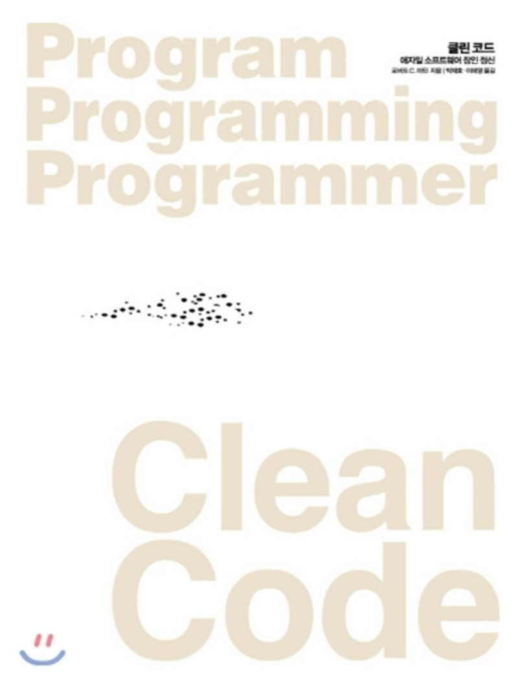

[클린 코드](http://www.yes24.com/Product/Goods/11681152?OzSrank=1)를 정리한 자료입니다.

# 목차

* [1장 깨끗한 코드](https://github.com/binghe819/TIL/blob/master/ETC/CleanCode/1%EC%9E%A5%20%EA%B9%A8%EB%81%97%ED%95%9C%20%EC%BD%94%EB%93%9C.md)
* [2장 의미 있는 이름](https://github.com/binghe819/TIL/blob/master/ETC/CleanCode/2%EC%9E%A5%20%EC%9D%98%EB%AF%B8%20%EC%9E%88%EB%8A%94%20%EC%9D%B4%EB%A6%84.md)
* [3장 함수](https://github.com/binghe819/TIL/blob/master/ETC/CleanCode/3%EC%9E%A5%20%ED%95%A8%EC%88%98.md)
* [4장 주석](https://github.com/binghe819/TIL/blob/master/ETC/CleanCode/4%EC%9E%A5%20%EC%A3%BC%EC%84%9D.md)
* [6장 객체와 자료구조](https://github.com/binghe819/TIL/blob/master/ETC/CleanCode/6%EC%9E%A5%20%EA%B0%9D%EC%B2%B4%EC%99%80%20%EC%9E%90%EB%A3%8C%EA%B5%AC%EC%A1%B0.md)
* [7장 오류 처리](https://github.com/binghe819/TIL/blob/master/ETC/CleanCode/7%EC%9E%A5%20%EC%98%A4%EB%A5%98%20%EC%B2%98%EB%A6%AC.md)
* [8장 경계](https://github.com/binghe819/TIL/blob/master/ETC/CleanCode/8%EC%9E%A5%20%EA%B2%BD%EA%B3%84.md)
* [9장 단위 테스트](https://github.com/binghe819/TIL/blob/master/ETC/CleanCode/9%EC%9E%A5%20%EB%8B%A8%EC%9C%84%20%ED%85%8C%EC%8A%A4%ED%8A%B8.md)
* [10장 클래스]()

