# 목차

- [Branch & Conflict](#branch--conflict)
  * [1 Branch란](#1-branch란)
  * [2 Branch 기본 사용법](#2-branch-기본-사용법)
    + [2-1 Branch 생성 및 조회](#2-1-branch-생성-및-조회)
    + [2-2 Branch 전환하기](#2-2-branch-전환하기)
      - [실습 (Branch 생성 및 전환)](#실습-branch-생성-및-전환)
  * [3 브랜치 병합](#3-브랜치-병합)
    + [3-1 병합이란](#3-1-병합이란)
    + [3-2 서로 다른 파일 병합](#3-2-서로-다른-파일-병합)
    + [3-3  같은파일, 다른부분 병합](#3-3-같은파일-다른부분-병합)
    + [3-3 같은 파일, 같은 부분 병합 (conflict)](#3-3-같은-파일-같은-부분-병합-conflict)
  * [4 3-way merge](#4-3-way-merge)
    + [4-1 2 - way merge](#4-1-2---way-merge)
    + [4-2 3 - way merge](#4-2-3---way-merge)
  * [5 브랜치 전략 Git - Flow](#5-브랜치-전략-git---flow)
    + [5-1 전략 살펴보기](#5-1-전략-살펴보기)
    + [5-2 Fork를 사용하는 방법](#5-2-fork를-사용하는-방법)


# Branch & Conflict

> * https://nvie.com/posts/a-successful-git-branching-model/
> * https://www.campingcoder.com/2018/04/how-to-use-git-flow/

소프트웨어 개발할 때에 개발자들은 동일한 소스코드를 함께 공유하고 다루게 된다.

여러 사람이 동일한 소스코드를 기반으로 서로 다른 작업을 할 때에는 각각 서로 다른 버전의 코드가 만들어 질 수 밖에 없다.

이럴 때 사용하는 것이 바로 브랜치이다.


## 1 Branch란

🤔 브랜치란

* **브랜치는 독립적으로 어떤 작업을 진행하기 위한 개념이다.**
* 또한, **이렇게 만들어진 브랜치는 다른 브랜치와 병합(Merge)함으로써, 작업한 내용을 다시 새로운 하나의 브랜치로 모을 수 있다.**


## 2 Branch 기본 사용법

> 실습을 위한 준비 -> 아래와 같이 txt파일 하나 만들고 세 번의 수정과 커밋을 해주면 된다.
>
> 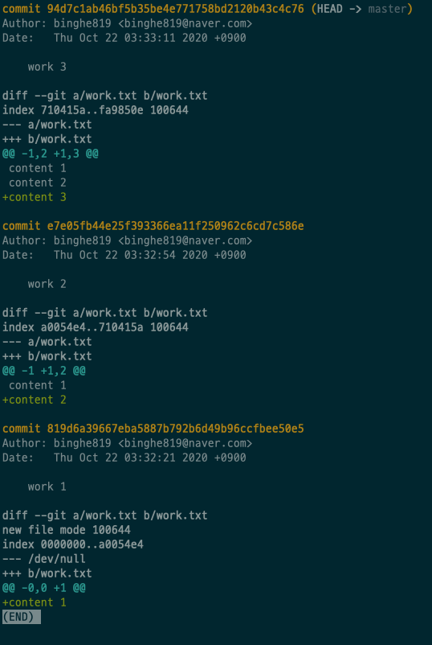


### 2-1 Branch 생성 및 조회

```shell
// Branch 만들기
git branch {branchname}

// Branch 목록보기
git branch
```

🙋‍♂️ 조회 내용

* `*`이 현재 가리키고 있는 브랜치이다. `HEAD`라고도 한다.

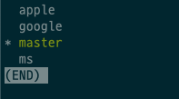

> `git log --all --graph --oneline` -> 브랜치 작업을 같이 보여준다.


### 2-2 Branch 전환하기

```shell
// Branch 전환
git check {branchname};
```


#### 실습 (Branch 생성 및 전환)

* master 브랜치에서 새로운 커밋을 한다. (`master work 4`)

  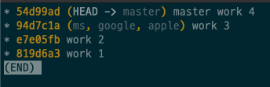

  * master를 제외한 다른 브랜치는 여전히 `work 3`에 위치한다.

* master 브랜치에서 apple브랜치로 전환해보자. (`git checkout apple`)

  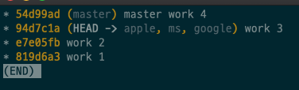

  * HEAD가 apple을 가리키는 것을 볼 수 있다.

    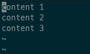

  * 또한, master 브랜치에서 커밋했던 `master work 4`의 대한 내용(`work.txt`의 마지막 문장)이 사라졌다.

  * 즉, `work 3`의 커밋 상태로 돌아간 것이다.

* 이제 apple브랜치에서 새로운 커밋을 해보자. (`apple work 4`)

  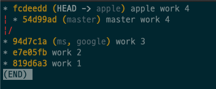

  * 브랜치가 나눠져서 따로 커밋이 되는 것을 볼 수 있다.
    * `master`의 부모 `work 3`
    * `apple`의 부모 `work 3`


## 3 브랜치 병합


### 3-1 병합이란

🤔 merge란?

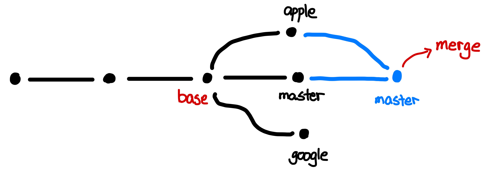

* base - 합치려고 하는 브랜치들의 조상
* merge - 두 브랜치를 병합


### 3-2 서로 다른 파일 병합

🙋‍♂️ 실습을 통해 merge를 해보자.

* merge를 하기 위해 다음과 같이 커밋 상황을 만든다.

  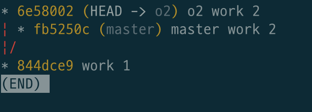

  * base - work 1
  * 두 개의 브랜치 - master, o2

* `o2`브랜치의 내용을 `master`브랜치의 방향으로 merge해보자. (o2 :arrow_right: master)

  * 우선 master브랜치 상태가 되야한다.

  * `git merge o2`

    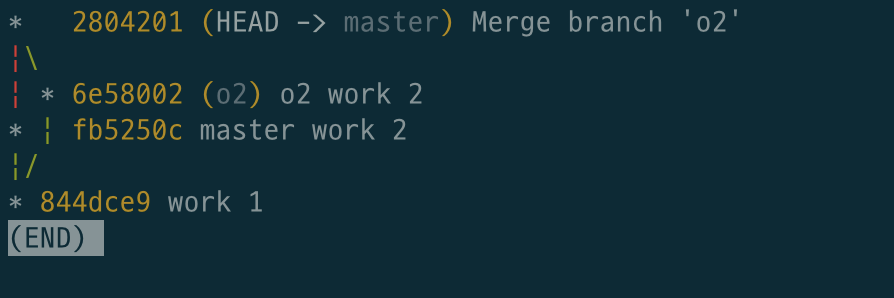

  * master과 o2가 병합됐다.

> 이미 커밋된 메시지 변경 -> `git commit --amend`


### 3-3  같은파일, 다른부분 병합

하나의 파일은 다음과 같은 내용으로 생성한다 (`work.txt`)

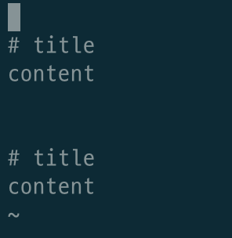


* master 브랜치의 `work.txt`

  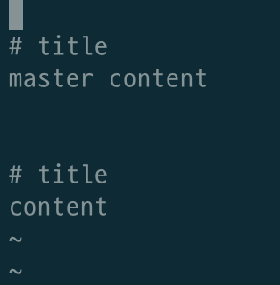

* o2 브랜치의 `work.txt`

  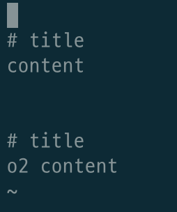

* 현재의 브랜치 상황

  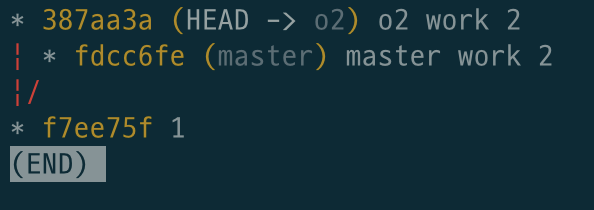

* master로 이동후 o2를 병합한 후

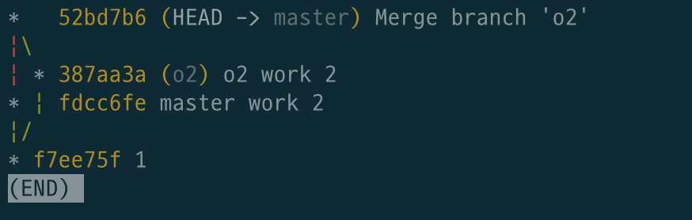

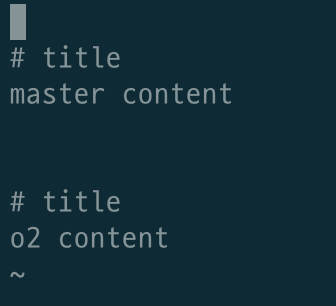

두 브랜치에서 커밋했던 내용이 하나로 합쳐진다.


### 3-3 같은 파일, 같은 부분 병합 (conflict)

두 브랜치가 같은 파일에 같은 부분이 동일한 상황에서 병합을 하면 충돌 (conflict)가 발생하게 된다.

* 두 브랜치가 다음과 같이 같은 파일에 같은 내용을 담고 있다.

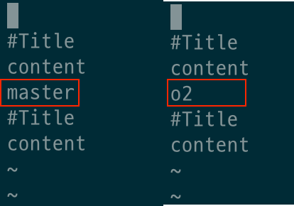

* `git merge o2`의 결과 -> conflict 발생 (`statue`에 가면 어디서 충돌이 일어났는지 알려준다.)

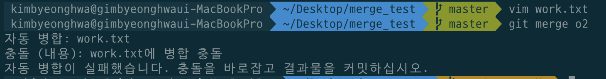

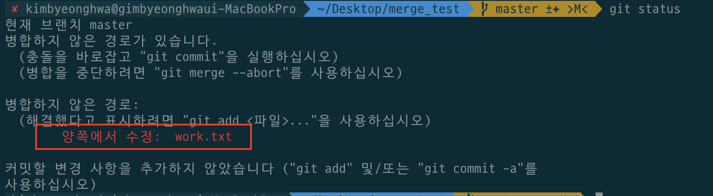

* 같은 파일의 내용도 아래와 같이 변경되있다.

  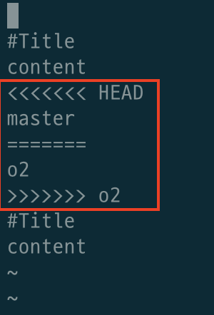

  * `======` - 구분자 (두 브랜치의 내용을 분리하는 역할)

* 위 파일을 하나로 변경하고 다시 `add + commit`하면 merge가 된다.

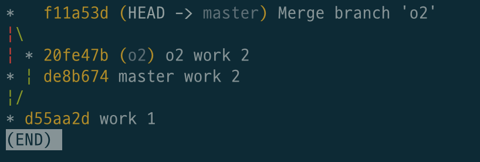


## 4 3-way merge


### 4-1 2 - way merge

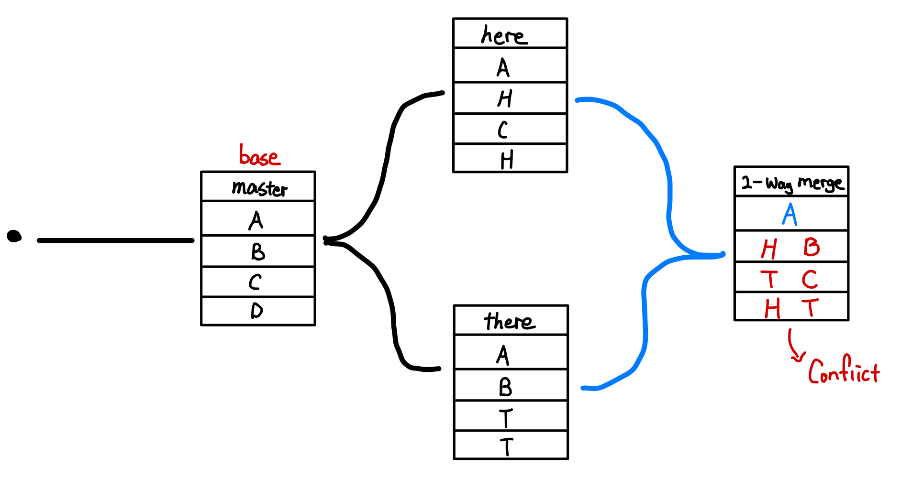

* 두 개의 브랜치만을 이용해서 merge하는 방법


### 4-2 3 - way merge

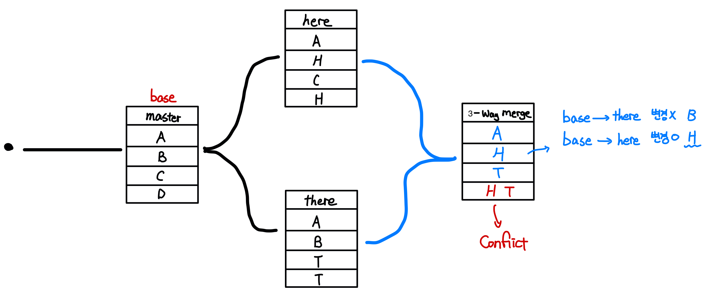

* 두 개의 브랜치와 base 브랜치를 이용해서 merge 하는 방법
  * base와 there 브랜치의 두, 세 번째 행은 여전히 B이기 때문에 변경이 일어나지 않았고,
  * base와 here 브랜치에서는 두, 세 번째 행이 변경이 일어났기 때문에 병합할 때 변경이 된 브랜치를 참조한다.


## 5 브랜치 전략 Git - Flow

브랜치 전략중 가장 대표적인 전략은 Git -Flow 인 듯하다.

Vincent Driessen이라는 사람의 블로그 글에서 널리 퍼지기 시작했다고 한다.


### 5-1 전략 살펴보기

<p align = "center">
  
  출처 : https://nvie.com/posts/a-successful-git-branching-model/
</p>

* master - 기준이 되는 브랜치이며 제품으로 출시될 수 있는 브랜치이다
* develop - 개발 브랜치로 개발자들이 각자 이 브랜치로 작업한 기능들을 merge한다. 
  * 다음 출시 버전을 개발하는 브랜치
* feature - 단위 기능을 개발하는 브랜치로 기능 개발을 완료하면 develop에 merge한다. 
  * 기능을 개발하는 브랜치
* release - 배포를 위해 master 브랜치로 보내기 전에 QA를 하기 위한 브랜치. 
  * 이번 출시 버전을 준비하는 브랜치
* hotfix - master 브랜치로 배포를 했는데 버그가 생겼을 때 긴급 수정하는 브랜치.
  * 출시 버전에서 발생한 버그를 수정하는 브랜치

> 더 자세한 내용은 https://nvie.com/posts/a-successful-git-branching-model/ 을 참고하자.


### 5-2 Fork를 사용하는 방법

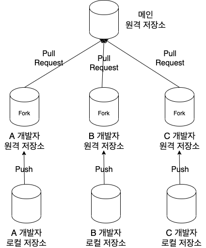

* Fork를 이용해 프로젝트를 통째로 외부로 복제해서 개발을 하는 방식
  * 각 개발자들이 복제해온 프로젝트에 실험적으로 개발을 한 후의 브랜치처럼 Merge를 바로 하는 것이 아닌 Pull Request로 원 프로젝트 관리자에서 리뷰를 통해 기능을 붙히는 방식


> Git - Flow 전략은 소프트웨어의 소스코드를 관리하고 출시하기 위한 브랜치 관리 전략이며 나온지 꽤 시간이 지난 전략이다.
>
> 이 전략의 단점을 극복하기 위해 [Github-Flow](https://guides.github.com/introduction/flow/)와 [Gitlab-Flow](https://about.gitlab.com/blog/2014/09/29/gitlab-flow/)도 나와있다. 각자 팀에 맞춰 선택하여 브랜치 전략을 사용하면 될 듯하다.

