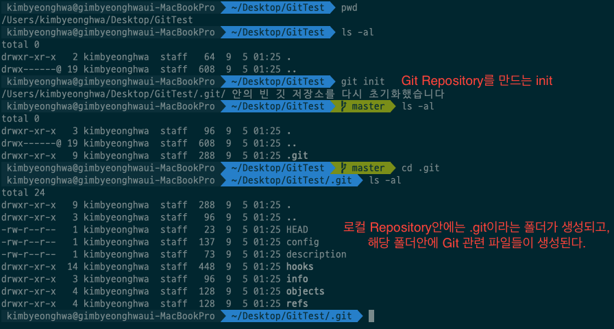
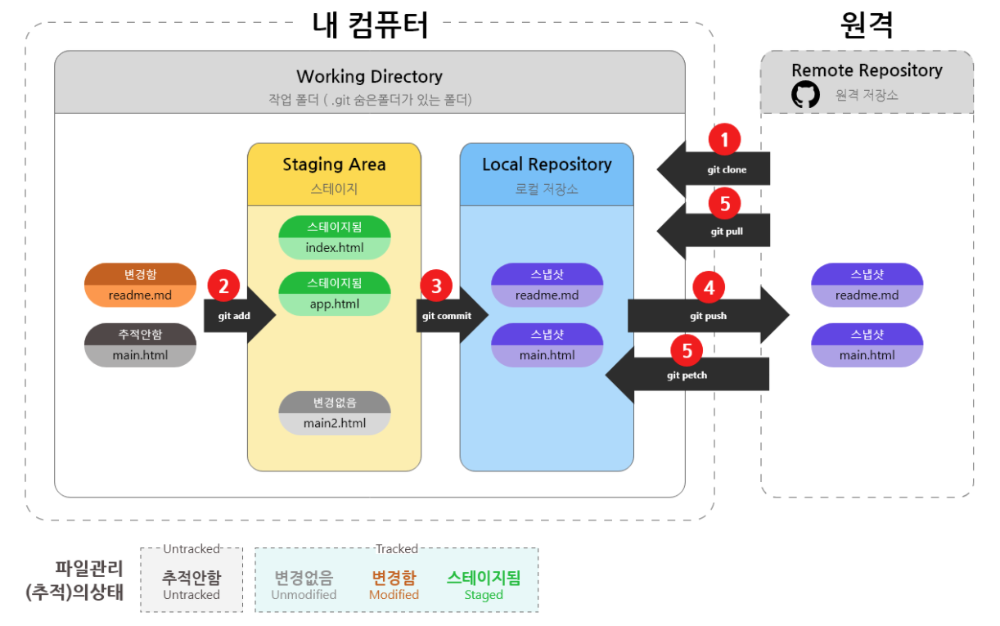
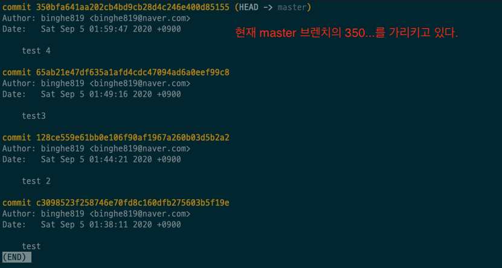
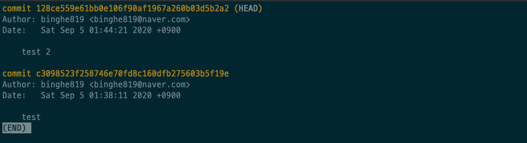
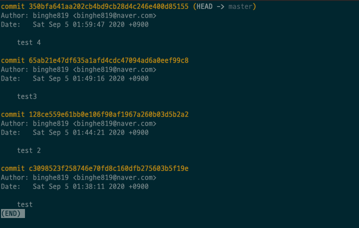
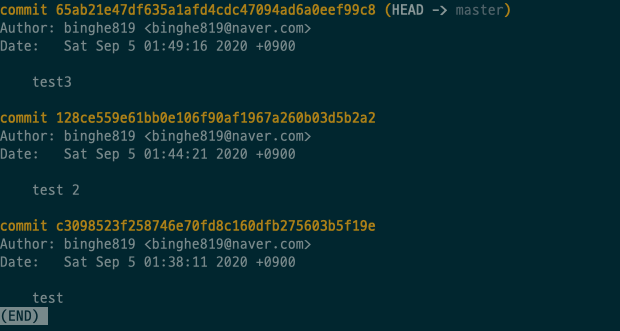
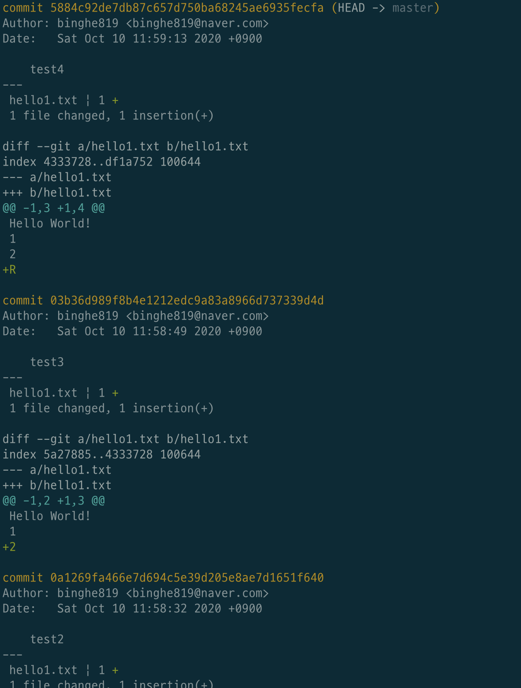
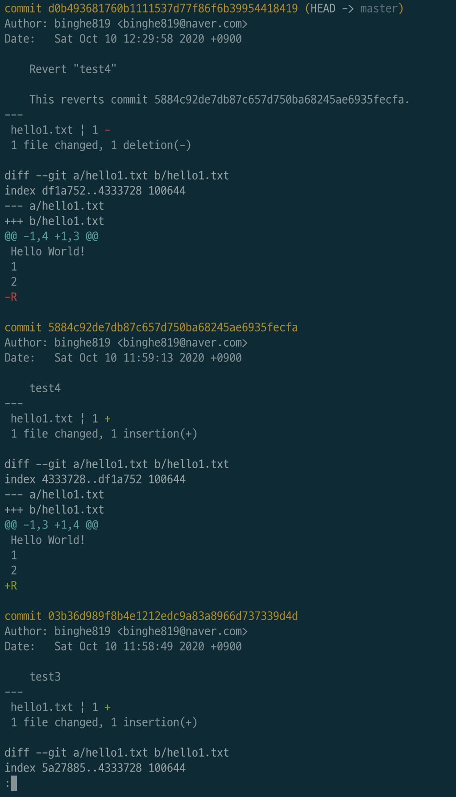

# 목차

- [버전 관리](#버전-관리)
  * [1 버전관리의 시작](#1-버전관리의-시작)
  * [2 버전 만들기](#2-버전-만들기)
    + [여러 저장소](#여러-저장소)
  * [3 checkout과 시간여행](#3-checkout과-시간여행)
    + [checkout](#checkout)
  * [4 버전 삭제 - reset](#4-버전-삭제---reset)
  * [5 되돌리기 - revert](#5-되돌리기---revert)
- [단축키 모음](#단축키-모음)
    + [git init](#git-init)
    + [git status](#git-status)
    + [git add](#git-add)
    + [git commit](#git-commit)
    + [git log](#git-log)
    + [git diff](#git-diff)
    + [git checkout](#git-checkout)
    + [git reset](#git-reset)

# 버전 관리

Git의 첫번째 기능은 바로 버전 관리이다.

## 1 버전관리의 시작

🙋‍♂️ 버전 관리의 시작은 저장소(repository)를 만드는 것에서부터 시작된다.

* 여기서 말하는 저장소는 로컬 저장소이다.

* `.git`폴더 안에 있는 내용들이 바로 Git과 관련된 내용들이다.
  * 버전 관리 관련 내용들도 담겨져 있다.

> `.git` 폴더안에 내용에 대해서는 나중에 더 자세히 다뤄보고자 한다.

## 2 버전 만들기

### 여러 저장소

출처 : https://uxgjs.tistory.com/182

* Repository : `.git` (버전이 저장되는 저장소)
* Working tree : 파일을 만들고 수정하는 곳. 버전으로 만들기 전 단계
* Staging Area : 버전을 만들고자할때 저장하는 저장소 (`commit`을 위해 `add`한 파일들을 담는 저장소) 

## 3 checkout과 시간여행

🙋‍♂️ 버전관리의 가장 큰 장점은 버전별로 시간여행을 할 수 있다는 것이다.

🤔 만약 `test 2`의 상태로 돌아가고 싶다면?

* `HEAD`를 `test 2`를 가리키게 하면 된다.
* `test 2`로 돌아가게되면 해당 폴더의 내용이 모두 `test 2`때로 돌아간다. 

### checkout

`git checkout 128ce559e61bb0e106f90af1967a260b03d5b2a2`

* 이제 저장소는 `test 2`시점으로 돌아가게 된다. 

> 이제 저장소는 `test 2`상태로 가게되고, 파일이나 폴더도 전부 삭제 되거나 수정된다.
>
> 하지만, ***`test 3`, `test 4`이 삭제된 것은 아니다. `git master`를 사용하면 다시 `test 4`로 돌아가게 된다.*** 

## 4 버전 삭제 - reset

🤔 `test 4`를 지우고 `test 3`로 하고싶다면?

* `git reset --hard 65ab21e47df635a1afd4cdc47094ad6a0eef99c8`
  * 리셋하겠다는 것은 뒤에 나오는 **버전으로 리셋하겠다는 의미를 갖는다.**

* `test 4`가 지워진 것을 볼 수 있다.

🤔 버전만 지우고 지금 폴더의 상황은 그대로 유지하고 싶다면?

* `git reset --soft 65ab21e47df635a1afd4cdc47094ad6a0eef99c8`

## 5 되돌리기 - revert

> `reset`은 특정 버전을 지우는 것인데, **`revert`는 삭제와 보존을 동시에 달성할 수 있다.**

🤔 `test 4`에서의 변화를 취소하고 `test 3`때로 돌아가게 한다. 단 새로운 커밋을 통해 `test 3`로 돌아가게 된다.

`현재 상황`

* **현재 `test4`에서 `test3` 으로 가고 싶으면 `test4`를  `revert`해줘야 한다.**
  * 이 점이 `reset`과 다른 점이며, 헷갈리는 부분. 

`git revert 5884c92de7db87c657d750ba68245ae6935fecfa` 후의 상황

* `test4`에서 그 이전 버전인 `test3`로 새롭게 커밋된 것을 볼 수 있다.
  * 즉, `test4`의 변경사항이 취소된 것.
  * `reset`과 다르게 `test4`를 유지한채로 새로운 버전을 만든다.

* 즉, **`test4` 만의 변화를 다시 되돌리고 싶을때 `revert` 를 사용하면 된다.**

> **만약 `test4`에서 `test2`까지 revert하고 싶다면 역순으로 revert 해줘야 한다. `test4` -> `test3` -> `test2`**
>
> 만약 현재 `test4`인데, 바로 `test2`로 revert하면 충돌(Conflict)이 일어난다.

# 단축키 모음

### git init

🤔 `git init` : Initialize Repository

### git status

🤔 `git status` : working tree status

### git add

🤔 `git add` : add to staging area

### git commit

🤔 `git commit` : create version

### git log

🤔 `git log` : show version

* Option
  * `--stat` : 변경사항에 대해서 출력
  * `-p` :patch - 변경사항을 자세히 보여준다.

### git diff

🤔 `git diff` : Show changes

### git checkout

🤔 `git checkout` : git의 HEAD를 옮기는 명령어. 버전간의 시간 여행.

### git reset

🤔 `git reset --hard` : 특정 버전을 지우는 명령어

