# 목차

 

- [목차](#목차)
- [들어가며](#들어가며)
- [1 H3](#1-h3)
  - [1-1 H3란?](#1-1-h3란)
  - [1-2 H3는 Grid 시스템이며, Grid 시스템은 인덱싱이 핵심이다](#1-2-h3는-grid-시스템이며-grid-시스템은-인덱싱이-핵심이다)
  - [1-3 Uber가 H3를 만든 이유](#1-3-uber가-h3를-만든-이유)
  - [1-4 왜 육각형인가?](#1-4-왜-육각형인가)
  - [1-5 H3 특징](#1-5-h3-특징)
- [2 H3 인덱싱 알고리즘](#2-h3-인덱싱-알고리즘)
- [3 Python을 이용한 H3 학습테스트](#3-python을-이용한-h3-학습테스트)

 

# 들어가며
GeoHash에 이어 알아볼 그리드(Raster) 시스템은 Uber에서 개발한 H3다.

**앞서 말했듯이 그리드 시스템을 사용하면 지리 공간적 데이터를 효율적으로 분석하여 셀(Cell)을 통해 지리 공간적 클러스터를 만들 수 있다.** 

그리드 시스템은 지리 공간적 데이터를 쉽고 효율적으로 집계, 클러스터, 분할, 축소, 조인 및 인덱싱할 수 있다.

이를 통해 쿼리 런타임 성능을 향상시키고, 저장된 데이터 크기를 줄일 수도 있다.

> 대표적인 그리드 시스템으로 GeoHash, S2, H3등이 있다.

이번 글은 Uber에서 개발한 H3가 무엇이며, 왜 우버가 H3를 만들었는지 살펴본다.

그리고 H3의 특징에 대해서 살펴본다.

 

# 1 H3
가장 먼저 알아 볼 부분은 H3의 개념과 특징이다.

 

## 1-1 H3란?

**H3는 Geo-Hash와 유사한 전세계 지도를 육각형 셀로 분할하는 지리 공간 인덱싱 시스템이다.**

H3는 Uber에의해 만들어졌으며, 현재는 Apache 2 라이센스하에 오픈소스로 되어있다.

H3는 아래와 같이 다양한 기능을 제공한다.

* 위경도를 H3셀로 변환할 수 있다.
* H3셀의 중심 위경도를 찾을 수 있다.
* H3셀의 경계(Boundary) 좌표를 구할 수 있다.
* H3셀의 이웃을 찾을 수 있다.

> 아마 [이전 Geo-Hash 글]()을 보고온 사람이라면 위 기능들은 H3뿐만 아니라 기타 Grid 시스템도 제공해준다는 것을 눈치챘을 것이다.

 

## 1-2 H3는 Grid 시스템이며, Grid 시스템은 인덱싱이 핵심이다
[이전 Geo-Hash 글]()에서 이야기했듯이, **위경도는 실제 정확한 위치를 측정하는 것이 목표여서 무한하게 표현되기때문에 특정 영역 (Area)에 대한 처리를 하기엔 부적합하다.**

그리고 공간에 대한 처리를 더 효율적으로 하기위해 만들어진 것이 바로 Grid 시스템이다.

**Grid 시스템의 핵심은 바로 인덱싱이다. 즉, 지구의 특정 지역을 일정한 크기대로 인덱싱하여 공간 처리에 대한 효율을 높이는 것이다.**

 

💁‍♂️ **Geo-Hash로 알아보는 그리드 시스템의 인덱싱**

**Grid 시스템의 가장 초기 시스템격인 `Geo-Hash`는 말그대로 hash 함수를 이용한다.**

> hash 함수의 핵심은 특정 데이터를 찾을 때 하나하나 비교하며 찾는 것보다 해시 키를 계산하여 그 키에 해당하는 장소를 바로 찾는 것이다. O(1)의 시간복잡도

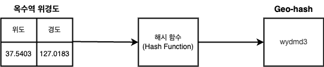 `위경도 -> Hash -> Geo-Hash`로 변환되는 과정

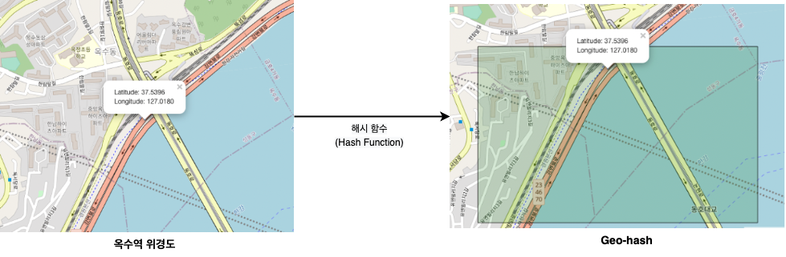 특정 Hash 함수를 이용하여 위경도를 특정 공간을 나타내는 공간으로 인덱싱한다.

쉽게 말해, Geo-Hash는 특정 해시 함수를 이용하여 공간 상의 위경도 좌표값을 일정한 값으로 치환하는 것을 의미한다.

그리고 이를 통해 전 지구를 **특정 크기의 정사각형으로 인덱싱**함으로써 공간 처리에 대한 효율을 높인다.

 

💁‍♂️ **H3도 Geo-Hash와 동일하게 인덱싱한다.**

**H3도 위에서 말한 Geo-Hash와 별반 다르지않다. 동일하게 위경도를 H3의 해시 함수를 통해 H3 셀로 변환하여 인덱싱한다.**

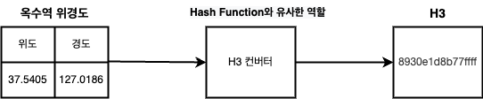 `위경도 -> H3 컨버터 -> H3`로 변환되는 과정

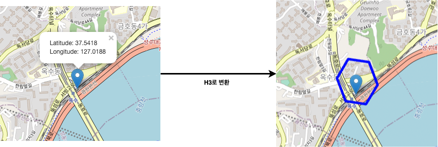 위경도를 H3로 변환하여 특정 공간을 나타내는 공간으로 인덱싱한다. 

쉽게 말해, H3도 Geo-Hash와 동일하게 특정 함수를 이용하여 공간 상의 위경도 좌표값을 일정한 값으로 치환한다.

그리고 이를 통해 전 지구를 **육각형으로 인덱싱**함으로써 공간 처리에 대한 효율을 높인다.

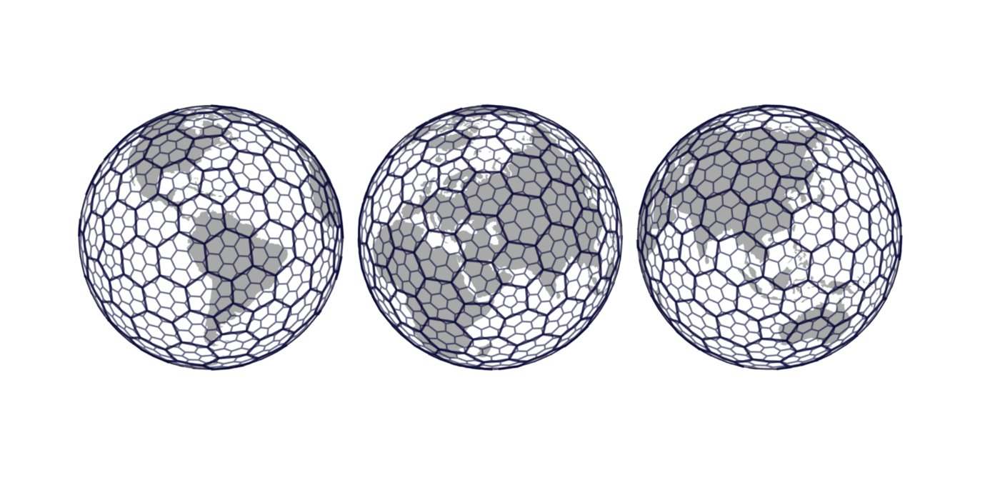 지구를 H3셀로 인덱싱한 결과 

 

## 1-3 Uber가 H3를 만든 이유
> 이 부분은 필자가 개인적으로 궁금하여 정리한 내용이다. PIP를 사용하는데 필요한 내용은 아니므로 스킵해도 무방하다.

 

**Geo-Hash와 같은 Grid 시스템이 이미 존재하는데도, 우버는 왜 H3라는 새로운 Grid 시스템을 만든 것일까?**

그 이유는 [Uber의 발표](https://www.youtube.com/watch?v=ay2uwtRO3QE)를 통해 알 수 있다.

* 우버의 최종목표는 사용자가 요청할 때 배차해야할 차를 무조건 존재하게하는 것이다.
  * 예를 들어, 스포츠 경기, 콘서트등 이벤트가 종료되고나서 많은 배차 요청이오는데, 이때 차가 부족하여 배차를 못받는 경우가 없도록하기위함이다.
* 우버의 목표를 만족시키는 방법 -> 드라이버의 공급을 늘려야한다.
  * 드라이버의 공급을 늘리기위해 사용된 방법이 바로 Surge Price (가격 인상)이다.
  * 이는 특정 지역의 수요가 많아지면, 해당 지역을 가격 인상 지역으로 설정하여 추가 요금을 받고 배차를 생성해주는 방식이다.
* Surge Price (가격 인상) 방식도 문제는 존재한다.
  * Surge Trip
    * 가장 큰 문제는 드라이버가 Surge Price 지역만을 찾아다니게된다는 것이다. (이를 Surge Trip이라고 부른다.)
    * 이로인해 Surge Price 지역이 아니라면 배차가 잘 생기지않고, 취소가 많아져 전체적인 마켓에 악영향을 끼치게된다.
  * 유령 수요
    * 또 다른 문제는 우버는 기본적으로 인근 몇 K/M내의 요청을 받아 배차를 생성하는데, Surge Price가 해당 K/M의 버위를 벗어남에따라 유령 수요가 많이 발생하게되었다고한다.
    * 즉, Surge Price 범위내에서도 고객의 요청이 드라이버에게까지 가지못하는 경우가 많이 발생했다. (초기에 우버는 도시단위로 Surge Price를 형성하였다고한다.. 굉장히 큰 범위라고 볼 수 있다.)
    * 이를 Pantom Demand (유령 수요)라고 부르며, Surge Price 지역이 너무 넓어서 발생하는 문제라고볼 수 있다.
* **Surge Price (가격 인상)에서 발생하는 문제를 해결하는 방법은 Grid System을 이용하여 여러 크기의 셀에서의 사용자 Action을 모두 인지하고 대처하는 것이다.**
* 그리하여 아래와 같은 우버의 요구사항에 맞게 Grid System인 H3를 만들어 사용하게되었다고한다.
  * Smooth gradients of demand를 구현할 수 있음
      * 동적으로 특정 셀의 변화도를 측정할 수 있다. (사용자의 배차요청수를 동적으로 계속해서 측정할 수 있다.) ex. 교통량 측정
  * Clear center of demand
  * Dynamic neighborhoods

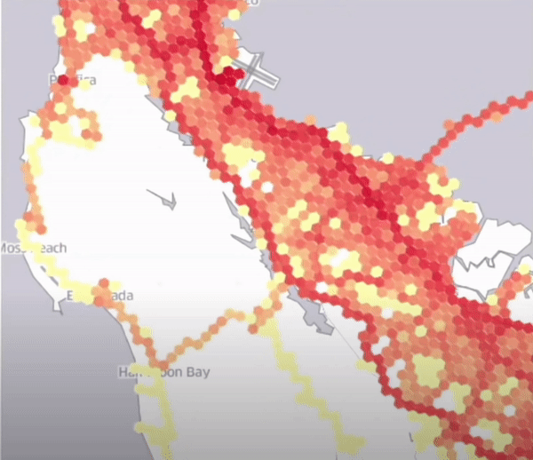 H3를 이용하여 동적으로 셀의 변화도를 시각화한 결과 (셀별로 동적 가격 정책을 다르게 할 수 있다.) 

 

## 1-4 왜 육각형인가?

H3와 Geo-Hash 모두 그리드 시스템이며, 지구를 특정 규격의 일정한 크기로 클러스터링하여 공간 처리를 효율화시켰다고보면된다.

하지만 **H3는 정사각형인 Geo-Hash와 다르게 육각형으로 공간을 클러스터링한다.**

 

🤔 **왜 육각형일까?**

 

1️⃣ **Neighbors Traversal - 육각형끼리의 거리가 동일하다.**

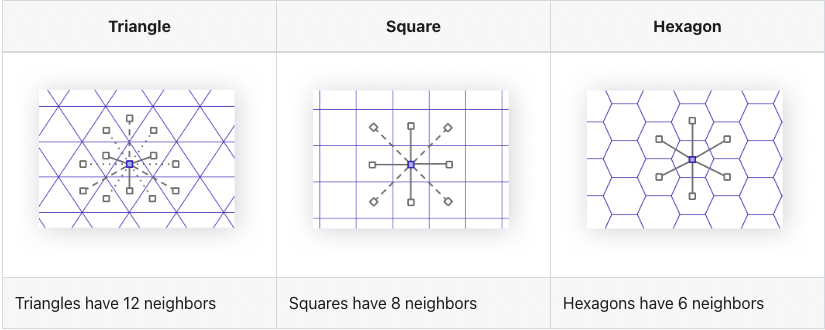 출처: https://h3geo.org/docs/highlights/aggregation 

위 그림에서 볼 수 있듯이, **삼각형과 사각형은 인근 셀과의 좌우상하과 대각선의 거리가 모두 다르다.**

**반면에 H3는 좌우상하와 대각선의 거리가 모두 동일하다.**

즉, **인접하고있는 셀로 이동할 때 어떠한 방향과 각도로 이동하든 각 셀의 중심점까지의 거리가 동일하다.**

Uber가 H3를 만들게된 계기도 차량 배치에 대한 정확도와 배치 가격을 정확히 측정하려고했다고하는데, 아마 이러한 부분에서 **셀간의 거리가 같은 것이 계산이 효율적이고 일정해서 그런게 아닌가 싶다.**

 

2️⃣ **평균적으로 사각형보다 육각형이 더 작은 오차 범위로 Polygon (다각형)공간을 셀로 채울 수 있다.**

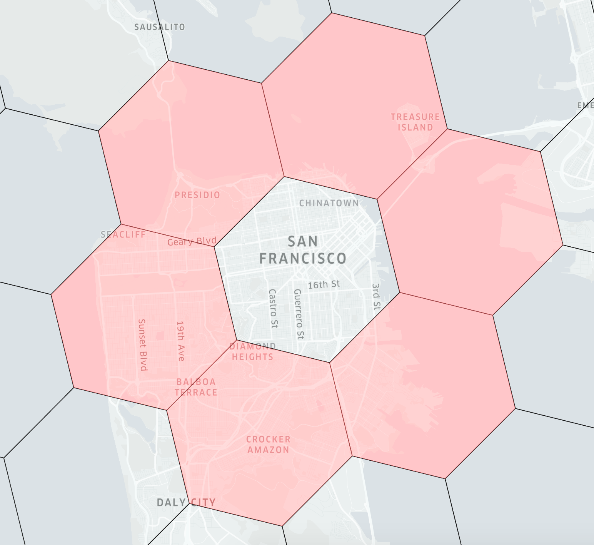 출처: https://h3geo.org/docs/highlights/aggregation 

육각형은 특정 Polygon을 채우는데 가장 최적의 도형이라고한다.

그리고 **H3의 공식문서에서 평균적으로 사각형보다 육각형이 더 작은 오차 범위로 Polygon (다각형)공간을 셀로 채울 수 있다고 말한다.**

> 물론 검증이 필요한 부분이기도하다.

 

3️⃣ **육각형은 Distortion(왜곡)없이 지구를 Projection (투영)할 수 있다.** 

지구는 Sphere (구체)이므로 평평하지않다. 그러나 Grid System은 평평하게 공간을 분석한다.

그러므로 지구를 Grid System으로 Projection (투영)해야 사용 및 분석할 수 있다.

구체를 평평하게 Projection하면 어쩔 수 없이 왜곡이 발생하게된다. H3는 이러한 왜곡을 최소화하는 Polygon이 육각형이라고 판단되어 채택했다고한다.

실제로 가장 중요한 이유였다고하며, 다양한 Projection 방법중에 H3는 DYMAXION 방법을 채택했다고한다.

 

❗️ **물론 단점으로 H3는 세분화 및 재조합(subdivision)이 완벽하지않다는 것이다. - 중요**

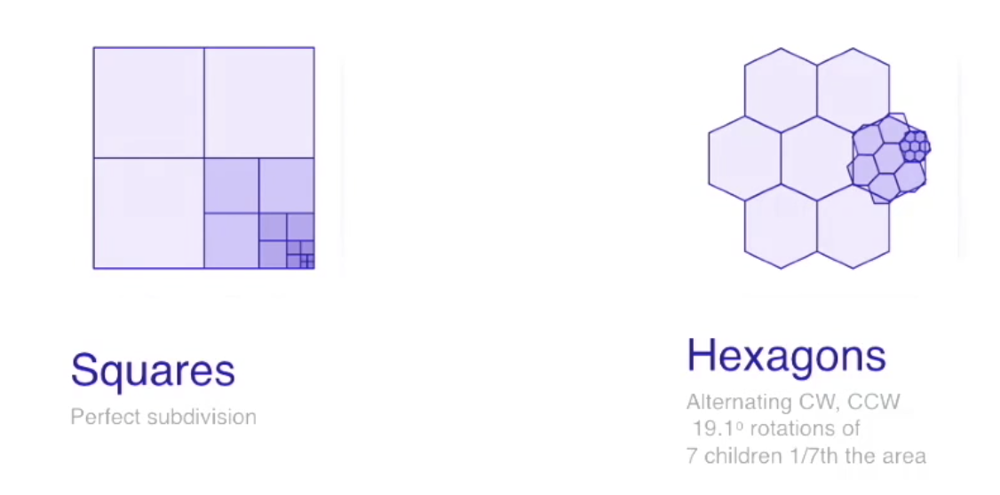 출처: https://www.youtube.com/watch?v=ay2uwtRO3QE 

위 그림을 보면 알 수 있듯이, 모든 H3셀은 7개의 자식을 가지게되지만, **Geo-Hash의 정사각형에 비해 육각형은 계층간의 완벽히 분리 및 재조합되진않는다.**

하지만 부모와 자식간의 변환이 일정하므로 H3 인덱스의 고정 오차 범위 내에서 정밀도를 만족할 수 있다고한다.

> 이와 관련된 더 자세한 내용은 [공식 문서](https://h3geo.org/docs/highlights/indexing/)를 참고.

 

## 1-5 H3 특징
H3의 기본적인 개념을 이해했다면, 이제 H3의 특징에 대해서 알아본다.

> Grid 시스템의 특징이자 H3의 특징을 정리하였다.

 

💁‍♂️ **H3의 단위는 점 (Point)가 아닌 셀 (cell)이다.**

셀이란 특정 범위의 공간(Area)을 의미한다.

**그리고 아래와 같이 옥수역 부근의 위경도를 H3 셀로 변환하면 모두 동일한 H3셀 값이 나오게된다.**

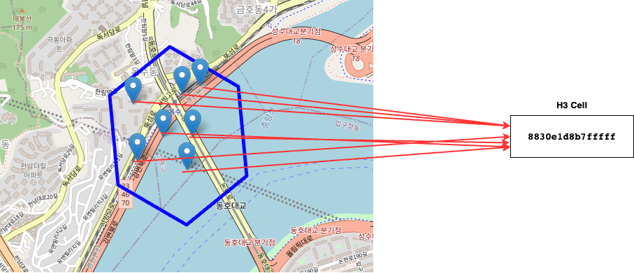 

위 그림과 **같이 옥수역 부근의 H3 셀 안의 존재하는 위경도를 H3로 변환하면 모두 동일하게 `8830e1d8b7fffff`가 나오는 것을 볼 수 있다.**

즉, **H3의 단위는 점이 아닌 지구를 인덱싱한 공간 (Area)이다.**

그러기에 **정확한 위치를 특정할 순 없지만, 공간을 찾거나 처리하는데 있어서 훨씬 비용이 적고 효율적이다.**

> 물론 Resolution이 높으면 비교적 정확한 위치를 특정할 수 있다. 단, 이렇게 할 경우 처리량이 증가하게된다.

 

💁‍♂️ **H3의 목적은 계층적 구조를 통해 연산량을 줄이는 것이라고 볼 수 있다.**

위경도는 실제 정확한 위치를 측정할 수 있다는 장점이 있다. 하지만 무한하게 표현되기때문에 특정 공간에 대한 처리를 하는데는 부적합하다.

반면에, H3는 실제 완전 정확한 위치를 측정할 수는 없지만, 유한하게 표현되며 인덱스 비슷하게 동작하기에 공간에 대한 처리를하는데 적합하다고 볼 수 있다.

이를 풀어말하면, H3도 Geo-Hash와 동일하게 결국 모자이크 처리라고 볼 수 있다.

> Grid 시스템의 특징이라고 볼 수 있다.

 Geo-Hash를 통해 살펴보는 모자이크

**이미지로 비유해보면 가장 선명한 이미지가 위경도(GPS)이고, H3의 Resolution (해상도)가 낮아질수록 이미지를 알아보기 힘들어진다.**

이를 **공간 좌표로 대입해본다면 위경도는 정확한 위치를 특정할 수 있지만, 무한하게 표현되기에 특정 공간을 찾는데 비용이크다.**

**반면에, H3는 정확한 위치를 특정하기 어렵지만, 유한하게 표현되기에 굉장히 적은 연산량으로 특정 공간을 찾거나 처리할 수 있다.**

> 쉽게 생각해봐도, 픽셀이 촘촘히 많아 무한한 범위안에서 특정 조건에 맞는 점이나 공간을 찾는 것은 모든 범위를 탐색해야하는 문제가 있다.
> 
> 위경도는 심지어 소수점까지있기에 거의 무한하다고볼 수 있다.
> 
> 반면에, **모자이크와 같이 픽셀을 낮출수록, 픽셀량이 적어지기에 탐색해야하는 범위가 점점 줄어들게된다.**
> 
> **이를 통해 연산량을 크게 줄일 수 있다. 이 부분이 바로 H3와 기타 Grid 시스템의 핵심이라고 볼 수 있다.**

 

💁‍♂️ **H3는 공간을 탐색하는데 용이한 반면 오차 범위가 존재한다.**

H3의 레벨별 셀의 실제 크기는 아래와 같다.

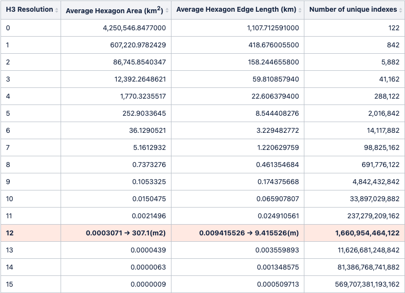 참고: https://h3geo.org/docs/core-library/restable 

당연히 H3도 기타 Grid 시스템과 동일하게 특정 점을 나타내지않고, 공간 (Area)를 표기하기때문에 조금의 오차가 존재한다.

**Resolution (해상도)가 높아질수록 육각형이 더 작아지고 표기하고자하는 점에 대한 오차는 점점 줄어들게된다.**

단, **Resolution이 높아질수록 처리해야할 H3 셀이 많아지기때문에 연산에 대한 성능이 떨어지게된다.**

 

💁‍♂️ **이웃 셀을 쉽게 찾을 수 있다.**

기존의 벡터에 위경도를 투영하는 방식은 특정 Polygon의 이웃 Polygon을 찾기 쉽지않다.

**H3는 알고리즘 특성상 쉽고 빠르게 이웃 셀을 판별하고 찾을 수 있다.**

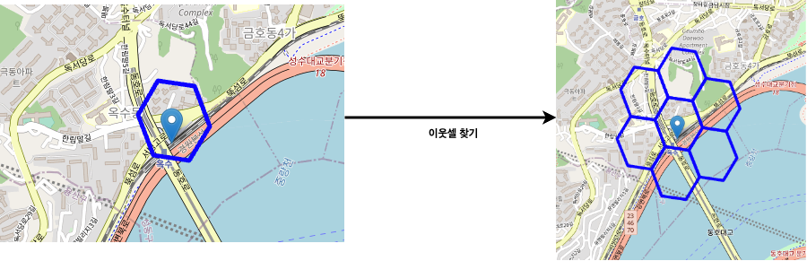 H3 이웃셀 찾기 

 

# 2 H3 인덱싱 알고리즘

H3는 어떻게 지구를 육각형으로 일정하게 인덱싱하며, 위경도를 H3셀로 변환하는 것일까?

> 정확한 변환 과정은 추후에 더 알아보고 정리할 계획이다.. 우선은 아래 참고 자료를 살펴보길 추천한다.
> * https://h3geo.org/docs/highlights/indexing/
> * https://h3geo.org/docs/core-library/h3Indexing
> * https://h3geo.org/docs/core-library/coordsystems

 

# 3 Python을 이용한 H3 학습테스트
H3에 대한 개념과 특징에 대해서 어느정도 이해했다면, 이제 파이썬을 이용하여 이를 직접 구현해본다.

학습 테스트에 대한 모든 코드와 설명은 [다른 글 - H3 학습테스트](https://nbviewer.org/github/binghe819/TIL/blob/master/ETC/%EA%B3%B5%EA%B0%84%EC%A0%95%EB%B3%B4/H3/H3.ipynb)에 정리해두었다.

> 위 학습 테스트를 따라하며 H3가 어떻게 동작하며, 어떻게 사용하는지 자세히 살펴보길 추천한다.

