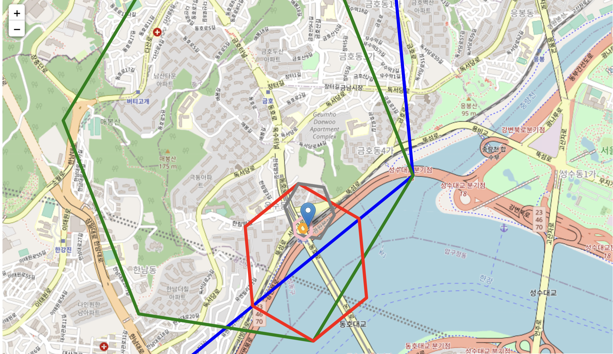

# 목차

<br>

- [목차](#목차)
- [들어가며](#들어가며)
- [요구사항 정리](#요구사항-정리)
- [H3를 이용한 Point In Polygon 과정](#h3를-이용한-point-in-polygon-과정)
  - [1 Shop (지역, Polygon)별 H3 셀을 생성하여 셀과 Area Id를 매핑시킨다.](#1-shop-지역-polygon별-h3-셀을-생성하여-셀과-area-id를-매핑시킨다)
  - [2 사용자의 위경도를 입력받아 해당 위치의 지정한 최소 Resolution과 최대 Resolution의 H3셀로 변환한다.](#2-사용자의-위경도를-입력받아-해당-위치의-지정한-최소-resolution과-최대-resolution의-h3셀로-변환한다)
  - [3 사용자 위경도를 변환한 List<H3Cell>을 순회하며 해당하는 Shop가 존재하는지 확인한다.](#3-사용자-위경도를-변환한-listh3cell을-순회하며-해당하는-shop가-존재하는지-확인한다)
- [마치며](#마치며)

<br>

# 들어가며
> 이 글은 [H3의 기본 개념](./H3_basic.md)과 [파이썬을 이용한 H3 학습 테스트](https://nbviewer.org/github/binghe819/TIL/blob/master/ETC/%EA%B3%B5%EA%B0%84%EC%A0%95%EB%B3%B4/H3/H3.ipynb)를 의존하고있다.

이번 글은 필자가 실제로 H3을 활용한 사례에 대해서 살펴본다.

바로 H3를 이용한 Point In Polygon (이하 PIP)이다.

PIP란, Point In Polygon의 줄임말로 하나의 점이 특정 다각형 영역안에 존재하는지 판단하는 것을 의미한다.

예를 들어, 배민, B마트, 당근과 같이 지역기반의 서비스를하는 애플리케이션에서 사용자 위경도 기반으로 어떤 지점에 속하는지 판단하는데 이럴때 사용되는 기술이 바로 PIP이다.

이번 글은 바로 이 PIP를 H3로 구현하는 방법에 대해서 살펴본다.

이번 글의 모든 코드는 [여기](./h3_Point_In_Polygon.ipynb)에서 확인할 수 있다.

> H3는 원래 PIP를 위해 탄생한 기술은 아니지만.. PIP로도 많이 활용된다. 
> 
> 실제 [H3 공식문서](https://h3geo.org/docs/highlights/indexing)에서도 H3를 일반적인 Grid System으로 보고 PIP로 활용하는 것에 대해서 이야기한다.

<br>

# 요구사항 정리
우선 요구사항을 간단히 정리해본다.

쉬운 이해를위해 이번 글은 퀵커머스의 예시를 들어본다.

퀵커머스는 배달기반의 커머스이므로, 사용자 위치가 어떤 지점(Shop)에 속하는지 알아야한다.

그래야 해당 지점에서 배달이 시작되어 고객이 빠르게 물건을 받을 수 있기때문이다.

<br>

💁‍♂️ **요구사항**

**사용자 위경도를 통해, 여러 지점(Polygon)중 배달 권역을 위해 어떤 지점(Polygon)에 속하는지 알아야한다.**
* 만약 특정 지점에 속하면 해당 지점을 안내해준다.
* 만약 어떠한 지점에도 속하지않으면 사용불가 안내를 해줘야한다.

예시를 들어보면 아래와 같다.

<p align="center"><br>PIP 요구사항 </p>

`사용자 위치 a`는 옥수동 지점에 속하며, `사용자 위치 b`는 어떠한 지점에도 속하지않는다.

이를 H3를 통해 구현해본다.

<br>

# H3를 이용한 Point In Polygon 과정
H3를 이용한 PIP 과정은 다른 Grid System (ex. Geo-Hash)와 동일하다.

1. Area (지역, Polygon)별 H3 셀을 생성하여 셀과 Area Id를 매핑시킨다.
    * 최소 Resolution과 최대 Resolution을 정하여 H3셀로 최적화한다. (compact)
    * 저장형태 - `key : value` = `H3 : AreaId`
2. 사용자가 위경도를 입력하면 해당 위치의 지정한 최소 Resolution과 최대 Resolution의 H3 셀로 변환한다.
    * 위경도 -> `List<H3Cell>`
3. 사용자 위경도를 변환한 `List<H3Cell>`을 순회하며 해당하는 AreaId가 존재하는지 확인한다.
    * `H3 : AreaId`의 Key(H3)를 이용하여 AreaId를 탐색하는 것. (시간 복잡도 - O(1))

<br>

## 1 Shop (지역, Polygon)별 H3 셀을 생성하여 셀과 Area Id를 매핑시킨다.

우선 아래와 같이 지점의 권역 정보를 [GeoJson](http://geojson.io/)으로 준비한다.
 
<p align="center"><br>옥수동 GeoJson 시각화 이미지 </p>

그리고 위 GeoJson을 아래와 같이 H3로 변환한다.

<p align="center">Resolution 12의 H3로 인덱싱한 결과 </p>

H3의 Resolution(해상도)를 높임으로써 정확하게 Polygon을 표현할 수 있다.

하지만 문제는 Resolution이 높을수록 Polygon을 정확하게 표현함과 동시에 처리해야할 H3 셀의 개수가 늘어난다.

반면, 처리 속도와 메모리 최적화를 위해 Resolution을 낮추면 Polygon을 정확하게 표현할 수 없게된다.

**이 문제를 해결하는 방법은 셀을 병합하는 것이다.**

즉, 아래와 같이 셀마다 부모인 바로 위 Resolution에 속하는 셀들이 같은 Polygon에 존재할 경우 병합하는 방식이다.

<p align="center">compact를 통해 Resolution 최적화 </p>

**마지막으로 변환한 H3 셀들을 `key : value` = `H3 : AreaId` 형태로 저장한다.**

<br>

코드로 살펴보면 아래와 같다.

```python
# 옥수동 GeoJson
oksu_area = {"type":"Feature","properties":{},"geometry":{"type":"Polygon","coordinates":[[[127.01445372035877,37.54809716556332],[127.01519057405264,37.547067018782066],[127.01682578510314,37.545734088046544],[127.01971158208781,37.54514917644688],[127.02129552047927,37.543356952041016],[127.02268789647377,37.5416894537722],[127.02287476642073,37.54145247733586],[127.02502596652482,37.53872004668483],[127.0256997843901,37.53786411011561],[127.02156491849887,37.535530965877896],[127.02092441234515,37.53511935680614],[127.01719422667055,37.53742400398111],[127.01576373980122,37.5383059781119],[127.01478926311766,37.538901377441235],[127.012889891509,37.539313813299806],[127.01213660754814,37.539185649095785],[127.0121256959346,37.53915070095481],[127.01176468898241,37.53904214089355],[127.01153303960568,37.53898146832435],[127.00992598136419,37.5393714047437],[127.00947114947282,37.53957682723548],[127.00932275981805,37.53967748124033],[127.00833696037861,37.54185929062551],[127.00842516184942,37.54286466482798],[127.00857717612135,37.543889052496155],[127.00860603570271,37.5439797142403],[127.01068194070888,37.548078215345136],[127.01078235714807,37.548086518251225],[127.01081324310977,37.54809814744944],[127.01086705353879,37.54811841641107],[127.01147996885422,37.54841614618272],[127.01165764754505,37.548511522986345],[127.01320761955266,37.54994422861261],[127.01437412125692,37.54913421189207],[127.01445372035877,37.54809716556332]]]}}
```

```python
# Area A에 대한 H3 정보를 생성한다.
min_h3_resolution = 6
base_h3_resolution = 12
area_a_h3_12 = list(h3.polyfill(oksu_area['geometry'], 12, geo_json_conformant=True))
area_a_h3_compacted = list(h3.compact(area_a_h3_12))

# 생성한 H3 정보와 Area A를 매핑한다.
db = {h3 : 'Shop A' for h3 in area_a_h3_compacted}
display(db)

# 결과
{'8b30e1d8b6d1fff': 'Shop A',
 '8c30e1ca59a91ff': 'Shop A',
 '8c30e1d8b0667ff': 'Shop A',
 ...
}
```

위 결과를 DB에 저장해둔다.

> 실제 서비스에선 실제 DB에 저장한다. 이번 글에선 간단한 구현을위해 dict에 넣어둔다.

<br>

## 2 사용자의 위경도를 입력받아 해당 위치의 지정한 최소 Resolution과 최대 Resolution의 H3셀로 변환한다.
DB에 미리 H3별 Shop 정보를 저장했다면, 이제 사용자의 위치 정보를 기반으로 사용자 위치가 어떤 Shop에 속해있는지 알아낼 수 있다.

<br>

우선 사용자 위경도 정보를 `List<H3Cell>`로 변환한다.

```python
# 사용자 위치정보 -> List<H3Cell> 변환 함수 정의
def geo_to_h3(lat, lng, min_resolution, base_resolution):
    result = []
    for resolution in range(min_resolution, base_resolution):
        h3_cell = h3.geo_to_h3(lat, lng, resolution)
        result.append(h3_cell)
    return result

# 사용자 위치정보 -> List<H3Cell> 변환
user_a_geo = [37.5404, 127.0184]
user_a_h3_cells = geo_to_h3(user_a_geo[0], user_a_geo[1], min_h3_resolution, base_h3_resolution)
print('user_a 위경도를 H3로 변환한 결과: ', user_a_h3_cells)

user_b_geo = [37.5448, 127.0247]
user_b_h3_cells = geo_to_h3(user_b_geo[0], user_b_geo[1], min_h3_resolution, base_h3_resolution)
print('user_a 위경도를 H3로 변환한 결과: ', user_b_h3_cells)
```
```python
# 결과
user_a 위경도를 H3로 변환한 결과:  ['8630e1d8fffffff', '8730e1d8bffffff', '8830e1d8b7fffff', '8930e1d8b77ffff', '8a30e1d8b757fff', '8b30e1d8b750fff']
user_a 위경도를 H3로 변환한 결과:  ['8630e1d8fffffff', '8730e1d8bffffff', '8830e1d8b3fffff', '8930e1d8b2fffff', '8a30e1d8b2effff', '8b30e1d8b2edfff']
```

<p align="center"><br>user_a의 H3를 시각화한 결과 </p>

<p align="center"><br>user_b의 H3를 시각화한 결과 </p>

**만약 사용자 위경도를 min부터 max까지의 Resolution만큼 변환한 H3Cell중에서 미리 만들어둔 Shop의 H3과 동일한 셀이 존재한다면 해당 지점에 위치해있다고본다.**

<br>

## 3 사용자 위경도를 변환한 List<H3Cell>을 순회하며 해당하는 Shop가 존재하는지 확인한다.
마지막으로 사용자 위치정보를 기반으로 변환된 `List<H3Cell>`을 순회하며 DB로부터 어떤 Shop에 속해있는지 확인하면 된다.

* `H3 : AreaId`의 `Key`(H3)를 이용하여 Shop Id를 탐색하는 것. (시간 복잡도 - `O(1)`)

```python
# 유저가 속하는 Area 반환 함수 정의
def what_area_is_in(db, h3_cells):
    result = set()
    for cell in h3_cells:
        if (db.get(cell) is not None):
            result.add(db.get(cell))
    return result

# 유저가 속하는 Area 확인
user_a_result = what_area_is_in(db, user_a_h3_cells)
user_b_result = what_area_is_in(db, user_b_h3_cells)

# 결과 출력
print(f'유저 a가 속하는 지점은 {"없습니다" if not user_a_result else user_a_result}')
print(f'유저 b가 속하는 지점은 {"없습니다" if not user_b_result else user_b_result}')
```
```python
유저 a가 속하는 지점은 {'Shop A'}
유저 b가 속하는 지점은 없습니다
```

이로써 `사용자 위치 a`는 `Shop A`에 속해있으며, `사용자 위치 b`는 어떠한 Shop에도 속해있지않다는 것을 알 수 있다.

<br>

# 마치며
H3도 기타 Grid System (ex. Geo-Hash)와 동일한 매커니즘으로 동작한다고보면 된다.

다만, H3가 Geo-Hash보다 왜곡없이 지구를 잘 표현하며, 더 적은 용량으로 셀 인덱스를 생성할 수 있다.

