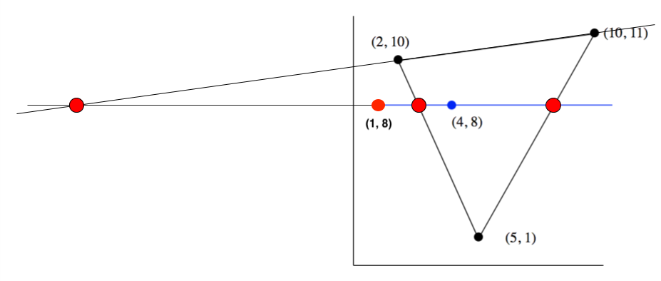
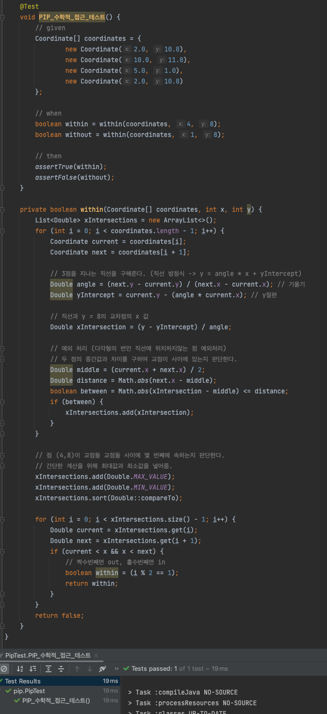

# 목차

<br>

- [목차](#목차)
- [들어가며](#들어가며)
- [Geo-fence가 무엇이며, 어떻게 활용되는가?](#geo-fence가-무엇이며-어떻게-활용되는가)
- [Geojson으로 표현하는 Geo-fence](#geojson으로-표현하는-geo-fence)
- [Geo-fence을 활용한 PIP 기초 알고리즘](#geo-fence을-활용한-pip-기초-알고리즘)
  - [Simple Polygon](#simple-polygon)
  - [Ray casting algorithm](#ray-casting-algorithm)
  - [Winding number algorithm](#winding-number-algorithm)
  - [알고리즘 비교](#알고리즘-비교)
- [벡터 기반의 PIP의 단점](#벡터-기반의-pip의-단점)
- [마치며](#마치며)
- [출처](#출처)

<br>

# 들어가며
이번 글은 공간 데이터를 활용한 공간분석 기법중 하나인 Point In Polygon (이하 PIP)에 대해서 다룬다.

**PIP의 의미는 Determining Whether a Point is Inside of a Polygon이며, 번역하면 한 점이 특정 다각형 공간안에 위치하는지 판단하는 것을 의미한다.**

이러한 PIP의 기술을 가르켜 보통 유비쿼터스 언어로서, 다각형의 가상 울타리 Polygon을 만든다는 의미로 `Geo-fence`라는 용어를 사용한다.

> PIP 분석을 위한 가장 기초적인 공간에 대한 유비쿼터스 언어로 Geo-fence가 사용된다고보면 된다.

사실 `Geo-fence`는 그저 지도상의 다각형의 가상 울타리를 의미할 뿐, PIP의 기초가 되는 개념이라고 볼 수 있다.

> 주의할 점은, Geo-fence와 PIP는 완전히 같은 의미는 아니란 것이다.

이번 글은 `Geo-fence`에 대한 기본적인 개념과 이를 활용한 PIP의 기초적인 알고리즘에 대해서 다룬다.

<br>

# Geo-fence가 무엇이며, 어떻게 활용되는가?
먼저 PIP의 기초가 되는 Geo-fence의 개념을 알아본다.

<br>

🤔 **Geo-fence?**

* 사전적 의미
  * Geo: 지구, 토양의 의미를 담은 접두어.
  * Fence: 울타리.
  * Geo-fence: 실제 지형에 구획된 가상의 반경.
* 지오팬스 (Geo-fence)는 실제 지리적영역에 가상으로 생성된 경계를 의미한다.
  * a virtual perimeter for a real-world geographic area.

<p align="center"><br>출처: https://en.wikipedia.org/wiki/Geo-fence </p>

위 예시를 보면 GPS를 이용한 애플리케이션에 두 개(빨간, 파란)의 가상 울타리가 생성된 것을 볼 수 있다.

**두 개의 가상 울타리를 가리켜 Geo-fence라고 부른다.**

> 서칭하다보면 `Geo-fencing`이라는 단어를 접하는데, 이는 말그대로 지오팬스를 이용한다는 의미이다.

<br>

🤔 **PIP와 Geo-fence는 어떤 연관이있는가?**

앞서 말했듯이, PIP (Point In Polygon)는 한 점이 특정 다각형 공간안에 위치하는지 판단하는 것을 의미한다.

**그리고 여기서말하는 다각형 공간을 Geo-fence로 표현하는 것이다.**

다만, 유비쿼터스언어로써 흔히 Geo-fence와 PIP (Point In Polygon)을 같은 의미로 얘기하는 경우가 존재한다.

다시 말하지만, **Geo-fence는 PIP에서의 다각형 공간을 의미한다. PIP에 대한 알고리즘(Vector 기반과 그리드 기반)은 따로 존재한다.**

> 필자가 처음 Geo-fence에 대한 개념을 접할때 이부분이 이 부분이 헷갈렸다...

<br>

🤔 **Geo-fence는 어디에 사용되는가?**

* 마케팅
  * 특정 사용자가 지정한 가상 울타리에 들어오면 마케팅 메시지를 보내는 서비스.
* **위치 기반 서비스**
  * **배달의 민족, B마트, 당근 마켓등 위치 기반의 서비스에서 영역별 서비스를 위해 사용된다.**
  * **행정동이나 법정동만으로는 배달가능지역에 대한 지역을 커스텀할 수 없기에, Geo-fence기반의 PIP를 이용한다.**
* 대중교통
  * 대중교통에서 정류장에 Geo-fence를 생성함으로써 버스의 위치 정보(어떤 정류장인지)를 파악한다.

<br>

# Geojson으로 표현하는 Geo-fence
컴퓨터 애플리케이션에서 어떻게 가상 울타리인 Geo-fence를 표현할까?

필자가 개발 및 관리하고있는 애플리케이션에선 Geojson기반으로 이를 표현한다.

> 실제로 구글링을 통해 많은 예시를보면 Geojson을 많이 이용한다.

<br>

🤔 **Geojson?**

* Geojson은 개방형 표준 지리공간 데이터 변환 형식으로, JSON을 기반으로 다양한 지리적 데이터 구조를 인코딩할 수 있는 형식을 의미한다.
* Geojson은 지리적 좌표 참조 체계인 WGS84 (World Geodetic System 1984)와 십진 도수 단위를 사용한다.
  * 앞서 [좌표계 기본 이해하기](../좌표계%20기본%20이해하기/좌표계_기본_이해하기.md)에서 다뤘듯이, WGS84는 실제 지리좌표계 (위경도)에서 표준으로 사용된다.
  * 즉, **Geojson은 위경도를 이용하여 위치 값을 표현한다.**

<br>

💁‍♂️ **Geojson을 이용하여 표현한 Geo-fence**

<p align="center"><br>성동구의 Geo-fence를 Geojson으로 표현한 예시 </p>

[geojson.io](http://geojson.io/)에서 쉽게 가상 울타리를 편집할 수 있다.

지도에서 점을 이어서 가상 울타리를 만들면 자동으로 오른쪽에 위경도 기반의 json형식의 Geojson이 생성된다.

<br>

# Geo-fence을 활용한 PIP 기초 알고리즘
앞서 말했듯 **Geo-fence는 그저 위경도 기반으로 다각형 형태의 가상의 울타리를 의미한다.**

이번엔 Geo-fence를 이용한 PIP의 알고리즘에 대해서 알아본다.

<br>

🤔 **어떻게 한 점이 특정 Geo-fence에 위치한지 파악할 수 있을까?**

<p align="center"><br>Point In Polygon</p>

<br>

참고로 실제로 Geo-fence와 PIP를 활용하는 서비스들은 위경도 정보뿐만아니라, RFID, 와이파이도 활용한다고한다. 

이번 글에선 위경도 정보를 통한 PIP만을 다룬다.

또한, **여기서 다루는 알고리즘은 2차원 그리드 방식이 아닌 2차원 벡터를 이용한 PIP 알고리즘만을 다룬다.**

> 일정한 크기의 셀로 나누는 그리드 방식은 추후 다른 글에서 정리할 계획이다. (ex. GeoHash, S2, H3등)

<br>

## Simple Polygon
정말 간단한 사각형 모양의 공간안에 점이 존재하는지 파악하는 것은 아래와 같이 굉장히 간단하다.

그저 x, y축 값만으로도 특정 점이 Polygon 공간안에 위치한지 파악할 수 있다.

<p align="center"></p>

점 p에 대해서 위와 같이 간단한 Polygon 공간안에 위치한지 파악하기 위해선 아래 식을 이용하면 된다.

```text
1 <= px <= 2, 1 <= py <= 2
```

<br>

또한, **만약 Polygon이 원만으로 구성된다면, 원의 중심점에서 점과의 거리와 원의 반지름의 거리를 비교하여 점이 원안에 존재하는지 확인할 수 있다.**

하지만 **Polygon 공간이 정사각형이나 원형처럼 간단한 경우는 거의 없다.**

**지도안에 요소들은 간단한 모양으로 표현할 수 없기때문에 대부분이 다각형으로 구성되어있다.**

다각형의 Polygon에 Point가 존재하는지 확인하는 알고리즘으로 크게 두 가지가 존재한다.

* Ray casting algorithm
* Winding number algorithm

> 다시 말하지만.. 이번 글은 2차원 벡터 방식의 PIP 알고리즘에 대해서만 다룬다.

<br>

## Ray casting algorithm
이제 비교적 복잡한 다각형 Polygon 공간을 대상으로 특정 점이 공간 안에 위치한지 알아내는 알고리즘을 알아본다.

가장 대표적인 PIP 알고리즘은 `Ray casting algorithm`이다.

> `crossing number`라는 이름으로도 불리운다.

<br>

🤔 **Ray casting algorithm의 의미**

* 가상의 공간에 보이지 않는 광선 (Ray)을 투사해 닿는 표면을 파악하는 기술이다.
* 여기선 한 점을 지나는 선을 광선으로 생각하고, Polygon에 빛을 투사해서 몇 개의 선이 지나는지 파악하는 방식을 이용한다.

<br>

💁‍♂️ **알고리즘 원리**

알고리즘의 원리는 간단하다.

<p align="center"><br>출처: https://en.wikipedia.org/wiki/Point_in_polygon </p>

1. 점을 지나는 임의의 직선을 그린다.
2. 그 직선과 가상으로 만든 Polygon 도형이 만나는 교점을 기준으로 선의 번호를 매깁니다.
3. **점이 홀수 번째 선 위에 있으면 도형 안에 포함, 짝수 번째 선 위에 있으면 도형 밖으로 판단한다.**
   * **혹은 점부터 시작하는 선을 어떠한 각도여도 그어보면 선과 닿는 점이 홀수면 도형 안으로 판단, 짝수면 도형 밖으로 판단한다.**

생각보다 굉장히 심플하다..

<br>

💁‍♂️ **자바 구현 예시**

이번에 간단히 자바의 JTS(평면 기하학 오픈소스 라이브러리)로 PIP를 구현해본다.

예시로는 아래와 같이 강남역 부근에 Polygon을 형성하고, 강남역과 신논현쪽에 위치한 교보문고가 해당 Polygon에 위치한지 테스트해본다.

<p align="center"> </p>

JTS의 `within` 메서드를 이용하여 테스트를 구현해보면 아래와 같다.

<p align="center"> </p>

위 테스트를 실행해보면 테스트가 잘 통과하는 것을 볼 수 있다.

> 참고로 점이 영역의 경계선에 위치하면 안에 있다고 판단하지 않는다. 자세한 내용은 [DE-9IM](https://en.wikipedia.org/wiki/DE-9IM)을 참고.

<br>

💁‍♂️ **이번엔 수학적으로 살펴본다.**

> 수학적인 내용은 [우아한형제들 기술 블로그의 글](https://techblog.woowahan.com/2567/)을 참고하여 작성한 글입니다.

<p align="center"><br>출처: https://techblog.woowahan.com/2567/ </p>

수학적인 예시를 위해 점 `(1, 8)`과 `(4,8)`이 삼각형 공간안에 위치한지 확인해본다.

해결하는 순서는 아래와 같다.

1. 삼각형 직선 3개 방정식을 구한다.
2. 점 (1,8) 과(4, 8)을 지나는 직선 (y = 8)과 직선 3개의 교점을 구한다.
3. 각 교점을 통해 점이 몇 번째 선 위에 존재하는지 구한다. (홀수면 in, 짝수면 out)

코드로보면 아래와 같다.

<p align="center"> </p>

> 직선의 교점을 구하다보면 삼각형 변 위의 점이 아닌 부분이 있다. 이 부분은 두 점의 중간값과 차이를 구하여 예외처리를해준다.

<br>

❗️ **주의할 점**

<p align="center"><br>출처: https://techblog.woowahan.com/2567/ </p>


위와 같이 임의의 점이 도형 안에 포함되어 있지만, 짝수 번재의 선 위에 있으면 밖에 있다고 잘못된 값을 반환할 수 있다.

물론 충분히 예외처리할 수 있긴 하다..

<br>

## Winding number algorithm
두 번째 알고리즘은 `Winding number algorithm`이다.

<br>

🤔 **Winding Number Algorithm의 의미**

<p align="center"><br>Winding number 알고리즘의 동작 방식<br>출처: https://iq.opengenus.org/inside-outside-test/ </p>

위 그림에서 볼 수 있듯이, **다각형의 면이 점을 감싸는 횟수를 기반으로 0인 경우 Polygon 밖, 0이 아닌 경우 Polygon 안으로 판단하는 알고리즘이다.**

<br>

💁‍♂️ **알고리즘 원리**

<p align="center"><br>https://en.wikipedia.org/wiki/Point_in_polygon </p>

> 알고리즘 원리에 대해선 더 자세히 알아보고 이 글에 추가할 예정이다.

<br>

## 알고리즘 비교
Ray casting algorithm와 Winding number algorithm를 비교한다면.

둘 다 교착점을 찾아서 계산하는 방식이기 때문에, 효율성면에선 동일하다.

단, 정확도면에선 Winding Number이 더 정확하다는 자료가 훨씬 많다.

결론적으론 일반적으로 벡터기반의 PIP에선 Winding Number가 더 선호된다는 자료가 많다.

<br>

# 벡터 기반의 PIP의 단점
> 여기서 말하는 벡터 기반의 PIP 알고리즘은 Geo-fence 기반의 Ray casting와 Winding number 알고리즘을 의미한다.

**인덱싱**

* 벡터 기반의 PIP 기법들은 인덱싱이 전혀 되어있지 않다.
* 이로 인해 특정 점이 어떤 Geo-fence에 속하는지 찾으려면, 지도에 설정한 모든 Geo-fence를 순회하며 찾아줘야한다.
* **시간 복잡도: 모든 Geo-fence를 순회하는 N * 매 Geo-fence별 PIP 알고리즘 N => `O(N^2)`**

<br>

# 마치며
이번 글에선 Geo-fence의 기본적인 개념과 벡터 기반의 PIP의 기초를 알아보았다.

다음 글로는 그리드 기반의 PIP 분석기법인 Geo-hash, S2, H3를 알아볼 예정이다.

<br>

# 출처
* https://en.wikipedia.org/wiki/Geo-fence
* https://en.wikipedia.org/wiki/Point_in_polygon
* https://www.baeldung.com/cs/geofencing-point-inside-polygon
* http://www.geomalgorithms.com/algorithms.html
* https://towardsdatascience.com/is-the-point-inside-the-polygon-574b86472119
* https://techblog.woowahan.com/2567/
* https://gis.stackexchange.com/questions/262751/how-to-determine-if-one-polygon-is-contained-in-another
