<br>

# 목차

<br>

- [목차](#목차)
- [GeoHash 기본 개념과 Geo-hash를 이용한 Point In Polygon](#geohash-기본-개념과-geo-hash를-이용한-point-in-polygon)
- [1 Geo-hash](#1-geo-hash)
  - [1-1 Hash와 Hash함수](#1-1-hash와-hash함수)
  - [1-2 Geo-hash란?](#1-2-geo-hash란)
  - [1-3 Geo-hash 알고리즘](#1-3-geo-hash-알고리즘)
  - [1-4 Geo-hash 특징](#1-4-geo-hash-특징)
  - [1-5 Geo-hash 한계](#1-5-geo-hash-한계)
- [2 파이썬을 통한 Geo-hash 학습테스트](#2-파이썬을-통한-geo-hash-학습테스트)
  - [2-1 위경도와 Geo-hash간의 변환](#2-1-위경도와-geo-hash간의-변환)
  - [2-2 Neighbors](#2-2-neighbors)
  - [2-3 bounding box](#2-3-bounding-box)
- [3 파이썬 Folium을 이용한 시각화](#3-파이썬-folium을-이용한-시각화)
  - [3-1 bbox를 이용한 Geo-hash 셀 그리기](#3-1-bbox를-이용한-geo-hash-셀-그리기)
  - [3-2 GeoJson Polygon을 여러 Geo-hash로 표현](#3-2-geojson-polygon을-여러-geo-hash로-표현)
- [4 Geo-hash 최적화](#4-geo-hash-최적화)
- [5 Geo-hash를 이용한 Point In Polygon](#5-geo-hash를-이용한-point-in-polygon)
- [마치며](#마치며)
- [참고](#참고)

<br>

# GeoHash 기본 개념과 Geo-hash를 이용한 Point In Polygon
[이전 글](../Point%20in%20polygon%20-%20GeoFence/Point%20in%20polygon%20-%20GeoFence.md)에선 Geo-fence의 기본 개념과 위경도를 벡터에 투영한 Point In Polygon (이하, PIP) 알고리즘에 대해 알아보았다.

이전 글에서도 보았듯이, 위경도를 벡터공간에 투영하고 GeoJson을 통해 Polygon을 만들어 PIP를 구현할 수 있다.

하지만, **위경도는 실제 정확한 위치를 측정하는 것이 목표여서 무한하게 표현되기때문에 특정 영역 (Area)에 대한 처리를 하기엔 부적합하다는 결론에 이르렀다.**

**자세히 말하자면 위경도를 벡터에 투영한 PIP 방식은 다수의 Polygon이 존재하는 상황에서 `O(n^2)`의 시간복잡도가 소요된다.**

> 실제 트래픽이 많이 발생하는 애플리케이션에선 사실상 PIP용도로 사용 불가하다.

또한, Polygon간의 이웃 판별이 어렵다.

**실제 많이 사용되는 영역기반의 검색과 표현에 더 적합한 구조가 필요한데, 그 방식이 바로 지구를 일정한 크기로 클러스터링하는 그리드(Grid) 방식이다.**

> 마지막에 다루겠지만, 그리드 방식의 PIP는 여러 Polygon이 있다고해도 `O(1)`의 시간복잡도를 만들 수 있다.

**이번 글은 그리드 방식중 하나이자 인덱스의 개념을 가장 함축적으로 지닌 Geo-Hash에 대해서 살펴본다.**

우선 Geo-Hash의 기본 개념과 알고리즘에 대해서 살펴보고, Geo-Hash를 이용한 Geo-fence를 구현 및 시각화해본다.

마지막으론 Geo-hash 최적화 방법과 PIP 구현하는 방법에 대해서 알아본다.

> 이 글은 [이전 글 - Geofence와 PIP](../Point%20in%20polygon%20-%20GeoFence/Point%20in%20polygon%20-%20GeoFence.md)을 의존하므로, 이전 글을 보고 올 것을 추천한다.

> 전체 코드는 [주피터 노트북](https://nbviewer.org/github/binghe819/TIL/blob/master/ETC/%EA%B3%B5%EA%B0%84%EC%A0%95%EB%B3%B4/Point%20in%20polygon%20-%20GeoHash/Geo-Hash.ipynb)를 참고하면 된다.

<br>

# 1 Geo-hash
가장 먼저 알아 볼 부분은 Geo-hash의 개념과 특징이다.

이를 통해 벡터 기반의 공간 분석보다 왜 그리드 방식의 공간 방식이 더 효율적인지 알아본다.

<br>

## 1-1 Hash와 Hash함수
이름에서 알 수 있듯이, `Geo-hash`는 `hash`를 이용한다.

사전에 나오는 해시 함수에 대한 정의는 다음과 같다.

> **해시 함수 (짧게는 그냥 해시)는 임의의 길이를 갖는 임의의 데이터를 고정된 길이의 데이터로 매핑하는 단방향 함수를 말한다**

해시 함수의 핵심은 특정 데이터를 찾을 때 하나하나 비교하며 찾는 것보다 해시 키를 계산하여 그 키에 해당하는 장소를 바로 찾는 것이다.

이를 통해 O(1)의 시간 복잡도를 만들 수 있다.

**`Geo-hash`도 해시 함수의 핵심을 이용한다. 즉, `Geo-hash`는 `hash`를 통해 공간 상의 위경도 좌표값을 일정한 값으로 치환하는 것이 핵심이다.**

<br>

## 1-2 Geo-hash란?
`Geo-hash`는 해시 함수의 원리를 이용한다고 말한다. 그렇다면 어떻게 이용할까?

바로 위경도를 해시 함수에 넣으면 지구를 특정 크기로 자른 공간의 해시 값으로 변환된다.

<p align="center">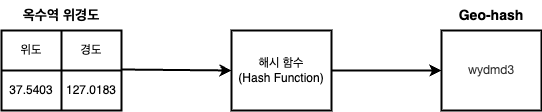 </p>

더 자세한 그림을 보자면 아래와 같다.

<p align="center">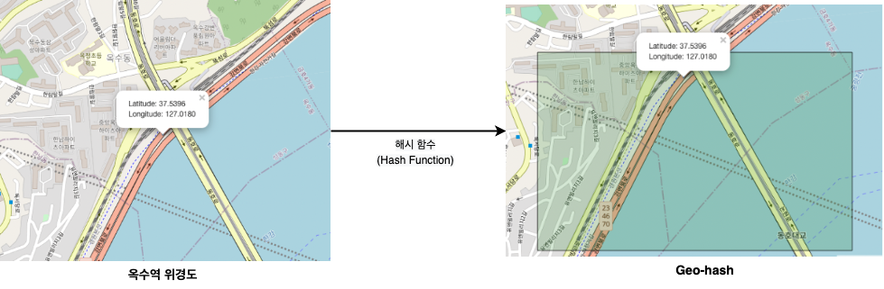 </p>

<br>

위와 같이, **Geo-hash란 지도 공간을 사각형으로 분할하는 계층적인 공간 데이터 구조를 의미한다.**

<p align="center"><br>전 세계 지역을 특정영역 단위로 잘라낸 것이 기본 사상이다. </p>

이는 Gustavo Niemeyer가 개발하였으며, 위경도를 문자와 숫자로 이루어진 짧은 String 형태로 변환한다.

아래서 더 자세히 다루겠지만, 

**Geo-hash는 사용자가 원하는 만큼의 정확도를 구현할 수 있으며, 맨 뒤에 글자를 지우는 것만으로 크기를 줄일 수 있다. (물론 이렇게되면 정확도가 줄어든다.)**

<br>

## 1-3 Geo-hash 알고리즘
이제 위경도 정보를 특정 해시 값으로 변환하는 Geo-hash의 핵심 알고리즘에 대해서 알아본다.

**위경도를 Geo-hash로 변환하는 과정은 크게 두 가지로 나뉜다.**

1. 위경도 정보를 특정 규칙에 따라 이진수로 변경한다.
2. 변경된 이진수를 특정 규칙에 따라 32진수로 변경한다. 변경된 32진수가 바로 Geo-hash이다.

<br>

**간단히 옥수역의 Geo-hash를 구하는 예시를 통해 어떻게 구하는지 알아본다.**

<p align="center"><br>옥수역 위경도</p>

위도는 `37.5402`, 경도는 `127.0184`인 옥수역 대상으로 Geo-hash 값을 구해본다.

<br>

1️⃣ **위경도 정보를 특정 규칙에 따라 이진수로 변경한다.**

우선 투영된 전 지구를 대상으로 원하는 좌표를 위치시킨다.

<p align="center">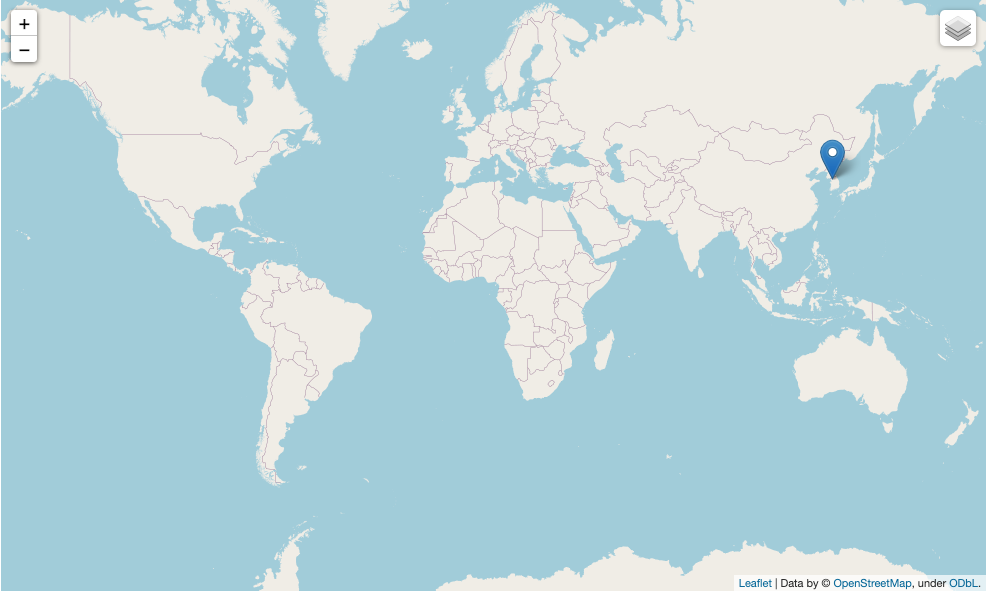<br></p>

이제 위경도 범위를 경도와 위도 번갈아가며 반으로 잘라내면서, 원하는 좌표가 왼쪽, 오른쪽중 어디에있는지 살펴본다.

그리고 아래와 같이 반으로 자른 중간 값에서 작은 쪽에 있으면 이진수로 0을, 큰 쪽에 있으면 1으로 할당한다.

<p align="center">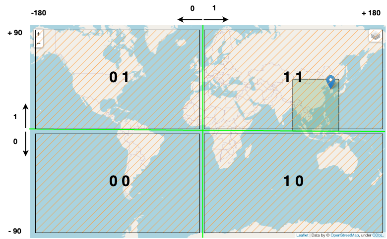 </p>

순서는 경도 -> 위도 -> 경도 -> 위도 -> ... 순으로 진행된다.

이렇게 각각 Geo-hash의 레벨만큼 계속해서 진행되면 아래와 같이 레벨별로 경도와 위도를 계속해서 분할한다.

| Level | 경도 | 위도 | 이진수 자리수 |
|---|---|---|---|
| 1 | 3회 | 2회 | 5자리 |
| 2 | 5회 | 5회 | 10자리 |
| 3 | 8회 | 7회 | 15자리 |
| 4 | 10회 | 10회 | 20자리 |
| 5 | 13회 | 12회 | 25자리 |
| 6 | 15회 | 15회 | 30자리 |
| 7 | 18회 | 17회 | 35자리 |
| 8 | 20회 | 20회 | 40자리 |

<br>

**옥수역을 기준으로 Geo-hash 1레벨을 찾는다고하면 아래와 같이 탐색을 진행한다.**

<p align="center">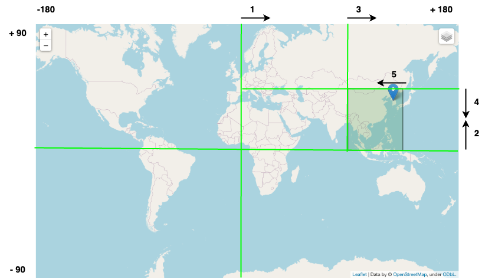 </p>

그림에서 볼 수 있듯이, **경도 -> 위도 -> 경도 -> 위도 -> 경도 순으로 지역을 5번 분할함으로써 `11100` 이라는 값을 얻게된다.**

<br>

2️⃣ **변경된 이진수를 특정 규칙에 따라 32진수로 변경한다.**

위경도 정보를 특정 규칙에 따라 이진수로 변경했다면, 이제 해당 문자와 매핑되는 문자열로 변환해주면 된다. (geo-hash base32 인코딩)

다시 예시로 보면, 가장 높은 8레벨의 옥수역을 이진수로 변경하면 `11100 11110 01100 10011 01100 00011 01111 00111`가 된다.

<p align="center">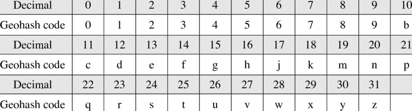</p>

**이를 위의 표 기준으로 변환한다면 `wydmd3g7`이 되며, `wydmd3g7`가 바로 옥수역 8 레벨의 Geo-hash이다.**

> **레벨 n 이면 Geo-hash는 n자리 해시 값이 된다.**

<br>

💁‍♂️ **시간 복잡도**

알고리즘만본다면 Index Tree, Binary Tree Search와 유사하다.

1. 위도 (-90 ~ 90), 경도 (-180 ~ 180)범위 내에서 Binary Search를 수행한다.
2. 왼쪽에 속하면 0, 오른쪽에 속하면 1로 표현한다. (bit)
3. 다음 구간으로 이동하여 1, 2를 반복한다.
4. 이렇게해서 얻은 각 bit을 하나씩 꺼내서 결합한다.
   * Level이 높아질 수록 더 자세한 위치를 표현해야하기에, 더 많은 bit를 필요하게된다.
5. 마지막으로 모든 bits를 5개씩 나눠서 Base 32 인코딩으로 변환하여 Geo-hash값을 얻는다.

**시간복잡도로보면 최악의 경우 `O(logn)`로 볼 수 있다.** 

이는 전 지구를 대상으로한 탐색이기에, 비교적 효율적인 탐색 시간 복잡도라고 볼 수 있다.

> 최선의 경우 `O(1)`

<br>

## 1-4 Geo-hash 특징
Geo-hash가 추구하는 부분과 알고리즘을 알았다면, 이제 Geo-hash에서 가장 중요한 특징들에 대해서 알아본다.

> 이는 그리드 시스템의 특징이기도하다.

<br>

💁‍♂️ **Geo-hash의 단위는 점 (Point)가 아닌 공간 (Polygon)이다.**

**아래와 같이 옥수역 부근의 위경도를 Geo-hash로 변환하면 모두 동일한 해시 값이 나온다.**

<p align="center">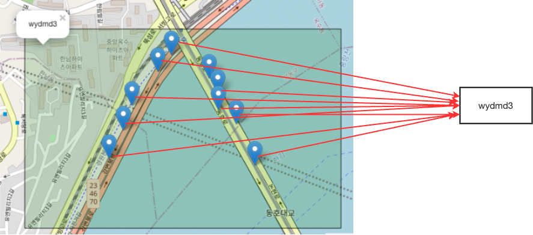 </p>

위 그림과 같이 **옥수역 부근의 모든 위경도가 모두 해시 함수를 거치면 동일하게 `wydmd3`가 나오는 것을 볼 수 있다.**

즉, Geo-hash의 단위는 점이 아닌 공간이다.

그러기에 **정확한 위치를 특정할 순 없지만, 공간을 찾거나 처리하는데 있어서 훨씬 비용이 적고 효율적이다.**

> 물론 Level을 높이면 비교적 정확한 위치를 특정할 수 있다. 단, 처리량이 소폭 증가한다.

<br>

💁‍♂️ **Geo-hash의 목적은 계층적 구조를 통해 연산량을 줄이는 것이라고 볼 수 있다.**

**위경도는 실제 정확한 위치를 측정할 수 있다는 장점이 있다. 하지만 무한하게 표현되기때문에 특정 공간에 대한 처리를 하는데는 부적합하다.**

반면에, **Geo-hash는 실제 완전 정확한 위치를 측정할 수는 없지만, 유한하게 표현되며 인덱스 비슷하게 동작하기에 공간에 대한 처리를 하는데 적합하다고 볼 수 있다.**

이를 풀어말하면, **Geo-hash는 결국 모자이크 처리라고 볼 수 있다.**

<p align="center"> </p>

이미지로 비유해보면 가장 선명한 이미지가 위경도(GPS)이고, Geo-hash 레벨이 낮아질수록 이미지를 알아보기 힘들어진다.

**이를 공간 좌표로 대입해본다면 위경도는 정확한 위치를 특정할 수 있지만, 무한하게 표현되기에 특정 공간을 찾는데 비용이 크다.**

반면에, **Geo-hash는 정확한 위치를 특정하기 어렵지만, 유한하게 표현되기에 굉장히 적은 연산량으로 특정 공간을 찾을 수 있다.**

<br>

> 쉽게 생각해봐도, **픽셀이 촘촘히 많아 무한한 범위안에서 특정 조건에 맞는 점이나 공간을 찾는 것은 모든 범위를 탐색해야하는 문제가 있다.**
> 
> 소수점까지있는 위경도의 경우 무한한 범위를 탐색해야한다...
> 
> 반면에, **모자이크와 같이 픽셀을 낮출수록, 픽셀량이 적어지기에 탐색해야하는 범위가 점점 줄어들게된다.**
> 
> **이를 통해 연산량을 크게 줄일 수 있다. 이 부분이 바로 Geo-hash의 핵심이다.**

<br>

💁‍♂️ **Geo-hash는 공간을 탐색하는데 용이한 반면 오차 범위가 존재한다.**

Geo-hash의 레벨별 셀의 실제 크기를 아래와 같다.

<p align="center">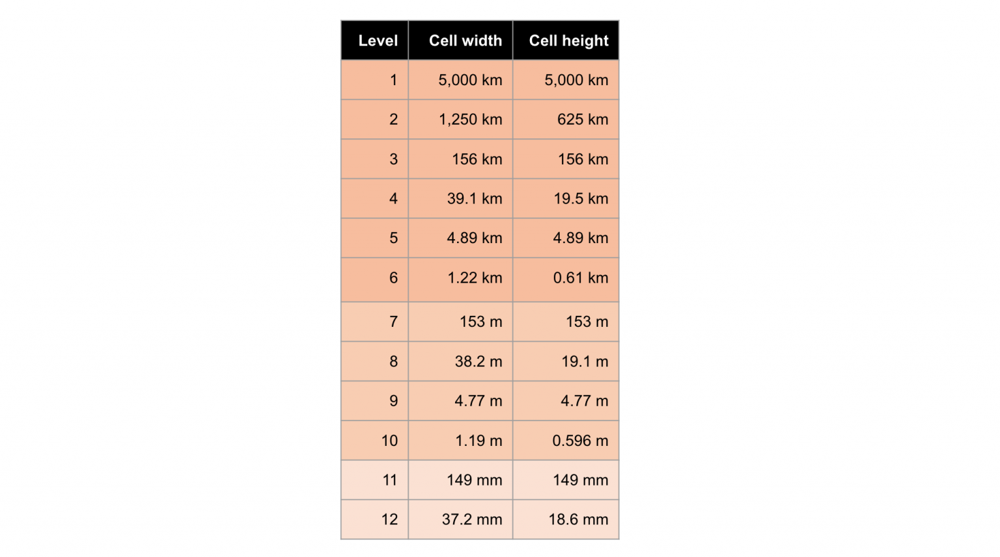<br>출처: https://www.geospatialworld.net/blogs/polygeohasher-an-optimized-way-to-create-geohashes/ </p>

**Geo-hash는 당연히 특정 점을 나타내지 않고, 사각형의 구간을 표기하기때문에 오차가 존재한다.**

**hash의 길이에 따른 오차 범위는 아래와 같다.**

<p align="center">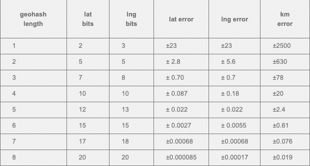<br>출처: https://chrysohous.wordpress.com/2012/09/07/hash2hash-geohash-algorithm/ </p>

**레벨이 높아질수록 (해시의 길이가 길어질수록) 사각형이 더 작이지고 표기하고자 하는 점에 대한 오차는 점점 줄어든다.**

<br>

💁‍♂️ **쉽게 이웃 셀을 쉽게 찾을 수 있다.**

기존의 벡터에 위경도를 투영하는 방식은 특정 Polygon의 이웃 Polygon을 찾기 어려웠다.

Geo-hash는 알고리즘 특성상 prefix 비교를 통해 이웃인지 판별할 수 있다.

**예를 들어 Geo-hash를 통해 `tdc`를 얻은 경우 아래와 같이 이웃(`td`으로 시작하는 셀들 -> `tdb`, `tdf`, `tdg`...)들을 쉽게 찾을 수 있다.**

<p align="center">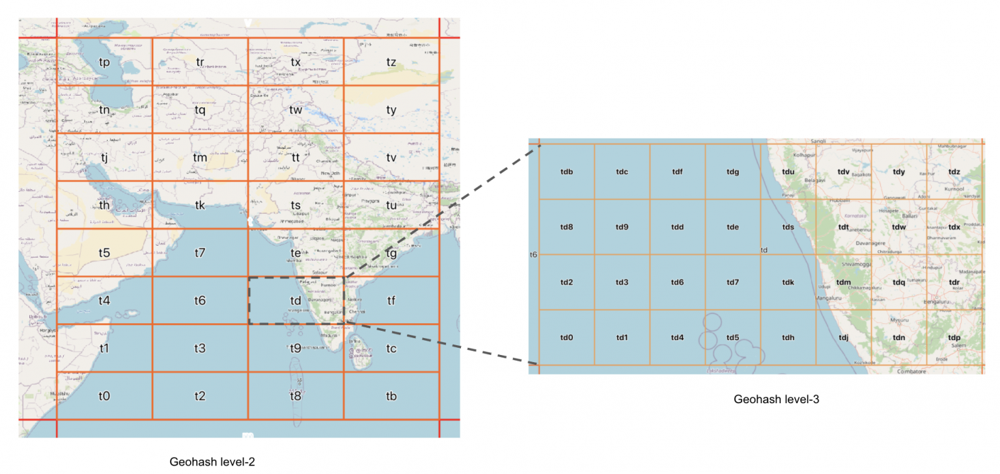<br>출처: https://www.geospatialworld.net/blogs/polygeohasher-an-optimized-way-to-create-geohashes/ </p>

<br>

## 1-5 Geo-hash 한계
Geo-hash는 prefix를 통해 인접한 셀들을 찾을 수 있다.

하지만 매우 인접한 두 점임에도 불구하고, -180도와 +180도가 만나는 지점에서는 두 셀의 prefix가 완전 다르게된다.

즉, 두 셀은 서로 인접한 셀이라고 인식하지 않게된다.

> 다만.. 이는 충분히 예외처리가 가능할 듯 하다.

<br>

# 2 파이썬을 통한 Geo-hash 학습테스트
Geo-hash에 대한 개념과 알고리즘 그리고 특징들에 대해서 이해했다면, 이제 파이썬을 이용하여 이를 직접 구현해본다.

학습 테스트는 Python 3을 이용할 것이며, 필요한 라이브러리는 다음과 같다.

* [python-geohash](https://github.com/hkwi/python-geohash)
* [folium](https://python-visualization.github.io/folium/)
* [polygonhasher](https://github.com/rohitsinghsalyan/polygeohasher)
* [Shapely](https://shapely.readthedocs.io/en/stable/manual.html)

<br>

**아래 학습 테스트에대한 전체 코드는 [여기 Jupyter Notebook](https://nbviewer.org/github/binghe819/TIL/blob/master/ETC/%EA%B3%B5%EA%B0%84%EC%A0%95%EB%B3%B4/Point%20in%20polygon%20-%20GeoHash/Geo-Hash.ipynb)을 참고하면 된다.**

<br>

## 2-1 위경도와 Geo-hash간의 변환
파이썬의 Geo-hash 라이브러리인 [python-geohash](https://github.com/hkwi/python-geohash)은 위경도와 Geo-hash간의 변환해주는 기능을 제공한다.

* 위경도 -> Geo-hash
  * `geohash.encode`
* Geo-hash -> 위경도
  * `geohash.decode`
  * `geohash.decode_exactly`

<br>

**위경도 <-> Geo-hash 변환**

```python
# 위경도 -> Geohash 변환
lat, lng = (37.497868971527424, 127.0276489936216) # 강남역 위경도
gangnam = geohash.encode(
    latitude=lat,  # 위도
    longitude=lng, # 경도
    precision=5    # Level
) # geo-hash로 변환

# Geohash -> 위경도 변환
decoded_location = geohash.decode(hashcode=gangnam) # 위경도로 변환

print('Lat, Lng        :', lat, lng)          # Lat, Lng        : 37.497868971527424 127.0276489936216
print('강남 geohash     :', gangnam)           # 강남 geohash     : wydm6
print('Decoded Location:', decoded_location)  # Decoded Location: (37.50732421875, 127.02392578125)
```
라이브러리를 이용하면 위와같이 쉽게 변환할 수 있다.

<br>

## 2-2 Neighbors
앞서 말했듯이, Geo-hash는 쉽게 이웃 셀을 쉽게 찾을 수 있다 (그리드 방식 모두 동일)

* Geo-hash의 주변 검색 (인근 셀 검색)
  * `geohash.neighbors`

<br>

**강남역의 Geo-hash인 wydm6의 주변 셀 검색**

```python
# 강남역 위경도 -> Geo-hash 변환
lat, lng = (37.497868971527424, 127.0276489936216) # 강남역 위경도
gangnam = geohash.encode(lat, lng, 5) # geo-hash로 변환

# 인근 Geo-hash 셀 검색
gangnam_neighbors = geohash.neighbors(hashcode=gangnam)
print(gangnam_neighbors) # ['wydm3', 'wydm7', 'wydm4', 'wydm1', 'wydm5', 'wydmd', 'wydm9', 'wydme']
```

결과를 보면 알수 있듯이, **Geo-hash는 알고리즘 특성상 prefix 비교를 통해 이웃인지 판별할 수 있다.**

**즉, `wydm6`의 이웃을 한 단계 위 레벨인 `wydm`을 통해 이웃을 쉽게 찾을 수 있다.**

<br>

## 2-3 bounding box
Geo-hash의 셀을 시각화하기위해선 Geo-hash 셀을 감싸는 꼭지점의 위경도를 알아야한다.

파이썬의 Geo-hash 라이브러리는 쉽게 꼭지점의 위경도를 구해주는 기능을 제공한다.

* Geo-hash를 감싸는 꼭지점의 위경도 구하기
  * `geohash.bbox`

<br>

```python
# 강남역 위경도 -> Geo-hash 변환
lat, lng = (37.497868971527424, 127.0276489936216) # 강남역 위경도
gangnam = geohash.encode(lat, lng, 5) # geo-hash로 변환

# bbox
print(geohash.bbox(gangnam)) # {'s': 37.4853515625, 'w': 127.001953125, 'n': 37.529296875, 'e': 127.0458984375}
```

동서남북을 가리키는 e, w, s, w 값들은 아래와같이 시각화를 할 때 사용된다.

각각의 꼭지점을 아래처럼 나타낼 수 있다.

<p align="center">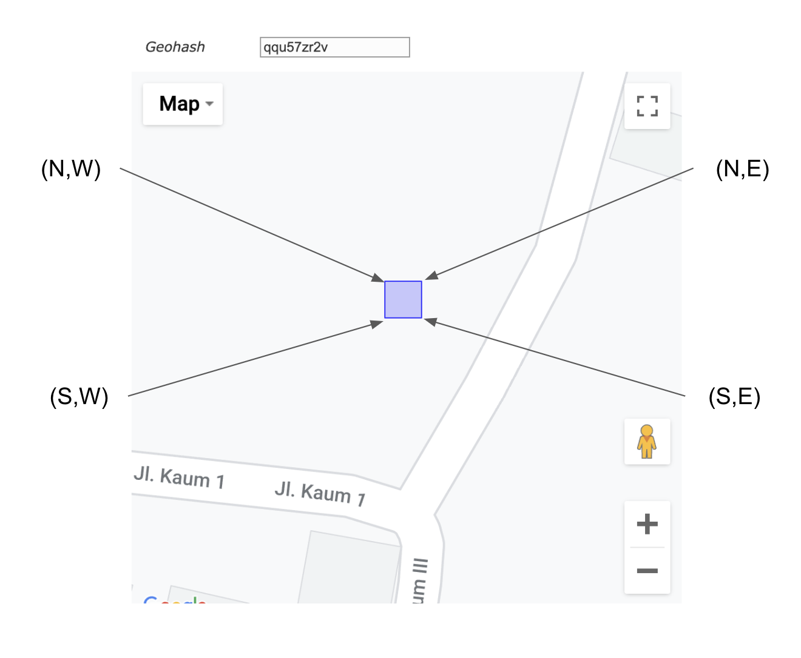<br>출처: https://medium.com/bukalapak-data/geolocation-search-optimization-5b2ff11f013b </p>

* Upper_left_point = (N, W)
* Upper_right_point = (N, E)
* Lower_right_point = (S, E)
* Lower_left_point = (S, W)

<br>

# 3 파이썬 Folium을 이용한 시각화
파이썬을 통해 Geo-hash 사용하는 방법에 대해서 알았으니 이제 시각화를 알아본다.

시각화는 파이썬의 지도 라이브러리인 [folium](https://python-visualization.github.io/folium/)을 이용한다.

> folium과 관련된 사용방법은 [여기](https://github.com/binghe819/TIL/blob/master/Python/folium/README.md)를 참고.

<br>

## 3-1 bbox를 이용한 Geo-hash 셀 그리기
위에서 말했듯이, `geohash.bbox`를 통해 Geo-hash 셀의 꼭지점 위경도를 알 수 있다.

그리고 꼭지점의 위경도를 기준으로 `folium.Rectangle`로 그려내면 아래와 같이 시각화된 것을 볼 수 있다.

<br>

**bbox를 이용하여 Geo-hash 그리기**

```python
# 강남역 Geo-hash
lat, lng = (37.497868971527424, 127.0276489936216)
gangnam = geohash.encode(lat, lng, 5) # 5 Level의 Geo-hash

# 기반 지도 시각화
m = folium.Map(
    location=[lat,lng],
    zoom_start=13,
    title="Geo-Hash"
)

# bbox를 이용한 꼭지점 위경도 얻기
bbox = geohash.bbox(gangnam)

W = bbox["w"]
E = bbox["e"]
N = bbox["n"]
S = bbox["s"]

# Geo-hash 셀 (직사각형)의 꼭지점
upper_left = (N, W)
upper_right = (N, E)
lower_right = (S, E)
lower_left = (S, W)
edges = [upper_left, upper_right, lower_right, lower_left]

# folium에 그리기
folium.Rectangle(
    bounds=edges,
    color="black",
    fill_color="green",
    weight=1,
    popup=gangnam
).add_to(m)

m
```

<p align="center">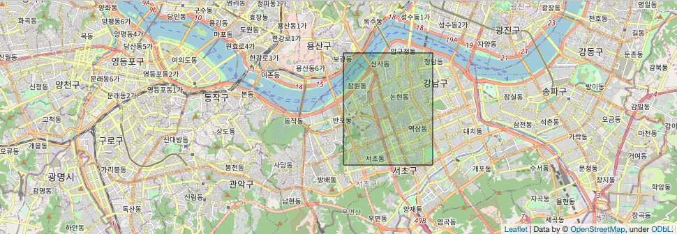 </p>

`bbox`를 통해 셀의 꼭지점 위경도를 통해 시각화하는 것을 볼 수 있다.

<br>

## 3-2 GeoJson Polygon을 여러 Geo-hash로 표현
이제 GeoJson Polygon을 여러 Geo-hash로 표현해본다.

예시를 위해 아래 옥수동의 GeoJson을 사용한다.

```json
# 옥수동 GeoJson

oksu_geojson = {"type":"Feature","properties":{},"geometry":{"type":"MultiPolygon","coordinates":[[[[127.01445372035877,37.54809716556332],[127.01519057405264,37.547067018782066],[127.01682578510314,37.545734088046544],[127.01971158208781,37.54514917644688],[127.02129552047927,37.543356952041016],[127.02268789647377,37.5416894537722],[127.02287476642073,37.54145247733586],[127.02502596652482,37.53872004668483],[127.0256997843901,37.53786411011561],[127.02156491849887,37.535530965877896],[127.02092441234515,37.53511935680614],[127.01719422667055,37.53742400398111],[127.01576373980122,37.5383059781119],[127.01478926311766,37.538901377441235],[127.012889891509,37.539313813299806],[127.01213660754814,37.539185649095785],[127.0121256959346,37.53915070095481],[127.01176468898241,37.53904214089355],[127.01153303960568,37.53898146832435],[127.00992598136419,37.5393714047437],[127.00947114947282,37.53957682723548],[127.00932275981805,37.53967748124033],[127.00833696037861,37.54185929062551],[127.00842516184942,37.54286466482798],[127.00857717612135,37.543889052496155],[127.00860603570271,37.5439797142403],[127.01068194070888,37.548078215345136],[127.01078235714807,37.548086518251225],[127.01081324310977,37.54809814744944],[127.01086705353879,37.54811841641107],[127.01147996885422,37.54841614618272],[127.01165764754505,37.548511522986345],[127.01320761955266,37.54994422861261],[127.01437412125692,37.54913421189207],[127.01445372035877,37.54809716556332]]]]}}
```

<br>

**GeoJson 데이터를 이용한 Polygon 시각화**

```python
# 옥수동 GeoJson 지도에 표시
m = folium.Map(
    location=[37.540514,127.018698], # 옥수역 위경도
    zoom_start=14
)

oksu_geojson_folium = folium.GeoJson(oksu_geojson, name="oksu")

oksu_geojson_folium.add_to(m)

folium.LayerControl().add_to(m)

m
```

<p align="center">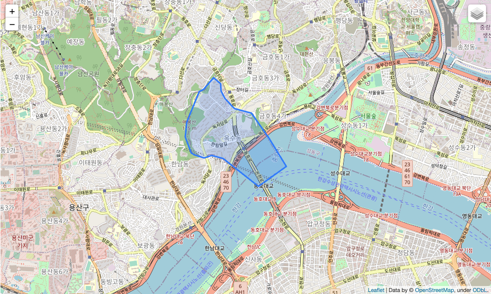 </p>

이제 위 GeoJson를 Geo-hash로 변환하여 시각화해본다.

<br>

**GeoJson Polygon을 여러 Geo-hash로 시각화**

```python
# GeoJson은 경도, 위도순으로 저장되기때문에 이를 변환하기위한 메서드.
def lat_lng_converter(coordinate):
    temp = coordinate[0]
    coordinate[0] = coordinate[1]
    coordinate[1] = temp
    
def geojson_lat_lng_converter(geojson):
    copy_geojson = copy.deepcopy(geojson)
    for pt in copy_geojson[0][0]:
        lat_lng_converter(pt)
    return copy_geojson

# polygon = [[lat, lng]]
def polygon_to_geohash(polygon, precision=5):
    unchecked = set()
    outside = set()
    inside = set()
    
    
    for pt in polygon:
        tst_gh = geohash.encode(pt[0], pt[1], precision)
        print(f'위경도: {pt[0]}, {pt[1]} -> geohash: {tst_gh}')
        unchecked.add(tst_gh)
    
    bbox = Polygon(polygon)
    while unchecked:
        this = unchecked.pop()
        
        if (bbox.contains(Point(geohash.decode(this)))):
            inside.add(this)
            
            for gh in geohash.neighbors(this):
                if ((gh not in inside) * (gh not in outside) & (gh not in unchecked)):
                    unchecked.add(gh)
        else:
            outside.add(this)
    return inside;

oksu_polygon = geojson_lat_lng_converter(oksu_geojson_folium.data['geometry']['coordinates'])[0][0]
result_geohash = polygon_to_geohash(oksu_polygon, 8) # Level 8로 변환
print(result_geohash)
```
`result_geohash`를 출력하면 아래와 같이 GeoJson의 Polygon 내용이 모두 Geo-hash로 변환된 것을 볼 수 있다.

```text
{'wydmd6ch','wydmd71h','wydmd6kd','wydmd6ju','wydmd1vx','wydmd3sm','wydmd3sq','wydmd3b9','wydmd98j','wydmd4j3','wydmd5r4','wydmd6sk','wydmd3s4','wydmd989','wydmd6tj','wydmd629','wydmd983','wydmd3zc','wydmd3zu','wydmd3cs','wydmd724','wydmd3vy','wydmd4jx','wydmd3r0','wydmd3m5','wydmd6s7','wydmd3c3','wydmd3s5','wydmd4jt','wydmd4pt','wydmd3q6','wydmd5r7','wydmd6cw','wydmd6b8','wydmd3mr','wydmd3ud','wydmd70s','wydmd3xb','wydmd4mv','wydmd62w','wydmd6pp','wydmd6h7','wydmd6bh','wydmd65p','wydmd4nj','wydmd62d','wydmd4vf','wydmd5ph','wydmd78h','wydmd3t0','wydmd6fs','wydmd64j','wydmd6d2','wydmd6nr','wydmd60m','wydmd4wn','wydmd731','wydmd6h8','wydmd60p','wydmd4yu','wydmd72t','wydmd6hq','wydmd61x','wydmd3t7','wydmd6kp','wydmd92r','wydmd3vj','wydmd6md','wydmd63v','wydmd4p0','wydmd70v','wydmd3xn','wydmd3g0','wydmd92p','wydmd6h2','wydmd3je','wydmd6d6','wydmd4wj','wydmd4wt','wydmd6cd','wydmd1z3','wydmd3du','wydmd3gn','wydmd4zg','wydmd4n6','wydmd6ce','wydmd4mh','wydmd71s','wydmd68w','wydmd6sx','wydmd6p3','wydmd6uk','wydmd697','wydmd3vu','wydmd645','wydmd603','wydmd6k0','wydmd3tx','wydmd70z','wydmd6kh','wydmd5n7','wydmd66x','wydmd994','wydmd72w','wydmd4y3','wydmd78f','wydmd3kx','wydmd3tf','wydmd3z7','wydmd3qu','wydmd4hz','wydmd4mr','wydmd6uj','wydmd5ng','wydmd4jg','wydmd6n8','wydmd4zu','wydmd5r8','wydmd6n9','wydmd4nk','wydmd6h1','wydmd72y','wydmd63y','wydmd4xy','wydmd3jm','wydmd4mz','wydmd6bb','wydmd6j8','wydmd67f','wydmd611','wydmd5jb','wydmd6f5','wydmd5p7','wydmd4yx','wydmd4r1','wydmd3fj','wydmd98g','wydmd641','wydmd5jc','wydmd3ej','wydmd6df','wydmd3t1','wydmd3rs','wydmd4q8','wydmd6t7','wydmd6fr','wydmd69d','wydmd6hj','wydmd3np','wydmd5xd','wydmd5qe','wydmd4ww','wydmd6nk','wydmd3x3','wydmd6t9','wydmd6kj','wydmd6mm','wydmd70e','wydmd68j','wydmd3mt','wydmd6v1','wydmd4y2','wydmd4sc','wydmd3tk','wydmd3nh','wydmd4m7','wydmd6tm','wydmd4su','wydmd6k9','wydmd63f','wydmd5pp','wydmd5rv','wydmd3br','wydmd4nm','wydmd62s','wydmd3w9','wydmd6t5','wydmd6w0','wydmd4q9','wydmd3zb','wydmd4jb','wydmd3yn','wydmd1zq','wydmd622','wydmd66q','wydmd727','wydmd3yb','wydmd3nr','wydmd6qk','wydmd6qs','wydmd4rd','wydmd670','wydmd6dh','wydmd5nt','wydmd4yz','wydmd6p9','wydmd78e','wydmd4je','wydmd6jx','wydmd37z','wydmd3fn','wydmd3eh','wydmd3ym','wydmd6u3','wydmd3gr','wydmd3k5','wydmd3xr','wydmd6ep','wydmd1vk','wydmd3zd','wydmd1yc','wydmd60z','wydmd6qn','wydmd4tj','wydmd3ey','wydmd3er','wydmd3m7','wydmd3w6','wydmd6e2','wydmd3zm','wydmd3t5','wydmd5rw','wydmd4y7','wydmd68e','wydmd3ys','wydmd4vx','wydmd3cb','wydmd663','wydmd4tq','wydmd6je','wydmd66h','wydmd628','wydmd5nm','wydmd3qk','wydmd4tg','wydmd3s8','wydmd78m','wydmd6h3','wydmd65f','wydmd6bx','wydmd6m0','wydmd3mh','wydmd3fu','wydmd3xp','wydmd3dv','wydmd6bq','wydmd3xk','wydmd3ye','wydmd64v','wydmd6fx','wydmd3sn','wydmd4ym','wydmd3gk','wydmd3mw','wydmd3qr','wydmd3t9','wydmd6m2','wydmd745','wydmd6du','wydmd3xe','wydmd3u3','wydmd3zh','wydmd70u','wydmd1vg','wydmd4sv','wydmd98c','wydmd5nn','wydmd6ts','wydmd3eq','wydmd6ex','wydmd64n','wydmd4jf','wydmd4mf','wydmd609','wydmd4qh','wydmd61m','wydmd6k4','wydmd3se','wydmd5rm','wydmd3fp','wydmd3w3','wydmd3zx','wydmd5jg','wydmd70r','wydmd63w','wydmd4jh','wydmd4wh','wydmd6q1','wydmd6fy','wydmd6c0','wydmd655','wydmd3qh','wydmd60u','wydmd63z','wydmd625','wydmd619','wydmd6pd','wydmd3km','wydmd61w','wydmd62e','wydmd4ny','wydmd4ty','wydmd6q3','wydmd787','wydmd66c','wydmd4nc','wydmd5qu','wydmd6cq','wydmd3mg','wydmd6nw','wydmd3mv','wydmd3zt','wydmd69u','wydmd991','wydmd61j','wydmd66f','wydmd4pj','wydmd3q1','wydmd6pk','wydmd3g6','wydmd3v0','wydmd5rp','wydmd3m9','wydmd3m8','wydmd3nn','wydmd4yf','wydmd3zj','wydmd71n','wydmd4p3','wydmd6ed','wydmd4wb','wydmd4x5','wydmd67w','wydmd64t','wydmd6u4','wydmd69s','wydmd604','wydmd4nu','wydmd3f5','wydmd3nz','wydmd5rn','wydmd6n5','wydmd6jq','wydmd3kr','wydmd6cr','wydmd68p','wydmd6ey','wydmd657','wydmd5q0','wydmd6hg','wydmd6dm','wydmd37q','wydmd1yj','wydmd4tw','wydmd1yx','wydmd4xb','wydmd3c1','wydmd6se','wydmd5pn','wydmd5p9','wydmd3x1','wydmd4rs','wydmd6fg','wydmd3fv','wydmd3gy','wydmd98x','wydmd4z1','wydmd3xj','wydmd652','wydmd4xm','wydmd6en','wydmd4jy','wydmd65g','wydmd3dw','wydmd4jj','wydmd713','wydmd6h9','wydmd9b0','wydmd65t','wydmd3ze','wydmd6ew','wydmd4th','wydmd3yr','wydmd4wc','wydmd66u','wydmd1yk','wydmd1yn','wydmd6es','wydmd71e','wydmd1y6','wydmd66s','wydmd6tb','wydmd5py','wydmd684','wydmd671','wydmd5r5','wydmd711','wydmd4t6','wydmd4yt','wydmd4v7','wydmd6j3','wydmd4nf','wydmd61n','wydmd4ju','wydmd3yu','wydmd4vu','wydmd1zv','wydmd3eu','wydmd601','wydmd4kg','wydmd3e0','wydmd6n2','wydmd4x0','wydmd6db','wydmd691','wydmd6ge','wydmd6fq','wydmd6mq','wydmd4kv','wydmd1y5','wydmd98m','wydmd3sp','wydmd3mc','wydmd60y','wydmd6qd','wydmd6bg','wydmd3f8','wydmd701','wydmd4r5','wydmd3r3','wydmd71c','wydmd633','wydmd3e8','wydmd3vr','wydmd37x','wydmd5qd','wydmd6k3','wydmd60h','wydmd3y6','wydmd3tb','wydmd6f2','wydmd70h','wydmd68h','wydmd3wv','wydmd693','wydmd72f','wydmd4vw','wydmd78g','wydmd64z','wydmd65s','wydmd6jw','wydmd674','wydmd70q','wydmd4tk','wydmd3zk','wydmd4zz','wydmd3yz','wydmd3ry','wydmd5xb','wydmd3bj','wydmd6q7','wydmd65z','wydmd4w4','wydmd66m','wydmd3wq','wydmd3gt','wydmd789','wydmd6f0','wydmd4y6','wydmd3qz','wydmd3f9','wydmd67z','wydmd4vy','wydmd6e3','wydmd62k','wydmd64x','wydmd68c','wydmd4v0','wydmd3cp','wydmd5rh','wydmd4zj','wydmd64y','wydmd4t4','wydmd5p2','wydmd3xu','wydmd1y9','wydmd3jz','wydmd69q','wydmd3rk','wydmd3gs','wydmd3wk','wydmd5rf','wydmd703','wydmd68v','wydmd72u','wydmd635','wydmd3q5','wydmd677','wydmd3rq','wydmd707','wydmd4wy','wydmd65y','wydmd71w','wydmd6uc','wydmd3sb','wydmd4nt','wydmd68u','wydmd3e2','wydmd4nh','wydmd5pw','wydmd4m5','wydmd60n','wydmd6c5','wydmd4wx','wydmd3v5','wydmd66w','wydmd3bh','wydmd4mj','wydmd4nn','wydmd9b6','wydmd3q9','wydmd3z2','wydmd66e','wydmd3kj','wydmd4z9','wydmd3yx','wydmd4pc','wydmd3x4','wydmd6tp','wydmd6kv','wydmd6kn','wydmd6pn','wydmd6cv','wydmd60q','wydmd3xw','wydmd1vw','wydmd6u6','wydmd1zp','wydmd5np','wydmd5n0','wydmd4xf','wydmd3uj','wydmd3v1','wydmd6us','wydmd1vu','wydmd3cc','wydmd6su','wydmd3rn','wydmd638','wydmd981','wydmd37r','wydmd6uf','wydmd4pd','wydmd3te','wydmd3z1','wydmd72v','wydmd6u7','wydmd6bs','wydmd6qj','wydmd6uh','wydmd4w1','wydmd3bp','wydmd69n','wydmd4ve','wydmd5p0','wydmd3yp','wydmd68r','wydmd4px','wydmd6g6','wydmd3rv','wydmd4n0','wydmd4r8','wydmd5qk','wydmd6k1','wydmd6t6','wydmd719','wydmd3x7','wydmd6ky','wydmd3gz','wydmd3sy','wydmd65n','wydmd6nj','wydmd69j','wydmd68n','wydmd78q','wydmd6fe','wydmd6t2','wydmd642','wydmd3nx','wydmd4ng','wydmd63b','wydmd4x1','wydmd4zh','wydmd3q3','wydmd3cj','wydmd6p7','wydmd658','wydmd37u','wydmd4xr','wydmd5r1','wydmd60v','wydmd5n5','wydmd3zw','wydmd4my','wydmd718','wydmd3s3','wydmd3bu','wydmd6b1','wydmd5nu','wydmd6ck','wydmd6gv','wydmd3uh','wydmd67q','wydmd726','wydmd3e9','wydmd37v','wydmd4wv','wydmd3kf','wydmd6kf','wydmd6cm','wydmd3xq','wydmd4v9','wydmd3eg','wydmd3mn','wydmd39x','wydmd3tn','wydmd607','wydmd4vs','wydmd6f3','wydmd3jt','wydmd6mj','wydmd68f','wydmd688','wydmd4p6','wydmd3z8','wydmd39z','wydmd6ng','wydmd4v6','wydmd6be','wydmd6jv','wydmd64p','wydmd4zt','wydmd6hx','wydmd98h','wydmd6hu','wydmd1ym','wydmd3bv','wydmd648','wydmd6sf','wydmd64d','wydmd6u1','wydmd5r3','wydmd5rk','wydmd1yw','wydmd70d','wydmd4mq','wydmd6gc','wydmd3tj','wydmd4q4','wydmd4mn','wydmd6ht','wydmd67m','wydmd3md','wydmd3kg','wydmd4nb','wydmd3y7','wydmd6ek','wydmd6c2','wydmd4rp','wydmd4we','wydmd6mt','wydmd6te','wydmd67s','wydmd3rr','wydmd6jg','wydmd6b4','wydmd5ps','wydmd4ky','wydmd6jc','wydmd5ns','wydmd3kn','wydmd3xg','wydmd70j','wydmd4wz','wydmd3es','wydmd3um','wydmd6fz','wydmd3cw','wydmd6ub','wydmd6jz','wydmd5n8','wydmd98r','wydmd6d1','wydmd3uc','wydmd3mq','wydmd6u5','wydmd62f','wydmd4x6','wydmd3dd','wydmd6b9','wydmd3v8','wydmd3jy','wydmd6tc','wydmd743','wydmd995','wydmd6d0','wydmd39y','wydmd5rb','wydmd6kk','wydmd6gf','wydmd6e4','wydmd3sk','wydmd4rb','wydmd3r5','wydmd4rk','wydmd4pq','wydmd6e0','wydmd651','wydmd4qj','wydmd4ph','wydmd4n1','wydmd3by','wydmd3xv','wydmd3dx','wydmd5p1','wydmd6cb','wydmd98n','wydmd68z','wydmd6hr','wydmd6cg','wydmd3e3','wydmd6kx','wydmd3m0','wydmd6p2','wydmd4w6','wydmd3jv','wydmd4y0','wydmd4kz','wydmd3dg','wydmd3kz','wydmd3vx','wydmd4qb','wydmd4j1','wydmd1zw','wydmd92x','wydmd3bn','wydmd6p4','wydmd3fr','wydmd3z5','wydmd3wp','wydmd4qg','wydmd6gs','wydmd66n','wydmd67h','wydmd69r','wydmd6kq','wydmd5qg','wydmd666','wydmd98k','wydmd3k4','wydmd70c','wydmd3de','wydmd3re','wydmd3gb','wydmd3vm','wydmd3e5','wydmd6bj','wydmd746','wydmd4xw','wydmd3sg','wydmd4sg','wydmd6hn','wydmd4sb','wydmd6n0','wydmd6mx','wydmd6ks','wydmd4tp','wydmd62j','wydmd4tf','wydmd61v','wydmd6mw','wydmd4ms','wydmd1yd','wydmd3gm','wydmd3y5','wydmd5xf','wydmd3ku','wydmd4rr','wydmd4n5','wydmd6k6','wydmd78p','wydmd5p3','wydmd690','wydmd4w7','wydmd6d5','wydmd723','wydmd64r','wydmd3tc','wydmd4q1','wydmd4v3','wydmd3z4','wydmd4p8','wydmd3ef','wydmd6c7','wydmd6bv','wydmd3tm','wydmd6gn','wydmd1vm','wydmd3s1','wydmd78s','wydmd3vg','wydmd63g','wydmd6gd','wydmd3w7','wydmd717','wydmd1y4','wydmd98p','wydmd4tb','wydmd4wm','wydmd1zg','wydmd624','wydmd748','wydmd3w0','wydmd6g3','wydmd4yv','wydmd702','wydmd62r','wydmd730','wydmd4rq','wydmd720','wydmd66d','wydmd780','wydmd4jc','wydmd3bt','wydmd682','wydmd3ju','wydmd3c9','wydmd3dq','wydmd600','wydmd6tn','wydmd72x','wydmd3cm','wydmd6hk','wydmd3jf','wydmd3v9','wydmd72d','wydmd62c','wydmd610','wydmd4v8','wydmd3ep','wydmd4t7','wydmd6sp','wydmd3g4','wydmd4zf','wydmd696','wydmd3tg','wydmd6gq','wydmd3ed','wydmd3fx','wydmd4y5','wydmd3tp','wydmd4x9','wydmd3wf','wydmd37t','wydmd6g0','wydmd6fn','wydmd6mv','wydmd71t','wydmd6hs','wydmd6eu','wydmd6dx','wydmd69w','wydmd5re','wydmd92q','wydmd4qs','wydmd5pz','wydmd5nx','wydmd3jq','wydmd4w8','wydmd4rn','wydmd3x0','wydmd3zq','wydmd3kt','wydmd4p1','wydmd61p','wydmd4mw','wydmd3f3','wydmd4pk','wydmd3ew','wydmd4wu','wydmd72s','wydmd3rp','wydmd4v2','wydmd5p4','wydmd4xq','wydmd66p','wydmd6j4','wydmd4w2','wydmd6g4','wydmd4pb','wydmd1zx','wydmd5pv','wydmd62x','wydmd4w5','wydmd3c7','wydmd6f4','wydmd5ny','wydmd78j','wydmd5n4','wydmd782','wydmd6f8','wydmd6km','wydmd67j','wydmd6hv','wydmd689','wydmd3s9','wydmd5pm','wydmd4r3','wydmd3vf','wydmd669','wydmd3gu','wydmd3kh','wydmd3gf','wydmd3td','wydmd3vq','wydmd4m6','wydmd1ye','wydmd6cu','wydmd6sy','wydmd3hz','wydmd63h','wydmd5qt','wydmd5q9','wydmd5n6','wydmd6ke','wydmd6h0','wydmd61y','wydmd612','wydmd3jg','wydmd6m6','wydmd6q0','wydmd6qb','wydmd67g','wydmd4vb','wydmd3mk','wydmd4kc','wydmd4rv','wydmd70k','wydmd3me','wydmd6ku','wydmd6jk','wydmd3y0','wydmd3ck','wydmd4v1','wydmd3m3','wydmd4hy','wydmd63q','wydmd4zw','wydmd4re','wydmd3rm','wydmd5pb','wydmd6np','wydmd6q4','wydmd6cz','wydmd654','wydmd4z5','wydmd626','wydmd3dp','wydmd98u','wydmd63n','wydmd3e1','wydmd71f','wydmd3wr','wydmd4tr','wydmd5pq','wydmd78n','wydmd699','wydmd6ej','wydmd3xz','wydmd712','wydmd3yt','wydmd69g','wydmd68g','wydmd3fb','wydmd4t9','wydmd3kc','wydmd3up','wydmd6cp','wydmd65v','wydmd6q9','wydmd4yw','wydmd5ry','wydmd6qp','wydmd6c4','wydmd6t1','wydmd67p','wydmd68m','wydmd6j6','wydmd3sx','wydmd4jp','wydmd4m8','wydmd4mt','wydmd1zj','wydmd70m','wydmd668','wydmd63u','wydmd4jn','wydmd3b4','wydmd6m8','wydmd70x','wydmd679','wydmd4qx','wydmd3xy','wydmd729','wydmd632','wydmd70p','wydmd6nf','wydmd6m1','wydmd6t8','wydmd5p6','wydmd4y9','wydmd6pj','wydmd4rc','wydmd3rx','wydmd3rt','wydmd3v6','wydmd3cv','wydmd3bx','wydmd980','wydmd3dj','wydmd4xx','wydmd69h','wydmd3b5','wydmd4jk','wydmd3tu','wydmd63c','wydmd92n','wydmd63m','wydmd6qq','wydmd6p6','wydmd66r','wydmd4vz','wydmd3ks','wydmd687','wydmd3zp','wydmd3u7','wydmd4xn','wydmd1zs','wydmd1z6','wydmd6td','wydmd683','wydmd5nb','wydmd6gj','wydmd616','wydmd6mc','wydmd60b','wydmd68s','wydmd1yy','wydmd3ws','wydmd4nv','wydmd3ek','wydmd5pt','wydmd69f','wydmd5pg','wydmd3su','wydmd6mg','wydmd4pz','wydmd3yk','wydmd4qt','wydmd3z0','wydmd37y','wydmd4pm','wydmd6by','wydmd985','wydmd3wm','wydmd3bf','wydmd6ez','wydmd9b5','wydmd6mb','wydmd3vz','wydmd6jy','wydmd37p','wydmd68d','wydmd3cx','wydmd69p','wydmd686','wydmd4xs','wydmd6ug','wydmd6ud','wydmd5px','wydmd3w5','wydmd3s7','wydmd5xg','wydmd5r9','wydmd3my','wydmd5x2','wydmd704','wydmd72r','wydmd6sz','wydmd6n3','wydmd3uu','wydmd63d','wydmd5rs','wydmd6v4','wydmd6k2','wydmd732','wydmd72m','wydmd3kp','wydmd785','wydmd4m3','wydmd3k7','wydmd4qq','wydmd705','wydmd9b8','wydmd6jr','wydmd3jj','wydmd65x','wydmd1zm','wydmd3qd','wydmd4x2','wydmd3qx','wydmd6st','wydmd6ue','wydmd4xp','wydmd3t4','wydmd5qf','wydmd64m','wydmd6b3','wydmd4pp','wydmd3ds','wydmd1ys','wydmd3ge','wydmd6dp','wydmd61d','wydmd62h','wydmd71g','wydmd6b6','wydmd3mx','wydmd676','wydmd3jk','wydmd4qu','wydmd3w8','wydmd72n','wydmd5q2','wydmd3gd','wydmd6tt','wydmd4mb','wydmd3wy','wydmd6m4','wydmd6dy','wydmd62g','wydmd1z5','wydmd6d4','wydmd6tg','wydmd716','wydmd71d','wydmd740','wydmd3et','wydmd6er','wydmd1zf','wydmd3y8','wydmd4wg','wydmd65h','wydmd70n','wydmd4zs','wydmd69t','wydmd64g','wydmd6th','wydmd3bk','wydmd744','wydmd3g2','wydmd4m0','wydmd1yu','wydmd4mx','wydmd631','wydmd5nw','wydmd4md','wydmd4w9','wydmd3kv','wydmd3gv','wydmd627','wydmd6cs','wydmd3c6','wydmd3x5','wydmd4y1','wydmd4t0','wydmd3f7','wydmd4qy','wydmd3kd','wydmd1vq','wydmd6ds','wydmd3mb','wydmd3ev','wydmd72j','wydmd60d','wydmd5nd','wydmd3cq','wydmd6p8','wydmd9b4','wydmd3c0','wydmd3r7','wydmd65r','wydmd4js','wydmd1z4','wydmd3th','wydmd6hd','wydmd3bd','wydmd694','wydmd1vt','wydmd6nu','wydmd3cu','wydmd650','wydmd78c','wydmd5rj','wydmd3rj','wydmd4t8','wydmd3nj','wydmd5xv','wydmd1vz','wydmd3bc','wydmd65b','wydmd3xm','wydmd987','wydmd605','wydmd6dw','wydmd4zn','wydmd4mp','wydmd4zd','wydmd4qe','wydmd4rm','wydmd3us','wydmd4w0','wydmd5j9','wydmd5qs','wydmd4vd','wydmd4ns','wydmd3fe','wydmd3zy','wydmd4tx','wydmd3qw','wydmd4pe','wydmd3fz','wydmd4y8','wydmd1vv','wydmd4xu','wydmd64k','wydmd6sc','wydmd3b7','wydmd60x','wydmd4jv','wydmd3u5','wydmd5xu','wydmd72p','wydmd3ut','wydmd3qp','wydmd3bs','wydmd3gc','wydmd5pf','wydmd3gj','wydmd4kb','wydmd3d7','wydmd4jq','wydmd6nm','wydmd3sh','wydmd6dv','wydmd3nq','wydmd640','wydmd6jp','wydmd4j6','wydmd6dd','wydmd4jw','wydmd3m4','wydmd3qm','wydmd3sc','wydmd60r','wydmd6sn','wydmd4me','wydmd6bu','wydmd6bm','wydmd3x2','wydmd67b','wydmd4yy','wydmd60w','wydmd6nb','wydmd4vg','wydmd4jz','wydmd6jt','wydmd3dy','wydmd6me','wydmd61g','wydmd6cx','wydmd37w','wydmd66v','wydmd6nq','wydmd6n6','wydmd62n','wydmd66b','wydmd4pf','wydmd69k','wydmd1z1','wydmd3cg','wydmd3ux','wydmd3wu','wydmd3qb','wydmd6ft','wydmd786','wydmd4rg','wydmd4rz','wydmd61u','wydmd62m','wydmd67t','wydmd4p2','wydmd6fk','wydmd3vd','wydmd710','wydmd3ty','wydmd3ms','wydmd722','wydmd6tr','wydmd3cz','wydmd6dr','wydmd6s8','wydmd6k8','wydmd78u','wydmd3rw','wydmd5pr','wydmd4qr','wydmd3k3','wydmd72g','wydmd67x','wydmd3sd','wydmd637','wydmd3g7','wydmd6m7','wydmd3yf','wydmd66z','wydmd5rd','wydmd4z6','wydmd5xc','wydmd4ry','wydmd4tt','wydmd67d','wydmd6p0','wydmd3qq','wydmd98v','wydmd6mz','wydmd3g8','wydmd3y4','wydmd6e5','wydmd3gw','wydmd6sm','wydmd3nm','wydmd61c','wydmd61t','wydmd3xs','wydmd5p5','wydmd3wt','wydmd4tz','wydmd4m1','wydmd6b5','wydmd3m6','wydmd735','wydmd71b','wydmd4x3','wydmd3q2','wydmd3yy','wydmd5pj','wydmd4qd','wydmd4xt','wydmd4q5','wydmd6eh','wydmd4hv','wydmd1yr','wydmd72b','wydmd3yc','wydmd3y1','wydmd3ee','wydmd3sz','wydmd4j2','wydmd700','wydmd646','wydmd660','wydmd3qe','wydmd66k','wydmd1yv','wydmd6n4','wydmd6dz','wydmd623','wydmd3bw','wydmd6ms','wydmd5rg','wydmd6bd','wydmd3mp','wydmd6b2','wydmd4m2','wydmd4qc','wydmd3xt','wydmd6e1','wydmd65j','wydmd5n3','wydmd5q3','wydmd3kq','wydmd6bk','wydmd692','wydmd6eb','wydmd5q6','wydmd3k9','wydmd4pg','wydmd3wz','wydmd4yd','wydmd6cc','wydmd5pd','wydmd4jm','wydmd3yv','wydmd3gq','wydmd4zr','wydmd6ef','wydmd6f9','wydmd72z','wydmd3vb','wydmd3wg','wydmd4ku','wydmd715','wydmd5pu','wydmd6c8','wydmd5ju','wydmd6de','wydmd6gh','wydmd3wd','wydmd4rh','wydmd6v0','wydmd71k','wydmd5x3','wydmd3m2','wydmd98e','wydmd78d','wydmd69c','wydmd4qz','wydmd3ww','wydmd4nd','wydmd69b','wydmd6c3','wydmd4td','wydmd5n9','wydmd3mf','wydmd3t6','wydmd673','wydmd6br','wydmd4rf','wydmd6m9','wydmd69v','wydmd6sw','wydmd6b0','wydmd3kw','wydmd6nx','wydmd3tw','wydmd3xx','wydmd781','wydmd706','wydmd4np','wydmd3qs','wydmd3uf','wydmd6k5','wydmd98q','wydmd1vr','wydmd5rr','wydmd3g1','wydmd4zp','wydmd4nw','wydmd3vt','wydmd3rh','wydmd6bc','wydmd685','wydmd606','wydmd6u9','wydmd69y','wydmd4j8','wydmd3rd','wydmd6qc','wydmd3tq','wydmd3sj','wydmd98d','wydmd67n','wydmd3jp','wydmd71r','wydmd3u6','wydmd3db','wydmd3w1','wydmd4rw','wydmd68k','wydmd71p','wydmd3rz','wydmd3z3','wydmd4qn','wydmd3uv','wydmd5r6','wydmd698','wydmd675','wydmd3fh','wydmd3yg','wydmd6kz','wydmd6q6','wydmd72q','wydmd3jw','wydmd3zv','wydmd5n1','wydmd5qb','wydmd4r2','wydmd3v3','wydmd65q','wydmd6sr','wydmd6et','wydmd6h5','wydmd63t','wydmd3be','wydmd66y','wydmd6b7','wydmd6f1','wydmd3fg','wydmd3dz','wydmd3vk','wydmd98b','wydmd3r1','wydmd6j0','wydmd6nd','wydmd3ug','wydmd6g1','wydmd6t3','wydmd62z','wydmd5nv','wydmd66g','wydmd4mm','wydmd615','wydmd3nw','wydmd4wk','wydmd661','wydmd621','wydmd4mg','wydmd3gp','wydmd3yh','wydmd67u','wydmd6s9','wydmd3ex','wydmd60f','wydmd4mk','wydmd6js','wydmd3fy','wydmd4x8','wydmd3vp','wydmd4q3','wydmd3f1','wydmd3xh','wydmd3ec','wydmd4zc','wydmd3zn','wydmd3tv','wydmd3yw','wydmd6t4','wydmd3ce','wydmd6ne','wydmd5qy','wydmd6nt','wydmd614','wydmd984','wydmd4ws','wydmd6g8','wydmd6cf','wydmd3st','wydmd6f6','wydmd6hf','wydmd3w4','wydmd4wr','wydmd64b','wydmd6s2','wydmd4vv','wydmd60s','wydmd6kt','wydmd3tz','wydmd67k','wydmd6ns','wydmd741','wydmd617','wydmd9b1','wydmd6u0','wydmd3wn','wydmd4x4','wydmd4q6','wydmd4t1','wydmd3tt','wydmd6ev','wydmd3cr','wydmd721','wydmd3uz','wydmd63p','wydmd72c','wydmd6em','wydmd3zr','wydmd5pc','wydmd6h4','wydmd3z9','wydmd6hh','wydmd3dn','wydmd4yj','wydmd5nz','wydmd3ez','wydmd3r4','wydmd6hm','wydmd3wj','wydmd61z','wydmd672','wydmd4sf','wydmd3eb','wydmd63x','wydmd667','wydmd6d8','wydmd64e','wydmd1zy','wydmd1zr','wydmd6bn','wydmd9bj','wydmd3yd','wydmd69m','wydmd4r6','wydmd656','wydmd65c','wydmd78b','wydmd62b','wydmd6mp','wydmd4n7','wydmd3cn','wydmd6s5','wydmd3fk','wydmd70g','wydmd64q','wydmd4xc','wydmd3ky','wydmd3wx','wydmd4jr','wydmd5nq','wydmd3xc','wydmd6ee','wydmd3vv','wydmd3e7','wydmd6sd','wydmd68t','wydmd6hp','wydmd6kr','wydmd6ny','wydmd6qe','wydmd6d3','wydmd63r','wydmd695','wydmd6ct','wydmd4wp','wydmd69x','wydmd4nr','wydmd3k8','wydmd4q0','wydmd3x6','wydmd4p4','wydmd3c4','wydmd6sb','wydmd4t3','wydmd1y7','wydmd4te','wydmd3cf','wydmd6cn','wydmd3v2','wydmd67r','wydmd3u8','wydmd6cy','wydmd67e','wydmd6jm','wydmd6dg','wydmd680','wydmd5qc','wydmd3sv','wydmd64u','wydmd5q8','wydmd4py','wydmd6bz','wydmd4xg','wydmd3tr','wydmd3mz','wydmd6j7','wydmd6tk','wydmd3f4','wydmd72e','wydmd63j','wydmd644','wydmd6hc','wydmd1z7','wydmd6g5','wydmd5nf','wydmd742','wydmd62t','wydmd65u','wydmd6my','wydmd6eq','wydmd68b','wydmd665','wydmd4n3','wydmd3t8','wydmd3gh','wydmd1zt','wydmd647','wydmd4mc','wydmd5xe','wydmd3vn','wydmd6g7','wydmd5pe','wydmd3q8','wydmd6cj','wydmd6jf','wydmd1yt','wydmd4kf','wydmd4nq','wydmd4yc','wydmd6gk','wydmd3gx','wydmd1ze','wydmd6dq','wydmd6q8','wydmd6q2','wydmd3bm','wydmd3wb','wydmd4ru','wydmd5nh','wydmd3s2','wydmd4r0','wydmd6fc','wydmd1zz','wydmd6gg','wydmd5rq','wydmd98w','wydmd65e','wydmd3vh','wydmd4n8','wydmd734','wydmd4ye','wydmd6fm','wydmd4z3','wydmd643','wydmd6g9','wydmd6ec','wydmd6tf','wydmd6jh','wydmd3u2','wydmd4zq','wydmd71m','wydmd4j4','wydmd4xv','wydmd6fv','wydmd3sf','wydmd3en','wydmd65k','wydmd3sr','wydmd62y','wydmd3ke','wydmd6u2','wydmd3yj','wydmd66t','wydmd3ub','wydmd6n1','wydmd71v','wydmd3zs','wydmd4n4','wydmd3x8','wydmd4zy','wydmd3ff','wydmd3xf','wydmd3jn','wydmd1zd','wydmd6w1','wydmd69e','wydmd6c6','wydmd3s6','wydmd5pk','wydmd92j','wydmd3cy','wydmd4r9','wydmd3qc','wydmd3w2','wydmd4xe','wydmd3dt','wydmd62v','wydmd3u1','wydmd649','wydmd4rx','wydmd4p5','wydmd6fd','wydmd664','wydmd4zm','wydmd3js','wydmd3v4','wydmd4r7','wydmd6mu','wydmd5x9','wydmd3mu','wydmd3c5','wydmd3qg','wydmd3u0','wydmd3s0','wydmd98s','wydmd3ts','wydmd4t2','wydmd6s0','wydmd4ps','wydmd3x9','wydmd4w3','wydmd3g3','wydmd9b3','wydmd3dh','wydmd71j','wydmd6s6','wydmd6e6','wydmd63s','wydmd3mj','wydmd4q7','wydmd4tu','wydmd3vc','wydmd659','wydmd4tv','wydmd6nn','wydmd6p1','wydmd6mk','wydmd4wf','wydmd71x','wydmd3g5','wydmd4r4','wydmd3t3','wydmd62q','wydmd3mm','wydmd60t','wydmd4vk','wydmd64f','wydmd6g2','wydmd60g','wydmd3we','wydmd6k7','wydmd6kb','wydmd5nk','wydmd4nz','wydmd3z6','wydmd3ch','wydmd4qf','wydmd4zx','wydmd988','wydmd6eg','wydmd3u9','wydmd6j2','wydmd725','wydmd5rt','wydmd71u','wydmd4pv','wydmd3wh','wydmd788','wydmd3q0','wydmd6sh','wydmd3y9','wydmd64c','wydmd70y','wydmd4zb','wydmd3qt','wydmd3ct','wydmd6d9','wydmd4ts','wydmd4pw','wydmd6p5','wydmd3y3','wydmd4m9','wydmd67c','wydmd709','wydmd3sw','wydmd6tq','wydmd6q5','wydmd4n9','wydmd5p8','wydmd5nr','wydmd6m3','wydmd6s4','wydmd6nv','wydmd4xj','wydmd5j8','wydmd6m5','wydmd4yn','wydmd6sq','wydmd5n2','wydmd64s','wydmd67v','wydmd986','wydmd3b6','wydmd6dj','wydmd6sj','wydmd4z4','wydmd6e9','wydmd69z','wydmd5r0','wydmd4z0','wydmd4tc','wydmd3qn','wydmd6mh','wydmd6dn','wydmd6j5','wydmd63k','wydmd5jf','wydmd6jd','wydmd3qj','wydmd4yk','wydmd61f','wydmd5ne','wydmd4xz','wydmd6fb','wydmd6h6','wydmd4m4','wydmd98f','wydmd4qk','wydmd1yf','wydmd6c9','wydmd5qv','wydmd3fd','wydmd4wq','wydmd4ne','wydmd3ve','wydmd3qf','wydmd5r2','wydmd3ft','wydmd6t0','wydmd4tn','wydmd6bp','wydmd639','wydmd4tm','wydmd6f7','wydmd4ys','wydmd3q7','wydmd4j9','wydmd67y','wydmd9bh','wydmd70w','wydmd6e8','wydmd5nj','wydmd620','wydmd4qm','wydmd4y4','wydmd72k','wydmd4pr','wydmd70f','wydmd3zz','wydmd3t2','wydmd60k','wydmd3zf','wydmd6ph','wydmd66j','wydmd4xd','wydmd64w','wydmd6kc','wydmd1yq','wydmd6fp','wydmd61k','wydmd65m','wydmd1yg','wydmd6dc','wydmd3jx','wydmd65d','wydmd3v7','wydmd5q1','wydmd3yq','wydmd4xk','wydmd982','wydmd6sv','wydmd65w','wydmd6s1','wydmd6bw','wydmd634','wydmd5x8','wydmd6c1','wydmd3ru','wydmd78t','wydmd6fw','wydmd708','wydmd4xh','wydmd4z2','wydmd733','wydmd73h','wydmd6jj','wydmd4zk','wydmd6u8','wydmd636','wydmd3g9','wydmd6kw','wydmd3c2','wydmd3e6','wydmd6hz','wydmd3dm','wydmd5rx','wydmd4j7','wydmd6n7','wydmd4n2','wydmd1yp','wydmd3f2','wydmd4jd','wydmd6j9','wydmd6mn','wydmd3r6','wydmd70b','wydmd6fu','wydmd613','wydmd6gb','wydmd3u4','wydmd6mf','wydmd71q','wydmd4yp','wydmd5q7','wydmd5jv','wydmd3df','wydmd3f6','wydmd6d7','wydmd4yr','wydmd4x7','wydmd6fj','wydmd3fq','wydmd3m1','wydmd3fs','wydmd78k','wydmd62p','wydmd6qh','wydmd602','wydmd1ve','wydmd4wd','wydmd3dr','wydmd98t','wydmd6e7','wydmd6gt','wydmd6sg','wydmd3em','wydmd3bq','wydmd4t5','wydmd1zk','wydmd63e','wydmd3e4','wydmd68y','wydmd1zn','wydmd61s','wydmd4rt','wydmd3f0','wydmd6s3','wydmd3ur','wydmd3wc','wydmd3q4','wydmd608','wydmd4vm','wydmd3uy','wydmd4pu','wydmd1zh','wydmd4vc','wydmd784','wydmd6hy','wydmd61r','wydmd4rj','wydmd678','wydmd61q','wydmd5ru','wydmd4ze','wydmd3uq','wydmd3gg','wydmd3k6','wydmd6jb','wydmd3xd','wydmd3kk','wydmd6j1','wydmd6nz','wydmd6hb','wydmd3dc','wydmd4vt','wydmd4yq','wydmd4z7','wydmd783','wydmd70t','wydmd3uk','wydmd60e','wydmd4nx','wydmd681','wydmd4qv','wydmd3cd','wydmd6kg','wydmd1vs','wydmd662','wydmd3qy','wydmd3vs','wydmd3ue','wydmd60c','wydmd4mu','wydmd3jr','wydmd60j','wydmd3y2','wydmd3vw','wydmd728','wydmd6mr','wydmd6dt','wydmd4qw','wydmd61b','wydmd630','wydmd6fh','wydmd61e','wydmd3fm','wydmd4p9','wydmd1yz','wydmd6qm','wydmd6jn','wydmd6gu','wydmd4pn','wydmd9b2','wydmd3bz','wydmd1yh','wydmd3kb','wydmd4qp','wydmd61h','wydmd68x','wydmd1vy','wydmd4yg','wydmd1zu','wydmd618','wydmd5rz','wydmd3un','wydmd714','wydmd4yb','wydmd3qv','wydmd4q2','wydmd6ff','wydmd3uw','wydmd6nh','wydmd5nc','wydmd4yh','wydmd68q','wydmd653','wydmd6dk','wydmd6ss','wydmd3fc','wydmd5rc','wydmd6nc','wydmd3dk','wydmd6bf','wydmd4p7','wydmd6he','wydmd6bt','wydmd3ss','wydmd64h','wydmd3zg','wydmd4z8','wydmd4zv','wydmd3fw','wydmd3bg','wydmd62u','wydmd6gm','wydmd72h','wydmd3c8','wydmd4j5','wydmd6hw','wydmd39v'}
```

즉, **옥수역의 GeoJson Polygon 데이터가 2159개의 Level 8의 Geo-hash 셀로 변환한 것이다.**

**이제 위 셀을 모두 시각화해본다.**

<br>

```python
m = folium.Map(
    location=[37.540514,127.018698], # 옥수역 위경도
    zoom_start=14
)

oksu_geojson_folium = folium.GeoJson(oksu_geojson, name="oksu")

oksu_geojson_folium.add_to(m)

for gh in result_geohash:
    decoded = geohash.bbox(gh)

    # set the bounding box
    W = decoded["w"]
    E = decoded["e"]
    N = decoded["n"]
    S = decoded["s"]

    upper_left = (N, W)
    upper_right = (N, E)
    lower_right = (S, E)
    lower_left = (S, W)

    edges = [upper_left, upper_right, lower_right, lower_left]
#     print(edges)

    # add bounding box of the geohash to the map
    folium.Rectangle(
        bounds=edges,
        color="green",
        fill_color="yellow",
        weight=2,
        popup=gh,
    ).add_to(m)

folium.LayerControl().add_to(m)
    
m
```

<p align="center">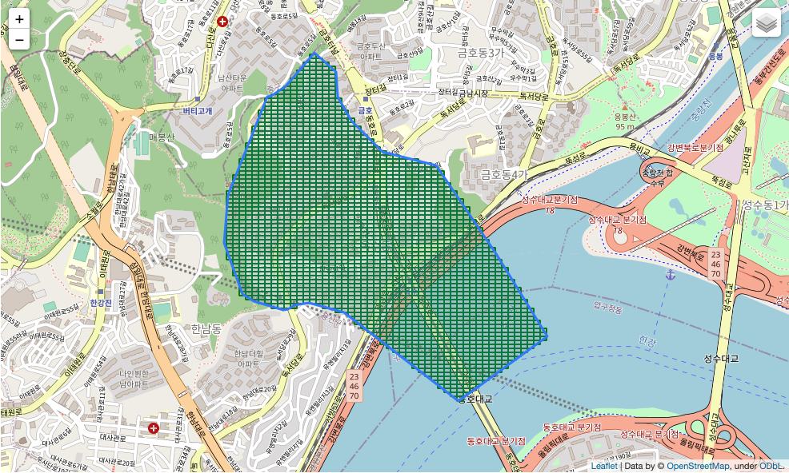<br>Level 8 </p>

**위 그림은 코드를 실행하여, GeoJson의 Polygon을 Level 8의 Geo-hash로 변환하여 시각화한 결과이다.**

한단계 아래인 Level 7로 하면 아래와 같이 조금 더 큰 셀로 그리게된다.

<p align="center">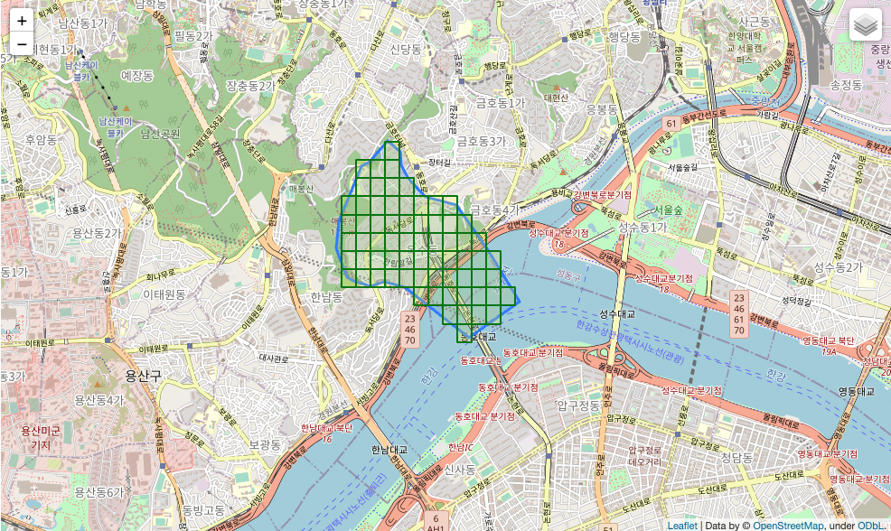<br>Level 7 </p>

또다시 한계 아래인 Level 6로 하면 아래와 같이 조금 더 큰 셀로 그리게된다.

<p align="center">Level 6 </p>

**여기서 눈여겨볼 부분은 Level이 낮아질수록 Geo-hash로 특정 Polygon을 표현하기 힘들다는 것이다.**

**Level이 낮아질수록 Polygon에 속하지 말아야할 부분이 Geo-hash 셀에 속하고, 속해야할 부분이 Geo-hash 셀에 속하지 않는다.**

> 그렇다면 무조건 Level이 높은 것이 좋은가? 그것도 아닌 것이, 높아질수록 셀이 많아져 연산량이 증가하게된다.
> 
> 가장 좋은 것은 서비스에 맞춰 적당한 사이즈를 찾는 것이다.

<br>

# 4 Geo-hash 최적화

<br>

💁‍♂️ **Level 설정에 따른 딜레마**

위와 같이 Geo-hash의 Level 차이에 따라 Polygon을 더 정확하게 표현할지 말지가 결정된다.

당연히 너무 낮게 Level을 설정하면 제대로 표현할 수 없기에, 비교적 높은 Level을 설정하게된다.

**Level을 높이면 Geo-hash로 Polygon을 정확하게 표현되지만, 문제는 셀의 개수가 기하급수적으로 많아진다는 것이다.**

**이는 계산과 처리에 대한 비용을 증가시키는 원인이된다.** 

> 비유로 해상도가 높아지면 컴퓨터의 연산량이 많아진다.

실제로 위 학습테스트에서 옥수동을 Level별로 표현했을 때의 셀 개수는 다음과 같다.

* Level 8 - 2159개
* Level 7 - 69개
* Level 6 - 2개

즉, **Level이 높을수록 더 정확하게 Polygon을 표현하지만, 셀의 개수가 증가하여 연산량이 증가하게된다.**

<br>

🤔 **이 문제를 해결하는 방법은 셀을 병합하는 것이다.**

**문제를 해결하는 방법은 셀마다 부모인 바로 위 Level에 속하는 셀들이 같은 Polygon에 존재할 경우 병합하는 방법을 이용하는 것이다.**

> python 라이브러리인 [polygeohasher](https://github.com/rohitsinghsalyan/polygeohasher)를 이용한다.

파이썬 코드로 구현해본다면 아래와 같다.

```python
# 옥수동 Polygon을 Geo-hash로 변환 (메서드는 위 글을 참고.)
oksu_polygon = geojson_lat_lng_converter(oksu_geojson_folium.data['geometry']['coordinates'])[0][0]
result_geohash = polygon_to_geohash(oksu_polygon, 8)

# Geo-hash 최적화
result = polygeohasher.__util_geohash_optimizer(
    result_geohash,           # geo-hash
    7,                        # largest-geo-hash-size
    10,                       # smallest-geo-hash-size
    8,                        # geo-hash-input-level
    percentage_error = 5,     # percentage-error
    forced_gh_upscale=False   # forced-geo-hash-upscale
)

# 최적화한 Geo-hash 셀 그리기
m = folium.Map(
    location=[37.540514,127.018698], # 옥수역 위경도
    zoom_start=14
)

oksu_geojson_folium = folium.GeoJson(oksu_geojson, name="oksu")

oksu_geojson_folium.add_to(m)

folium.LayerControl().add_to(m)

for gh in result:
    decoded = geohash.bbox(gh)

    # set the bounding box
    W = decoded["w"]
    E = decoded["e"]
    N = decoded["n"]
    S = decoded["s"]

    upper_left = (N, W)
    upper_right = (N, E)
    lower_right = (S, E)
    lower_left = (S, W)

    edges = [upper_left, upper_right, lower_right, lower_left]

    # add bounding box of the geohash to the map
    folium.Rectangle(
        bounds=edges,
        color="green",
        fill_color="yellow",
        weight=2,
        popup=gh,
    ).add_to(m)
    
m
```

그 결과 Geo-hash의 셀은 아래와 같이 나온다.

<p align="center">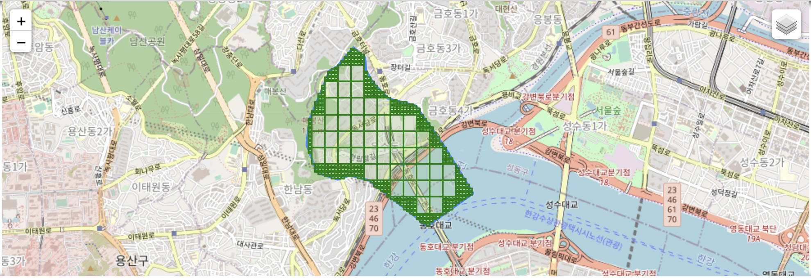Level 8의 Geo-hash를 최적화한 결과 </p>

<br>

어떤가? **눈으로만봐도 셀의 개수가 크게 줄었다.**

**이는 Level 8의 모든 셀을 확인하여 같은 부모를 가졌다면 셀을 Level을 병합하는 방식을 통해 최적화한 것이다.**

그리고 이전과의 비교는 아래와 같다.

<p align="center">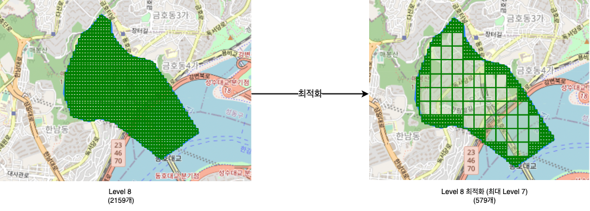 </p>

**셀의 개수가 2159개에서 579개로 대략 4분의 1정도 줄어든 것을 볼 수 있다.**

이는 **연산해야하는 셀의 개수가 적어진 것을 의미한다.**

**이렇게되면 Polygon을 정확하게 표현함과 동시에 연산량도 크게 줄일 수 있는 효과가있다. - 굉장히 중요**

<br>

# 5 Geo-hash를 이용한 Point In Polygon
이제 Geo-hash를 이용하여 이번 글의 최종 목표인 Point In Polygon (이하, PIP)을 어떻게 구현할지 살펴본다.

> 후.. 시리즈글로 정리하려다 하나로 정리하려니 생각보다 글이 길어졌다..

<br>

💁‍♂️ **PIP 과정**

PIP 과정은 간단하다.

1. 지점별 Geo-hash 셀을 지점 ID과 매핑시켜둔다.
   * 최소 Level과 최대 Level을 정하여 Geo-hash 셀을 최적화한다.
   * 저장형태 - `key : value` = `Geo-hash : 지점 ID`
2. 사용자가 위경도를 입력하면 해당 위치의 지정한 최소 Level과 최대 Level 셀로 변환한다.
   * 위경도 -> List<Geo-hash> 
3. 사용자 위경도를 변환한 List<Geo-hash>를 순회하며 해당하는 지점이 있는지 확인한다.
   * `Geo-hash : 지점 ID`에서 key를 이용하여 지점 ID를 탐색하는 것.

**시간 복잡도는 O(1)이 된다.**

<br>

예시를 통해 설명하고자, 여러 지점을 가진 퀵커머스의 예시를 들어본다.

<br>

💁‍♂️ **요구사항**

* **사용자 위경도를 통해, 여러 지점(Polygon)중 배달 권역을 위해 어떤 지점(Polygon)에 속하는지 알아야한다.**
  * 만약 특정 지점에 속하면 해당 지점을 안내해준다.
  * 만약 어떠한 지점에도 속하지않으면 사용불가 안내를 해줘야한다.

<br>

1️⃣ **지점 Geo-fence을 설정후, Geo-hash로 변환한다.**

학습테스트에서 사용된 옥수동 Geo-fence를 그대로 사용한다.

<p align="center"> </p>

이를 최적화된 Geo-hash로 변환한다.

이때 **최적화할 최소 Level과 최대 Level을 설정한다.**

> 이번 예시에서는 기본 및 최대 8, 최소 6로 설정하였다.

<br>

2️⃣ **지점의 Geo-hash를 key:value 형태로 저장해둔다.**

변환한 Geo-hash를 모두 지점 ID로 매핑한다. (여기선 `A`라 설정한다.)

```python
{'wydmd1zu': 'A', 'wydmd4v3': 'A', 'wydmd3kg': 'A', 'wydmd92j': 'A', 'wydmd3rz': 'A', 'wydmd711': 'A', 'wydmd6m': 'A', 'wydmd1yq': 'A', 'wydmd1yd': 'A', 'wydmd78t': 'A', 'wydmd6t2': 'A', 'wydmd78n': 'A', 'wydmd4m': 'A', 'wydmd1zf': 'A', 'wydmd1vq': 'A', 'wydmd78q': 'A', 'wydmd731': 'A', 'wydmd1zq': 'A', 'wydmd71r': 'A', 'wydmd9b1': 'A', 'wydmd4vx': 'A', 'wydmd6q0': 'A', 'wydmd5q2': 'A', 'wydmd3rs': 'A', 'wydmd4vw': 'A', 'wydmd78p': 'A', 'wydmd783': 'A', 'wydmd71q': 'A', 'wydmd9bj': 'A', 'wydmd78u': 'A', 'wydmd6u0': 'A', 'wydmd1yc': 'A', 'wydmd3dw': 'A', 'wydmd3kq': 'A', 'wydmd3dy': 'A', 'wydmd6qp': 'A', 'wydmd6gu': 'A', 'wydmd3dj': 'A', 'wydmd6tc': 'A', 'wydmd3r5': 'A', 'wydmd3kv': 'A', 'wydmd3jk': 'A', 'wydmd6qe': 'A', 'wydmd6t6': 'A', 'wydmd3jp': 'A', 'wydmd4sf': 'A', 'wydmd6uj': 'A', 'wydmd92n': 'A', 'wydmd5q9': 'A', 'wydmd37t': 'A', 'wydmd71d': 'A', 'wydmd3nm': 'A', 'wydmd71f': 'A', 'wydmd3bj': 'A', 'wydmd1ve': 'A', 'wydmd6p0': 'A', 'wydmd5xd': 'A', 'wydmd3b9': 'A', 'wydmd6ue': 'A', 'wydmd6gn': 'A', 'wydmd3rd': 'A', 'wydmd3dn': 'A', 'wydmd3u': 'A', 'wydmd6tn': 'A', 'wydmd786': 'A', 'wydmd37p': 'A', 'wydmd3v': 'A', 'wydmd4kg': 'A', 'wydmd787': 'A', 'wydmd6g6': 'A', 'wydmd4v8': 'A', 'wydmd98k': 'A', 'wydmd1z6': 'A', 'wydmd3ds': 'A', 'wydmd6u3': 'A', 'wydmd6qq': 'A', 'wydmd744': 'A', 'wydmd6td': 'A', 'wydmd78j': 'A', 'wydmd3r0': 'A', 'wydmd63': 'A', 'wydmd68': 'A', 'wydmd3x': 'A', 'wydmd741': 'A', 'wydmd64': 'A', 'wydmd1yf': 'A', 'wydmd3bw': 'A', 'wydmd6tq': 'A', 'wydmd6tt': 'A', 'wydmd4hy': 'A', 'wydmd4w': 'A', 'wydmd3kj': 'A', 'wydmd6tr': 'A', 'wydmd4vz': 'A', 'wydmd71k': 'A', 'wydmd92p': 'A', 'wydmd5q1': 'A', 'wydmd6qd': 'A', 'wydmd3bq': 'A', 'wydmd6qj': 'A', 'wydmd5q7': 'A', 'wydmd1yv': 'A', 'wydmd3nq': 'A', 'wydmd4kc': 'A', 'wydmd6pj': 'A', 'wydmd3k3': 'A', 'wydmd3by': 'A', 'wydmd4x': 'A', 'wydmd6uk': 'A', 'wydmd92x': 'A', 'wydmd3br': 'A', 'wydmd1vz': 'A', 'wydmd6p8': 'A', 'wydmd4vk': 'A', 'wydmd6v0': 'A', 'wydmd6qm': 'A', 'wydmd6h': 'A', 'wydmd4vv': 'A', 'wydmd3bn': 'A', 'wydmd78s': 'A', 'wydmd3r3': 'A', 'wydmd6uc': 'A', 'wydmd6g2': 'A', 'wydmd3bs': 'A', 'wydmd37q': 'A', 'wydmd71p': 'A', 'wydmd5x8': 'A', 'wydmd710': 'A', 'wydmd98v': 'A', 'wydmd3jf': 'A', 'wydmd6w0': 'A', 'wydmd1yg': 'A', 'wydmd37w': 'A', 'wydmd3de': 'A', 'wydmd5qg': 'A', 'wydmd6tf': 'A', 'wydmd1zd': 'A', 'wydmd1zp': 'A', 'wydmd4n': 'A', 'wydmd1zw': 'A', 'wydmd4kz': 'A', 'wydmd1z4': 'A', 'wydmd6u1': 'A', 'wydmd1yz': 'A', 'wydmd39y': 'A', 'wydmd1y9': 'A', 'wydmd3jn': 'A', 'wydmd733': 'A', 'wydmd6pd': 'A', 'wydmd6u5': 'A', 'wydmd92q': 'A', 'wydmd3r6': 'A', 'wydmd712': 'A', 'wydmd3b6': 'A', 'wydmd6u7': 'A', 'wydmd39v': 'A', 'wydmd6gt': 'A', 'wydmd3bt': 'A', 'wydmd981': 'A', 'wydmd9b3': 'A', 'wydmd6q8': 'A', 'wydmd98x': 'A', 'wydmd3jq': 'A', 'wydmd6u8': 'A', 'wydmd1zz': 'A', 'wydmd3rn': 'A', 'wydmd6q1': 'A', 'wydmd6gm': 'A', 'wydmd6q9': 'A', 'wydmd78c': 'A', 'wydmd5q3': 'A', 'wydmd3dd': 'A', 'wydmd98p': 'A', 'wydmd6tb': 'A', 'wydmd3dg': 'A', 'wydmd61': 'A', 'wydmd3y': 'A', 'wydmd5xv': 'A', 'wydmd6te': 'A', 'wydmd782': 'A', 'wydmd3dq': 'A', 'wydmd4r': 'A', 'wydmd1yx': 'A', 'wydmd6ug': 'A', 'wydmd3jx': 'A', 'wydmd5x2': 'A', 'wydmd5ju': 'A', 'wydmd3c': 'A', 'wydmd3g': 'A', 'wydmd78e': 'A', 'wydmd3rt': 'A', 'wydmd3r4': 'A', 'wydmd71m': 'A', 'wydmd6t3': 'A', 'wydmd4vg': 'A', 'wydmd4p': 'A', 'wydmd3nr': 'A', 'wydmd5xb': 'A', 'wydmd3dm': 'A', 'wydmd5qv': 'A', 'wydmd734': 'A', 'wydmd3bf': 'A', 'wydmd6q5': 'A', 'wydmd5jg': 'A', 'wydmd730': 'A', 'wydmd71c': 'A', 'wydmd37v': 'A', 'wydmd5j9': 'A', 'wydmd1vx': 'A', 'wydmd3rh': 'A', 'wydmd3k8': 'A', 'wydmd1zk': 'A', 'wydmd6us': 'A', 'wydmd3hz': 'A', 'wydmd6gk': 'A', 'wydmd9b0': 'A', 'wydmd4v9': 'A', 'wydmd37x': 'A', 'wydmd5x9': 'A', 'wydmd5q6': 'A', 'wydmd3kt': 'A', 'wydmd3nh': 'A', 'wydmd1yw': 'A', 'wydmd6pn': 'A', 'wydmd6g0': 'A', 'wydmd5qy': 'A', 'wydmd37y': 'A', 'wydmd4kv': 'A', 'wydmd4v0': 'A', 'wydmd6u6': 'A', 'wydmd4vm': 'A', 'wydmd1zv': 'A', 'wydmd6f': 'A', 'wydmd3dh': 'A', 'wydmd6ge': 'A', 'wydmd5qd': 'A', 'wydmd3q': 'A', 'wydmd3rw': 'A', 'wydmd1zg': 'A', 'wydmd1yy': 'A', 'wydmd1yp': 'A', 'wydmd5q0': 'A', 'wydmd3kn': 'A', 'wydmd3df': 'A', 'wydmd6u4': 'A', 'wydmd5qt': 'A', 'wydmd3b7': 'A', 'wydmd3jy': 'A', 'wydmd3ks': 'A', 'wydmd6p6': 'A', 'wydmd39x': 'A', 'wydmd3kc': 'A', 'wydmd6d': 'A', 'wydmd3m': 'A', 'wydmd3bm': 'A', 'wydmd6t7': 'A', 'wydmd98g': 'A', 'wydmd3bu': 'A', 'wydmd6t9': 'A', 'wydmd5jf': 'A', 'wydmd5qc': 'A', 'wydmd3b4': 'A', 'wydmd740': 'A', 'wydmd745': 'A', 'wydmd780': 'A', 'wydmd39z': 'A', 'wydmd6qk': 'A', 'wydmd986': 'A', 'wydmd3dz': 'A', 'wydmd3rm': 'A', 'wydmd1y6': 'A', 'wydmd4sv': 'A', 'wydmd6ub': 'A', 'wydmd3bg': 'A', 'wydmd3rr': 'A', 'wydmd1z7': 'A', 'wydmd92r': 'A', 'wydmd3kw': 'A', 'wydmd3b5': 'A', 'wydmd3k5': 'A', 'wydmd5jc': 'A', 'wydmd6q3': 'A', 'wydmd71j': 'A', 'wydmd3rj': 'A', 'wydmd5xf': 'A', 'wydmd3jz': 'A', 'wydmd4vs': 'A', 'wydmd6g9': 'A', 'wydmd3r7': 'A', 'wydmd6uf': 'A', 'wydmd4v6': 'A', 'wydmd6gf': 'A', 'wydmd4hv': 'A', 'wydmd98t': 'A', 'wydmd3jg': 'A', 'wydmd985': 'A', 'wydmd5r': 'A', 'wydmd71s': 'A', 'wydmd98n': 'A', 'wydmd71e': 'A', 'wydmd98c': 'A', 'wydmd4ky': 'A', 'wydmd732': 'A', 'wydmd1zn': 'A', 'wydmd1vw': 'A', 'wydmd6pk': 'A', 'wydmd6pp': 'A', 'wydmd6k': 'A', 'wydmd6w1': 'A', 'wydmd3jr': 'A', 'wydmd788': 'A', 'wydmd6g1': 'A', 'wydmd5p': 'A', 'wydmd3dx': 'A', 'wydmd748': 'A', 'wydmd4kb': 'A', 'wydmd71n': 'A', 'wydmd60': 'A', 'wydmd4sb': 'A', 'wydmd3dt': 'A', 'wydmd1y4': 'A', 'wydmd71h': 'A', 'wydmd6th': 'A', 'wydmd3bz': 'A', 'wydmd3js': 'A', 'wydmd3dc': 'A', 'wydmd3w': 'A', 'wydmd6tk': 'A', 'wydmd1zj': 'A', 'wydmd6gq': 'A', 'wydmd6p9': 'A', 'wydmd3s': 'A', 'wydmd67': 'A', 'wydmd6g4': 'A', 'wydmd4sc': 'A', 'wydmd715': 'A', 'wydmd9b4': 'A', 'wydmd98e': 'A', 'wydmd6g7': 'A', 'wydmd3rp': 'A', 'wydmd735': 'A', 'wydmd994': 'A', 'wydmd982': 'A', 'wydmd6qb': 'A', 'wydmd78g': 'A', 'wydmd6tj': 'A', 'wydmd3dp': 'A', 'wydmd6ts': 'A', 'wydmd3rv': 'A', 'wydmd713': 'A', 'wydmd98q': 'A', 'wydmd6p5': 'A', 'wydmd3nn': 'A', 'wydmd1y7': 'A', 'wydmd3dv': 'A', 'wydmd6c': 'A', 'wydmd71b': 'A', 'wydmd4vc': 'A', 'wydmd1vy': 'A', 'wydmd3bv': 'A', 'wydmd6n': 'A', 'wydmd3ky': 'A', 'wydmd5jb': 'A', 'wydmd5xe': 'A', 'wydmd1yj': 'A', 'wydmd6s': 'A', 'wydmd3jt': 'A', 'wydmd4ve': 'A', 'wydmd9bh': 'A', 'wydmd1y5': 'A', 'wydmd716': 'A', 'wydmd71u': 'A', 'wydmd6tm': 'A', 'wydmd5xc': 'A', 'wydmd1vt': 'A', 'wydmd980': 'A', 'wydmd6j': 'A', 'wydmd1zr': 'A', 'wydmd6p7': 'A', 'wydmd6gb': 'A', 'wydmd6t1': 'A', 'wydmd3bd': 'A', 'wydmd5qk': 'A', 'wydmd78f': 'A', 'wydmd71w': 'A', 'wydmd6u9': 'A', 'wydmd71t': 'A', 'wydmd6v1': 'A', 'wydmd3bp': 'A', 'wydmd5qu': 'A', 'wydmd1vv': 'A', 'wydmd98w': 'A', 'wydmd6q4': 'A', 'wydmd5qs': 'A', 'wydmd6qc': 'A', 'wydmd71x': 'A', 'wydmd3nx': 'A', 'wydmd3kk': 'A', 'wydmd1zs': 'A', 'wydmd714': 'A', 'wydmd984': 'A', 'wydmd98m': 'A', 'wydmd3ru': 'A', 'wydmd1yt': 'A', 'wydmd1z5': 'A', 'wydmd71v': 'A', 'wydmd78m': 'A', 'wydmd989': 'A', 'wydmd98d': 'A', 'wydmd6qs': 'A', 'wydmd6tp': 'A', 'wydmd3np': 'A', 'wydmd1ze': 'A', 'wydmd1vu': 'A', 'wydmd6q2': 'A', 'wydmd5jv': 'A', 'wydmd6gh': 'A', 'wydmd4ku': 'A', 'wydmd6t5': 'A', 'wydmd6t8': 'A', 'wydmd6q6': 'A', 'wydmd6g3': 'A', 'wydmd3jv': 'A', 'wydmd3je': 'A', 'wydmd4t': 'A', 'wydmd98h': 'A', 'wydmd1yr': 'A', 'wydmd1ym': 'A', 'wydmd742': 'A', 'wydmd4q': 'A', 'wydmd3z': 'A', 'wydmd3k6': 'A', 'wydmd6p4': 'A', 'wydmd743': 'A', 'wydmd3k4': 'A', 'wydmd3bx': 'A', 'wydmd1z1': 'A', 'wydmd1yn': 'A', 'wydmd3kp': 'A', 'wydmd3kz': 'A', 'wydmd98s': 'A', 'wydmd6g8': 'A', 'wydmd78d': 'A', 'wydmd3f': 'A', 'wydmd3dk': 'A', 'wydmd5xg': 'A', 'wydmd6t4': 'A', 'wydmd9b8': 'A', 'wydmd6b': 'A', 'wydmd746': 'A', 'wydmd4vu': 'A', 'wydmd789': 'A', 'wydmd3r1': 'A', 'wydmd4vy': 'A', 'wydmd6gj': 'A', 'wydmd1zx': 'A', 'wydmd5j8': 'A', 'wydmd3jj': 'A', 'wydmd6qn': 'A', 'wydmd4hz': 'A', 'wydmd995': 'A', 'wydmd3bk': 'A', 'wydmd98f': 'A', 'wydmd78b': 'A', 'wydmd6p3': 'A', 'wydmd1zt': 'A', 'wydmd1z3': 'A', 'wydmd3re': 'A', 'wydmd6p2': 'A', 'wydmd3ku': 'A', 'wydmd4v7': 'A', 'wydmd3kh': 'A', 'wydmd3kr': 'A', 'wydmd1vs': 'A', 'wydmd3nj': 'A', 'wydmd1zm': 'A', 'wydmd1vk': 'A', 'wydmd9b5': 'A', 'wydmd3rx': 'A', 'wydmd784': 'A', 'wydmd781': 'A', 'wydmd70': 'A', 'wydmd6e': 'A', 'wydmd78h': 'A', 'wydmd6gc': 'A', 'wydmd3du': 'A', 'wydmd37r': 'A', 'wydmd4sg': 'A', 'wydmd6gd': 'A', 'wydmd718': 'A', 'wydmd1yk': 'A', 'wydmd3k9': 'A', 'wydmd6ph': 'A', 'wydmd1ys': 'A', 'wydmd3kd': 'A', 'wydmd3jw': 'A', 'wydmd69': 'A', 'wydmd717': 'A', 'wydmd6u2': 'A', 'wydmd71g': 'A', 'wydmd1vg': 'A', 'wydmd4y': 'A', 'wydmd3dr': 'A', 'wydmd5qb': 'A', 'wydmd3k7': 'A', 'wydmd9b6': 'A', 'wydmd6gs': 'A', 'wydmd3ry': 'A', 'wydmd98j': 'A', 'wydmd5qe': 'A', 'wydmd6gg': 'A', 'wydmd6p1': 'A', 'wydmd6v4': 'A', 'wydmd785': 'A', 'wydmd1ye': 'A', 'wydmd72': 'A', 'wydmd3rq': 'A', 'wydmd66': 'A', 'wydmd3nw': 'A', 'wydmd6g5': 'A', 'wydmd3kx': 'A', 'wydmd4z': 'A', 'wydmd3kb': 'A', 'wydmd3t': 'A', 'wydmd5qf': 'A', 'wydmd6ud': 'A', 'wydmd987': 'A', 'wydmd4vt': 'A', 'wydmd3db': 'A', 'wydmd6t0': 'A', 'wydmd6q7': 'A', 'wydmd37z': 'A', 'wydmd4vd': 'A', 'wydmd991': 'A', 'wydmd78k': 'A', 'wydmd6gv': 'A', 'wydmd6tg': 'A', 'wydmd1yh': 'A', 'wydmd4kf': 'A', 'wydmd988': 'A', 'wydmd4vf': 'A', 'wydmd1zy': 'A', 'wydmd4su': 'A', 'wydmd98r': 'A', 'wydmd6qh': 'A', 'wydmd6uh': 'A', 'wydmd3rk': 'A', 'wydmd3ke': 'A', 'wydmd3e': 'A', 'wydmd65': 'A', 'wydmd3bc': 'A', 'wydmd3jm': 'A', 'wydmd73h': 'A', 'wydmd98b': 'A', 'wydmd37u': 'A', 'wydmd4j': 'A', 'wydmd98u': 'A', 'wydmd3d7': 'A', 'wydmd5q8': 'A', 'wydmd4v2': 'A', 'wydmd3be': 'A', 'wydmd3nz': 'A', 'wydmd3km': 'A', 'wydmd1vm': 'A', 'wydmd3bh': 'A', 'wydmd4vb': 'A', 'wydmd1zh': 'A', 'wydmd1vr': 'A', 'wydmd3kf': 'A', 'wydmd5n': 'A', 'wydmd1yu': 'A', 'wydmd719': 'A', 'wydmd3ju': 'A', 'wydmd5xu': 'A', 'wydmd9b2': 'A', 'wydmd4v1': 'A', 'wydmd5x3': 'A', 'wydmd62': 'A', 'wydmd983': 'A'}
```

<br>

3️⃣ **사용자 위경도를 지정한 최소 Level과 최대 Level로 변환후 key로 검색한다.**

지점 안과 밖을 테스트하기위해 두 가지 위치 정보를 준비한다.

<p align="center">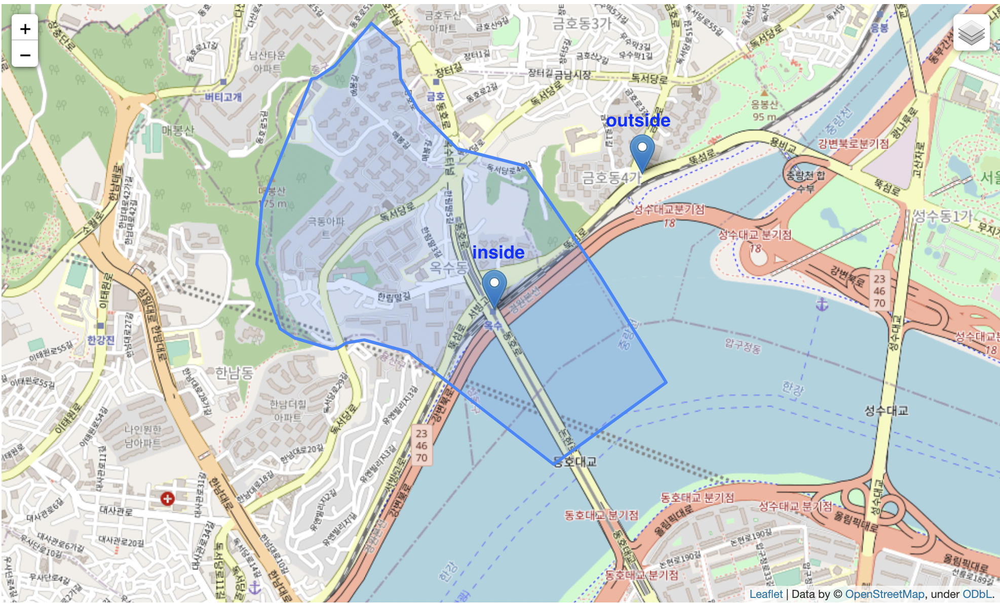 </p>

* inside: (37.5404, 127.0184)
* outside: (37.5448, 127.0247)

<br>

위 위경도를 모두 `List<Geo-hash>`로 수정한 후, dict에 key를 통해 조회한다.

* 만약 value로 A가 돌아온다면 A 지점에 속한 것이다.
* 만약 value가 없다면 A 지점에 속하지 않는 것이다. (지점이 많다면 아무 지점에도 속하지 않는 것.)

<br>

**코드로 살펴보면 아래와 같다.**

```python
# 지점 A에 대한 Geo-hash 정보를 생성한다.
largest_geo_hash_size = 6
smallest_geo_hash_size = 8
shop_a_polygon = geojson_lat_lng_converter(oksu_geojson_folium.data['geometry']['coordinates'])[0][0]
shop_a_geo_hash = polygon_to_geohash(oksu_polygon, 8)
optimized_shop_a_geo_hash = polygeohasher.__util_geohash_optimizer(
    result_geohash,           # geo-hash
    largest_geo_hash_size,    # largest-geo-hash-size
    smallest_geo_hash_size,   # smallest-geo-hash-size
    smallest_geo_hash_size,   # geo-hash-input-level
    percentage_error = 5,     # percentage-error
    forced_gh_upscale=False   # forced-geo-hash-upscale
)

# 지점 A에 대한 Geo-hash 정보를 매핑한다. (key : value = Geo-hash 셀 : 지점 A)
db = {gh : 'A' for gh in optimized_shop_a_geo_hash}

# 사용자 위치정보 -> Geo-hash 변환
def convert_to_geo_hash(lat, lng, precision_min, precision_max):
    result = []
    for precision in range(precision_min, precision_max + 1):
        gh = geohash.encode(latitude=lat,longitude=lng,precision=precision)
        result.append(gh)
    return result

# User A의 Geo-hash : ['wydmd6', 'wydmd65b']
user_a_geo_hashes = convert_to_geo_hash(37.5404, 127.0184, largest_geo_hash_size, smallest_geo_hash_size)
print(user_a_geo_hashes)
# User B의 Geo-hash : ['wydmdd', 'wydmddbd']
user_b_geo_hashes = convert_to_geo_hash(37.5448, 127.0247, largest_geo_hash_size, smallest_geo_hash_size)
print(user_b_geo_hashes)

# 유저가 속하는 지점 반환
def what_shop_is_in(db, ghs):
    result = set()
    for gh in ghs:
        if (db.get(gh) is not None):
            result.add(db.get(gh))
    return result

# 유저가 속하는 지점 확인
user_a_result = what_shop_is_in(db, user_a_geo_hashes) # {'A'}
user_b_result = what_shop_is_in(db, user_b_geo_hashes) # None

print(f'유저 a가 속하는 지점은 {len(user_a_result)}개 입니다.') # 1개
print(f'유저 b가 속하는 지점은 {len(user_b_result)}개 입니다.') # 0개
```

결과를 보면 user a는 Polygon안에 속하니 해당 지점명이 나오고, user b는 밖에있으니 없는 것이 나오는 것을 확인할 수 있다.

**이렇게 Geo-hash를 이용하면 쉽게 PIP를 구현할 수 있다.**

**시간복잡도는 O(1)이며, 미리 Geo-hash : Shop 의 매핑정보를 로컬 캐시나 Redis에 넣어두면 많은 트래픽도 감당할 수 있다.**

> 사용자의 위경도를 Geo-hash로 변환하는 작업으로인해 최악의경우 `O(logn)`이 소요될 수도 있다.

<br>

# 마치며
처음엔 Geo-hash의 개념만 다룰려고했으나... 생각보다 글이 길어졌다.

여기까지 끈기를 갖고 읽으신 분들에게 감사하다고 말씀드리고싶다 :)

이번 글을 통해 Geo-hash의 개념과 이를 이용한 PIP를 이해하는데는 큰 문제가 없을 듯 하다.

이 다음글은 실제 많은 서비스 회사에서 많이 사용하는 S2와 H3를 정하고자한다.

<br>

# 참고
* https://www.joinc.co.kr/w/man/12/geohash/geofencing
* https://icthuman.tistory.com/entry/Geohash%EB%A5%BC-%EC%9D%B4%EC%9A%A9%ED%95%9C-%EC%A2%8C%ED%91%9C%EA%B8%B0%EB%B0%98-%EC%8B%9C%EC%8A%A4%ED%85%9C-%EA%B0%9C%EC%84%A0
* https://medium.com/bukalapak-data/geolocation-search-optimization-5b2ff11f013b
* https://www.geospatialworld.net/blogs/polygeohasher-an-optimized-way-to-create-geohashes/

