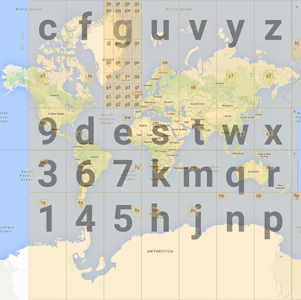
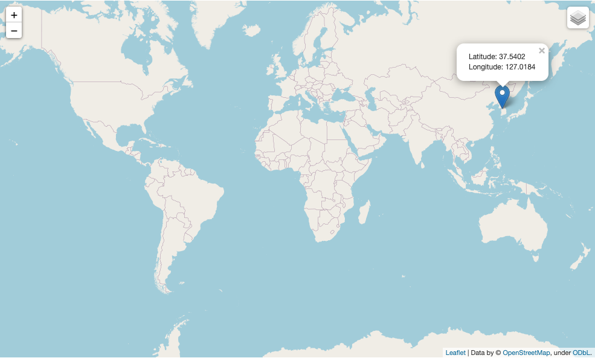

 

# 목차

 

- [목차](#목차)
- [GeoHash 기본 개념과 Geo-hash를 이용한 Point In Polygon](#geohash-기본-개념과-geo-hash를-이용한-point-in-polygon)
- [1 Geo-hash](#1-geo-hash)
  - [1-1 Hash와 Hash함수](#1-1-hash와-hash함수)
  - [1-2 Geo-hash란?](#1-2-geo-hash란)
  - [1-3 Geo-hash 알고리즘](#1-3-geo-hash-알고리즘)
  - [1-4 Geo-hash 특징](#1-4-geo-hash-특징)
  - [1-5 Geo-hash 한계](#1-5-geo-hash-한계)
- [파이썬을 통한 Geo-hash 학습테스트](#파이썬을-통한-geo-hash-학습테스트)
- [마치며](#마치며)
- [참고](#참고)

 

# GeoHash 기본 개념과 Geo-hash를 이용한 Point In Polygon
[이전 글](../Point%20in%20polygon%20-%20GeoFence/Point%20in%20polygon%20-%20GeoFence.md)에선 Geo-fence의 기본 개념과 위경도를 벡터에 투영한 Point In Polygon (이하, PIP) 알고리즘에 대해 알아보았다.

이전 글에서도 보았듯이, 위경도를 벡터공간에 투영하고 GeoJson을 통해 Polygon을 만들어 PIP를 구현할 수 있다.

하지만, **위경도는 실제 정확한 위치를 측정하는 것이 목표여서 무한하게 표현되기때문에 특정 영역 (Area)에 대한 처리를 하기엔 부적합하다는 결론에 이르렀다.**

**자세히 말하자면, 위경도를 벡터에 투영한 PIP 방식은 다수의 Polygon이 존재하는 상황에서 `O(n^2)`의 시간복잡도가 소요된다.**

> 실제 트래픽이 많이 발생하는 애플리케이션에선 사실상 PIP용도로 사용 불가하다.

또한, Polygon간의 이웃 판별이 어렵다.

**영역기반의 검색과 표현에 더 적합한 구조가 필요한데, 그 방식이 바로 지구를 일정한 크기로 클러스터링하는 그리드(Grid) 방식이다.**

> 마지막에 다루겠지만, 그리드 방식의 PIP는 여러 Polygon이 있다고해도 `O(1)`의 시간복잡도를 만들 수 있다.

**이번 글은 그리드 방식중 하나이자 인덱스의 개념을 가장 함축적으로 지닌 Geo-Hash에 대해서 살펴본다.**

우선 Geo-Hash의 기본 개념과 알고리즘에 대해서 살펴보고, Geo-Hash를 이용한 Geo-fence 구현 및 시각화해본다.

마지막으론 Geo-hash 최적화 방법과 PIP 구현하는 방법에 대해서 알아본다.

Geo-hash는 단위가 점이 아닌 공간이다. 그리고 이는 prefix 비교를 통해 이웃인지 판별할 수 있다.

> 이 글은 [이전 글 - Geofence와 PIP](../Point%20in%20polygon%20-%20GeoFence/Point%20in%20polygon%20-%20GeoFence.md)을 의존하므로, 이전 글을 보고 올 것을 추천한다.

 

# 1 Geo-hash
가장 먼저 알아 볼 부분은 Geo-hash의 개념과 특징이다.

이를 통해 벡터 기반의 공간 분석보다 왜 그리드 방식의 공간 방식이 더 효율적인지 알아본다.

 

## 1-1 Hash와 Hash함수
이름에서 알 수 있듯이, `Geo-hash`는 `hash`를 이용한다.

사전에 나오는 해시 함수에 대한 정의는 다음과 같다.

**해시 함수 (짧게는 그냥 해시)는 임의의 길이를 갖는 임의의 데이터를 고정된 길이의 데이터로 매핑하는 단방향 함수를 말한다**

해시 함수의 핵심은 특정 데이터를 찾을 때 하나하나 비교하며 찾는 것보다 해시 키를 계산하여 그 키에 해당하는 장소를 바로 찾는 것이다.

이를 통해 O(1)의 시간 복잡도를 만들 수 있다.

**`Geo-hash`도 해시 함수의 핵심을 이용한다. 즉, `Geo-hash`는 `hash`를 통해 공간 상의 위경도 좌표값을 일정한 값으로 치환하는 것이 핵심이다.**

 

## 1-2 Geo-hash란?
`Geo-hash`는 해시 함수의 원리를 이용한다고 말한다. 그렇다면 어떻게 이용할까?

바로 위경도를 해시 함수에 넣으면 지구를 특정 크기로 자른 공간의 해시 값으로 변환된다.

 

더 자세한 그림을 보자면 아래와 같다.

 

 

위와 같이, **Geo-hash란 지도 공간을 사각형으로 분할하는 계층적인 공간 데이터 구조를 의미한다.**

 전 세계 지역을 특정영역 단위로 잘라낸 것이 기본 사상이다. 

이는 Gustavo Niemeyer가 개발하였으며, 위경도를 문자와 숫자로 이루어진 짧은 String 형태로 변환한다.

아래서 더 자세히 다루겠지만, **Geo-hash는 사용자가 원하는 만큼의 정확도를 구현할 수 있으며, 맨 뒤에 글자를 지우는 것만으로 크기를 줄일 수 있다. (물론 이렇게되면 정확도도 줄어든다.)**

 

## 1-3 Geo-hash 알고리즘
이제 위경도 정보를 특정 해시 값으로 변환하는 Geo-hash의 핵심 알고리즘에 대해서 알아본다.

**위경도를 Geo-hash로 변환하는 과정은 크게 두 가지로 나뉜다.**

1. 위경도 정보를 특정 규칙에 따라 이진수로 변경한다.
2. 변경된 이진수를 특정 규칙에 따라 32진수로 변경한다. 변경된 32진수가 바로 Geo-hash이다.

 

**간단히 옥수역의 Geo-hash를 구하는 예시를 통해 어떻게 구하는지 알아본다.**

 옥수역 위경도

위도는 `37.5402`, 경도는 `127.0184`인 옥수역 대상으로 Geo-hash 값을 구해본다.

 

1️⃣ **위경도 정보를 특정 규칙에 따라 이진수로 변경한다.**

우선 투영된 전 지구를 대상으로 원하는 좌표를 위치시킨다.

 

이제 위경도 범위를 경도와 위도 번갈아가며 반으로 잘라내면서, 원하는 좌표가 왼쪽, 오른쪽중 어디에있는지 살펴본다.

그리고 아래와 같이 반으로 자른 중간 값에서 작은 쪽에 있으면 이진수로 0을, 큰 쪽에 있으면 1으로 할당한다.

 

순서는 경도 -> 위도 -> 경도 -> 위도 -> ... 순으로 진행된다.

이렇게 각각 Geo-hash의 레벨만큼 계속해서 진행되면 아래와 같이 레벨별로 경도와 위도를 계속해서 분할한다.

| Level | 경도 | 위도 | 이진수 자리수 |
|---|---|---|---|
| 1 | 3회 | 2회 | 5자리 |
| 2 | 5회 | 5회 | 10자리 |
| 3 | 8회 | 7회 | 15자리 |
| 4 | 10회 | 10회 | 20자리 |
| 5 | 13회 | 12회 | 25자리 |
| 6 | 15회 | 15회 | 30자리 |
| 7 | 18회 | 17회 | 35자리 |
| 8 | 20회 | 20회 | 40자리 |

 

**옥수역을 기준으로 Geo-hash 1레벨을 찾는다고하면 아래와 같이 탐색을 진행한다.**

 

그림에서 볼 수 있듯이, **경도 -> 위도 -> 경도 -> 위도 -> 경도 순으로 지역을 5번 분할함으로써 `11100` 이라는 값을 얻게된다.**

 

2️⃣ **변경된 이진수를 특정 규칙에 따라 32진수로 변경한다.**

위경도 정보를 특정 규칙에 따라 이진수로 변경했다면, 이제 해당 문자와 매핑되는 문자열로 변환해주면 된다. (geo-hash base32 인코딩)

다시 예시로 보면, 가장 높은 8레벨의 옥수역을 이진수로 변경하면 `11100 11110 01100 10011 01100 00011 01111 00111`가 된다.

**이를 위의 표 기준으로 변환한다면 `wydmd3g7`이 되며, `wydmd3g7`가 바로 옥수역 8 레벨의 Geo-hash이다.**

> **레벨 n 이면 Geo-hash는 n자리 해시 값이 된다.**

 

## 1-4 Geo-hash 특징
Geo-hash가 추구하는 부분과 알고리즘을 알았다면, 이제 Geo-hash에서 가장 중요한 특징들에 대해서 알아본다.

> 이는 그리드 시스템의 특징이기도하다.

 

💁‍♂️ **Geo-hash의 단위는 점 (Point)가 아닌 공간 (Polygon)이다.**

**아래와 같이 옥수역 부근의 위경도를 Geo-hash로 변환하면 모두 동일한 해시 값이 나온다.**

 

위 그림과 같이 **옥수역 부근의 모든 위경도가 모두 해시 함수를 거치면 동일하게 `wydmd3`가 나오는 것을 볼 수 있다.**

즉, Geo-hash의 단위는 점이 아닌 공간이다.

그러기에 **정확한 위치를 특정할 순 없지만, 공간을 찾거나 처리하는데 있어서 훨씬 비용이 적고 효율적이다.**

 

💁‍♂️ **Geo-hash의 목적은 계층적 구조를 통해 연산량을 줄이는 것이라고 볼 수 있다.**

**위경도는 실제 정확한 위치를 측정할 수 있다는 장점이 있다. 하지만 무한하게 표현되기때문에 특정 공간에 대한 처리를 하는데는 부적합하다.**

반면에, **Geo-hash는 실제 완전 정확한 위치를 측정할 수는 없지만, 유한하게 표현되며 인덱스 비슷하게 동작하기에 공간에 대한 처리를 하는데 적합하다고 볼 수 있다.**

이를 풀어말하면, **Geo-hash는 결국 모자이크 처리라고 볼 수 있다.**

 

이미지로 비유해보면 가장 선명한 이미지가 위경도(GPS)이고, Geo-hash 레벨이 낮아질수록 이미지를 알아보기 힘들어진다.

**이를 공간 좌표로 대입해본다면 위경도는 정확한 위치를 특정할 수 있지만, 무한하게 표현되기에 특정 공간을 찾는데 비용이 크다.**

반면에, **Geo-hash는 정확한 위치를 특정하기 어렵지만, 유한하게 표현되기에 굉장히 적은 연산량으로 특정 공간을 찾을 수 있다.**

 

💁‍♂️ **Geo-hash는 공간을 탐색하는데 용이한 반면 오차 범위가 존재한다.**

Geo-hash의 레벨별 셀의 실제 크기를 아래와 같다.

 출처: https://www.geospatialworld.net/blogs/polygeohasher-an-optimized-way-to-create-geohashes/ 

**Geo-hash는 당연히 특정 점을 나타내지 않고, 사각형의 구간을 표기하기때문에 오차가 존재한다.**

**hash의 길이에 따른 오차 범위는 아래와 같다.**

 출처: https://chrysohous.wordpress.com/2012/09/07/hash2hash-geohash-algorithm/ 

**레벨이 높아질수록 (해시의 길이가 길어질수록) 사각형이 더 작이지고 표기하고자 하는 점에 대한 오차는 점점 줄어든다.**

 

💁‍♂️ **쉽게 이웃 셀을 쉽게 찾을 수 있다.**

기존의 벡터에 위경도를 투영하는 방식은 특정 Polygon의 이웃 Polygon을 찾기 어려웠다.

Geo-hash는 알고리즘 특성상 prefix 비교를 통해 이웃인지 판별할 수 있다.

**예를 들어 Geo-hash를 통해 `130`를 얻은 경우 아래와 같이 이웃(`13`으로 시작하는 셀들 -> `131`, `132`, `133`)들을 쉽게 찾을 수 있다.**

 출처: https://docs.microsoft.com/en-us/bingmaps/articles/bing-maps-tile-system 

 

## 1-5 Geo-hash 한계
Geo-hash는 prefix를 통해 인접한 셀들을 찾을 수 있다.

하지만 매우 인접한 두 점임에도 불구하고, -180도와 +180도가 만나는 지점에서는 두 셀의 prefix가 완전 다르게된다.

즉, 두 셀은 서로 인접한 셀이라고 인식하지 않게된다.

> 다만.. 이는 충분히 예외처리가 가능할 듯 하다.

 

# 파이썬을 통한 Geo-hash 학습테스트

 

# 마치며

 

# 참고
* https://www.joinc.co.kr/w/man/12/geohash/geofencing
* https://icthuman.tistory.com/entry/Geohash%EB%A5%BC-%EC%9D%B4%EC%9A%A9%ED%95%9C-%EC%A2%8C%ED%91%9C%EA%B8%B0%EB%B0%98-%EC%8B%9C%EC%8A%A4%ED%85%9C-%EA%B0%9C%EC%84%A0
* https://medium.com/bukalapak-data/geolocation-search-optimization-5b2ff11f013b
* https://www.geospatialworld.net/blogs/polygeohasher-an-optimized-way-to-create-geohashes/

