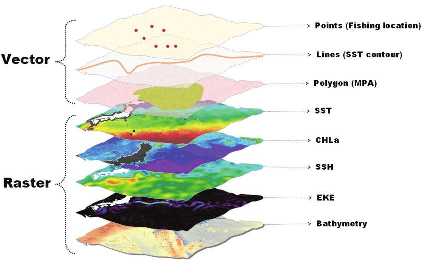
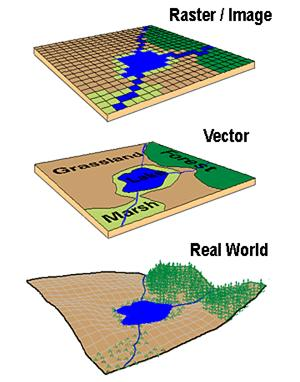
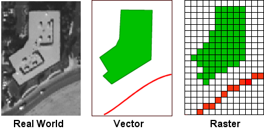
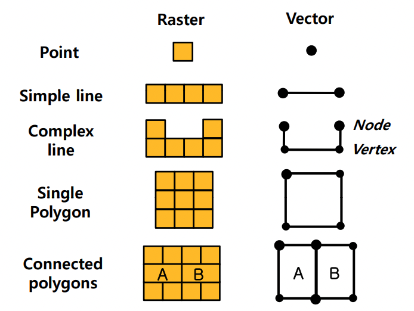
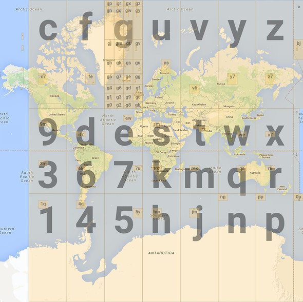

# 목차

 

- [목차](#목차)
- [들어가며](#들어가며)
- [1 GIS란?](#1-gis란)
- [2 지리공간 데이터](#2-지리공간-데이터)
- [3 GIS의 데이터 종류 (지도 모델링 방식)](#3-gis의-데이터-종류-지도-모델링-방식)
  - [3-1 Vector](#3-1-vector)
  - [3-2 Raster](#3-2-raster)
  - [3-3 Vector vs Raster](#3-3-vector-vs-raster)
  - [3-4 Point In Polygon 관점에서의 두 모델링 방식 (그리드를 사용하는 이유)](#3-4-point-in-polygon-관점에서의-두-모델링-방식-그리드를-사용하는-이유)
- [참고](#참고)

 

# 들어가며
오늘 날의 전자기기 대부분은 모두 GPS를 가지고있다. 그리고 사람들은 지도기반의 애플리케이션을 자연스럽게 사용한다.

지도는 학술, 경제활동, 항해, 군사, 여행등 다양한 분야에서 활용되고 있다.

옛날엔 종이에 지도를 그려서 사용했기에 수집과 정리, 지도의 제작등에 많은 시간과 비용이 들었다.

기술발전에 힘입어 1960년대에 이르러 디지털 컴퓨터의 사용이 활성화되면서 공간분석을 위한 소프트웨어와 하드웨어가 개발되기 시작했고 컴퓨터를 이용한 지도가 등장하기 시작한다.

> GIS (Geographic Information System)의 시초라고 볼 수 있다.

지금까지도 계속해서 지리정보시스템은 발전하고있으며, 필자 또한 현재 지도기반의 공간 정보를 분석 및 사용하는 서비스를 개발 및 관리하고있다.

**이번 글은 지도기반 서비스를 개발 및 관리하기에 앞서 컴퓨터로 어떻게 공간 데이터를 표현하고있는지에 대한 기본적인 개념을 이해하기위해 작성된 글이다.**

즉, **GIS에 대한 기본적인 개념과 구성요소, 데이터 종류, 표현 방법등에 대해서 다룬다.**

 

# 1 GIS란?

 

💁‍♂️ **옛날의 위치정보를 표시하는 방법**

옛날부터 인류는 공간상의 지리정보를 필요성에 의해 수집하고 지도를 통해 표현해왔다. 

그리고 다양한 분야에서 지리정보를 기술하는 수단은 유용성이 매우 컸다. 그 결과 다양한 목적으로 제작된 일반도뿐 아니라 특정 주제를 담고 있는 주제도가 제작되고 활용된다.

문제는 이러한 종이를 이용한 지리정보의 수집과 정리, 지도의 제작에는 많은 비용과 시간이 소요되었다. 

예를 들어, 산불의 진행, 기상변화, 지형의 침식 등과 같은 지리적 환경의 변화를 반영하여 자주 자료를 갱신해줘야 하는 경우 종이로 지도를 표기하는 방법은 매우 비효율적이다.

 

💁‍♂️ **인류 발전에 따른 지도의 디지털화**

기술발전에 힘입어 1960년대에 이르러 디지털 컴퓨터의 사용이 활성화되면서 공간분석을 위한 소프트웨어와 하드웨어가 개발되기 시작했고 컴퓨터를 이용한 지도가 등장하기 시작한다.

그리고 이러한 공간상의 지리정보를 디지털로 저장, 표현, 수정하는 기술이 발전함에따라 자연스레 지리정보시스템(GIS, Geographic Information System)이라는 개념이 생긴다.

이러한 GIS의 발전은 새로운 기술혁신으로써 DB의 유지 및 관리를 가능케함으로써, 편의성, 능률성, 신속성 등의 관점에서 지리정보를 처리함에있어 변혁을 초래하였다.

> 컴퓨터의 발전은 여러가지로 혁신을 가져온 듯 하다..

 

🤔 **GIS (Geographic Information System)의 개념**

GIS (Geographic Information System)란, 공간상의 지리정보를 컴퓨터 그래픽 처리기능과 DB 관리기능을 이용하여 저장, 변환, 가공, 출력, 분석하여 다양한 분야의 목적에 맞게 활용하는 정보체계를 의미한다.

즉, 지리정보를 수집, 저장, 관리, 분석, 표현할 수 있도록 설계된 컴퓨터의 하드웨어, 소프트웨어, 지리자료, 인적 조직체를 망라한 일종의 정보처리체계이다.

간단히 말하면.. 좌표(point)나 선(line), 영역(Polygon)등으로 지리정보를 표현하는 시스템을 의미한다.

> **보통 GIS라하면 5대 요소(하드웨어, 소프트웨어, 인력, 조직, 제도)의 총체적 체계를 의미한다.**
> 
> 이 글에선 간단히 지도를 다루는 개발을 할 때 유용한 정보만을 담았다. (GIS에 대한 자세한 자료를 원한다면 다른 자료를 찾아보길 희망한다.)

 

# 2 지리공간 데이터
지리공간 데이터 (Geosptial Data)는 지리적인 정보를 가지고있으며, GIS가 다른 정보 시스템과 구별짓는 역할을 하는 중요한 데이터를 의미한다.

지리공간 데이터는 크게 두 가지로 나뉜다.

* **Spatial Data** - 위치에 해당하는 정보
  * 실세계 현상들의 위치, 크기, 형태, 공간 상관성등
* **Attribute Data** - 위치에 해당하는 속성에 대한 정보
  * 공간요소를 제외한 나머지. 위치와 관계 없는 데이터.

 

예를 들어, "도로"에 대해서 말해보면, 어느 도로건 위치와 도로의 속성 (이름, 길이, 속도 제한, 방향)을 가지고있다.

여기서 위치는 Spatial Data이며, 도로의 모양이나 좌표에 대한 정보를 가지고있다.

도로의 속성은 Attribute Data이며, 도로의 속성 (이름, 길이등등)을 가지고있다.

 

# 3 GIS의 데이터 종류 (지도 모델링 방식)
GIS는 보통 데이터 모델링을 통해 복잡한 실세계의 현상들의 원리와 의미를 쉽게 이해할 수 있도록 데이터를 단순화한다.

> 쉽게 말해, 지도 모델링이란 위경도를 특정 데이터 형식으로 투영하는 것을 의미한다.

그리고 이러한 모델링 방식에는 크게 두 가지로 나뉜다.

1. Vector
2. Raster (Grid System)

 

> **공간정보를 컴퓨터를 통해 표현하는 방법이라고 보면 이해가 쉽다.**

 

그림을 통해 보면 아래와 같다.

 

 출처: https://www.researchgate.net/figure/A-graphic-representation-of-the-core-GIS-data-types-vector-point-line-and-polygon-and_fig2_255850776 

 

 출처: https://www.slideserve.com/sitara/spatial-data-models 

 

  출처: http://gis4uo.blogspot.com/2014/04/geographic-data-models.html 

그림을 보면 이해가 쉽다.

 

## 3-1 Vector
**벡터 (Vector)는 길이, 수량 또는 크기와 함께 방향을 가지고있는 양을 의미하며, 벡터 데이터란 방향을 지닌 선의 부분들로 이뤄진 집합으로써 지형지물의 공간적인 구성을 표현하는 데이터이다.**

쉽게 생각하면 실제 세상의 그래픽 표현을 의미한다. 

**어렵게 생각할 것 없이 3가지로 보면된다.**

* Point (점) : 대부분 좌표계에 의한 위도와 경도의 조합으로 구성되며, 폴리곤으로 표현되기 어려울 정도로 작은 경우 사용된다.
  * 주로 시설, 건물, 교차로 (node)등을 나타날 때 사용한다.
* Line (선) : 간선으로 연결된 2개 이상의 정점으로 이루어지며, 자연스러운 선의 형태를 표현하는 경우에 사용된다.
  * 주로 도로, 경로, 네트워크, 어떤 면의 중심선, 철도 등을 나타낼 때 사용한다.
* Polygon (다각형) : 폐쇄된 연결 형태로 구성된 3개 이상의 정점으로 이루어지며, 특정 영역의 경계를 표현하는 경우에 사용된다.
  * 주로 어떤 지역, 군, 영역등을 나타낼 때 사용한다.

 

## 3-2 Raster
**레스터 (Raster) 데이터는 행과 열로 어루어진 그리드에서 픽셀로 표현되며, 개별 픽셀들은 지리적 특성을 갖는 값을 나타낸다.**

**그리드를 통한 레스터 데이터는 넓은 지역에서 연속적으로 변환하는 지리적 현상이나 벡터데이터로 쉽게 나눌 수 없는 정보를 표현하고자 할 때 사용된다.**

비트의 지도라는 뜻의 비트맵 또는 픽스맵이라고도 불리운다.

 

## 3-3 Vector vs Raster

 출처: https://ocw.snu.ac.kr/sites/default/files/NOTE/9632.pdf 

* Vector
  * 장점
    * 이산적 현상 표현에 효율적.
    * 위상구조 활용가능.
    * 간결하고 명확한 데이터 구조.
    * 공간, 속성 정보의 검색, 갱신이 용이.
  * 단점
    * 복잡한 데이터 구조
    * 공간분석 기능 구현이 복잡하다.
    * 위상구조 없이는 연산시간이 길어질 수 있다.
* Raster
  * 장점
    * 데이터 구조가 단순함.
    * 데이터 수집 및 처리에 용이.
    * 빠른 연산속도.
    * 공가단위가 같은 크기와 형태를 갖기 때문에 시뮬레이션에 용이하다.
  * 단점
    * 데이터 저장용량이 비교적 크다.
    * 해상도에 따라 정보손실 가능.
    * 정확한 위치정보를 파악하기 어렵다.
    * 좌표 변환시 정보손실이 가능하다.

 

## 3-4 Point In Polygon 관점에서의 두 모델링 방식 (그리드를 사용하는 이유)
특정 공간에 대한 처리중 하나인 Point In Polygon 관점에서의 두 모델링을 비교해본다.

> 필자가 이 글을 작성하는 이유가 Point In Polygon을 구현하기 위함이기 때문이다.. ㅎ

두 모델링 방식을 PIP 문제를 해결하는데있어서 어떠한 장단점이 있을까?

 

💁‍♂️ **벡터기반 모델링의 단점**

우선 위경도는 실제 정확한 위치를 측정하는 것이 목표이기에 소수점 표현에 제한없이 무한하게 표현된다.

이는 **영역(공간)에 대한 처리를 하기에는 적합하지 않기 때문에, 영역기반의 검색/표현에 적합하지 않다.**

다시말해, 위경도를 바로 벡터로 투영한 공간 분석의 경우, **PIP (지역내 검색)이나 Polygon 간의 이웃 판별 (가까운 위치 찾기)등을 계산할 때 복잡한 수식을 사용해야하며, 인덱스나 키를 사용하기에 쉬운 구조가 아니기 때문이다.**

실제로 [이전 글](../Point%20in%20polygon%20-%20GeoFence/Point%20in%20polygon%20-%20GeoFence.md)에서 알아보았듯이, **벡터기반의 PIP는 기본적으로 시간 복잡도가 O(n)이다.**

그리고 **인덱싱이 안되기에, 만약 여러 Geo-fence중 어느 곳에 속하는지 알아본다면 O(n^2)의 시간복잡도를 가지게된다.**

이러한 **문제를 해결하는 방법은 무한한 표현방식인 벡터기반의 모델링을 한정된 공간내에 필요한 만큼만의 데이터로 관리할 수 있도록 개선하는 것이다.**

 

💁‍♂️ **벡터기반 모델링의 단점을 해결할 수 있는 방법이 바로 그리드이다.**

**그리드 방식은 전 세계 지역을 특정영역 단위로 잘라내 일정한 크기로 표현한 것을 의미한다.**

 사각형 격자구조로 나눠진 Geo-hash 출처: https://www.movable-type.co.uk/scripts/geohash.jpg 

**각 단위는 지구상의 위치를 고유하게 식별할 수 있는 고유 지리 ID를 의미한다.**

**위와 같이 지리 공간 데이터를 셀로 표현함으로써 지리 공간적 데이터를 집계, 클러스터, 분할, 축소, 조인 및 인덱싱할 수 있다.**

이를 통해 **조회 런타임 성능을 향상시키고, 저장된 데이터 크기를 줄일 수 있다.** (집계된 데이터를 시각화하기에도 좋다.)

 

# 참고
* https://ko.wikipedia.org/wiki/지리_정보_시스템
* http://edu.gjue.ac.kr/~kang/lec/introgeo/gis/gis.htm
* https://yganalyst.github.io/spatial_analysis/spatial_analysis_1/
* http://bit.ly/2x9dSCh
* https://m.blog.naver.com/mage7th/221960788791
* https://ocw.snu.ac.kr/sites/default/files/NOTE/9632.pdf
