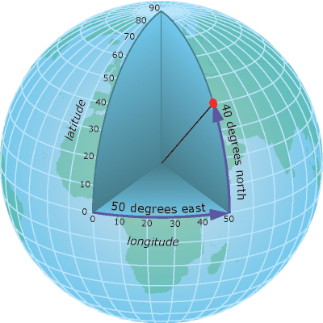
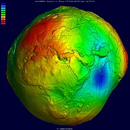
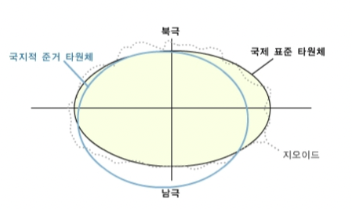
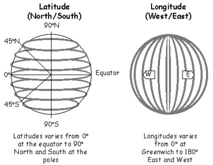

# 목차

 

 

# 들어가며
**이번 글은 공간정보를 이용한다면 꼭 알아야하는 좌표계에 대해서 알아본다.**

좌표계가 무엇이며, 좌표계는 어떤 종류가 있는지 알아본다.

좌표계는 이전 글에서 다룬 [공간정보 기본 이해하기](../공간정보%20기본%20이해하기%20-%20GIS/공간정보_기본_이해하기.md)와 같이 공간 데이터를 다룰 때 가장 기초가되는 개념이다.

좌표계와 측량 기법에 관련한 개념은 사실 굉장히 역사도 깊고 심오한 내용이 많다.

이번 글에선 어려운건 가능한 빼고, 보통 개발자들이 공간데이터를 활용할 때 알아두면 될 내용만 다룬다.

 

# 좌표계 개념
일반적으로 많이 사용되는 GPS 장비는 위도와 경도를 이용하여 현 위치를 측정하며, 종이지도는 미터 값을 기준으로 현재 위치를 표기하기도 한다.

**이렇게 공간정보는 다양한 방식으로 위치를 표기하는데 이러한 측위의 기준이 되는 것을 좌표계라고한다.**

중요한 것은 각 위치의 대한 좌표값은 모두 유일해야한다는 것이다.

즉, **좌표는 지구상 어디든 그 위치를 알파벳, 숫자, 기호등을 통해 표현할 수 있는 일종의 전 지구 주소체계라 할 수 있다.**

 

# 좌표계 종류
**지도상의 유일한 위치를 나타내는 좌표계는 지리좌표계 (경도와 위도)와 투영좌표계 (미터)로 나뉜다.**

* 지리좌표계 : 위경도 좌표계, 3차원, WGS84
* 투영좌표계 : 미터 좌표계, 2차원, TM또는 UTM

 

## 지리좌표계

 

🤔 **지리좌표계란?**

지리 좌표계는 스마트폰과 다양한 위치정보를 사용하는 시스템에서 가장 보편적으로 사용되는 좌표계이다.

 출처: https://desktop.arcgis.com/en/arcmap/10.4/map/projections/geographic-coordinate-system.htm 

지리좌표계는 지구상에 위치를 좌표로 표현하기 위해 3차원의 구면을 이용하는 좌표계를 의미한다.

위치를 위도(Latitude)와 경도(Longitude)로 표현되며, 이 단위는 도(degree)로 표시한다.

 

💁‍♂️ **국제표준타원체**

 출처: https://ko.wikipedia.org/wiki/지오이드 

위 그림과 같이 지구는 완전한 구가 아니라 약간 일그러진 타원체이며, 지표면은 그 형상이 매우 불규칙하여 어떤 일정한 규칙에 따른 임의 점의  위치표시가 사실상 불가능하다.

따라서 일정한 규칙에 따라 위치를 표현하기위해 지구상에서 높이(해발고도)를 측정하는 기준으로 지오이드라는 기준이 탄생한다.

하지만 지오이드 또한 매우 복잡한 형태를 띄고있어, 이를 해결하고자 측지학에서는 지오이드와 유사한 지구의 기하학적 형상을 평평한 회전타원체로 재정의하여 사용하고 있다. 이를 지구타원체라고 부른다.

지구타원체는 각 나라마다 해당 지역의 지오이드면에서 적합한 지구타원체를 정의한다.

다만, 전 세계를 대상으로 전체지구에 가장 적합한 지구타원체로 국제표준타원체가 지정된다.

GRS80타원체와 WGS84타원체가 국제표준타원체이다.

 표준타원체와 준거타원체  

> WGS84가 GPS에서 사용하는 좌표계이다. 구글맵에서도 이 좌표계를 사용한다.

 

🤔 **위도와 경도**

 

 

* 위도 (Latitude)
  * 주어진 지구의 표면 지점의 수직선과 적도면이 이루는 각을 의미한다.
  * 같은 위도의 지점을 연결한 선은 위선이라고 부르며 적도에 평행한 동심원이 된다. 북극은 북위 90°이다. 0° 위선은 적도이다.
  * 적도는 지구를 북반구와 남반구로 분할한다.
* 경도 (Longitude)
  * 주어진 지구의 표면 지점을 지나 북극부터 남극까지 그은 경선과 본초 자오선이 이루는 각이다.
  * 모든 경선은 반원을 그리며 평행되지 않고 북극과 남극에 한데 모인다.
  * 본초 자오선은 런던 근교의 그리니치 천문대의 바로 밑을 통과하는 자오선을 의미한다. 이것보다 동쪽에 있는 지점을 동반구, 서쪽에 있는 지점을 서반구라고한다.

 

## 투영좌표계

 

🤔 **투영좌표계란?**

**투영좌표계란 3차원인 위경도 좌표를 2차원 평면상으로 나타내기 위해 투영(projection)이라는 과정을 거쳐 투영된 좌표를 투영좌표계라고부른다.**

물론 투영하는 방식은 여러가지 존재한다. (ex. 원통, 원뿔, 평면)

 출처: https://docs.qgis.org/3.16/ko/docs/gentle_gis_introduction/coordinate_reference_systems.html 

 

# 참고
* https://desktop.arcgis.com/en/arcmap/10.4/map/projections/geographic-coordinate-system.htm
* https://yganalyst.github.io/spatial_analysis/spatial_analysis_3/
* https://blog.naver.com/PostView.nhn?blogId=heejin9867&logNo=221330301521&parentCategoryNo=&categoryNo=44&viewDate=&isShowPopularPosts=true&from=search
* https://ko.wikipedia.org/wiki/GeoJSON
* https://doc.arcgis.com/ko/arcgis-online/reference/geojson.htm
* http://www.snpo.kr/data//file/meetshare_epilogue/2949849334_CGywx7W5_slide3.pdf

