# 목차

<br>

- [목차](#목차)
- [ELB 이해하기 시리즈 첫번째 - ELB 개념과 특징](#elb-이해하기-시리즈-첫번째---elb-개념과-특징)
- [1 리버스 프록시와 ELB](#1-리버스-프록시와-elb)
  - [1-1 리버스 프록시](#1-1-리버스-프록시)
  - [1-2 ELB 개념과 종류](#1-2-elb-개념과-종류)
- [2 ELB 구성요소](#2-elb-구성요소)
  - [2-1 로드 밸런서 (Load Balancer)](#2-1-로드-밸런서-load-balancer)
  - [2-2 리스너 (Listner)](#2-2-리스너-listner)
  - [2-3 타겟 그룹 (Target Group)](#2-3-타겟-그룹-target-group)
  - [2-4 서브넷과 보안 그룹](#2-4-서브넷과-보안-그룹)
- [3 가용 영역과 로드밸런싱 노드](#3-가용-영역과-로드밸런싱-노드)
- [4 ELB 라우팅 요청 처리 과정](#4-elb-라우팅-요청-처리-과정)
- [마무리](#마무리)
- [참고](#참고)

<br>

# ELB 이해하기 시리즈 첫번째 - ELB 개념과 특징
AWS 리소스를 활용하여 서비스를 만들고 사용자에게 제공할 때, 부하 분산 서비스로 Elastic Load Balancer (ELB)를 대부분 사용한다.

ELB는 네트워크 L7에 속하는 Application Load Balancer, L4에 속하는 Network Load Balancer 그리고 마지막으로 Gateway Load Balancer를 제공한다.

다양한 계층의 부하 분산외에도 계층별로 조금씩 다르지만 ALB의 경우 SSL 암복호화, 헬스 체크, 고정 세션등의 기능을 제공한다.

이번 글은 AWS 리소스로 구성된 서비스에서 중요한 한 축을 담당하는 부하 분산 서비스 ELB가 무엇이며 어떤 역할을 하는지 살펴본다.

<br>

# 1 리버스 프록시와 ELB

<br>

## 1-1 리버스 프록시

<br>

💁‍♂️ **리버스 프록시란?**

프록시 서버란 보통 클라이언트와 서버 사이에서 데이터를 전달해주는 서버를 말한다.

프록시 서버는 Forward Proxy와 Reverse Proxy로 나눠볼 수 있다.

<p align="center">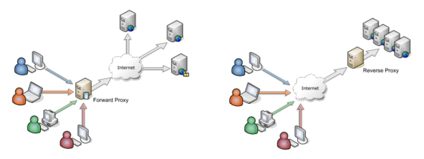<br>출처: https://stackoverflow.com/questions/224664/whats-the-difference-between-a-proxy-server-and-a-reverse-proxy-server </p>

두 프록시 서버의 차이점은 아래와 같다.

* End Point
  * Forward Proxy 는 클라이언트가 요청하는 End Point 가 실제 서버 도메인이고 프록시는 둘 사이의 통신을 담당해준다.
  * Reverse Proxy 는 클라이언트가 요청하는 End Point 가 프록시 서버의 도메인이고 실제 서버의 정보는 알 수 없다.
* 감춰지는 대상
  * Forward Proxy 는 클라이언트가 감춰진다. 요청 받는 서버는 포워드 프록시 서버를 통해서 요청을 받기 때문에 클라이언트의 정보를 알 수 없다.
  * Reverse Proxy 는 반대로 서버가 감춰진다. 클라이언트는 리버스 프록시 서버에게 요청하기 때문에 실제 서버의 정보를 알 수가 없다.

<br>

**여기서 눈여겨봐야할 부분은 Reverse Proxy는 클라이언트로부터 서버를 감추기때문에 서버를 부하 분산, 캐싱, SSL 암복호화할 수 있다는 점이다.**

그리고 AWS에선 ELB가 이러한 역할을 수행한다.

<br>

💁‍♂️ **ELB의 역할은 Reverse Proxy 역할과 동일하다.**

AWS 공식 문서에 따르면 ELB는 주요 기능으로 다음과 같은 기능들을 제공한다.

* 부하 분산 (Load Balancing)
* 헬스 체크
* 고정 세션 (Sticky Sessions)

필자는 딱 보자마자 한 가지가 떠올랐는데, 바로 위 기능들은 모두 [Reverse Proxy](https://en.wikipedia.org/wiki/Reverse_proxy)가 제공하는 기능들이라는 것이다.

**실제 공식 문서에서 찾아봤지만, 명시적으로 Reverse Proxy라고 말하진 않는 것 같다. 다만, Reverse Proxy 역할을 수행하는 서비스구나라고 생각하면 ELB가 쉽게 다가온다.**

<br>

## 1-2 ELB 개념과 종류

<br>

💁‍♂️ **ELB 정의**

```text
Elastic Load Balancing(ELB)은 하나 이상의 가용 영역(AZ)에 있는 여러 대상 및 가상 어플라이언스에서 들어오는 애플리케이션 트래픽을 자동으로 분산합니다.

- AWS 공식 문서 - 
```

ELB (Elastic Load Balancer)는 트래픽을 여러 리소스 대상에 자동으로 분산시켜 안정적인 AWS 서버 환경을 제공하는데 도움을 주는 서비스이다.

<p align="center">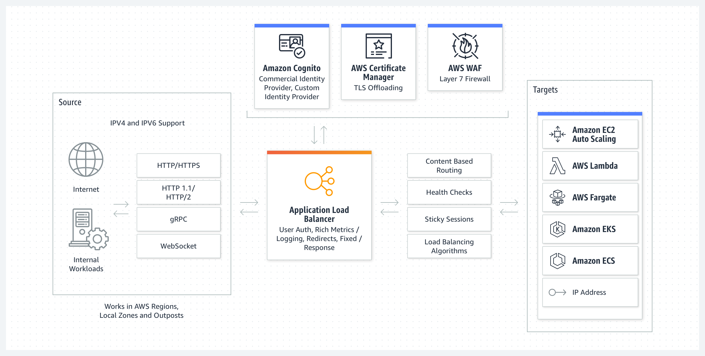<br>ALB<br>출처: AWS Docs </p>

흔히 사용되는 EC2말고도 ECS, Lambda 등을 부하 분산의 대상으로 할 수 있다.

단순히 부하 분산은 넘어 Amazon Certificate Manager (ACM)의 SSL 인증서를 탑재하여 쉽게 HTTPS를 적용할 수 있으며, WAF를 앞에두고 보안 기능을 강화할 수 있다.

이외에도 ELB의 종류 별로 다양한 기능들을 제공한다. 이와 관련해서는 아래에서 더 자세히 알아본다.

<br>

💁‍♂️ **ELB 종류**

ELB는 세 가지의 로드 밸런서 유형을 제공한다. 세가지 모두 부하 분산을 수행하는 로드 밸런서의 역할은 동일하지만 역할이 조금씩 다르다.

* [Application Load Balancer (ALB)](https://docs.aws.amazon.com/elasticloadbalancing/latest/application/introduction.html)
  * OSI 7계층중 7계층에 해당하는 Application Layer에서 부하를 분산하는 로드 밸런서이다. 
  * HTTP, HTTPS 등의 내용을 바탕으로 부하를 분산할 수 있다. 즉, HTTP 헤더의 값을 보고 어떤 대상 그룹으로 보낼지 판단할 수 있다.
  * SSL 인증서를 탑재할 수 있어 대상 그룹 EC2 서버들을 대신하여 SSL 암복호화를 할 수 있다.
* [Network Load Balancer (NLB)](https://docs.aws.amazon.com/elasticloadbalancing/latest/network/introduction.html)
  * OSI 7계층중 4계층에 해당하는 Transport Layer에서 부하를 분산하는 로드 밸런서이다.
  * TCP, UDP를 사용하여 부하를 분산하므로, HTTP 헤더를 해석하지못해 HTTP 헤더를 기반으로 부하를 분산할 순 없다. (섬세한 라우팅이 힘듬)
  * 다만 라우팅하는 속도가 빠르며, 비교적 저렴하다.
* [Gateway Load Balancer (GWLB)](https://docs.aws.amazon.com/elasticloadbalancing/latest/gateway/introduction.html)
  * OSI 계층중 3계층에 해당하는 Network Layer에서 부하를 분산하는 로드 밸런서이다.
  * GWLB는 여러 가상 어플라이언스에 트래픽을 분산하는 동시에 수요에 따라 확장 또는 축소할 수 있는 하나의 게이트웨이 역할을 수행한다.

각 로드 밸런서의 더 자세한 내용은 다음 글에서 다룰 예정이다.

<br>

# 2 ELB 구성요소

ELB는 VPC내에 위치하며, 사용자의 요청을 받아 이를 VPC 내의 리소스 (EC2, ECS, Lambda등등)에 적절히 부하를 분산한다.

그렇기에 ELB는 외부의 요청을 받는 리스너 (Listener)와 요청을 분산 및 전달할 리소스의 집합인 대상 그룹 (Target Group)으로 구성되며, ELB는 다수의 리스너와 대상 그룹으로 관리할 수 있다.

정리하면 AWS는 ELB를 3가지 구성요소로 구성된다.

<p align="center"><br>ALB 구성요소<br>출처: ALB Docs </p>

<br>

## 2-1 로드 밸런서 (Load Balancer)

로드 밸런서는 클라이언트의 단일 End Point 역할을 한다. (Reverse Proxy 역할)

클라이어트의 트래픽을 여러 가용 영역의 EC2 인스턴스와 같은 여러 대상에 분산한다. 이를 통해 높은 처리량과 높은 가용성을 제공한다.

앞서 얘기했듯이, ELB는 3가지의 로드 밸런서를 지원한다.

<br>

## 2-2 리스너 (Listner)

**리스너는 클라이언트의 요청을 받아들이고 적절한 대상 그룹으로 라우팅하는 역할을 한다.**

리스너는 구성한 프로토콜 및 포트를 사용하여 클라이언트의 연결 요청을 확인하며, 리스너에 정의한 Rule에 맞는 대상 그룹으로 라우팅한다.

<p align="center">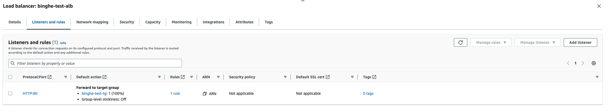 </p>

로드 밸런서에 접근할 때 포트를 포함해서 접근하기때문에, 리스너는 접근을 위한 리스너 ID에 포트를 명시해야한다.

그리고 사용자 요청시 포트에 맞는 리스너로 라우팅된다. 또한, SSL 인증서를 연동하여 HTTPS 연결도 가능하다.

<br>

## 2-3 타겟 그룹 (Target Group)

타겟 그룹은 리스너가 전달한 요청을 실제 처리하는 부하 분산 대상들의 그룹이다.

각 타겟 그룹은 지정한 프로토콜 및 포트 번호를 사용하여 EC2와 같은 하나 이상의 등록된 대상으로 요청을 라우팅하고, 해당 대상이 요청을 처리하게된다.

<p align="center">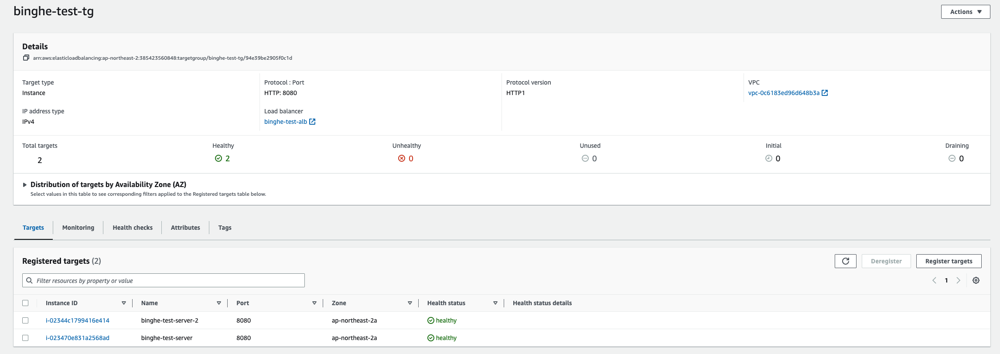 </p>

위와 같이 EC2의 인스턴스 정보 (ID, Port, 가용 영역)를 통해 대상 그룹에 등록하고, 대상 그룹은 등록된 EC2들이 리스너로부터 전달받은 요청을 처리할 수 있을지 헬스 체크 및 모니터링한다.

<br>

## 2-4 서브넷과 보안 그룹

AWS ELB 공식 문서에는 구성요소라고 나와있지않지만, ELB를 만들때 비교적 중요한 요소가 두 가지 더 있다.

**서브넷과 보안 그룹인데, ELB를 생성한다는 것은 로드 밸런서 노드를 생성한다는 의미이고, 이 노드 또한 네트워크 인터페이스의 형태를 띈다.**

즉, **로드 밸런서 노드는 네트워크 인터페이스를 갖기때문에 해당 노드를 위치시킬 서브넷과 보안 그룹을 설정해줘야한다.**

<p align="center">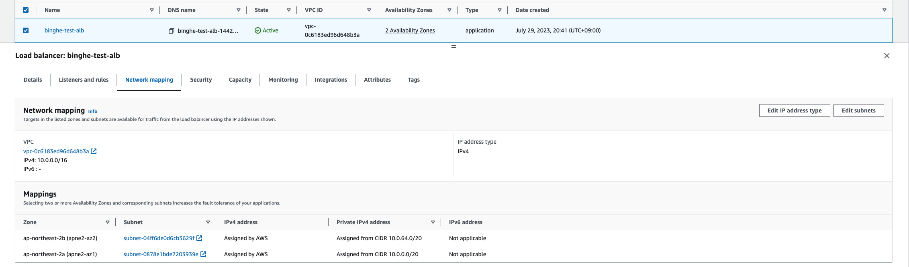<br>ELB 서브넷 매핑</p>

<br>

<p align="center">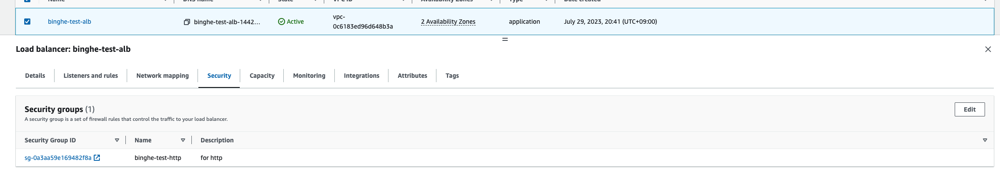<br>ELB 보안 그룹 설정</p>

<br>

# 3 가용 영역과 로드밸런싱 노드

<br>

💁‍♂️ **가용 영역별 로드밸런싱 노드가 생성된다.**

**로드 밸랜서에서 가용 영역을 활성화하면 ELB는 해당 가용 영역에 로드 밸런서 노드 (Load Balancer Node)를 생성한다.**

ELB에 가용 영역을 두 개 설정하였으면, 로드 밸런서 노드는 아래와 같이 각 영역마다 생성된다는 의미이다.

<p align="center">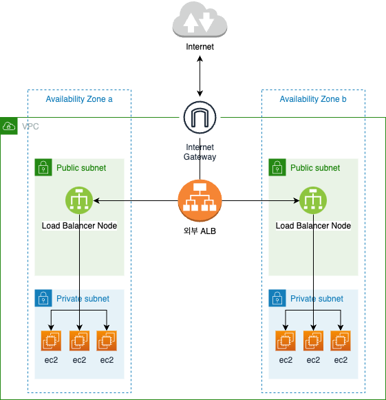<br>ALB Public 가용 영역별 로드밸런싱 노드 예시</p>

**즉, 로드 밸런서 노드는 가용 영역마다 하나씩 존재하며, 그 가용 영역에 있는 부하 분산 타겟들에게 요청을 전달한다.**

이때 가용 영역엔 등록하지만 가용 영역을 활성화하지 않으면 등록된 대상으로 트래픽이 가진 않는다.

<br>

💁‍♂️ **로드밸런싱 노드는 설정에 따라 가용 영역별 Public IP와 Private IP를 가진다.**

ELB는 VPC 내에서 하나의 형태로 존재하기때문에 다수의 네트워크 인터페이스를 가지며, 설정에 따라 Public IP 혹은 Private IP를 모두 보유하게된다.

<p align="center">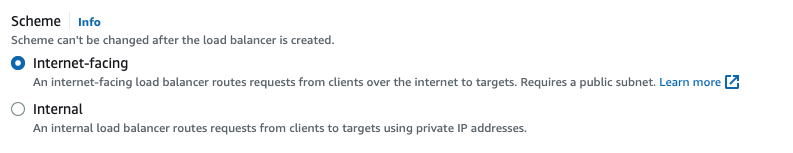<br> </p>

위와 같이 ELB를 생성할 때, Public의 요청도 받을지 선택할 수 있는데, 이 설정에따라 Public IP와 Private IP 모두를 보유한다.

<br>

💁‍♂️ **교차 영역 로드 밸런싱**

<p align="center">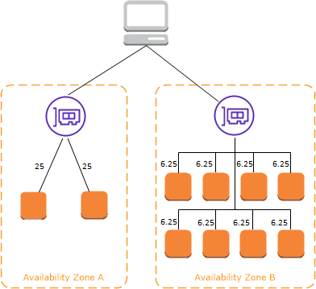<br>출처: https://docs.aws.amazon.com/ko_kr/elasticloadbalancing/latest/userguide/how-elastic-load-balancing-works.html </p>

위 그림은 인터넷 로드 밸런서가 Public IP와 Private IP 모두 보유하여 VPC 외부 사용자들의 요청을 처리하는 모습이다.

그리고 각 가용 영역마다 로드 밸런서 노드와 타겟 그룹의 EC2들이 보인다.

눈여겨 봐야할 부분은 로드 밸런서 노드와 EC2 사이 적혀있는 각각의 숫자다. 이는 각 EC2에 할당된 요청의 비율을 뜻한다.

언뜻보면 가용 영역별로 50 : 50으로 나뉘어서 잘 되는 것 같지만, EC2별로 받는 부하가 서로 다르므로, 특정 EC2들에 부하가 심하게 걸리게되는 문제가 있다.

<br>

이를 **보완하기위해 AWS는 교차 영역 로드밸런싱 (Cross Zone Load Balancing)을 지원한다.**

<p align="center">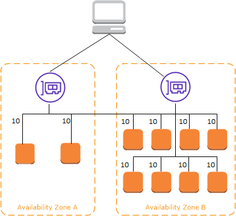<br>출처: https://docs.aws.amazon.com/ko_kr/elasticloadbalancing/latest/userguide/how-elastic-load-balancing-works.html </p>

**위 그림처럼 가용 영역별 부하 분산 타겟의 숫자가 균형을 이루지 않아도 교차 영역 로드밸런싱을 활성화하면 가용영역을 가리지 않고 트래픽이 모두 고르게 분산되게된다.**

그림이 조금 애매한데, 이를 조금 더 명확히 그려보면 아래와 같다.

<p align="center">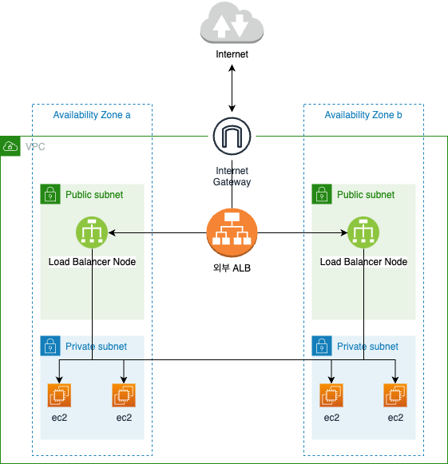 </p>

즉, **가용 영역별로 로드 밸런서 노드가 하나씩 생성되고 해당 가용 영역내에서만 트래픽이 분산되는 것이 아닌, 각 로드 밸런서 노드가 다른 가용 영역의 리소스에도 접근하여 트래픽을 분산한다.**

그래서 이름도 교차 영역이라고 부른다.

이 기능은 ALB는 디폴트로 활성화되며, NLB의 경우 기본적으로 비활성화되어있다.

<br>

# 4 ELB 라우팅 요청 처리 과정

사용자가 ELB에 올려진 서비스에 접근하기위해선 로드 밸런서 노드의 Public IP나 Private IP를 직접 입력해서 접근하지 않는다.

대신 ELB는 로드 밸런서 노드들의 IP를 하나의 DNS Name 묶어서 제공해준다.

즉, ELB를 만들면 DNS Name이 제공되는데, 해당 DNS는 로드 밸런서 노드들의 IP를 반환한다.

> Public으로 열면 여러 Public IP, Private만을 사용하면 여러 Private IP를 반환한다.

<br>

정리하면 사용자가 ELB에 접근하여 부하 분산의 타겟 대상까지 전달되는 과정은 다음과 같다.

<br>

**1. 사용자는 로드 밸런서에 접근하기 위해 AWS DNS 서버에 도메인 이름 해석을 요청한다.**

<p align="center">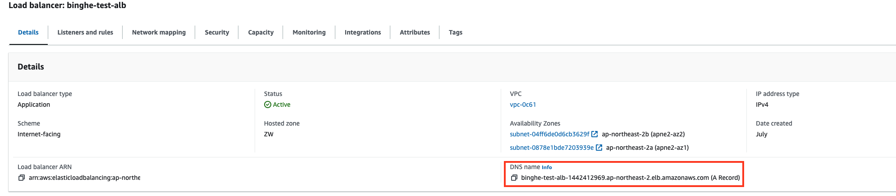 </p>

사용자는 로드 밸런서의 Public IP가 아닌 위와 같이 DNS 도메인으로 요청한다.

<br>

**2. AWS DNS 서버는 로드 밸런서 노드의 IP 리스트를 반환한다.**

아래와 같이 Amazon DNS 서버로 해당 요청이가고 DNS 서버는 로드 밸런서의 IP를 반환한다.

<p align="center">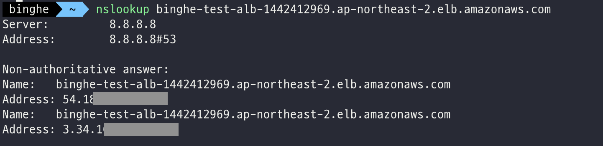 </p>

> Public DNS로 요청하면 여러 Public IP, Private DNS로 요청하면 여러 Private IP를 반환한다.
> 
> 위 예시는 가용 영역을 2개 설정한 ALB를 대상으로 진행된 것이다. 만약 가용 영역을 더 많이 설정하면 그 만큼의 로드 밸런서 노드의 Public IP를 반환하게 된다.

<br>

**3. 사용자는 반환 받은 IP중 하나를 선택하여 로드 밸런서 노드에 접근한다.**

사용자는 이제 반환받은 IP중 하나를 선택하여 포트와 함께 요청한다.

<br>

**4. 사용자의 요청을 IP와 Port가 일치하는 리스너에 접근하게 되며 리스너는 이 요청을 적절한 타겟 그룹에 처리를 위임한다.**

<br>

**5. 요청받은 타겟 그룹의 리소스가 요청을 처리하고 사용자에게 결과를 반환한다.**

<br>

# 마무리

이걸로 ELB의 기본적인 개념과 동작 과정을 간단히 살펴보았다.

다음 글은 ELB의 로드 밸런서의 종류인 ALB, NLB, GWLB에 대해서 하나하나 더 자세히 살펴 볼 예정이다.

<br>

# 참고
* https://docs.aws.amazon.com/elasticloadbalancing/latest/application/introduction.html
* https://docs.aws.amazon.com/elasticloadbalancing/index.html
* https://docs.aws.amazon.com/ko_kr/elasticloadbalancing/latest/userguide/how-elastic-load-balancing-works.html

