# 목차

 

- [목차](#목차)
- [IAM](#iam)
- [IAM 이해하기](#iam-이해하기)
- [IAM 안전하게 사용하는 모범 사례](#iam-안전하게-사용하는-모범-사례)
  - [1 - AWS 계정 루트 사용자 액세스 키 잠금](#1---aws-계정-루트-사용자-액세스-키-잠금)
  - [2 - MFA 활성화](#2---mfa-활성화)
  - [3 - 개별 IAM 사용자 생성](#3---개별-iam-사용자-생성)
  - [4 - 사용자 그룹을 이용한 접근 권한 할당](#4---사용자-그룹을-이용한-접근-권한-할당)
- [참고](#참고)

 

# IAM
AWS를 사용하는 회사들은 보통 하나의 계정을 갖고 사용한다. 회사 내 AWS를 사용하는 모든 개발자에게 같은 권한을 줄 수 없다.

따라서 대부분의 사용자 권한 관리 서비스와 마찬가지로 최고 관리자가 root 계정을 관리하고, 나머지 개발자들은 각자 계정을 발급받아 제한된 권한을 갖고 AWS를 이용하게된다.

이렇게 한 계정안에 여러 계정을 만들어 권한을 부여하는 서비스로 AWS는 IAM (Identity and Access Management)를 제공한다.

이번 글은 IAM을 이해하는데 필요한 용어들과 IAM 개념에 대해서 알아본다.

그리고 AWS 계정을 안전하게 사용하는 방법들을 소개한다.

 

# IAM 이해하기
IAM을 이해하는데 필요한 몇가지 개념들이 있다. 그리고 각 개념들의 관계는 아래와 같다.

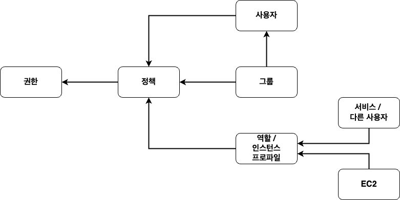 IAM 개념 구성도 

각 개념은 아래와 같은 의미를 가진다.

| 개념 | 설명 |
| --- | --- |
| 권한 | AWS의 서비스나 자원에 어떤 작업을 할 수 있는지 명시해두는 **규칙**을 의미한다. ex. 서울 리전에 있는 모든 EC2를 조회할 수 있다. ex. 서울 리전에 EC2 인스턴스를 생성할 수 있다.  |
| 정책 | **권한들의 모음**. **사용자나 그룹들에 권한을 직접 적용할 수 없고, 권한들로 만든 정책을 적용해야한다**. 정책은 사용자, 그룹, 역할에 적용할 수 있다. |
| 사용자 | **사용자는 AWS의 기능과 자원을 이용하는 객체를 의미한다**. 사용자별로 어떤 권한을 가졌는지 세분화해서 지정할 수 있다. **이때 사용자는 사람일 수도 있고, 자동화되어 실행되는 프로그램 일 수도 있다**. 접속하는 사용자인 경우에는 비밀번호가 제공되지만, 프로그램인 경우엔 액세스 키 ID와 비밀 액세스 키가 제공된다. |
| 그룹 | 여러 사용자에게 공통으로 권한을 부여할 수 있게 만들어진 개념을 의미한다. 하나의 그룹에 여러 명의 사용자를 지정할 수 있다. |
| 역할 | **어떤 행위를 하는 객체에 여러 정책을 적용한다는 점에서 사용자와 비슷하지만, 객체가 사용자가 아닌 서비스나 다른 AWS 계정의 사용자라는 점에서 차이가 있다**. **보통 사용자가 아닌 특정 서비스(ex. EC2)에서 생성한 객체에 권한을 부여하는데 사용된다**. ex. 내가 만든 EC2 인스터스가 S3에서 파일을 읽어오려면 S3 파일을 읽을 수 있는 권한으로 정책을 만든 뒤에 해당 정책으로 역할을 만들어 EC2 인스턴스에 저장해야한다. 물론 EC2 인스턴스에 사용자 키를 저장해두는 방법도있지만 이는 불편한다. **대신 EC2 인스턴스에 역할을 부여하고, 이 인스턴스 내의 모든 애플리케이션이 실행할 수 있는 권한을 지정해두는 방법을 사용한다.** |
| 인스턴스 프로파일 | 사용자가 사람을 구분하고 그 사람에 권한을 주기 위한 개념이었다면, 인스턴스 프로파일은 EC2 인스턴스를 구분하고 그 인스턴스에 권한을 주기 위한 개념이다. 인스턴스 프로파일은 역할을 위한 컨테이너로서 인스턴스 시작 시 EC2 인스턴스에 역할 정보를 전달하는 데 사용된다. 인스턴스 프로파일은 AWS 콘솔에서 역할을 생성할 때 EC2용 역할로 생성할 경우 자동으로 함께 생성된다. |

  
🤔 루트 사용자

  
  ---
  
  AWS는 브라우저를 통해 리소스를 조작하며, 조작할 때는 어느 AWS 계정에 관한 서비스를 사용할지 지정해야한다.

  AWS 계정을 처음 생성하면 사용자도 자동으로 만들어진다. 그리고 이 사용자는 루트 사용자라고 불리운다.

  루트 사용자는 AWS 계정에 관한 모든 AWS 서비스를 조작할 수 있는 강력한 권한을 가진다.

  일반적으로는 AWS 계정 안에 개발자에게 필요한 권한만 가지는 별도 사용자를 만들어서 사용한다.
  
  ---

 

# IAM 안전하게 사용하는 모범 사례
IAM는 AWS를 안전하게 이용하기 위한 다양한 기능을 제공한다. 하지만, 안전하게 사용하지 않으면.. 부정 이용이 발생하거나 의도치 않게 많은 비용이 청구될 수 있다.

이를 방지하기 위해선 IAM의 모범 사례를 알아두면 좋다.

 

## 1 - AWS 계정 루트 사용자 액세스 키 잠금
**AWS에서는 사용자 (사람)가 대시보드등을 이용해 대화형으로 조작하는 방법 외에도 프로그램을 통해 리소스를 조작하는 시스템을 제공한다.**

* 사용자가 조작할 땐 ID와 비밀번호를 이용한다
* 프로그램 등으로 조작할 때는 액세스 키(Access Key)를 이용한다.

 

이때 루트 사용자는 강력한 접근 권한과 개별 IAM 사용자들의 권한을 설정할 수 있으므로 강력한 권한을 가지게된다.

**그러므로 프로그램으로 루트 사용자의 권한을 이용해 AWS 리소스를 조작하는 것은 권장하지 않는다.**

따라서 **루트 사용자의 액세스 키는 없애는 것이 좋다.**

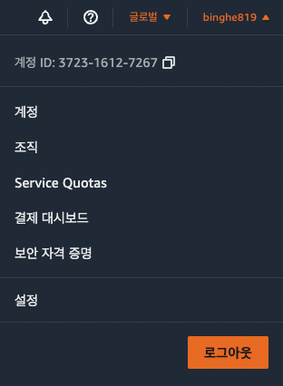 1. '보안 자격 증명' 메뉴를 클릭한다. 

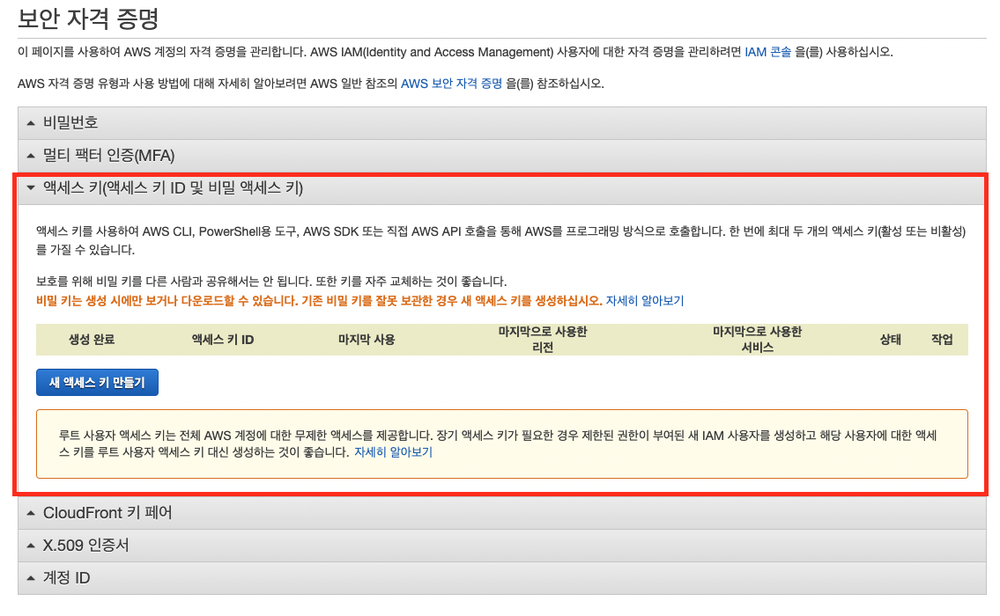 2. '액세스 키'를 확인한다. 

보통 따로 생성해주지 않았다면, 액세스키는 존재하지 않는다. 하지만, 만약 루트 사용자라면 아래와 같이 삭제해주는 것이 좋다.

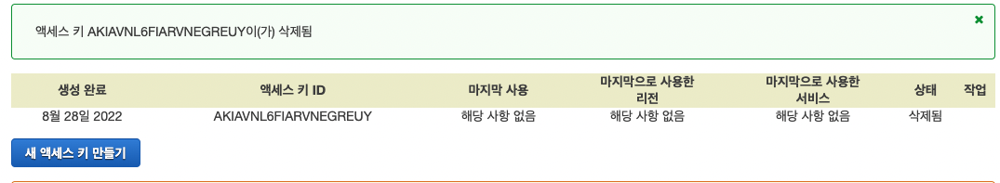 3. 만약 존재한다면 액세스 키를 삭제해준다. 

 

## 2 - MFA 활성화
루트 사용자는 메일 주소와 비밀번호의 조합만으로 로그인할 수 있다. 하지만, 이 방법은 보안적으로 안전하지 않다.

따라서 더 안전한 방법으로 MFA(Multi-factor Authentication)를 이용할 수 있다.

**MFA를 적용한다면 AWS 로그인시 비밀번호 (아는 요소) + 인증 디바이스 (가진 요소)로 더 안전하게 로그인을 제공하게 된다.**

 

1. 인증용 스마프폰에 MFA 애플리케이션을 설치한다.

> 이 글에선 Google Authenticator를 이용했다.

 

2. '보안 자격 증명' 관리 화면에서 MFA를 활성화해준다.

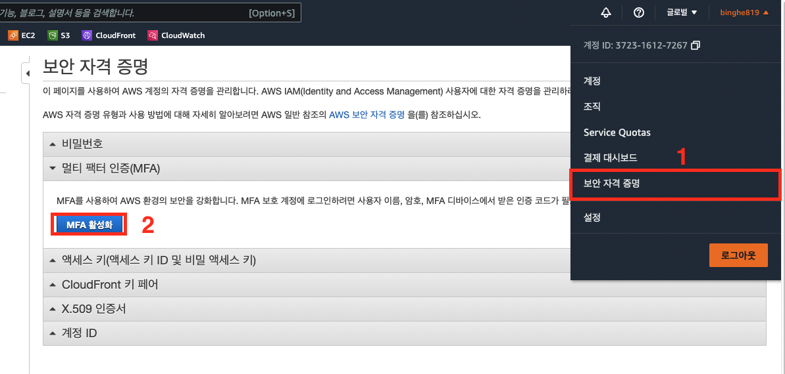 MFA 활성화 

 

3. MFA 디바이스를 선택.

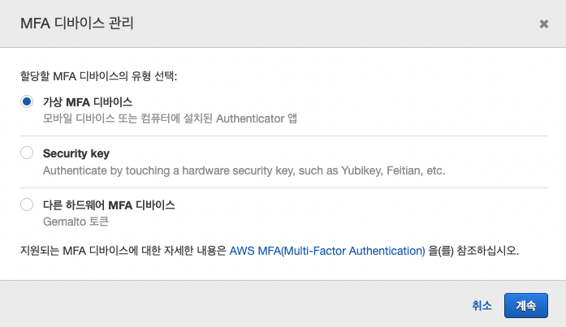 

스마트폰을 이용할 것이기 때문에, 위와 같이 가상 MFA 디바이스를 선택해준다.

4. 가상 MFA 디바이스 설정

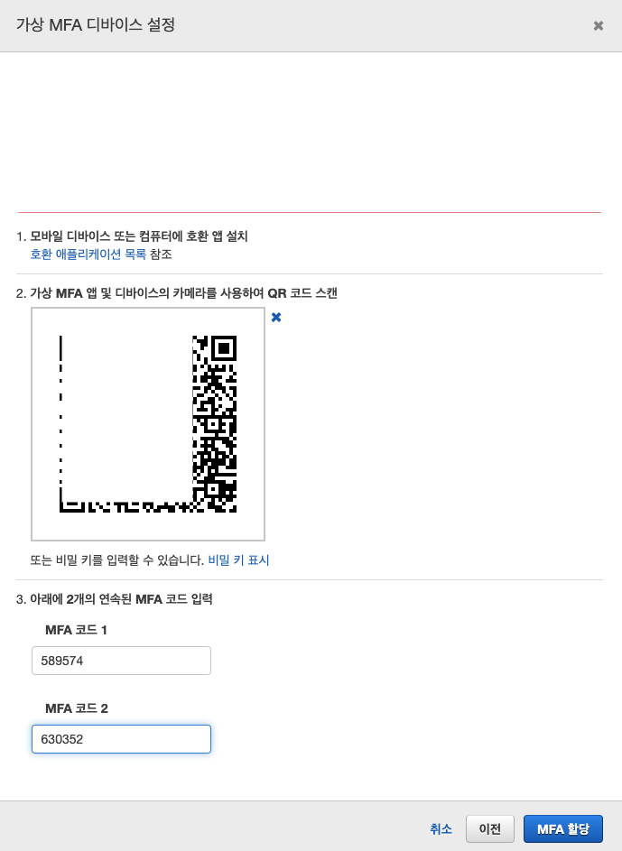 

MFA 애플리케이션에 `QR 코드 스캔` 기능을 제공한다. 이를 이용하여 위 QR 코드를 스캔하면 MFA가 추가된다.

그리고 스마트폰에 첫 번째 코드가 표시되며, 두번째 코드가 표시될 때까지 수 십 초 ~ 1분 정도 걸린다.

첫 코드와 두번째 코드를 모두 입력해주고 MFA 할당을 눌러주면 MFA가 할당된다.

 

## 3 - 개별 IAM 사용자 생성
루트 사용자는 너무 강력한 권한을 가지므로 일살적인 개발 조작을 수행하는 일반 사용자인 IAM 사용자를 생성해줘야한다.

 

1. IAM 대시보드에서 '사용자 추가' 클릭

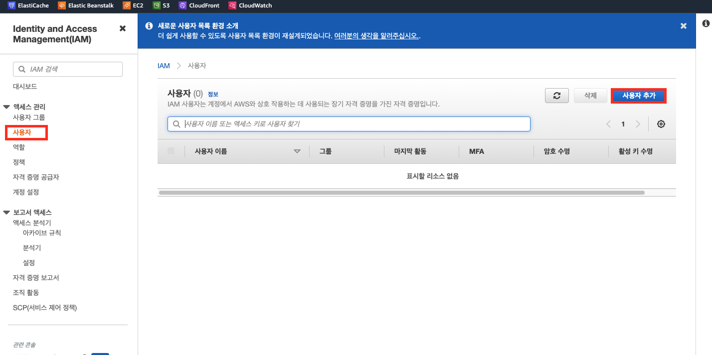 

 

2. 사용자 세부 정보 설정

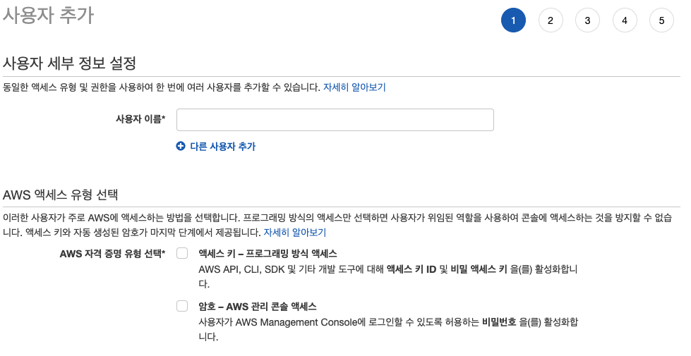 

액세스 유형은 아래 의미를 가진다.

* 프로그래밍 방식 액세스 - AWS가 제공하는 API나 SDK 등을 이용해 직접 서비스를 조작하는 사용자. (대상이 프로그램이다.)
* AWS 관리 콘솔 액세스 - 콘솔 화면을 이용해 리소스를 조작하는 사용자. (브라우저에서 AWS 대시보드 이용.)

 

3. 권한 설정

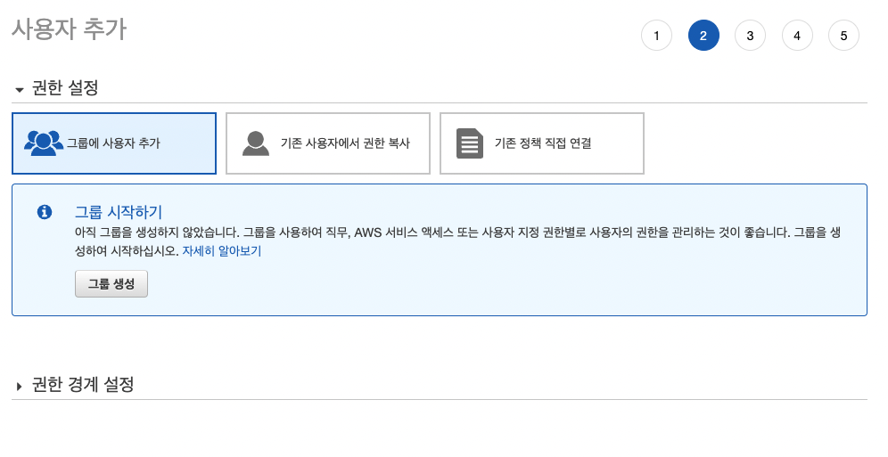 

IAM 사용자에 대한 접근 권한을 부여한다.

 

4. 태그 추가

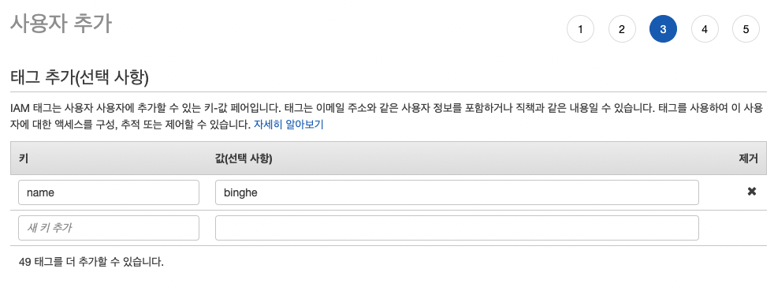 

태그는 지정한 이름 이외에 사용자를 구별할 때 사용된다.

IAM 사용자를 수백 명 정도의 대규모로 등록할 때, 이름과 함께 부서 이름, 역할 등을 이용해 쉽게 관리하도록 할 수 있다.

 

IAM을 생성되었다면, 아래와 같이 나오며 이제 IAM을 통해서 로그인도 할 수 있다.

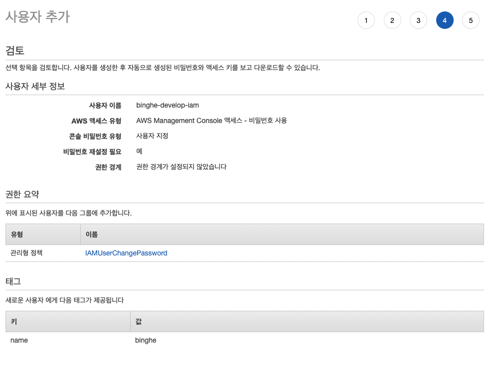 

> IAM 사용자마다 MFA 설정이 가능하다. 가능한 IAM 사용자별로 MFA 설정을 해주는 것이 좋다.

 

## 4 - 사용자 그룹을 이용한 접근 권한 할당
사용자 그룹에 접근 권한을 할당하면 효율적으로 누락 없이 사용자에게 접근 권한을 부여할 수 있다.

 

1. 사용자 그룹 생성 클릭

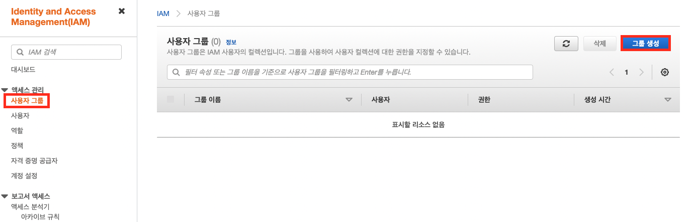 

 

2. 그룹 이름을 설정하고 권한 정책을 연결한다.

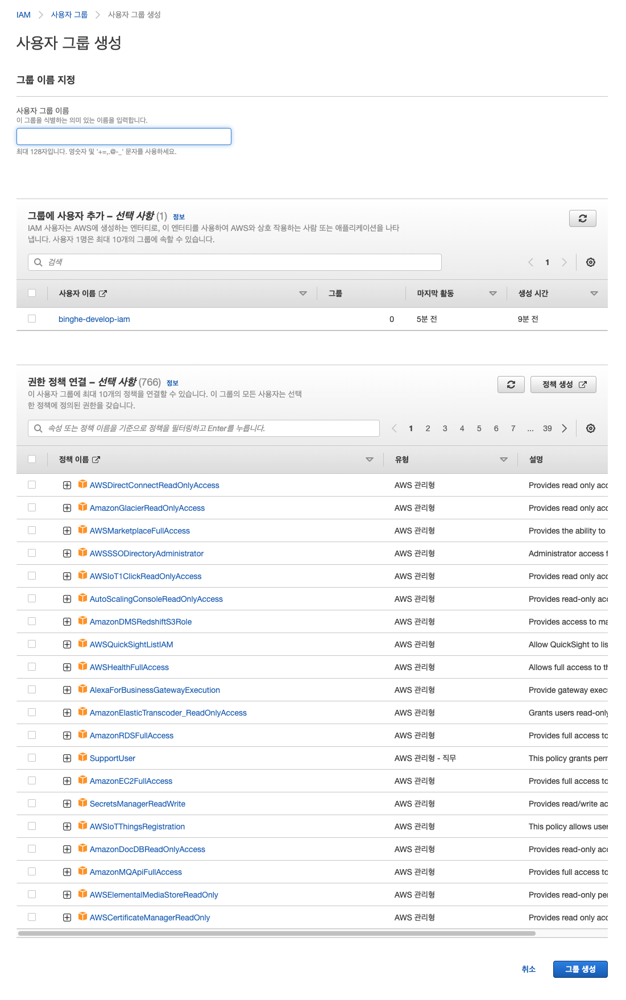 

간단히 그룹 이름을 설정하고 권한 정책을 지정해줄 수 있다.

AWS에는 매우 다양한 리소스를 제공하기 때문에, 각각에 개별적으로 접근 권한을 부여하지않고, 여러 리소스로의 접근 권한을 묶은 정책을 제공한다.

이 글에선 `PowerUserAccess` 정책을 지정해준다. 이는 AWS 안의 리소스에 대한 모든 접근 권한을 가진다.

> 그룹에 추가할 사용자도 설정해줄 수 있다.

 

# 참고
* https://docs.aws.amazon.com/ko_kr/IAM/latest/UserGuide/introduction.html
* [AWS로 시작하는 인프라 구축의 정석](http://www.yes24.com/Product/Goods/109747932)
* [AWS 인프라 구축 가이드](http://www.yes24.com/Product/Goods/68799454)
