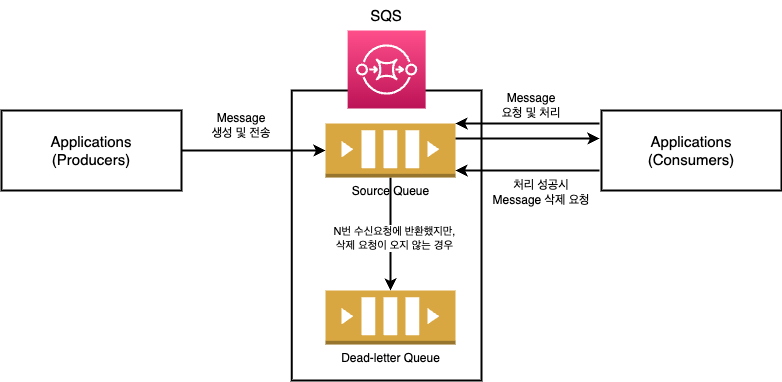

# 목차

<br>

- [목차](#목차)
- [AWS SQS 동작 이해하기 (How to works?!)](#aws-sqs-동작-이해하기-how-to-works)
- [1 배경 - 비동기 메시징 서비스](#1-배경---비동기-메시징-서비스)
- [2 SQS 란?](#2-sqs-란)
- [3 SQS 아키텍처와 동작 방식](#3-sqs-아키텍처와-동작-방식)
  - [3-1 분산 큐](#3-1-분산-큐)
  - [3-2 메시지 수명주기](#3-2-메시지-수명주기)
- [4 SQS 특징](#4-sqs-특징)
  - [4-1 두 가지 큐 종류](#4-1-두-가지-큐-종류)
    - [FIFO는 어떻게 여러 프로듀서와 컨슈머들의 요청을 순서대로 처리할까?](#fifo는-어떻게-여러-프로듀서와-컨슈머들의-요청을-순서대로-처리할까)
  - [4-2 Visibility timeout](#4-2-visibility-timeout)
  - [4-3 Delivery delay](#4-3-delivery-delay)
  - [4-4 Message retention period](#4-4-message-retention-period)
  - [4-5 Short Polling과 Long Polling](#4-5-short-polling과-long-polling)
- [5 DLQ (Dead-Letter Queue)](#5-dlq-dead-letter-queue)
  - [5-1 DLQ 개념과 동작 방식](#5-1-dlq-개념과-동작-방식)
  - [5-2 큐 유형에 따른 DLQ 사용이유](#5-2-큐-유형에-따른-dlq-사용이유)
  - [5-3 DQL는 언제 사용해야하는가?](#5-3-dql는-언제-사용해야하는가)
  - [5-4 DLQ Redrive](#5-4-dlq-redrive)

<br>

# AWS SQS 동작 이해하기 (How to works?!)
SQS는 AWS에서 제공하는 마이크로서비스, 분산 시스템 및 서버리스 애플리케이션을 분리하고 확장할 수 있는 완전 관리형 메시지 큐(대기열) 서비스이다.

사용자로하여금 큐를 따로 구축하고 관리하는 수고를 덜어준다. 편리하긴하지만 SQS의 특징을 제대로 이해하는 것이 SQS를 제대로 활용하는 측면에서 굉장히 중요하다.

이번 글은 비동기 메시징 서비스가 필요한 이유를 시작으로 SQS가 무엇이고 어떻게 동작하는지 알아본다.

> 모든 글의 출처는 [AWS SQS docs](https://docs.aws.amazon.com/sqs/index.html)이다.

<br>

# 1 배경 - 비동기 메시징 서비스
SQS에 개념과 동작 방식을 알아보기전에, 우선 왜 비동기 메시징 서비스가 필요한지 살펴본다.

<br>

💁‍♂️ **일정 규모이상의 트래픽이 발생하는 서비스는 대부분 이벤트 기반으로 동작한다.**

일정 규모이상의 트래픽이 발생하거나 거대한 시스템은 대부분 이벤트 기반으로 동작한다.

이때 이벤트 기반으로 동작하는데 꼭 필요한 서비스가 비동기 메시징 서비스이다.

즉, 서로의 역할을 수행하는 애플리케이션 서버(컴포넌트)들이 메시지를 전송하고 수신하는데있어서의 중간 매개체역할을 수행할 수 있는 비동기 메시징 시스템이 필요하다.

<br>

🤔 **왜 서비스들은 이벤트 기반의 비동기 메시징 서비스를 사용하는가?**

바로 의존성, 성능, 트랜잭션등의 문제를 해결하기 위함이다.

예를 들어, SNS 서비스를 만드는데, 사용자가 회원가입하면 이메일로 가입 축하 안내를한다고 가정해보자.

<br>

**비동기 메시징 서비스를 사용하지않고 이벤트 기반으로 동작하지 않는 경우**

회원가입시 회원가입과 이메일 전송을 하나의 서버에서 처리한다면 아래와 같이 작성할 수 있다.
```java
@Transactional
public void register(RegisterUserCommand registerUserCommand) {
    회원_가입();

    이메일 전송();
}
```
위 로직의 문제점은 아래와 같다.

* 의존성
  * 회원가입 서비스는 2가지의 로직이 서로 강하게 의존적이다. (회원가입, 이메일 전송)
  * 즉, 강한 결합이 발생하며, 이메일 코드 수정만으로도 회원 가입 로직에 영향을 줄 수 있다.
* 성능
  * 회원가입하는데 0.1초면 되지만, 이메일 전송에 5분 걸린다고 가정하면, 회원가입이라는 전체 로직은 5분넘게 소요된다. (동기 처리)
  * 회원가입이라는 핵심 로직을 제외한 이메일을 보내는 로직으로인해 회원가입에 대한 요청이 오래 걸리게되는 것.
* 트랜잭션
  * 회원가입, 이메일 전송 로직이 서로 하나의 트랜잭션으로 묶여있기에 이메일에서의 예외로 핵심 비즈니스인 회원가입이 처리 안될 수도 있다.
  * 반대로, 회원가입 처리가되었음에도 이메일이 전송될 수도 있다.
  * 즉, 하나라도 예외가 발생하면 다른 기능에 영향을 줄 수 있다.

<br>

**비동기 메시징 서비스를 사용하여 이벤트 기반으로 동작할 경우**

이벤트 기반으로 비동기 메시징 서비스를 사용하면 위 3가지의 문제를 모두 해결할 수 있다.

* 의존성
  * 회원가입시 회원가입을 수행하고, 이메일 전송을 이벤트로 메시징 서비스에 전송한다.
  * 그리고 다른 Consumer (Event Handler)가 이메일 전송 메시지를 받아서 처리한다.
  * 이렇게되면 회원가입과 이메일 전송의 로직을 서로 다른 서버(컴포넌트)에서 처리하므로, 강결합을 해결할 수 있다.
* 성능
  * 기존의 동기처리는 회원가입의 전체 처리시간이 `회원가입 시간 + 이메일 전송 시간`이었다. 
  * 비동기 메시징 서비스를 사용하여 이메일 전송을 비동기로 수행하면, 회원가입의 전체 소요시간은 오직 `회원가입 시간`만 소요되게된다.
* 트랜잭션
  * 핵심 회원가입 로직이 모두 수행되면 트랜잭션을 COMMIT하고, 비동기로 이벤트를 전송하면 된다.

<br>

💁‍♂️ **결론 - 비동기 메시징 서비스를 활용한 이벤트를 사용하는 이유.**

* 낮은 결합도 (Decoupling)
  * 한가지 비즈니스 처리하는데 사용되는 여러가지 서버의 작업을 독립적으로 수행하게함으로써 서비스 간 결합도가 낮아진다.
* 비동기 (Asynchronous)
  * 부가 비즈니스 (ex. 이메일 전송, SMS)등을 메시지 큐에 저장하여, 비동기적으로 수행할 수 있다.
  * 즉, 메시지 큐는 생성된 메시지의 저장, 전송에 대한 처리를 동기화로 진행하지 않고, 큐에 넣어두고 나중에 처리할 수 있다.
  * 기존 동기화 방식은 많은 메시지가 전송될 경우 병목이 생길 수 있고, 뒤에 들어오는 요청에 대한 응답이 지연된다.
* 확장성 (Scalable)
  * 생산자 서비스 혹은 소비자 서비스를 원하는 대로 확장할 수 있기 때문에 확장성이 좋다.
* 탄력성 (Resilience)
  * 소비자 서비스가 다운되더라도 어플리케이션이 중단되는 것은 아니다. 메시지는 메시지 큐에 남아 있다. 소비자 서비스가 다시 시작될 때마다 추가 설정이나 작업을 수행하지 않고도 메시지 처리를 시작할 수 있다.
* 보장성 (Guarantees)
  * 메시지 큐는 큐에 보관되는 모든 메시지가 결국 소비자 서비스에게 전달된다는 일반적인 보장을 제공한다.

> 이외에도 AWS Lambda등을 활용한 사례등등 메시징 서비스를 이용하는 사례는 많다.

<br>

# 2 SQS 란?

> Amazon Simple Queue Service (Amazon SQS) 는 내구력 있고 가용성이 뛰어난 보안 호스팅 대기열을 제공하며 이를 통해 분산 소프트웨어 시스템과 구성 요소를 통합 및 분리할 수 있습니다. 
>
> 출처: https://docs.aws.amazon.com/ko_kr/AWSSimpleQueueService/latest/SQSDeveloperGuide/welcome.html

**AWS SQS는 마이크로서비스, 분산 시스템 및 서버리스 애플리케이션을 분리하고 확장할 수 있는 완전 관리형 메시지 대기열 서비스이다.**

쉽게 말해 완전 관리형 메시지 분산 대기열 서비스이다.

**메시지는 수신자에게 Push되지 않으며, 수신자는 메시지를 수신하기위해 SQS를 Polling 해야한다. 이때 메시지는 최대 14일동안 SQS에 저장할 수 있다.**

또 다른 특징으로 SQS는 여러 수신자가 동시에 메시지를 수신할 수 없다. 즉, **Point-to-Point 방식**을 채택하여 사용한다.

그리고 모든 수신자는 메시지를 수신, 처리 및 삭제할 수 있다.

<br>

# 3 SQS 아키텍처와 동작 방식
SQS는 한 애플리케이션로부터 메시지를 생성(Produce)하고, 다른 애플리케이션에서 메시지를 소비할 수 있도록 큐를 제공하는 분산 큐 시스템이다.

중요한 것은 SQS도 분산된 큐 시스템이라는 것이며, 잠재적인 메시지 저장소 역할을한다.

<p align="center"><br>SQS 동작 방식</p>

SQS 메시지 시스템을 구성하는 요소는 크게 3가지다.

* 분산 애플리케이션 서버들 (Producer와 Consumer)
* SQS 큐
* 메시지 (message in the queue)

<br>

## 3-1 분산 큐

<p align="center"><br>출처: https://docs.aws.amazon.com/ko_kr/AWSSimpleQueueService/latest/SQSDeveloperGuide/sqs-basic-architecture.html </p>

위와 같이 SQS는 한 큐의 메시지도 여러 SQS 서버에 분산하여 저장한다.

> 위 그림에서 Component는 Producer와 Comsumer를 의미한다.

<br>

🤔 **왜 중복된 메시지를 분산된 시스템으로 구성하여 저장할까?**

공식문서에서는 관련하여 명확하게 얘기해주는 부분을 아직 찾지못했으나, 필자 생각엔 보통의 중복하여 데이터를 저장하는 분산 시스템에선 아래 이유로 위와 같이 구성한다고본다.

* High Availability (고가용성)
  * 중복성은 고가용성을 제공하기 위해 메시지가 여러 서버 및 가용성 영역에 걸쳐 복제되도록한다. 한 서버에서 또는 가용 영역을 사용할 수 없게 되더라도 다른 위치에서 중단없이 데이터에 접근할 수 있다.
  * Fault Tolerance
* Durabilitry (내구성)
  * 데이터를 중복 저장함으로써 데이터 손실 위험을 최소화하고 컨슈머가 메시지를 사용하거나 삭제할 때까지 메시지가 안정적으로 저장되도록한다.
* Load Balancing (부하 분산)
  * 데이터를 중복 저장함으로써 많은 수의 데이터와 동시 컨슈머를 처리할 수 있다.
  * SQS도 여러 서버에 부하를 분산하고 메시지 조회 및 처리를 효율적으로 관리할 수 있게한다.
* Geographical Distribution (지리적 분산)
  * 여러 지역에 걸쳐 데이터를 복제하는 기능을 제공하여 지리적 분산 및 재해 복구를 허용한다.
  * 중복 스토리지는 데이터가 다른 지역에서 사용 가능하도록 보장하여 기업이 데이터 복원력을 통해 여러 지리적 위치에서 운영할 수 있도록 한다.
  * AWS의 경우 다양한 리전에서 서비스되므로, 관련해서 다양한 지역에서 접근시 빠르게 응답을 주기위해서도 사용되지않을까싶다. (물론 추측이다.)

<br>

## 3-2 메시지 수명주기

SQS 큐에서 메시지 생성부터 삭제까지의 메시지 수명 주기는 아래와 같다.

<p align="center"><br>출처: https://docs.aws.amazon.com/ko_kr/AWSSimpleQueueService/latest/SQSDeveloperGuide/sqs-basic-architecture.html </p>

1. 컴포넌트 1 (Producer)는 메시지 A를 생성하여 큐에 전송한다. 이 메시지는 SQS 서버들에 중복 분산되어 저장된다.
   * SQS는 하나의 메세지를 여러 서버에 분산 저장한다.
2. 컴포넌트 2 (Consumer)는 메시지를 처리할 준비가 되면 큐에서 메시지를 요청하고 큐로부터 메시지 A가 반환된다. (이때 해당 메시지는 inflight 상태라고 부른다.) 이때 메시지 A는 처리되는 동안 큐에 그대로 남아있으며, 메시지에 설정된 제한 시간(Visibility timeout)이 초과되기전까지 후속 컨슘 요청에선 메시지 A가 반환되지않는다. (보여지지도않는다)
3. 컴포넌트 2 (Consumer)는 메시지를 정상 처리했다면, 직접 SQS에 메시지 A 삭제를 요청한다. 메시지 A는 삭제되어 제한 시간 (Visibility timeout)이 초과되고서도 메시지를 다신 컨슘하지 못한다.

<br>

# 4 SQS 특징
SQS는 확장성이 매우 뛰어난 브로커 역할을 한다. 

이번엔 SQS의 특징들을 살펴본다.

<br>

## 4-1 두 가지 큐 종류
SQS는 Standard 큐와 FIFO 큐를 제공한다.

<p align="center"><br>출처: https://docs.aws.amazon.com/ko_kr/AWSSimpleQueueService/latest/SQSDeveloperGuide/sqs-queue-types.html </p>

**비즈니스별로 타입을 결정하는 요소는 아래와 같다.**

* Message Ordering
  * Standard는 최대한 순서대로 (best-effort ordering) 메시지를 전달하지만, 순서가 완벽히 보장되진 않는다.
  * FIFO는 이름에서 알 수 있듯이, first-in-first-out으로 순서를 완벽히 보장한다.
* Delivery
  * Standard는 적어도 한번 메시지 전달을 보장한다. 다만, 가끔씩 중복된 메시지를 전달할 수 있다.
  * FIFO는 정확히 한번만 전달되며, 컨슈머가 메시지를 지우기전까지 큐에 남아있는다.
* Throughput
  * Standard는 unlimited throughput을 지원한다. 즉, 처리량에 관해서 제한이 없다.
  * FIFO는 초당 최대 300개의 API로 제한한다.
* Use cases
  * 중복 및 잘못된 메시지를 처리할 수 있는 한 항상 Standard를 사용하는 것이 좋다.
  * FIFO의 특성과 중복된 메시지 수신이 절대 되면 안되는 환경에서 사용하는 것이 좋다.

<br>

### FIFO는 어떻게 여러 프로듀서와 컨슈머들의 요청을 순서대로 처리할까?

FIFO 관련된 내용을 정리하다보니 한가지 의문이 생겼다.

FIFO 큐는 어떻게 여러 컨슈머들의 요청을 순서대로 처리할 수 있는것일까?

관련된 내용을 찾다보니 [잘 정리된 글](https://aws.amazon.com/ko/blogs/compute/solving-complex-ordering-challenges-with-amazon-sqs-fifo-queues/)이 있어서 가져와 정리해본다.

<br>

🤔 **여러 프로듀서의 요청을 어떻게 순서대로 큐에 저장할까?**

<p align="center"><br>출처: https://aws.amazon.com/ko/blogs/compute/solving-complex-ordering-challenges-with-amazon-sqs-fifo-queues/ </p>

위와 같이 여러 프로듀서의 메시지가 큐에 저장될 때 순서를 보장하기 어렵다. 

**SQS는 위와 같이 여러 프로듀서의 메시지 순서를 보장하기위해 아래와 같이 그룹을 나눠 큐에 저장함으로써 순서를 보장한다**

<p align="center"><br>출처: https://aws.amazon.com/ko/blogs/compute/solving-complex-ordering-challenges-with-amazon-sqs-fifo-queues/ </p>

즉, **각 프로듀서별로 요청한 메시지를 하나의 그룹에 담아 저장하는 것이다. 이렇게되면 각 프로듀서별로 생성한 메시지는 모두 순서를 보장받는다.**

<br>

🤔 **여러 컨슈머의 요청을 어떻게 순서대로 처리하는가?**

반대로 컨슘하는 부분에서 문제는 어떻게 순서대로 컨슘하느냐이다.

<p align="center"><br>출처: https://aws.amazon.com/ko/blogs/compute/solving-complex-ordering-challenges-with-amazon-sqs-fifo-queues/ </p>

AWS는 위와 같이 그룹별로 배치 처리를 할 수 있도록한다.

즉, **컨슈머당 한 시점에 한 그룹의 메시지들만 처리할 수 있도록 함으로써, 그룹안에서의 메시지는 순서를 보장받을 수 있게되는 것이다.**

> 물론 그룹별로 모두 inflight (컨슘되었지만, 아직 큐에선 삭제되지않는 상태) 상태가아닌경우 그룹별로 남은 메시지를 묶어서 반환할 때도 있다고한다.

<br>

## 4-2 Visibility timeout
> 가시성 (보기) 시간 제한

<p align="center"><br>출처: https://docs.aws.amazon.com/ko_kr/AWSSimpleQueueService/latest/SQSDeveloperGuide/sqs-visibility-timeout.html </p>

* 메세지가 컨슘됐을 때 다른 컨슈머가 해당 메세지가 삭제되기 전까지 접근할 수 없도록 막아두는 시간.
  * 컨슈머가 대기열에서 메시지를 수신하고 처리하면 메시지는 대기열에 남아 있는다. SQS 메시지를 자동으로 삭제하지 않는다. SQS는 분산 시스템이므로 컨슈머가 실제로 메시지를 수신한다는 보장이 없다. (예: 연결 문제 또는 소비자 애플리케이션의 문제). 또한, 컨슈머는 메시지를 수신하고 처리한 후 대기열에서 이 메시지를 삭제해야 한다.
  * 이와 같이 메시지를 수신한 직후에도 메시지가 큐에 그대로 있으며, 다른 컨슈머가 메시지를 처리할 수 없도록 차단하는 기간이 Visibility timeout이다.
* 큐 하나에 여러 서버가 메시지를 받을 때 동일한 메시지를 동시에 처리하는 것을 방지하기위해 사용된다.
* 컨슈머에서 하나의 메시지를 처리하는데 필요한 시간만큼 설정하면 된다. (컨슈머 평균 처리시간)

> [참고](https://docs.aws.amazon.com/ko_kr/AWSSimpleQueueService/latest/SQSDeveloperGuide/sqs-visibility-timeout.html)

<br>

## 4-3 Delivery delay
> 지연 전송

<p align="center"><br>출처: https://docs.aws.amazon.com/ko_kr/AWSSimpleQueueService/latest/SQSDeveloperGuide/sqs-delay-queues.html </p>

* Delivery delay는 새 메세지가 큐에 전송되고 Consumer에게 전송되기까지 일정 시간 지연시킬 수 있는 기능이다.
  * Consumer는 새 메세지가 큐에 전송되더라도 해당 시간동안 이 메세지를 이용할 수 없다. (보이지 않는다.)
* 발행된 메시지를 컨슈머가 특정 시간 동안 메시지를 받지 못하게하는 기능. (메시지 각각의 지연 시간을 의미한다.)
* 사용 이유
  * 예를 들어, 보통 이벤트 처리는 `이벤트 대상 데이터 변경 → 이벤트 발행 → 이벤트 컨슘 → 이벤트 대상 데이터 조회`순으로 이뤄진다.
  * 이때 이벤트 대상 데이터가 변경 사항이 완전히 커밋되기 전 이벤트 컨슘까지 완료되어  변경되지 전 데이터를 조회하는 상황이 있을 수 있다. 이러한 상황을 방지하기위해 사용된다.
  * 보통 replica lag에 의해 replication 정합성 문제나 트랜잭션 안에서 이벤트를 발생하는 경우에 발생할 수 있다.

<br>

## 4-4 Message retention period
> 메시지 보관 기한. 메시지별 TTL과 같은 개념

* SQS는 자동으로 메시지를 삭제하지 않는다. 그러므로 컨슈머가 삭제하기전까지의 메시지 보관 기한을 설정해줄 수 있다.
* 이 기한이 지나면 해당 메시지는 자동으로 SQS에서 제거한다.

<br>

## 4-5 Short Polling과 Long Polling
> 메시지 수신 (`ReceiveMessage`) API의 Timeout 설정에 따른 Polling 방식이 나뉘져있다고 이해하면 된다.

<br>

SQS는 메시지를 컨슘하기위해 Polling 전략을 사용한다.

그리고 이러한 Polling 전략은 크게 두 가지로 나뉜다.

<br>

💁‍♂️ **Short Polling**

Short Polling은 Consumer에서 메시지 Polling시 SQS 서버의 하위 세트 (가중치 기바 무작위 배포 기준)를 샘플링하고 해당 서버에서만 메시지를 탐색 및 반환한다.

따라서 특정 `ReceiveMessage` 요청은 모든 메시지를 반환하지 않을 수  있다. 반대로 메시지를 요청하면 결과를 대기시간 없이 바로 받을 수 있다. 

<p align="center"><br>출처: https://docs.aws.amazon.com/ko_kr/AWSSimpleQueueService/latest/SQSDeveloperGuide/sqs-short-and-long-polling.html#sqs-short-long-polling-differences </p>

위 그림은 한 컴포넌트가 메시지 수신(`ReceiveMessage`)을 요청하고, Standard 큐에서 반환되는 메시지의 Short Polling 동작을 보여준다.

SQS 몇 개의 서버 (회색)를 샘플링하고 이들 서버에서 메시지 A, C, D, B를 반환한다.

반환되지않는 E는 샘플링한 서버에 없어서 해당 요청에선 반환되지 않지만 이후 요청에서 반환된다. (물론 샘플링에서 또 반환되지 않을 수 있다.)

<br>

💁‍♂️ **Long Polling**

메시지 수신 요청 (`ReceiveMessage`) API에 대한 대기 시간 설정이 0보다 큰 경우 Long Polling 전략이 사용된다. (최대 20초)

> Long Polling 사용시 빈 응답의 수를 줄여 SQS 사용 비용을 절감할 수 있다고한다.

Long Polling 사용시 일정 시간동안 샘플링이 아닌 모든 SQS 서버를 조회하여 메시지를 응답한다.

이때 메세지가 있으면 바로 가져오고, 메세지가 없으면 메세지가 올 때까지 기다림. 또는 메세지가 계속 오지 않으면 긴 폴링 시간까지 기다림.

<br>

**Receive message wait time**

Short Polling과 Long Polling은 큐 생성시 `Receive message wait time` 값을 통해 설정할 수 있다.

* Receive message wait time은 메세지 폴링하기 위해 큐(대기열)에 접근했을 때 메세지가 없을 경우 얼마의 시간동안 큐에 머무를지를 결정하는 값을 의미한다.
* 기본 값을 0초이며, Short Polling을 사용한다. 0이 아닌 값을 설정할 경우 Long Polling을 사용한다.

<br>

# 5 DLQ (Dead-Letter Queue)
**메시지 큐 시스템을 사용하다보면, 컨슘할 수는 있지만 처리할 수 없는 메시지가 존재한다.**

이경우 **해당 메시지를 컨슘하는 애플리케이션과 메시지 큐 시스템에 큰 문제를 야기할 수 있는데, 이러한 문제를 해소해주는 것이 DLQ 역할이다.**

<br>

## 5-1 DLQ 개념과 동작 방식

많은 분산 시스템은 SQS를 사용하여 마이크로서비스, 분산 시스템 및 서버리스 앱을 분리하고 확장하는 메시지 기반 애플리케이션을 구축한다.

이때 큐 컨슈머가 메시지를 성공적으로 처리할 수 없는 경우 Dead-Letter Queue로 메시지를 옮겨 저장할 수 있다.

예를 들어, Producer나 Consumer 애플리케이션 내의 잘못된 조건 또는 코드상 문제로 예상치 못한 상태 변경과 같은 문제로 메시지를 처리할 수 없는 경우가 있다.

다시 말해 메시지는 수신했지만 애플리케이션내에서 예외가 발생해서 큐에 메시지를 삭제하지 못하는 경우가 존재한다.

> ex. 주문관련된 이벤트로 컨슘했는데 상품이 삭제되어 상품 ID가 존재하지 않는다거나..

이렇게 **원본 큐에서 지정된 횟수만큼 메시지를 Polling 해갔지만, 계속해서 삭제되지않는 메시지를 DLQ로 이동시킬 수 있다.**

<br>

**DLQ도 일반적인 큐와 동일하며, 동작방식은 일정 횟수 (`maxReceiveCount`)만큼 수신 요청으로 반환했으나 처리가 완료 (읽어갔지만 해당 메시지 삭제 요청이 오지 않음)되지않았을때 DLQ로 해당 메시지를 이동시키는 방식이다.**

<br>

## 5-2 큐 유형에 따른 DLQ 사용이유

💁‍♂️ **공통 이유 - 메시지 오류 원인 파악**

DLQ의 핵심 역할은 완벽히 소비되지않은 메시지의 생명 주기를 처리하는 것이다.

DLQ를 사용하면 올바르게 처리할 수 없는 메시지를 따로 보관하여 처리가 실패한 이유를 쉽게 확인할 수 있다.

<br>

💁‍♂️ **Standard 큐**

Standard 큐의 경우 처리할 수 없는 메시지가 계속해서 원본 큐에 남아 반복적으로 컨슘됨으로써 SQS 비용 증가와 컨슈머 애플리케이션의 부하를 일으킬 수 있다.

실패한 메시지가 만료될 때까지 계속 처리를 시도하는 것보단, 몇 번 시도한 뒤 DLQ로 이동시켜서 위와 같은 문제를 사전에 방지하는 것이 좋다.

<br>

💁‍♂️ **FIFO 큐**

FIFO 큐는 순서대로 메시지를 소비하여 정확히 한 번의 처리를 제공한다.

이렇게하면 큐를 가로막고있는 컨슈머에서 처리못할 메시지가 제대로 처리될 때까지 첫 번째 메시지 그룹은 사용할 수 없는 상태가 되지만, 컨슈머는 다른 메시지 그룹으로부터 정렬된 메시지를 계속 가져올 수 있다.

즉, 한 그룹에서 처리할 수 없는 메시지가 계속해서 큐에 남아 해당 그룹의 다음 배치사이즈만큼의 이벤트를 읽을 수 없고, 반복적으로 해당 그룹을 컨슘하는 애플리케이션의 부하를 일으킬 수 있는데, 해당 그룹의 메시지를 DLQ로 보냄으로써 해당 그룹의 다음 배치 사이즈만큼의 메시지를 읽어들일 수 있다.

> FIFO의 메시지 그룹 관련해서는 [여기](https://aws.amazon.com/ko/blogs/compute/solving-complex-ordering-challenges-with-amazon-sqs-fifo-queues/)를 참고.

<br>

## 5-3 DQL는 언제 사용해야하는가?

* **사용 추천**
  * Standard 큐를 사용할 경우. 순서가 중요하지 않으므로, DLQ큐가 잘못된 메시지 전송 작업의 문제를 해결하는데 도움된다.
  * **수신할 수는 있지만 처리할 수 없는 메시지에 노출될 가능성이 줄이고 싶을때.**
* **사용 비추천**
  * 종속 프로세스가 활성화되거나 모든 메시지가 사용 가능해질 때까지 기다려야 하는 메시지 전송을 무기한으로 계속 재시도해야할 때는 비추천한다.
  * **메시지 또는 작업의 정확한 순서를 깨고 싶지 않다면 FIFO 큐에 DLQ를 사용하면 안된다.**

<br>

## 5-4 DLQ Redrive
<p align="center"><br>DLQ 동작방식<br>출처: https://aws.amazon.com/ko/blogs/korea/enhanced-dlq-management-sqs/ </p>

일정 횟수 (`maxReceiveCount`)만큼 수신 요청으로 반환했으나 처리가 완료 (읽어갔지만 큐에서 삭제되지않음)되지않아 **DLQ로 이동된 메시지는 Redrive 기능을 활용하여 다시 원본 큐로 이동시킬 수도 있다.**

<br>


